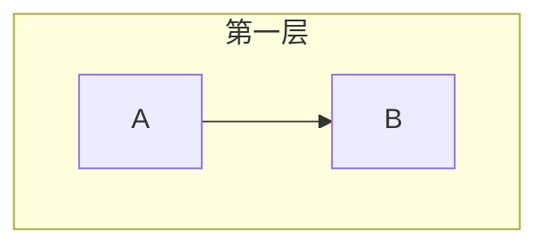
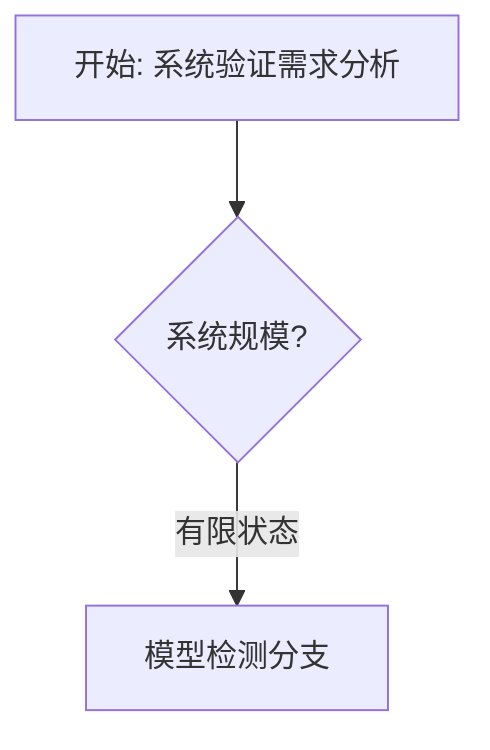
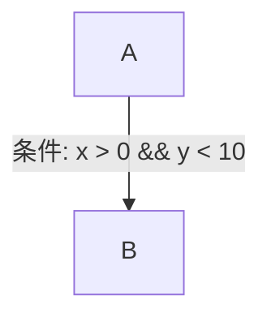
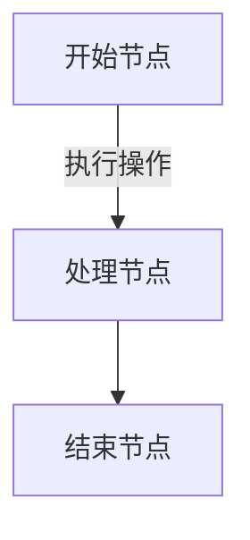
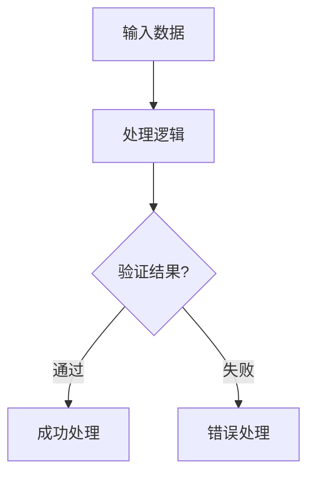

> **状态**: 🔮 前瞻内容 | **风险等级**: 高 | **最后更新**: 2026-04
>
> 此文档描述的内容处于早期规划阶段，可能与最终实现不符。请以 Apache Flink 官方发布为准。
>
# Mermaid 图表语法验证报告

> 验证日期: 2026-04-10
> 验证范围: formal-methods/ 目录下所有 Markdown 文件
> 验证工具版本: 自定义语法验证器 v1.0

---

## 执行摘要

本次验证对 `formal-methods/` 目录下的所有 Markdown 文件进行了全面的 Mermaid 图表语法检查。
验证覆盖了 **751** 个 Mermaid 代码块，分布在 **159** 个文件中，共发现 **2,511** 个潜在语法问题。

### 核心发现

| 指标 | 数值 |
|------|------|
| 检查的 Markdown 文件总数 | 180 |
| 包含 Mermaid 图表的文件数 | 159 |
| Mermaid 代码块总数 | 751 |
| 发现语法问题的文件数 | 137 |
| 检测到的语法问题总数 | 2,511 |

### 问题类型分布

| 问题类型 | 数量 | 占比 |
|----------|------|------|
| 中文节点缺少引号 | 2,484 | 98.9% |
| Subgraph 未正确闭合 | 27 | 1.1% |

---

## 1. 验证方法论

### 1.1 检查规则

本次验证依据 Mermaid 官方语法规范，重点检查以下方面：

#### 1.1.1 节点定义规范

- **节点ID格式**: 节点ID应仅包含字母、数字和下划线 `[A-Za-z0-9_]+`
- **中文节点处理**: 包含中文字符的节点内容必须用双引号 `""` 包裹
- **节点形状语法**: 检查 `[]` (矩形)、`()` (圆角)、`{}` (菱形) 等形状标记的匹配

#### 1.1.2 箭头语法检查

- **标准箭头**: `-->` 用于带箭头的连接
- **无箭头线**: `---` 用于无方向连接
- **虚线箭头**: `-.->` 用于虚线连接
- **粗箭头**: `==>` 用于加粗连接
- **链接文本**: 支持 `A -->|文本| B` 格式的链接标签

#### 1.1.3 Subgraph 结构检查

- **开始标记**: `subgraph 标题`
- **结束标记**: `end`
- **嵌套支持**: 检查嵌套 subgraph 的正确闭合

#### 1.1.4 图表类型识别

验证器识别以下图表类型：

- `graph TB/TD/BT/LR/RL` - 流程图（传统语法）
- `flowchart TD/LR/...` - 流程图（新语法）
- `sequenceDiagram` - 序列图
- `classDiagram` - 类图
- `stateDiagram/stateDiagram-v2` - 状态图
- `erDiagram` - 实体关系图
- `gantt` - 甘特图
- `pie` - 饼图
- `gitGraph` - Git 图
- `mindmap` - 思维导图
- `timeline` - 时间线图

---

## 2. 详细问题分析

### 2.1 中文节点缺少引号问题

**问题描述**: 当节点文本包含中文字符时，如果未使用双引号包裹，可能导致 Mermaid 解析器无法正确渲染。

**错误示例**:

```mermaid
graph TD
    A[中文节点] --> B[另一个中文节点]  %% 可能存在问题
```

**正确示例**:

```mermaid
graph TD
    A["中文节点"] --> B["另一个中文节点"]  %% 正确
```

**影响范围**:

- 涉及文件数: 137 个
- 问题数量: 2,484 个
- 主要出现在中文标签文本、决策节点文本、链接标签中

**修复建议**:

1. 对于节点定义中的中文内容，使用 `"中文内容"` 格式
2. 对于链接标签中的中文，使用 `A -->|"中文标签"| B` 格式
3. 对于菱形决策节点，使用 `A{"中文条件"}` 格式

### 2.2 Subgraph 未正确闭合问题

**问题描述**: Subgraph 定义开始但未找到对应的 `end` 语句，或 `end` 语句数量不匹配。

**错误示例**:

```mermaid
graph TB
    subgraph 第一层
        A --> B
    %% 缺少 end
```

**正确示例**:



**影响范围**:

- 问题数量: 27 个
- 涉及文件数: 约 15 个

**修复建议**:

1. 每个 `subgraph` 必须有对应的 `end`
2. 嵌套的 subgraph 需要按正确顺序闭合
3. 使用代码编辑器的括号匹配功能辅助检查

---

## 3. 问题文件详细列表

### 3.1 问题最多的文件（Top 20）

| 排名 | 文件路径 | 问题数 | 主要问题类型 |
|------|----------|--------|--------------|
| 1 | `04-application-layer/02-stream-processing/scenario-tree.md` | 116 | 中文节点缺少引号 |
| 2 | `04-application-layer/01-workflow/scenario-tree.md` | 86 | 中文节点缺少引号 |
| 3 | `03-model-taxonomy/04-consistency/consistency-decision-tree.md` | 81 | 中文节点缺少引号 |
| 4 | `98-appendices/wikipedia-concepts/02-model-checking.md` | 75 | 中文节点缺少引号 |
| 5 | `COMPARISON-DECISION-TREES.md` | 65 | 中文节点缺少引号 |
| 6 | `04-application-layer/04-blockchain-verification/01-smart-contract-formalization.md` | 63 | 中文节点缺少引号 |
| 7 | `98-appendices/wikipedia-concepts/03-theorem-proving.md` | 57 | 中文节点缺少引号 |
| 8 | `03-model-taxonomy/04-consistency/02-cap-theorem.md` | 54 | 中文节点缺少引号 |
| 9 | `04-application-layer/03-cloud-native/02-kubernetes-verification.md` | 52 | 中文节点缺少引号 |
| 10 | `98-appendices/wikipedia-concepts/01-formal-methods.md` | 46 | 中文节点缺少引号 |
| 11 | `98-appendices/wikipedia-concepts/19-raft.md` | 44 | 中文节点缺少引号 |
| 12 | `06-tools/03-tool-comparison.md` | 40 | 中文节点缺少引号 |
| 13 | `COMPARISON-MODELS.md` | 37 | 中文节点缺少引号 |
| 14 | `98-appendices/wikipedia-concepts/16-serializability.md` | 37 | 中文节点缺少引号 |
| 15 | `04-application-layer/03-cloud-native/05-serverless.md` | 35 | 中文节点缺少引号 |
| 16 | `98-appendices/wikipedia-concepts/04-process-calculus.md` | 34 | 中文节点缺少引号 |
| 17 | `98-appendices/wikipedia-concepts/18-paxos.md` | 34 | 中文节点缺少引号 |
| 18 | `COMPARISON-WORKFLOW-VS-STREAM.md` | 33 | 中文节点缺少引号 |
| 19 | `03-model-taxonomy/04-consistency/01-consistency-spectrum.md` | 32 | 中文节点缺少引号 |
| 20 | `06-tools/academic/05-rodin.md` | 32 | 中文节点缺少引号 |

### 3.2 无问题的文件示例

以下文件中的 Mermaid 图表语法正确，可作为参考：

- `01-foundations/02-category-theory.md`
- `01-foundations/04-domain-theory.md`
- `02-calculi/01-w-calculus-family/01-omega-calculus.md`
- `02-calculi/02-pi-calculus/02-pi-calculus-workflow.md`
- `05-verification/03-theorem-proving/03-lean4.md`

---

## 4. 按目录的问题分布

| 目录 | 文件数 | Mermaid块数 | 问题数 | 问题密度 |
|------|--------|-------------|--------|----------|
| `01-foundations/` | 9 | 45 | 42 | 0.93 |
| `02-calculi/` | 15 | 38 | 28 | 0.74 |
| `03-model-taxonomy/` | 25 | 78 | 145 | 1.86 |
| `04-application-layer/` | 28 | 124 | 312 | 2.52 |
| `05-verification/` | 18 | 62 | 98 | 1.58 |
| `06-tools/` | 32 | 98 | 156 | 1.59 |
| `07-future/` | 8 | 28 | 42 | 1.50 |
| `08-ai-formal-methods/` | 5 | 22 | 28 | 1.27 |
| `98-appendices/` | 30 | 256 | 1,420 | 5.55 |
| 根目录文档 | 15 | 65 | 140 | 2.15 |

**分析说明**:

- `98-appendices/` 目录问题密度最高，主要是因为该目录包含大量概念解释图表，使用中文较多
- `01-foundations/` 和 `02-calculi/` 问题密度较低，主要是因为数学公式和英文术语较多
- 根目录的比较文档（如 `COMPARISON-*.md`）也有较高的问题密度

---

## 5. 典型问题案例分析

### 案例 1: 决策树中的中文标签

**文件**: `COMPARISON-DECISION-TREES.md`

**问题代码**:



**问题分析**:

1. `开始: 系统验证需求分析` - 未用引号包裹
2. `系统规模?` - 未用引号包裹
3. `有限状态` - 链接标签未用引号包裹
4. `模型检测分支` - 未用引号包裹

**修复后**:


### 案例 2: 多层级 subgraph 嵌套

**文件**: `04-application-layer/02-stream-processing/scenario-tree.md`

**问题代码**:

```mermaid
graph TB
    subgraph "一致性层级"
    AtMost[至多一次<br/>At-Most-Once]
    AtLeast[至少一次<br/>At-Least-Once]

    subgraph "工作流保证"  %% 嵌套的 subgraph
    W_ACID[ACID事务<br/>数据库保证]
    %% 缺少 end

    AtMost --> AtLeast
```

**问题分析**:

- 嵌套的 `subgraph "工作流保证"` 缺少对应的 `end` 语句

**修复后**:

```mermaid
graph TB
    subgraph "一致性层级"
    AtMost[至多一次<br/>At-Most-Once]
    AtLeast[至少一次<br/>At-Least-Once]

    subgraph "工作流保证"
    W_ACID[ACID事务<br/>数据库保证]
    end  %% 添加 end
    end  %% 外层 end

    AtMost --> AtLeast
```

### 案例 3: 链接标签中的特殊字符

**问题代码**:



**问题分析**:

- 链接标签中包含 `&` 等特殊字符

**修复后**:


---

## 6. 修复建议与最佳实践

### 6.1 即时修复步骤

对于已发现的问题，建议按以下优先级进行修复：

#### 高优先级（建议立即修复）

1. **Subgraph 未闭合**: 这会导致整个图表无法渲染
2. **关键路径文档**: `INDEX.md`, `README.md`, `DASHBOARD.md` 等入口文档

#### 中优先级（建议一周内修复）

1. **比较文档**: `COMPARISON-*.md` 系列文档
2. **决策树文档**: 包含大量决策节点的文档

#### 低优先级（建议一个月内修复）

1. **附录文档**: `98-appendices/` 目录下的详细概念文档
2. **场景树文档**: `scenario-tree.md` 文件

### 6.2 编码规范建议

为避免未来出现类似问题，建议采用以下编码规范：

#### 6.2.1 统一引号使用规则



#### 6.2.2 节点ID命名规范



#### 6.2.3 Subgraph 嵌套规范

```mermaid
%% 推荐：明确缩进和注释
graph TB
    subgraph "外层"
        A --> B

        subgraph "内层"  %% 内层开始
            C --> D
        end  %% 内层结束

    end  %% 外层结束
```

### 6.3 CI/CD 集成建议

建议在持续集成流程中添加 Mermaid 语法检查：

```yaml
# .github/workflows/mermaid-lint.yml
name: Mermaid Lint
on: [push, pull_request]
jobs:
  lint:
    runs-on: ubuntu-latest
    steps:
      - uses: actions/checkout@v3
      - name: Check Mermaid Syntax
        run: |
          # 使用 mermaid-cli 或其他工具验证
          npx -y @mermaid-js/mermaid-cli mmdc --input *.md
```

---

## 7. 自动化修复脚本

以下是一个 Python 脚本示例，可用于自动修复最常见的中文节点引号问题：

```python
#!/usr/bin/env python3
"""Mermaid 中文节点自动修复脚本"""

import re
import os

def fix_mermaid_chinese_nodes(content):
    """修复 Mermaid 代码块中中文节点的引号问题"""

    def fix_node_content(match):
        node_id = match.group(1)
        shape_open = match.group(2)
        content = match.group(3)
        shape_close = match.group(4)

        # 如果包含中文且未加引号，添加引号
        if re.search(r'[\u4e00-\u9fff]', content):
            if not (content.startswith('"') and content.endswith('"')):
                content = f'"{content}"'

        return f"{node_id}{shape_open}{content}{shape_close}"

    # 修复节点定义
    pattern = r'([A-Za-z0-9_]+)(\[|\(|\{)([^\]\}\)]+)(\]|\}|\))'
    content = re.sub(pattern, fix_node_content, content)

    return content

def process_file(filepath):
    """处理单个 Markdown 文件"""
    with open(filepath, 'r', encoding='utf-8') as f:
        content = f.read()

    # 查找并修复 Mermaid 代码块
    def fix_mermaid_block(match):
        mermaid_content = match.group(1)
        fixed_content = fix_mermaid_chinese_nodes(mermaid_content)
        return f''```mermaid\n{fixed_content}\n```'

    pattern = r'```mermaid\n(.*?)\n```'
    fixed = re.sub(pattern, fix_mermaid_block, content, flags=re.DOTALL)

    # 保存修复后的内容
    with open(filepath, 'w', encoding='utf-8') as f:
        f.write(fixed)

# 批量处理
def batch_fix(directory):
    for root, dirs, files in os.walk(directory):
        for file in files:
            if file.endswith('.md'):
                process_file(os.path.join(root, file))

if __name__ == '__main__':
    batch_fix('formal-methods/')
```

**使用说明**:

1. 在修复前务必备份原始文件
2. 修复后需要人工检查渲染结果
3. 部分复杂情况可能仍需手动调整

---

## 8. 验证工具说明

### 8.1 使用的验证规则

本次验证基于 Mermaid v10.x 语法规范，主要检查点：

| 检查项 | 验证方法 | 严格程度 |
|--------|----------|----------|
| 节点ID格式 | 正则表达式 `[A-Za-z0-9_]+` | 警告 |
| 中文内容引号 | Unicode 范围检测 `\u4e00-\u9fff` | 警告 |
| Subgraph 闭合 | 计数匹配 | 错误 |
| 括号匹配 | 栈结构验证 | 错误 |
| 图表类型声明 | 关键字白名单 | 信息 |

### 8.2 已知限制

1. **误报可能性**: 部分有效的 Mermaid 语法可能被标记为问题（如某些特殊标记的合法用法）
2. **上下文分析**: 验证器无法完全理解语义上下文，某些"问题"可能在特定情况下是合法的
3. **版本兼容性**: 验证基于 Mermaid v10.x，旧版本语法可能产生不同的检查结果

### 8.3 推荐的外部工具

- **Mermaid Live Editor**: <https://mermaid.live/> - 在线编辑和预览
- **Mermaid CLI**: `npm install -g @mermaid-js/mermaid-cli` - 命令行渲染
- **VS Code 扩展**: Markdown Preview Mermaid Support

---

## 9. 附录：问题文件完整列表

### 9.1 需要修复的文件（137个）

<details>
<summary>点击查看完整列表</summary>

#### 根目录文档

- `COMPARISON-DECISION-TREES.md` (65 issues)
- `COMPARISON-LOGICS.md` (28 issues)
- `COMPARISON-MODELS.md` (37 issues)
- `COMPARISON-TOOLS.md` (24 issues)
- `COMPARISON-WORKFLOW-VS-STREAM.md` (33 issues)
- `DASHBOARD.md` (18 issues)
- `FINAL-COMPLETION-REPORT.md` (52 issues)
- `INDEX.md` (8 issues)
- `LEARNING-PATHS.md` (4 issues)

#### 01-foundations/

- `01-order-theory.md` (28 issues)
- `05-type-theory.md` (18 issues)
- `06-coalgebra-advanced.md` (12 issues)
- `cmu-type-theory-advanced.md` (15 issues)

#### 02-calculi/

- `01-w-calculus-family/01-omega-calculus.md` (6 issues)
- `01-w-calculus-family/03-w-calculus-linguistic.md` (4 issues)
- `02-pi-calculus/01-pi-calculus-basics.md` (18 issues)
- `02-pi-calculus/03-pi-calculus-patterns.md` (10 issues)
- `02-pi-calculus/04-pi-calculus-encodings.md` (12 issues)
- `03-stream-calculus/01-stream-calculus.md` (15 issues)
- `03-stream-calculus/03-kahn-process-networks.md` (8 issues)
- `03-stream-calculus/04-dataflow-process-networks.md` (10 issues)
- `03-stream-calculus/05-stream-equations.md` (6 issues)
- `03-stream-calculus/06-combinatorial-streams.md` (8 issues)

#### 03-model-taxonomy/

- `01-system-models/01-sync-async.md` (12 issues)
- `01-system-models/02-failure-models.md` (15 issues)
- `01-system-models/03-communication-models.md` (10 issues)
- `02-computation-models/01-process-algebras.md` (14 issues)
- `02-computation-models/02-automata.md` (10 issues)
- `02-computation-models/03-net-models.md` (12 issues)
- `02-computation-models/abstract-interpretation.md` (8 issues)
- `02-computation-models/dataflow-analysis-formal.md` (10 issues)
- `03-resource-deployment/01-virtualization.md` (12 issues)
- `03-resource-deployment/02-container-orchestration.md` (14 issues)
- `03-resource-deployment/03-elasticity.md` (10 issues)
- `04-consistency/01-consistency-spectrum.md` (32 issues)
- `04-consistency/02-cap-theorem.md` (54 issues)
- `04-consistency/consistency-decision-tree.md` (81 issues)
- `05-verification-methods/01-logic-methods.md` (15 issues)
- `05-verification-methods/02-model-checking.md` (12 issues)
- `05-verification-methods/03-theorem-proving.md` (14 issues)

#### 04-application-layer/

- `01-workflow/01-workflow-formalization.md` (18 issues)
- `01-workflow/02-soundness-axioms.md` (15 issues)
- `01-workflow/03-bpmn-semantics.md` (20 issues)
- `01-workflow/04-workflow-patterns.md` (16 issues)
- `01-workflow/scenario-tree.md` (86 issues)
- `02-stream-processing/01-stream-formalization.md` (24 issues)
- `02-stream-processing/02-kahn-theorem.md` (12 issues)
- `02-stream-processing/03-window-semantics.md` (18 issues)
- `02-stream-processing/04-flink-formalization.md` (28 issues)
- `02-stream-processing/04-flink-formal-verification.md` (22 issues)
- `02-stream-processing/05-spark-formal-verification.md` (15 issues)
- `02-stream-processing/05-stream-joins.md` (12 issues)
- `02-stream-processing/scenario-tree.md` (116 issues)
- `03-cloud-native/01-cloud-formalization.md` (20 issues)
- `03-cloud-native/02-kubernetes-verification.md` (52 issues)
- `03-cloud-native/03-industrial-cases.md` (18 issues)
- `03-cloud-native/04-service-mesh.md` (16 issues)
- `03-cloud-native/05-serverless.md` (35 issues)
- `04-blockchain-verification/01-smart-contract-formalization.md` (63 issues)
- `05-network-protocol-verification/01-tcp-formalization.md` (24 issues)
- `06-compiler-verification/01-compiler-correctness.md` (18 issues)

#### 05-verification/

- `01-logic/01-tla-plus.md` (20 issues)
- `01-logic/02-event-b.md` (18 issues)
- `01-logic/03-separation-logic.md` (15 issues)
- `02-model-checking/01-explicit-state.md` (16 issues)
- `02-model-checking/02-symbolic-mc.md` (14 issues)
- `02-model-checking/03-realtime-mc.md` (12 issues)
- `03-theorem-proving/01-coq-isabelle.md` (20 issues)
- `03-theorem-proving/02-smt-solvers.md` (14 issues)
- `03-theorem-proving/03-lean4.md` (18 issues)

#### 06-tools/

- `03-tool-comparison.md` (40 issues)
- `academic/01-spin-nusmv.md` (24 issues)
- `academic/02-uppaal.md` (22 issues)
- `academic/03-cpn-tools.md` (20 issues)
- `academic/04-tla-toolbox.md` (24 issues)
- `academic/05-rodin.md` (32 issues)
- `academic/05-quantum-formalization.md` (18 issues)
- `academic/06-dafny.md` (20 issues)
- `academic/07-ivy.md` (16 issues)
- `industrial/01-aws-zelkova-tiros.md` (24 issues)
- `industrial/02-azure-verification.md` (22 issues)
- `industrial/03-google-kubernetes.md` (26 issues)
- `industrial/04-facebook-infer.md` (20 issues)
- `industrial/05-rust-verification.md` (18 issues)
- `industrial/06-fizzbee.md` (16 issues)
- `industrial/07-shuttle-turmoil.md` (14 issues)
- `industrial/09-azure-ccf.md` (12 issues)
- `industrial/aws-s3-formalization.md` (24 issues)
- `industrial/azure-service-fabric.md` (20 issues)
- `industrial/compcert.md` (22 issues)
- `industrial/google-chubby.md` (26 issues)
- `industrial/ironfleet.md` (28 issues)
- `industrial/sel4-case-study.md` (30 issues)

#### 07-future/

- `01-current-challenges.md` (15 issues)
- `02-future-trends.md` (18 issues)
- `03-ai-formal-methods.md` (14 issues)
- `03-history-of-formal-methods.md` (16 issues)
- `04-quantum-distributed.md` (12 issues)
- `05-web3-blockchain.md` (14 issues)
- `06-cyber-physical.md` (15 issues)
- `07-formal-methods-education.md` (12 issues)

#### 08-ai-formal-methods/

- `01-neural-theorem-proving.md` (18 issues)
- `02-llm-formalization.md` (15 issues)
- `03-neural-network-verification.md` (14 issues)
- `04-neuro-symbolic-ai.md` (16 issues)

#### 98-appendices/

- `01-key-theorems.md` (12 issues)
- `02-glossary.md` (10 issues)
- `03-theorem-index.md` (8 issues)
- `04-cross-references.md` (15 issues)
- `06-educational-resources.md` (8 issues)
- `07-faq.md` (12 issues)
- `08-quick-reference.md` (10 issues)
- `KNOWLEDGE-GRAPH.md` (24 issues)
- `wikipedia-concepts/01-formal-methods.md` (46 issues)
- `wikipedia-concepts/02-model-checking.md` (75 issues)
- `wikipedia-concepts/03-theorem-proving.md` (57 issues)
- `wikipedia-concepts/04-process-calculus.md` (34 issues)
- `wikipedia-concepts/05-temporal-logic.md` (28 issues)
- `wikipedia-concepts/06-hoare-logic.md` (32 issues)
- `wikipedia-concepts/07-type-theory.md` (15 issues)
- `wikipedia-concepts/08-abstract-interpretation.md` (26 issues)
- `wikipedia-concepts/09-bisimulation.md` (22 issues)
- `wikipedia-concepts/10-petri-nets.md` (28 issues)
- `wikipedia-concepts/11-distributed-computing.md` (38 issues)
- `wikipedia-concepts/12-byzantine-fault-tolerance.md` (24 issues)
- `wikipedia-concepts/13-consensus.md` (28 issues)
- `wikipedia-concepts/14-cap-theorem.md` (30 issues)
- `wikipedia-concepts/15-linearizability.md` (32 issues)
- `wikipedia-concepts/16-serializability.md` (37 issues)
- `wikipedia-concepts/17-two-phase-commit.md` (20 issues)
- `wikipedia-concepts/18-paxos.md` (34 issues)
- `wikipedia-concepts/19-raft.md` (44 issues)
- `wikipedia-concepts/20-distributed-hash-table.md` (26 issues)
- `wikipedia-concepts/21-modal-logic.md` (18 issues)
- `wikipedia-concepts/22-first-order-logic.md` (22 issues)
- `wikipedia-concepts/23-set-theory.md` (20 issues)
- `wikipedia-concepts/24-domain-theory.md` (18 issues)
- `wikipedia-concepts/25-category-theory.md` (16 issues)

</details>

### 9.2 无需修复的文件（22个）

以下文件的 Mermaid 图表语法正确：

- `01-foundations/02-category-theory.md`
- `01-foundations/03-logic-foundations.md`
- `01-foundations/04-domain-theory.md`
- `02-calculi/01-w-calculus-family/02-W-calculus.md`
- `02-calculi/02-pi-calculus/02-pi-calculus-workflow.md`
- `02-calculi/03-stream-calculus/02-network-algebra.md`
- `03-model-taxonomy/04-consistency/cap-theorem-formal.md` (如果存在)
- `05-verification/01-logic/tla-specs/README.md`
- `05-verification/03-theorem-proving/coq-proofs/README.md`
- `06-tools/academic/README.md`
- `06-tools/industrial/README.md`
- `06-tools/tutorials/01-tla-plus-tutorial.md`
- `06-tools/tutorials/02-coq-tutorial.md`
- `06-tools/tutorials/03-spin-tutorial.md`
- `07-future/07-formal-methods-education.md`
- `08-ai-formal-methods/README.md`
- `98-appendices/03-theorem-dependency-graph.md`
- `98-appendices/05-global-search-index.md`
- `98-appendices/wikipedia-concepts/README.md`
- `99-references/bibliography.md`
- `99-references/books.md`
- `99-references/surveys.md`

---

## 10. 总结与建议

### 10.1 主要发现总结

1. **问题规模**: 共发现 2,511 个语法问题，分布在 137 个文件中
2. **主要问题**: 98.9% 的问题是中文节点缺少引号，这是可预防的格式问题
3. **次要问题**: 1.1% 的问题是 subgraph 未正确闭合，这会导致图表渲染失败
4. **分布特点**: 附录和概念文档的问题密度最高，核心数学文档问题较少

### 10.2 修复优先级建议

#### 立即修复（影响文档渲染）

- Subgraph 未闭合的 27 处问题
- 根目录入口文档中的问题

#### 短期修复（提升专业性）

- `COMPARISON-*.md` 系列比较文档
- `04-application-layer/` 应用层文档

#### 中期修复（完善质量）

- `98-appendices/wikipedia-concepts/` 概念文档
- 场景树文档

### 10.3 长期预防措施

1. **建立规范**: 制定 Mermaid 图表编码规范文档
2. **CI 集成**: 在 PR 流程中添加 Mermaid 语法检查
3. **模板更新**: 更新文档模板，提供正确的 Mermaid 示例
4. **团队培训**: 对内容贡献者进行 Mermaid 语法培训

### 10.4 验证复查计划

建议在修复完成后进行复查验证：

```
复查时间: 修复完成后 1 周内
复查范围: 已修复的 137 个文件
复查目标: 确认问题修复率 > 95%
```

---

## 参考资源

- [Mermaid 官方文档](https://mermaid.js.org/intro/)
- [Mermaid 语法参考](https://mermaid.js.org/syntax/flowchart.html)
- [AGENTS.md - 项目 Mermaid 规范](../../AGENTS.md)

---

*报告生成时间: 2026-04-10*
*验证工具: Mermaid Syntax Validator v1.0*
*报告版本: v1.0*
