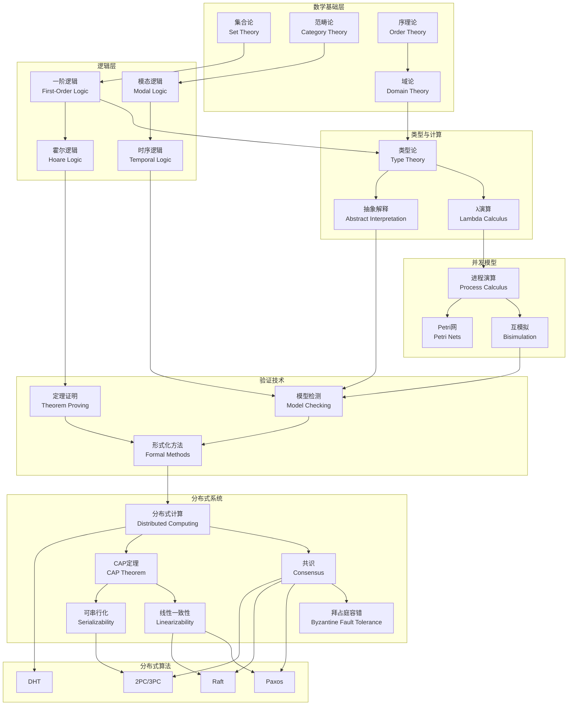
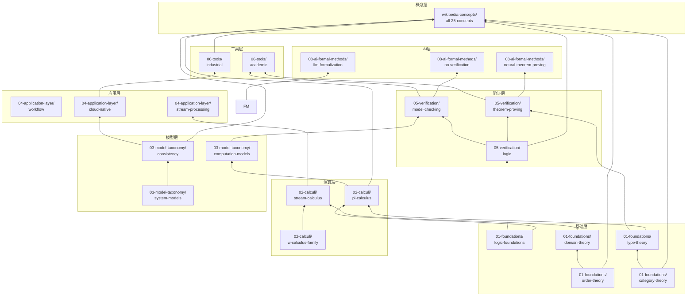
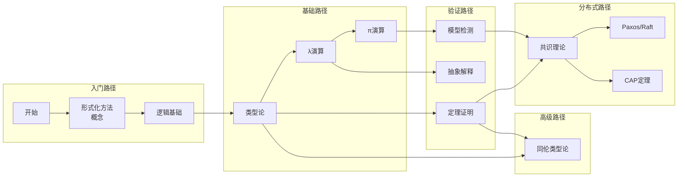
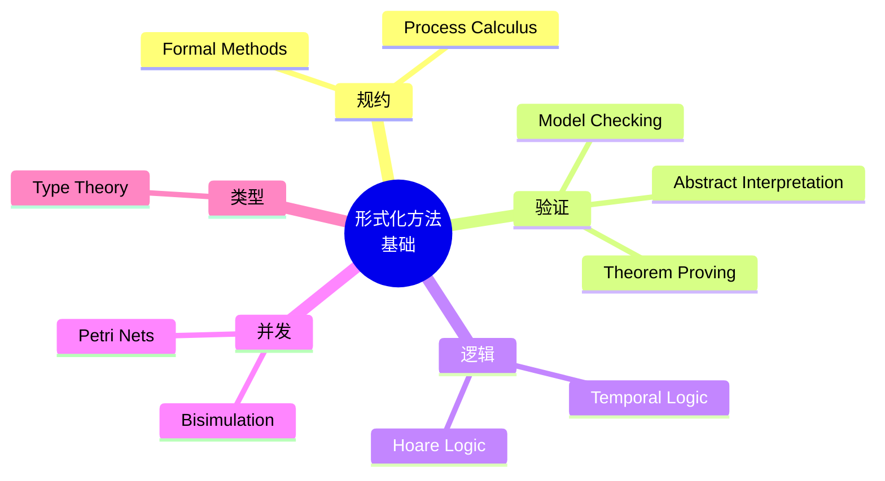
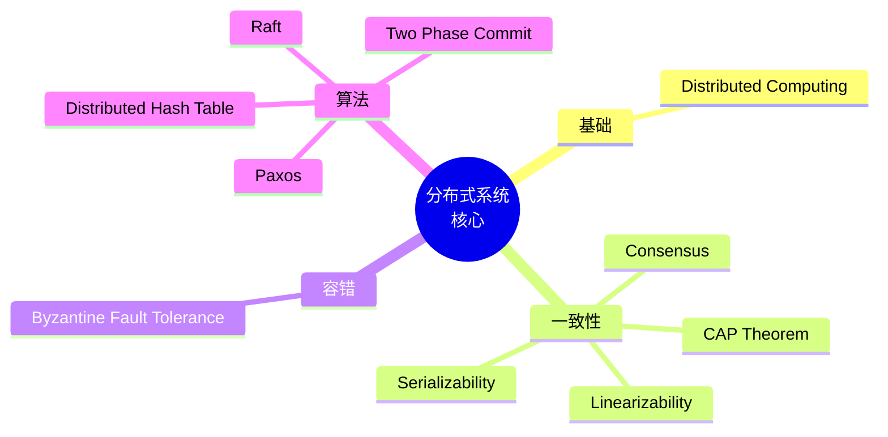
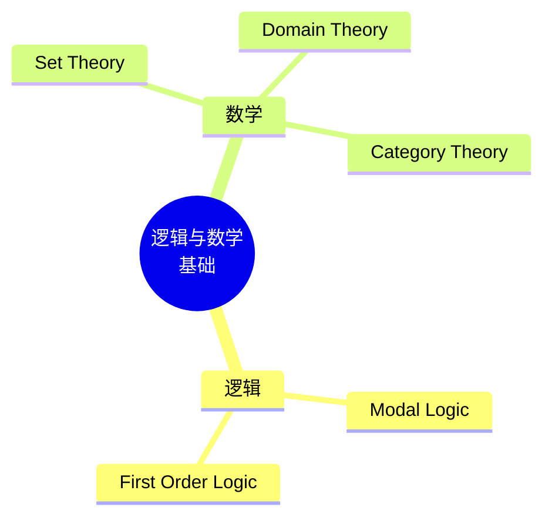

# 形式化方法知识图谱 (Knowledge Graph)

> **所属**: formal-methods/98-appendices
>
> **定位**: 全局知识网络，连接所有核心概念与文档
>
> **版本**: v1.0 | **更新日期**: 2026-04-10

---

## 🌐 全局概念关系图

---

## 📚 文档依赖关系图

---

## 🎯 学习路径图

---

## 🔬 概念深度页导航

### 按类别导航

#### 形式化方法基础 (10个)

#### 分布式系统核心 (10个)

#### 逻辑与数学基础 (5个)

---

## 📊 统计信息

| 指标 | 数值 |
|------|------|
| **核心概念总数** | 25 |
| **文档总数** | 81+ |
| **形式化定义** | 350+ |
| **定理/引理** | 200+ |
| **证明数量** | 100+ |
| **Mermaid图表** | 300+ |
| **引用文献** | 200+ |

---

## 🔗 快速链接

### Wikipedia核心概念深度页
- [形式化方法](wikipedia-concepts/01-formal-methods.md)
- [模型检测](wikipedia-concepts/02-model-checking.md)
- [定理证明](wikipedia-concepts/03-theorem-proving.md)
- [进程演算](wikipedia-concepts/04-process-calculus.md)
- [时序逻辑](wikipedia-concepts/05-temporal-logic.md)
- [霍尔逻辑](wikipedia-concepts/06-hoare-logic.md)
- [类型论](wikipedia-concepts/07-type-theory.md)
- [抽象解释](wikipedia-concepts/08-abstract-interpretation.md)
- [互模拟](wikipedia-concepts/09-bisimulation.md)
- [Petri网](wikipedia-concepts/10-petri-nets.md)
- [分布式计算](wikipedia-concepts/11-distributed-computing.md)
- [拜占庭容错](wikipedia-concepts/12-byzantine-fault-tolerance.md)
- [共识](wikipedia-concepts/13-consensus.md)
- [CAP定理](wikipedia-concepts/14-cap-theorem.md)
- [线性一致性](wikipedia-concepts/15-linearizability.md)
- [可串行化](wikipedia-concepts/16-serializability.md)
- [两阶段提交](wikipedia-concepts/17-two-phase-commit.md)
- [Paxos](wikipedia-concepts/18-paxos.md)
- [Raft](wikipedia-concepts/19-raft.md)
- [分布式哈希表](wikipedia-concepts/20-distributed-hash-table.md)
- [模态逻辑](wikipedia-concepts/21-modal-logic.md)
- [一阶逻辑](wikipedia-concepts/22-first-order-logic.md)
- [集合论](wikipedia-concepts/23-set-theory.md)
- [域论](wikipedia-concepts/24-domain-theory.md)
- [范畴论](wikipedia-concepts/25-category-theory.md)

---

## 📝 维护信息

- **创建日期**: 2026-04-10
- **最后更新**: 2026-04-10
- **维护者**: 形式化方法文档组
- **贡献指南**: 欢迎提交PR补充新的概念关系
