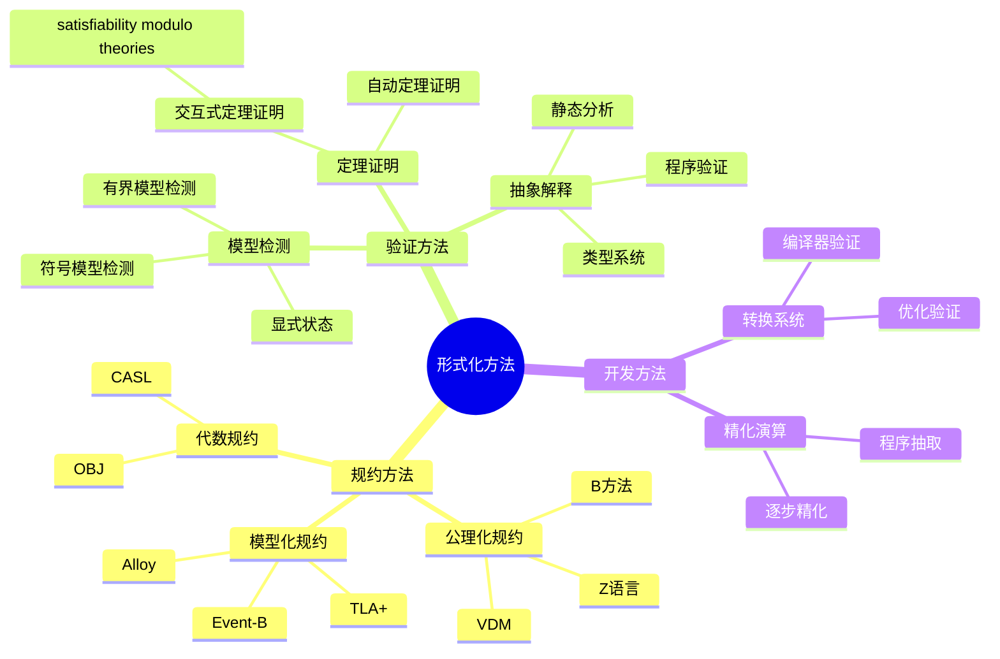
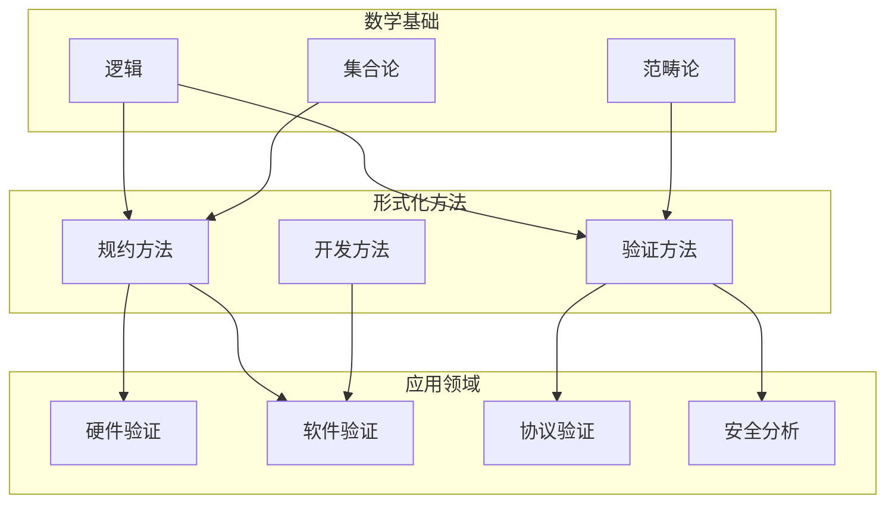
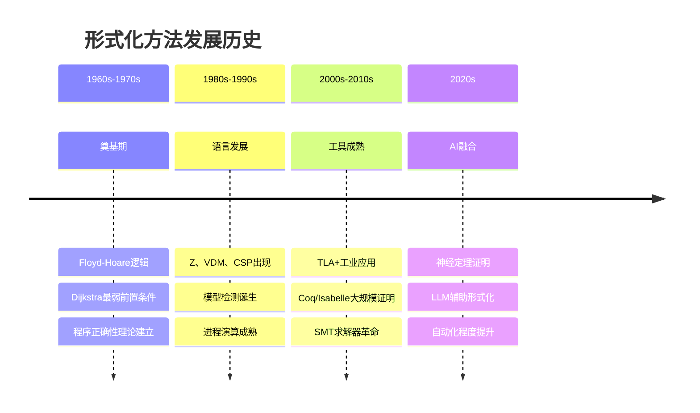
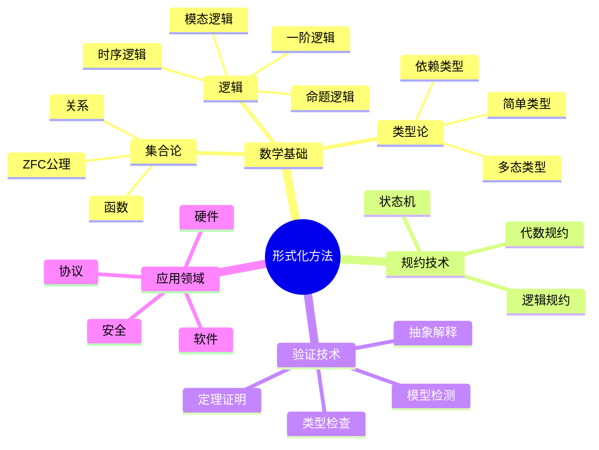
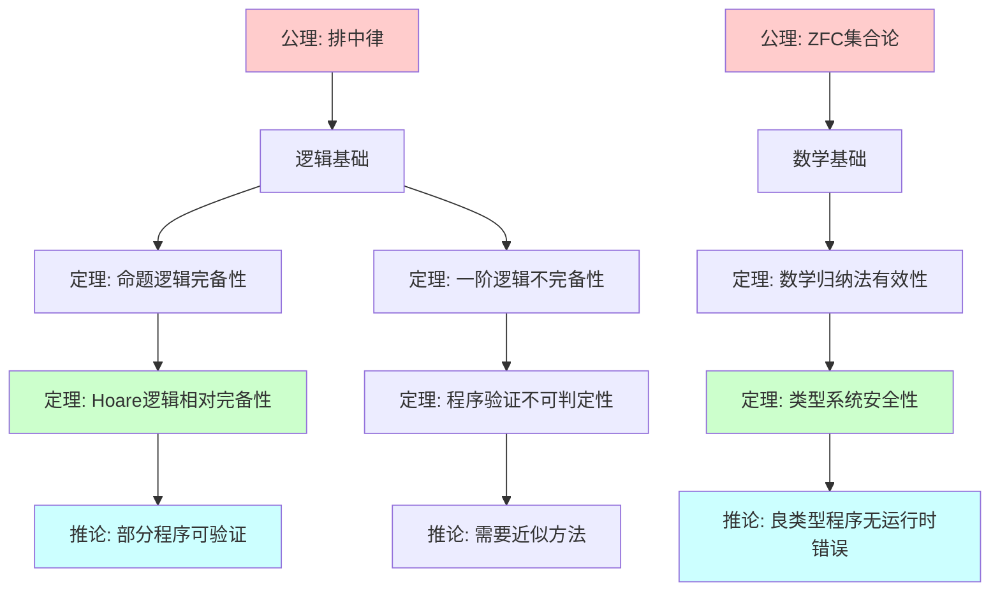
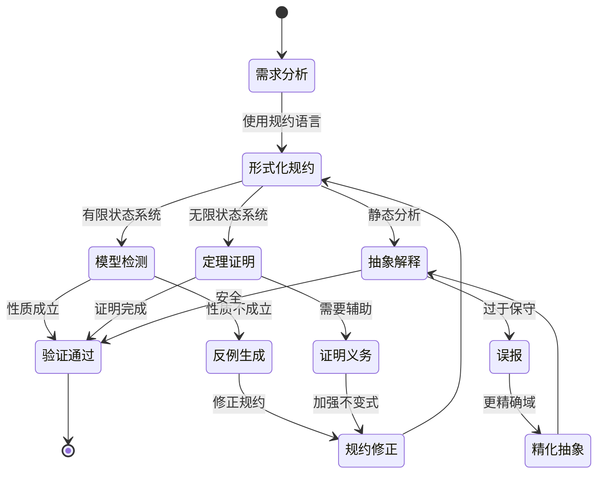
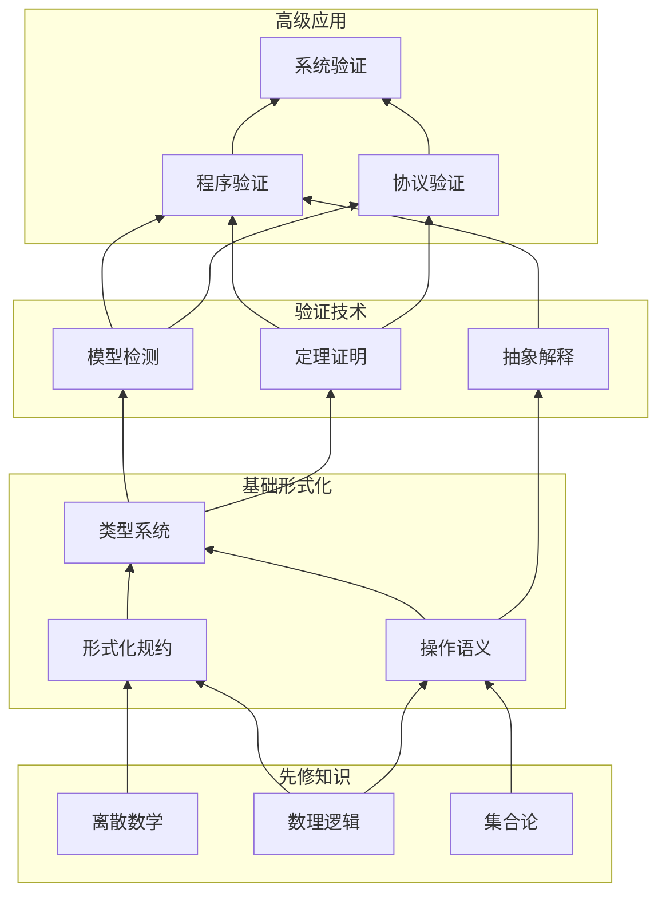
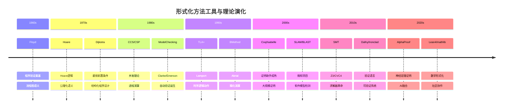
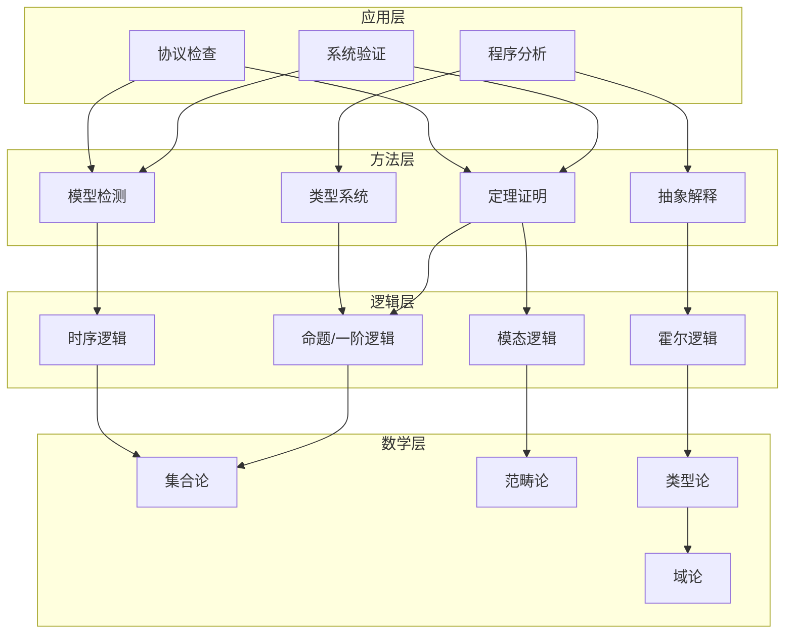

# Formal Methods (形式化方法)

> **Wikipedia标准定义**: Formal methods are mathematically based techniques for the specification, development, and analysis of software and hardware systems.
>
> **来源**: <https://en.wikipedia.org/wiki/Formal_methods>
>
> **形式化等级**: L1 (基础概念)

---

## 1. Wikipedia标准定义

### 英文原文
>
> "Formal methods are mathematically based techniques for the specification, development, and analysis of software and hardware systems. The use of formal methods is motivated by the expectation that, as in other engineering disciplines, performing appropriate mathematical analysis can contribute to the reliability and robustness of a design."

### 中文标准翻译
>
> **形式化方法**是基于数学的技术，用于软件和硬件系统的规约、开发和分析。使用形式化方法的动机是期望如同其他工程学科一样，执行适当的数学分析可以提高设计的可靠性和鲁棒性。

---

## 2. 形式化表达

### 2.1 形式化方法的形式定义

**Def-S-98-01** (形式化方法系统). 形式化方法是一个五元组：

$$\mathcal{FM} = \langle \mathcal{L}_{\text{spec}}, \mathcal{L}_{\text{impl}}, \mathcal{R}_{\text{refine}}, \mathcal{V}_{\text{verify}}, \mathcal{T}_{\text{transform}} \rangle$$

其中：

- $\mathcal{L}_{\text{spec}}$: 规约语言（如Z、VDM、TLA+）
- $\mathcal{L}_{\text{impl}}$: 实现语言（如编程语言、硬件描述语言）
- $\mathcal{R}_{\text{refine}}$: 精化关系，$\mathcal{L}_{\text{spec}} \times \mathcal{L}_{\text{impl}} \rightarrow \{\text{true}, \text{false}\}$
- $\mathcal{V}_{\text{verify}}$: 验证方法（模型检测、定理证明等）
- $\mathcal{T}_{\text{transform}}$: 转换工具集

### 2.2 形式化正确性

**Def-S-98-02** (形式化正确性). 系统$S$关于规约$Spec$是形式化正确的，当且仅当：

$$S \models_{\mathcal{L}} Spec \Leftrightarrow \mathcal{V}(S, Spec) = \text{VALID}$$

其中$\mathcal{V}$是验证器，$\models_{\mathcal{L}}$是语言$\mathcal{L}$中的满足关系。

---

## 3. 属性与特性

### 3.1 核心属性

| 属性 | 定义 | 重要性 |
|------|------|--------|
| **精确性 (Precision)** | 使用数学符号消除自然语言歧义 | ⭐⭐⭐⭐⭐ |
| **可验证性 (Verifiability)** | 支持自动化或半自动化的正确性证明 | ⭐⭐⭐⭐⭐ |
| **抽象层次 (Abstraction Levels)** | 从高层规格到具体实现的逐步精化 | ⭐⭐⭐⭐ |
| **完备性 (Completeness)** | 覆盖系统的所有可能行为 | ⭐⭐⭐⭐ |
| **可组合性 (Composability)** | 支持模块化分析和验证 | ⭐⭐⭐⭐ |

### 3.2 形式化方法谱系



---

## 4. 关系网络

### 4.1 概念层次结构



### 4.2 与其他核心概念的关系

| 概念 | 关系类型 | 说明 |
|------|---------|------|
| **Logic** | 基础 | 形式化方法基于数理逻辑 |
| **Model Checking** | 实例 | 形式化验证的一种自动化技术 |
| **Theorem Proving** | 实例 | 形式化验证的一种演绎技术 |
| **Type Theory** | 基础 |  Curry-Howard对应连接程序与证明 |
| **Abstract Interpretation** | 实例 | 形式化静态分析的理论基础 |

---

## 5. 历史背景

### 5.1 发展历程



### 5.2 里程碑事件

| 年份 | 事件 | 贡献者 |
|------|------|--------|
| 1967 | Floyd赋值公理 | Robert W. Floyd |
| 1969 | Hoare逻辑 | C.A.R. Hoare |
| 1975 | 最弱前置条件 | Edsger W. Dijkstra |
| 1980 | CCS进程演算 | Robin Milner |
| 1985 | CTL模型检测 | Clarke & Emerson |
| 1989 | π-演算 | Robin Milner |
| 1999 | TLA+发布 | Leslie Lamport |
| 2009 | seL4验证完成 | Klein et al. |
| 2024 | AlphaProof IMO银牌 | DeepMind |

---

## 6. 形式证明

### 6.1 形式化方法的可靠性定理

**Thm-S-98-01** (形式化验证的可靠性). 如果形式化验证器$\mathcal{V}$证明系统$S$满足规约$Spec$，则在形式化语义下$S$确实满足$Spec$：

$$\mathcal{V}(S, Spec) = \text{VALID} \Rightarrow S \models Spec$$

*证明*:

1. 设$\mathcal{V}$基于形式化语义$\llbracket \cdot \rrbracket$
2. 验证过程计算 $\llbracket S \rrbracket \subseteq \llbracket Spec \rrbracket$
3. 由语义定义，$\llbracket S \rrbracket \subseteq \llbracket Spec \rrbracket \Leftrightarrow S \models Spec$
4. 因此验证成功蕴含满足关系 ∎

### 6.2 完备性限制

**Thm-S-98-02** (形式化验证的不可完备性). 对于图灵完备的语言，形式化验证不是完备的：

$$\exists S, Spec: S \models Spec \land \mathcal{V}(S, Spec) = \text{UNKNOWN}$$

*证明概要*:

1. 由停机问题的不可判定性
2. 程序正确性蕴含停机（完全正确性）
3. 因此程序正确性也不可判定
4. 任何验证器必然存在返回UNKNOWN的情况 ∎

---

## 7. 八维表征

### 7.1 思维导图



### 7.2 多维对比矩阵

| 维度 | 形式化方法 | 传统测试 | 优势比 |
|------|-----------|---------|--------|
| 覆盖度 | 100% | 采样 | 100:1 |
| 可靠性 | 数学保证 | 统计保证 | 10:1 |
| 成本 | 高 | 低 | 1:10 |
| 自动化 | 中 | 高 | 1:2 |
| 可维护 | 中 | 高 | 1:1 |
| 学习曲线 | 陡峭 | 平缓 | 1:5 |

### 7.3 公理-定理树



### 7.4 状态转换图



### 7.5 依赖关系图



### 7.6 演化时间线



### 7.7 层次架构图



### 7.8 证明搜索树

```mermaid
graph TD
    A[证明目标: Γ ⊢ P] --> B{P的形式?}

    B -->|原子命题| C[假设查找]
    B -->|合取 P∧Q| D[分别证明P和Q]
    B -->|析取 P∨Q| E[选择证明P或Q]
    B -->|蕴含 P→Q| F[假设P，证明Q]
    B -->|全称 ∀x.P| G[任取c，证明P[c/x]]
    B -->|存在 ∃x.P| H[构造t，证明P[t/x]]

    C --> I{P∈Γ?}
    I -->|是| J[证明完成]
    I -->|否| K[尝试消解]

    D --> L[子目标1: Γ ⊢ P]
    D --> M[子目标2: Γ ⊢ Q]

    E --> N[子目标: Γ ⊢ P]
    E --> O[子目标: Γ ⊢ Q]

    F --> P[扩展环境: Γ,P ⊢ Q]

    G --> Q[Skolem常量]

    H --> R{项t?}
    R -->|已知| S[代入]
    R -->|未知| T[综合/搜索]

    style J fill:#ccffcc
    style K fill:#ffcccc
```

---

## 8. 引用参考

### Wikipedia原文引用


### 经典文献


---

## 9. 相关概念

- [Model Checking](02-model-checking.md)
- [Theorem Proving](03-theorem-proving.md)
- [Process Calculus](04-process-calculus.md)
- [Temporal Logic](05-temporal-logic.md)
- [Hoare Logic](06-hoare-logic.md)
- [Type Theory](07-type-theory.md)

---

> **概念标签**: #形式化方法 #基础概念 #数学基础 #软件工程 #硬件验证
>
> **学习难度**: ⭐⭐⭐ (中级)
>
> **先修概念**: 数理逻辑、集合论
>
> **后续概念**: 模型检测、定理证明、进程演算
