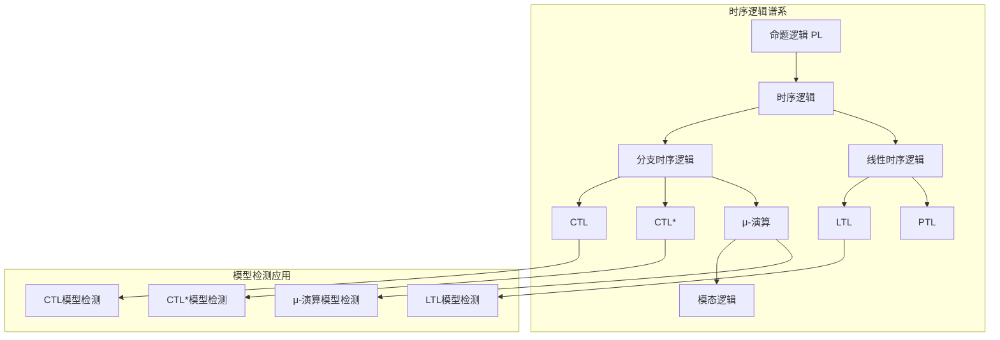
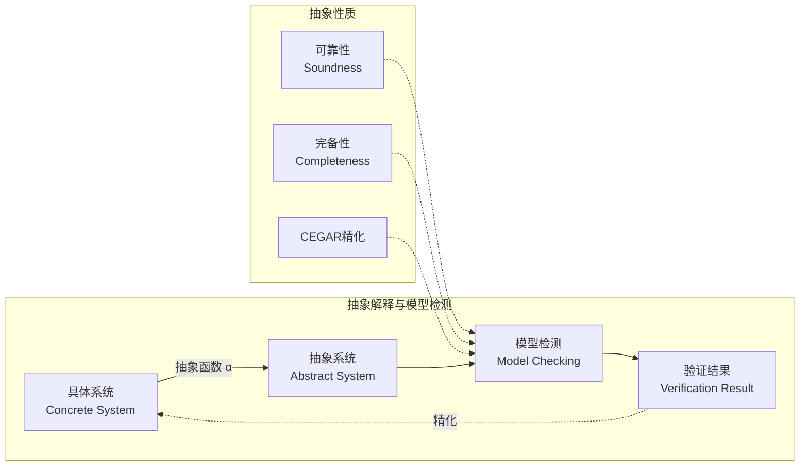
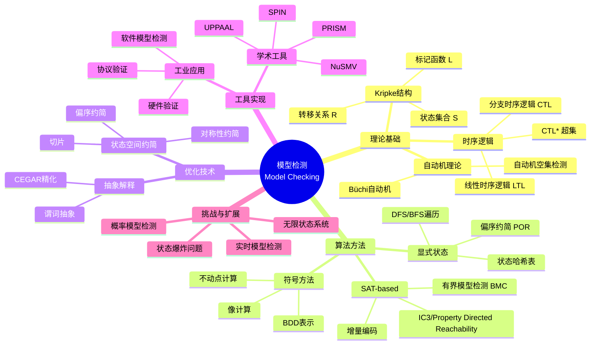
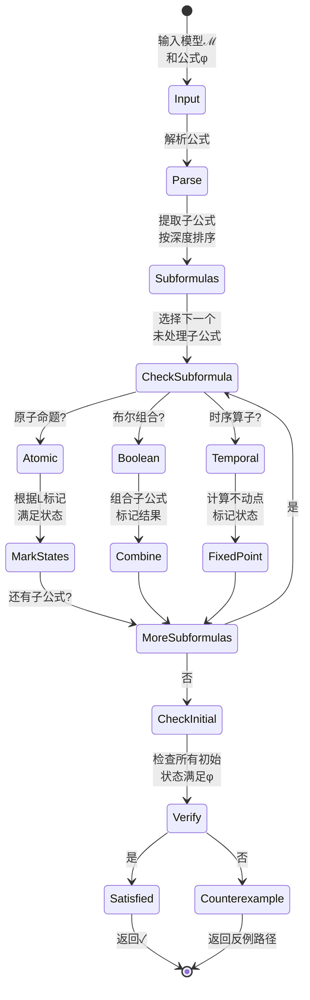
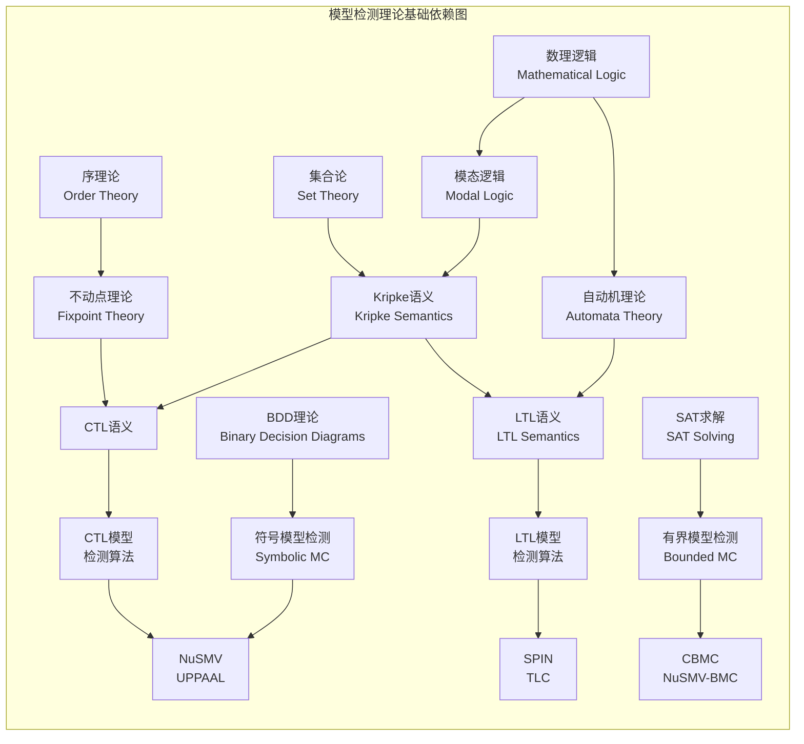
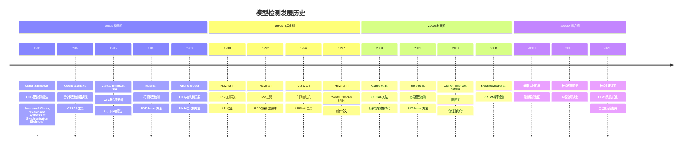
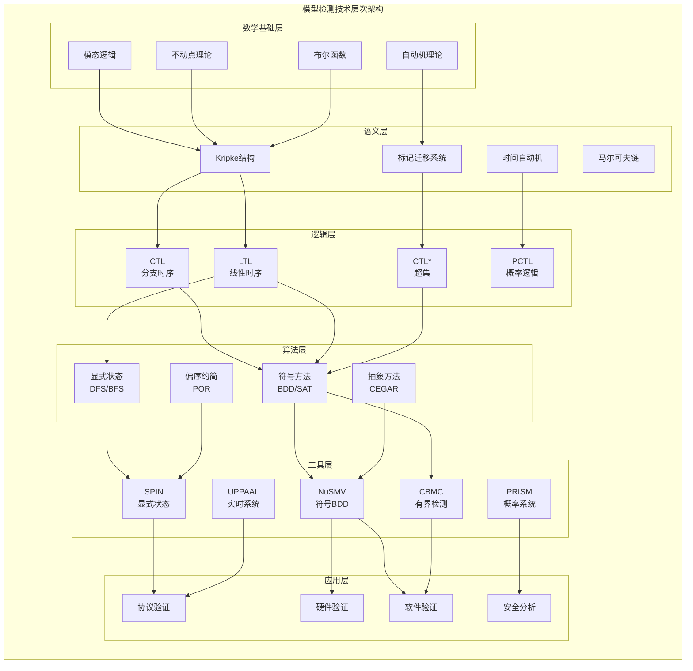
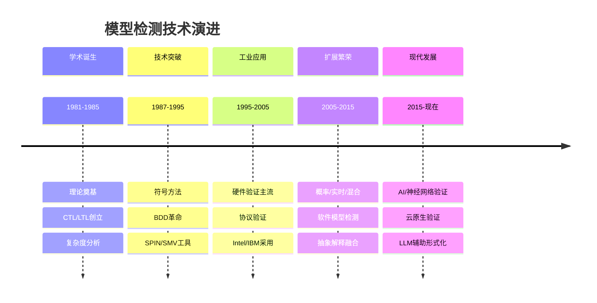

# Model Checking (模型检测)

> **所属阶段**: formal-methods/98-appendices/wikipedia-concepts | **前置依赖**: [01-formal-methods](01-formal-methods.md) | **形式化等级**: L1-L6
>
> **Wikipedia标准定义**: Model checking is a method for checking whether a finite-state model of a system meets a given specification.
>
> **来源**: <https://en.wikipedia.org/wiki/Model_checking>

---

## 1. 概念定义 (Definitions)

### Def-W-02-01 模型检测 (Model Checking)

#### 英文原文 (Wikipedia标准定义)
>
> "In computer science, **model checking** is a method for checking whether a finite-state model of a system meets a given specification. In order to solve such a problem algorithmically, both the model of the system and its specification are formulated in some precise mathematical formalism. To the extent possible, the method uses exhaustive and/or exploratory enumeration of the various states and transitions in the system."

#### 中文标准翻译
>
> 在计算机科学中，**模型检测**是一种验证系统有限状态模型是否满足给定规约的方法。为了算法化地解决此类问题，系统模型及其规约都需用精确的数学形式化方法表述。该方法在可行范围内使用穷尽式和/或探索式枚举来遍历系统中的各种状态和迁移。

#### 形式化定义

**模型检测问题**是一个判定问题：

$$\mathcal{MC}: \mathcal{M} \times \Phi \to \{\top, \bot, \text{CounterExample}\}$$

其中：

- $\mathcal{M}$: 系统模型（通常表示为Kripke结构）
- $\Phi$: 待验证的规约（时序逻辑公式）
- 输出：满足($\top$)、不满足($\bot$)附带反例、或资源耗尽

### Def-W-02-02 Kripke结构 (Kripke Structure)

模型检测的基础语义结构：

$$\mathcal{M} = (S, S_0, R, L, AP)$$

其中各分量定义为：

| 符号 | 含义 | 类型 |
|------|------|------|
| $S$ | 有限状态集合 | 有限集 |
| $S_0 \subseteq S$ | 初始状态集合 | $S$的子集 |
| $R \subseteq S \times S$ | 全转移关系 | 二元关系，满足$\forall s \in S, \exists s' \in S: (s,s') \in R$ |
| $L: S \to 2^{AP}$ | 状态标记函数 | 将状态映射到原子命题集合 |
| $AP$ | 原子命题集合 | 有限集 |

**执行路径**（无限状态序列）：
$$\pi = s_0 s_1 s_2 \ldots \in S^\omega, \quad \text{满足} \forall i \geq 0: (s_i, s_{i+1}) \in R$$

**路径后缀**：
$$\pi^i = s_i s_{i+1} s_{i+2} \ldots$$

### Def-W-02-03 计算树逻辑 (CTL - Computation Tree Logic)

CTL是**分支时序逻辑**，公式由路径量词和时序算子组合构成：

**路径量词** (Path Quantifiers)：

- $\mathbf{A}\phi$: All paths — 所有路径都满足$\phi$
- $\mathbf{E}\phi$: Exists path — 存在一条路径满足$\phi$

**时序算子** (Temporal Operators)：

- $\mathbf{X}\phi$: neXt — 下一状态满足$\phi$
- $\mathbf{F}\phi$: Future — 最终某状态满足$\phi$
- $\mathbf{G}\phi$: Globally — 所有状态都满足$\phi$
- $\phi_1 \mathbf{U} \phi_2$: Until — $\phi_1$持续成立直到$\phi_2$成立

**CTL语法**（BNF范式）：
$$\phi ::= p \ | \ \neg\phi \ | \ \phi \land \phi \ | \ \mathbf{AX}\phi \ | \ \mathbf{EX}\phi \ | \ \mathbf{AF}\phi \ | \ \mathbf{EF}\phi \ | \ \mathbf{AG}\phi \ | \ \mathbf{EG}\phi \ | \ \mathbf{A}(\phi \mathbf{U} \phi) \ | \ \mathbf{E}(\phi \mathbf{U} \phi)$$

**语义定义**：

- $\mathcal{M}, s \models \mathbf{AX}\phi \iff \forall s': (s,s') \in R, \mathcal{M}, s' \models \phi$
- $\mathcal{M}, s \models \mathbf{EX}\phi \iff \exists s': (s,s') \in R, \mathcal{M}, s' \models \phi$
- $\mathcal{M}, s \models \mathbf{AF}\phi \iff$ 从$s$出发的所有路径上最终到达满足$\phi$的状态
- $\mathcal{M}, s \models \mathbf{EF}\phi \iff$ 从$s$出发存在一条路径最终到达满足$\phi$的状态
- $\mathcal{M}, s \models \mathbf{A}(\phi_1 \mathbf{U} \phi_2) \iff$ 所有路径上$\phi_1$持续成立直到$\phi_2$成立
- $\mathcal{M}, s \models \mathbf{E}(\phi_1 \mathbf{U} \phi_2) \iff$ 存在路径上$\phi_1$持续成立直到$\phi_2$成立

### Def-W-02-04 线性时序逻辑 (LTL - Linear Temporal Logic)

LTL描述**单条执行路径**上的性质，不区分分支：

**LTL语法**（BNF范式）：
$$\phi ::= p \ | \ \neg\phi \ | \ \phi \land \phi \ | \ \mathbf{X}\phi \ | \ \mathbf{F}\phi \ | \ \mathbf{G}\phi \ | \ \phi \mathbf{U} \phi$$

**语义**（基于路径$\pi = s_0 s_1 s_2 \ldots$）：

- $\pi \models \mathbf{X}\phi \iff \pi^1 \models \phi$（下一时刻）
- $\pi \models \mathbf{F}\phi \iff \exists i \geq 0: \pi^i \models \phi$（最终成立）
- $\pi \models \mathbf{G}\phi \iff \forall i \geq 0: \pi^i \models \phi$（全局成立）
- $\pi \models \phi_1 \mathbf{U} \phi_2 \iff \exists i \geq 0: (\pi^i \models \phi_2 \land \forall 0 \leq j < i: \pi^j \models \phi_1)$

**系统满足关系**：
$$\mathcal{M} \models \phi \iff \forall s_0 \in S_0, \forall \pi \in \Pi(s_0): \pi \models \phi$$

---

## 2. 属性推导 (Properties)

### Lemma-W-02-01 CTL与LTL表达能力比较

CTL和LTL的表达能力**不可比较**（neither subsumes the other）：

| 公式 | 可表达于 | 不可表达于 | 说明 |
|------|---------|-----------|------|
| $\mathbf{AF}(p \land \mathbf{AX}q)$ | CTL | LTL | 需要分支语义 |
| $\mathbf{F}(p \land \mathbf{X}q)$ | LTL | CTL | 线性路径约束 |
| $\mathbf{AG}(p \Rightarrow \mathbf{EF}q)$ | CTL | LTL | 响应性质的分支形式 |
| $\mathbf{G}(p \Rightarrow \mathbf{F}q)$ | LTL | CTL | LTL响应性质 |

**交集**：以下公式两者都可表达

- $\mathbf{AG}p \equiv \mathbf{G}p$（安全性）
- $\mathbf{AF}p \equiv \mathbf{F}p$（活性）

### Lemma-W-02-02 状态爆炸问题 (State Space Explosion)

对于由$n$个组件组成的并发系统，每个组件有$k$个状态，组合状态空间大小为：

$$|S_{total}| = k^n$$

**具体案例**：

- 两个32位计数器并行：$(2^{32})^2 = 2^{64}$ 状态
- 10个布尔变量：$2^{10} = 1024$ 状态
- 100个布尔变量：$2^{100} \approx 10^{30}$ 状态（约等于地球原子数）

**存储需求估计**：

- 显式枚举每个状态需存储状态标识和标记
- $n$个布尔变量需要$n$位存储每个状态
- 总存储需求为$O(2^n \cdot n)$位

### Prop-W-02-01 模型检测复杂度

| 逻辑 | 时间复杂度 | 空间复杂度 | 复杂度类 |
|-----|-----------|-----------|---------|
| CTL | $O(|\mathcal{M}| \cdot |\phi|)$ | $O(|\mathcal{M}|)$ | P-完全 |
| LTL | $O(|\mathcal{M}| \cdot 2^{|\phi|})$ | PSPACE | PSPACE-完全 |
| CTL* | PSPACE | PSPACE | PSPACE-完全 |
| $\mu$-演算 | $O(|\mathcal{M}| \cdot |\phi|)$ | $O(|\mathcal{M}|)$ | NP $\cap$ co-NP |

其中：

- $|\mathcal{M}| = |S| + |R|$（模型大小）
- $|\phi|$（公式大小）

### Prop-W-02-02 模型检测核心特性

| 特性 | 定义 | 重要性 |
|------|------|--------|
| **自动化 (Automation)** | 验证过程全自动，无需人工干预 | ⭐⭐⭐⭐⭐ |
| **穷尽性 (Exhaustiveness)** | 理论上检查所有可达状态和路径 | ⭐⭐⭐⭐⭐ |
| **反例生成 (Counterexample Generation)** | 验证失败时自动提供反例路径 | ⭐⭐⭐⭐⭐ |
| **有限性 (Finiteness)** | 传统方法限于有限状态系统 | ⭐⭐⭐⭐ |
| **组合性 (Compositionality)** | 支持模块化验证 | ⭐⭐⭐ |

---

## 3. 关系建立 (Relations)

### 3.1 与时序逻辑的关系



**关系说明**：

- **CTL ⊆ CTL* ⊇ LTL**：CTL*是两者的超集
- **模型检测 ↔ 时序逻辑**：模型检测问题是"模型$\mathcal{M}$是否满足公式$\phi$"
- **可满足性 vs 有效性**：模型检测是可满足性问题的特例

### 3.2 与进程演算的关系

| 进程演算 | 对应模型检测 | 验证性质 |
|---------|-------------|---------|
| **CSP** | FDR工具 | 迹等价、死锁检测 |
| **CCS** | CWB工具 | 互模拟检查 |
| **π-演算** | Mobility Workbench | 移动性验证 |
| **Promela** | SPIN | LTL性质 |

**编码关系**：
$$\text{Process Algebra} \xrightarrow{\text{语义映射}} \text{Labeled Transition System} \xrightarrow{\text{模型检测}} \text{Property Check}$$

### 3.3 与抽象解释的关系



**抽象解释对状态爆炸的缓解**：

- **抽象**：$\alpha: \mathcal{C} \to \mathcal{A}$ 将具体域映射到抽象域
- **可靠性**：$\alpha(\mathcal{M}) \models \phi \Rightarrow \mathcal{M} \models \phi$（无假阳性）
- **CEGAR**：Counterexample-Guided Abstraction Refinement

---

## 4. 论证过程 (Argumentation)

### 4.1 状态爆炸缓解策略

**策略谱系**：

| 策略 | 原理 | 有效性 | 工具支持 |
|------|------|--------|---------|
| **抽象 (Abstraction)** | 隐藏无关细节 | ⭐⭐⭐⭐ | SLAM, BLAST |
| **对称约简 (Symmetry Reduction)** | 利用系统对称性 | ⭐⭐⭐ | Murφ |
| **偏序约简 (POR)** | 忽略独立动作交错 | ⭐⭐⭐⭐ | SPIN |
| **符号方法 (Symbolic)** | BDD隐式表示 | ⭐⭐⭐⭐⭐ | NuSMV |
| **有界检测 (BMC)** | 限制搜索深度 | ⭐⭐⭐ | CBMC, NuSMV |
| **组合验证 (Compositional)** | 分组件验证 | ⭐⭐⭐ | ASSUME-GUARANTEE |

**符号方法 vs 显式方法**：

```mermaid
flowchart TD
    A[状态空间] --> B{表示方法}
    B -->|显式| C[状态列表]
    B -->|符号| D[布尔公式/BDD]

    C --> C1[O(#状态)]
    C --> C2[适合稀疏状态]

    D --> D1[O(BDD节点)]
    D --> D2[适合结构化系统]

    C1 --> E[存储需求]
    D1 --> E
```

### 4.2 模型检测 vs 定理证明 vs 测试

| 维度 | 模型检测 | 定理证明 | 测试 |
|-----|---------|---------|------|
| **完备性** | ✅ 完全(有限系统) | ✅ 完全(数学正确) | ❌ 不完备(抽样) |
| **自动化** | ✅ 全自动 | ❌ 交互式 | ✅ 可自动化 |
| **可扩展性** | ⚠️ 状态爆炸 | ✅ 高 | ✅ 高 |
| **反例生成** | ✅ 自动 | ⚠️ 需人工 | ✅ 自动 |
| **适用系统** | 有限状态 | 无限状态 | 任意 |
| **形式化保证** | ✅ 数学保证 | ✅ 数学保证 | ❌ 统计保证 |
| **人工工作量** | 低 | 高 | 中 |
| **典型工具** | SPIN, NuSMV | Coq, Isabelle | JUnit, Selenium |

---

## 5. 形式证明 (Proof / Engineering Argument)

### Thm-W-02-01 模型检测算法正确性定理

**定理**：对于任意Kripke结构$\mathcal{M}$和CTL公式$\phi$，CTL模型检测算法返回$\top$当且仅当$\mathcal{M} \models \phi$。

**形式化表述**：
$$\text{CTL-MC}(\mathcal{M}, \phi) = \top \iff \forall s_0 \in S_0: \mathcal{M}, s_0 \models \phi$$

**算法**（标记法）：

```
算法: CTL-Model-Checking(ℳ, ϕ)
输入: Kripke结构 ℳ = (S, S₀, R, L, AP), CTL公式 ϕ
输出: True 或 反例

1:  // 自底向上标记满足各子公式的状态
2:  for each subformula ψ of ϕ (按公式深度升序) do
3:      case ψ of
4:          p (原子命题):
5:              label[s] ← (p ∈ L(s)) for all s ∈ S
6:          ¬ψ₁:
7:              label[s] ← ¬label₁[s] for all s ∈ S
8:          ψ₁ ∧ ψ₂:
9:              label[s] ← label₁[s] ∧ label₂[s] for all s ∈ S
10:         AXψ₁:
11:             label[s] ← ∀s': (s,s')∈R, label₁[s'] for all s ∈ S
12:         EXψ₁:
13:             label[s] ← ∃s': (s,s')∈R, label₁[s'] for all s ∈ S
14:         AFψ₁:
15:             label ← FixedPoint(λT. {s | label₁[s]} ∪ {s | ∀(s,s')∈R: s'∈T})
16:         EFψ₁:
17:             label ← FixedPoint(λT. {s | label₁[s]} ∪ {s | ∃(s,s')∈R: s'∈T})
18:         AGψ₁:
19:             label ← FixedPoint(λT. {s | label₁[s]} ∩ {s | ∀(s,s')∈R: s'∈T})
20:         EGψ₁:
21:             label ← FixedPoint(λT. {s | label₁[s]} ∩ {s | ∃(s,s')∈R: s'∈T})
22:         A(ψ₁ U ψ₂):
23:             label ← FixedPoint(λT. {s | label₂[s]} ∪ {s | label₁[s] ∧ ∀(s,s')∈R: s'∈T})
24:         E(ψ₁ U ψ₂):
25:             label ← FixedPoint(λT. {s | label₂[s]} ∪ {s | label₁[s] ∧ ∃(s,s')∈R: s'∈T})
26: return (∀s₀ ∈ S₀: label[s₀] = true)
```

**证明要点**：

1. **不动点存在性**：由于$S$有限且标记函数单调，根据Knaster-Tarski定理，最小和最大不动点存在。

2. **语义保持性**：通过结构归纳法证明算法标记与语义等价。
   - 基例：原子命题$p$，根据标记函数$L$直接对应
   - 归纳步：假设子公式正确，复合公式通过相应语义规则保持

3. **终止性**：状态集有限，每个不动点计算最多$|S|$次迭代。

### Thm-W-02-02 CTL模型检测复杂度定理（P-完全）

**定理**：CTL模型检测问题是**P-完全的**。

**形式化表述**：
$$\text{CTL-MC} \in \mathbf{P} \text{ and CTL-MC is P-complete}$$

**证明**：

**第一部分：CTL-MC ∈ P**

对于CTL公式$\phi$和模型$\mathcal{M} = (S, R)$：

1. 算法对每个子公式执行一次不动点计算
2. 子公式数量为$O(|\phi|)$
3. 每个不动点计算最多$|S|$次迭代
4. 每次迭代遍历所有边，复杂度$O(|R|)$

总复杂度：
$$T(CTL\text{-}MC) = O(|\phi| \cdot |S| \cdot |R|) = O(|\phi| \cdot |\mathcal{M}|)$$

这是关于输入规模$|\mathcal{M}| + |\phi|$的多项式时间，因此$\text{CTL-MC} \in \mathbf{P}$。

**第二部分：P-完全性**

通过从**Circuit Value Problem (CVP)**归约证明P-难度：

1. CVP是P-完全问题
2. 给定布尔电路$C$和输入$I$，可在多项式时间内构造Kripke结构$\mathcal{M}_C$
3. 构造CTL公式$\phi$使得$\mathcal{M}_C \models \phi$当且仅当$C(I) = 1$
4. 因此$CVP \leq_p CTL\text{-}MC$

### Thm-W-02-03 LTL模型检测复杂度定理（PSPACE-完全）

**定理**：LTL模型检测问题是**PSPACE-完全的**。

**形式化表述**：
$$\text{LTL-MC} \in \mathbf{PSPACE} \text{ and LTL-MC is PSPACE-complete}$$

**证明**：

**第一部分：LTL-MC ∈ PSPACE**

LTL模型检测通过构造Büchi自动机实现：

1. 将否定公式$\neg\phi$转换为Büchi自动机$\mathcal{A}_{\neg\phi}$
   - 使用Vardi-Wolper构造
   - 自动机大小：$O(2^{|\phi|})$个状态

2. 计算乘积自动机$\mathcal{M} \times \mathcal{A}_{\neg\phi}$
   - 大小：$O(|S| \cdot 2^{|\phi|})$

3. 检查乘积自动机是否接受非空语言
   - 检测可达的接受循环
   - 使用**on-the-fly**算法避免显式构造整个乘积
   - 仅需多项式空间存储当前路径和访问集合

空间复杂度：$O(|\phi| + \log(|\mathcal{M}|))$，因此$\text{LTL-MC} \in \mathbf{NPSPACE} = \mathbf{PSPACE}$（由Savitch定理）。

**第二部分：PSPACE-难度**

通过从**Universality of Regular Expressions**或**QSAT**归约：

1. QSAT（量词化布尔可满足性）是PSPACE-完全问题
2. 给定QSAT实例$Q_1x_1 \ldots Q_nx_n. \psi(x_1, \ldots, x_n)$
3. 构造Kripke结构$\mathcal{M}$编码变量赋值序列
4. 构造LTL公式$\phi$编码量词结构
5. $\mathcal{M} \models \phi$当且仅当QSAT实例为真
6. 因此$QSAT \leq_p LTL\text{-}MC$

**复杂度对比总结**：

| 逻辑 | 复杂度 | 算法核心 | 瓶颈 |
|-----|-------|---------|------|
| CTL | P-完全 | 不动点计算 | 状态空间大小 |
| LTL | PSPACE-完全 | Büchi自动机 | 公式到自动机的指数膨胀 |
| CTL* | PSPACE-完全 | 混合方法 | 分支+线性组合 |

---

## 6. 实例验证 (Examples)

### 6.1 互斥协议验证示例

**系统描述**：两个进程竞争临界区资源

**Kripke结构定义**：

- 状态：$(p_1, p_2)$，其中$p_i \in \{N, T, C\}$（Non-critical, Trying, Critical）
- 总状态数：$3 \times 3 = 9$
- 合法状态（排除$(C, C)$）：8个

**验证性质**：

| 性质 | CTL公式 | 预期 |
|-----|---------|------|
| 互斥 | $\mathbf{AG}(\neg(c_1 \land c_2))$ | ✅ 满足 |
| 无饥饿 | $\mathbf{AG}(t_1 \Rightarrow \mathbf{AF}c_1)$ | ⚠️ 依赖调度 |
| 可达性 | $\mathbf{EF}c_1 \land \mathbf{EF}c_2$ | ✅ 满足 |

**NuSMV代码片段**：

```nusmv
MODULE main
VAR
  p1: {N, T, C};
  p2: {N, T, C};
ASSIGN
  init(p1) := N;
  init(p2) := N;
  next(p1) := case
    p1 = N : {N, T};
    p1 = T & p2 != C : C;
    p1 = C : N;
    TRUE : p1;
  esac;
  next(p2) := case
    p2 = N : {N, T};
    p2 = T & p1 != C : C;
    p2 = C : N;
    TRUE : p2;
  esac;

SPEC AG !(p1 = C & p2 = C)  -- 互斥性质
SPEC AG (p1 = T -> AF p1 = C)  -- 无饥饿
```

### 6.2 交通信号灯控制验证

**性质**（使用LTL）：

- $\mathbf{G}(\neg(green_north \land green_east))$ — 永不同时绿灯
- $\mathbf{G}(red_north \to \mathbf{F}green_north)$ — 红灯后必有绿灯
- $\mathbf{G}(yellow_north \to \mathbf{X}red_north)$ — 黄灯后必是红灯

---

## 7. 可视化 (Visualizations)

### 7.1 思维导图：模型检测概念体系



### 7.2 多维对比矩阵：验证方法对比

```mermaid
flowchart TB
    subgraph "验证方法对比矩阵"
        direction TB

        COMPARISON[| 维度 | 模型检测 | 定理证明 | 测试 | 抽象解释 |]

        subgraph 详细对比
            D1[完备性: 完全/完全/不完备/过近似]
            D2[自动化: 高/低/高/高]
            D3[可扩展性: 有限/高/高/高]
            D4[反例生成: 自动/人工/自动/无]
            D5[适用系统: 有限/无限/任意/无限]
        end
    end
```

**详细对比矩阵**：

| 维度 | 模型检测 | 定理证明 | 测试 | 抽象解释 |
|-----|---------|---------|------|---------|
| **完备性** | ⭐⭐⭐⭐⭐ | ⭐⭐⭐⭐⭐ | ⭐⭐ | ⭐⭐⭐ |
| **自动化** | ⭐⭐⭐⭐⭐ | ⭐⭐ | ⭐⭐⭐⭐⭐ | ⭐⭐⭐⭐⭐ |
| **可扩展性** | ⭐⭐⭐ | ⭐⭐⭐⭐⭐ | ⭐⭐⭐⭐⭐ | ⭐⭐⭐⭐⭐ |
| **反例生成** | ⭐⭐⭐⭐⭐ | ⭐⭐ | ⭐⭐⭐⭐⭐ | ⭐⭐ |
| **形式化保证** | ⭐⭐⭐⭐⭐ | ⭐⭐⭐⭐⭐ | ⭐⭐ | ⭐⭐⭐⭐ |
| **学习曲线** | ⭐⭐⭐ | ⭐ | ⭐⭐⭐⭐⭐ | ⭐⭐⭐ |
| **典型工具** | SPIN, NuSMV | Coq, Isabelle | JUnit, Selenium | ASTREE, Infer |

### 7.3 公理-定理树：Kripke语义公理系统

```mermaid
graph TB
    subgraph "Kripke语义公理系统"
        direction TB

        A1[公理1: 全关系公理<br/>∀s ∈ S: ∃s' ∈ S: (s,s') ∈ R] --> T1
        A2[公理2: 标记一致性<br/>L: S → 2^AP] --> T1
        A3[公理3: 路径存在性<br/>每个状态至少有一条出边] --> T1

        T1[定理1: 无限路径存在性<br/>从任意状态出发存在无限执行路径] --> T2
        T2[定理2: CTL语义良定义性<br/>所有CTL公式有确定语义值] --> T3
        T3[定理3: 不动点存在性<br/>单调函数在有限格上有不动点] --> T4
        T4[定理4: 模型检测可判定性<br/>有限Kripke结构上的CTL检测可判定]

        subgraph 推理规则
            R1[Modus Ponens]<br/>φ, φ→ψ ⊢ ψ
            R2[Necessitation]<br/>⊢ φ ⇒ ⊢ ☐φ
            R3[路径归纳]<br/>沿所有路径归纳证明
        end
    end
```

### 7.4 状态转换图：模型检测算法流程



### 7.5 依赖关系图



### 7.6 演化时间线



### 7.7 层次架构图



### 7.8 证明搜索树：符号模型检测

```mermaid
graph TB
    subgraph "符号模型检测证明搜索树"
        direction TB

        ROOT[目标: 验证 ℳ ⊨ φ] --> DECOMPOSE{公式分解}

        DECOMPOSE --> SUB1[子目标1: φ = p<br/>原子命题]
        DECOMPOSE --> SUB2[子目标2: φ = ¬ψ<br/>否定]
        DECOMPOSE --> SUB3[子目标3: φ = ψ₁ ∧ ψ₂<br/>合取]
        DECOMPOSE --> SUB4[子目标4: φ = AXψ<br/>全称下一时]
        DECOMPOSE --> SUB5[子目标5: φ = EXψ<br/>存在下一时]
        DECOMPOSE --> SUB6[子目标6: φ = AFψ<br/>全称最终]
        DECOMPOSE --> SUB7[子目标7: φ = EFψ<br/>存在最终]

        SUB1 --> SOL1[BDD(S_p)<br/>直接标记]

        SUB2 --> SOL2[BDD(S_ψ)补运算<br/>¬BDD_ψ]

        SUB3 --> SOL3[BDD_ψ₁ ∧ BDD_ψ₂<br/>Apply算法]

        SUB4 --> SOL4[∀ V': T(V,V') → BDD_ψ(V')<br/>全称量化]

        SUB5 --> SOL5[∃ V': T(V,V') ∧ BDD_ψ(V')<br/>存在量化]

        SUB6 --> ITER1{不动点迭代<br/>μZ.ψ ∨ AX Z}
        ITER1 -->|迭代1| I1[BDD₁ = BDD_ψ]
        ITER1 -->|迭代i+1| I2[BDD_{i+1} = BDD_ψ ∨ AX BDD_i]
        ITER1 -->|收敛| SOL6[BDD_AFψ]

        SUB7 --> ITER2{不动点迭代<br/>μZ.ψ ∨ EX Z}
        ITER2 -->|迭代1| J1[BDD₁ = BDD_ψ]
        ITER2 -->|迭代i+1| J2[BDD_{i+1} = BDD_ψ ∨ EX BDD_i]
        ITER2 -->|收敛| SOL7[BDD_EFψ]

        SOL1 --> COMBINE[组合结果]
        SOL2 --> COMBINE
        SOL3 --> COMBINE
        SOL4 --> COMBINE
        SOL5 --> COMBINE
        SOL6 --> COMBINE
        SOL7 --> COMBINE

        COMBINE --> CHECK{检查初始状态<br/>S₀ ⊆ SAT(φ)?}
        CHECK -->|是| VALID[✓ 验证通过]
        CHECK -->|否| INVALID[✗ 提供反例<br/>BDD路径提取]
    end
```

---

## 8. 历史背景 (Historical Context)

### 8.1 关键里程碑

| 年份 | 贡献者 | 贡献 | 意义 |
|-----|-------|------|------|
| **1981** | Clarke & Emerson | CTL模型检测 | **创立分支时序逻辑模型检测** [^1] |
| **1982** | Queille & Sifakis | CESAR工具 | 首个模型检测器实现 [^2] |
| **1987** | McMillan | 符号模型检测 | BDD突破状态爆炸限制 [^3] |
| **1988** | Vardi & Wolper | LTL与自动机 | Büchi自动机方法 [^4] |
| **1990** | Holzmann | SPIN | 工业级LTL验证工具 [^5] |
| **1992** | Burch et al. | 10²⁰状态 | 符号方法威力展示 [^3] |
| **2000** | Clarke et al. | CEGAR | 反例制导抽象精化 [^6] |
| **2007** | Clarke, Emerson, Sifakis | **图灵奖** | "开发模型检测，实现硬件和软件验证自动化" [^7] |

### 8.2 2007年图灵奖

**获奖理由** (ACM官方)：
> "For developing Model-Checking into a highly effective verification technology that is widely adopted in the hardware and software industries."
> （将模型检测发展为一种被广泛采用的高效验证技术，应用于硬件和软件工业）

**三位获奖者贡献**：

- **Edmund M. Clarke** (CMU)：CTL创立，符号模型检测
- **E. Allen Emerson** (UT Austin)：CTL复杂度分析，不动点算法
- **Joseph Sifakis** (VERIMAG)：CESAR工具，实时系统扩展

### 8.3 模型检测发展简史



---

## 9. 引用参考 (References)

### Wikipedia 参考


### 经典文献

[^1]: E. M. Clarke and E. A. Emerson, "Design and Synthesis of Synchronization Skeletons Using Branching-Time Temporal Logic," *Logic of Programs*, LNCS 131, 1981. <https://doi.org/10.1007/BFb0025774>

[^2]: J. P. Queille and J. Sifakis, "Specification and verification of concurrent systems in CESAR," *5th International Symposium on Programming*, 1982. <https://doi.org/10.1007/3-540-11494-7_22>

[^3]: J. R. Burch, E. M. Clarke, K. L. McMillan, D. L. Dill, and L. J. Hwang, "Symbolic Model Checking: 10^20 States and Beyond," *Information and Computation*, 98(2), 1992. <https://doi.org/10.1016/0890-5401(92)90017-A>

[^4]: M. Y. Vardi and P. Wolper, "An Automata-Theoretic Approach to Automatic Program Verification," *Proceedings of LICS*, 1986. <https://doi.org/10.1109/LICS.1986.13>

[^5]: G. J. Holzmann, "The Model Checker SPIN," *IEEE Transactions on Software Engineering*, 23(5), 1997. <https://doi.org/10.1109/32.588521>

[^6]: E. Clarke, O. Grumberg, S. Jha, Y. Lu, and H. Veith, "Counterexample-Guided Abstraction Refinement," *CAV 2000*, LNCS 1855. <https://doi.org/10.1007/10722167_15>

[^7]: ACM Turing Award 2007, "Edmund M. Clarke, E. Allen Emerson, and Joseph Sifakis," <https://amturing.acm.org/award_winners/clarke_1167964.cfm>

### 教材与专著


### 在线资源


---

## 附录：CTL/LTL语义对照表

| 自然语言性质 | CTL公式 | LTL公式 | 说明 |
|------------|---------|---------|------|
| 安全性：永不发生坏事件 | $\mathbf{AG}\neg p$ | $\mathbf{G}\neg p$ | 两者等价 |
| 活性：最终发生好事件 | $\mathbf{AF}p$ | $\mathbf{F}p$ | 两者等价 |
| 响应：请求后必有响应 | $\mathbf{AG}(req \Rightarrow \mathbf{AF}ack)$ | $\mathbf{G}(req \Rightarrow \mathbf{F}ack)$ | 两者等价 |
| 分支选择 | $\mathbf{AG}(req \Rightarrow \mathbf{EF}grant)$ | 不可表达 | CTL特有 |
| 强公平性 | $\mathbf{AGF}enabled \Rightarrow \mathbf{AGF}executed$ | 需扩展 | 复杂公平性 |
| 路径特定 | 不可表达 | $\mathbf{F}(p \land \mathbf{X}q)$ | LTL特有 |

---

*文档版本: v1.0 | 创建日期: 2026-04-10 | 最后更新: 2026-04-10*
