# Theorem Proving (定理证明)

> **Wikipedia标准定义**: Automated theorem proving (ATP) is a subfield of automated reasoning and mathematical logic dealing with proving mathematical theorems by computer programs. Interactive theorem proving (ITP) is a related concept where the user guides the proof process.
>
> **来源**: <https://en.wikipedia.org/wiki/Automated_theorem_proving>
>
> **形式化等级**: L2 (进阶概念)

---

## 1. Wikipedia标准定义

### 1.1 自动定理证明 (ATP)

**英文原文**
> "Automated theorem proving (ATP) is a subfield of automated reasoning and mathematical logic dealing with proving mathematical theorems by computer programs. Automated reasoning over mathematical proof was a major impetus for the development of computer science."

**中文标准翻译**
> **自动定理证明**是自动推理和数理逻辑的一个子领域，研究使用计算机程序来证明数学定理。对数学证明的自动推理是计算机科学发展的重要推动力。

### 1.2 交互式定理证明 (ITP)

**英文原文**
> "Interactive theorem proving (ITP) is the field of computer science and mathematical logic concerned with the development and use of formal proof assistants, which are software tools that help users create formal proofs."

**中文标准翻译**
> **交互式定理证明**是计算机科学和数理逻辑的一个领域，关注形式证明助手（帮助用户创建形式证明的软件工具）的开发和使用。

### 1.3 ATP vs ITP 对比

| 特性 | 自动定理证明 (ATP) | 交互式定理证明 (ITP) |
|------|-------------------|---------------------|
| **自动化程度** | 全自动 | 人机协作 |
| **适用范围** | 一阶逻辑、命题逻辑 | 高阶逻辑、类型论 |
| **典型工具** | Vampire, E-Prover, Z3 | Coq, Isabelle, Lean, Agda |
| **用户角色** | 被动观察 | 主动引导证明策略 |
| **适用问题** | 中等复杂度逻辑问题 | 复杂数学定理、程序验证 |
| **输出结果** | 是/否/未知 | 可检查的证明项 |

---

## 2. 形式化表达

### 2.1 证明系统的形式定义

**Def-W-03-01** (形式证明系统). 一个形式证明系统 $\mathcal{P}$ 是一个四元组：

$$\mathcal{P} = \langle \mathcal{L}, \mathcal{A}, \mathcal{R}, \vdash \rangle$$

其中：

- $\mathcal{L}$: 形式语言（语法集合）
- $\mathcal{A} \subseteq \mathcal{L}$: 公理集合（无需证明的基本命题）
- $\mathcal{R}$: 推理规则集合，每条规则 $r \in \mathcal{R}$ 具有形式：$\frac{\Gamma \vdash \varphi_1 \quad \cdots \quad \Gamma \vdash \varphi_n}{\Gamma \vdash \varphi}$
- $\vdash \subseteq 2^{\mathcal{L}} \times \mathcal{L}$: 可推导关系

**Def-W-03-02** (形式证明). 公式 $\varphi$ 从假设 $\Gamma$ 的形式证明是一个有限序列 $\pi = (\psi_1, \psi_2, \ldots, \psi_n)$，其中：

- $\psi_n = \varphi$（最终结论是目标公式）
- 对每个 $i \in [1,n]$，$\psi_i$ 满足以下条件之一：
  1. $\psi_i \in \Gamma$（假设）
  2. $\psi_i \in \mathcal{A}$（公理）
  3. $\exists r \in \mathcal{R}, \exists j_1,\ldots,j_k < i: \psi_i = r(\psi_{j_1}, \ldots, \psi_{j_k})$（推理规则应用）

### 2.2 自然演绎推理规则

**定义** (自然演绎系统 $\mathcal{N}$). 核心推理规则包括：

**命题逻辑规则：**

$$\text{($\land$-Intro)} \quad \frac{\Gamma \vdash \varphi \quad \Gamma \vdash \psi}{\Gamma \vdash \varphi \land \psi}
\qquad
\text{($\land$-Elim)} \quad \frac{\Gamma \vdash \varphi \land \psi}{\Gamma \vdash \varphi}$$

$$\text{($\rightarrow$-Intro)} \quad \frac{\Gamma, \varphi \vdash \psi}{\Gamma \vdash \varphi \rightarrow \psi}
\qquad
\text{($\rightarrow$-Elim/MP)} \quad \frac{\Gamma \vdash \varphi \rightarrow \psi \quad \Gamma \vdash \varphi}{\Gamma \vdash \psi}$$

$$\text{($\forall$-Intro)} \quad \frac{\Gamma \vdash \varphi[x/c]}{\Gamma \vdash \forall x.\varphi} \text{ (}c\text{不在}\Gamma\text{中出现)}$$

$$\text{($\forall$-Elim)} \quad \frac{\Gamma \vdash \forall x.\varphi}{\Gamma \vdash \varphi[x/t]}$$

### 2.3 归结原理的形式化

**Def-W-03-03** (子句与子句集).

- 子句 $C$ 是文字的析取：$C = L_1 \lor L_2 \lor \cdots \lor L_n$
- 文字 $L$ 是原子公式或其否定：$L = p$ 或 $L = \neg p$
- 空子句 $\square$ 表示矛盾

**Def-W-03-04** (归结规则). 给定两个子句：

- $C_1 = P \lor C_1'$（包含正文字 $P$）
- $C_2 = \neg P \lor C_2'$（包含负文字 $\neg P$）

归结式为：$\text{Res}(C_1, C_2) = C_1' \lor C_2'$

**定义** (归结证明). 子句集 $S$ 的归结证明是子句序列 $(C_1, C_2, \ldots, C_n)$，其中：

- $C_n = \square$（空子句）
- 每个 $C_i$ 或是 $S$ 中的子句，或是前面两个子句的归结式

### 2.4 Curry-Howard对应

**Def-W-03-05** (Curry-Howard同构). 直觉主义命题逻辑与简单类型 $\lambda$-演算之间存在对应关系：

| 逻辑侧 | 计算侧 |
|--------|--------|
| 命题 $\varphi$ | 类型 $A$ |
| 证明 $\pi$ | $\lambda$-项 $t$ |
| $\varphi \rightarrow \psi$ | 函数类型 $A \rightarrow B$ |
| $\varphi \land \psi$ | 积类型 $A \times B$ |
| $\varphi \lor \psi$ | 和类型 $A + B$ |
| 证明归约 | $\beta$-规约 |
| 无切割证明 | 正规形式 |

形式化表达：
$$\Gamma \vdash \varphi \text{ (可证)} \quad \Leftrightarrow \quad \exists t. \Gamma \vdash t : \varphi \text{ (可类型)}$$

### 2.5 高阶逻辑与依赖类型

**Def-W-03-06** (简单类型高阶逻辑). 类型定义：

$$\tau ::= \iota \mid \omicron \mid \tau \rightarrow \tau$$

其中：

- $\iota$: 个体类型
- $\omicron$: 命题类型（真值类型）
- $\tau_1 \rightarrow \tau_2$: 函数类型

**Def-W-03-07** (依赖类型). 依赖函数类型（$\Pi$-类型）：

$$(x : A) \rightarrow B(x) \quad \text{或} \quad \Pi x:A. B(x)$$

表示依赖于 $x$ 的函数，当 $B$ 不依赖于 $x$ 时退化为普通函数类型 $A \rightarrow B$。

---

## 3. 属性与特性

### 3.1 核心属性

| 属性 | 定义 | ATP | ITP |
|------|------|-----|-----|
| **可靠性 (Soundness)** | 证明的结论必真 | ✅ | ✅ |
| **完备性 (Completeness)** | 真命题必可证 | 受限 | 人工保证 |
| **可判定性 (Decidability)** | 存在算法判定 | 一阶逻辑 | 否 |
| **表达力 (Expressiveness)** | 可表达的概念范围 | 中 | 高 |
| **自动化 (Automation)** | 人工干预程度 | 高 | 中 |

### 3.2 证明搜索策略

| 策略 | 适用场景 | 特点 |
|------|---------|------|
| **归结 (Resolution)** | 一阶逻辑 | 完备、高效 |
| **表列法 (Tableaux)** | 模态逻辑 | 直观、易于实现 |
| **连接法 (Connection)** | 一阶逻辑 | 目标导向 |
| **SMT求解** | 理论组合 | 工业级效率 |
| **Tactical证明** | 高阶逻辑 | 结构化、可组合 |

### 3.3 证明即程序特性

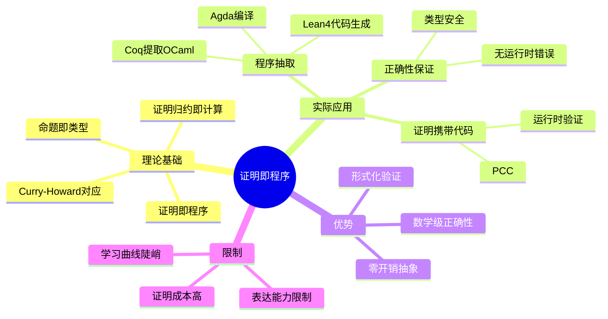

### 3.4 主要定理证明器特性对比

| 系统 | 逻辑基础 | 主要特性 | 著名应用 |
|------|---------|---------|---------|
| **Coq** | 归纳构造演算 | 依赖类型、抽取 | CompCert编译器、四色定理 |
| **Isabelle/HOL** | 高阶逻辑 | 自动化策略 | seL4微内核、JavaCard |
| **Lean** | 依赖类型 | 现代元编程 | Mathlib、LiquidTensor |
| **Agda** | 依赖类型 | 证明相关 | 类型论研究 |
| **Twelf** | LF逻辑框架 | 高阶抽象语法 | 编程语言元理论 |

---

## 4. 关系网络

### 4.1 概念层次结构

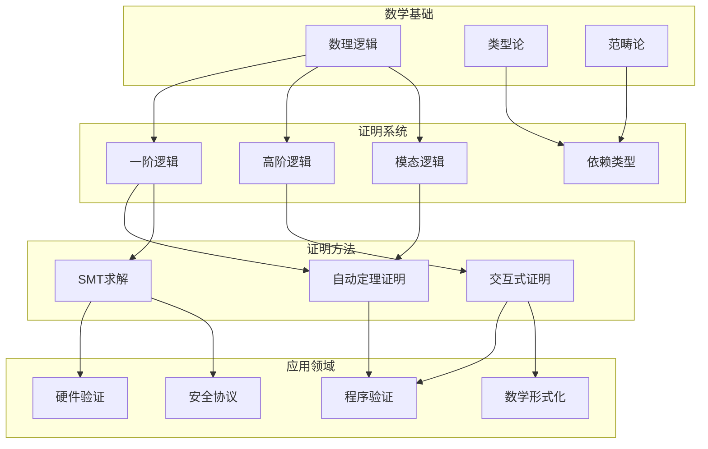

### 4.2 与其他核心概念的关系

| 概念 | 关系类型 | 说明 |
|------|---------|------|
| **一阶逻辑 (FOL)** | 基础 | ATP的核心处理对象，可判定但不完备 |
| **类型论** | Curry-Howard | 证明与程序的深层对应 |
| **Hoare逻辑** | 应用实例 | 程序正确性验证的形式系统 |
| **模型检测** | 互补技术 | ATP处理无限状态，模型检测处理有限状态 |
| **抽象解释** | 近似方法 | 用于程序分析，可生成证明义务 |

### 4.3 定理证明与Hoare逻辑的集成

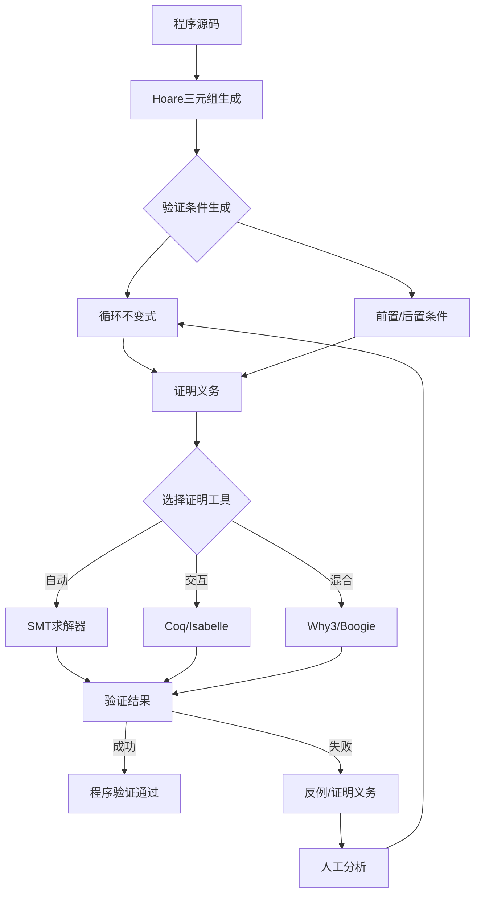

---

## 5. 历史背景

### 5.1 发展历程

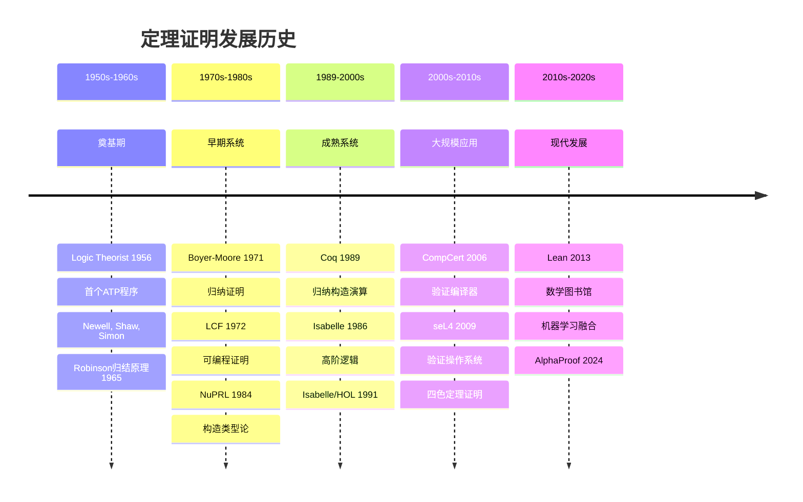

### 5.2 里程碑事件

| 年份 | 事件 | 贡献者 | 意义 |
|------|------|--------|------|
| 1956 | **Logic Theorist** | Newell, Shaw, Simon | 首个自动定理证明程序，证明《数学原理》中的定理 |
| 1965 | **归结原理** | J.A. Robinson | 一阶逻辑完备的半可判定算法，ATP的理论基础 |
| 1972 | **LCF系统** | Milner et al. | 可编程证明助手范式，引入元语言ML |
| 1979 | **Boyer-Moore** | Boyer, Moore | 归纳定理证明，验证计算系统 |
| 1984 | **NuPRL** | Constable et al. | 构造类型论实现，证明即程序 |
| 1986 | **Isabelle** | Paulson | 通用逻辑框架，支持多种逻辑 |
| 1989 | **Coq** | INRIA | 归纳构造演算，依赖类型证明助手 |
| 1991 | **Isabelle/HOL** | Nipkow et al. | 高阶逻辑自动化，工业级应用 |
| 2004 | **四色定理** | Gonthier | 首次完全形式化证明重大数学定理 |
| 2006 | **CompCert** | Leroy | 验证优化编译器，商业级应用 |
| 2009 | **seL4** | Klein et al. | 验证操作系统微内核 |
| 2013 | **Lean** | de Moura | 现代定理证明器，Mathlib项目 |
| 2024 | **AlphaProof** | DeepMind | AI系统达到IMO银牌水平 |

### 5.3 Logic Theorist详解

**Def-W-03-08** (Logic Theorist原理). Logic Theorist通过以下策略搜索证明：

1. **替换策略**: 将定理中的子公式替换为已知等价的表达式
2. **前向链接**: 从已知定理推导新定理
3. **后向链接**: 将目标分解为子目标

$$\text{Logic Theorist} = \langle \mathcal{K}, \mathcal{S}, \mathcal{H} \rangle$$

其中：

- $\mathcal{K}$: 知识库（《数学原理》中的公理和定理）
- $\mathcal{S}$: 替换规则集合
- $\mathcal{H}$: 启发式搜索策略

### 5.4 Robinson归结原理详解

**Def-W-03-09** (Robinson归结). Robinson (1965) 证明了归结原理的**反演完备性**：

$$S \models \varphi \quad \Leftrightarrow \quad S \cup \{\neg\varphi\} \vdash_{res} \square$$

即：

- 如果子句集 $S$ 蕴含 $\varphi$，则将 $\neg\varphi$ 加入 $S$ 后可通过归结导出空子句
- 这是**反演完备**的：仅对不可满足性完备，非对所有逻辑后承完备

---

## 6. 形式证明

### 6.1 归结原理完备性定理

**Thm-W-03-01** (归结原理的反演完备性). 设 $S$ 为一阶逻辑的闭子句集，则：

$$S \text{ 不可满足} \quad \Leftrightarrow \quad S \vdash_{res} \square$$

*证明*:

**(⇒) 方向**: 若 $S$ 不可满足，则存在归结证明导出 $\square$

1. 由**Herbrand定理**，$S$ 不可满足当且仅当存在 $S$ 的有限 ground 实例集 $S'$ 不可满足
2. 对 $S'$ 的大小进行归纳：
   - **基例**: $|S'| = 1$，则 $S' = \{p, \neg p\}$，直接归结得 $\square$
   - **归纳步**: 假设对 $|S'| < n$ 成立，考虑 $|S'| = n$
3. 取 $S'$ 中任意文字 $L$，将子句分为含 $L$、含 $\neg L$、不含 $L$ 的三组
4. 对含 $L$ 的子句删除 $L$，对含 $\neg L$ 的子句删除 $\neg L$，得 $S''$
5. $S''$ 仍不可满足且规模更小，由归纳假设存在归结证明
6. 将 $L$ 加回即得原 $S'$ 的归结证明
7. 通过**提升引理 (Lifting Lemma)**，ground 归结可提升为一般归结

**(⇐) 方向**: 归结保持可满足性

1. 归结规则是**可靠的**: 若 $C_1$ 和 $C_2$ 可满足，则 $\text{Res}(C_1, C_2)$ 可满足
2. 因此若 $S \vdash_{res} \square$，而 $\square$ 不可满足
3. 则 $S$ 必须不可满足（否则与归结可靠性矛盾）∎

### 6.2 Curry-Howard同构定理

**Thm-W-03-02** (Curry-Howard同构). 直觉主义命题逻辑 $IPC$ 与简单类型 $\lambda$-演算 $\lambda_\rightarrow$ 之间存在如下对应：

$$\Gamma \vdash_{IPC} \varphi \quad \Leftrightarrow \quad \exists t. \Gamma \vdash_{\lambda_\rightarrow} t : \varphi$$

且证明归约对应于 $\beta$-规约：

$$(\text{cut-elimination})(\pi) \quad \longleftrightarrow \quad (\beta\text{-reduction})(t_\pi)$$

*证明框架*:

**第一部分：逻辑到类型**

构造映射 $[\cdot] : \text{Form}(IPC) \rightarrow \text{Type}(\lambda_\rightarrow)$：

- $[p_i] = \alpha_i$ （命题变元对应类型变元）
- $[\varphi \rightarrow \psi] = [\varphi] \rightarrow [\psi]$
- $[\varphi \land \psi] = [\varphi] \times [\psi]$

对证明 $\pi$ 归纳构造 $\lambda$-项 $t_\pi$：

- 公理 $\Gamma, \varphi \vdash \varphi$ 对应变量 $x : [\varphi]$
- $\rightarrow$-Intro 对应 $\lambda$-抽象
- $\rightarrow$-Elim 对应函数应用
- $\land$-Intro 对应配对构造

**第二部分：保持性证明**

证明归约对应：

- 证明中的cut规则消去 ↔ $\lambda$-项中的$(\lambda x.t)\ u \rightarrow_\beta t[u/x]$

**第三部分：完备性**

反向构造：对任意良类型的 $\lambda$-项，提取对应的逻辑证明结构 ∎

### 6.3 Gödel不完备性定理及其影响

**Thm-W-03-03** (Gödel第一不完备性定理). 对于任何一致的、包含基本算术的形式系统 $F$，存在命题 $G$ 使得：

$$F \not\vdash G \quad \text{且} \quad F \not\vdash \neg G$$

即 $F$ 是不完备的：存在在 $F$ 中既不可证也不可否证的命题。

*证明概要*:

1. **Gödel编码**: 将公式和证明编码为自然数
   - $\ulcorner \varphi \urcorner$: 公式 $\varphi$ 的Gödel数
   - $\text{Proof}_F(x, y)$: "$x$ 是 $y$ 在 $F$ 中的证明"的可表示关系

2. **自指构造**: 构造命题 $G$ 表达"$G$ 在 $F$ 中不可证"
   $$G \equiv \neg \exists x. \text{Proof}_F(x, \ulcorner G \urcorner)$$

3. **关键性质**:
   - 若 $F \vdash G$，则 $G$ 为假，与 $F$ 的一致性矛盾
   - 若 $F \vdash \neg G$，则 $G$ 可证（因 $G$ 说"$G$不可证"），同样矛盾

**Thm-W-03-04** (Gödel第二不完备性定理). 对于任何一致的、包含基本算术的形式系统 $F$：

$$F \not\vdash \text{Con}(F)$$

其中 $\text{Con}(F)$ 表示"$F$ 是一致的"这一命题。

*对定理证明的影响*:

| 影响方面 | 具体含义 | 应对策略 |
|---------|---------|---------|
| **绝对完备性不可达** | 任何足够强的系统都不完备 | 接受不完备性，专注于可证问题 |
| **自证一致性不可能** | 系统不能在内部证明自身一致性 | 依赖更强系统的元数学证明 |
| **停机问题不可判定** | 程序正确性一般不可判定 | 使用近似方法、受限语言 |
| **相对完备性** | Hoare逻辑相对于断言语言的完备性 | 明确完备性的相对性 |

---

## 7. 八维表征

### 7.1 思维导图

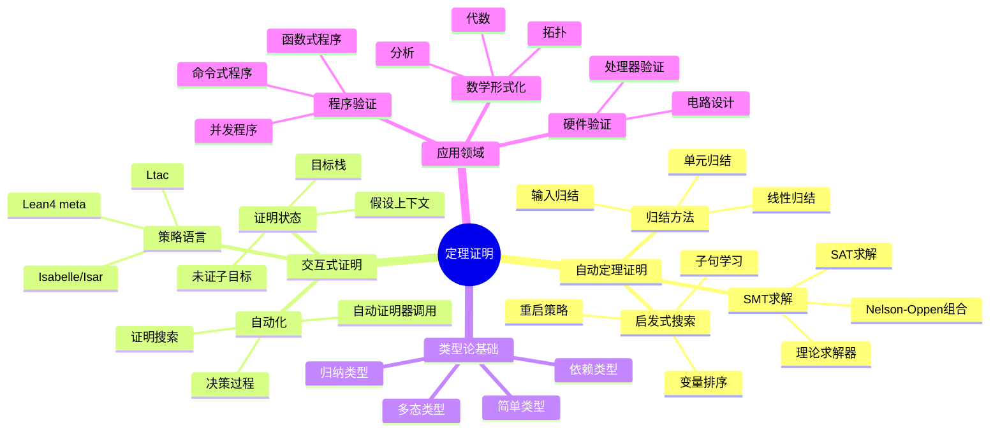

### 7.2 多维对比矩阵

| 维度 | ATP | ITP | 人工证明 | 优势比 |
|------|-----|-----|---------|--------|
| 自动化程度 | ⭐⭐⭐⭐⭐ | ⭐⭐⭐ | ⭐ | 5:3:1 |
| 可扩展性 | ⭐⭐⭐ | ⭐⭐⭐⭐⭐ | ⭐⭐ | 3:5:2 |
| 保证强度 | ⭐⭐⭐⭐ | ⭐⭐⭐⭐⭐ | ⭐⭐⭐ | 4:5:3 |
| 适用范围 | ⭐⭐ | ⭐⭐⭐⭐⭐ | ⭐⭐⭐⭐⭐ | 2:5:5 |
| 用户友好度 | ⭐⭐⭐⭐ | ⭐⭐⭐ | ⭐⭐ | 4:3:2 |
| 维护成本 | 低 | 中 | 高 | 1:2:3 |

### 7.3 公理-定理树

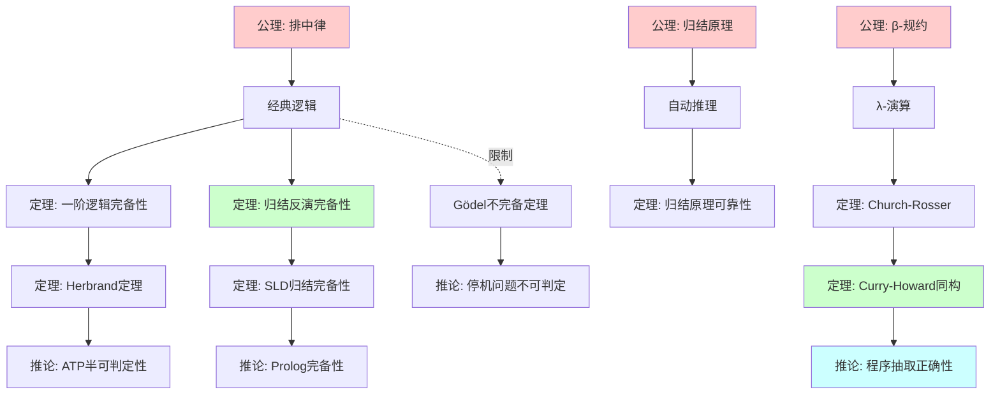

### 7.4 状态转换图

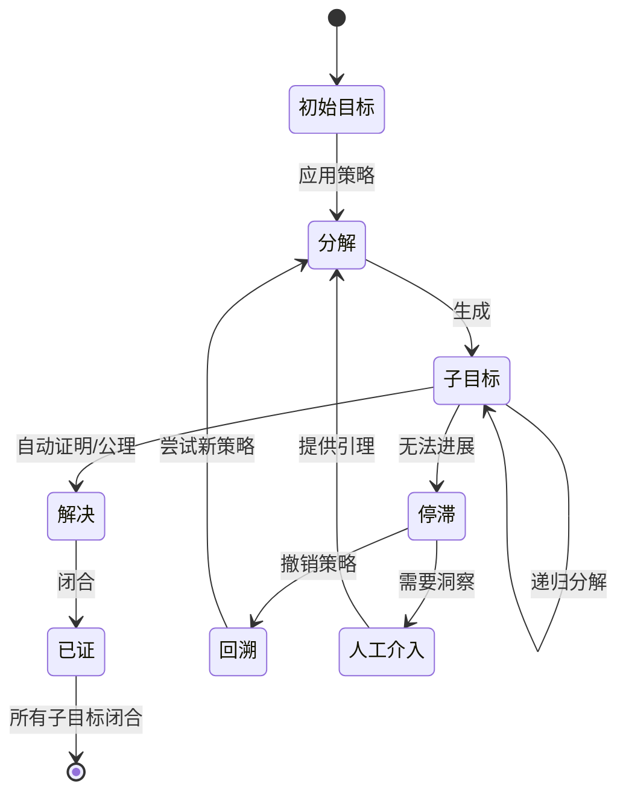

### 7.5 依赖关系图

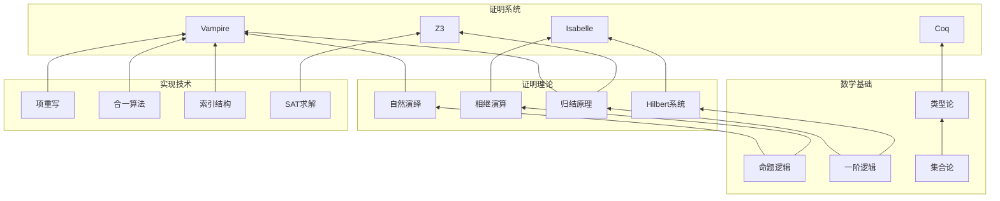

### 7.6 演化时间线

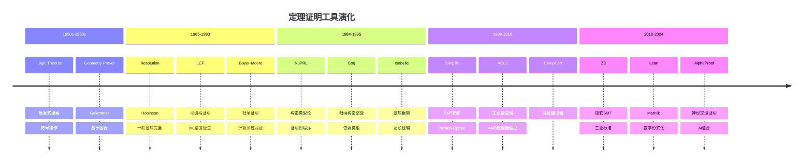

### 7.7 层次架构图

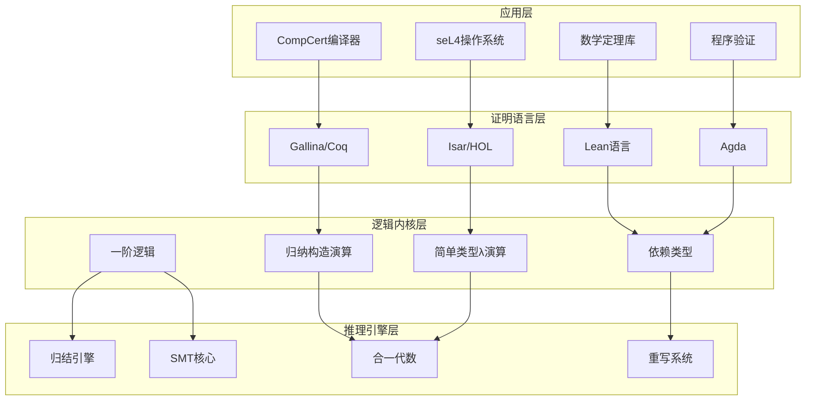

### 7.8 证明搜索树

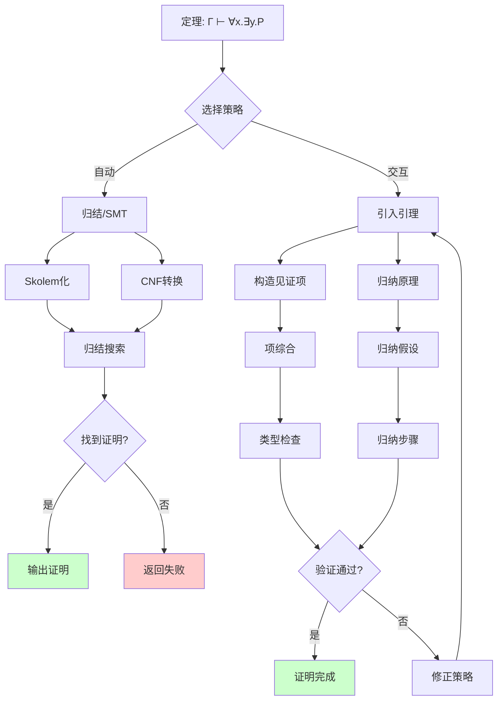

---

## 8. 引用参考

### Wikipedia原文引用

### 经典文献

---

## 9. 相关概念

- [Formal Methods](01-formal-methods.md)
- [Model Checking](02-model-checking.md)
- [Process Calculus](04-process-calculus.md)
- [Temporal Logic](05-temporal-logic.md)
- [Hoare Logic](06-hoare-logic.md)
- [Type Theory](07-type-theory.md)

---

> **概念标签**: #定理证明 #自动推理 #Curry-Howard #形式化验证 #数学逻辑
>
> **学习难度**: ⭐⭐⭐⭐ (高级)
>
> **先修概念**: 一阶逻辑、λ-演算、数理逻辑基础
>
> **后续概念**: 类型论、程序验证、形式化数学
