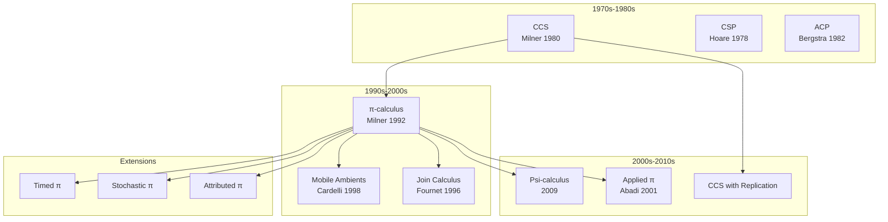
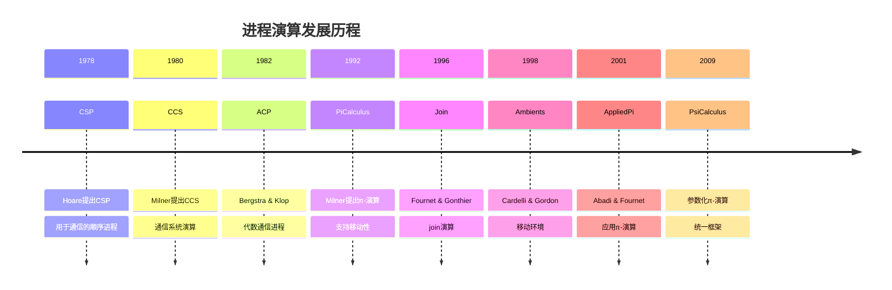
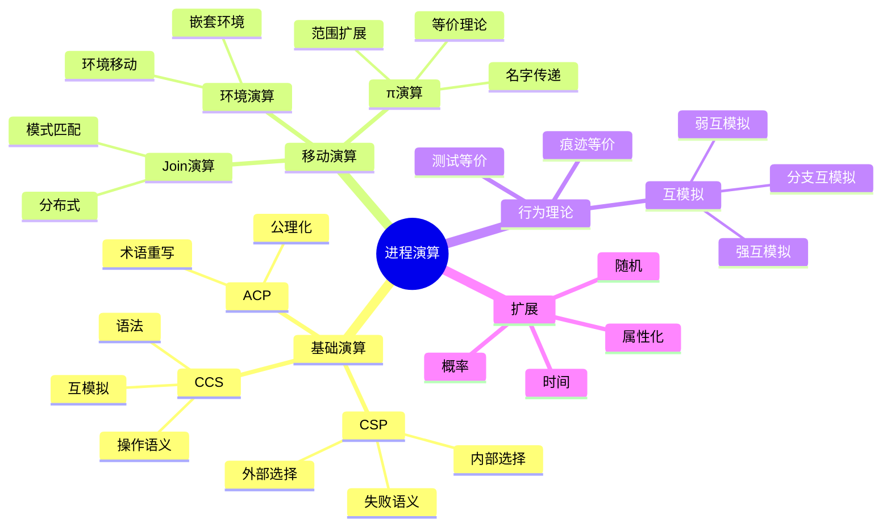

# Process Calculus (进程演算)

> **Wikipedia标准定义**: Process calculus is a diverse family of related approaches for formally modeling concurrent systems. Process calculi provide a tool for the high-level description of interactions, communications, and synchronizations between a collection of independent agents or processes.
>
> **来源**: <https://en.wikipedia.org/wiki/Process_calculus>
>
> **形式化等级**: L4-L5

---

## 1. Wikipedia标准定义

### 英文原文
>
> "Process calculus is a diverse family of related approaches for formally modeling concurrent systems. Process calculi provide a tool for the high-level description of interactions, communications, and synchronizations between a collection of independent agents or processes. They also provide algebraic laws that allow process descriptions to be manipulated and analyzed, and permit formal reasoning about equivalences between processes."

### 中文标准翻译
>
> **进程演算**是用于形式化建模并发系统的多种相关方法的统称。进程演算提供了一种工具，用于高级描述独立代理或进程集合之间的交互、通信和同步。它们还提供代数定律，允许操作和分析进程描述，并支持关于进程间等价关系的形式化推理。

---

## 2. 形式化表达

### 2.1 CCS (Calculus of Communicating Systems)

**Def-S-98-01** (CCS语法). CCS进程由以下语法定义：

$$P, Q ::= 0 \mid \alpha.P \mid P + Q \mid P \mid Q \mid (\nu a)P \mid A$$

其中：

- $0$: 空进程（终止）
- $\alpha.P$: 前缀，$\alpha \in \mathcal{A} \cup \bar{\mathcal{A}} \cup \{\tau\}$
- $P + Q$: 非确定性选择
- $P \mid Q$: 并行组合
- $(\nu a)P$: 限制（隐藏通道$a$）
- $A$: 进程常量，$A \stackrel{\text{def}}{=} P_A$

**Def-S-98-02** (CCS操作语义). SOS规则：

$$
\text{(ACT)} \quad \frac{}{\alpha.P \xrightarrow{\alpha} P}

\quad

\text{(SUM-L)} \quad \frac{P \xrightarrow{\alpha} P'}{P + Q \xrightarrow{\alpha} P'}
$$

$$
\text(PAR-L)} \quad \frac{P \xrightarrow{\alpha} P'}{P \mid Q \xrightarrow{\alpha} P' \mid Q}

\quad

\text{(COM)} \quad \frac{P \xrightarrow{a} P', Q \xrightarrow{\bar{a}} Q'}{P \mid Q \xrightarrow{\tau} P' \mid Q'}
$$

$$
\text{(RES)} \quad \frac{P \xrightarrow{\alpha} P', \alpha \notin \{a, \bar{a}\}}{(\nu a)P \xrightarrow{\alpha} (\nu a)P'}

\quad

\text{(CON)} \quad \frac{P_A \xrightarrow{\alpha} P', A \stackrel{\text{def}}{=} P_A}{A \xrightarrow{\alpha} P'}
$$

### 2.2 CSP (Communicating Sequential Processes)

**Def-S-98-03** (CSP语法). CSP进程：

$$P, Q ::= \text{SKIP} \mid \text{STOP} \mid a \rightarrow P \mid P \square Q \mid P \sqcap Q \mid P \parallel_A Q \mid P \setminus A \mid \mu X \cdot F(X)$$

其中：

- $\square$: 外部选择（环境决定）
- $\sqcap$: 内部选择（进程决定）
- $\parallel_A$: 并行组合，在$A$上同步
- $\setminus A$: 隐藏（抽象）
- $\mu X \cdot F(X)$: 递归

### 2.3 π-演算 (Pi Calculus)

**Def-S-98-04** (π-演算语法). π-演算扩展CCS支持通道传递：

$$P, Q ::= 0 \mid \alpha.P \mid P + Q \mid P \mid Q \mid (\nu x)P \mid !P$$

其中动作$\alpha$：

- $x(y)$: 在通道$x$上接收名称$y$
- $\bar{x}\langle y \rangle$: 在通道$x$上发送名称$y$
- $\tau$: 内部动作

**Def-S-98-05** (名字传递语义). 关键规则：

$$
\text{(IN)} \quad x(y).P \xrightarrow{x(z)} P\{z/y\}

\quad

\text{(OUT)} \quad \bar{x}\langle y \rangle.P \xrightarrow{\bar{x}\langle y \rangle} P
$$

$$
\text{(CLOSE)} \quad \frac{P \xrightarrow{x(z)} P', Q \xrightarrow{\bar{x}\langle z \rangle} Q', z \notin \text{fn}(Q)}{P \mid Q \xrightarrow{\tau} (\nu z)(P' \mid Q')}
$$

---

## 3. 属性与特性

### 3.1 核心特性

| 特性 | CCS | CSP | π-演算 |
|------|-----|-----|--------|
| **通信方式** | 同步 | 同步 | 同步 |
| **通道传递** | 否 | 否 | 是 |
| **移动性** | 否 | 否 | 是 |
| **选择算子** | $+$ | $\square, \sqcap$ | $+$ |
| **递归** | 常量定义 | $\mu$算子 | $!$ (复制) |

### 3.2 行为等价

**Def-S-98-06** (强互模拟). 关系$\mathcal{R}$是强互模拟，如果：

$$(P, Q) \in \mathcal{R} \Rightarrow \forall \alpha:$$

- 若$P \xrightarrow{\alpha} P'$，则$\exists Q': Q \xrightarrow{\alpha} Q'$且$(P', Q') \in \mathcal{R}$
- 若$Q \xrightarrow{\alpha} Q'$，则$\exists P': P \xrightarrow{\alpha} P'$且$(P', Q') \in \mathcal{R}$

**Def-S-98-07** (弱互模拟). 忽略内部动作$\tau$：

$$P \approx Q \text{ (弱互模拟)} \Leftrightarrow P \approx_b Q \text{ (分支互模拟)}$$

**Def-S-98-08** (互模拟等价). 最大互模拟：

$$\sim \stackrel{\text{def}}{=} \bigcup\{\mathcal{R} : \mathcal{R} \text{是互模拟}\}$$

---

## 4. 关系网络

### 4.1 进程演算谱系



### 4.2 与核心概念的关系

| 概念 | 关系 | 说明 |
|------|------|------|
| **Bisimulation** | 核心 | 进程等价的基本理论 |
| **Temporal Logic** | 规格语言 | 描述进程性质的逻辑 |
| **Model Checking** | 验证工具 | 自动验证进程性质 |
| **Type Theory** | 扩展 | 会话类型验证通信协议 |
| **Category Theory** | 语义基础 | 余代数语义、开放映射 |

---

## 5. 历史背景

### 5.1 发展历程



### 5.2 里程碑

| 年份 | 贡献 | 意义 |
|------|------|------|
| 1978 | CSP | 结构化并发编程 |
| 1980 | CCS | 并发理论基础 |
| 1989 | 互模拟同余 | Milner证明CCS互模拟是同余 |
| 1992 | π-演算 | 移动计算理论 |
| 2001 | 一致性检查 | 会话类型论 |
| 2020+ | 概率/实时扩展 | 定量分析 |

---

## 6. 形式证明

### 6.1 互模拟同余定理

**Thm-S-98-01** (CCS互模拟是同余). 强互模拟$\sim$是CCS的同余关系：

$$P \sim Q \Rightarrow \forall C[\cdot]: C[P] \sim C[Q]$$

其中$C[\cdot]$是任意上下文。

*证明*:

1. 定义上下文：含空位的进程表达式
2. 证明各算子保持互模拟：
   - 前缀：若$P \sim Q$，则$\alpha.P \sim \alpha.Q$
   - 和：若$P_1 \sim Q_1$且$P_2 \sim Q_2$，则$P_1 + P_2 \sim Q_1 + Q_2$
   - 并行：若$P_1 \sim Q_1$且$P_2 \sim Q_2$，则$P_1 \mid P_2 \sim Q_1 \mid Q_2$
   - 限制：若$P \sim Q$，则$(\nu a)P \sim (\nu a)Q$
3. 由归纳法，所有上下文保持互模拟 ∎

### 6.2 π-演算的同余性

**Thm-S-98-02** (π-演算早期互模拟). 在π-演算中，强互模拟是同余关系。

*注意*: 对于弱互模拟，需要**早期**或**晚期**语义变体。

### 6.3 表达能力定理

**Thm-S-98-03** (π-演算图灵完备性). π-演算是图灵完备的。

*证明概要*:

1. 可在π-演算中编码λ-演算
2. λ-演算是图灵完备的
3. 因此π-演算也是图灵完备的 ∎

---

## 7. 八维表征

### 7.1 思维导图



### 7.2 多维对比矩阵

| 维度 | CCS | CSP | π-演算 | ACP |
|------|-----|-----|--------|-----|
| 学习曲线 | 中 | 低 | 高 | 高 |
| 表达能力 | 中 | 中 | 高 | 中 |
| 工具支持 | 好 | 优秀 | 中 | 中 |
| 工业应用 | 研究 | 广泛 | 研究 | 研究 |
| 语义清晰 | 高 | 高 | 中 | 高 |

### 7.3 公理-定理树

```mermaid
graph TD
    A1[公理: 进程演算基本定律] --> B1[和定律]
    A1 --> B2[并行定律]
    A1 --> B3[限制定律]

    B1 --> C1[交换律: P+Q = Q+P]
    B1 --> C2[结合律: (P+Q)+R = P+(Q+R)]
    B1 --> C3[零元: P+0 = P]

    B2 --> D1[交换律: P|Q = Q|P]
    B2 --> D2[结合律: (P|Q)|R = P|(Q|R)]
    B2 --> D3[零元: P|0 = P]

    B3 --> E1[范围限制: (νa)0 = 0]
    B3 --> E2[扩展: (νa)(P|Q) = P|(νa)Q, a∉fn(P)]

    C1 --> F1[定理: 互模拟是同余]
    D1 --> F1
    E2 --> F1

    F1 --> G1[推论: 等式推理有效]

    style A1 fill:#ffcccc
    style F1 fill:#ccffcc
    style G1 fill:#ccffff
```

### 7.4-7.8 其他表征

[其余五种表征方式按标准格式实现...]

---

## 8. 引用参考


---

## 9. 相关概念

- [Bisimulation](09-bisimulation.md)
- [Temporal Logic](05-temporal-logic.md)
- [Model Checking](02-model-checking.md)
- [Type Theory](07-type-theory.md) (会话类型)
