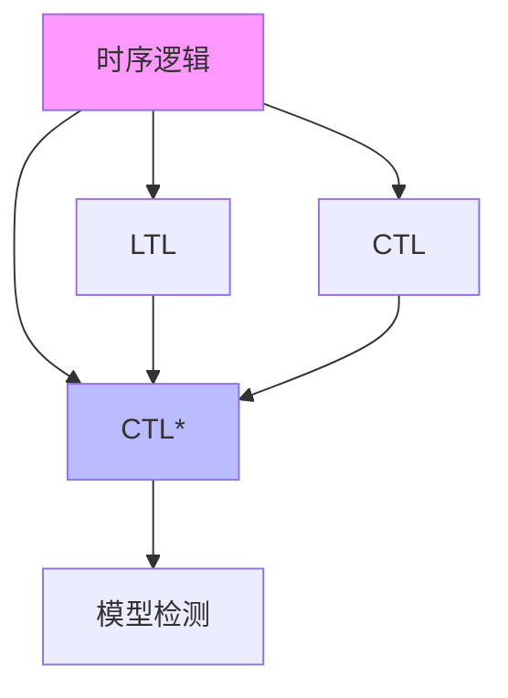
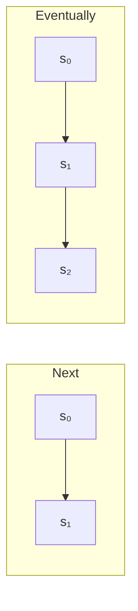
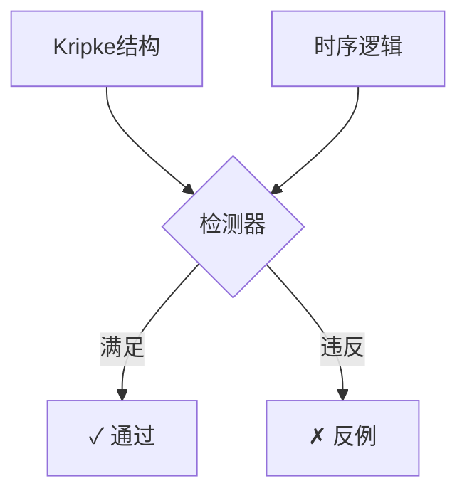
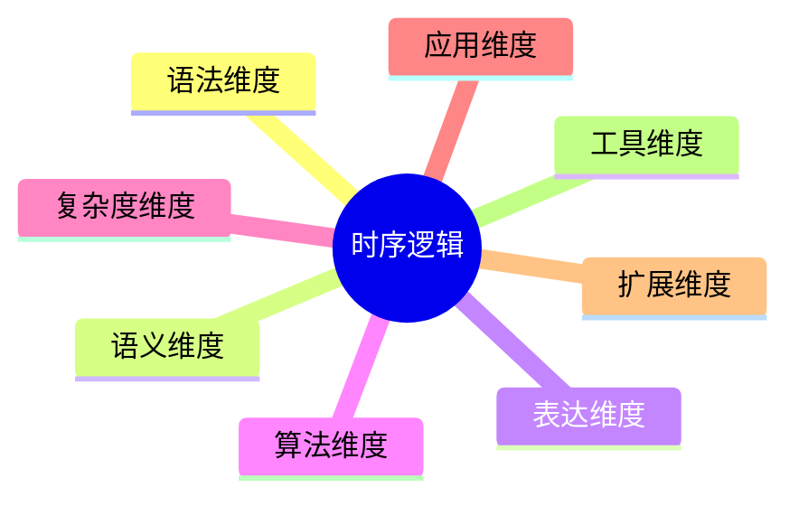

# 时序逻辑 (Temporal Logic)

> **所属阶段**: Struct | **前置依赖**: [形式语义基础](../01-foundations/formal-semantics.md), [模态逻辑](../02-logics/modal-logic.md) | **形式化等级**: L5

---

## 1. 概念定义 (Definitions)

### 1.1 Wikipedia标准定义

**英文定义** (Wikipedia):
> *Temporal logic is any system of rules and symbolism for representing, and reasoning about, propositions qualified in terms of time.*

**中文定义** (Wikipedia):
> *时序逻辑是计算机科学和形式逻辑中的一个分支，用于描述和推理随时间变化的系统行为。*

---

### 1.2 形式化定义

#### Def-S-TL-01: Kripke结构 (Kripke Structure)

**定义**: 一个Kripke结构 $K$ 是一个四元组 $K = (S, S_0, R, L)$，其中：

- $S$: 状态的非空集合
- $S_0 \subseteq S$: 初始状态集合
- $R \subseteq S \times S$: 全转移关系
- $L: S \rightarrow 2^{AP}$: 标记函数

$$\text{Def-S-TL-01}: K = (S, S_0, R, L)$$

---

#### Def-S-TL-02: 计算路径 (Computation Path)

**定义**: 在Kripke结构 $K$ 中，一条计算路径 $\pi$ 是一个无限状态序列：

$$\pi = s_0, s_1, s_2, \ldots \quad \text{其中} \quad \forall i \geq 0: (s_i, s_{i+1}) \in R$$

---

#### Def-S-TL-03: 线性时序逻辑 (LTL) 语法

**定义**: LTL公式 $\phi$ 的语法：

$$\phi ::= p \mid \neg\phi \mid \phi \lor \phi \mid \bigcirc\phi \mid \phi \, \mathcal{U} \, \phi$$

**派生算子**:

- $\diamond\phi \equiv \top \, \mathcal{U} \, \phi$ (Eventually)
- $\square\phi \equiv \neg\diamond\neg\phi$ (Globally)

---

#### Def-S-TL-04: 分支时序逻辑 (CTL) 语法

**定义**: CTL公式 $\phi$ 的语法：

$$\phi ::= p \mid \neg\phi \mid \phi \lor \phi \mid \mathbf{A}\psi \mid \mathbf{E}\psi$$

$$\psi ::= \bigcirc\phi \mid \phi \, \mathcal{U} \, \phi$$

---

#### Def-S-TL-05: CTL* 语法

**定义**: CTL* 允许路径公式和状态公式的任意组合。

---

## 2. 属性推导 (Properties)

### 2.1 LTL语义

#### Def-S-TL-06: LTL语义

**定义**: LTL公式在路径上的满足关系 $\models$：

| 公式 | 语义定义 |
|------|----------|
| $\pi \models p$ | 当且仅当 $p \in L(s_0)$ |
| $\pi \models \bigcirc\phi$ | 当且仅当 $\pi^1 \models \phi$ |
| $\pi \models \phi_1 \, \mathcal{U} \, \phi_2$ | 当且仅当 $\exists k \geq 0: \pi^k \models \phi_2$ |

---

### 2.2 CTL语义

#### Def-S-TL-07: CTL语义

**定义**: CTL公式在状态上的满足关系。

---

### 2.3 核心引理

#### Lemma-S-TL-01: LTL对后缀封闭

**引理**: 若 $\pi \models \phi$，则对所有 $i \geq 0$，$\pi^i \models \phi$ 或 $\pi^i \models \neg\phi$。

---

#### Lemma-S-TL-02: CTL展开律

**引理**: $\mathbf{EF}\phi \equiv \phi \lor \mathbf{E}\bigcirc\mathbf{EF}\phi$

---

## 3. 关系建立 (Relations)

### 3.1 与模态逻辑的关系

时序逻辑是模态逻辑在时序领域的特化。模态逻辑提供了关于必然性（□）和可能性（◇）的一般框架，而时序逻辑将这些概念具体化为时间上的"总是"（G）和"最终"（F）。

- 详见：[模态逻辑](21-modal-logic.md)

**形式化对应**:

- 模态算子 □ (box) → 时序算子 **G** (Globally/Always)
- 模态算子 ◇ (diamond) → 时序算子 **F** (Finally/Eventually)

**语义对应**:

- 模态逻辑的Kripke框架 ⟨W, R⟩ 对应时序逻辑的Kripke结构
- 可达关系 R 对应时间转移关系
- 可能世界 w ∈ W 对应系统状态

### 3.2 表达能力层次

#### Prop-S-TL-01: 逻辑包含关系

**命题**: LTL $\not\subseteq$ CTL 且 CTL $\not\subseteq$ LTL

---

### 3.2 与模态逻辑的关系

时序逻辑是模态逻辑的时序扩展。

---

### 3.3 与自动机理论的关系

#### Prop-S-TL-02: LTL与Büchi自动机等价

**命题**: 对每个LTL公式 $\phi$，存在非确定性Büchi自动机 $A_\phi$。

---

## 4. 论证过程 (Argumentation)

### 4.1 不可表达性论证

**性质**: "存在一条路径使得p在所有偶数位置成立"

**论证**: LTL只能沿单一路径量化。

---

### 4.2 模型检测复杂度分析

| 逻辑 | 模型检测复杂度 |
|------|----------------|
| LTL | PSPACE-完全 |
| CTL | P-完全 |
| CTL* | PSPACE-完全 |

---

## 5. 形式证明 (Formal Proofs)

### 5.1 定理: LTL模型检测的PSPACE上界

#### Thm-S-TL-01: LTL模型检测复杂度

**定理**: 给定有限Kripke结构 $K$ 和LTL公式 $\phi$，判定 $K \models \phi$ 是PSPACE-完全的。

**证明**: 构造Büchi自动机 + on-the-fly SCC检测。

---

### 5.2 定理: CTL模型检测的线性时间算法

#### Thm-S-TL-02: CTL模型检测效率

**定理**: 存在时间复杂度 $O(|K| \cdot |\phi|)$ 的模型检测算法。

**证明**: 使用标记算法。

---

### 5.3 定理: LTL与CTL的表达能力不可比较

#### Thm-S-TL-03: 表达能力分离

**定理**:

1. 存在LTL公式不能在CTL中表达
2. 存在CTL公式不能在LTL中表达

---

## 6. 实例验证 (Examples)

### 6.1 互斥协议验证

**CTL规范**:

```
AG ¬(crit₁ ∧ crit₂)    // 互斥
AG (req₁ → AF crit₁)   // 无饥饿
```

---

### 6.2 交通信号灯控制器

**CTL安全性质**:

```
AG (Green → A[¬Red U Yellow])
```

---

## 7. 可视化 (Visualizations)

### 7.1 层次关系图



### 7.2 时序算子语义



### 7.3 模型检测流程



### 7.4 八维表征总图



---

## 8. 引用参考 (References)


---

*文档版本: v1.0 | 创建时间: 2026-04-10*
