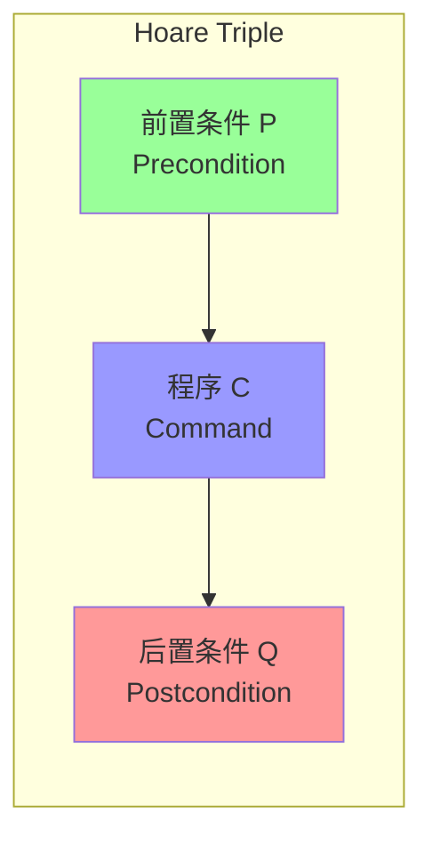
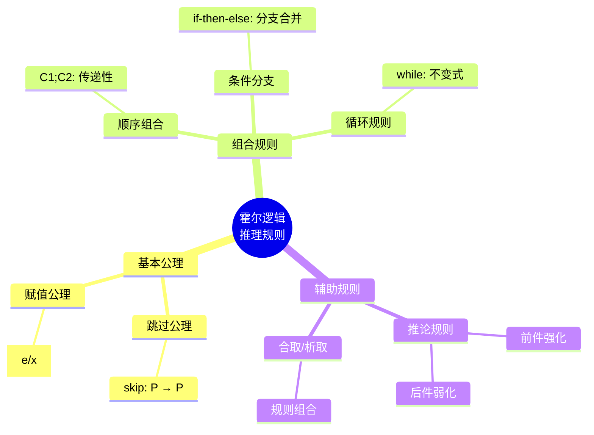
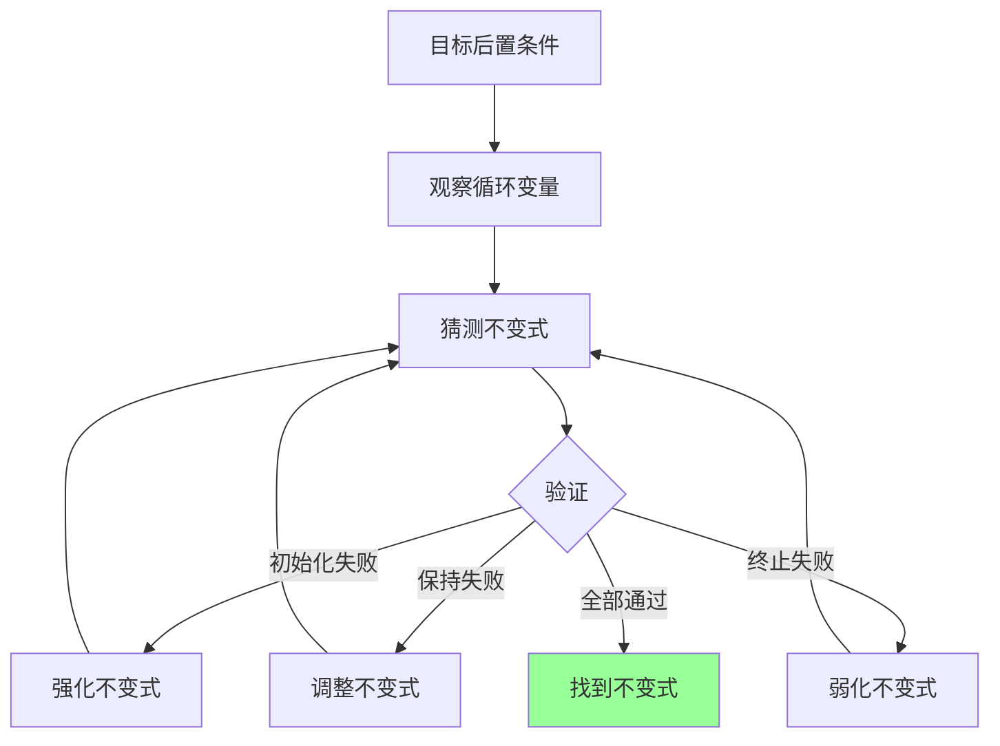
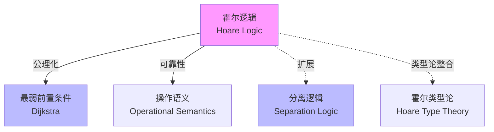
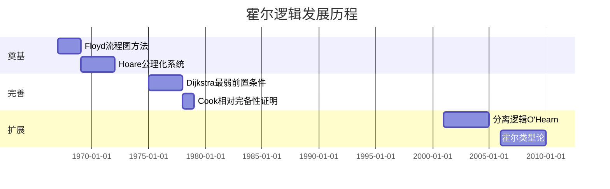
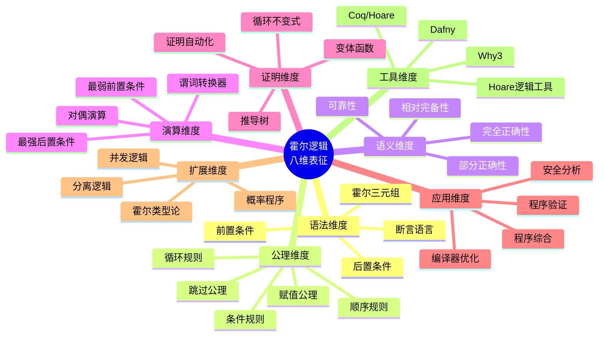

# 霍尔逻辑 (Hoare Logic)

> **所属阶段**: Struct | **前置依赖**: [一阶逻辑](../02-logics/first-order-logic.md), [操作语义](../01-foundations/operational-semantics.md) | **形式化等级**: L5

---

## 1. 概念定义 (Definitions)

### 1.1 Wikipedia标准定义

**英文定义** (Wikipedia):
> *Hoare logic (also known as Floyd-Hoare logic or Hoare rules) is a formal system with a set of logical rules for reasoning rigorously about the correctness of computer programs. It was proposed in 1969 by Tony Hoare, and subsequently refined by Hoare and other researchers. The original ideas were seeded by the work of Robert Floyd, who had published a similar system for flowcharts.*

**中文定义** (Wikipedia):
> *霍尔逻辑（也称为Floyd-Hoare逻辑或霍尔规则）是一个形式系统，包含一套用于严格推理计算机程序正确性的逻辑规则。它由Tony Hoare于1969年提出，后由Hoare和其他研究者完善。其原始思想源于Robert Floyd关于流程图的类似工作。*

---

### 1.2 形式化定义

#### Def-S-HL-01: 霍尔三元组 (Hoare Triple)

**定义**: 霍尔三元组是一个形如 $\{P\}\, C\, \{Q\}$ 的断言，其中：

- $P$: 前置条件 (Precondition) — 程序执行前必须满足的性质
- $C$: 程序命令 (Command) — 要执行的程序语句
- $Q$: 后置条件 (Postcondition) — 程序执行后必须满足的性质

$$\text{Def-S-HL-01}: \{P\}\, C\, \{Q\}$$

**部分正确性**: 若 $P$ 在初始状态成立且 $C$ 终止，则 $Q$ 在终止状态成立。

**完全正确性**: 若 $P$ 在初始状态成立，则 $C$ 终止且 $Q$ 在终止状态成立。

---

#### Def-S-HL-02: 断言语言

**定义**: 断言 $P, Q, \ldots$ 是一阶逻辑公式，可能包含：

- 程序变量: $x, y, z \in Var$
- 常量: $0, 1, 2, \ldots$
- 算术运算: $+, -, *, /, \bmod$
- 比较: $<, \leq, =, \neq, >, \geq$
- 逻辑连接: $\land, \lor, \neg, \rightarrow$
- 量词: $\forall, \exists$
- **特殊符号**: $P[e/x]$ 表示将 $P$ 中所有自由出现的 $x$ 替换为 $e$

---

#### Def-S-HL-03: 程序语法 (简单命令式语言 IMP)

**定义**: IMP语言语法：

$$\begin{aligned}
C ::=\ & x := e \quad \text{(赋值)} \\
       & \mid \mathbf{skip} \quad \text{(空操作)} \\
       & \mid C_1; C_2 \quad \text{(顺序)} \\
       & \mid \mathbf{if}\, b\, \mathbf{then}\, C_1\, \mathbf{else}\, C_2 \quad \text{(条件)} \\
       & \mid \mathbf{while}\, b\, \mathbf{do}\, C \quad \text{(循环)} \\
       & \mid C_1 \oplus C_2 \quad \text{(非确定性选择，可选)}
\end{aligned}$$

---

#### Def-S-HL-04: 最弱前置条件 (Weakest Precondition)

**定义** (Dijkstra, 1975): 对于程序 $C$ 和后置条件 $Q$，最弱前置条件 $wp(C, Q)$ 是满足以下条件的最弱断言：

$$\forall P: \left( \{P\}\, C\, \{Q\} \text{ 可证} \right) \leftrightarrow \left( P \rightarrow wp(C, Q) \right)$$

即：$wp(C, Q)$ 是所有能确保 $C$ 执行后 $Q$ 成立的前置条件中最弱的一个。

---

### 1.3 霍尔推理规则

#### Def-S-HL-05: 霍尔推理系统

**公理与规则**:

| 规则名 | 规则形式 |
|--------|----------|
| **跳过公理** (Skip) | $\{P\}\, \mathbf{skip}\, \{P\}$ |
| **赋值公理** (Assignment) | $\{P[e/x]\}\, x := e\, \{P\}$ |
| **顺序规则** (Sequential) | $\frac{\{P\}\, C_1\, \{R\}, \quad \{R\}\, C_2\, \{Q\}}{\{P\}\, C_1; C_2\, \{Q\}}$ |
| **条件规则** (Conditional) | $\frac{\{P \land b\}\, C_1\, \{Q\}, \quad \{P \land \neg b\}\, C_2\, \{Q\}}{\{P\}\, \mathbf{if}\, b\, \mathbf{then}\, C_1\, \mathbf{else}\, C_2\, \{Q\}}$ |
| **循环规则** (While) | $\frac{\{I \land b\}\, C\, \{I\}}{\{I\}\, \mathbf{while}\, b\, \mathbf{do}\, C\, \{I \land \neg b\}}$ |
| **推论规则** (Consequence) | $\frac{P \rightarrow P', \quad \{P'\}\, C\, \{Q'\}, \quad Q' \rightarrow Q}{\{P\}\, C\, \{Q\}}$ |

### 1.4 扩展定义

#### Def-S-HL-06: 完全正确性霍尔三元组

**定义**: 完全正确性三元组 $[P]\ C\ [Q]$ 表示：

若 $P$ 在初始状态成立，则：
1. $C$ **必然终止**
2. 终止状态满足 $Q$

与部分正确性的区别：
- $\{P\}\ C\ \{Q\}$: 若终止则 $Q$ 成立（部分正确性）
- $[P]\ C\ [Q]$: 必然终止且 $Q$ 成立（完全正确性）

#### Def-S-HL-07: 变体函数 (Variant Function)

**定义**: 对于循环 $\textbf{while}\ b\ \textbf{do}\ C$，变体函数 $t$ 是一个从状态到良基集合的映射：

$$t: \Sigma \to (W, <)$$

其中 $(W, <)$ 是良基集合（无无限递减链），满足：
- $P \rightarrow t \geq 0$: 变体有下界
- $\{P \land b \land t = z\}\ C\ \{P \land t < z\}$: 每次迭代变体递减

#### Def-S-HL-08: 最强后置条件 (Strongest Postcondition)

**定义** (Dijkstra): 对于程序 $C$ 和前置条件 $P$，最强后置条件 $sp(C, P)$ 是满足以下条件的最强断言：

$$\forall Q: \{P\}\ C\ \{Q\} \text{ 可证 } \leftrightarrow sp(C, P) \rightarrow Q$$

**计算规则**：
| 构造 | 最强后置条件 |
|------|--------------|
| $\textbf{skip}$ | $sp(\textbf{skip}, P) = P$ |
| $x := e$ | $sp(x := e, P) = \exists x'. P[x'/x] \land x = e[x'/x]$ |
| $C_1; C_2$ | $sp(C_1; C_2, P) = sp(C_2, sp(C_1, P))$ |

---

## 2. 属性推导 (Properties)

### 2.1 规则导出性质

#### Lemma-S-HL-01: 前件强化

**引理**: 若 $P_1 \rightarrow P_2$ 且 $\{P_2\}\, C\, \{Q\}$ 可证，则 $\{P_1\}\, C\, \{Q\}$ 可证。

**证明**: 直接使用推论规则：

$$\frac{P_1 \rightarrow P_2, \quad \{P_2\}\, C\, \{Q\}, \quad Q \rightarrow Q}{\{P_1\}\, C\, \{Q\}} \quad \text{(Consequence)}$$

∎

---

#### Lemma-S-HL-02: 后件弱化

**引理**: 若 $\{P\}\, C\, \{Q_1\}$ 可证且 $Q_1 \rightarrow Q_2$，则 $\{P\}\, C\, \{Q_2\}$ 可证。

**证明**: 类似引理1，使用推论规则。∎

---

#### Lemma-S-HL-03: 最弱前置条件计算

**引理**: 对于IMP语言各构造，$wp$ 计算如下：

| 构造 | 最弱前置条件 |
|------|--------------|
| $\mathbf{skip}$ | $wp(\mathbf{skip}, Q) = Q$ |
| $x := e$ | $wp(x := e, Q) = Q[e/x]$ |
| $C_1; C_2$ | $wp(C_1; C_2, Q) = wp(C_1, wp(C_2, Q))$ |
| $\mathbf{if}\, b\, \mathbf{then}\, C_1\, \mathbf{else}\, C_2$ | $wp(\mathbf{if}\, b\, \mathbf{then}\, C_1\, \mathbf{else}\, C_2, Q) = (b \rightarrow wp(C_1, Q)) \land (\neg b \rightarrow wp(C_2, Q))$ |
| $\mathbf{while}\, b\, \mathbf{do}\, C$ | $wp(\mathbf{while}\, b\, \mathbf{do}\, C, Q) = \exists k: L_k$，其中 $L_0 = \neg b \land Q$，$L_{k+1} = L_k \lor (b \land wp(C, L_k))$ |

---

## 3. 关系建立 (Relations)

### 3.1 与操作语义的关系

#### Prop-S-HL-01: 霍尔逻辑的可靠性

**命题**: 霍尔逻辑关于操作语义是可靠的：

$$\vdash \{P\}\, C\, \{Q\} \implies \models \{P\}\, C\, \{Q\}$$

即：所有可证明的三元组在操作语义下都成立。

---

### 3.2 与最弱前置条件演算的关系

#### Prop-S-HL-02: 公理化与 $wp$ 的等价

**命题**:
1. $\vdash \{P\}\, C\, \{Q\}$ 当且仅当 $P \rightarrow wp(C, Q)$
2. $\{wp(C, Q)\}\, C\, \{Q\}$ 总是可证且是最弱的

---

### 3.3 与分离逻辑的关系

霍尔逻辑是分离逻辑的基础。分离逻辑扩展了霍尔逻辑以处理堆内存：

| 霍尔逻辑 | 分离逻辑扩展 |
|----------|--------------|
| 断言 | 带堆的断言（如 $x \mapsto v$） |
| 赋值 | 指针操作（分配、释放、读写） |
| 帧规则 | 新增：模块化推理 |

---

## 4. 论证过程 (Argumentation)

### 4.1 循环不变式的发现

#### 论证: 循环不变式的系统方法

**问题**: 如何发现合适的循环不变式 $I$？

**策略**:

1. **从后向前推导**: 从目标后置条件开始
2. **观察变量变化**: 识别循环中保持不变的性质
3. **弱化策略**: 找到比 $Q$ 弱但能被循环保持的性质

**示例**: 阶乘计算 `while i < n do i := i+1; f := f*i`
- 目标: $f = n!$
- 候选不变式: $f = i! \land i \leq n$
- 验证:
  - 初始化: $i=0, f=1$ 满足 $f = i! = 1$
  - 保持: 若 $f = i!$，执行后 $f' = f \cdot (i+1) = (i+1)! = (i')!$

---

### 4.2 完全正确性扩展

**扩展霍尔三元组**: $[P]\, C\, [Q]$ 表示完全正确性

**新增规则**:

| 规则 | 形式 |
|------|------|
| While完全正确性 | $\frac{[P \land b \land t=z]\, C\, [P \land t<z], \quad P \rightarrow t \geq 0}{[P]\, \mathbf{while}\, b\, \mathbf{do}\, C\, [P \land \neg b]}$ |

其中 $t$ 是变体函数（variant），必须递减且有下界。

---

## 5. 形式证明 (Formal Proofs)

### 5.1 定理: 霍尔逻辑的可靠性

#### Thm-S-HL-01: 可靠性定理

**定理**: 霍尔逻辑关于小步操作语义是可靠的。

**形式化**: 对于所有 $P, C, Q$:

$$\vdash \{P\}\, C\, \{Q\} \implies \forall s, s': \left( \langle C, s \rangle \rightarrow^* \langle \mathbf{skip}, s' \rangle \land s \models P \right) \rightarrow s' \models Q$$

**证明** (按推导结构归纳):

**基例**:

1. **Skip公理**: $\{P\}\, \mathbf{skip}\, \{P\}$
   - 语义: $\langle \mathbf{skip}, s \rangle \rightarrow \langle \checkmark, s \rangle$
   - 若 $s \models P$，显然终止状态也满足 $P$。

2. **赋值公理**: $\{P[e/x]\}\, x := e\, \{P\}$
   - 语义: $\langle x := e, s \rangle \rightarrow \langle \checkmark, s[x \mapsto \mathcal{E}[e]s] \rangle$
   - 由替换引理: $s[x \mapsto \mathcal{E}[e]s] \models P$ 当且仅当 $s \models P[e/x]$。

**归纳步骤**:

3. **顺序规则**: 假设对 $C_1, C_2$ 成立
   - 给定 $\langle C_1; C_2, s \rangle \rightarrow^* \langle \checkmark, s' \rangle$
   - 必存在中间状态 $s''$ 使得 $\langle C_1, s \rangle \rightarrow^* \langle \checkmark, s'' \rangle$ 且 $\langle C_2, s'' \rangle \rightarrow^* \langle \checkmark, s' \rangle$
   - 由归纳假设: $s'' \models R$（其中 $R$ 是中断言）
   - 再由归纳假设: $s' \models Q$

4. **条件规则**: 分 $b$ 真/假两种情况，类似处理。

5. **While规则**: 按循环迭代次数归纳。
   - 基例: 0次迭代，$I \land \neg b$ 直接满足
   - 归纳步: 假设 $k$ 次迭代保持，证明 $k+1$ 次保持

6. **推论规则**: 由一阶逻辑的单调性直接可得。

∎

---

### 5.2 定理: 霍尔逻辑的相对完备性

#### Thm-S-HL-02: Cook相对完备性

**定理** (Cook, 1978): 若一阶断言语言足以表达所有 $wp$ 计算，则霍尔逻辑是相对完备的：

$$\models \{P\}\, C\, \{Q\} \implies \vdash \{P\}\, C\, \{Q\}$$

**相对性**: 完备性相对于断言语言 $L$ 的表达能力。

**证明概要**:

**关键引理**: 对任意 $C, Q$，存在 $L$ 中的断言 $\phi_{C,Q}$ 使得：
$$\vdash \{\phi_{C,Q}\}\, C\, \{Q\} \quad \text{且} \quad \models \{P\}\, C\, \{Q\} \implies P \rightarrow \phi_{C,Q}$$

**构造** (按程序结构归纳):

1. **Skip**: $\phi_{\mathbf{skip},Q} = Q$

2. **赋值**: $\phi_{x:=e,Q} = Q[e/x]$

3. **顺序**: $\phi_{C_1;C_2,Q} = \phi_{C_1, \phi_{C_2,Q}}$

4. **条件**: $\phi_{\mathbf{if}\,b\,\mathbf{then}\,C_1\,\mathbf{else}\,C_2,Q} = (b \land \phi_{C_1,Q}) \lor (\neg b \land \phi_{C_2,Q})$

5. **While**: 这是关键和难点

   定义: $\phi_{\mathbf{while}\,b\,\mathbf{do}\,C,Q} = \exists k: I_k$，其中：
   - $I_0 = \neg b \land Q$
   - $I_{k+1} = I_k \lor (b \land \phi_{C,I_k})$

   $I_k$ 表示"在最多 $k$ 次迭代后终止并满足 $Q$"。

   **证明**: 若断言语言能表达上述构造，则可证明While规则的正确性。

**完备性推导**:

假设 $\models \{P\}\, C\, \{Q\}$，则：
1. $P \rightarrow \phi_{C,Q}$（由语义）
2. $\vdash \{\phi_{C,Q}\}\, C\, \{Q\}$（由构造和归纳）
3. 由推论规则: $\vdash \{P\}\, C\, \{Q\}$

∎

---

### 5.3 定理: 最弱前置条件的唯一性

#### Thm-S-HL-03: $wp$ 的唯一性

**定理**: 对于给定程序 $C$ 和后置条件 $Q$，最弱前置条件 $wp(C, Q)$ 在逻辑等价意义下唯一。

**证明**:

**存在性**: 定义 $wp(C, Q) = \{s \mid \forall s': \langle C, s \rangle \rightarrow^* \langle \checkmark, s' \rangle \rightarrow s' \models Q\}$

**最弱性**: 对任意 $P$ 使得 $\models \{P\}\, C\, \{Q\}$：
- 若 $s \models P$，则对所有终止于 $s'$ 的执行，$s' \models Q$
- 因此 $s \in wp(C, Q)$
- 即 $P \rightarrow wp(C, Q)$

**唯一性**: 假设 $W_1, W_2$ 都是最弱前置条件：
- $W_1 \rightarrow W_2$（$W_2$ 是最弱的，$W_1$ 是前置条件）
- $W_2 \rightarrow W_1$（对称）
- 因此 $W_1 \leftrightarrow W_2$（逻辑等价）

∎

---

## 6. 实例验证 (Examples)

### 6.1 交换两个变量

**程序**:
```
{t := x; x := y; y := t}
```

**规范**: $\{x = a \land y = b\}\, C\, \{x = b \land y = a\}$

**证明**:

$$\frac{\{x = a \land y = b\}\, t := x\, \{t = a \land y = b\} \quad \text{(赋值)}}{\{t = a \land y = b\}\, x := y\, \{t = a \land x = b\} \quad \text{(赋值)}}$$
$$\frac{\{t = a \land x = b\}\, y := t\, \{y = a \land x = b\} = \{x = b \land y = a\} \quad \text{(赋值)}}{\{x = a \land y = b\}\, C\, \{x = b \land y = a\}}$$

---

### 6.2 阶乘计算

**程序**:
```
{f := 1; i := 0; while i < n do (i := i+1; f := f*i)}
```

**规范**: $\{n \geq 0\}\, C\, \{f = n!\}$

**循环不变式**: $I \equiv f = i! \land i \leq n$

**证明草图**:

1. **初始化**: $\{n \geq 0\}\, f := 1; i := 0\, \{f = i! = 1 \land i = 0 \leq n\}$ ✓

2. **保持**: 假设 $I \land i < n$ 成立
   - 执行 $i := i+1$: $f = (i-1)! \land i \leq n$
   - 执行 $f := f*i$: $f = i! \land i \leq n = I'$ ✓

3. **终止**: $I \land \neg(i < n) \equiv f = i! \land i = n \rightarrow f = n!$ ✓

---

### 6.3 数组求和

**程序**:
```
{i := 0; s := 0; while i < n do (s := s + a[i]; i := i+1)}
```

**规范**: $\{n \geq 0\}\, C\, \{s = \sum_{j=0}^{n-1} a[j]\}$

**循环不变式**: $I \equiv s = \sum_{j=0}^{i-1} a[j] \land i \leq n$

---

## 7. 可视化 (Visualizations)

### 7.1 霍尔三元组结构



### 7.2 霍尔推理规则系统



### 7.3 证明推导树示例

```mermaid
graph TD
    Root[{x≥0} C {x≥5}]
    Root --> R1[{x≥0} x:=x+3 {x≥3}]
    Root --> R2[{x≥3} x:=x+2 {x≥5}]

    R1 --> A1[x:=x+3<br/>赋值公理<br/>P[3/x]=x≥0]
    R2 --> A2[x:=x+2<br/>赋值公理<br/>P[5/x]=x≥3]

    Root --> C[推论规则<br/>x≥5 → x≥5]

    style Root fill:#f9f
    style A1 fill:#9f9
    style A2 fill:#9f9
```

### 7.4 最弱前置条件计算

```mermaid
flowchart TD
    Q[后置条件 Q] --> C{程序结构}
    C -->|skip| Q1[Q]
    C -->|x:=e| Q2[Q[e/x]]
    C -->|C1;C2| Q3[wpC1[wpC2[Q]]]
    C -->|if b| Q4[(b→wpC1[Q])∧(¬b→wpC2[Q])]
    C -->|while b| Q5[不动点计算]

    Q5 --> Q6[L0 = ¬b∧Q]
    Q5 --> Q7[Lk+1 = Lk ∨ (b∧wpC[Lk])]

    style Q fill:#f99
    style Q1 fill:#9f9
    style Q2 fill:#9f9
    style Q3 fill:#9f9
    style Q4 fill:#9f9
    style Q5 fill:#bbf
```

### 7.5 循环不变式发现流程



### 7.6 霍尔逻辑与相关理论关系



### 7.7 发展时间线



### 7.8 八维表征总图



---

## 8. 关系建立 (Relations)

### 与分离逻辑的关系

霍尔逻辑（Hoare Logic）是分离逻辑（Separation Logic）的理论基础。分离逻辑扩展了霍尔逻辑，专门用于处理堆内存和指针操作的形式化验证。

- 详见：[分离逻辑](../../05-verification/01-logic/03-separation-logic.md)

霍尔逻辑到分离逻辑的演进：

| 特性 | 霍尔逻辑 | 分离逻辑 |
|------|----------|----------|
| **基础** | 命令式程序验证 | 堆内存操作验证 |
| **断言** | 一阶逻辑公式 | 带堆的断言（如 $x \mapsto v$） |
| **核心规则** | 赋值、顺序、条件、循环 | 扩展：分配、释放、读写 |
| **关键扩展** | - | Frame规则（局部性原理） |
| **并发支持** | 有限 | 并发分离逻辑（CSL） |

### 分离逻辑对霍尔逻辑的扩展

**核心扩展点**:
1. **堆模型**: 引入堆（Heap）作为程序状态的一部分
2. **分离合取 ($*$)**: 表示两个断言作用于不相交的堆区域
3. **分离蕴含 ($\wand$)**: Magic Wand，表示资源传递
4. **Frame规则**: 允许模块化推理，只关注相关状态

**演进关系图**:
```
┌─────────────────────────────────────────────────────────┐
│  霍尔逻辑 (1969)                                          │
│  ├── 基础：Hoare三元组 {P} C {Q}                         │
│  ├── 规则：赋值、顺序、条件、循环                         │
│  └── 应用：命令式程序验证                                 │
│                                                          │
│  ↓ 扩展堆模型 (2001)                                      │
│                                                          │
│  分离逻辑 (Reynolds, O'Hearn)                             │
│  ├── 新增：堆断言 (x ↦ v)                                │
│  ├── 新增：分离合取 (*)、Frame规则                       │
│  ├── 扩展：并发分离逻辑 (CSL)                             │
│  └── 应用：内存安全、无数据竞争验证                       │
└─────────────────────────────────────────────────────────┘
```

---

## 9. 引用参考 (References)

[^1]: Wikipedia, "Hoare logic", https://en.wikipedia.org/wiki/Hoare_logic

[^2]: C.A.R. Hoare, "An Axiomatic Basis for Computer Programming", CACM 1969. https://doi.org/10.1145/363235.363259

[^3]: R.W. Floyd, "Assigning Meanings to Programs", Proceedings of Symposia in Applied Mathematics, 1967.

[^4]: E.W. Dijkstra, "Guarded Commands, Nondeterminacy and Formal Derivation of Programs", CACM 1975. https://doi.org/10.1145/361082.361317

[^5]: S. Cook, "Soundness and Completeness of an Axiom System for Program Verification", SIAM Journal on Computing, 1978. https://doi.org/10.1137/0207013

[^6]: K.R. Apt, "Ten Years of Hoare's Logic: A Survey — Part I", ACM TOPLAS, 1981.

[^7]: P.W. O'Hearn, J.C. Reynolds, H. Yang, "Local Reasoning about Programs that Alter Data Structures", CSL 2001.

[^8]: N. Benton, "Simple Relational Correctness Proofs for Static Analyses and Program Transformations", POPL 2004.

[^9]: A.R. Bradley and Z. Manna, "The Calculus of Computation: Decision Procedures with Applications to Verification", Springer, 2007. https://doi.org/10.1007/978-3-540-74113-8

[^10]: M. Huth and M. Ryan, "Logic in Computer Science: Modelling and Reasoning about Systems", Cambridge University Press, 2nd Edition, 2004.

[^11]: F. Pfenning, "Lecture Notes on Hoare Logic", Carnegie Mellon University, 2018. http://www.cs.cmu.edu/~fp/courses/15317-f18/schedule.html

[^12]: G. Winskel, "The Formal Semantics of Programming Languages: An Introduction", MIT Press, 1993.

[^13]: J. C. Reynolds, "Separation Logic: A Logic for Shared Mutable Data Structures", in LICS 2002, pp. 55-74. https://doi.org/10.1109/LICS.2002.1029817

[^14]: N. R. Krishnaswami and J. Aldrich, "Permission-Sensitive Separation Logic", in ESOP 2007, pp. 92-106. https://doi.org/10.1007/978-3-540-71316-6_8

---

*文档版本: v1.0 | 创建时间: 2026-04-10 | 最后更新: 2026-04-10*
