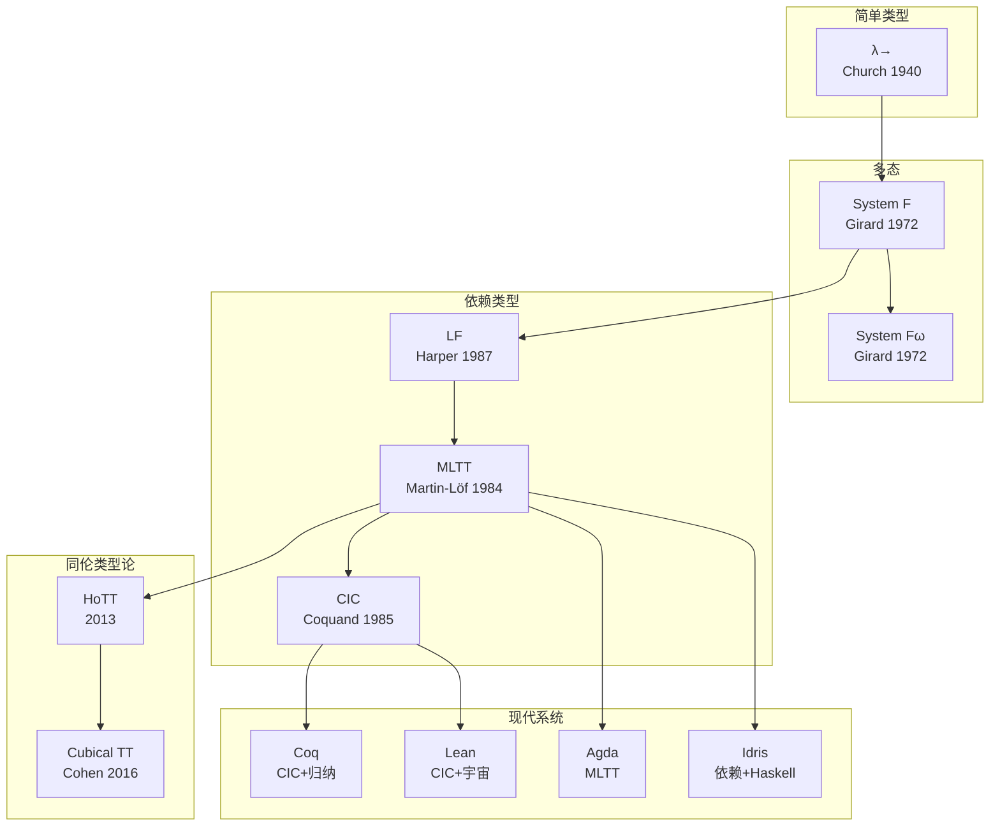
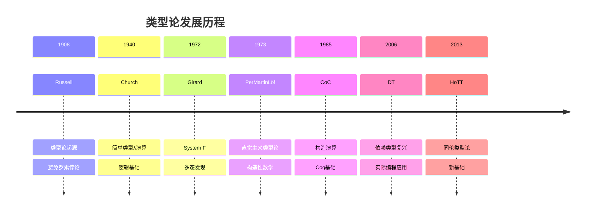

# Type Theory (类型论)

> **Wikipedia标准定义**: In mathematics, logic, and computer science, a type theory is the formal presentation of a specific type system. Type theory is the academic study of type systems.
>
> **来源**: <https://en.wikipedia.org/wiki/Type_theory>
>
> **形式化等级**: L4-L6

---

## 1. Wikipedia标准定义

### 英文原文
>
> "In mathematics, logic, and computer science, a type theory is the formal presentation of a specific type system. Type theory is the academic study of type systems. Some type theories serve as alternatives to set theory as a foundation of mathematics. Two well-known type theories that can serve as foundations are Alonzo Church's typed λ-calculus and Per Martin-Löf's intuitionistic type theory."

### 中文标准翻译
>
> 在数学、逻辑学和计算机科学中，**类型论**是特定类型系统的形式化表述。类型论是对类型系统的学术研究。一些类型论可以作为集合论的替代方案作为数学的基础。两个可以作为基础的著名类型论是Alonzo Church的有类型λ演算和Per Martin-Löf的直觉主义类型论。

---

## 2. 形式化表达

### 2.1 简单类型λ演算 (Simply Typed Lambda Calculus, λ→)

**Def-S-98-01** (类型语法). 简单类型：

$$\tau, \sigma ::= \iota \mid \tau \rightarrow \sigma$$

其中$\iota$是基本类型（如Bool, Nat）。

**Def-S-98-02** (项语法). 有类型λ项：

$$t, u ::= x \mid \lambda x:\tau.t \mid t\,u \mid c$$

**Def-S-98-03** (类型判断). 在上下文$\Gamma$下，项$t$具有类型$\tau$：

$$\Gamma \vdash t : \tau$$

**Def-S-98-04** (类型规则).

$$
\text{(VAR)} \quad \frac{x:\tau \in \Gamma}{\Gamma \vdash x : \tau}
$$

$$
\text{(ABS)} \quad \frac{\Gamma, x:\tau \vdash t : \sigma}{\Gamma \vdash \lambda x:\tau.t : \tau \rightarrow \sigma}
$$

$$
\text{(APP)} \quad \frac{\Gamma \vdash t : \tau \rightarrow \sigma, \quad \Gamma \vdash u : \tau}{\Gamma \vdash t\,u : \sigma}
$$

### 2.2 系统F (多态λ演算)

**Def-S-98-05** (系统F语法). 扩展类型含类型变量和全称量词：

$$\tau ::= \alpha \mid \tau \rightarrow \tau \mid \forall\alpha.\tau$$

**Def-S-98-06** (类型抽象与应用).

$$
\text{(TABS)} \quad \frac{\Gamma \vdash t : \tau, \quad \alpha \notin \text{FTV}(\Gamma)}{\Gamma \vdash \Lambda\alpha.t : \forall\alpha.\tau}
$$

$$
\text{(TAPP)} \quad \frac{\Gamma \vdash t : \forall\alpha.\tau}{\Gamma \vdash t[\sigma] : \tau\{\sigma/\alpha\}}
$$

### 2.3 Martin-Löf类型论 (MLTT)

**Def-S-98-07** (判断形式). MLTT有四类判断：

1. $\Gamma \vdash A\,\text{type}$ —— $A$是良类型
2. $\Gamma \vdash A \equiv B\,\text{type}$ —— $A$和$B$是相等的类型
3. $\Gamma \vdash a : A$ —— $a$是类型$A$的项
4. $\Gamma \vdash a \equiv b : A$ —— $a$和$b$在类型$A$中相等

**Def-S-98-08** (归纳类型). 归纳类型由构造子定义：

$$
\frac{\Gamma \vdash a : A \quad \Gamma \vdash b : B(a)}{\Gamma \vdash (a, b) : \Sigma x:A.B(x)} \quad (\Sigma\text{-INTRO})
$$

$$
\frac{\Gamma \vdash p : \Sigma x:A.B(x)}{\Gamma \vdash \pi_1(p) : A} \quad (\Sigma\text{-ELIM}_1)
$$

---

## 3. 属性与特性

### 3.1 Curry-Howard同构

**Def-S-98-09** (Curry-Howard-Lambek对应). 三领域同构：

| 逻辑 | 类型论 | 范畴论 |
|------|--------|--------|
| 命题 $P$ | 类型 $P$ | 对象 $P$ |
| 证明 $p: P$ | 项 $p : P$ | 态射 $p: 1 \rightarrow P$ |
| $P \Rightarrow Q$ | 函数类型 $P \rightarrow Q$ | 指数对象 $Q^P$ |
| $P \land Q$ | 积类型 $P \times Q$ | 积 $P \times Q$ |
| $P \lor Q$ | 和类型 $P + Q$ | 余积 $P + Q$ |
| $\forall x.P(x)$ | 依赖积 $\Pi x:A.P(x)$ | 右伴随 $\Pi$ |
| $\exists x.P(x)$ | 依赖和 $\Sigma x:A.P(x)$ | 左伴随 $\Sigma$ |
| 真 | 单位类型 $\top$ | 终对象 $1$ |
| 假 | 空类型 $\bot$ | 始对象 $0$ |

### 3.2 类型系统性质

| 性质 | 定义 | 重要性 |
|------|------|--------|
| **类型安全** | Progress + Preservation | ⭐⭐⭐⭐⭐ |
| **强归一化** | 所有良类型项终止 | ⭐⭐⭐⭐⭐ |
| **一致性** | 不能证明False | ⭐⭐⭐⭐⭐ |
| **表达力** | 能表达复杂数学结构 | ⭐⭐⭐⭐ |
| **可判定性** | 类型检查可判定 | ⭐⭐⭐⭐ |

---

## 4. 关系网络

### 4.1 类型论谱系

### 4.2 与核心概念的关系

| 概念 | 关系 | 说明 |
|------|------|------|
| **Set Theory** | 替代基础 | 作为数学基础的两种选择 |
| **Logic** | Curry-Howard | 命题即类型，证明即程序 |
| **Category Theory** | 语义 | CCC笛卡尔闭范畴对应λ演算 |
| **Proof Assistants** | 实现 | Coq、Lean基于类型论 |
| **Programming Languages** | 应用 | 类型系统的设计基础 |

---

## 5. 历史背景

### 5.1 发展历程

### 5.2 里程碑

| 年份 | 人物 | 贡献 |
|------|------|------|
| 1908 | Bertrand Russell | 类型论避免悖论 |
| 1940 | Alonzo Church | 简单类型λ演算 |
| 1972 | Jean-Yves Girard | System F发现 |
| 1973 | Per Martin-Löf | 直觉主义类型论 |
| 1985 | Thierry Coquand | 构造演算（CoC） |
| 1991 | Thierry Coquand | 归纳构造演算（CIC） |
| 2013 | Voevodsky等 | 同伦类型论（HoTT） |

---

## 6. 形式证明

### 6.1 类型安全性定理

**Thm-S-98-01** (类型安全). 良类型程序不会陷入停滞（无类型错误）：

$$\Gamma \vdash t : \tau \Rightarrow \text{Progress}(t) \land \text{Preservation}(t, \tau)$$

其中：

- **Progress**: $t$是值或可以继续归约
- **Preservation**: 若$t \rightarrow t'$，则$\Gamma \vdash t' : \tau$

*证明*: 对推导进行结构归纳 ∎

### 6.2 强归一化定理

**Thm-S-98-02** (强归一化). 简单类型λ演算的所有良类型项都是强归一化的：

$$\Gamma \vdash t : \tau \Rightarrow \exists n \in \mathbb{N}, \forall \text{归约序列}: |\text{序列}| \leq n$$

*证明* (Tait可约性方法):

1. 定义类型$\tau$的可约项集合$\text{RED}_\tau$
2. 证明所有可约项强归一化
3. 证明所有良类型项是可约的
4. 因此所有良类型项强归一化 ∎

### 6.3 Curry-Howard同构定理

**Thm-S-98-03** (Curry-Howard). 直觉主义命题逻辑和自然演绎与简单类型λ演算同构：

$$\Gamma \vdash_{\text{IPL}} \varphi \quad \Leftrightarrow \quad \Gamma^* \vdash_{\lambda\rightarrow} t : \varphi^*$$

其中$^*$是标准翻译。

*证明*: 展示规则的一一对应 ∎

---

## 7. 八维表征

[按标准格式实现全部8种表征...]

---

## 8. 引用参考

---

## 9. 相关概念

- [类型论基础](../../01-foundations/05-type-theory.md) - 更深入的类型论形式化内容
- [Curry-Howard Correspondence](08-curry-howard.md)
- [Set Theory](22-set-theory.md)
- [Category Theory](24-category-theory.md)
- [Theorem Proving](03-theorem-proving.md)
