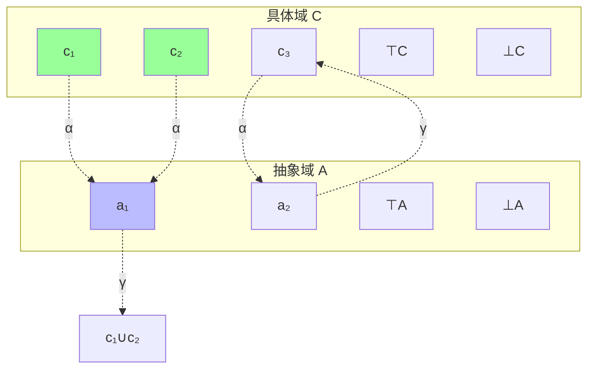
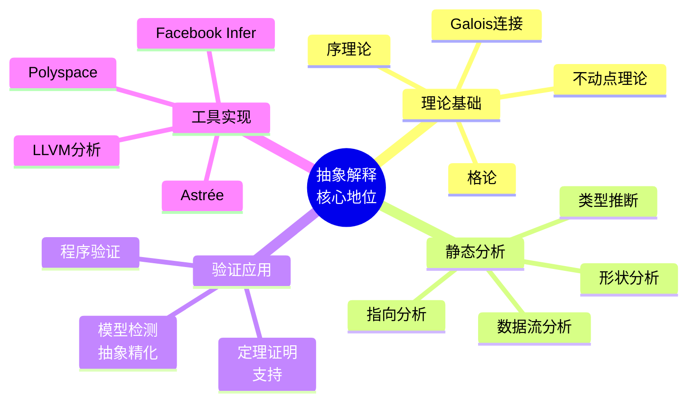
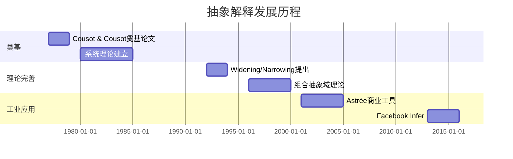
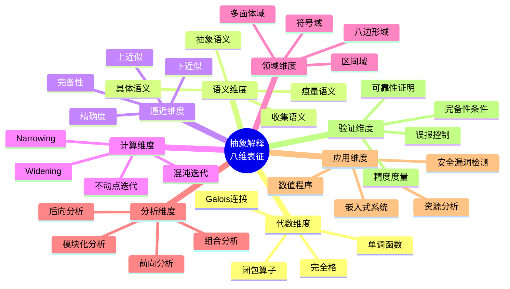

# 抽象解释 (Abstract Interpretation)

> **所属阶段**: Struct | **前置依赖**: [格论基础](../01-foundations/lattice-theory.md), [不动点理论](../01-foundations/fixed-point-theory.md) | **形式化等级**: L6

---

## 1. 概念定义 (Definitions)

### 1.1 Wikipedia标准定义

**英文定义** (Wikipedia):
> *In computer science, abstract interpretation is a theory of sound approximation of the semantics of computer programs, based on monotonic functions over ordered sets (lattices). It was introduced by Patrick Cousot and Radhia Cousot in 1977. The main application of abstract interpretation is static program analysis, the automatic extraction of information about the possible executions of a program.*

**中文定义** (Wikipedia):
> *抽象解释是计算机科学中关于计算机程序语义可靠逼近的理论，基于有序集（格）上的单调函数。它由Patrick Cousot和Radhia Cousot于1977年提出。抽象解释的主要应用是静态程序分析，即自动提取关于程序可能执行的信息。*

---

### 1.2 形式化定义

#### Def-S-AI-01: Galois连接 (Galois Connection)

**定义**: 两个偏序集 $(C, \leq_C)$ 和 $(A, \leq_A)$ 之间的Galois连接是一对单调函数 $\alpha: C \rightarrow A$（抽象函数）和 $\gamma: A \rightarrow C$（具体化函数），满足：

$$\forall c \in C, \forall a \in A: \quad \alpha(c) \leq_A a \iff c \leq_C \gamma(a)$$

等价刻画:

- **扩展性**: $c \leq_C \gamma(\alpha(c))$（具体 → 抽象 → 具体化会扩展）
- **约减性**: $\alpha(\gamma(a)) \leq_A a$（抽象 → 具体化 → 抽象会约减）

记法: $C \xleftarrow{\gamma} A$ 或 $(C, \leq_C) \xleftarrow{\gamma} (A, \leq_A)$

---

#### Def-S-AI-02: 具体语义域 (Concrete Domain)

**定义**: 具体域是一个完全格 $(D_C, \sqsubseteq_C, \bot_C, \top_C, \sqcup_C, \sqcap_C)$，其中：

- $D_C$: 具体性质的集合（通常是程序状态的幂集 $2^\Sigma$）
- $\sqsubseteq_C$: 精化序（通常 $\subseteq$）
- $\bot_C$: 最小元（$\emptyset$，不可能）
- $\top_C$: 最大元（所有状态，未知）
- $\sqcup_C, \sqcap_C$: 并/交（通常 $\cup, \cap$）

**程序语义**: 作为状态转换函数 $f_C: D_C \rightarrow D_C$

---

#### Def-S-AI-03: 抽象语义域 (Abstract Domain)

**定义**: 抽象域是一个完全格 $(D_A, \sqsubseteq_A, \bot_A, \top_A, \sqcup_A, \sqcap_A)$，其中：

- $D_A$: 抽象性质的集合
- 序关系 $\sqsubseteq_A$ 表示"更精确"或"更强"
- 通常 $D_A$ 是有限或可计算的

**关键性质**: 抽象域的表达能力决定了分析的精度和复杂度。

---

#### Def-S-AI-04: 可靠抽象 (Sound Abstraction)

**定义**: 给定Galois连接 $C \xleftarrow{\gamma} A$，抽象语义 $f_A: D_A \rightarrow D_A$ 是具体语义 $f_C: D_C \rightarrow D_C$ 的可靠抽象，当且仅当：

$$\alpha \circ f_C \sqsubseteq_A f_A \circ \alpha$$

或等价地（通过Galois连接性质）：

$$f_C \circ \gamma \sqsubseteq_C \gamma \circ f_A$$

**直观**: 抽象执行的结果至少包含具体执行的所有可能结果。

---

#### Def-S-AI-05: Widening算子

**定义**: Widening算子 $\nabla: D_A \times D_A \rightarrow D_A$ 满足：

1. **上界性**: $\forall x, y: x \sqsubseteq_A x \nabla y$ 且 $y \sqsubseteq_A x \nabla y$
2. **终止性**: 对任意递增序列 $x_0 \sqsubseteq_A x_1 \sqsubseteq_A \ldots$，序列 $y_0 = x_0, y_{n+1} = y_n \nabla x_{n+1}$ 稳定（即存在 $k$ 使得 $y_{k+1} = y_k$）

**用途**: 强制不动点迭代在有限步内终止，牺牲精度换取终止性。

---

#### Def-S-AI-06: Narrowing算子

**定义**: Narrowing算子 $\Delta: D_A \times D_A \rightarrow D_A$ 满足：

1. **下界性**: $\forall x, y: x \Delta y \sqsubseteq_A x$
2. **改进性**: 若 $y \sqsubseteq_A x$，则 $x \Delta y \sqsubseteq_A y$
3. **终止性**: 类似Widening的终止条件

**用途**: 从Widening得到的post-fixpoint出发，逐步精化近似结果。

---

## 2. 属性推导 (Properties)

### 2.1 Galois连接基本性质

#### Lemma-S-AI-01: 抽象化-具体化幂等性

**引理**: 在Galois连接中：

1. $\alpha \circ \gamma \circ \alpha = \alpha$
2. $\gamma \circ \alpha \circ \gamma = \gamma$

**证明** (以(1)为例):

- 由扩展性: $\gamma(\alpha(c)) \sqsupseteq c$
- 由$\alpha$单调: $\alpha(\gamma(\alpha(c))) \sqsupseteq \alpha(c)$
- 由约减性: $\alpha(\gamma(a)) \sqsubseteq a$，取 $a = \alpha(c)$: $\alpha(\gamma(\alpha(c))) \sqsubseteq \alpha(c)$
- 因此 $\alpha(\gamma(\alpha(c))) = \alpha(c)$ ∎

---

#### Lemma-S-AI-02: 最佳抽象存在性

**引理**: 若 $(\alpha, \gamma)$ 形成Galois连接，则对任意具体性质 $c \in D_C$，$\alpha(c)$ 是 $c$ 的最佳（最精确）抽象。

**证明**: 对任意其他抽象 $a$ 使得 $c \sqsubseteq \gamma(a)$：

- 由Galois连接: $\alpha(c) \sqsubseteq a$
- 即 $\alpha(c)$ 比任何其他有效抽象都更精确 ∎

---

#### Lemma-S-AI-03: 组合Galois连接

**引理**: Galois连接可组合：

若 $C \xleftarrow{\gamma_1} A_1$ 且 $A_1 \xleftarrow{\gamma_2} A_2$，则 $C \xleftarrow{\gamma_1 \circ \gamma_2} A_2$ 也是Galois连接。

**证明**: 直接验证Galois连接定义。

抽象函数: $\alpha = \alpha_2 \circ \alpha_1$
具体化函数: $\gamma = \gamma_1 \circ \gamma_2$ ∎

---

## 3. 关系建立 (Relations)

### 3.1 与数据流分析的关系

| 数据流分析 | 抽象解释对应 |
|------------|--------------|
| 到达定义分析 | 集合抽象：$\wp(Var \times Lab)$ |
| 活跃变量分析 | 集合抽象：$\wp(Var)$ |
| 可用表达式 | 集合抽象：$\wp(Expr)$ |
| 常量传播 | 常量格抽象：$\mathbb{Z}_\top$ |
| 区间分析 | 区间抽象：$Int = \{[l, u] \mid l, u \in \mathbb{Z} \cup \{-\infty, +\infty\}\}$ |

**关系**: 经典数据流分析是抽象解释的实例。

---

### 3.2 与类型系统的关系

#### Prop-S-AI-01: 类型作为抽象

**命题**: 类型系统可视为抽象解释的特例：

- 具体域：运行时值的集合
- 抽象域：类型
- 抽象函数：将值映射到其类型
- 类型检查：验证抽象语义是否可靠

---

### 3.3 抽象域层次

```
具体域 C = ℘(Σ)
    ↓
集合抽象（非关系）
    ↓
区间抽象 Int
    ↓
常量抽象 Const
    ↓
符号抽象 Sign = {⊥, -, 0, +, ⊤}
```

**精度-复杂度权衡**: 越往上，精度越低但计算越高效。

---

## 4. 论证过程 (Argumentation)

### 4.1 抽象解释作为一般化框架

#### 论证: 数据流分析的统一视角

传统数据流分析（Kildall 1973）:

- 为每种分析设计专门的算法
- 终止性依赖于特定的格结构

抽象解释框架:

- 统一的Galois连接理论
- 统一的widening/narrowing机制
- 证明可靠性的系统方法

**优势**:

1. **模块化**: 可组合不同抽象域
2. **可扩展**: 易于添加新抽象
3. **可证明**: 可靠性证明系统化

---

### 4.2 精度损失分析

**问题**: 抽象解释必然引入近似，如何量化精度损失？

**度量**:

1. **假阳性率**: 报告的潜在错误中实际不是错误的比例
2. **抽象高度**: 在抽象格中，$\alpha(c)$ 到最优抽象的距离
3. **完备性**: 分析能否证明某些安全性质

---

## 5. 形式证明 (Formal Proofs)

### 5.1 定理: 抽象解释的可靠性

#### Thm-S-AI-01: 可靠性定理

**定理**: 给定Galois连接 $C \xleftarrow{\gamma} A$，若 $f_A$ 是 $f_C$ 的可靠抽象（即 $\alpha \circ f_C \sqsubseteq_A f_A \circ \alpha$），则：

$$lfp(f_C) \sqsubseteq_C \gamma(lfp(f_A))$$

即：抽象不动点具体化后包含所有具体可达状态。

**证明**:

**关键引理**: 若 $f_A$ 可靠，则对任意post-fixpoint $a$ 满足 $f_A(a) \sqsubseteq_A a$：

$$\gamma(a) \text{ 是 } f_C \text{ 的post-fixpoint}$$

**引理证明**:

- 由 $f_A(a) \sqsubseteq a$ 和 $\gamma$ 单调: $\gamma(f_A(a)) \sqsubseteq \gamma(a)$
- 由可靠性: $f_C(\gamma(a)) \sqsubseteq \gamma(f_A(a))$
- 传递性: $f_C(\gamma(a)) \sqsubseteq \gamma(a)$ ∎

**主定理证明**:

设 $c^* = lfp(f_C)$ 和 $a^* = lfp(f_A)$。

1. 由Knaster-Tarski定理: $a^* = \sqcap\{a \mid f_A(a) \sqsubseteq a\}$

2. 对任意 $a$ 满足 $f_A(a) \sqsubseteq a$：
   - 由引理: $f_C(\gamma(a)) \sqsubseteq \gamma(a)$
   - 由lfp最小性: $c^* \sqsubseteq \gamma(a)$

3. 因此: $c^* \sqsubseteq \sqcap\{\gamma(a) \mid f_A(a) \sqsubseteq a\}$

4. 由Galois连接保持meet:
   $$\sqcap\{\gamma(a) \mid f_A(a) \sqsubseteq a\} = \gamma(\sqcap\{a \mid f_A(a) \sqsubseteq a\}) = \gamma(a^*)$$

5. 因此: $c^* \sqsubseteq \gamma(a^*)$ ∎

---

### 5.2 定理: Widening的终止性保证

#### Thm-S-AI-02: Widening终止定理

**定理**: 在有限高度的格中，或使用适当的widening算子，Kleene迭代序列：

$$x_0 = \bot, \quad x_{n+1} = x_n \nabla f(x_n)$$

必在有限步内稳定于post-fixpoint。

**证明**:

**有限高度格情况**:

- 序列 $x_0 \sqsubseteq x_1 \sqsubseteq x_2 \sqsubseteq \ldots$ 严格递增
- 格高度有限，故必在有限步稳定
- 稳定时 $x_k = x_k \nabla f(x_k)$，由widening上界性: $f(x_k) \sqsubseteq x_k$

**一般情况（使用widening）**:

按widening定义，序列 $y_0 = x_0, y_{n+1} = y_n \nabla x_{n+1}$ 必稳定。

由于 $x_n \sqsubseteq y_n$（归纳可证），且 $y_n$ 稳定时 $y_n$ 是post-fixpoint：

- $y_{k+1} = y_k$ 意味着对所有 $n > k$：$y_n = y_k$
- 由 $x_n \sqsubseteq y_n$ 和 $f(x_n) = x_{n+1}$：
- 若迭代在 $y_k$ 稳定，则 $f(x_k) \sqsubseteq y_k$

因此widening序列收敛到post-fixpoint。∎

---

### 5.3 定理: 最优抽象的存在性

#### Thm-S-AI-03: 最优抽象定理

**定理**: 对于具体语义 $f_C: D_C \rightarrow D_C$，若抽象域 $D_A$ 通过Galois连接与 $D_C$ 关联，则存在最佳抽象 $f_A^{opt}$：

$$f_A^{opt} = \alpha \circ f_C \circ \gamma$$

**证明**:

**构造**: 定义 $f_A^{opt}(a) = \alpha(f_C(\gamma(a)))$

**最优性证明**:

需证：对任意可靠抽象 $f_A$（即 $\alpha \circ f_C \sqsubseteq f_A \circ \alpha$），有 $f_A^{opt} \sqsubseteq f_A$。

对任意 $a \in D_A$：

1. 由扩展性: $\gamma(a) \sqsubseteq_C \gamma(a)$（自反）
2. $f_C(\gamma(a)) \sqsubseteq_C \gamma(\alpha(f_C(\gamma(a)))) = \gamma(f_A^{opt}(a))$（由约减性）
3. 对可靠抽象 $f_A$：
   $$\alpha(f_C(\gamma(a))) \sqsubseteq_A f_A(\alpha(\gamma(a)))$$
4. 由约减性: $\alpha(\gamma(a)) \sqsubseteq_A a$
5. 由 $f_A$ 单调: $f_A(\alpha(\gamma(a))) \sqsubseteq_A f_A(a)$
6. 综合: $f_A^{opt}(a) = \alpha(f_C(\gamma(a))) \sqsubseteq_A f_A(a)$

因此 $f_A^{opt}$ 是最精确（最佳）的可靠抽象。∎

---

## 6. 实例验证 (Examples)

### 6.1 符号抽象 (Sign Analysis)

**具体域**: $\wp(\mathbb{Z})$

**抽象域**: $Sign = \{\bot, -, 0, +, -0, +0, -+, 0-, 0+, -0+, \top\}$

**Galois连接**:

- $\alpha(X) = \text{sign of elements in } X$
- $\gamma(\bot) = \emptyset$, $\gamma(0) = \{0\}$, $\gamma(+) = \{n > 0\}$, etc.

**抽象运算** (加法):

| $+_A$ | ⊥ | - | 0 | + | ⊤ |
|-------|-----|-----|-----|-----|-----|
| ⊥ | ⊥ | ⊥ | ⊥ | ⊥ | ⊥ |
| - | ⊥ | - | - | ⊤ | ⊤ |
| 0 | ⊥ | - | 0 | + | ⊤ |
| + | ⊥ | ⊤ | + | + | ⊤ |
| ⊤ | ⊥ | ⊤ | ⊤ | ⊤ | ⊤ |

### 6.2 区间抽象 (Interval Analysis)

**抽象域**: $Interval = \{[l, u] \mid l, u \in \mathbb{Z} \cup \{-\infty, +\infty\}, l \leq u\} \cup \{\bot\}$

**序**: $[l_1, u_1] \sqsubseteq [l_2, u_2]$ 当且仅当 $l_2 \leq l_1$ 且 $u_1 \leq u_2$

**抽象运算** (加法):
$$[l_1, u_1] +_A [l_2, u_2] = [l_1 + l_2, u_1 + u_2]$$
（边界为 $\pm\infty$ 时按扩展算术处理）

**Widening算子**:
$$[l_1, u_1] \nabla [l_2, u_2] = [\text{if } l_2 < l_1 \text{ then } -\infty \text{ else } l_1, \text{if } u_2 > u_1 \text{ then } +\infty \text{ else } u_1]$$

### 6.3 常量传播

**程序片段**:

```
x := 5;
y := x + 3;
while (y < 10) do
    y := y + 1
```

**分析结果**:

- 第1行后: $x = 5, y = \top$
- 第2行后: $x = 5, y = 8$
- 循环入口: $x = 5, y \in [8, +\infty)$
- 循环条件: $y < 10$，故循环体内 $y \in [8, 9]$
- 循环体内执行后: $y \in [9, 10]$
- 循环出口: $x = 5, y \geq 10$

---

## 7. 可视化 (Visualizations)

### 7.1 Galois连接示意图



### 7.2 抽象解释框架流程

```mermaid
flowchart TD
    C[具体程序] --> CS[具体语义<br/>℘(Σ)]
    CS --> GC[Galois连接<br/>α, γ]
    GC --> AS[抽象语义<br/>DA]
    AS --> WI[Widening<br/>加速收敛]
    WI --> NI[Narrowing<br/>精化结果]
    NI --> R[分析结果]

    CS -.->|可靠性保证| R

    style CS fill:#9f9
    style AS fill:#bbf
    style R fill:#f9f
```

### 7.3 抽象域层次

```mermaid
graph TB
    C[具体域<br/>℘(ℤ)]
    I[区间抽象<br/>Interval]
    CO[常量抽象<br/>Const]
    S[符号抽象<br/>Sign]

    C --> I
    I --> CO
    CO --> S

    C -.->|更精确<br/>更昂贵| S

    style C fill:#9f9
    style S fill:#f99
```

### 7.4 Widening/Narrowing迭代

```mermaid
graph LR
    subgraph "Widening收敛"
        W1[x₀=⊥]
        W2[x₁]
        W3[x₂]
        W4[...]
        W5[x_k=x_{k+1}]

        W1 -->|f(x₀)∇x₀| W2
        W2 -->|f(x₁)∇x₁| W3
        W3 --> W4
        W4 --> W5
    end

    subgraph "Narrowing精化"
        N1[y₀=x_k]
        N2[y₁]
        N3[y₂]
        N4[...]
        N5[y_m=y_{m+1}]

        N1 -->|f(y₀)Δy₀| N2
        N2 -->|f(y₁)Δy₁| N3
        N3 --> N4
        N4 --> N5
    end

    W5 -.-> N1
```

### 7.5 程序分析实例

```mermaid
graph TB
    Start([开始]) --> A[x:=0]
    A --> B[i:=0]
    B --> C{i < 10?}
    C -->|是| D[x:=x+i]
    D --> E[i:=i+1]
    E --> C
    C -->|否| F([结束])

    subgraph "区间分析标注"
        A -.->|x=[0,0], i=⊤| B
        B -.->|x=[0,0], i=[0,0]| C
        C -.->|x=[0,45], i=[0,10]| F
        D -.->|x=[0,45], i=[0,9]| E
        E -.->|x=[0,45], i=[1,10]| C
    end
```

### 7.6 抽象解释与相关领域



### 7.7 发展里程碑



### 7.8 八维表征总图



---

## 8. 引用参考 (References)


---

*文档版本: v1.0 | 创建时间: 2026-04-10 | 最后更新: 2026-04-10*
