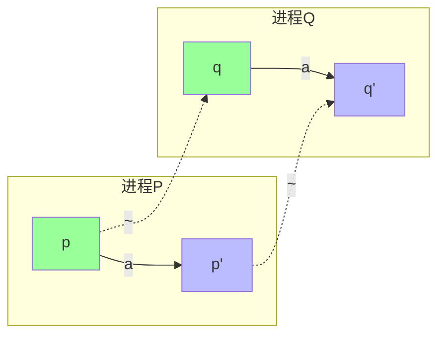
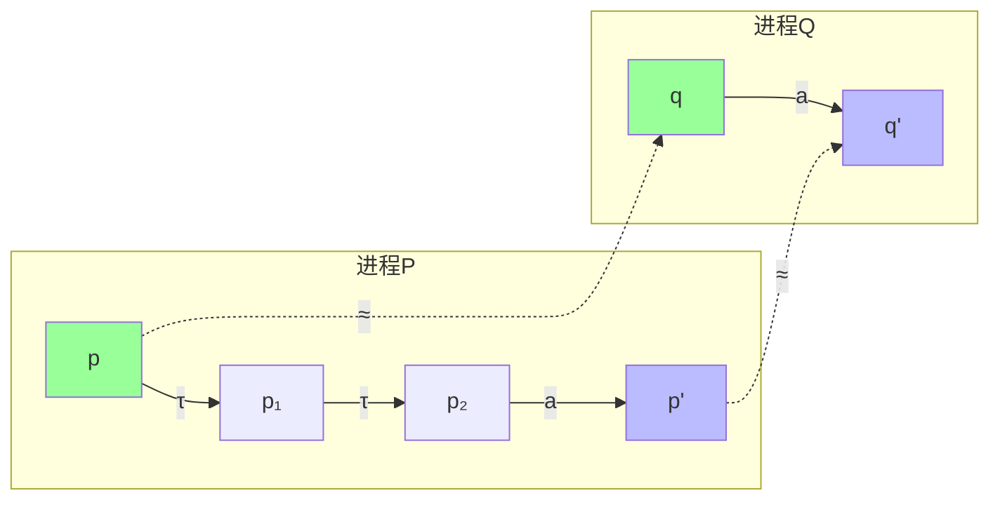
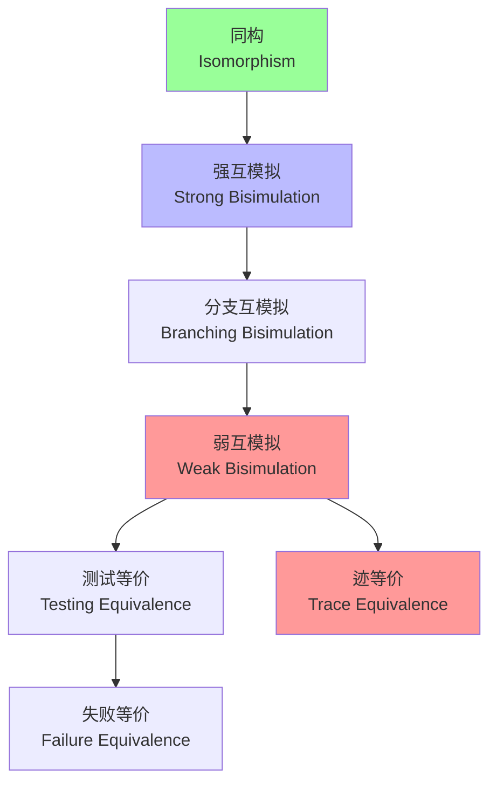
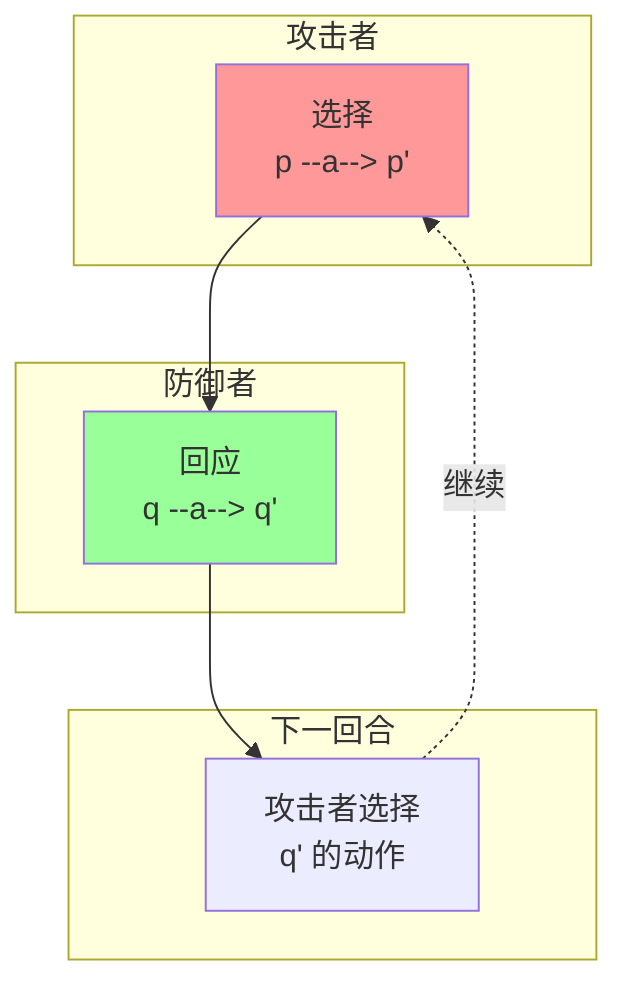
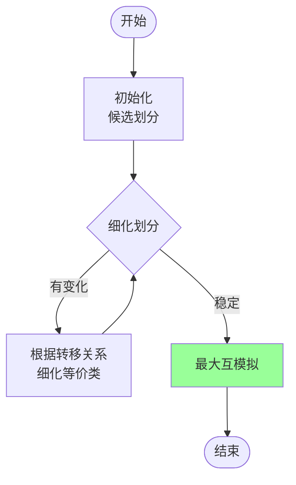
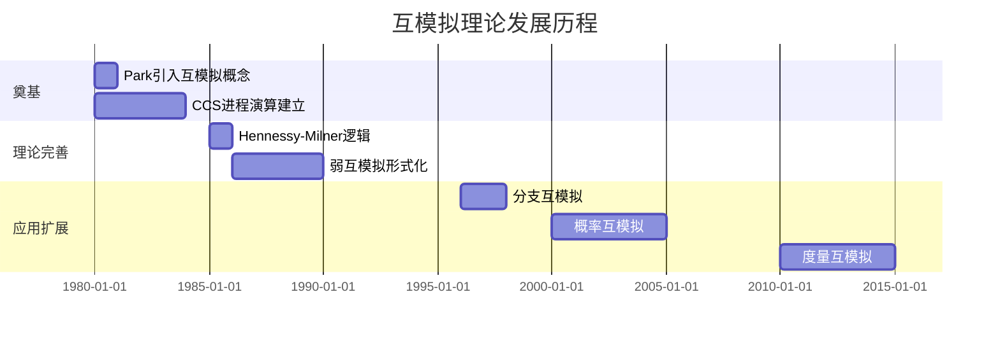
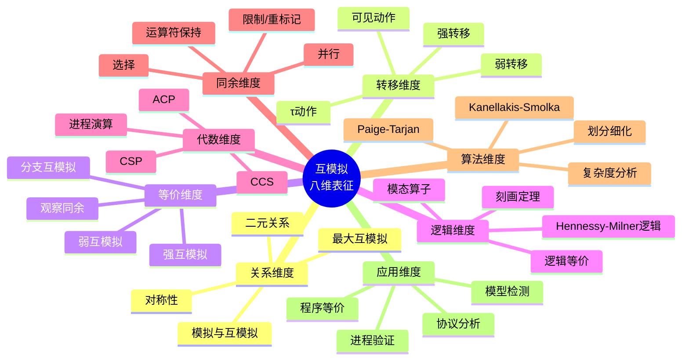

# 互模拟 (Bisimulation)

> **所属阶段**: Struct | **前置依赖**: [进程演算](../03-models/process-algebra.md), [标记转移系统](../01-foundations/lts.md) | **形式化等级**: L5

---

## 1. 概念定义 (Definitions)

### 1.1 Wikipedia标准定义

**英文定义** (Wikipedia):
> *In theoretical computer science a bisimulation is a binary relation between state transition systems, associating systems that behave in the same way in the sense that one system simulates the other and vice versa. Bisimulation is an important concept in concurrency theory and model checking.*

**中文定义** (Wikipedia):
> *互模拟是理论计算机科学中状态转移系统之间的二元关系，将行为相同的系统关联起来。其中一个系统模拟另一个，反之亦然。互模拟是并发理论和模型检测中的重要概念。*

---

### 1.2 形式化定义

#### Def-S-BIS-01: 标记转移系统 (Labeled Transition System)

**定义**: 一个标记转移系统 (LTS) 是一个三元组 $\mathcal{L} = (S, Act, \rightarrow)$，其中：

- $S$: 状态的非空集合
- $Act$: 动作（标签）的集合
- $\rightarrow \subseteq S \times Act \times S$: 转移关系，记作 $s \xrightarrow{a} s'$

$$\text{Def-S-BIS-01}: \mathcal{L} = (S, Act, \rightarrow)$$

---

#### Def-S-BIS-02: 强互模拟 (Strong Bisimulation)

**定义** (Park 1980): 给定LTS $\mathcal{L} = (S, Act, \rightarrow)$，关系 $\mathcal{R} \subseteq S \times S$ 是强互模拟，当且仅当：

若 $(p, q) \in \mathcal{R}$，则对所有 $a \in Act$：

1. **前向条件**: 若 $p \xrightarrow{a} p'$，则存在 $q'$ 使得 $q \xrightarrow{a} q'$ 且 $(p', q') \in \mathcal{R}$
2. **后向条件**: 若 $q \xrightarrow{a} q'$，则存在 $p'$ 使得 $p \xrightarrow{a} p'$ 且 $(p', q') \in \mathcal{R}$

**强互模拟等价** $\sim$:
$$p \sim q \iff \exists \mathcal{R}: \mathcal{R} \text{ 是强互模拟且 } (p, q) \in \mathcal{R}$$

---

#### Def-S-BIS-03: 弱互模拟 (Weak Bisimulation)

**定义**: 关系 $\mathcal{R}$ 是弱互模拟，当且仅当若 $(p, q) \in \mathcal{R}$，则对所有 $a \in Act$：

1. 若 $p \xrightarrow{a} p'$，则存在 $q'$ 使得 $q \xRightarrow{a} q'$ 且 $(p', q') \in \mathcal{R}$
2. 若 $q \xrightarrow{a} q'$，则存在 $p'$ 使得 $p \xRightarrow{a} p'$ 且 $(p', q') \in \mathcal{R}$

其中 $\xRightarrow{a}$ 表示弱转移：

- $\xRightarrow{\tau} = (\xrightarrow{\tau})^*$ （任意数量的内部动作）
- $\xRightarrow{a} = (\xrightarrow{\tau})^* \xrightarrow{a} (\xrightarrow{\tau})^*$ （$a \neq \tau$）

**弱互模拟等价** $\approx$:
$$p \approx q \iff \exists \mathcal{R}: \mathcal{R} \text{ 是弱互模拟且 } (p, q) \in \mathcal{R}$$

---

#### Def-S-BIS-04: 分支互模拟 (Branching Bisimulation)

**定义** (van Glabbeek & Weijland): 关系 $\mathcal{R}$ 是分支互模拟，当且仅当若 $(p, q) \in \mathcal{R}$ 且 $p \xrightarrow{a} p'$，则：

- 要么 $a = \tau$ 且 $(p', q) \in \mathcal{R}$
- 要么存在 $q', q''$ 使得 $q \xRightarrow{\tau} q'' \xrightarrow{a} q'$，$(p, q'') \in \mathcal{R}$，且 $(p', q') \in \mathcal{R}$

（要求匹配过程中经过的中间状态也与原状态相关）

---

#### Def-S-BIS-05: Hennessy-Milner逻辑

**定义**: Hennessy-Milner (HM) 逻辑的公式 $\phi$ 定义为：

$$\phi ::= \top \mid \neg\phi \mid \phi \land \phi \mid \langle a \rangle \phi$$

其中 $\langle a \rangle \phi$ 表示"存在一个$a$转移到达满足$\phi$的状态"。

**语义**:

- $s \models \langle a \rangle \phi \iff \exists s': s \xrightarrow{a} s' \land s' \models \phi$
- 对偶算子: $[a]\phi \equiv \neg\langle a \rangle\neg\phi$

---

## 2. 属性推导 (Properties)

### 2.1 互模拟的基本性质

#### Lemma-S-BIS-01: 强互模拟是等价关系

**引理**: $\sim$ 是自反、对称、传递的。

**证明**:

- **自反**: 恒等关系 $\{(s, s) \mid s \in S\}$ 是互模拟
- **对称**: 由定义中条件的对称性直接得到
- **传递**: 若 $\mathcal{R}_1, \mathcal{R}_2$ 是互模拟，则其复合 $\mathcal{R}_1 \circ \mathcal{R}_2$ 也是互模拟 ∎

---

#### Lemma-S-BIS-02: 最大互模拟存在性

**引理**: $\sim = \bigcup\{\mathcal{R} \mid \mathcal{R} \text{ 是强互模拟}\}$ 是最大强互模拟。

**证明**: 互模拟的任意并仍是互模拟（验证定义条件）。∎

---

#### Lemma-S-BIS-03: 弱互模拟的传递性

**引理**: 弱互模拟 $\approx$ 也是等价关系。

**注意**: 证明比强互模拟复杂，因为弱转移的组合需要仔细处理。∎

---

### 2.2 同余性引理

#### Lemma-S-BIS-04: 强互模拟的同余性

**引理**: 对于CCS运算符，强互模拟是同余关系：

- 若 $p \sim q$，则 $p + r \sim q + r$
- 若 $p \sim q$，则 $p \mid r \sim q \mid r$
- 若 $p \sim q$，则 $\alpha.p \sim \alpha.q$
- 若 $p \sim q$，则 $p[f] \sim q[f]$（重标记）
- 若 $p \sim q$，则 $p \backslash L \sim q \backslash L$（限制）

---

## 3. 关系建立 (Relations)

### 3.1 互模拟与其他等价关系

| 等价关系 | 关系强度 | 特征 |
|----------|----------|------|
| 同构 $\cong$ | 最强 | 结构完全相同 |
| 强互模拟 $\sim$ | 很强 | 步骤精确匹配 |
| 分支互模拟 | 强 | 保持分支结构 |
| 弱互模拟 $\approx$ | 中等 | 忽略$\tau$动作 |
| 测试等价 | 弱 | 通过测试区分 |
| 迹等价 | 较弱 | 只比较动作序列 |
| 失败等价 | 更弱 | 考虑拒绝集 |
| 观察等价 | 弱 | 观察者视角 |

**层次关系**:
$$p \cong q \implies p \sim q \implies p \approx_b q \implies p \approx q \implies p \sim_t q$$

---

### 3.2 与模态逻辑的关系

#### Prop-S-BIS-01: Hennessy-Milner定理

**命题**: 对有限分支的LTS，

$$p \sim q \iff \forall \phi \in \text{HM}: (p \models \phi \leftrightarrow q \models \phi)$$

即：强互模拟等价于满足相同的HM公式。

---

### 3.3 与 coalgebra 的关系

#### Prop-S-BIS-02: 互模拟作为coalgebra同态

**命题**: 在范畴论语境下，强互模拟对应于函子 $F(X) = \mathcal{P}(Act \times X)$ 的coalgebra之间的跨度（span）。

---

## 4. 论证过程 (Argumentation)

### 4.1 互模拟 vs 迹等价

#### 论证: 为何互模拟比迹等价更精细

**迹等价**: $p \sim_t q$ 当且仅当 $p$ 和 $q$ 产生相同的动作序列集合。

**反例**:

- $p = a.b + a.c$
- $q = a.(b + c)$

两者迹集合都是 $\{\varepsilon, a, ab, ac\}$，故迹等价。

**但**:

- $p$ 在 $a$ 后面临分支选择
- $q$ 在 $a$ 后才做选择

**互模拟区分**:

- $p \xrightarrow{a} b$ 必须被 $q$ 匹配
- $q \xrightarrow{a} b+c$，但 $b \not\sim b+c$（因为 $b+c \xrightarrow{c}$ 而 $b$ 不能）

因此 $p \not\sim q$。

---

### 4.2 弱互模拟的合理性

**动机**: 内部动作$\tau$不应被外部观察者直接看到。

**问题**: 简单忽略$\tau$会导致过粗等价。

**解决方案**: 分支互模拟保持"做选择时经过的状态"也等价。

---

## 5. 形式证明 (Formal Proofs)

### 5.1 定理: Hennessy-Milner刻画定理

#### Thm-S-BIS-01: 模态刻画定理

**定理** (Hennessy & Milner, 1985): 对于有限分支（无无限路径或有限选择分支）的LTS：

$$p \sim q \iff \forall \phi \in \text{HM}: p \models \phi \leftrightarrow q \models \phi$$

**证明**:

**($\Rightarrow$) 方向**: 若 $p \sim q$，则对任意HM公式 $\phi$，$p \models \phi \iff q \models \phi$

对 $\phi$ 结构归纳：

- $\top$: 显然
- $\phi_1 \land \phi_2$: 由归纳假设
- $\neg\phi$: 由归纳假设
- $\langle a \rangle \phi$: 若 $p \models \langle a \rangle \phi$，则 $\exists p': p \xrightarrow{a} p' \land p' \models \phi$
  - 由 $p \sim q$，$\exists q': q \xrightarrow{a} q' \land p' \sim q'$
  - 由归纳假设: $q' \models \phi$
  - 因此 $q \models \langle a \rangle \phi$

**($\Leftarrow$) 方向**: 若 $p$ 和 $q$ 满足相同HM公式，则 $p \sim q$

构造关系:
$$\mathcal{R} = \{(s, t) \mid \forall \phi: s \models \phi \leftrightarrow t \models \phi\}$$

证明 $\mathcal{R}$ 是强互模拟：

假设 $(p, q) \in \mathcal{R}$ 且 $p \xrightarrow{a} p'$。

**断言**: 存在 $q'$ 使得 $q \xrightarrow{a} q'$ 且 $(p', q') \in \mathcal{R}$。

**反证**: 假设不存在这样的 $q'$。

对每个满足 $q \xrightarrow{a} q_i$ 的 $q_i$：

- 由于 $(p', q_i) \notin \mathcal{R}$，存在公式 $\phi_i$ 使得 $p' \models \phi_i$ 但 $q_i \not\models \phi_i$
- （或反之，对称处理）

令 $\phi = \bigwedge_i \phi_i$（有限分支保证有限合取）

则：

- $p \models \langle a \rangle \phi$（通过 $p'$）
- 但对所有 $q_i$，$q_i \not\models \phi$，故 $q \not\models \langle a \rangle \phi$

这与 $(p, q) \in \mathcal{R}$ 矛盾！

因此 $\mathcal{R}$ 是强互模拟，且 $(p, q) \in \mathcal{R} \implies p \sim q$。 ∎

---

### 5.2 定理: 强互模拟的同余性定理

#### Thm-S-BIS-02: CCS运算符的同余性

**定理**: 强互模拟 $\sim$ 是CCS所有运算符的同余关系。

**证明** (关键算子):

**选择运算符 $+$**:

若 $p \sim q$，需证 $p + r \sim q + r$。

构造: $\mathcal{R} = \{(p + r, q + r) \mid p \sim q\} \cup \sim$

验证互模拟条件：

- 若 $p + r \xrightarrow{a} s$，分情况：
  - $p \xrightarrow{a} s$: 由 $p \sim q$，$\exists q': q \xrightarrow{a} q' \land s \sim q'$
    - 因此 $q + r \xrightarrow{a} q'$ 且 $(s, q') \in \mathcal{R}$
  - $r \xrightarrow{a} s$: 则 $q + r \xrightarrow{a} s$，且 $(s, s) \in \mathcal{R}$

**并行组合 $|$**:

若 $p \sim q$，需证 $p \mid r \sim q \mid r$。

构造: $\mathcal{R} = \{(p \mid r, q \mid r) \mid p \sim q\} \cup \sim$

验证涉及多种转移类型（左分量、右分量、同步），每种利用 $p \sim q$ 找到匹配转移。

**限制 $\backslash L$** 和 **重标记 $[f]$**: 类似构造。 ∎

---

### 5.3 定理: 弱互模拟的健全性

#### Thm-S-BIS-03: 弱互模拟保持观察等价

**定理**: 若 $p \approx q$，则对任何仅观察可见动作的环境，$p$ 和 $q$ 不可区分。

**形式化**: 设 $\mathcal{O}$ 是仅检查可见动作的观察上下文集合，

$$p \approx q \implies \forall O \in \mathcal{O}: O[p] \Downarrow \iff O[q] \Downarrow$$

其中 $\Downarrow$ 表示成功/接受。

**证明概要**:

对观察深度归纳，证明 $p \approx q$ 蕴含：

1. **基本观察**: $p \xRightarrow{a}$ 当且仅当 $q \xRightarrow{a}$
2. **归纳步骤**: 若 $p \xRightarrow{a} p'$，则 $\exists q': q \xRightarrow{a} q' \land p' \approx q'$

因此任何有限观察序列都无法区分 $p$ 和 $q$。 ∎

---

## 6. 实例验证 (Examples)

### 6.1 CCS进程互模拟验证

**进程定义**:

- $p = a.b + a.c$
- $q = a.(b + c)$

**验证 $p \not\sim q$**:

1. 假设 $\mathcal{R}$ 是包含 $(p, q)$ 的互模拟
2. $p \xrightarrow{a} b$
3. $q$ 必须以 $a$ 回应: $q \xrightarrow{a} b+c$
4. 需 $(b, b+c) \in \mathcal{R}$
5. 但 $b+c \xrightarrow{c}$ 而 $b$ 不能
6. 矛盾！故 $p \not\sim q$

---

### 6.2 缓冲区的互模拟

**单槽缓冲区**:

```
B1 = in.out.B1
```

**双槽缓冲区**:

```
B2 = in.B2'
B2' = in.out.B2'' + out.in.out.B2''
B2'' = out.B2'
```

**验证**: $B1 \not\sim B2$（容量不同）

但适当抽象后可能弱互模拟。

---

### 6.3 Peterson互斥算法

**验证目标**: 证明两个进程的互斥性质

**方法**:

1. 构造Peterson算法的LTS模型
2. 定义规范进程（理想互斥行为）
3. 证明二者互模拟

---

## 7. 可视化 (Visualizations)

### 7.1 强互模拟示意图



### 7.2 弱互模拟（隐藏τ）



### 7.3 等价关系层次



### 7.4 互模拟游戏



### 7.5 CCS运算符同余性

```mermaid
graph TB
    subgraph "选择 +"
        P1[p ~ q]
        P2[p + r ~ q + r]
    end

    subgraph "并行 |"
        Q1[p ~ q]
        Q2[p | r ~ q | r]
    end

    subgraph "限制 \\L"
        R1[p ~ q]
        R2[p \\ L ~ q \\ L]
    end

    subgraph "前缀 a."
        S1[p ~ q]
        S2[a.p ~ a.q]
    end

    style P2 fill:#bbf
    style Q2 fill:#bbf
    style R2 fill:#bbf
    style S2 fill:#bbf
```

### 7.6 互模拟检验算法流程



### 7.7 发展时间线



### 7.8 八维表征总图



---

## 8. 引用参考 (References)


---

*文档版本: v1.0 | 创建时间: 2026-04-10 | 最后更新: 2026-04-10*
