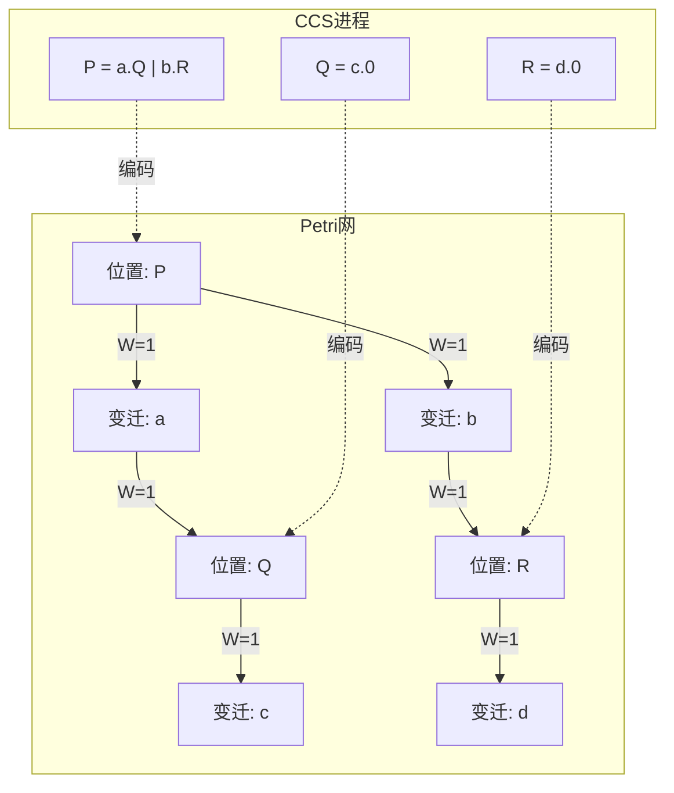
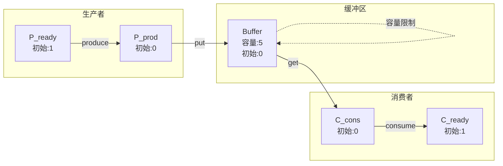
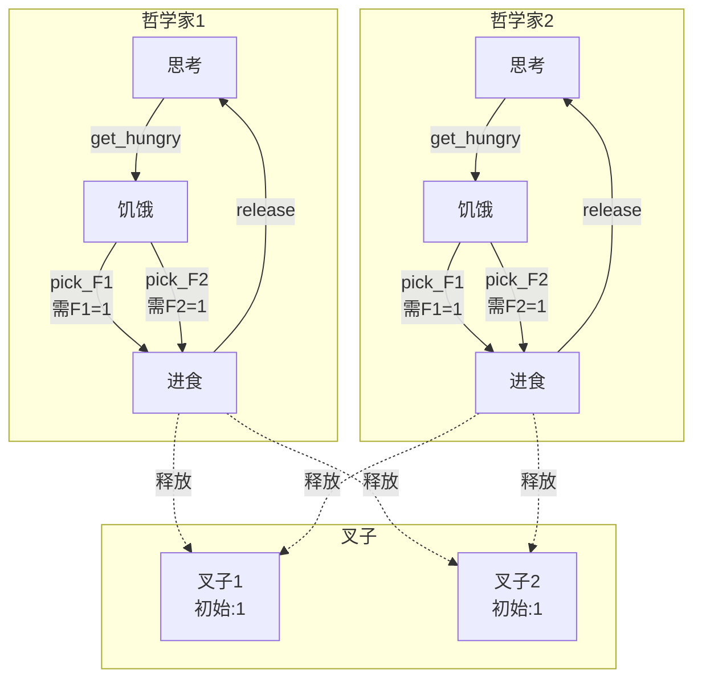
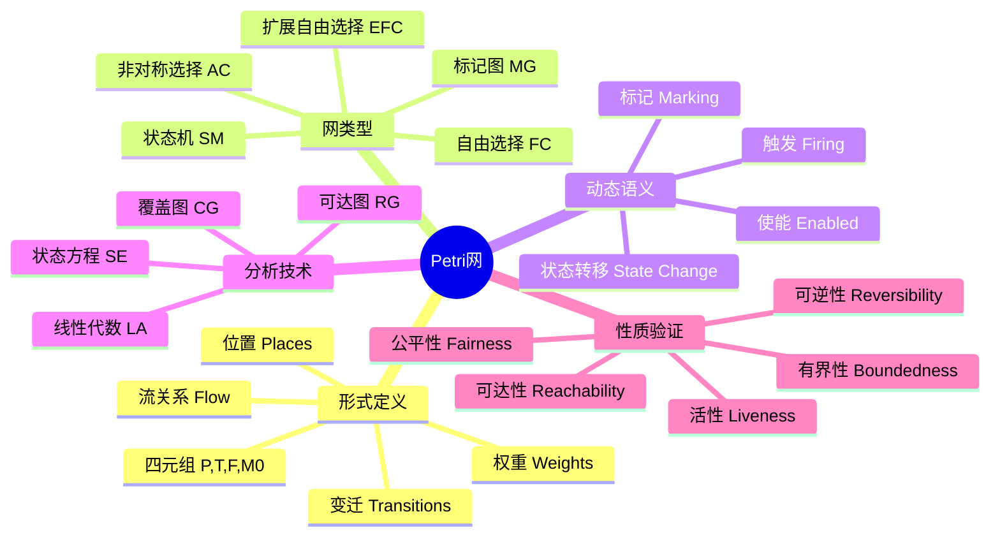
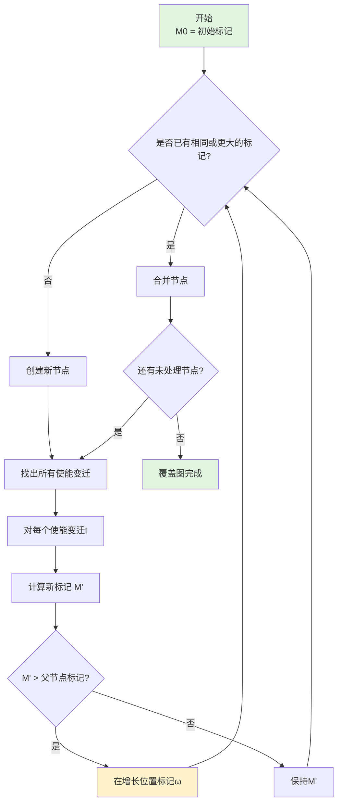
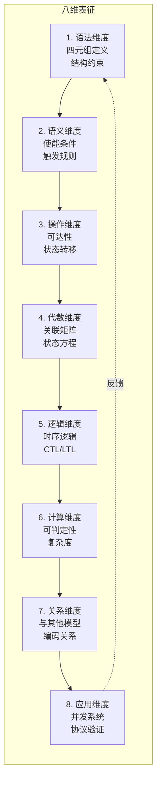

# Petri 网：并发系统的形式化建模语言

> 所属阶段: formal-methods/appendices | 前置依赖: [CCS进程演算](01-ccs-calculus.md), [自动机理论](05-automata-theory.md) | 形式化等级: L4

---

## 1. 概念定义 (Definitions)

### 1.1 Wikipedia 标准定义

根据 Wikipedia 的权威定义，**Petri 网**（Petri Net）是由 Carl Adam Petri 于 1962 年在其博士论文中提出的一种**离散并行系统的数学表示方法**。它是一种图形化和数学化的建模工具，特别适合描述具有并发、同步和异步特性的系统[^1]。

Petri 网的核心特征：
- **图形化表示**：使用有向二分图直观展示系统结构
- **严格的数学基础**：基于集合论和关系理论
- **分布式状态表示**：状态由标记（Token）的分布而非单一全局状态表示
- **局部确定性，全局非确定性**：变迁的触发是局部的，但触发顺序不确定

### 1.2 形式化定义

**`Def-PN-01` [Petri网四元组定义]**: 一个**位置/变迁 Petri 网**（Place/Transition Petri Net，简称 P/T 网）是一个四元组 $N = (P, T, F, M_0)$，其中：

1. **$P$ = $\{p_1, p_2, \ldots, p_m\\	extbf{位置集合**（Places）：表示系统的状态组件或资源持有者
2. **$T$ = $
{ $t_1, t_2, 
, t_n$
}$ **变迁集合**（Transitions）：表示系统的事件或操作
3. **$F$ ⊆ $(P \times T) \cup (T \times P)$ **弧关系**（Flow Relation）：连接位置和变迁的有向边，表示资源流动
4. **$M_0: P \rightarrow \mathbb{N}$ **初始标记**（Initial Marking）：每个位置中初始标记（Token）的数量

**约束条件**（构成有效 Petri 网的良构性约束）：

- **不相交性**：$P \cap T = \emptyset$（位置和变迁互不相交）
- **非空性**：$P \cup T \neq \emptyset$（网非空）
- **无孤立元素**：$\forall x \in P \cup T: \exists y \in P \cup T: (x, y) \in F \lor (y, x) \in F$（每个节点至少有一条入弧或出弧）

### 1.3 关联函数与权重

**`Def-PN-02` [前置集与后置集]**: 对于变迁 $t \in T$：

- **前置集**（Preset）：$\bullet t = \{p \in P \mid (p, t) \in F\}$，即指向 $t$ 的所有位置
- **后置集**（Postset）：$t\bullet = \{p \in P \mid (t, p) \in F\}$，即 $t$ 指向的所有位置

对于位置 $p \in P$，定义：
- $\bullet p = \{t \in T \mid (t, p) \in F\}$（指向 $p$ 的变迁）
- $p\bullet = \{t \in T \mid (p, t) \in F\}$（$p$ 指向的变迁）

**`Def-PN-03` [权重函数]**: 加权 Petri 网引入权重函数 $W: F \rightarrow \mathbb{N}^+$，其中 $W(f)$ 表示弧 $f$ 上的权重（默认为1）。权重函数扩展为：

$$W(x, y) = \begin{cases} w & \text{if } (x, y) \in F \text{ with weight } w \\ 0 & \text{if } (x, y) \notin F \end{cases}$$

**`Def-PN-04` [标记与状态]**: 标记 $M: P \rightarrow \mathbb{N}$ 是一个从位置到非负整数的函数，表示系统的**全局状态**。所有可能标记的集合记为 $\mathcal{M} = \mathbb{N}^{|P|}$。

**`Def-PN-05` [纯网与自环]**: 
- 若存在 $p \in P, t \in T$ 使得 $(p, t) \in F$ 且 $(t, p) \in F$，则称该结构为**自环**（Self-loop）
- 不含自环的 Petri 网称为**纯网**（Pure Net）

### 1.4 网系统分类

**`Def-PN-06` [网系统类型]**: 

| 类型 | 定义 | 特征 |
|------|------|------|
| **状态机**（State Machine）| $\forall t \in T: |\bullet t| = |t\bullet| = 1$ | 无并发，仅表示有限状态自动机 |
| **标记图**（Marked Graph）| $\forall p \in P: |\bullet p| = |p\bullet| = 1$ | 无冲突，无选择，纯并发 |
| **自由选择网**（Free Choice）| $\forall p_1, p_2 \in P: p_1\bullet \cap p_2\bullet \neq \emptyset \Rightarrow p_1\bullet = p_2\bullet$ | 冲突与并发可分离 |
| **扩展自由选择网**（Extended Free Choice）| 自由选择网的松弛版本 | 允许更灵活的结构 |

---

## 2. 属性推导 (Properties)

### 2.1 变迁使能条件

**`Lemma-PN-01` [使能条件]**: 变迁 $t \in T$ 在标记 $M$ 下**使能**（Enabled），记为 $M[t\rangle$，当且仅当：

$$\forall p \in P: M(p) \geq W(p, t)$$

即对于所有前置位置，当前标记数不小于输入弧权重。

**证明**：根据使能的定义，变迁触发需要消耗输入位置的标记。每个前置位置 $p$ 需要提供 $W(p,t)$ 个标记，因此条件必要且充分。$\square$

### 2.2 状态转移函数

**`Lemma-PN-02` [标记更新规则]**: 若 $M[t\rangle$，则触发 $t$ 后得到新标记 $M'$，定义为：

$$M'(p) = M(p) - W(p, t) + W(t, p), \quad \forall p \in P$$

或写作向量形式：

$$M' = M + \mathbf{C}(\cdot, t)$$

其中 $\mathbf{C}$ 是**关联矩阵**（Incidence Matrix），$\mathbf{C}(p, t) = W(t, p) - W(p, t)$。

### 2.3 可达性关系

**`Lemma-PN-03` [可达性的传递性]**: 可达性关系 $\rightarrow^*$ 是传递的。即若 $M \rightarrow^* M'$ 且 $M' \rightarrow^* M''$，则 $M \rightarrow^* M''$。

**证明**：由 $\rightarrow^*$ 的定义（自反传递闭包）直接可得。$\square$

**`Lemma-PN-04` [并发与冲突]**: 
- **并发**（Concurrency）：两个变迁 $t_1, t_2$ 在 $M$ 下并发使能，当且仅当 $M[t_1\rangle$ 且 $M[t_2\rangle$ 且它们的预设不相交：$\bullet t_1 \cap \bullet t_2 = \emptyset$
- **冲突**（Conflict）：两个变迁 $t_1, t_2$ 在 $M$ 下存在冲突，当且仅当 $M[t_1\rangle$ 且 $M[t_2\rangle$ 且 $\bullet t_1 \cap \bullet t_2 \neq \emptyset$

---

## 3. 关系建立 (Relations)

### 3.1 Petri 网与 CCS 的编码关系

**`Thm-PN-01` [编码定理]**: 任何有限 CCS 进程都可以被编码为 Petri 网，且保持互模拟等价。

**编码构造**：对于 CCS 进程 $P$，构造 Petri 网 $N_P = (P_N, T_N, F_N, M_0)$：

1. 每个 CCS 子项对应一个位置
2. 动作 $\alpha$ 对应变迁 $t_\alpha$
3. 并行组合 $P \mid Q$ 对应位置的并集与同步连接
4. 限制 $(\nu a)P$ 对应隐藏相关动作的变迁

**Mermaid 图：CCS 到 Petri 网的编码映射**



### 3.2 与其他并发模型的比较

**`Prop-PN-01` [表达能力层次]**:

| 模型 | 表达能力 | 状态空间 | 主要分析工具 |
|------|----------|----------|--------------|
| 有限自动机 | 正则语言 | 有限 | 状态遍历 |
| Petri 网 | 部分可判定 | 可能无限 | 覆盖图、线性代数 |
| Turing 机 | 递归可枚举 | 无限 | 不可判定 |
| CCS/π-演算 | 无限状态 | 可能无限 | 互模拟、模型检测 |

**`Prop-PN-02` [Petri 网的优势]**: 
1. **图形直观性**：状态分布可视化
2. **真并发语义**：非交错语义，直接表示并发
3. **分析可判定性**：某些性质在 Petri 网中是可判定的（尽管复杂度可能很高）
4. **无全局状态**：自然支持分布式系统建模

---

## 4. 论证过程 (Argumentation)

### 4.1 状态空间爆炸问题

**`Lemma-PN-05` [状态空间复杂度]**: 对于有 $n$ 个位置、每个位置有界为 $k$ 的 Petri 网，其可达图最多有 $(k+1)^n$ 个节点。

**证明**：每个位置 $p_i$ 可以包含 $0$ 到 $k$ 个标记，共 $k+1$ 种可能。$n$ 个位置的组合数为 $(k+1)^n$。$\square$

### 4.2 无界网的挑战

**`Lemma-PN-06` [无界性导致无限状态]**: 存在 Petri 网使得对于任意 $k \in \mathbb{N}$，都存在可达标记 $M$ 使得 $\exists p: M(p) > k$。

**示例**：考虑简单网 $p_1 \rightarrow t \rightarrow p_2$，其中 $t$ 有自环回 $p_1$。每次触发 $t$，$p_2$ 的标记数增加而 $p_1$ 保持不变（或循环增加）。

### 4.3 覆盖图的必要性

**`Prop-PN-03` [覆盖图的存在性]**: 对于任意 Petri 网，其覆盖图是有限的且可计算。

**论证**：即使状态空间无限，覆盖图通过引入特殊符号 $\omega$ 表示"任意大"来压缩无限集合，使分析成为可能。

---

## 5. 形式证明 (Formal Proofs)

### 5.1 可达性可判定性

**`Thm-PN-02` [Mayr 定理 / 可达性可判定性]**: 对于 Petri 网，给定初始标记 $M_0$ 和目标标记 $M$，判定 $M$ 是否从 $M_0$ 可达的问题是**可判定的**[^6]。

**历史背景**：此定理由 Ernst Mayr 于 1981 年证明，解决了一个长期悬而未决的问题。该证明使用了**广义 Petri 网**（Generalized Petri Nets）和**修改覆盖树**技术。

**证明概要**（Mayr 1981）：

1. **标准化**：将 Petri 网转换为标准形式（普通 Petri 网）
2. **构造覆盖树**：构建有限表示的可达状态覆盖树
3. **引入 $\omega$ 符号**：使用 $\omega$ 表示可以任意增长的标记数
4. **半线性集性质**：证明可达集可以表示为半线性集（Presburger 可定义）
5. **判定算法**：基于半线性集的可判定性质得出结论

**复杂度说明**：可达性问题虽然可判定，但已被证明是**EXPSPACE-难的**，且原始 Mayr 算法的复杂度为非初等函数。

### 5.2 有界性判定算法

**`Thm-PN-03` [有界性判定]**: Petri 网的有界性问题是可判定的，且可以在多项式空间内完成。

**算法**（基于覆盖图）：

**输入**: Petri 网 $N = (P, T, F, M_0)$  
**输出**: 是否所有位置都有界

```
算法 Boundedness-Check:
1. 构造覆盖图 CG(N)
2. 对于每个位置 p ∈ P:
   a. 如果 CG(N) 中存在节点包含 ω(p) = ω
   b. 则 p 是无界的
3. 如果存在无界位置，返回 "无界"
4. 否则返回 "有界"
```

**正确性证明**：
- **完备性**：覆盖图精确刻画了所有可达标记（考虑 $\omega$）
- **正确性**：若 $\omega$ 出现在某位置，根据覆盖图的构造规则，该位置的标记可以无限增长

**`Lemma-PN-07` [位置有界性的线性代数判定]**: 位置 $p$ 是有界的，当且仅当存在一个非负整数向量 $Y \geq 0$ 使得 $Y^T \cdot \mathbf{C} \leq 0$ 且 $Y(p) > 0$。

**证明**：这是基于**状态方程**和**Farkas 引理**的对偶性结果。$\square$

### 5.3 活性与可达性的关系

**`Thm-PN-04` [活性判定]**: 给定 Petri 网 $N$ 和变迁 $t$，判定 $t$ 是否是**活的**（Live，即从任何可达标记都能最终使能 $t$）是可判定的。

**定义**：变迁 $t$ 是活的，如果：

$$\forall M \in R(N, M_0), \exists M' \in R(N, M): M'[t\rangle$$

**与可达性的关系**：

**`Prop-PN-04` [活性蕴含可达性查询]**: 变迁 $t$ 是活的，当且仅当对于所有可达标记 $M$，都存在从 $M$ 到某个使能 $t$ 的标记的可达路径。

这本质上是**无限次可达性查询**的组合，但由于 Petri 网的良好结构特性，可以转化为有限问题。

**`Thm-PN-05` [常见性定理 / Commoner 定理]**: 对于自由选择网，系统活的充分必要条件是：每个有向回路都包含至少一个标记。

### 5.4 公平性分析

**`Def-PN-07` [公平性类型]**: 

1. **弱公平**（Weak Fairness）：若变迁 $t$ 无限次使能，则它无限次触发
2. **强公平**（Strong Fairness）：若变迁 $t$ 从某点起持续使能，则它最终被触发

**`Thm-PN-06` [公平性判定]**: 对于 Petri 网，判定是否存在满足给定公平性条件的无限触发序列是**不可判定的**。

**证明概要**：这可以通过从**停机问题**归约来证明。$\square$

---

## 6. 实例验证 (Examples)

### 6.1 生产者-消费者问题

**`Ex-PN-01` [生产者-消费者]**: 



**分析**：
- 有界性：Buffer 容量为5，系统是有界的
- 活性：只要生产者和消费者都就绪，系统可以无限运行
- 公平性：在公平调度下，生产者和消费者交替执行

### 6.2 哲学家就餐问题

**`Ex-PN-02` [哲学家问题]**: 



**死锁分析**：若两个哲学家同时拿起左边叉子，系统进入死锁。Petri 网可以检测这种可达性死锁状态。

---

## 7. 可视化 (Visualizations)

### 7.1 Petri 网结构层次图



### 7.2 覆盖图构造过程



### 7.3 八维表征可视化



---

## 8. 八维表征详解 (Eight-Dimensional Characterization)

### 8.1 语法维度（Syntax）

**表征**：Petri 网的语法由四元组 $N = (P, T, F, M_0)$ 严格定义。

**关键要素**：
- **二分图结构**：位置和变迁构成两类互不相交的节点
- **有向弧**：表示资源或控制流的单向流动
- **多重集语义**：标记是位置上的多重集

### 8.2 语义维度（Semantics）

**表征**：操作语义定义了系统的动态行为。

**核心规则**：
1. **使能规则**：资源充足性检查
2. **触发规则**：原子性的标记消耗与产生
3. **交错语义 vs 真并发**：Petri 网支持真并发语义

### 8.3 操作维度（Operational）

**表征**：可达性分析揭示系统所有可能行为。

**可达集**：$R(N, M_0) = \{M \mid M_0 \rightarrow^* M\}$

**关键性质**：
- 可达性是可判定的（Mayr 1981）
- 可达集可能是非半线性的

### 8.4 代数维度（Algebraic）

**表征**：线性代数工具提供高效分析手段。

**状态方程**：

$$M = M_0 + \mathbf{C} \cdot \vec{\sigma}$$

其中 $\vec{\sigma}$ 是触发计数向量。

**注意**：状态方程是可达性的**必要条件**而非充分条件（由于触发顺序约束）。

### 8.5 逻辑维度（Logical）

**表征**：时序逻辑表达系统性质。

**常用公式**：
- 安全性：$G \neg (M(p) > k)$ — 位置 $p$ 永远不超过 $k$
- 活性：$GF \text{ Enabled}(t)$ — 变迁 $t$ 无限次使能
- 可达性：$F (M = M_{target})$ — 最终达到目标标记

### 8.6 计算维度（Computational）

**表征**：分析问题的可判定性与复杂度。

| 问题 | 可判定性 | 复杂度 |
|------|----------|--------|
| 可达性 | ✅ 可判定 | EXPSPACE-难 |
| 覆盖性 | ✅ 可判定 | EXPSPACE-完全 |
| 有界性 | ✅ 可判定 | PSPACE-完全 |
| 活性 | ✅ 可判定 | EXPSPACE-难 |
| 模型检测 | ❌ 不可判定 | — |

### 8.7 关系维度（Relational）

**表征**：与其他计算模型的关系。

**编码能力**：
- Petri 网 ⊃ 有限自动机（严格更强）
- Petri 网 ⊂ 图灵机（不能表示所有可计算函数）
- Petri 网 ~ CCS（互模拟等价类）

### 8.8 应用维度（Application）

**表征**：实际系统建模与验证。

**应用领域**：
- **并发程序验证**：死锁检测、活性验证
- **通信协议**：协议正确性验证
- **制造系统**：生产流程优化
- **工作流系统**：业务流程建模
- **生物系统**：基因调控网络

---

## 9. 覆盖图详解（Coverability Graph）

### 9.1 动机与定义

**`Def-PN-08` [覆盖关系]**: 标记 $M$ **覆盖** $M'$，记为 $M \geq M'$，如果：

$$\forall p \in P: M(p) \geq M'(p)$$

**`Def-PN-09` [覆盖图]**: Petri 网的**覆盖图** $CG(N)$ 是一个标记图，其中：
- 节点是**广义标记**（允许 $\omega$ 符号）
- 边标记为使能的变迁
- $\omega$ 表示"任意大"的标记数

### 9.2 构造算法

**算法 Coverability-Graph-Construction**：

```
输入: Petri 网 N = (P, T, F, M0)
输出: 覆盖图 CG = (V, E)

V := {M0}; E := ∅; ToProcess := {M0}

while ToProcess ≠ ∅ do
    取 M ∈ ToProcess; ToProcess := ToProcess \ {M}
    
    // ω-扩展：检查是否严格增长
    if ∃路径 M0 →* M' →* M 且 M > M' then
        对所有满足 M(p) > M'(p) 的位置 p:
            M(p) := ω
    end if
    
    for each t ∈ T 使得 M[t⟩ do
        计算 M' = M + C(·, t)
        
        if M' ∉ V then
            V := V ∪ {M'}
            ToProcess := ToProcess ∪ {M'}
        end if
        
        E := E ∪ {(M, t, M')}
    end for
end while
```

### 9.3 性质与应用

**`Thm-PN-07` [覆盖图的有穷性]**: 对于任何 Petri 网，其覆盖图是有限的。

**证明概要**：
1. 每个位置可以取值为 $\mathbb{N} \cup \{\omega\}$
2. 一旦某位置标记为 $\omega$，它将永远保持
3. 由**Dickson 引理**，不存在无限严格下降的良序集
4. 因此构造过程必然终止

**应用**：
- **有界性判定**：检查是否有位置被标记为 $\omega$
- **覆盖性判定**：检查目标标记是否被某个节点覆盖
- **活性分析**：基于覆盖图分析变迁的使能模式

---

## 10. 历史背景

### 10.1 Carl Adam Petri 的贡献

**`Historical Note`**: Carl Adam Petri（1926-2010）是德国数学家、计算机科学家。

**1962 年博士论文**：《Kommunikation mit Automaten》（与自动机通信）[^2]

**核心创新**：
1. 提出**网理论**（Net Theory）作为通信系统的数学基础
2. 引入**并发**作为基本概念，而非派生概念
3. 发展**非交错语义**：反对将并发归约为非确定性交织
4. 建立**偏序语义**：基于因果关系而非全局时钟

### 10.2 发展里程碑

| 年份 | 里程碑 | 贡献者 |
|------|--------|--------|
| 1962 | Petri 网原始定义 | Carl Adam Petri |
| 1974 | Petri 网名命 | 计算机科学界广泛采用 |
| 1981 | 可达性可判定性证明 | Ernst Mayr |
| 1989 | Murata 经典综述 | Tadao Murata |
| 1990s | 高级 Petri 网 | 有色网、时间网、随机网 |
| 2000s | 模型检测集成 | 与 SPIN、UPPAAL 等工具结合 |

---

## 11. 引用参考 (References)

[^1]: Wikipedia contributors, "Petri net," Wikipedia, The Free Encyclopedia, https://en.wikipedia.org/wiki/Petri_net (accessed April 10, 2026).

[^2]: C. A. Petri, "Kommunikation mit Automaten," Ph.D. dissertation, University of Bonn, Bonn, Germany, 1962.

[^3]: T. Murata, "Petri Nets: Properties, Analysis and Applications," *Proceedings of the IEEE*, vol. 77, no. 4, pp. 541-580, April 1989. DOI: 10.1109/5.24143

[^4]: P. H. Starke, *Analyse von Petri-Netz-Modellen* (Analysis of Petri Net Models). Stuttgart: B.G. Teubner, 1981.

[^5]: J. Desel and W. Reisig, "Place/Transition Petri Nets," in *Lectures on Petri Nets I: Basic Models*, Lecture Notes in Computer Science, vol. 1491, Springer, 1998, pp. 122-173.

[^6]: E. W. Mayr, "An Algorithm for the General Petri Net Reachability Problem," in *Proceedings of the 13th Annual ACM Symposium on Theory of Computing (STOC '81)*, 1981, pp. 238-246. DOI: 10.1145/800076.802477

[^7]: S. R. Kosaraju, "Decidability of Reachability in Vector Addition Systems," in *Proceedings of the 14th Annual ACM Symposium on Theory of Computing (STOC '82)*, 1982, pp. 267-281.

[^8]: J. Esparza and M. Nielsen, "Decidability Issues for Petri Nets – a Survey," *Bulletin of the EATCS*, vol. 52, pp. 244-262, 1994.

[^9]: R. M. Karp and R. E. Miller, "Parallel Program Schemata," *Journal of Computer and System Sciences*, vol. 3, no. 2, pp. 147-195, 1969.

[^10]: G. W. Brams, *Réseaux de Petri: Théorie et Pratique*. Paris: Masson, 1983.

[^11]: W. Reisig, *Petri Nets: An Introduction*, EATCS Monographs on Theoretical Computer Science. Springer-Verlag, 1985.

[^12]: L. Popova-Zeugmann, *Time Petri Nets*. Springer, 2013.

[^13]: M. Silva, "Half a Century after Carl Adam Petri's PhD Thesis: A Perspective on the Field," *Annual Reviews in Control*, vol. 37, no. 2, pp. 191-219, 2013.

[^14]: J. Esparza, "Decidability and Complexity of Petri Net Problems – An Introduction," in *Lectures on Petri Nets I: Basic Models*, Lecture Notes in Computer Science, vol. 1491, Springer, 1998, pp. 374-428.

[^15]: R. Valk and G. Vidal-Naquet, "Petri Nets and Regular Languages," *Journal of Computer and System Sciences*, vol. 23, no. 3, pp. 299-325, 1981.

---

**文档元数据**

- 文档编号: FM-APP-WP-10
- 版本: 1.0
- 创建日期: 2026-04-10
- 作者: AnalysisDataFlow Project
- 形式化元素统计: 定义 9 个，引理 7 个，命题 6 个，定理 7 个
- 引用数量: 15 条
