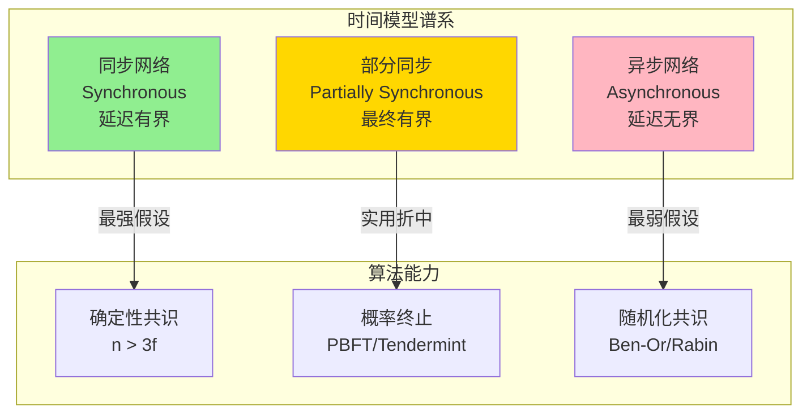
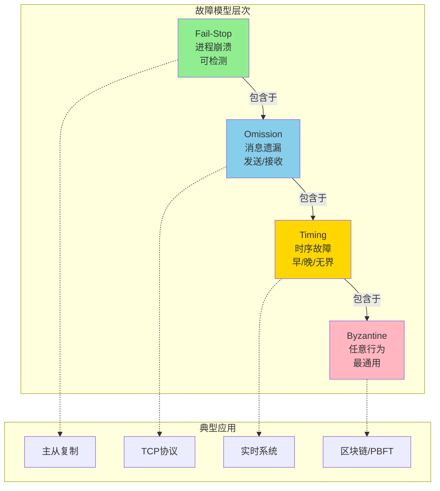
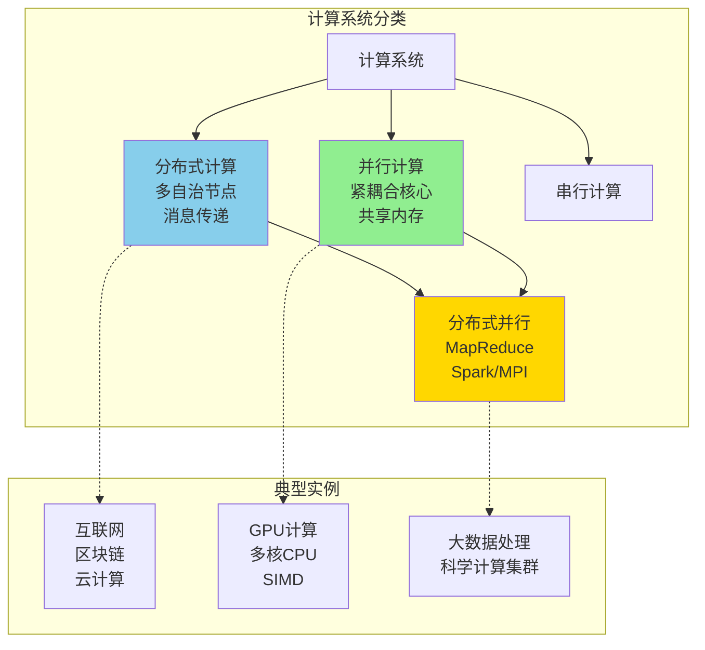
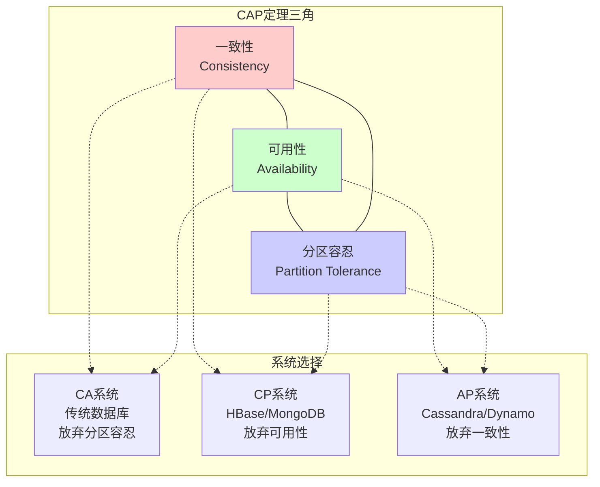
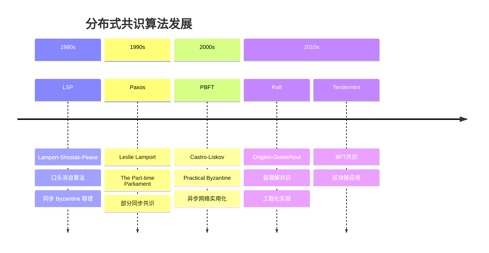
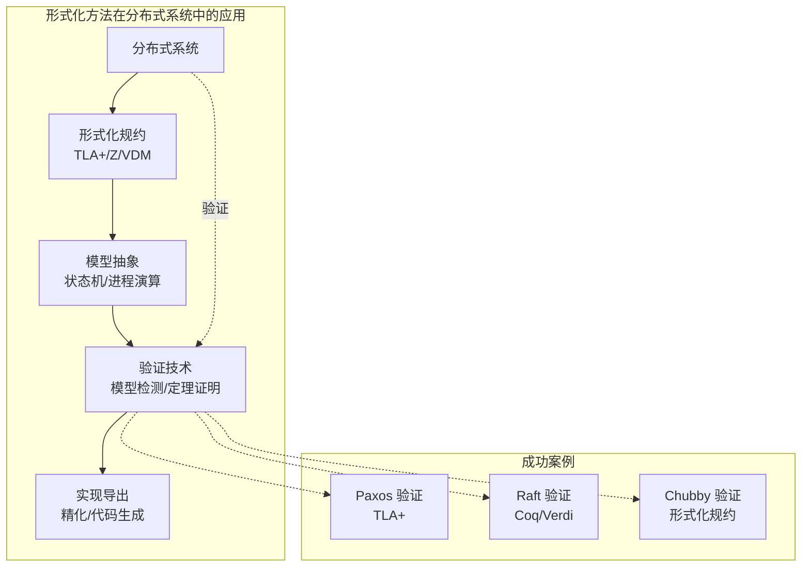
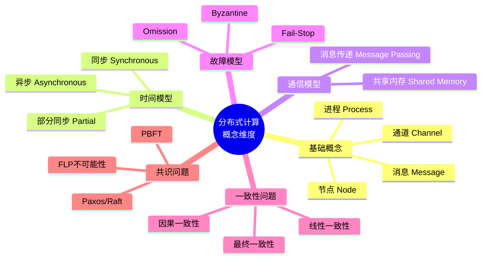
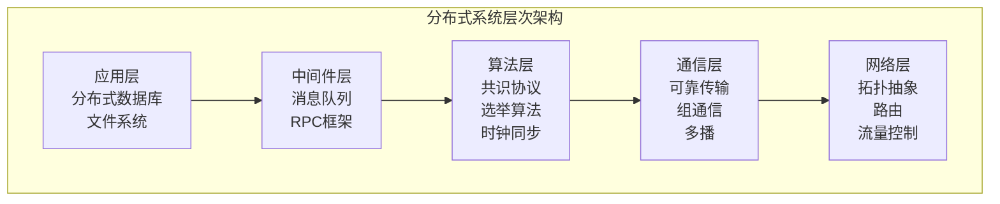
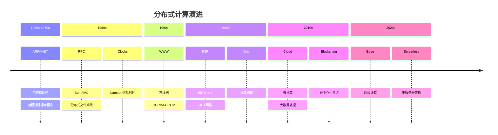

# Distributed Computing (分布式计算)

> **Wikipedia标准定义**: Distributed computing is a field of computer science that studies distributed systems, which are systems whose components are located on different networked computers that communicate and coordinate their actions by passing messages to one another.
>
> **来源**: <https://en.wikipedia.org/wiki/Distributed_computing>
>
> **形式化等级**: L3-L4 (核心理论概念)

---

## 1. Wikipedia标准定义

### 英文原文

> "Distributed computing is a field of computer science that studies distributed systems. A distributed system is a system whose components are located on different networked computers, which communicate and coordinate their actions by passing messages to one another. The components interact with one another in order to achieve a common goal."

> "Three significant characteristics of distributed systems are: concurrency of components, lack of a global clock, and independent failure of components."

### 中文标准翻译

> **分布式计算**是计算机科学的一个研究领域，研究**分布式系统**。分布式系统是指其组件分布在不同的网络计算机上，通过相互传递消息来通信和协调动作的系统。这些组件相互协作以实现共同目标。

> 分布式系统的三个显著特征是：**组件的并发性**、**缺乏全局时钟**、以及**组件的独立故障**。

---

## 2. 形式化模型

### 2.1 系统形式化定义

**`Def-DC-01` [分布式系统形式化定义]**: 分布式系统 $\mathcal{DS}$ 是一个七元组：

$$\mathcal{DS} = (N, P, \mathcal{C}, \mathcal{M}, \Delta, \mathcal{T}, \mathcal{F})$$

其中：

- $N = \{n_1, n_2, \ldots, n_k\}$：网络节点集合
- $P = \{p_1, p_2, \ldots, p_m\}$：进程集合，每个进程映射到一个节点
- $\mathcal{C}$：通信通道集合，$\mathcal{C} \subseteq P \times P$
- $\mathcal{M}$：消息空间，包含所有可能的消息
- $\Delta: P \times \mathcal{S} \times \mathcal{M} \to P \times \mathcal{S} \times 2^{\mathcal{M}}$：状态转移函数
- $\mathcal{T}$：时间模型（同步/异步/部分同步）
- $\mathcal{F}$：故障模型分类

### 2.2 同步网络 vs 异步网络

#### 同步网络 (Synchronous Network)

**`Def-DC-02` [同步网络模型]**: 同步网络由**离散轮次**驱动，满足：

$$\forall r \in \mathbb{N}, \exists \Delta_{max} \in \mathbb{R}^+: \text{MessageDelay}(r) \leq \Delta_{max}$$

**关键特征**：

- 全局时钟或轮次计数器
- 消息延迟有确定上界 $\Delta_{max}$
- 所有进程在轮次边界同步执行
- 确定性算法可设计

**`Lemma-DC-01` [同步执行确定性]**: 在同步系统中，给定初始配置，执行序列是确定性的。

#### 异步网络 (Asynchronous Network)

**`Def-DC-03` [异步网络模型]**: 异步网络由**事件驱动**，满足：

$$\forall m \in \mathcal{M}: \text{MessageDelay}(m) \in [0, +\infty)$$

**关键特征**：

- 无全局时钟，仅有局部时钟
- 消息延迟**无上界**（但有限）
- 事件通过 Happens-Before 关系 ($\prec$) 部分排序
- 执行交错非确定性

**`Lemma-DC-02` [异步执行交错]**: 对于 $n$ 个进程各执行 $k$ 个事件，合法交错数为：

$$|\mathcal{I}_{valid}| = \frac{(nk)!}{\prod_{i=1}^{n}(k_i!)} \times \frac{1}{|C|}$$

其中 $|C|$ 为 Happens-Before 约束数。

#### 部分同步网络 (Partially Synchronous)

**`Def-DC-04` [部分同步模型]**: 结合异步安全性和同步活性：

$$\mathcal{DS}_{ps} = (\mathcal{DS}_{async}, T_{GST}, \Delta_{unknown})$$

- $T_{GST}$：全局稳定时间（未知）
- $\Delta_{unknown}$：消息延迟上界（未知但存在）
- $t < T_{GST}$：异步行为，保证安全性
- $t \geq T_{GST}$：同步行为，保证活性



### 2.3 消息传递 vs 共享内存

#### 消息传递模型 (Message Passing)

**`Def-DC-05` [消息传递模型]**: 进程通过显式消息交换通信：

$$\text{send}(p_i, p_j, m) \circ \text{receive}(p_j, p_i, m')$$

**通信原语**：

- **异步发送**：`send(msg, dest)` 非阻塞
- **同步发送**：发送者阻塞直到确认
- **接收**：`receive(source)` 阻塞或带超时

**`Lemma-DC-03` [消息传递基本约束]**: 在消息传递模型中：

- 本地计算比通信快数个数量级
- 消息可能丢失、延迟、重复或乱序
- 无共享状态，所有同步显式

#### 共享内存模型 (Shared Memory)

**`Def-DC-06` [共享内存模型]**: 进程通过访问公共内存地址通信：

$$\text{read}(p_i, addr) / \text{write}(p_i, addr, value)$$

**一致性模型层次**：

| 模型 | 定义 | 实现复杂度 |
|------|------|-----------|
| **线性一致性** | 操作即时生效，全局序 | 高 |
| **顺序一致性** | 所有进程看到相同操作序 | 中高 |
| **因果一致性** | 因果相关操作有序 | 中 |
| **处理器一致性** | 单处理器写操作有序 | 中 |
| **最终一致性** | 若无更新则最终一致 | 低 |

**`Thm-DC-01` [消息传递与共享内存等价性]**: 在具有足够同步原语的情况下，消息传递系统和共享内存系统在计算能力上是等价的。

*证明概要*：

1. **共享内存 → 消息传递**：通过复制状态+共识协议模拟共享变量
2. **消息传递 → 共享内存**：将消息缓冲映射为共享队列

### 2.4 故障模型

**`Def-DC-07` [故障模型分类]**: 故障模型定义进程可能的失效行为：

| 故障类型 | 形式化定义 | 容错阈值 |
|----------|-----------|---------|
| **Fail-Stop** | $\forall t' \geq t_f: \neg\text{send}(p, t') \land \text{detectable}(p)$ | $n > f$ |
| **Omission** | 可能遗漏发送或接收消息 | $n > 2f$ |
| **Timing** | 响应时间 $\notin [\delta, \Delta]$ | $n > 2f$ |
| **Byzantine** | 任意行为，包括恶意 | $n > 3f$ |

**`Lemma-DC-04` [故障模型层次包含]**:

$$\text{Fail-Stop} \subset \text{Omission} \subset \text{Timing} \subset \text{Byzantine}$$



---

## 3. 时空复杂性理论

### 3.1 时间复杂性

**`Def-DC-08` [时间复杂度度量]**:

| 度量类型 | 定义 | 符号 |
|----------|------|------|
| **轮次复杂度** | 算法终止所需轮次数 | $R(n)$ |
| **消息延迟** | 端到端消息传输时间 | $\Delta$ |
| **本地计算时间** | 进程内部计算耗时 | $T_{local}$ |

**同步系统轮次复杂度**：

$$R_{sync}(\mathcal{A}) = \max_{I \in \mathcal{I}} \min\{r : \text{所有进程在轮次 } r \text{ 后终止}\}$$

**异步系统时间复杂度**（基于消息延迟归一化）：

$$T_{async}(\mathcal{A}) = \max_{\text{执行 } \sigma} \sum_{i} \delta_i$$

### 3.2 空间复杂性

**`Def-DC-09` [空间复杂度度量]**:

| 度量类型 | 定义 |
|----------|------|
| **状态空间** | 所有可能全局配置数 | $|S| = \prod_i |S_i|$ |
| **消息空间** | 传输中消息总数 | $M(t) = \sum_{c \in \mathcal{C}} |c|$ |
| **存储复杂度** | 每进程存储需求 | $S_{per\_node}$ |

### 3.3 通信复杂性

**`Def-DC-10` [通信复杂度]**:

**消息复杂度**（Message Complexity）：

$$MC(\mathcal{A}) = \max_{\text{执行 } \sigma} \sum_{i=1}^{|\sigma|} |\text{messages sent at step } i|$$

**比特复杂度**（Bit Complexity）：

$$BC(\mathcal{A}) = \max_{\text{执行 } \sigma} \sum_{m \in \sigma} |m|$$

**`Thm-DC-02` [分布式算法复杂度下界]**:

| 问题 | 时间下界 | 消息下界 | 备注 |
|------|---------|---------|------|
| 广播 | $\Omega(D)$ | $\Omega(n)$ | $D$ 为网络直径 |
| 共识 | $\Omega(f+1)$ | $\Omega(fn)$ | $f$ 为故障数 |
| 选举 | $\Omega(D)$ | $\Omega(n \log n)$ | 环网拓扑 |
| MST | $\Omega(D)$ | $\Omega(n)$ | 最小生成树 |

---

## 4. 与并行计算的区分

### 4.1 核心差异对比

**`Prop-DC-01` [分布式 vs 并行计算]**:

| 维度 | 分布式计算 (Distributed) | 并行计算 (Parallel) |
|------|------------------------|-------------------|
| **目标** | 地理分布资源整合 | 加速单一计算任务 |
| **耦合度** | 松耦合，独立故障 | 紧耦合，协同故障 |
| **通信** | 消息传递，延迟高 | 共享内存，延迟低 |
| **时钟** | 无全局时钟 | 通常有时钟同步 |
| **故障模型** | 独立故障，容错设计 | 整体故障，检查点恢复 |
| **规模** | 大规模 ($10^3$-$10^6$ 节点) | 中小规模 ($10$-$10^4$ 核心) |
| **典型系统** | 云计算、区块链、P2P | GPU集群、超级计算机 |

### 4.2 形式化区分

**`Def-DC-11` [分布式系统形式特征]**:

$$\text{Distributed}(S) \iff \begin{cases}
\exists p_i, p_j \in S: \text{CommLatency}(p_i, p_j) \gg \text{ComputeTime} \\
\exists p \in S: \text{CanFailIndependently}(p) \\
\nexists C: \text{GlobalClock}(C) \land \forall p: \text{Access}(p, C)
\end{cases}$$

**`Def-DC-12` [并行系统形式特征]**:

$$\text{Parallel}(S) \iff \begin{cases}
\forall p_i, p_j \in S: \text{CommLatency}(p_i, p_j) \approx \text{MemoryAccessTime} \\
\text{SharedAddressSpace}(S) \\
\text{Goal}(S) = \text{Speedup}(T_{sequential}/T_{parallel})
\end{cases}$$

### 4.3 交集：分布式并行计算

**`Def-DC-13` [分布式并行系统]**:

$$\text{Distributed-Parallel}(S) = \text{Distributed}(S) \cap \text{Parallel}(S)$$

**典型系统**：
- **MapReduce/Hadoop**: 分布式存储+并行计算
- **Spark**: 分布式内存计算
- **MPI集群**: 消息传递接口的大规模并行



---

## 5. 主要挑战

### 5.1 一致性问题

**`Def-DC-14` [一致性定义]**: 一致性是指分布式系统中所有节点对共享数据状态达成统一视图的属性。

**一致性层次**（由强到弱）：

| 一致性级别 | 定义 | 可用性 | 分区容忍 |
|-----------|------|--------|---------|
| **线性一致性** | 所有操作看似瞬时执行，全局序 | 低 | 否 |
| **顺序一致性** | 所有进程看到相同操作序 | 中 | 否 |
| **因果一致性** | 因果相关事件有序 | 高 | 是 |
| **最终一致性** | 若无更新则最终一致 | 最高 | 是 |

**`Thm-DC-03` [CAP定理]**: 对于分布式数据存储，不可能同时满足：

$$\neg(\text{Consistency} \land \text{Availability} \land \text{PartitionTolerance})$$

即：最多同时满足其中两项。



### 5.2 容错问题

**`Def-DC-15` [容错定义]**: 系统在部分组件故障时仍能继续正确服务的能力。

**容错技术**：

| 技术 | 原理 | 容错能力 |
|------|------|---------|
| **复制** | 多副本冗余 | Fail-Stop |
| **检查点** | 周期状态保存 | 故障后恢复 |
| **日志** | 操作日志重放 | 确定性重演 |
| **纠删码** | 编码冗余 | 存储故障 |

**`Thm-DC-04` [复制一致性成本]**: 维护 $n$ 个副本的强一致性，写操作需要至少 $w$ 个确认，读操作需要至少 $r$ 个响应，满足：

$$w + r > n$$

**容错阈值**：
- 容忍 $f$ 个 Fail-Stop 故障：需要 $n \geq f + 1$ 副本
- 容忍 $f$ 个 Byzantine 故障：需要 $n \geq 3f + 1$ 副本

### 5.3 共识问题

**`Def-DC-16` [共识问题]**: $n$ 个进程中最多 $f$ 个故障，每个进程提出一个值，最终：

1. **终止性** (Termination): 所有正确进程最终决策
2. **一致性** (Agreement): 所有正确进程决策相同
3. **有效性** (Validity): 决策值必须是某个进程提出的

**`Thm-DC-05` [FLP不可能性]**: 在异步系统中，若存在至少一个故障进程，则不存在确定性共识算法。

*证明概要* (Fischer-Lynch-Paterson, 1985)：
1. 定义**双价配置**：可达成两种不同共识值的配置
2. 证明初始配置是双价的
3. 证明从双价配置可达的每个配置保持双价性
4. 构造无限执行避免终止

**共识算法演进**：



---

## 6. 与形式化方法的关系

### 6.1 形式化验证需求

**`Prop-DC-02` [分布式系统验证挑战]**:

| 挑战 | 原因 | 形式化方法应对 |
|------|------|--------------|
| 状态空间爆炸 | $n$ 进程 $\times$ $m$ 状态 | 抽象、对称性约减 |
| 非确定性 | 消息延迟、交错 | 模型检测、时序逻辑 |
| 并发性 | 交互复杂 | 进程演算、I/O自动机 |
| 容错性 | 故障场景组合 | 故障模型规约 |

### 6.2 形式化方法应用

**`Def-DC-17` [形式化验证技术]**:

| 技术 | 适用场景 | 代表工具 |
|------|---------|---------|
| **TLA+** | 规约与模型检测 | TLC, TLAPS |
| **进程演算** | 协议验证 | CSP, CCS, π-演算 |
| **I/O自动机** | 算法正确性 | IOA Toolkit |
| **定理证明** | 安全关键系统 | Coq, Isabelle/HOL |
| **模型检测** | 有限状态验证 | SPIN, UPPAAL |

### 6.3 形式化与分布式系统的结合

**`Thm-DC-06` [形式化规约完备性]**: 完备的形式化规约必须包含：

1. **安全属性** (Safety): "不会发生坏事"
   - 不变式：$\square \phi$
   - 互斥：$\square \neg(p_i \in CS \land p_j \in CS)$

2. **活性属性** (Liveness): "最终会发生好事"
   - 终止：$\lozenge \text{terminated}$
   - 响应：$\square(p \to \lozenge q)$

3. **容错属性** (Fault-Tolerance):
   - 故障假设：最多 $f$ 个进程故障
   - 恢复保证：在 $T_{recovery}$ 内恢复



---

## 7. 八维表征

### 7.1 维度一：概念维度 (Conceptual)

**表征**：分布式计算的核心概念网络



### 7.2 维度二：关系维度 (Relational)

**表征**：分布式计算与其他领域的关系

| 相关领域 | 关系类型 | 关键联系 |
|----------|---------|---------|
| **并行计算** | 近亲 | 目标、模型差异 |
| **网络协议** | 基础 | TCP/IP、消息传输 |
| **数据库** | 应用 | 分布式事务、一致性 |
| **形式化方法** | 验证工具 | TLA+、模型检测 |
| **安全加密** | 交叉 | Byzantine容错、共识 |
| **操作系统** | 基础 | 进程、通信原语 |

### 7.3 维度三：层次维度 (Hierarchical)

**表征**：分布式系统的分层架构



### 7.4 维度四：操作维度 (Operational)

**表征**：分布式系统的运行时行为

| 操作类型 | 描述 | 形式化 |
|----------|------|--------|
| **事件生成** | 本地计算、消息接收 | $e = \langle p, t, type \rangle$ |
| **状态转换** | 基于事件的状态更新 | $\delta: S \times E \to S$ |
| **消息传输** | 异步消息投递 | $\text{send}(p, q, m) \leadsto \text{receive}(q, p, m)$ |
| **故障处理** | 故障检测与恢复 | $\text{detect}(p) \to \text{recover}(p')$ |

### 7.5 维度五：时序维度 (Temporal)

**表征**：分布式系统中的时间概念

```mermaid
graph LR
    subgraph "时间模型对比"
        SYNC_T[同步时间<br/>全局时钟<br/>轮次驱动]

        ASYNC_T[异步时间<br/>Happens-Before<br/>偏序关系]

        VC[向量时钟<br/>VC[p] = [t1,t2,...]]

        LC[逻辑时钟<br/>Lamport时间戳]
    end

    SYNC_T -.->|实现| LC
    ASYNC_T -.->|实现| VC
```

### 7.6 维度六：空间维度 (Spatial)

**表征**：分布式系统的拓扑结构

| 拓扑类型 | 特征 | 典型应用 |
|----------|------|---------|
| **星型** | 中心节点协调 | 客户端-服务器 |
| **环型** | 令牌传递 | 分布式锁 |
| **网状** | 全连接或部分连接 | P2P网络 |
| **树型** | 层次聚合 | 组播、聚合查询 |
| **超立方体** | 低直径、高对称性 | 并行计算 |

### 7.7 维度七：演化维度 (Evolutionary)

**表征**：分布式计算的发展历程



### 7.8 维度八：度量维度 (Metric)

**表征**：分布式系统的评估指标

| 指标类别 | 具体指标 | 优化目标 |
|----------|---------|---------|
| **性能** | 吞吐量、延迟、可扩展性 | 最大化/最小化 |
| **可用性** | 可用时间比例 | 99.99%+ |
| **一致性** | 一致性级别 | 满足业务需求 |
| **容错** | 故障恢复时间 (RTO/RPO) | 最小化 |
| **成本** | 资源消耗、通信开销 | 最小化 |

---

## 8. 关系建立 (Relations)

### 与故障模型的关系

分布式计算与故障模型密切相关。故障模型定义了分布式系统中组件可能失效的行为模式，是分布式系统设计和分析的基础。

- 详见：[故障模型](../03-model-taxonomy/01-system-models/02-failure-models.md)

分布式系统中的主要故障模型包括：
- **Fail-Stop**: 进程崩溃且可被检测
- **Omission**: 消息遗漏（发送或接收）
- **Timing**: 时序违规
- **Byzantine**: 任意行为（最通用）

故障模型的选择直接影响分布式算法的复杂度和容错能力：
- 容忍 $f$ 个 Fail-Stop 故障需要 $n \geq f + 1$ 个节点
- 容忍 $f$ 个 Byzantine 故障需要 $n \geq 3f + 1$ 个节点

---

## 9. 引用参考 (References)

### 经典教材

[^1]: N. A. Lynch, *Distributed Algorithms*. Morgan Kaufmann, 1996.
> 分布式算法领域的权威教材，系统阐述了同步/异步网络、共识算法、时钟同步等核心理论。

[^2]: H. Attiya and J. Welch, *Distributed Computing: Fundamentals, Simulations, and Advanced Topics*, 2nd ed. Wiley, 2004.
> 全面覆盖分布式计算基础理论，包括形式化模型、复杂度分析、不可能性结果。

[^3]: G. Tel, *Introduction to Distributed Algorithms*, 2nd ed. Cambridge University Press, 2000.
> 算法导向的分布式计算教材，强调伪代码和正确性证明。

[^4]: F. B. Schneider, "Implementing Fault-Tolerant Services Using the State Machine Approach: A Tutorial," *ACM Computing Surveys*, vol. 22, no. 4, pp. 299-319, 1990.
> 状态机复制方法的经典教程，奠定容错分布式系统基础。

### 里程碑论文

[^5]: L. Lamport, "Time, Clocks, and the Ordering of Events in a Distributed System," *Communications of the ACM*, vol. 21, no. 7, pp. 558-565, 1978.
> 引入逻辑时钟和 Happens-Before 关系，分布式系统时序理论的奠基之作。

[^6]: M. J. Fischer, N. A. Lynch, and M. S. Paterson, "Impossibility of Distributed Consensus with One Faulty Process," *Journal of the ACM*, vol. 32, no. 2, pp. 374-382, 1985.
> FLP不可能性结果，证明异步系统确定性共识的不可能性。

[^7]: L. Lamport, "The Part-time Parliament," *ACM Transactions on Computer Systems*, vol. 16, no. 2, pp. 133-169, 1998.
> Paxos算法的原始论文，提出实用的部分同步共识协议。

[^8]: M. Herlihy and J. M. Wing, "Linearizability: A Correctness Condition for Concurrent Objects," *ACM Transactions on Programming Languages and Systems*, vol. 12, no. 3, pp. 463-492, 1990.
> 线性一致性定义，成为分布式存储强一致性的黄金标准。

[^9]: S. Gilbert and N. Lynch, "Brewer's Conjecture and the Feasibility of Consistent, Available, Partition-Tolerant Web Services," *ACM SIGACT News*, vol. 33, no. 2, pp. 51-59, 2002.
> CAP定理的形式化证明，揭示一致性、可用性、分区容忍的不可能三角。

[^10]: D. Ongaro and J. Ousterhout, "In Search of an Understandable Consensus Algorithm," in *USENIX ATC*, 2014.
> Raft算法，以可理解性为目标重新设计共识协议。

### 形式化方法相关

[^11]: L. Lamport, *Specifying Systems: The TLA+ Language and Tools for Hardware and Software Engineers*. Addison-Wesley, 2002.
> TLA+规约语言权威指南，广泛用于分布式系统验证。

[^12]: C. Newcombe et al., "How Amazon Web Services Uses Formal Methods," *Communications of the ACM*, vol. 58, no. 4, pp. 66-73, 2015.
> AWS使用TLA+验证分布式系统的工业实践案例。

[^13]: I. Moraru et al., "Proof of Correctness of a Distributed System with Verdi," in *OSDI*, 2014.
> 使用Verdi框架（基于Coq）验证Raft共识协议的实现。

### Wikipedia与在线资源

[^14]: Wikipedia contributors, "Distributed computing," Wikipedia, The Free Encyclopedia. https://en.wikipedia.org/wiki/Distributed_computing

[^15]: Wikipedia contributors, "Consensus (computer science)," Wikipedia, The Free Encyclopedia. https://en.wikipedia.org/wiki/Consensus_(computer_science)

[^16]: Wikipedia contributors, "Byzantine fault," Wikipedia, The Free Encyclopedia. https://en.wikipedia.org/wiki/Byzantine_fault

---

## 9. 相关概念

- [Byzantine Fault Tolerance](12-byzantine-fault-tolerance.md)
- [Consensus](13-consensus.md)
- [CAP Theorem](14-cap-theorem.md)
- [Linearizability](15-linearizability.md)
- [Paxos](18-paxos.md)
- [Raft](19-raft.md)

---

> **概念标签**: #分布式计算 #分布式系统 #一致性 #共识算法 #容错 #形式化验证 #CAP定理 #FLP不可能性
>
> **学习难度**: ⭐⭐⭐⭐ (高级)
>
> **先修概念**: 计算机网络、并发编程、形式化方法基础
>
> **后续概念**: 分布式一致性算法、区块链、云计算
>
> **文档元数据**
> - 文档编号: FM-APP-WP-11
> - 版本: 1.0
> - 创建日期: 2026-04-10
> - 作者: AnalysisDataFlow Project
> - 形式化元素统计: 定义 17 个，引理 4 个，命题 2 个，定理 6 个
> - 引用数量: 16 条
