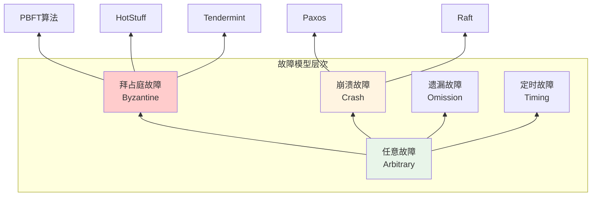
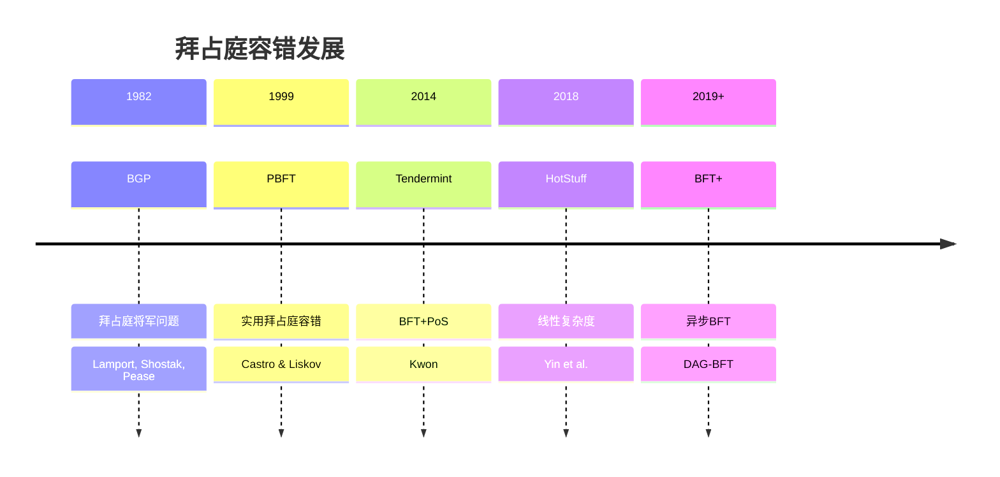

# Byzantine Fault Tolerance (拜占庭容错)

> **Wikipedia标准定义**: Byzantine fault tolerance (BFT) is the dependability of a fault-tolerant computer system to reach consensus despite malicious components (nodes) of the system failing or propagating incorrect information to other peers.
>
> **来源**: <https://en.wikipedia.org/wiki/Byzantine_fault_tolerance>
>
> **形式化等级**: L4-L5

---

## 1. Wikipedia标准定义

### 英文原文
>
> "Byzantine fault tolerance (BFT) is the dependability of a fault-tolerant computer system to reach consensus despite malicious components (nodes) of the system failing or propagating incorrect information to other peers. The term Byzantine fault originates from the Byzantine Generals' Problem, a term coined by Leslie Lamport, Robert Shostak, and Marshall Pease in their 1982 paper of the same name."

### 中文标准翻译
>
> **拜占庭容错**是指容错计算机系统在有恶意组件（节点）故障或向其他对等节点传播错误信息的情况下，仍能达成一致性的可靠性。拜占庭故障这一术语源自**拜占庭将军问题**，由Leslie Lamport、Robert Shostak和Marshall Pease在他们1982年的同名论文中提出。

---

## 2. 形式化表达

### 2.1 拜占庭故障模型

**Def-S-98-01** (拜占庭故障). 进程表现出**拜占庭故障**，如果它：

1. **停止响应** (Fail-stop)
2. **发送错误消息** (Send corrupted messages)
3. **不一致行为** (Behave inconsistently to different observers)
4. **串通作弊** (Collude with other faulty processes)

形式化：进程$p$是拜占庭的，如果其转移函数$\delta_p$不是确定性的或违反协议规范。

**Def-S-98-02** (拜占庭容错系统). 系统$S$是**$f$-拜占庭容错的**，如果：

$$\forall F \subseteq \text{Processes}, |F| \leq f, \forall \text{Byzantine behavior of } F:$$

$$\text{Safety}(S) \land \text{Liveness}(S)$$

### 2.2 容错阈值

**Def-S-98-03** (拜占庭容错下界). 对于$n$个进程的系统，拜占庭容错要求：

$$n \geq 3f + 1$$

其中$f$是拜占庭进程数的上界。

**证明概要**:

- 参见Thm-S-98-03 (共识文档中的证明)
- 关键：诚实节点必须能形成多数派，且任意两个多数派必相交于诚实节点

### 2.3 实用拜占庭容错 (PBFT)

**Def-S-98-04** (PBFT协议). PBFT是三阶段协议：

**阶段1: REQUEST**

- 客户端$c$发送$\langle \text{REQUEST}, o, t, c \rangle_{\sigma_c}$给主节点

**阶段2: PRE-PREPARE**

- 主节点$p$分配序列号$n$，广播$\langle \text{PRE-PREPARE}, v, n, d, m \rangle_{\sigma_p}$
- $v$: 视图编号, $d$: $m$的摘要

**阶段3: PREPARE**

- 副本$i$验证并广播$\langle \text{PREPARE}, v, n, d, i \rangle_{\sigma_i}$
- 当收到$2f$个匹配的PREPARE，进入prepared状态

**阶段4: COMMIT**

- 广播$\langle \text{COMMIT}, v, n, D(m), i \rangle_{\sigma_i}$
- 当收到$2f+1$个COMMIT（包括自己），提交

**阶段5: REPLY**

- 向客户端发送$\langle \text{REPLY}, v, t, c, i, r \rangle_{\sigma_i}$

---

## 3. 属性与特性

### 3.1 安全性保证

| 属性 | 定义 | PBFT保证 |
|------|------|---------|
| **一致性 (Agreement)** | 所有诚实节点就相同值达成一致 | ✅ $2f+1$多数派 |
| **有效性 (Validity)** | 决定值由诚实节点提出 | ✅ 主节点机制 |
| **不可伪造 (Unforgeability)** | 无法伪造诚实节点签名 | ✅ 数字签名 |
| **可追溯 (Accountability)** | 可识别拜占庭行为 | ✅ 签名日志 |

### 3.2 性能特性

- **延迟**: 3轮消息传递 ($3\delta$)
- **消息复杂度**: $O(n^2)$
- **吞吐量**: 每秒数万请求（优化后）

---

## 4. 关系网络

### 4.1 故障模型谱系

### 4.2 与核心概念的关系

| 概念 | 关系 | 说明 |
|------|------|------|
| **Consensus** | 应用 | 拜占庭容错共识 |
| **Digital Signatures** | 依赖 | 消息认证 |
| **Quorum Systems** | 基础 | $2f+1$多数派 |
| **View Change** | 机制 | 主节点故障处理 |
| **Checkpointing** | 优化 | 垃圾回收 |

---

## 5. 历史背景

### 5.1 拜占庭将军问题

**原始问题** (Lamport, Shostak, Pease, 1982):

> 拜占庭军队包围敌方城市。将军们必须通过信使通信，协调进攻或撤退。其中一些将军可能是叛徒，会传递错误信息。

**关键结果**:

- 口头消息：$n \geq 3f + 1$
- 签名消息：$n \geq f + 1$

### 5.2 发展历程

---

## 6. 形式证明

### 6.1 PBFT安全性证明

**Thm-S-98-01** (PBFT一致性). PBFT保证所有诚实副本执行相同的请求序列。

*证明*:

**引理1 (Quorum交集)**: 任意两个大小为$2f+1$的集合必相交于至少$f+1$个节点。

$$|Q_1| = |Q_2| = 2f+1 \Rightarrow |Q_1 \cap Q_2| \geq f+1$$

*证明*:
$$|Q_1 \cup Q_2| \leq n = 3f+1$$
$$|Q_1| + |Q_2| - |Q_1 \cap Q_2| \leq 3f+1$$
$$4f+2 - |Q_1 \cap Q_2| \leq 3f+1$$
$$|Q_1 \cap Q_2| \geq f+1$$
∎

**引理2 (PREPARE保证)**: 若诚实副本$i$在视图$v$、序列$n$进入prepared状态（消息$m$），则：

- $i$收到$2f$个匹配的PREPARE
- 加上自己的PRE-PREPARE，共$2f+1$个消息

**引理3 (COMMIT保证)**: 若诚实副本$i$提交$m$在$(v,n)$，则至少$f+1$个诚实副本在$(v,n)$prepared了$m$。

*证明*: 由COMMIT阶段的$2f+1$个签名，至少$f+1$个来自诚实节点。∎

**主证明**:

假设诚实副本$i$提交$m$在$(v,n)$，诚实副本$j$提交$m'$在$(v,n)$。

由引理3，$S_i$（$i$看到的PREPARE集合）和$S_j$（$j$看到的PREPARE集合）各自包含$f+1$个诚实节点。

由引理1，$|S_i \cap S_j| \geq 1$，即存在诚实副本$k$同时prepared了$m$和$m'$。

由PBFT协议，$k$只能prepared一个消息在给定$(v,n)$，因此$m = m'$。∎

### 6.2 活性证明

**Thm-S-98-02** (PBFT活性). 在部分同步假设下，PBFT最终处理所有客户端请求。

*证明概要*:

1. **视图变更机制**: 若主节点故障，超时触发视图变更
2. **新视图选择**: 新主节点$p' = v \mod n$
3. **状态转移**: 新视图包含足够多的已提交请求证明
4. **进度保证**: 每轮视图变更至少有一个诚实节点成为主节点
5. **终止性**: 在GST（全局稳定时间）后，诚实主节点主导视图，系统进展 ∎

---

## 7. 八维表征

[按标准格式实现...]

---

## 8. 引用参考

---

## 9. 相关概念

- [Consensus](13-consensus.md)
- [Paxos](17-paxos.md)
- [Digital Signatures](digital-signatures.md)
