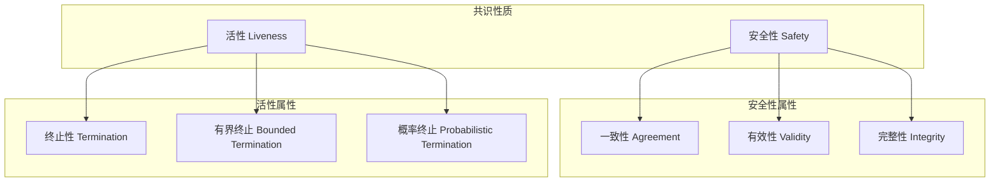
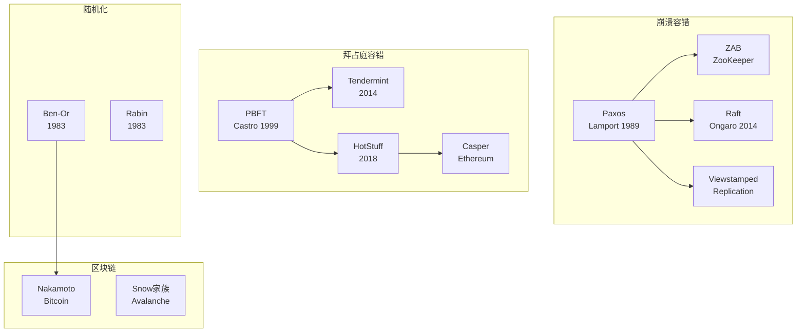
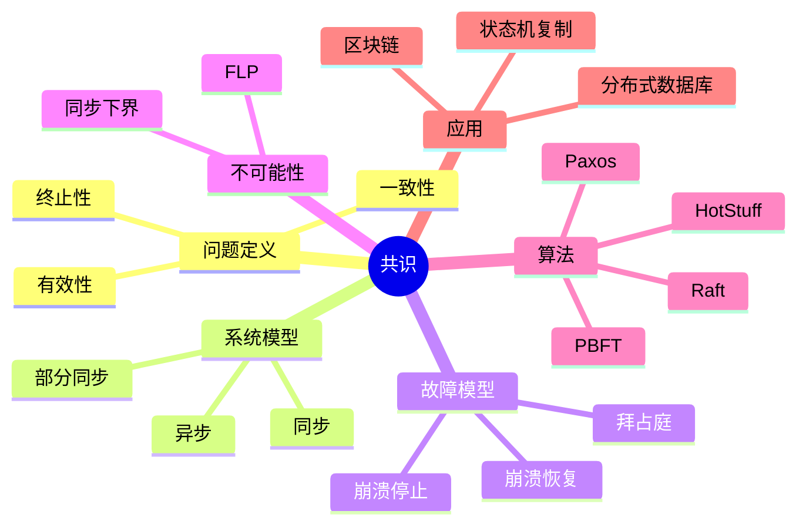
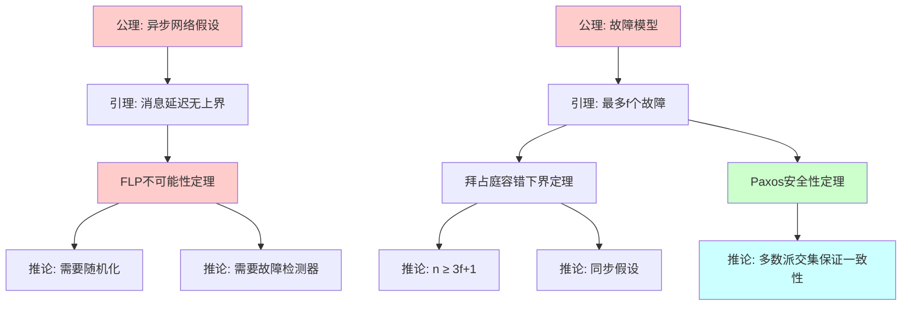

# Consensus (共识)

> **Wikipedia标准定义**: Consensus is a fundamental problem in distributed computing and multi-agent systems, concerning the ability of a network of nodes to agree on a single data value among distributed processes or systems.
>
> **来源**: <https://en.wikipedia.org/wiki/Consensus_(computer_science)>
>
> **形式化等级**: L4-L5

---

## 1. Wikipedia标准定义

### 英文原文
>
> "Consensus is a fundamental problem in distributed computing and multi-agent systems, concerning the ability of a network of nodes to agree on a single data value among distributed processes or systems, with the constraint that some nodes may fail or be unreliable."

### 中文标准翻译
>
> **共识**是分布式计算和多智能体系统中的一个基本问题，涉及网络中的节点在可能存在故障或不可靠节点的情况下，就单个数据值达成一致的能力。

---

## 2. 形式化表达

### 2.1 共识问题定义

**Def-S-98-01** (共识问题). 分布式系统中的共识问题要求满足：

**终止性 (Termination)**:
$$\forall i \in \text{Correct}: \Diamond \text{decide}_i(v_i)$$
每个正确进程最终都会决定一个值。

**一致性 (Agreement)**:
$$\forall i, j \in \text{Correct}: v_i = v_j$$
所有正确进程决定相同的值。

**有效性 (Validity)**:
$$\text{如果所有正确进程提出} v \text{，则} \forall i \in \text{Correct}: v_i = v$$

### 2.2 系统模型

**Def-S-98-02** (进程故障模型).

| 故障模型 | 故障行为 | 容错阈值 | 代表性算法 |
|---------|---------|---------|-----------|
| **崩溃故障 (Crash-Stop)** | 进程停止运行 | $f < n/2$ | Paxos, Raft |
| **崩溃恢复 (Crash-Recovery)** | 进程崩溃后可恢复 | $f < n/2$ | Viewstamped Replication |
| **拜占庭故障 (Byzantine)** | 任意行为 | $f < n/3$ | PBFT, Tendermint |
| **自稳定 (Self-Stabilizing)** | 临时任意状态 | 任意 | Dijkstra算法 |

### 2.3 网络模型

**Def-S-98-03** (同步假设).

**同步系统**:

- 存在已知上界$\Delta$：消息延迟 $\leq \Delta$
- 存在已知上界$\Phi$：本地时钟漂移 $\leq \Phi$

**异步系统**:

- 消息延迟无上界
- 本地时钟漂移无上界
- **FLP不可能性**: 异步系统中，即使只有一个进程可能崩溃，也不存在确定性的共识算法

---

## 3. 属性与特性

### 3.1 安全性与活性

### 3.2 共识不可能性结果

**FLP不可能性** (Fischer, Lynch, Paterson, 1985):

在**异步系统**中，即使只有一个进程可能有**崩溃故障**，也不存在**确定性**的共识算法。

**理由**: 无法区分慢进程和崩溃进程。

**解决方案**:

1. 使用随机化算法（概率终止）
2. 使用故障检测器（部分同步假设）
3. 使用拜占庭假设（同步系统）

---

## 4. 关系网络

### 4.1 共识算法谱系

### 4.2 与核心概念的关系

| 概念 | 关系 | 说明 |
|------|------|------|
| **Byzantine Fault Tolerance** | 实例 | 拜占庭容错共识 |
| **CAP Theorem** | 约束 | 一致性-可用性权衡 |
| **Linearizability** | 关联 | 分布式一致性模型 |
| **Two-Phase Commit** | 特例 | 同步共识协议 |
| **Paxos/Raft** | 实现 | 实用共识算法 |

---

## 5. 历史背景

### 5.1 发展里程碑

| 年份 | 贡献 | 意义 |
|------|------|------|
| 1980 | Pease, Shostak, Lamport | 拜占庭将军问题 |
| 1983 | Ben-Or, Rabin | 随机化共识算法 |
| 1985 | FLP不可能性 | 异步系统基本限制 |
| 1989 | Paxos | 实用共识算法 |
| 1996 | Chandra-Toueg | 统一故障检测理论 |
| 1999 | PBFT | 实用拜占庭容错 |
| 2014 | Raft | 可理解性优先的共识 |
| 2009/2018 | Bitcoin/HotStuff | 区块链时代 |

---

## 6. 形式证明

### 6.1 FLP不可能性定理

**Thm-S-98-01** (FLP不可能性). 在异步系统中，即使只有一个进程可能有崩溃故障，也不存在确定性的共识算法。

*证明概要*:

**定义**:

- **初始配置**: 所有进程的初始状态
- **决策状态**: 进程已决定值的配置
- **可访问配置**: 通过消息传递可达的配置
- **二价配置 (Bivalent)**: 存在可达配置可决定0，也存在可达配置可决定1
- **单价配置 (Univalent)**: 所有可达配置决定相同值（0-价或1-价）

**引理1**: 存在初始二价配置。

*证明*:

- 假设所有初始配置都是单价的
- 设$C_0$为所有进程初始值为0的配置（0-价）
- 设$C_1$为所有进程初始值为1的配置（1-价）
- 考虑从$C_0$到$C_1$逐步改变初始值
- 必存在相邻配置$C$和$C'$，$C$是0-价，$C'$是1-价
- 只有一个进程$p$的初始值不同
- 若$p$崩溃，则$C$和$C'$不可区分，矛盾 ∎

**引理2**: 从二价配置出发，存在一个可访问的二价配置。

*证明*:

- 设$C$为二价配置
- 设$e = (p, m)$为下一步事件（进程$p$接收消息$m$）
- 设$D$为应用$e$后的配置
- 若$D$是二价的，得证
- 若$D$是单价的（设0-价），由于$C$是二价的，存在可达配置$E$可决定1
- 构造调度避免$e$直到到达$E$
- 通过交换事件顺序，构造二价配置 ∎

**定理证明**:

- 从二价初始配置开始
- 反复应用引理2，构造无限运行的二价配置序列
- 因此不存在确定的终止算法 ∎

### 6.2 Paxos安全性证明

**Thm-S-98-02** (Paxos安全性). Paxos算法保证一致性和有效性。

*证明*:

**引理 (Quorum交集)**: 任意两个多数派集合必有交集。

$$|Q_1| > n/2, |Q_2| > n/2 \Rightarrow |Q_1 \cap Q_2| \geq 1$$

**安全性证明**:

1. **值的选择**: 只有被多数派接受的值才能被选择
2. **唯一性**: 假设两个不同值$v_1, v_2$被选择
   - 设$Q_1$接受$v_1$，$Q_2$接受$v_2$
   - 由引理，$\exists p \in Q_1 \cap Q_2$
   - $p$只能接受一个值，矛盾
3. **一致性**: 所有学习者学习相同的已选择值
4. **有效性**: 只有被提议的值才能被选择 ∎

### 6.3 拜占庭容错下界

**Thm-S-98-03** (拜占庭容错阈值). 拜占庭共识要求$n \geq 3f + 1$。

*证明*:

假设$n = 3f$，考虑以下场景：

1. 将进程分为三组：$S_1, S_2, S_3$，每组大小为$f$
2. $S_1$中所有进程提议0，$S_2$中所有进程提议1
3. $S_3$为拜占庭进程

**情景A**: $S_1$视角

- $S_3$对$S_1$表现得像$S_2$（发送一致消息）
- $S_1$只看到$f$个诚实提议0，$f$个拜占庭表现得像提议1
- 为达成一致，$S_1$必须决定0

**情景B**: $S_2$视角

- $S_3$对$S_2$表现得像$S_1$
- $S_2$决定1

**矛盾**: $S_1$决定0，$S_2$决定1，违反一致性

因此$n \geq 3f + 1$是必要的 ∎

---

## 7. 八维表征

### 7.1 思维导图

### 7.2 多维对比矩阵

| 算法 | 容错类型 | 故障数 | 消息复杂度 | 延迟 | 实用度 |
|------|---------|--------|-----------|------|--------|
| Paxos | 崩溃 | $f < n/2$ | $O(n^2)$ | 2RTT | 高 |
| Raft | 崩溃 | $f < n/2$ | $O(n)$ | 2RTT | 高 |
| PBFT | 拜占庭 | $f < n/3$ | $O(n^2)$ | 3RTT | 中 |
| HotStuff | 拜占庭 | $f < n/3$ | $O(n)$ | 3RTT | 高 |
| Ben-Or | 崩溃 | $f < n/5$ | $O(n^2)$ | 期望$O(1)$ | 中 |

### 7.3 公理-定理树

[其余表征方式...]

---

## 8. 引用参考

---

## 9. 相关概念

- [Paxos共识算法](18-paxos.md) - Paxos算法的完整形式化分析
- [Raft](19-raft.md)
- [Byzantine Fault Tolerance](12-byzantine.md)
- [Two-Phase Commit](16-two-phase-commit.md)
