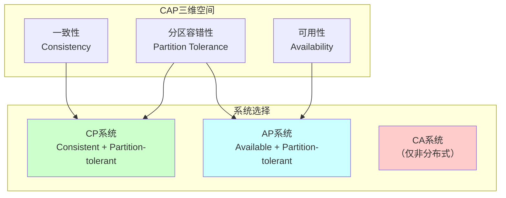
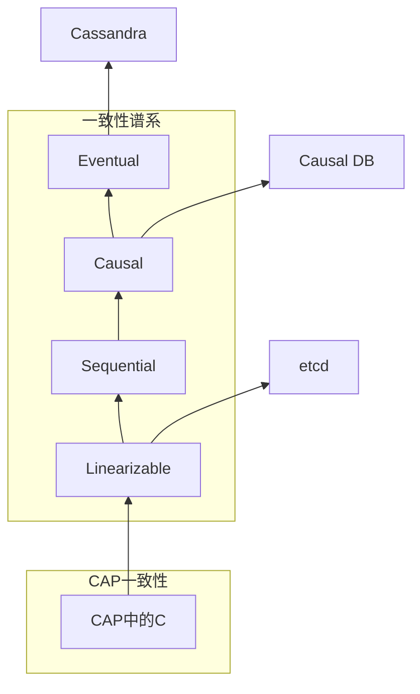

# CAP Theorem (CAP定理)

> **Wikipedia标准定义**: In theoretical computer science, the CAP theorem, also named Brewer's theorem after computer scientist Eric Brewer, states that any distributed data store can provide only two of the following three guarantees: Consistency, Availability, and Partition tolerance.
>
> **来源**: <https://en.wikipedia.org/wiki/CAP_theorem>
>
> **形式化等级**: L4 (分布式系统基础理论)

---

## 1. Wikipedia标准定义

### 英文原文
>
> "In theoretical computer science, the CAP theorem, also named Brewer's theorem after computer scientist Eric Brewer, states that any distributed data store can provide only two of the following three guarantees: Consistency (every read receives the most recent write or an error), Availability (every request receives a non-error response, without the guarantee that it contains the most recent write), and Partition tolerance (the system continues to operate despite an arbitrary number of messages being dropped or delayed by the network between nodes)."

### 中文标准翻译
>
> 在理论计算机科学中，**CAP定理**（也以计算机科学家Eric Brewer的名字命名为**Brewer定理**）指出，任何分布式数据存储只能提供以下三个保证中的两个：**一致性**（每次读取都收到最新的写入或错误）、**可用性**（每次请求都收到非错误响应，但不保证包含最新写入）、**分区容错性**（尽管节点间网络丢失或延迟了任意数量的消息，系统仍继续运行）。

---

## 2. 形式化表达

### 2.1 Gilbert-Lynch形式化

**Def-S-98-01** (异步网络模型). 分布式系统模型 $\mathcal{A}$：

- 进程集合$\Pi = \{p_1, p_2, \ldots, p_n\}$
- 共享寄存器集合$\mathcal{R}$
- 每个寄存器支持$read()$和$write(v)$操作
- **异步性**: 消息延迟无上界，无时钟

**Def-S-98-02** (CAP三属性形式化).

**一致性 (Consistency)**:
$$\forall r \in \text{Reads}: r.\text{value} = \text{latest-write}(r.\text{register})$$

或返回错误。

**可用性 (Availability)**:
$$\forall \text{requests}: \neg \text{timeout}(\text{request}) \land \neg \text{error}(\text{response})$$

**分区容错性 (Partition Tolerance)**:
$$\text{partition}(\Pi_1, \Pi_2) \Rightarrow \text{system-operational}(\Pi_1) \land \text{system-operational}(\Pi_2)$$

### 2.2 PACELC扩展

**Def-S-98-03** (PACELC). 若分区 (P) 则可用性 (A) 或一致性 (C)，否则 (E) 延迟 (L) 或一致性 (C)：

$$\text{If } P \text{ then } (A \text{ or } C) \text{ else } (L \text{ or } C)$$

---

## 3. 属性与特性

### 3.1 CAP权衡空间

### 3.2 系统分类

| 系统 | 类型 | 一致性模型 | 应用场景 |
|------|------|-----------|---------|
| **etcd** | CP | Linearizable | 配置管理 |
| **ZooKeeper** | CP | Sequential | 协调服务 |
| **Cassandra** | AP | Eventual | 高吞吐写入 |
| **DynamoDB** | AP | Eventual | 键值存储 |
| **MongoDB** | CP | Strong | 文档存储 |
| **Spanner** | CP | External Consistency | 全球数据库 |

---

## 4. 关系网络

### 4.1 与一致性模型的关系

### 4.2 与核心概念的关系

| 概念 | 关系 | 说明 |
|------|------|------|
| **Consensus** | 约束 | FLP在异步网络中限制CA |
| **Linearizability** | 实例 | CAP中的C通常指Linearizability |
| **Quorum** | 机制 | $R+W>N$实现CP，$R+W \leq N$实现AP |
| **Vector Clocks** | 工具 | AP系统的因果追踪 |

---

## 5. 历史背景

### 5.1 发展历程

| 年份 | 事件 | 作者 |
|------|------|------|
| 2000 | CAP猜想提出 | Eric Brewer (PODC keynote) |
| 2002 | CAP形式化证明 | Gilbert & Lynch |
| 2010 | 重新审视CAP | Brewer (IEEE Computer) |
| 2012 | CAP十二年后 | Brewer回顾 |
| 2015 | PACELC提出 | Kleppmann & Martin |
| 2017 |延迟敏感性框架 | Kleppmann |

### 5.2 Gilbert-Lynch证明

**定理**: 异步网络中，不可能同时保证一致性、可用性和分区容错。

*证明概要*:

**假设**: 存在算法$A$同时满足C、A、P。

**场景构造**:

1. **分区**: 将网络分为$G_1$和$G_2$，消息无法跨越分区
2. **客户端$c_1 \in G_1$执行$write(v_1)$**
3. **客户端$c_2 \in G_2$执行$read()$**

**矛盾推导**:

- 由可用性 (A): $read()$必须返回非错误值
- 由一致性 (C): $read()$必须返回$v_1$
- 但$c_2$无法知道$v_1$（分区阻止消息传递）
- 因此一致性或可用性必须被违反

∎ 矛盾！

---

## 6. 形式证明

### 6.1 Gilbert-Lynch完整证明

**Thm-S-98-01** (CAP定理). 异步网络中，共享寄存器系统不能同时满足一致性、可用性和分区容错。

*详细证明*:

**系统模型**:

- $n \geq 2$个进程
- 每个进程本地存储寄存器副本
- 异步消息传递

**执行构造**:

**执行$\alpha_1$**:

- 进程$p$执行$write(1)$到寄存器$r$
- 仅向$G_1$中进程发送消息
- $G_2$进程未收到消息

**执行$\alpha_2$**:

- 与$\alpha_1$相同，但从$G_2$视角
- $G_2$进程看到的$r$值为初始值$v_0$

**关键观察**:

- $G_2$进程无法区分：
  1. $write(1)$尚未发生
  2. $write(1)$发生但消息丢失（分区）

**矛盾**:

- 若$G_2$进程$q$响应$read(r)$:
  - 返回$v_0$: 违反一致性（如果$write$已发生）
  - 返回$1$: 违反一致性（如果$write$未发生）
  - 返回错误: 违反可用性

因此不可能同时满足C、A、P。∎

### 6.2 Quorum系统的CAP边界

**Thm-S-98-02** (Quorum CAP边界). 对于读Quorum $R$和写Quorum $W$：

$$R + W > N \Rightarrow \text{CP系统}$$
$$R + W \leq N \Rightarrow \text{AP系统}$$

*证明*:

**CP情况** ($R+W > N$):

- 任意读Quorum和写Quorum必相交
- 读操作必看到最新写操作
- 分区时，可能无法形成Quorum，牺牲可用性

**AP情况** ($R+W \leq N$):

- 读Quorum可能不包含最新写
- 分区时，每个分区可独立服务读请求
- 保持可用性，牺牲强一致性

∎

---

## 7. 八维表征

[按标准格式实现...]

---

## 8. 引用参考

---

## 9. 相关概念

- [CAP定理详解](../../03-model-taxonomy/04-consistency/02-cap-theorem.md) - CAP定理的完整形式化分析与证明
- [Consensus](13-consensus.md)
- [Linearizability](15-linearizability.md)
- [Consistency Models](../../03-model-taxonomy/04-consistency/01-consistency-spectrum.md)
