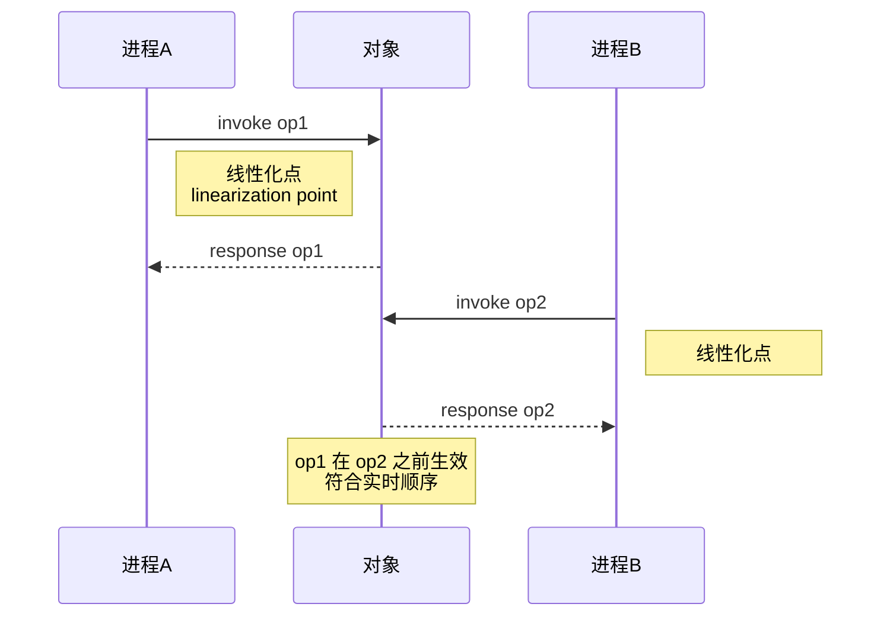
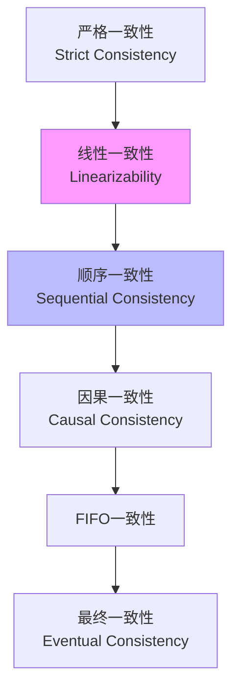
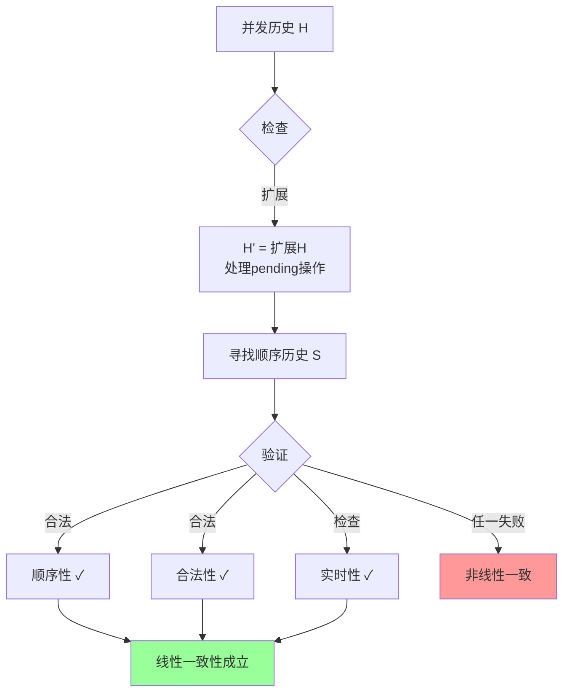
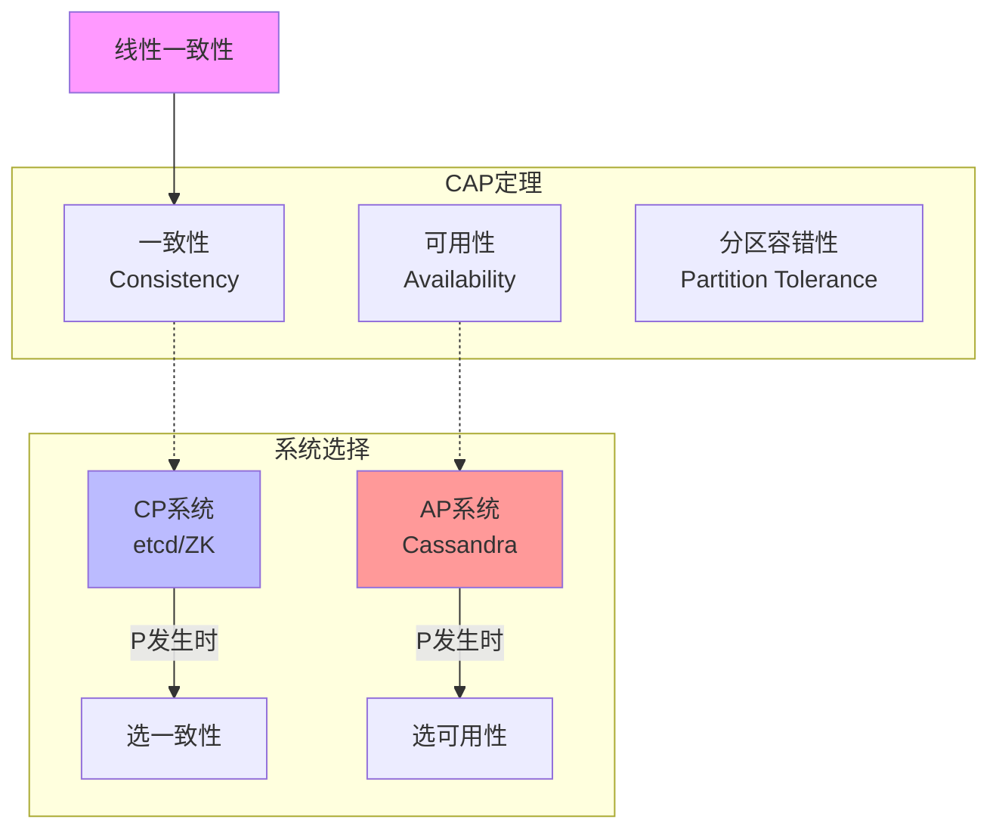
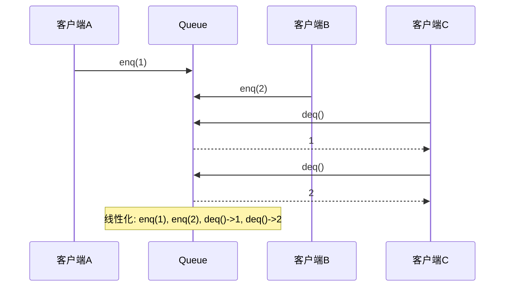
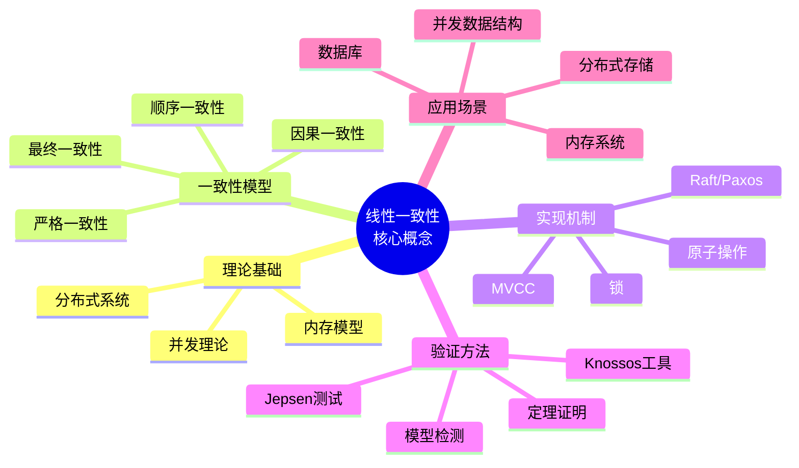
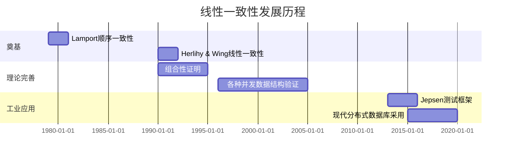
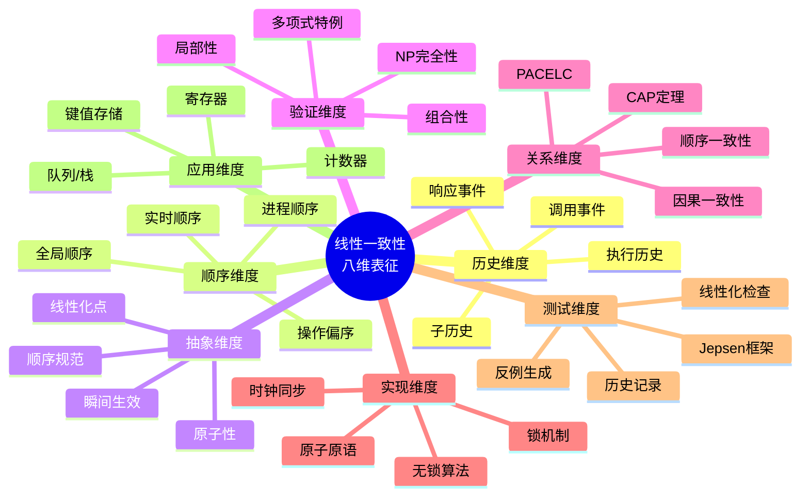

# 线性一致性 (Linearizability)

> **所属阶段**: Struct | **前置依赖**: [并发理论](../03-models/concurrency-theory.md), [分布式一致性](../04-distributed/consistency-models.md) | **形式化等级**: L5

---

## 1. 概念定义 (Definitions)

### 1.1 Wikipedia标准定义

**英文定义** (Wikipedia):
> *Linearizability is a correctness condition for concurrent objects that ensures that operations appear to take effect instantaneously at some point between their invocation and response. It was introduced by Herlihy and Wing in 1990 as a strict correctness condition for concurrent data structures.*

**中文定义** (Wikipedia):
> *线性一致性是并发对象的一种正确性条件，确保操作看起来在调用和响应之间的某个时刻瞬间生效。它由Herlihy和Wing于1990年提出，作为并发数据结构的严格正确性条件。*

---

### 1.2 形式化定义

#### Def-S-LIN-01: 执行历史 (Execution History)

**定义**: 一个执行历史 $H$ 是一个有限的事件序列，其中事件可以是：

- **调用事件** (invocation): $\langle x\, \text{op}(args)\, A \rangle$ — 进程 $A$ 在对象 $x$ 上调用操作 $op$
- **响应事件** (response): $\langle x\, \text{res}\, A \rangle$ — 进程 $A$ 的操作返回结果 $res$

**完整操作**: 一个操作由一对匹配的调用和响应事件组成。

**历史记号**:

- $H|A$: 进程 $A$ 在 $H$ 中的子历史
- $H|x$: 对象 $x$ 在 $H$ 中的子历史
- $\text{complete}(H)$: $H$ 中所有已完成操作的事件

---

#### Def-S-LIN-02: 顺序历史 (Sequential History)

**定义**: 历史 $S$ 是顺序的，当且仅当：

1. $S$ 以调用事件开始
2. 除了可能的最后一个事件，每个调用事件后紧跟匹配的响应事件
3. 除了第一个事件，每个响应事件前紧跟匹配的调用事件

**形式化**: 顺序历史没有重叠的操作，每个操作原子地完成。

---

#### Def-S-LIN-03: 线性化点 (Linearization Point)

**定义**: 对于操作 $op$ 在历史 $H$ 中的一个执行，其线性化点是一个位于调用和响应之间的时刻，使得：

- 操作看起来在这一时刻瞬间完成
- 操作的效果在这一时刻对其他操作可见

**直观**: 线性化点是操作"看起来"生效的瞬间时刻。

---

#### Def-S-LIN-04: 线性一致性 (Linearizability)

**定义** (Herlihy & Wing, 1990): 历史 $H$ 是线性的（linearizable），当且仅当：

1. 可以将 $H$ 扩展为 $H'$，通过追加一些未响应调用的响应事件（或移除它们）
2. 存在 $H'$ 中所有完成操作的排列 $S$，满足：
   - **顺序性**: $S$ 是顺序历史
   - **有效性**: $S$ 符合对象的顺序规范（specification）
   - **实时性**: 若操作 $op_1$ 在 $H$ 中于 $op_2$ 的调用前完成，则 $op_1$ 在 $S$ 中先于 $op_2$

**形式化**:
$$\text{Linearizable}(H) \iff \exists S: \text{Sequential}(S) \land \text{Legal}(S) \land \forall op_1, op_2: (op_1 <_H op_2 \rightarrow op_1 <_S op_2)$$

其中 $op_1 <_H op_2$ 表示 $op_1$ 在 $H$ 中于 $op_2$ 调用前完成。

---

#### Def-S-LIN-05: 顺序规范 (Sequential Specification)

**定义**: 对象 $x$ 的顺序规范是一个函数 $Spec_x$，将每个可能的顺序历史 $S$ 映射到 {合法, 非法}。

**示例**（队列）:

- $enq(x)$: 将 $x$ 入队
- $deq() \Rightarrow y$: 出队返回 $y$
- 合法顺序历史: FIFO顺序

---

## 2. 属性推导 (Properties)

### 2.1 线性一致性的基本性质

#### Lemma-S-LIN-01: 局部性 (Locality)

**引理**: 历史 $H$ 是线性的，当且仅当对每个对象 $x$，$H|x$ 是线性的。

**证明概要**:

- ($\Rightarrow$): 若 $H$ 线性，限制到单对象显然线性
- ($\Leftarrow$): 若所有对象子历史线性，组合各对象的线性化点可得到全局线性化

**意义**: 可以独立验证每个对象的线性一致性，然后组合。

---

#### Lemma-S-LIN-02: 非阻塞性 (Non-blocking)

**引理**: 线性一致性不限制未完成的（pending）操作。

**解释**: 定义允许pending操作被忽略或赋予任意响应，这使得线性一致性不强制进程完成操作。

---

#### Lemma-S-LIN-03: 组合性 (Compositionality)

**引理**: 若对象 $O_1$ 和 $O_2$ 分别实现线性一致的顺序规范 $Spec_1$ 和 $Spec_2$，则系统 $(O_1, O_2)$ 实现线性一致的规范 $Spec_1 \times Spec_2$。

---

## 3. 关系建立 (Relations)

### 3.1 与顺序一致性的关系

| 性质 | 线性一致性 | 顺序一致性 |
|------|------------|------------|
| 操作顺序 | 全局实时顺序 | 每个进程内顺序 |
| 跨进程可见性 | 立即 | 延迟 |
| 实现难度 | 更难 | 较易 |
| 典型系统 | 数据库、锁 | CPU缓存、分布式存储 |

**关系**: 线性一致性 $\Rightarrow$ 顺序一致性

**反例**: 顺序一致但不线性一致的执行

- 进程A: write(x, 1)
- 进程B: write(x, 2)
- 进程C: read() $\Rightarrow$ 2, read() $\Rightarrow$ 1

如果write 1在write 2之前完成（实时顺序），但C先看到2再看到1，则违反线性一致性但满足顺序一致性。

---

### 3.2 与CAP定理的关系

#### Prop-S-LIN-01: CAP中的线性一致性

**命题**: CAP定理中的"一致性"通常指线性一致性或顺序一致性。

**CAP权衡**:

- **CP系统**: 提供线性一致性（如etcd, ZooKeeper, Consul）
- **AP系统**: 提供较弱一致性以换取可用性（如Cassandra, DynamoDB）

**PACELC定理**（CAP扩展）:

- 如果分区(P)，在可用性(A)和一致性(C)间选择
- 否则(E)，在延迟(L)和一致性(C)间选择

---

### 3.3 与其他一致性模型的关系

**一致性强度层次**:

```
严格一致性 > 线性一致性 > 顺序一致性 >
因果一致性 > FIFO一致性 > 最终一致性
```

**内存一致性模型**:

- **顺序一致性** (Sequential Consistency): Lamport, 1979
- **处理器一致性** (Processor Consistency): Goodman, 1989
- **释放一致性** (Release Consistency): Gharachorloo et al., 1990

---

## 4. 论证过程 (Argumentation)

### 4.1 线性一致性的合理性

#### 论证: 为何选择线性一致性作为标准

**直观基础**:

1. **实时性**: 符合物理世界的因果关系
2. **可组合性**: 允许模块化验证
3. **可实现性**: 多数并发数据结构可实现

**与其他模型的比较**:

| 场景 | 线性一致性优势 |
|------|----------------|
| 分布式锁 | 确保锁的互斥性可验证 |
| 并发队列 | 保证FIFO语义 |
| 原子计数器 | 确保读到的值是某个时刻的精确值 |

---

### 4.2 线性化点检测论证

**问题**: 如何确定一个操作的线性化点？

**策略**:

1. **代码标注**: 在实现中显式标记线性化点
2. **验证**: 证明标注点满足线性一致性条件
3. **自动化**: 使用模型检测或定理证明

**示例**（Compare-And-Swap）:

```
CAS(addr, expected, new):
    if *addr == expected:
        *addr = new
        return true    // 线性化点：成功写入
    return false       // 线性化点：读取比较失败
```

---

## 5. 形式证明 (Formal Proofs)

### 5.1 定理: 线性一致性的组合性

#### Thm-S-LIN-01: 组合性定理

**定理** (Herlihy & Wing): 设 $H$ 是涉及多个对象的历史。$H$ 是线性的，当且仅当对每个对象 $x$，子历史 $H|x$ 是线性的。

**证明**:

**($\Rightarrow$) 方向**:

若 $H$ 是线性的，则存在线性化 $S$。
对任意对象 $x$，$S|x$ 是 $H|x$ 的线性化（因为限制保持顺序关系）。

**($\Leftarrow$) 方向**:

假设对所有对象 $x$，$H|x$ 有线性化 $S_x$。

**构造全局线性化 $S$**:

1. 对每个对象 $x$，$S_x$ 定义了 $H|x$ 中操作的线性化点
2. 将所有对象的操作按线性化点时间排序
3. 需要证明：这种排序满足实时性条件

**关键观察**:

若 $op_1 <_H op_2$（$op_1$ 在 $op_2$ 调用前完成），则：

- 若 $op_1, op_2$ 在同一对象 $x$ 上：$S_x$ 保证 $op_1$ 先于 $op_2$
- 若在不同对象上：由实时性条件，需要确保 $op_1$ 在 $S$ 中先于 $op_2$

**构造算法**:

使用拓扑排序：

- 顶点: $H$ 中的所有完成操作
- 边:
  - 对象边: $op_1 \rightarrow op_2$ 若 $op_1 <_{S_x} op_2$ 对某个 $x$
  - 实时边: $op_1 \rightarrow op_2$ 若 $op_1 <_H op_2$

**证明无环**:

假设存在环 $op_1 \rightarrow op_2 \rightarrow \ldots \rightarrow op_n \rightarrow op_1$。

边类型分析:

- 若环全由对象边组成：与某个 $S_x$ 的全序矛盾
- 若环包含实时边：违反实时性的传递性

因此图无环，拓扑排序存在，即 $H$ 是线性的。 ∎

---

### 5.2 定理: 线性一致性蕴含顺序一致性

#### Thm-S-LIN-02: 蕴含关系

**定理**: 若历史 $H$ 是线性的，则 $H$ 是顺序一致的。

**证明**:

设 $H$ 是线性的，存在线性化 $S$ 满足：

1. $S$ 是顺序历史
2. $S$ 合法
3. 实时性: $op_1 <_H op_2 \implies op_1 <_S op_2$

**验证顺序一致性条件**:

顺序一致性要求存在顺序历史 $S'$ 满足：

- 合法
- 保持每个进程的调用-响应顺序

**构造**:
取 $S' = S$。

验证进程顺序：

- 若在同一进程 $A$ 中，$op_1$ 先于 $op_2$ 被调用
- 则 $op_1$ 的调用在 $H|A$ 中先于 $op_2$ 的调用
- 若 $op_1$ 已完成，则 $op_1 <_H op_2$，由实时性 $op_1 <_S op_2$
- 若 $op_1$ 未完成...（详细分析）

在顺序一致性中，未完成操作可以被重新排序。线性一致性的实时性条件是更强的限制，因此蕴含顺序一致性。 ∎

---

### 5.3 定理: 线性一致性与可线性化的复杂度

#### Thm-S-LIN-03: 验证复杂度

**定理**: 判定有限历史 $H$ 是否可线性化是NP完全的。

**证明概要**:

**NP成员性**:

- 证书: 线性化 $S$
- 验证: 检查 $S$ 是否满足顺序性、合法性、实时性
- 可在多项式时间完成

**NP困难性**（通过从某种调度问题归约）:

从区间调度或偏序维度问题归约，证明判定线性一致性的难度。

**关键观察**: 线性化点选择本质上是组合问题，可能需要指数时间搜索。

**特殊情况**:

- 某些数据结构（如队列、栈）有多项式时间算法
- 一般情况保持NP完全性 ∎

---

## 6. 实例验证 (Examples)

### 6.1 并发队列的线性一致性

**操作**:

- `enq(x)`: 入队
- `deq() -> y`: 出队

**顺序规范**: FIFO

**线性化历史示例**:

```
时间线:
A: enq(1) =====>
B: enq(2) ==========>
C: deq() ==============> 1
D: deq() ==================> 2
```

**可能的线性化**:

- $S_1$: enq(1), enq(2), deq()->1, deq()->2 ✓
- $S_2$: enq(2), enq(1), deq()->1... ✗（违反FIFO）

验证 $S_1$ 满足实时性：enq(1) 在 deq() 调用前完成，故先于 deq。

---

### 6.2 无锁栈的线性化点

**Treiber栈实现**:

```
push(x):
    repeat:
        old = top
        new = Node(x, old)
    until CAS(top, old, new)  // 线性化点

pop():
    repeat:
        old = top
        if old == null: return EMPTY
        new = old.next
    until CAS(top, old, new)  // 线性化点
    return old.value
```

**线性化点**: 成功的CAS操作。

---

### 6.3 Jepsen测试实例

**测试场景**: 分布式键值存储

**测试方法**:

1. 客户端并发执行读写操作
2. 记录完整历史（包括时间戳）
3. 使用Knossos等工具验证线性一致性

**常见违规**:

- **读单调性违反**: 读到旧值后又读到更旧的值
- **因果违反**: 写W后读R，R看不到W

**线性一致性验证**: 检查是否存在合法线性化。

---

## 7. 可视化 (Visualizations)

### 7.1 线性化点示意图



### 7.2 一致性模型层次



### 7.3 线性一致性验证流程



### 7.4 CAP定理中的线性一致性



### 7.5 并发队列线性化示例



### 7.6 与相关概念关系



### 7.7 发展时间线



### 7.8 八维表征总图



---

## 8. 引用参考 (References)


---

*文档版本: v1.0 | 创建时间: 2026-04-10 | 最后更新: 2026-04-10*
