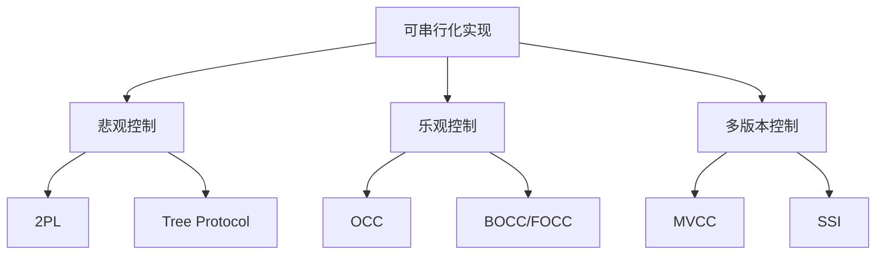
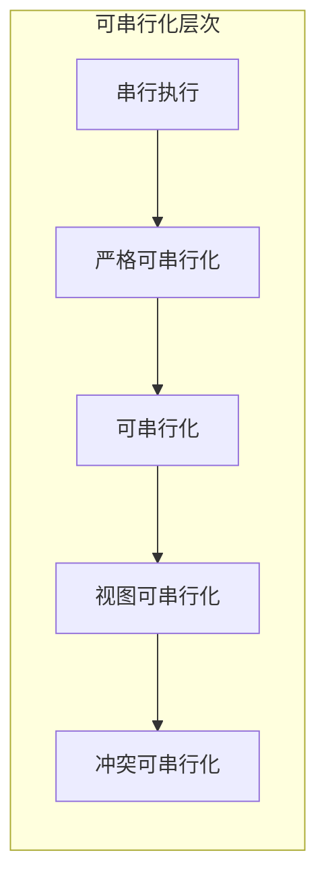
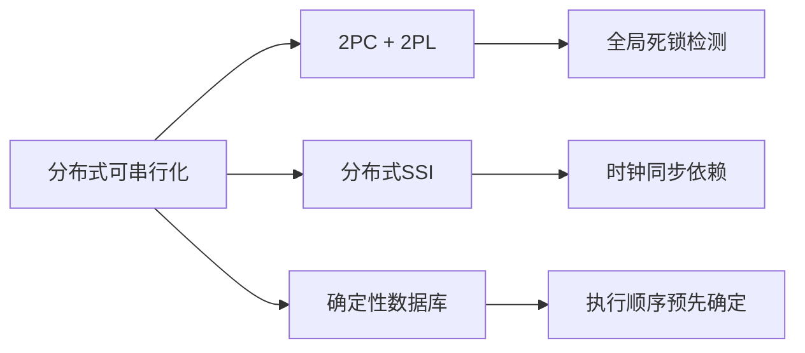
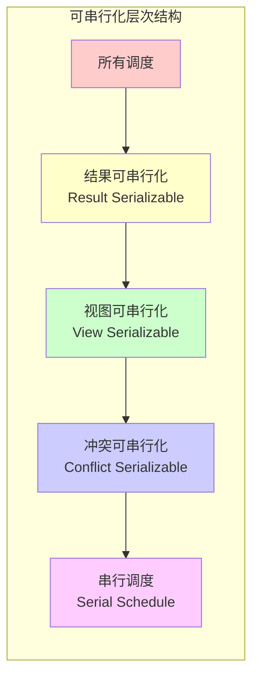
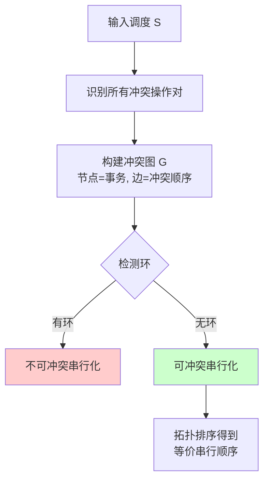
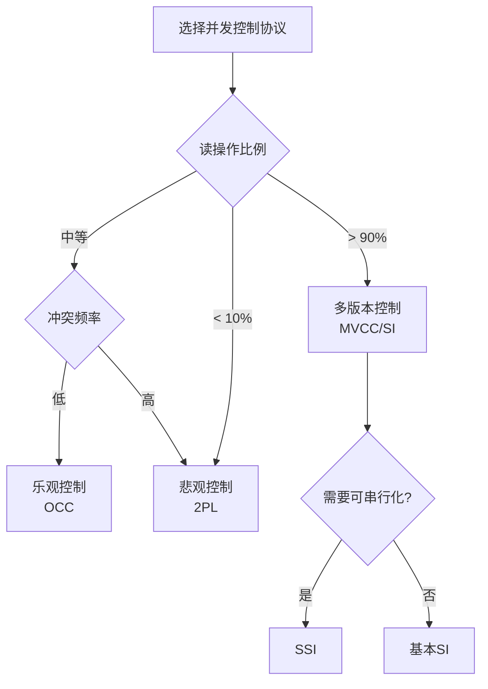
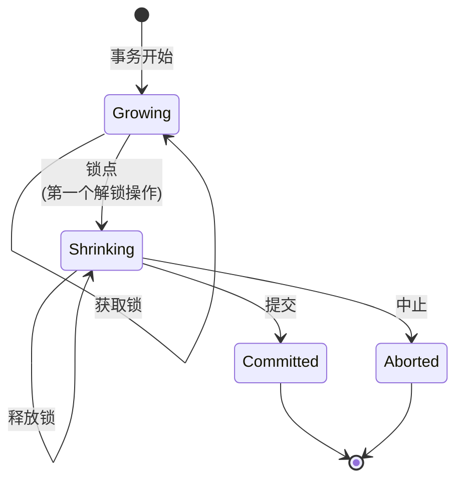

# 可串行化 (Serializability)

> **所属阶段**: Struct | **前置依赖**: [事务理论基础](01-transaction-theory.md), [并发控制原理](02-concurrency-control.md) | **形式化等级**: L5
>
> **标签**: #可串行化 #并发控制 #事务隔离 #冲突可串行化 #视图可串行化 #两阶段锁 #SSI

## 1. 概念定义 (Definitions)

### 1.1 Wikipedia标准定义

> **可串行化**（Serializability）是数据库事务并发控制的最高隔离级别，它确保并发事务的执行结果与这些事务以某种串行顺序执行的结果等价 [^1]。

根据 Wikipedia 的定义，可串行化是并发控制的一种属性，它保证数据库事务调度的正确性。一个调度（schedule）被称为可串行化的，当且仅当它与某个串行调度（serial schedule）的结果等价。

---

### 1.2 形式化基础

#### Def-S-98-01: 事务 (Transaction)

事务 $T_i$ 是一个操作的有限序列：

$$T_i = \langle op_{i1}, op_{i2}, \ldots, op_{in} \rangle$$

其中操作 $op_{ij}$ 可以是以下类型之一：

- **读操作**: $r_i[x]$ — 事务 $T_i$ 读取数据项 $x$
- **写操作**: $w_i[x]$ — 事务 $T_i$ 写入数据项 $x$
- **开始**: $b_i$ — 事务 $T_i$ 开始
- **提交**: $c_i$ — 事务 $T_i$ 提交
- **中止**: $a_i$ — 事务 $T_i$ 中止（回滚）

#### Def-S-98-02: 调度 (Schedule)

**定义 (Schedule)**: 调度 $S$ 是多个事务操作的交错序列，形式化为：

$$S = \langle op_1, op_2, \ldots, op_m \rangle$$

其中每个 $op_k$ 属于某个事务 $T_i$，且对于每个事务 $T_i$，其操作在 $S$ 中的相对顺序与在 $T_i$ 中一致。

**调度示例**:

考虑两个事务：

```
T1: r1[x] w1[x] r1[y] w1[y] c1
T2: r2[x] w2[x] r2[y] w2[y] c2
```

一个可能的并发调度：

```
S: r1[x] r2[x] w1[x] w2[x] r1[y] w1[y] c1 r2[y] w2[y] c2
```

#### Def-S-98-03: 串行调度 (Serial Schedule)

**定义 (Serial Schedule)**: 串行调度是指事务之间无交错执行的调度，即一个事务的所有操作在另一个事务的任何操作开始之前完成。

形式化表达：调度 $S$ 是串行的，当且仅当：

$$\forall T_i, T_j \in S, i \neq j: \text{若 } T_i \prec_S T_j \text{ 则 } \forall op_i \in T_i, \forall op_j \in T_j: op_i <_S op_j$$

其中 $\prec_S$ 表示事务在调度 $S$ 中的执行顺序，$<_S$ 表示操作在调度 $S$ 中的先后顺序。

---

### 1.3 等价关系

#### Def-S-98-04: 结果等价 (Result Equivalence)

两个调度 $S_1$ 和 $S_2$ 称为结果等价的，如果对于任何数据库初始状态，它们产生相同的最终数据库状态：

$$S_1 \equiv_R S_2 \iff \forall DB_{init}: \text{FinalState}(S_1, DB_{init}) = \text{FinalState}(S_2, DB_{init})$$

#### Def-S-98-05: 冲突等价 (Conflict Equivalence)

**定义 (Conflict Equivalence)**: 两个调度 $S_1$ 和 $S_2$ 是冲突等价的，如果它们：

1. 包含相同的事务集合和相同的事务操作集合
2. 每一对冲突操作在两个调度中都具有相同的相对顺序

形式化表达：

$$S_1 \equiv_C S_2 \iff \forall op_i, op_j \in \text{Ops}(S_1): op_i \bowtie op_j \Rightarrow (op_i <_{S_1} op_j \Leftrightarrow op_i <_{S_2} op_j)$$

---

## 2. 属性推导 (Properties)

### 2.1 冲突操作 (Conflicting Operations)

#### Def-S-98-06: 冲突操作对

两个操作 $op_i \in T_i$ 和 $op_j \in T_j$（$i \neq j$）构成**冲突**，当且仅当：

1. 它们访问同一数据项：$\text{Data}(op_i) = \text{Data}(op_j)$
2. 至少其中一个是写操作：$op_i = w_i[x]$ 或 $op_j = w_j[x]$
3. 它们属于不同事务：$i \neq j$

**冲突操作类型矩阵**:

| 操作 | $r_j[x]$ | $w_j[x]$ |
|------|----------|----------|
| $r_i[x]$ | 不冲突 | **冲突** (R-W) |
| $w_i[x]$ | **冲突** (W-R) | **冲突** (W-W) |

#### Lemma-S-98-01: 冲突操作的交换性

**引理**: 两个非冲突操作可以安全交换而不影响最终数据库状态。

*证明*: 设 $op_i$ 和 $op_j$ 是不冲突的操作。

- 若访问不同数据项：它们相互独立，交换不影响任何状态
- 若都是读操作：读操作不产生副作用，顺序无关
- 若同属于一个事务：调度定义不允许改变内部顺序

因此非冲突操作可交换。∎

---

### 2.2 可串行化分类

#### Def-S-98-07: 冲突可串行化 (Conflict Serializability)

**定义**: 调度 $S$ 是**冲突可串行化的**，如果它冲突等价于某个串行调度。

$$S \in \text{CSR} \iff \exists S_{serial}: S \equiv_C S_{serial}$$

#### Def-S-98-08: 视图可串行化 (View Serializability)

**定义**: 调度 $S$ 是**视图可串行化的**，如果它视图等价于某个串行调度。

视图等价需要满足三个条件：

1. **初始读等价**: 对于每个数据项 $x$，在 $S$ 中首先读取 $x$ 的事务，在 $S'$ 中也首先读取 $x$
2. **写读等价**: 若 $T_i$ 在 $S$ 中读取了 $T_j$ 写入的 $x$，则在 $S'$ 中也如此
3. **最终写等价**: 在 $S$ 中最后写入 $x$ 的事务，在 $S'$ 中也最后写入 $x$

$$S \in \text{VSR} \iff \exists S_{serial}: S \equiv_V S_{serial}$$

#### Prop-S-98-01: 可串行化层次关系

**命题**: 冲突可串行化 $\subseteq$ 视图可串行化

$$\text{CSR} \subseteq \text{VSR}$$

*证明*: 冲突等价的调度必然视图等价。因为冲突操作顺序的保持意味着所有读写依赖关系都被保持，从而满足视图等价的三个条件。∎

---

## 3. 关系建立 (Relations)

### 3.1 冲突图判定法

#### Def-S-98-09: 串行化图 (Serialization Graph / Conflict Graph)

对于调度 $S$，其**冲突图** $G(S) = (V, E)$ 定义为：

- **顶点集** $V$: 参与调度的事务集合 $\{T_1, T_2, \ldots, T_n\}$
- **边集** $E$: 若存在 $op_i \in T_i$ 和 $op_j \in T_j$ 满足：
  1. $op_i$ 和 $op_j$ 是冲突操作
  2. 在 $S$ 中 $op_i <_S op_j$

  则存在有向边 $T_i \rightarrow T_j$

**冲突图构建示例**:

```
调度 S:
r1[x] w1[x] r2[x] w2[x] r1[y] w1[y] c1 r2[y] w2[y] c2

冲突分析:
- w1[x] → r2[x]: T1 → T2 (W-R冲突)
- w1[x] → w2[x]: T1 → T2 (W-W冲突)
- r1[y] → w2[y]: T1 → T2 (R-W冲突)
- w1[y] → r2[y]: T1 → T2 (W-R冲突)
- w1[y] → w2[y]: T1 → T2 (W-W冲突)

冲突图: T1 → T2 (无环)
```

### 3.2 与Linearizability的关系

#### Def-S-98-10: Linearizability

**Linearizability**（线性一致性/线性化）是针对单个对象的并发正确性条件：每个操作看起来在调用和返回之间的某个瞬间原子执行，且与操作的真实时间顺序一致。

#### 关系对比表

| 特性 | Serializability | Linearizability |
|------|-----------------|-----------------|
| **粒度** | 事务级（多操作） | 单操作级 |
| **对象范围** | 多对象 | 单对象 |
| **顺序定义** | 程序顺序 + 事务顺序 | 真实时间顺序 |
| **主要应用** | 数据库事务 | 分布式数据结构 |
| **组合性** | 非组合 | 组合（本地→全局） |

#### Thm-S-98-01: 严格可串行化蕴含Linearizability

**定理**: 严格可串行化（Strict Serializability）蕴含Linearizability。

*证明概要*: 严格可串行化要求事务按真实时间顺序的可串行化。对于单操作事务，这等价于Linearizability的要求。∎

---

## 4. 论证过程 (Argumentation)

### 4.1 可串行化判定复杂度

#### 冲突可串行化判定复杂度

**分析**: 构建冲突图需要扫描调度一次，时间复杂度为 $O(n^2 \cdot m)$，其中 $n$ 为事务数，$m$ 为数据项数。

检测环使用标准图算法（DFS/BFS）：$O(V + E) = O(n + n^2) = O(n^2)$

**结论**: 冲突可串行化判定是**多项式时间可解**（P类问题）。

#### 视图可串行化判定复杂度

**分析**: 视图可串行化需要找到等价的串行调度，这本质上是验证是否存在满足特定约束的全序。

**结论**: 视图可串行化判定是**NP完全问题** [^2]。

---

### 4.2 可串行化异常

#### 写入偏斜 (Write Skew)

即使调度是视图可串行化的，仍可能出现违反业务约束的异常：

```
约束: x + y > 0
初始: x = 50, y = 50

T1: r1[x](50) r1[y](50) 检查通过  w1[x] = -40
T2: r2[x](50) r2[y](50) 检查通过        w2[y] = -40

结果: x = -40, y = -40, x + y = -80 < 0 (违反约束!)
```

**分析**: 此调度是视图可串行化的（等价于 T1→T2 或 T2→T1），但仍产生不一致结果。这说明可串行化不能防止所有业务级异常。

---

## 5. 形式证明 (Proofs)

### 5.1 冲突可串行化判定定理

#### Thm-S-98-02: 冲突图无环 ⟺ 冲突可串行化

**定理**: 调度 $S$ 是冲突可串行化的，当且仅当其冲突图 $G(S)$ 是无环的。

**证明**:

**(⇒) 方向**: 设 $S$ 是冲突可串行化的，则存在串行调度 $S'$ 与 $S$ 冲突等价。

- 在 $S'$ 中，若 $T_i$ 先于 $T_j$，则 $T_i$ 的所有操作先于 $T_j$ 的所有操作
- 因此 $G(S')$ 中只存在从先执行事务指向后执行事务的边
- 即 $G(S')$ 是一个有向无环图（DAG），其拓扑序就是事务执行顺序
- 由于 $S \equiv_C S'$，$G(S) = G(S')$
- 故 $G(S)$ 无环

**(⇐) 方向**: 设 $G(S)$ 是无环的。

- 对 DAG 进行拓扑排序，得到事务的一个全序 $T_{i_1}, T_{i_2}, \ldots, T_{i_n}$
- 构造串行调度 $S' = T_{i_1} \circ T_{i_2} \circ \cdots \circ T_{i_n}$
- 对于 $S$ 中任意冲突操作对 $op_a <_S op_b$（$op_a \in T_i, op_b \in T_j$）：
  - 存在边 $T_i \rightarrow T_j$ 在 $G(S)$ 中
  - 拓扑序保证 $T_i$ 在 $T_j$ 之前
  - 故在 $S'$ 中 $op_a <_{S'} op_b$
- 因此 $S \equiv_C S'$，$S$ 是冲突可串行化的 ∎

---

### 5.2 两阶段锁保证可串行化

#### Def-S-98-11: 两阶段锁协议 (2PL)

**两阶段锁协议**要求每个事务：

1. **加锁阶段**: 在访问任何数据项之前必须先获得相应的锁，只能加锁，不能解锁
2. **解锁阶段**: 在释放第一个锁之后进入此阶段，只能解锁，不能加锁
3. **锁点** (Lock Point): 事务获得最后一个锁的时刻，是加锁阶段和解锁阶段的分界点

锁类型：

- **共享锁** (S-Lock/Read Lock): 用于读操作，可共存
- **排他锁** (X-Lock/Write Lock): 用于写操作，独占

#### Thm-S-98-03: 2PL保证冲突可串行化

**定理**: 所有遵守两阶段锁协议的合法调度都是冲突可串行化的。

**证明**:

设 $S$ 是一个遵守 2PL 的合法调度，$T_i$ 和 $T_j$ 是两个不同事务，且 $T_i$ 的锁点先于 $T_j$ 的锁点。

我们需要证明：若 $op_i \in T_i$ 和 $op_j \in T_j$ 是冲突操作，则 $op_i <_S op_j$。

**情况分析**:

1. **$op_i = r_i[x], op_j = w_j[x]$ (R-W冲突)**:
   - $T_i$ 在读取 $x$ 前必须获得 S-Lock
   - 该锁必须在 $T_i$ 的锁点之前获得
   - $T_i$ 的锁点先于 $T_j$ 的锁点
   - $T_j$ 在写入 $x$ 前必须获得 X-Lock
   - S-Lock 和 X-Lock 不兼容，$T_j$ 必须等待 $T_i$ 释放 S-Lock
   - $T_i$ 在锁点之后开始释放锁
   - 因此 $r_i[x] <_S w_j[x]$

2. **$op_i = w_i[x], op_j = r_j[x]$ (W-R冲突)**:
   - 类似地，$T_i$ 必须先获得并释放 X-Lock
   - $T_j$ 才能获取 S-Lock 进行读取
   - 因此 $w_i[x] <_S r_j[x]$

3. **$op_i = w_i[x], op_j = w_j[x]$ (W-W冲突)**:
   - 两个事务都需要 X-Lock
   - $T_j$ 必须等待 $T_i$ 释放 X-Lock
   - 因此 $w_i[x] <_S w_j[x]$

**结论**: 对于任意两个事务，若 $T_i$ 的锁点在 $T_j$ 之前，则 $T_i$ 的所有冲突操作都在 $T_j$ 的相应操作之前。

这意味着事务的锁点顺序与冲突操作的顺序一致，形成一个全序。

因此冲突图中不存在环，调度是冲突可串行化的 ∎

---

### 5.3 视图可串行化NP完全性

#### Thm-S-98-04: 视图可串行化判定是NP完全的

**定理**: 判定一个调度是否是视图可串行化的问题是NP完全的 [^2]。

**证明概要**:

**NP成员资格**:

给定一个候选串行调度，可以在多项式时间内验证其是否与原始调度视图等价（检查初始读、写读、最终写三个条件）。

**NP困难性**:

通过从 **有向图无环划分问题**（Directed Graph Acyclic Partitioning）或 **布尔可满足性问题** 归约证明。

经典归约构造（来自 Papadimitriou [^2]）：

给定一个布尔公式 $\phi$，构造一个调度 $S_\phi$ 使得：

- $S_\phi$ 是视图可串行化的 ⟺ $\phi$ 是可满足的

具体构造涉及：

1. 为每个布尔变量创建事务对
2. 为每个子句创建事务
3. 设计读写操作使得冲突模式编码布尔约束

由于构造的多项式有界性，视图可串行化判定是NP困难的。

综上，视图可串行化判定是NP完全的 ∎

---

## 6. 实例验证 (Examples)

### 6.1 冲突可串行化示例

**示例 1: 可串行化调度**

```
调度 S1:
r1[x] w1[x] c1 r2[x] w2[x] c2

冲突图: 无边（T1在T2开始前已提交）
判定: 无环，可串行化（串行顺序: T1, T2）
```

**示例 2: 冲突可串行化的并发调度**

```
调度 S2:
r1[x] r2[y] w1[x] r2[x] w2[y] c2 w1[y] c1

冲突分析:
- r1[x] 和 w2[y]: 不同数据项，不冲突
- w1[x] 和 r2[x]: 同数据项x，W-R冲突，T1 → T2
- w1[y] 和 w2[y]: 同数据项y，W-W冲突，T2 → T1

冲突图: T1 ↔ T2 (双向边 = 环)
判定: 有环，不可冲突串行化
```

**示例 3: 无环冲突图**

```
调度 S3:
r1[x] w1[x] r2[x] w2[x] r1[y] c1 r2[y] w2[y] c2

冲突分析:
- w1[x] 先于 r2[x]: T1 → T2
- r1[y] 先于 w2[y]: T1 → T2

冲突图: T1 → T2
判定: 无环，可串行化（串行顺序: T1, T2）
```

### 6.2 视图可串行化但不冲突可串行化

```
调度 S4:
r1[x] r2[x] w1[x] w2[x]

冲突分析:
- r1[x] 和 w2[x]: R-W冲突，无顺序要求
- r2[x] 和 w1[x]: R-W冲突，无顺序要求
- w1[x] 和 w2[x]: W-W冲突，需要顺序

若 w1[x] < w2[x]: T1 → T2
若 w2[x] < w1[x]: T2 → T1

冲突图包含双向边（环），不可冲突串行化。

但视图分析:
- 初始读: T1和T2都读初始值
- 最终写: w2[x] 是最后写
- 等价的串行调度 T1→T2 产生相同结果

因此 S4 是视图可串行化的但不是冲突可串行化的。
```

---

## 7. 并发控制协议

### 7.1 两阶段锁（2PL）协议详解

#### 7.1.1 基本2PL

```
事务执行流程:
┌─────────────────────────────────────────┐
│  Phase 1: Growing (加锁阶段)            │
│  ├── 读取x: 获取 S-Lock(x)              │
│  ├── 写入y: 获取 X-Lock(y)              │
│  ├── 读取z: 获取 S-Lock(z)              │
│  └── [Lock Point: 获得最后一个锁]        │
├─────────────────────────────────────────┤
│  Phase 2: Shrinking (解锁阶段)          │
│  ├── 执行操作                            │
│  ├── 提交/中止                           │
│  └── 释放所有锁                          │
└─────────────────────────────────────────┘
```

#### 7.1.2 严格两阶段锁（Strict 2PL）

**增强规则**: 所有排他锁（X-Lock）必须等到事务提交或中止后才能释放。

**优势**: 防止级联回滚（Cascading Abort）

**代价**: 锁持有时间更长，并发度降低

#### 7.1.3 保守两阶段锁（Conservative 2PL）

**策略**: 事务开始时预声明所有需要访问的数据项，并一次性获取所有锁。

**优势**: 无死锁（无需等待，要么全获得要么全不获得）

**代价**: 锁持有时间最长，并发度最低

### 7.2 乐观并发控制（OCC）

#### Def-S-98-12: OCC三阶段模型

**乐观并发控制**（Optimistic Concurrency Control）假设冲突很少，分为三个阶段：

1. **读阶段** (Read Phase): 事务读取数据项到本地工作区，所有写入在本地进行
2. **验证阶段** (Validation Phase): 在提交前检查与其他已提交事务的冲突
3. **写阶段** (Write Phase): 验证通过后将本地修改写入数据库

#### OCC验证算法（前向验证）

```
function validate(T_i):
    for each T_j that has committed after T_i started:
        if WriteSet(T_j) ∩ ReadSet(T_i) ≠ ∅:
            return ABORT  // T_j的写入影响了T_i的读取
    return COMMIT
```

**冲突可串行化保证**: OCC确保等价的串行顺序与事务的验证成功顺序一致。

### 7.3 可串行化快照隔离（SSI）

#### Def-S-98-13: 快照隔离（SI）

**快照隔离**提供：

- 事务读取的是事务开始时刻的数据库快照
- 事务的写入仅对本地可见直到提交
- **First-Committer-Wins**规则：若两个并发事务写入同一数据项，先提交者成功，后提交者中止

#### Def-S-98-14: 可串行化快照隔离（SSI）

**SSI**是快照隔离的增强，通过检测特定的危险结构来保证可串行化 [^3]：

**危险结构**: 两个并发的rw-依赖形成环

```
T1 ──rw──→ T2
  ↑____rw___┘
```

**rw-依赖**: $T_i$ 读取了某版本，之后 $T_j$ 写入了新版本（T_i的读取先于T_j的写入）

#### SSI检测算法

```
对于每个事务 T_i:
  维护: inConflict(T_i) = 有多少事务 T_j 满足 T_j ──rw──→ T_i
  维护: outConflict(T_i) = 有多少事务 T_j 满足 T_i ──rw──→ T_j

在事务提交时:
  如果 inConflict(T_i) > 0 且 outConflict(T_i) > 0:
     中止 T_i  // 检测到危险结构
```

**优势**: SSI在大多数工作负载下比2PL有更好的并发性能，同时保证可串行化。

---

## 8. 八维表征 (Eight-Dimensional Characterization)

可串行化可以从以下八个维度进行全面表征：

### 维度 1: 等价关系类型

| 等价类型 | 判定复杂度 | 包含关系 |
|----------|------------|----------|
| 结果等价 | 不可判定 | 最宽松 |
| 视图等价 | NP完全 | 中等 |
| 冲突等价 | P | 最严格 |

### 维度 2: 实现机制



### 维度 3: 粒度层次

| 粒度 | 描述 | 示例 |
|------|------|------|
| 属性级 | 单个属性 | 列级锁 |
| 记录级 | 单行记录 | 行级锁 |
| 页级 | 数据页 | 页锁 |
| 表级 | 整个表 | 表锁 |
| 数据库级 | 整个数据库 | 全局锁 |

### 维度 4: 严格性级别



### 维度 5: 性能特征

| 协议 | 冲突少时 | 冲突多时 | 读写比 |
|------|----------|----------|--------|
| 2PL | 差 | 好 | 无关 |
| OCC | 好 | 差 | 适合读多 |
| SSI | 好 | 中等 | 适合读多 |

### 维度 6: 异常防护

| 异常类型 | 冲突可串行化 | SSI | SI |
|----------|--------------|-----|-----|
| 脏读 | ✓ | ✓ | ✓ |
| 不可重复读 | ✓ | ✓ | ✓ |
| 幻读 | ✓ | ✓ | ✗ |
| 写入偏斜 | ✓ | ✓ | ✗ |

### 维度 7: 分布式扩展



### 维度 8: 实际系统映射

| 数据库系统 | 实现机制 | 可串行化支持 |
|------------|----------|--------------|
| PostgreSQL | SSI | 是（默认RR+） |
| MySQL/InnoDB | 2PL | 是（SERIALIZABLE） |
| SQL Server | 2PL | 是 |
| Oracle | SI + 锁 | 有限 |
| CockroachDB | SSI | 是（默认） |
| FaunaDB | Calvin | 是（严格可串行化） |

---

## 9. 可视化 (Visualizations)

### 9.1 可串行化层次关系图



### 9.2 冲突图判定流程



### 9.3 并发控制协议对比决策树



### 9.4 2PL锁状态转换图



---

## 10. 关系建立 (Relations)

### 与工作流形式化的关系

可串行化（Serializability）与工作流形式化在并发控制和执行正确性方面有深入联系。工作流系统中的事务执行需要保证一致性，而可串行化提供了事务调度的理论基础。

- 详见：[工作流系统形式化目标与技术栈](../../04-application-layer/01-workflow/01-workflow-formalization.md)

可串行化与工作流形式化的关联：

- **事务隔离**: 工作流中的活动执行可视为事务，需要隔离保证
- **调度正确性**: 工作流的并发执行需要可串行化保证
- **冲突检测**: 工作流活动间的数据依赖可通过冲突可串行化分析

### 可串行化在工作流中的应用

| 工作流特性 | 可串行化对应概念 |
|-----------|----------------|
| 活动并发执行 | 事务并发调度 |
| 数据依赖 | 冲突操作对 |
| 执行顺序 | 串行化顺序 |
| 正确性验证 | 冲突图无环性检测 |

---

## 11. 引用参考 (References)

### 核心教材

[^1]: **Wikipedia - Serializability**

    - <https://en.wikipedia.org/wiki/Serializability>
    - 标准定义与基础概念概述

[^2]: **Bernstein, P.A., Hadzilacos, V., & Goodman, N. (1987)**

    - *Concurrency Control and Recovery in Database Systems*
    - Addison-Wesley, Reading, MA
    - 数据库并发控制领域的经典教材，系统介绍了可串行化理论、2PL、OCC等

### 学术论文

[^3]: **Cahill, M.J., Röhm, U., & Fekete, A.D. (2009)**

    - "Serializable Isolation for Snapshot Databases"
    - *ACM Transactions on Database Systems*, 34(4), 1-42
    - 首次提出可串行化快照隔离（SSI）算法


    - *Weak Consistency: A Generalized Theory and Optimistic Implementations for Distributed Transactions*
    - Ph.D. Thesis, MIT
    - 提出了基于依赖图的事务一致性层次结构，定义了PL-1、PL-2、PL-3等隔离级别


    - "The Serializability of Concurrent Database Updates"
    - *Journal of the ACM*, 26(4), 631-653
    - 证明了视图可串行化判定的NP完全性


    - "On Optimistic Methods for Concurrency Control"
    - *ACM Transactions on Database Systems*, 6(2), 213-226
    - 乐观并发控制的开创性论文


    - "The Notions of Consistency and Predicate Locks in a Database System"
    - *Communications of the ACM*, 19(11), 624-633
    - 两阶段锁协议的原始论文


    - "Linearizability: A Correctness Condition for Concurrent Objects"
    - *ACM Transactions on Programming Languages and Systems*, 12(3), 463-492
    - Linearizability的奠基性论文


    - *Transaction Processing: Concepts and Techniques*
    - Morgan Kaufmann
    - 事务处理领域的权威参考书籍


    - *Transactional Information Systems: Theory, Algorithms, and the Practice of Concurrency Control and Recovery*
    - Morgan Kaufmann
    - 现代事务处理系统的综合参考

---

## 附录: 术语对照表

| 英文术语 | 中文翻译 | 定义 |
|----------|----------|------|
| Serializability | 可串行化 | 并发执行结果等价于某串行执行 |
| Conflict Serializability | 冲突可串行化 | 基于冲突操作顺序等价 |
| View Serializability | 视图可串行化 | 基于读写依赖关系等价 |
| Schedule | 调度 | 事务操作的执行序列 |
| Conflict Graph | 冲突图 | 表示事务间冲突依赖的有向图 |
| Two-Phase Locking | 两阶段锁 | 加锁-解锁两阶段的并发控制协议 |
| Optimistic CC | 乐观并发控制 | 假设低冲突，验证后提交 |
| SSI | 可串行化快照隔离 | 基于快照的多版本可串行化方案 |
| Linearizability | 线性一致性 | 单对象级别的原子性保证 |

---

*文档版本: 1.0 | 最后更新: 2026-04-10 | 形式化等级: L5*
