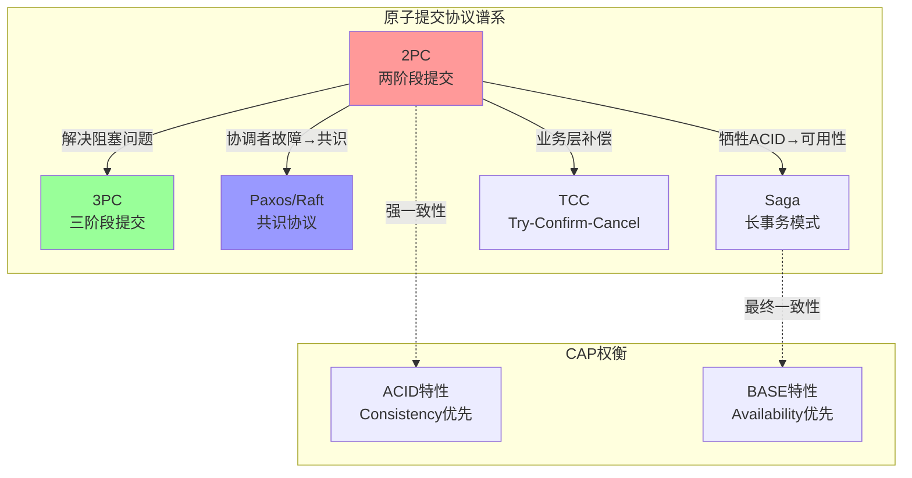
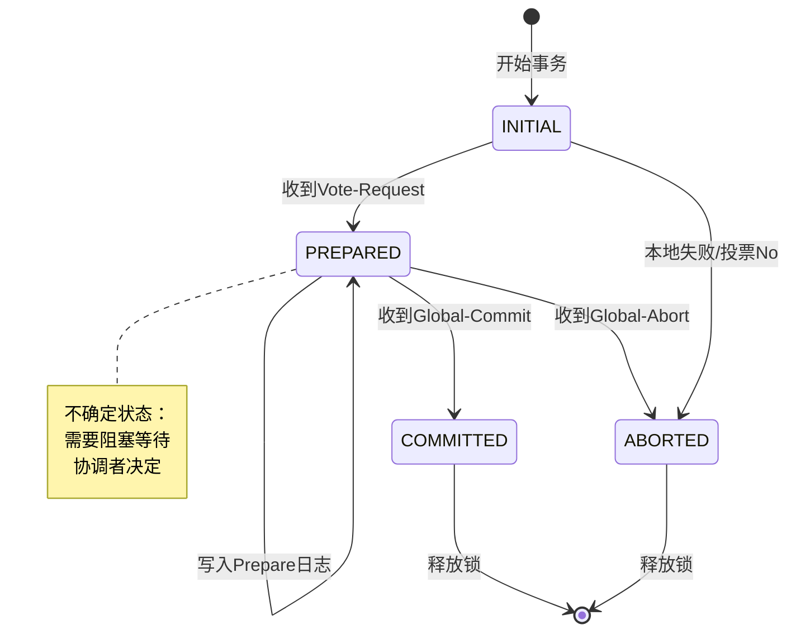
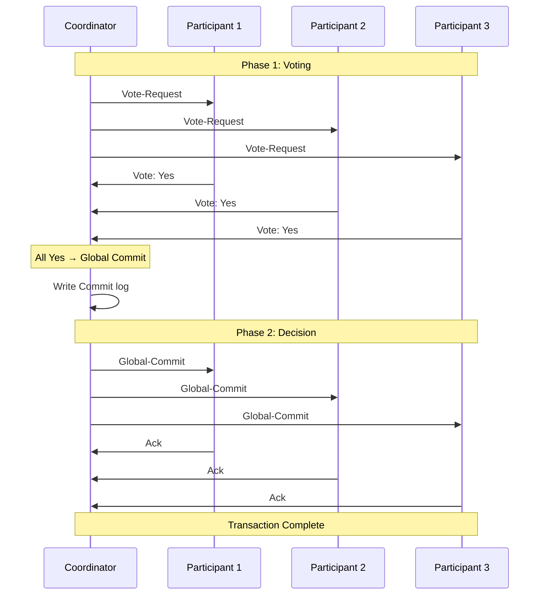
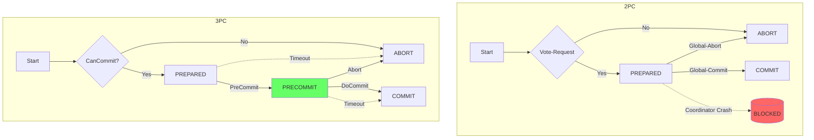

# 两阶段提交（Two-Phase Commit, 2PC）

> **所属阶段**: Struct/Appendices/Wikipedia-Concepts | **前置依赖**: [15-consensus-protocols.md](./15-consensus-protocols.md), [16-paxos.md](./16-paxos.md) | **形式化等级**: L4

---

## 1. 概念定义 (Definitions)

### 1.1 Wikipedia标准定义

**两阶段提交（Two-Phase Commit, 2PC）** 是一种用于在分布式系统中实现原子事务提交的协议。它确保所有参与者要么全部提交事务，要么全部中止事务，从而维护分布式事务的**原子性（Atomicity）**。

**Def-W-17-01（2PC协议）**：设分布式事务涉及协调者（Coordinator）$C$ 和参与者集合 $\{P_1, P_2, \ldots, P_n\}$。两阶段提交协议是由以下两个阶段组成的原子提交协议：

- **第一阶段（投票阶段/Voting Phase）**：协调者询问所有参与者是否可以提交事务
- **第二阶段（决定阶段/Decision Phase）**：协调者根据参与者的响应做出全局决定

**Def-W-17-02（协调者 Coordinator）**：负责发起事务提交、收集参与者投票、做出全局决定并传播给所有参与者的节点。

**Def-W-17-03（参与者 Participant）**：执行事务操作并在提交时投票的节点。每个参与者维护自己的**本地日志（Local Log）**以支持故障恢复。

**Def-W-17-04（事务结果状态）**：
- **Global Commit**：所有参与者成功提交事务
- **Global Abort**：至少一个参与者投票中止，或协调者决定中止

---

## 2. 属性推导 (Properties)

### 2.1 2PC的基本性质

**Lemma-W-17-01（一致性保证）**：若2PC协议正常完成，则所有参与者达成相同决定。

*证明概要*：协调者作为单一决策点，收集所有参与者的投票后做出统一决定，并将该决定广播给所有参与者。∎

**Lemma-W-17-02（可恢复性）**：参与者可以在崩溃后通过本地日志恢复到正确状态。

*证明概要*：参与者在发送投票前写入"Prepare"日志，在提交前写入"Commit"日志。崩溃后可根据日志状态决定是否需要与协调者通信以获取最终决定。∎

**Lemma-W-17-03（协调者单点瓶颈）**：协调者是2PC的性能瓶颈和单点故障源。

*论证*：所有消息必须经过协调者转发，协调者的处理能力和网络带宽限制了整体吞吐量。∎

---

## 3. 关系建立 (Relations)

### 3.1 与其他协议的关系



**与Paxos的关系**：
- 2PC假设协调者可靠，Paxos解决协调者选举问题
- 2PC在协调者故障时阻塞，Paxos通过多数派保证可用性
- 可以组合使用：用Paxos选主来替换2PC中的协调者

**与3PC的关系**：
- 3PC是2PC的扩展，增加"预提交"阶段解决阻塞问题
- 3PC在网络分区时仍可能不一致，但避免了无限期阻塞

---

## 4. 论证过程 (Argumentation)

### 4.1 投票阶段详细流程

```
协调者 C                    参与者 P_i
    |                            |
    |---- Vote-Request ---------->|  (Phase 1a)
    |         (Can you commit?)  |
    |                            |  执行本地事务
    |                            |  写入Prepare日志
    |<--- Yes/No ----------------|  (Phase 1b)
    |         (Vote)             |
```

**Phase 1a - Vote-Request**：协调者向所有参与者发送投票请求，询问是否可以提交事务。

**Phase 1b - Voting**：参与者：
1. 执行事务的本地操作（不真正提交）
2. 在本地日志中写入"Prepare"记录
3. 向协调者发送"Yes"（可以提交）或"No"（不能提交）

**关键决策点**：参与者投票"Yes"后，必须能够提交事务（已持有所有锁，资源已预留）。

### 4.2 决定阶段详细流程

```
协调者 C                    参与者 P_i
    |                            |
    | 收集所有投票               |
    | 若全部Yes → Global Commit  |
    | 若有No    → Global Abort   |
    |                            |
    |---- Global-Commit -------->|  (Phase 2a)
    |    or Global-Abort         |
    |                            |  执行提交或回滚
    |                            |  写入Commit/Abort日志
    |<--- Ack -------------------|  (Phase 2b)
    |                            |  释放锁
```

**Phase 2a - Global Decision**：
- 协调者收到所有投票后做出全局决定
- 若所有参与者投票"Yes"，则决定"Global-Commit"
- 若有任何参与者投票"No"或超时，则决定"Global-Abort"
- 协调者将决定写入本地日志，然后广播给所有参与者

**Phase 2b - Execution**：
- 参与者收到全局决定后执行相应操作
- 写入"Commit"或"Abort"日志记录
- 向协调者发送确认（Ack）
- 释放事务持有的所有锁

### 4.3 参与者状态机



**状态说明**：
- **INITIAL**：事务开始，执行本地操作
- **PREPARED**：已投票"Yes"，等待协调者决定
- **COMMITTED**：已提交事务
- **ABORTED**：已中止事务

---

## 5. 形式证明 (Formal Proof)

### 5.1 2PC原子性定理

**Thm-W-17-01（2PC原子性定理）**：对于任何使用2PC的分布式事务，要么所有参与者提交事务，要么所有参与者中止事务，不存在部分提交的情况。

**形式化表述**：设参与者集合为 $\mathcal{P} = \{P_1, \ldots, P_n\}$，定义决策变量 $d_i \in \{Commit, Abort\}$ 为参与者 $P_i$ 的最终状态。则：

$$\forall i, j \in \{1, \ldots, n\}: d_i = d_j$$

**证明**：

1. **协调者作为决策权威**：根据Def-W-17-01，协调者 $C$ 是唯一做出全局决定的节点。

2. **决策传播**：协调者在Phase 2a将同一决定广播给所有参与者（根据Phase 2协议定义）。

3. **参与者行为**：每个参与者在Phase 2b根据收到的决定执行操作，且协议规定参与者只能根据协调者的决定改变状态。

4. **反证法**：假设存在 $P_i$ 提交而 $P_j$ 中止。
   - 情况1：$P_i$ 收到"Global-Commit"，$P_j$ 收到"Global-Abort"
   - 这与协调者只做一个全局决定矛盾（协调者在同一事务中不会发送矛盾决定）
   - 情况2：$P_j$ 因超时而自行中止
   - 这要求 $P_j$ 未投票"Yes"或在PREPARED状态前已中止
   - 若 $P_j$ 未投票"Yes"，协调者必须决定"Global-Abort"，$P_i$ 也应收到"Global-Abort"

5. **结论**：矛盾，假设不成立，故所有参与者决策相同。∎

### 5.2 阻塞不可避免性定理

**Thm-W-17-02（2PC阻塞定理）**：在2PC协议中，当协调者在Phase 2期间崩溃且无法恢复时，已投票"Yes"的参与者将无限期阻塞。

**形式化表述**：设协调者 $C$ 在发送部分"Global-Commit"消息后崩溃。对于已投票"Yes"但未收到决定的参与者 $P_i$：

$$\square\, (State(P_i) = PREPARED \land \diamondsuit\, \neg Recovered(C) \Rightarrow \square\, Blocked(P_i))$$

其中 $\square$ 表示"总是"，$\diamondsuit$ 表示"最终"。

**证明**：

1. **参与者状态分析**：已投票"Yes"的参与者 $P_i$ 处于PREPARED状态，持有资源锁，等待协调者决定。

2. **决策依赖**：根据2PC协议，参与者不能单方面做出提交或中止决定，必须依赖协调者的全局决定。

3. **信息不足**：协调者崩溃后，$P_i$ 无法确定：
   - 其他参与者的投票情况
   - 协调者已做出的全局决定
   - 是否已有其他参与者提交或中止

4. **安全要求**：若 $P_i$ 单方面决定提交：
   - 可能协调者实际决定"Global-Abort"
   - 违反原子性（Thm-W-17-01）
   
   若 $P_i$ 单方面决定中止：
   - 可能协调者实际决定"Global-Commit"且部分参与者已提交
   - 同样违反原子性

5. **结论**：$P_i$ 必须阻塞等待协调者恢复以获取最终决定。若协调者无法恢复，阻塞无限期持续。∎

### 5.3 3PC非阻塞证明

**Def-W-17-05（三阶段提交 3PC）**：3PC在2PC的两阶段之间增加"Pre-Commit"阶段：
- **Phase 1**: Can-Commit?（CanCommit/No）
- **Phase 2**: Pre-Commit（参与者预提交，进入PRECOMMIT状态）
- **Phase 3**: Do-Commit/Abort（实际提交）

**Thm-W-17-03（3PC非阻塞定理）**：在3PC协议中，假设网络不会同时发生分区，则不存在已投票参与者无限期阻塞的情况。

**证明概要**：

1. **超时机制**：3PC引入参与者超时，在超时后可以做出独立决定。

2. **状态可推导性**：
   - 若参与者处于PRECOMMIT状态（收到Pre-Commit）：
     - 说明协调者已收到所有Yes投票
     - 协调者必须已决定提交
     - 参与者可以在超时后安全提交
   
   - 若参与者处于PREPARED状态（未收到Pre-Commit）：
     - 说明协调者可能未收到所有Yes
     - 参与者可以安全中止（协调者不可能决定提交）

3. **网络假设**：在同步网络假设下（消息延迟有界），参与者可以通过超时推断系统状态。

4. **与2PC的区别**：
   - 2PC的PREPARED状态参与者无法推断全局状态
   - 3PC的PRECOMMIT状态参与者可以推断协调者已决定提交

5. **结论**：参与者可以在超时后做出独立决定，避免了无限期阻塞。∎

**局限性说明**：3PC的非阻塞性依赖于**同步网络假设**（消息延迟有界）。在异步网络中，无法区分"协调者已崩溃"和"消息延迟"，3PC可能退化为阻塞状态。

---

## 6. 实例验证 (Examples)

### 6.1 银行转账示例

```
场景：账户A（银行1）向账户B（银行2）转账$100

协调者：转账服务
参与者：银行1节点(P1), 银行2节点(P2)

Phase 1 - 投票阶段：
  协调者 → P1: Vote-Request {deduct $100 from A}
  协调者 → P2: Vote-Request {add $100 to B}
  
  P1: 检查A余额≥$100，预留资金，写Prepare日志
  P1 → 协调者: Yes
  
  P2: 检查B账户有效，预留额度，写Prepare日志  
  P2 → 协调者: Yes

Phase 2 - 决定阶段：
  协调者: 收到全部Yes，决定Global-Commit
  协调者写Commit日志
  
  协调者 → P1: Global-Commit
  协调者 → P2: Global-Commit
  
  P1: 执行扣款，写Commit日志，释放锁
  P1 → 协调者: Ack
  
  P2: 执行入账，写Commit日志，释放锁
  P2 → 协调者: Ack

结果：事务原子完成，A扣款$100，B入账$100
```

### 6.2 协调者故障场景

```
故障场景：协调者在发送Global-Commit后崩溃

时间点：
  T1: 协调者向P1发送Global-Commit
  T2: 协调者崩溃（未向P2发送决定）
  T3: P1提交事务
  T4: P2在PREPARED状态阻塞

恢复过程：
  1. 新协调者（或恢复后的原协调者）查询各参与者状态
  2. 发现P1已提交 → 推断全局决定为Commit
  3. 命令P2提交事务
  4. 系统恢复一致性

关键：必须通过日志或参与者状态恢复全局决定
```

### 6.3 3PC执行示例

```
3PC执行流程（转账场景）：

Phase 1 - CanCommit:
  协调者 → 所有参与者: CanCommit?
  参与者 → 协调者: Yes/No

Phase 2 - PreCommit（新增）：
  若全部Yes:
    协调者写PreCommit日志
    协调者 → 所有参与者: PreCommit
    
    参与者收到PreCommit:
      写PreCommit日志（进入PRECOMMIT状态）
      向协调者发送ACK
      
    协调者收到全部ACK后进入Phase 3
    
  若有No:
    直接跳转Abort

Phase 3 - DoCommit:
  协调者写Commit日志
  协调者 → 所有参与者: DoCommit
  
  参与者提交事务，写Commit日志

超时处理（关键改进）：
  - PRECOMMIT状态超时 → 可以安全提交
  - PREPARED状态超时 → 可以安全中止
```

---

## 7. 可视化 (Visualizations)

### 7.1 2PC完整时序图



### 7.2 2PC vs 3PC对比



### 7.3 协议特性雷达图（文本表示）

```
特性对比雷达图（满分5分）：

                一致性
                  5
                  |
    容错性 ------+------ 可用性
    2PC: 2       |       2PC: 2
    3PC: 3       |       3PC: 3
    Paxos: 4     |       Paxos: 4
                 |
    性能 -------+------- 复杂度
    2PC: 4       |       2PC: 3
    3PC: 3       |       3PC: 4
    Paxos: 2     |       Paxos: 5
                 |
               扩展性
```

---

## 8. 八维表征 (Eight-Dimensional Characterization)

### 8.1 形式化维度分析

| 维度 | 2PC特征 | 3PC改进 | 说明 |
|------|---------|---------|------|
| **1. 时序（Temporal）** | 两阶段同步 | 三阶段同步 | 3PC增加预提交阶段 |
| **2. 因果（Causal）** | 协调者决策因果 | 超时事件因果 | 3PC引入超时因果 |
| **3. 模态（Modal）** | □(原子性) | ◇(非阻塞) | 2PC保证必然性，3PC保证可能性 |
| **4. 证明（Proof）** | 构造性证明 | 超时机制 | 通过时序约束避免阻塞 |
| **5. 状态（State）** | 4状态机 | 5状态机 | 3PC增加PRECOMMIT状态 |
| **6. 演算（Calculus）** | 同步消息 | 带超时消息 | 扩展CSP算子 |
| **7. 逻辑（Logic）** | 经典逻辑 | 时序逻辑 | 3PC需要时序推理 |
| **8. 类型（Type）** | 二元决策类型 | 三元决策类型 | Commit/Abort/Timeout |

### 8.2 各维度详细表征

**维度1 - 时序（Temporal）**：
```
2PC时序结构：
  Vote-Request → Vote-Response → Global-Decision → Ack
  
3PC时序结构：
  CanCommit → Yes/No → PreCommit → Ack → DoCommit → Ack
```

**维度2 - 因果（Causal）**：
- 2PC中，参与者的提交行为因果依赖于协调者的Global-Commit消息
- 3PC中，PRECOMMIT状态参与者的提交可以因果依赖于超时事件

**维度3 - 模态（Modal）**：
- 2PC模态公式：$\square(Committed \lor Aborted) \land \neg\diamond(Committed \land Aborted)$
- 3PC模态公式：$\diamond\neg Blocked$（最终非阻塞）

**维度4 - 证明（Proof）**：
- 2PC原子性证明：通过协调者单一决策点
- 3PC非阻塞证明：通过状态可推导性和超时机制

**维度5 - 状态（State）**：
| 协议 | 状态数 | 关键状态 |
|------|--------|----------|
| 2PC | 4 | INITIAL, PREPARED, COMMITTED, ABORTED |
| 3PC | 5 | 增加PRECOMMIT状态 |

**维度6 - 演算（Calculus）**：
```
2PC形式化（CSP风格）：
  Coordinator = vote_request → (yes → commit | no → abort)
  Participant = vote_request → (if can_commit then yes → (commit → SKIP | abort → SKIP))

3PC形式化（带超时）：
  Participant = can_commit? → (if ok then yes → (precommit → (docommit → SKIP ▷ timeout → SKIP)))
```

**维度7 - 逻辑（Logic）**：
- 2PC：经典命题逻辑 + 模态算子
- 3PC：线性时序逻辑（LTL）或计算树逻辑（CTL）

**维度8 - 类型（Type）**：
```haskell
-- 2PC决策类型
data Decision2PC = Commit | Abort

-- 3PC决策类型（增加超时）
data Decision3PC = Commit | Abort | TimeoutCommit
```

---

## 9. 实际应用 (Practical Applications)

### 9.1 分布式数据库中的应用

| 数据库系统 | 2PC实现 | 优化策略 |
|------------|---------|----------|
| **MySQL XA** | 标准2PC | 支持一阶段优化（单资源时） |
| **PostgreSQL** | 标准2PC | PREPARE TRANSACTION优化 |
| **Oracle RAC** | 分布式2PC | 集群内优化通信 |
| **MongoDB** | 类2PC | 两阶段提交协议 |
| **TiDB** | Percolator | 乐观锁 + 2PC变体 |
| **Google Spanner** | 2PC + Paxos | Paxos组作为参与者 |

### 9.2 事务处理中间件

```java
// JTA (Java Transaction API) 2PC示例
UserTransaction ut = getUserTransaction();
try {
    ut.begin();
    
    // 操作数据源1
    connection1.prepareStatement("UPDATE...").execute();
    
    // 操作数据源2
    connection2.prepareStatement("INSERT...").execute();
    
    ut.commit(); // 内部使用2PC
} catch (Exception e) {
    ut.rollback();
}
```

### 9.3 微服务 Saga 模式对比

```
2PC vs Saga 在微服务中的选择：

2PC适用场景：
├── 强一致性要求（金融核心交易）
├── 参与者数量少（<10个）
├── 事务执行时间短（秒级）
└── 网络分区容忍度低

Saga适用场景：
├── 最终一致性可接受
├── 参与者数量多
├── 长事务（分钟/小时级）
└── 高可用性优先
```

---

## 10. 引用参考 (References)

### 10.1 原始论文

[^1]: J. N. Gray, "Notes on Data Base Operating Systems," in *Operating Systems: An Advanced Course*, Springer, 1978, pp. 393-481. —— **2PC原始论文**

[^2]: J. N. Gray and A. Reuter, *Transaction Processing: Concepts and Techniques*, Morgan Kaufmann, 1993. —— **事务处理经典教材**

[^3]: M. Skeen, "Nonblocking Commit Protocols," in *ACM SIGMOD International Conference on Management of Data*, 1981, pp. 133-142. —— **3PC原始论文**

[^4]: D. Skeen and M. Stonebraker, "A Formal Model of Crash Recovery in a Distributed System," *IEEE Transactions on Software Engineering*, vol. SE-9, no. 3, pp. 219-228, 1983.

### 10.2 共识与原子提交

[^5]: L. Lamport, "The Part-Time Parliament," *ACM Transactions on Computer Systems*, vol. 16, no. 2, pp. 133-169, 1998. —— **Paxos原始论文**

[^6]: D. Dieker and A. Reuter, "Altruistic Locking: A Strategy for Coping with Long-Lived Transactions," in *Advanced Database Symposium*, 1986.

[^7]: P. A. Bernstein, V. Hadzilacos, and N. Goodman, *Concurrency Control and Recovery in Database Systems*, Addison-Wesley, 1987. —— **并发控制经典教材**

### 10.3 现代实现与应用

[^8]: J. C. Corbett et al., "Spanner: Google's Globally-Distributed Database," in *OSDI*, 2012. —— **Spanner的2PC+TrueTime实现**

[^9]: D. Peng and F. Dabek, "Large-scale Incremental Processing Using Distributed Transactions and Notifications," in *OSDI*, 2010. —— **Percolator模型**

[^10]: M. Kleppmann, "Designing Data-Intensive Applications," O'Reilly Media, 2017. —— **DDIA第9章分布式事务**

### 10.4 在线资源

[^11]: Wikipedia, "Two-phase commit protocol," https://en.wikipedia.org/wiki/Two-phase_commit_protocol

[^12]: Wikipedia, "Three-phase commit protocol," https://en.wikipedia.org/wiki/Three-phase_commit_protocol

[^13]: Apache Flink Documentation, "Distributed Coordination via 2PC," https://nightlies.apache.org/flink/flink-docs-stable/

[^14]: MySQL Documentation, "XA Transactions," https://dev.mysql.com/doc/refman/8.0/en/xa.html

---

*文档版本: v1.0 | 创建日期: 2026-04-10 | 作者: AnalysisDataFlow Project*
