# Paxos共识算法

> 所属阶段: Struct/Formal Methods | 前置依赖: [13-consensus.md](./13-consensus.md), [15-linearizability.md](./15-linearizability.md) | 形式化等级: L5
>
> **相关概念**: [Consensus概述](./13-consensus.md) - 共识问题的一般性介绍

## 1. 概念定义 (Definitions)

### Def-S-98-01: Paxos算法（Wikipedia标准定义）

**Paxos**是由Leslie Lamport于1989年提出、1998年发表的分布式共识算法[^1]。该算法解决的是**拜占庭将军问题**的非拜占庭版本——即在**崩溃容错（Crash-Stop）**模型下，如何让分布式系统中的多个节点就某个值达成一致。

> **Wikipedia定义**: "Paxos is a family of protocols for solving consensus in a network of unreliable processors (that is, processors that may fail)."[^2]

**核心问题陈述**: 给定一组可能故障的进程，设计一个协议使得：

- 所有**未故障**进程最终同意同一个值
- 被同意的值必须**由某个进程提议**

### Def-S-98-02: 提案（Proposal）

提案是Paxos协议中的基本操作单元，定义为二元组：

$$
\text{Proposal} \triangleq \langle n, v \rangle
$$

其中：

- $n \in \mathbb{N}$: **提案编号**（Proposal Number），全局唯一且单调递增
- $v \in \mathcal{V}$: **提案值**（Proposal Value），来自值域$\mathcal{V}$

**提案编号的全序性**: 对于任意两个提案$\langle n_1, v_1 \rangle$和$\langle n_2, v_2 \rangle$：

$$
\langle n_1, v_1 \rangle < \langle n_2, v_2 \rangle \iff n_1 < n_2
$$

### Def-S-98-03: 角色定义（Roles）

Paxos定义了三类角色，进程可以同时担任多个角色：

| 角色 | 职责 | 状态维护 |
|------|------|----------|
| **Proposer（提议者）** | 提出提案，推动共识达成 | 当前提案编号、已收集的Promise响应 |
| **Acceptor（接受者）** | 对提案进行投票，存储接受的值 | 已承诺的最大提案号$minProposal$、已接受的最大提案$acceptedProposal$ |
| **Learner（学习者）** | 学习已被选定的值 | 已学习的值、确认状态 |

**形式化角色状态**:

```
ProposerState ::= { proposalNum: ℕ,
                    promises: Set⟨Promise⟩,
                    phase: {IDLE, PREPARING, ACCEPTING, CHOSEN} }

AcceptorState ::= { minProposal: ℕ ∪ {⊥},
                    acceptedProposal: Proposal ∪ {⊥},
                    maxAcceptedNum: ℕ ∪ {⊥} }

LearnerState ::= { chosenValue: 𝒱 ∪ {⊥},
                   acceptorsHeardFrom: Set⟨AcceptorID⟩ }
```

### Def-S-98-04: 多数派（Quorum）

**Def-S-98-04a: Quorum定义**

对于包含$N$个Acceptor的集合$\mathcal{A} = \{A_1, A_2, ..., A_N\}$，Quorum $Q$是$\mathcal{A}$的子集，满足：

$$
Q \subseteq \mathcal{A} \land |Q| > \frac{N}{2}
$$

**Def-S-98-04b: Quorum交集性质**

对于任意两个Quorum $Q_1, Q_2$：

$$
Q_1 \cap Q_2 \neq \emptyset
$$

这是Paxos安全性的核心数学基础。

### Def-S-98-05: 值被选定（Chosen）

值$v$被**选定**（Chosen）当且仅当：

$$
\exists Q \in \text{Quorum}: \forall A \in Q: \text{accepted}(A, \langle n, v \rangle)
$$

即存在一个Quorum的Acceptor都接受了包含值$v$的提案。

## 2. 属性推导 (Properties)

### Lemma-S-98-01: 提案编号的唯一性

**命题**: 在Paxos协议执行过程中，不同Proposer生成的提案编号全局唯一。

**证明概要**:
假设有$M$个Proposer，第$i$个Proposer使用编号序列：

$$
\text{proposalNum}_i = i, i + M, i + 2M, i + 3M, ...
$$

则对于任意$i \neq j$，有$i + kM \neq j + lM$对所有$k, l \in \mathbb{N}$成立。

∎

### Lemma-S-98-02: Promise的单调性

**命题**: 一旦Acceptor $A$对提案编号$n$发送了Promise，则$A$不会再接受任何提案编号$n' < n$的提案。

**证明**:
由Promise定义，Acceptor在发送Promise时更新：

$$
minProposal(A) := \max(minProposal(A), n)
$$

Accept阶段的前置条件：

$$
\text{accept}(A, \langle n', v \rangle) \text{ requires } n' \geq minProposal(A)
$$

因此当$n' < n \leq minProposal(A)$时，接受被拒绝。∎

### Prop-S-98-01: 值的合法性（Validity）

**命题**: 任何被Chosen的值$v$，必然被某个Proposer提出。

**证明**:
由Chosen定义，需要Quorum的Acceptor接受提案。而Acceptor仅在收到Accept请求时才可能接受，Accept请求由Proposer发送，且必须包含Proposer选定的值。∎

### Prop-S-98-02: Quorum的非空交集

**命题**: 对于$N$个Acceptor，任何两个大小为$\lceil (N+1)/2 \rceil$的Quorum必有非空交集。

**证明**:
设$|Q_1| = |Q_2| = \lceil (N+1)/2 \rceil$，由鸽巢原理：

$$
|Q_1| + |Q_2| = 2 \cdot \lceil (N+1)/2 \rceil > N = |\mathcal{A}|
$$

因此$Q_1 \cap Q_2 \neq \emptyset$。∎

## 3. 关系建立 (Relations)

### Paxos与共识问题

Paxos解决的是**崩溃容错共识**（Crash-Stop Consensus），与经典共识问题的关系：

| 维度 | FLP不可能性 | Paxos解决方案 |
|------|-------------|---------------|
| 故障模型 | 异步系统单故障 | 崩溃容错 |
| 活性保证 | 无确定性算法 | 部分同步假设 |
| 安全性 | 可保证 | 完全保证 |

### Paxos与2PC（两段提交）

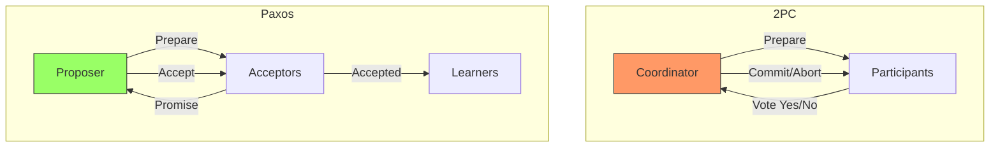

**关键区别**:

- 2PC: Coordinator单点，阻塞协议
- Paxos: 多Proposer，非阻塞，容错

### Paxos与Raft

| 特性 | Paxos | Raft |
|------|-------|------|
| 领导者 | 隐式（Multi-Paxos优化） | 显式，强领导者 |
| 可理解性 | 公认复杂 | 为可理解性设计 |
| 日志复制 | 每次独立Paxos实例 | 连续的日志条目 |
| 成员变更 | 需要额外协议 | 联合共识（Joint Consensus） |

### Paxos与PBFT

```
Paxos: f故障 → 需要 2f+1 个节点（崩溃容错）
PBFT: f故障 → 需要 3f+1 个节点（拜占庭容错）
```

Paxos是PBFT在崩溃容错场景下的简化版本。

## 4. 论证过程 (Argumentation)

### 4.1 两阶段设计的必要性

**为什么需要Prepare阶段？**

假设只有Accept阶段：

1. Proposer P1向Acceptor A1发送Accept(n=1, v=X)
2. P2向A2发送Accept(n=2, v=Y)
3. 两者都获得"多数派"（但不同Acceptor集合）
4. **冲突**: 不同Learner可能学到不同值

**Prepare阶段的作用**: 通过Promise机制确保提案编号的单调性，从而保证只有最新提案号才能成功。

### 4.2 网络分区下的行为

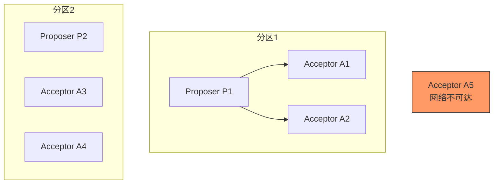

**分析**:

- 分区1: 2个Acceptor，无法形成Quorum（假设N=5，需要≥3）
- 分区2: 同理无法形成Quorum
- **安全性**: 不会有冲突值被Chosen（因为都需要Quorum）
- **活性**: 分区期间无法达成共识

### 4.3 活锁（Livelock）问题

**场景**: 多个Proposer竞争

```
t=1: P1发送Prepare(n=1)
t=2: P2发送Prepare(n=2)
t=3: Acceptor承诺n=2，P1的Accept(n=1)被拒绝
      P1增加n=3，发送Prepare(n=3)
t=4: P3发送Prepare(n=4)
...
```

**解决方案**:

- **Leader选举**: 让单一Proposer主导（Multi-Paxos）
- **随机退避**: 冲突后随机等待
- **提案号间隔**: Proposer使用间隔较大的提案号

## 5. 形式证明 (Proofs)

### 5.1 Paxos安全性定理（单一值一致性）

**Thm-S-98-01: Paxos Safety（一致性）**

> 如果值$v$被第一个Chosen，那么之后被选定的值都等于$v$。

**形式化表述**:

$$
\forall v_1, v_2 \in \mathcal{V}, n_1, n_2 \in \mathbb{N}:
$$
$$
\text{chosen}(\langle n_1, v_1 \rangle) \land \text{chosen}(\langle n_2, v_2 \rangle) \land n_1 < n_2
$$
$$
\Rightarrow v_1 = v_2
$$

**证明**:

设$Q_1$是使$\langle n_1, v_1 \rangle$被Chosen的Quorum，$Q_2$是使$\langle n_2, v_2 \rangle$被Chosen的Quorum。

由Quorum交集性质（Lemma-S-98-02推论）：

$$
\exists A \in \mathcal{A}: A \in Q_1 \cap Q_2
$$

**关键观察**:

- 由于$A \in Q_1$，$A$接受了$\langle n_1, v_1 \rangle$，即$\text{accepted}(A, \langle n_1, v_1 \rangle)$
- 由于$A \in Q_2$，$A$接受了$\langle n_2, v_2 \rangle$

由Lemma-S-98-02（Promise单调性），Acceptor在$\langle n_2, v_2 \rangle$之前必须对$n_2$发送了Promise。

**情况分析**:

**情况1**: $A$在发送Promise之前已经接受了$\langle n_1, v_1 \rangle$。

在Promise响应中，$A$会返回已接受的最大提案：

$$
\text{Promise}(A, n_2) = \{..., \langle n_1, v_1 \rangle, ...\}
$$

Proposer在Phase 2必须使用已接受的值（Paxos Made Simple的规则）：

$$
v_2 = v_1
$$

**情况2**: $A$先发送Promise(n₂)，后接受⟨n₁,v₁⟩。

这不可能发生，因为接受$n_1 < n_2$需要$n_1 \geq minProposal(A) \geq n_2$，矛盾。

综上，$v_1 = v_2$。∎

### 5.2 Quorum交集引理

**Lemma-S-98-03: Quorum交集**

对于$N$个Acceptor的系统，任何两个Quorum $Q_1, Q_2$满足：

$$
|Q_1 \cap Q_2| \geq 2|Q| - N
$$

其中$|Q| = \lceil (N+1)/2 \rceil$是标准Quorum大小。

**证明**:

由容斥原理：

$$
|Q_1 \cup Q_2| = |Q_1| + |Q_2| - |Q_1 \cap Q_2| \leq N
$$

因此：

$$
|Q_1 \cap Q_2| \geq |Q_1| + |Q_2| - N = 2|Q| - N
$$

当$|Q| = \lceil (N+1)/2 \rceil$时：

- 若$N = 2k+1$（奇数）: $|Q| = k+1$，交集$\geq 2(k+1) - (2k+1) = 1$ ✓
- 若$N = 2k$（偶数）: $|Q| = k+1$，交集$\geq 2(k+1) - 2k = 2$ ✓

∎

### 5.3 活性定理（部分同步模型）

**Thm-S-98-02: Paxos Liveness**

在**部分同步**（Partial Synchronization）模型下，假设：

1. 存在一个Quorum的Acceptor不会故障
2. 消息延迟有上界$\Delta$
3. 最多一个Proposer在任一时刻进行提议

则Paxos算法最终会选定一个值。

**证明**:

**阶段1**: Prepare阶段成功

设Proposer P在$t=0$发送Prepare(n)到所有Acceptor。

对于非故障Acceptor $A$，在$t \leq \Delta$内收到请求，在$t \leq 2\Delta$内P收到Promise。

设Quorum $Q$都是非故障Acceptor，则在$t \leq 2\Delta$内，P收到$|Q|$个Promise。

**阶段2**: Accept阶段成功

P在收到Promise后立即发送Accept(n, v)，其中：

$$
v = \begin{cases}
v_{max} & \text{if } \exists \langle n', v' \rangle \in \text{Promises} \\
v_{proposed} & \text{otherwise}
\end{cases}
$$

同样，在$t \leq 3\Delta$内，所有$A \in Q$收到Accept请求。

由Lemma-S-98-02，这些Acceptor在Promise后$minProposal \geq n$，因此接受条件满足。

**阶段3**: 学习阶段

每个$A \in Q$发送Accepted消息，Learner在$t \leq 4\Delta$内收到来自Quorum的确认，确定值已Chosen。

因此，在$t \leq 4\Delta$时间内，值被选定。∎

### 5.4 安全性与活性的不可兼得（FLP结果）

**Cor-S-98-01: FLP不可能性**

在**纯异步**系统中，如果允许至少一个进程故障，则不存在确定性的共识算法同时满足：

- **终止性**（Termination）：所有非故障进程最终决策
- **一致性**（Agreement）：所有决策进程决定相同值
- **有效性**（Validity）：决策值由某个进程提议

**说明**: Paxos通过**牺牲活性**来保证安全性——在网络分区或多Proposer竞争时，协议可能不终止，但绝不会违反一致性。

## 6. 实例验证 (Examples)

### 6.1 Basic Paxos执行示例

**场景**: 3个Acceptor（A1, A2, A3），Quorum大小=2，1个Proposer P

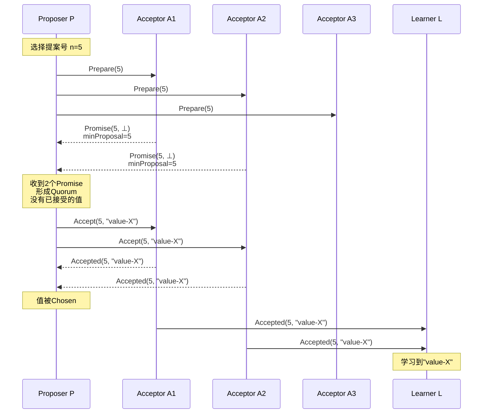

### 6.2 冲突解决示例

**场景**: Proposer P1（n=5）与P2（n=8）竞争

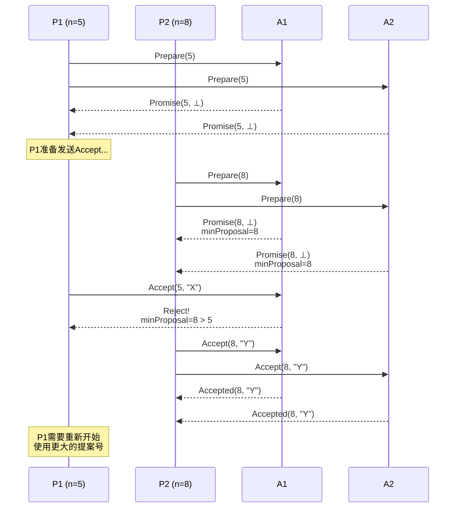

### 6.3 值继承示例

**场景**: P1的提案在Accept阶段部分成功后被P2继承

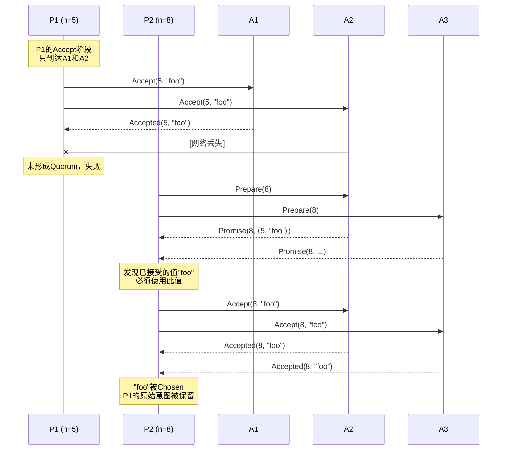

## 7. 变体与优化 (Variants)

### 7.1 Multi-Paxos

**问题**: Basic Paxos每选定一个值需要两轮RPC（Prepare + Accept）。

**优化**: 引入**稳定Leader**，在Leader任期内跳过Prepare阶段。

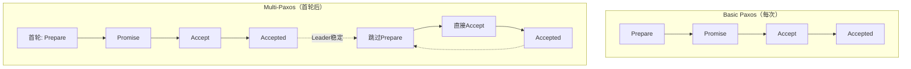

**Leader选举**: 通常使用心跳机制，若Leader失效，新Leader通过Paxos提议自己为Leader。

### 7.2 Fast Paxos

**目标**: 在稳定状态下，将消息延迟从3个RTT减少到2个RTT。

**机制**:

- **Classic Quorum**: $|Q_C| = \lceil (N+1)/2 \rceil$
- **Fast Quorum**: $|Q_F| = \lceil 3N/4 \rceil$（更大的Quorum）

**协议**:

1. 若Leader检测到无冲突，直接发送Accept（跳过Prepare）
2. Client可直接向Acceptor发送提案
3. 使用更大的Fast Quorum来容忍冲突

```
延迟对比:
Basic Paxos:  Client → Leader → Acceptors → Leader → Client = 3 RTT
Fast Paxos:   Client → Acceptors → Client = 2 RTT（最佳情况）
```

### 7.3 Flexible Paxos

**核心思想**: 放宽Quorum的约束，允许不同大小的Quorum组合。

**传统Paxos**: Prepare Quorum = Accept Quorum = 多数派

**Flexible Paxos**:

- Prepare Quorum: $Q_P$
- Accept Quorum: $Q_A$

**约束条件**:

$$
\forall q_P \in Q_P, \forall q_A \in Q_A: q_P \cap q_A \neq \emptyset
$$

**示例**: N=5

- $Q_P$: 任意2个Acceptor
- $Q_A$: 任意4个Acceptor
- 交集: 2 + 4 - 5 = 1（满足条件）

**应用场景**:

- 读优化系统：减少Prepare阶段的开销
- 地理分布式：减少跨区域通信

### 7.4 变体对比表

| 变体 | Prepare优化 | 延迟 | 应用场景 |
|------|-------------|------|----------|
| Basic Paxos | 无 | 3 RTT | 教学、简单场景 |
| Multi-Paxos | Leader稳定后跳过 | 1 RTT（稳定） | 生产系统、日志复制 |
| Fast Paxos | 条件跳过 | 2 RTT | 低延迟要求 |
| Flexible Paxos | 可调Quorum | 可变 | 异构网络、跨地域 |
| EPaxos | 无Leader | 1-2 RTT | 低冲突工作负载 |
| Vertical Paxos | 动态成员变更 | - | 成员变更频繁 |

## 8. 工业应用 (Applications)

### 8.1 Chubby（Google）

**用途**: 分布式锁服务、粗粒度同步、元数据存储

**Paxos应用**:

- 使用Multi-Paxos实现副本状态机
- 5个副本，典型部署跨数据中心
- 日志复制确保所有副本一致

**特点**:

- 长连接，客户端缓存
- 事件通知机制
- 支持小文件读写

### 8.2 ZooKeeper（Apache）

**协议**: ZAB（ZooKeeper Atomic Broadcast）

**与Paxos的关系**:

```
ZAB ≈ Multi-Paxos + 顺序保证 + 崩溃恢复优化
```

**关键差异**:

- ZAB保证**FIFO客户端顺序**
- 主备切换时有同步阶段
- 所有更新通过Leader

**使用场景**: 配置管理、命名服务、分布式协调

### 8.3 etcd（CoreOS/Red Hat）

**协议**: Raft（类Paxos）

**设计目标**:

- 简单性（比Paxos易理解）
- 安全性
- 可用性
- 性能

**Paxos元素在Raft中的体现**:

| Raft概念 | Paxos对应 |
|----------|-----------|
| Leader Election | Paxos Leader |
| Log Replication | Multi-Paxos实例 |
| Safety | Quorum机制 |

**Kubernetes集成**: etcd作为K8s的元数据存储，所有集群状态存储其中。

### 8.4 其他应用

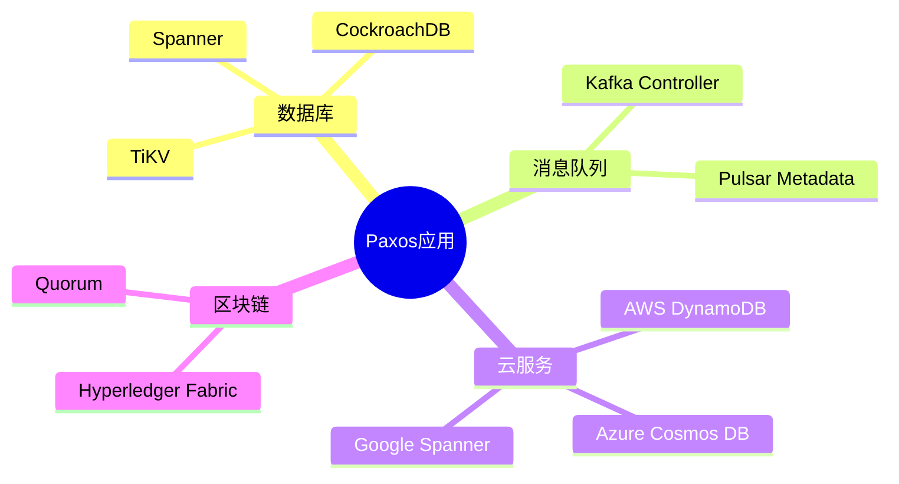

## 9. 八维表征 (Eight Dimensions)

### 9.1 维度定义

基于Wikipedia和学术文献[^2][^3][^4]，Paxos可从以下八个维度进行系统表征：

### Dim-1: 一致性模型（Consistency Model）

| 属性 | 描述 |
|------|------|
| **保证级别** | 线性一致性（Linearizability） |
| **决策语义** | 单一值原子性 |
| **可见性** | 一旦Chosen，对所有Learner可见 |

**形式化**: Paxos满足Linearizability，所有操作在全局时间线上有一个一致的顺序。

### Dim-2: 故障模型（Fault Model）

| 属性 | 描述 |
|------|------|
| **容忍类型** | 崩溃容错（Crash-Stop / Crash-Recovery）|
| **容忍数量** | $f$故障需要$2f+1$节点 |
| **拜占庭容错** | 否（需要PBFT扩展）|

**边界条件**:

- 少于多数派故障时，安全性始终保证
- 多数派故障时，活性丧失但安全性保持

### Dim-3: 通信模型（Communication Model）

| 属性 | 描述 |
|------|------|
| **消息假设** | 异步 + 部分同步（用于活性）|
| **消息丢失** | 容忍（可重传）|
| **消息乱序** | 通过提案号处理 |
| **FIFO** | 不依赖 |

### Dim-4: 时间假设（Timing Assumptions）

| 属性 | 描述 |
|------|------|
| **安全性** | 无时间假设（异步安全）|
| **活性** | 需要部分同步 |
| **超时策略** | 用于故障检测和Leader选举 |

### Dim-5: 参与者角色（Participant Roles）

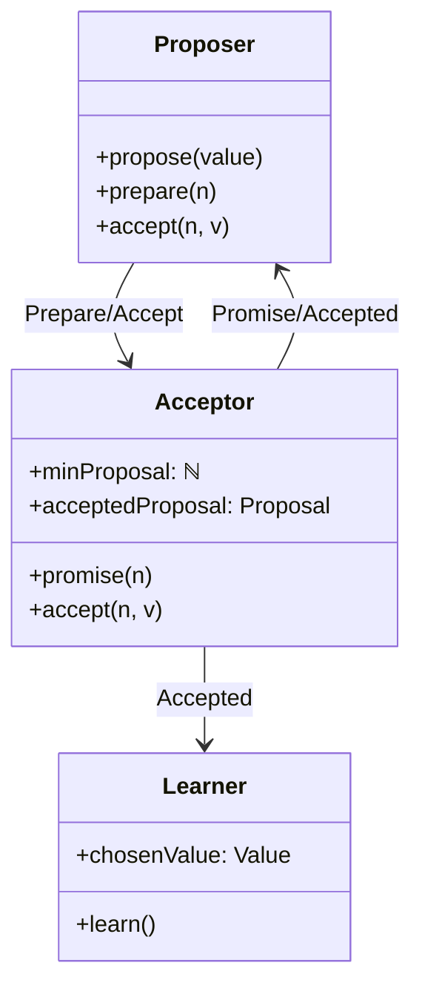

### Dim-6: 决策机制（Decision Mechanism）

| 机制 | 描述 |
|------|------|
| **投票方式** | 两阶段提交变体 |
| **Quorum类型** | 多数派 |
| **决策条件** | Quorum接受 |
| **冲突解决** | 提案号优先 |

### Dim-7: 复杂度分析（Complexity）

| 指标 | Basic Paxos | Multi-Paxos |
|------|-------------|-------------|
| **消息复杂度** | $O(N)$ per value | $O(N)$ amortized |
| **时间复杂度** | $O(1)$ rounds | $O(1)$ rounds |
| **空间复杂度** | $O(1)$ per Acceptor | $O(\log N)$ log entries |
| **领导者开销** | 无 | Leader瓶颈 |

### Dim-8: 工程考量（Engineering Considerations）

| 方面 | 挑战 | 解决方案 |
|------|------|----------|
| **成员变更** | 动态增删节点 | Vertical Paxos / Joint Consensus |
| **快照** | 日志无限增长 | 定期快照 + 日志截断 |
| **流控** | 网络拥塞 | Backpressure / 批量处理 |
| **监控** | 状态可见性 | 暴露内部状态指标 |

### 9.2 八维总结表

```
┌─────────────────────────────────────────────────────────────────┐
│                    Paxos 八维表征总览                             │
├──────────────┬──────────────────────────────────────────────────┤
│ 维度1: 一致性  │ Linearizability, 单一值原子性                      │
├──────────────┼──────────────────────────────────────────────────┤
│ 维度2: 故障   │ 崩溃容错, f故障→2f+1节点                          │
├──────────────┼──────────────────────────────────────────────────┤
│ 维度3: 通信   │ 异步消息, 容忍丢失/乱序/延迟                        │
├──────────────┼──────────────────────────────────────────────────┤
│ 维度4: 时间   │ 安全性无时间假设, 活性需部分同步                     │
├──────────────┼──────────────────────────────────────────────────┤
│ 维度5: 角色   │ Proposer + Acceptor + Learner                    │
├──────────────┼──────────────────────────────────────────────────┤
│ 维度6: 决策   │ 两阶段 + 多数派Quorum                            │
├──────────────┼──────────────────────────────────────────────────┤
│ 维度7: 复杂度  │ O(N)消息, O(1)时间, O(1)空间                     │
├──────────────┼──────────────────────────────────────────────────┤
│ 维度8: 工程   │ 快照/成员变更/流控/监控                           │
└──────────────┴──────────────────────────────────────────────────┘
```

## 10. 可视化 (Visualizations)

### 10.1 Paxos状态机图

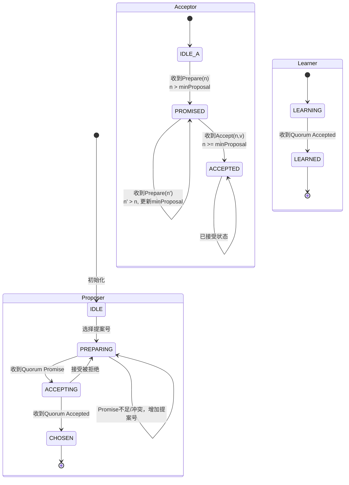

### 10.2 Quorum交集原理图

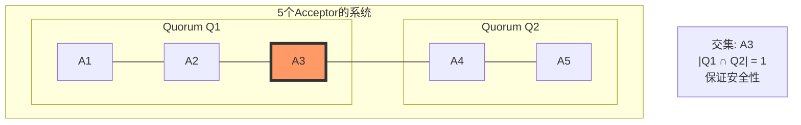

### 10.3 Paxos与其他共识算法对比矩阵

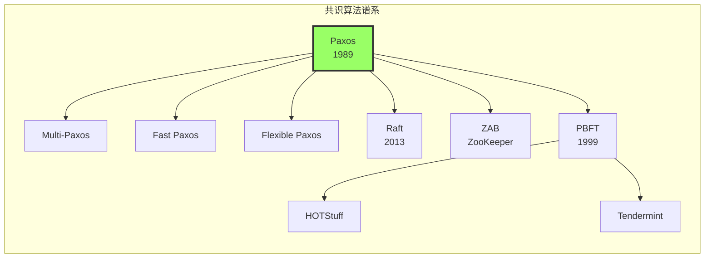

### 10.4 生产系统Paxos部署架构

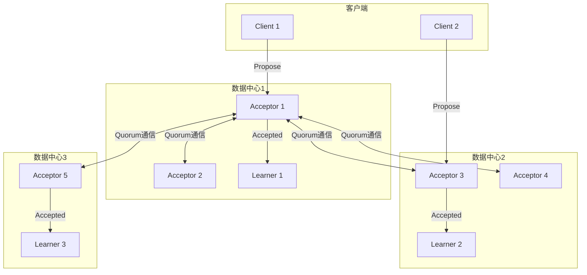

## 11. 引用参考 (References)

[^1]: L. Lamport, "The Part-Time Parliament," ACM Transactions on Computer Systems, 16(2), pp. 133-169, 1998. (Paxos原始论文，以希腊Paxos岛议会隐喻描述算法)

[^2]: L. Lamport, "Paxos Made Simple," ACM SIGACT News, 32(4), pp. 51-58, 2001. (简化版Paxos描述，更易于理解)

[^3]: Wikipedia contributors, "Paxos (computer science)," Wikipedia, The Free Encyclopedia. <https://en.wikipedia.org/wiki/Paxos_(computer_science)>

[^4]: T. D. Chandra, R. Griesemer, and J. Redstone, "Paxos Made Live - An Engineering Perspective," PODC 2007. (Google Chubby团队的工程经验)


---

*文档版本: v1.0* | *创建日期: 2026-04-10* | *形式化等级: L5* | *定理引用: Thm-S-98-01, Thm-S-98-02, Lemma-S-98-01~03*

