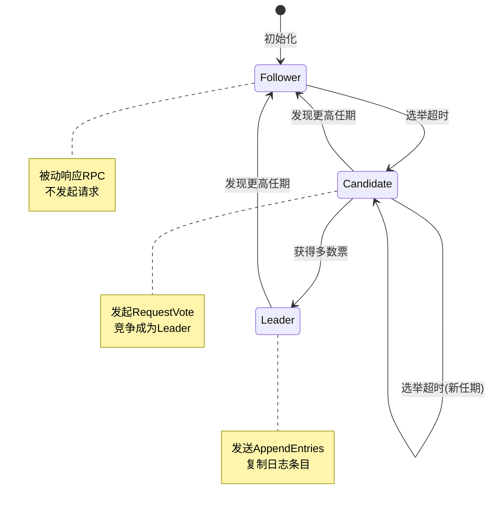
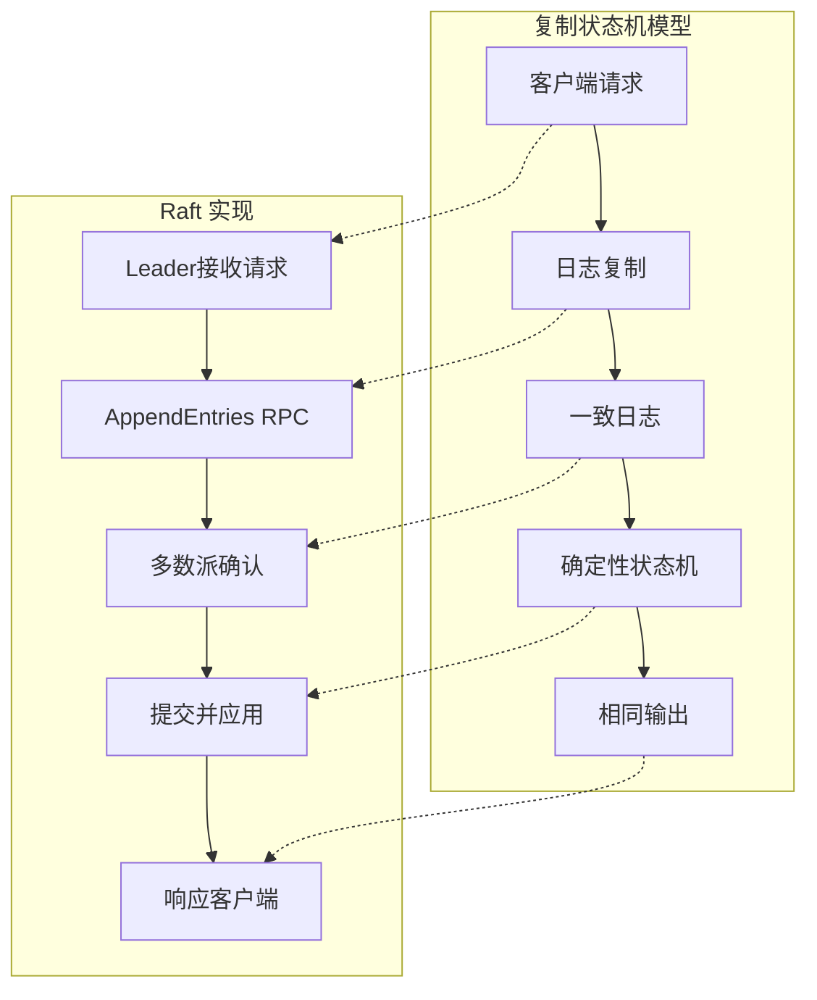
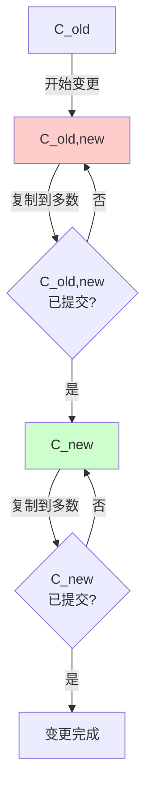
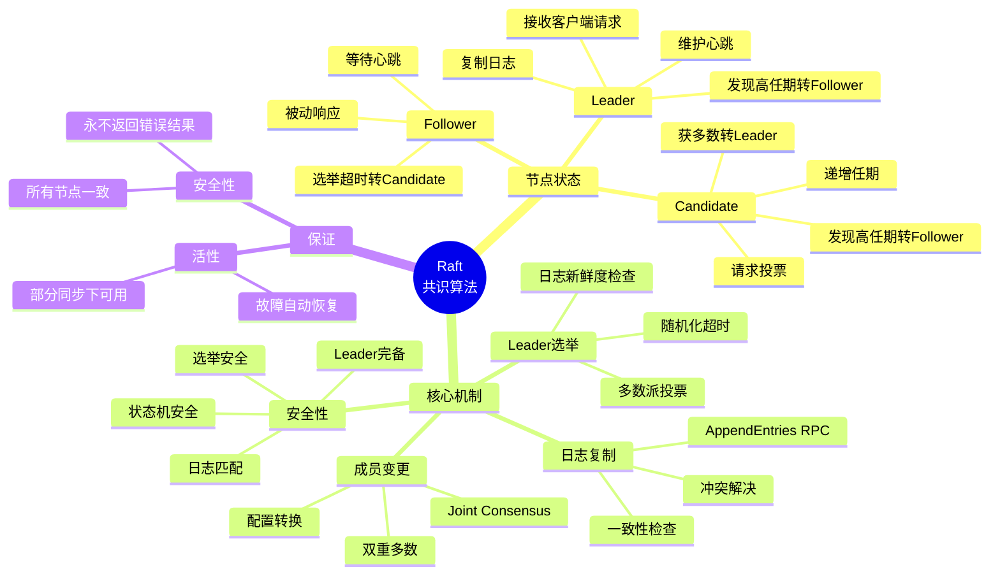
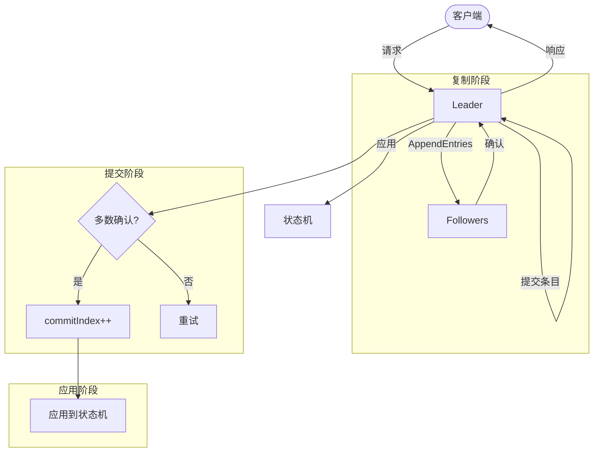
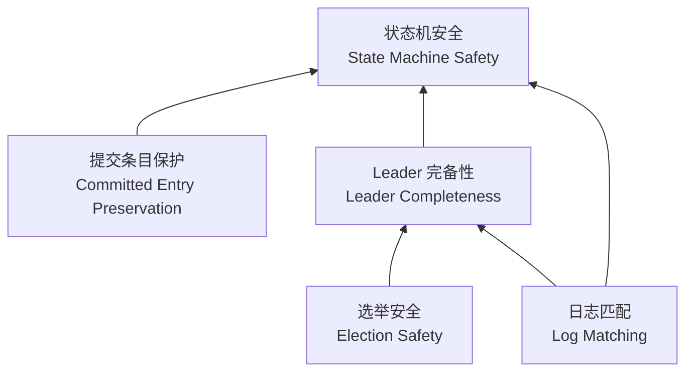
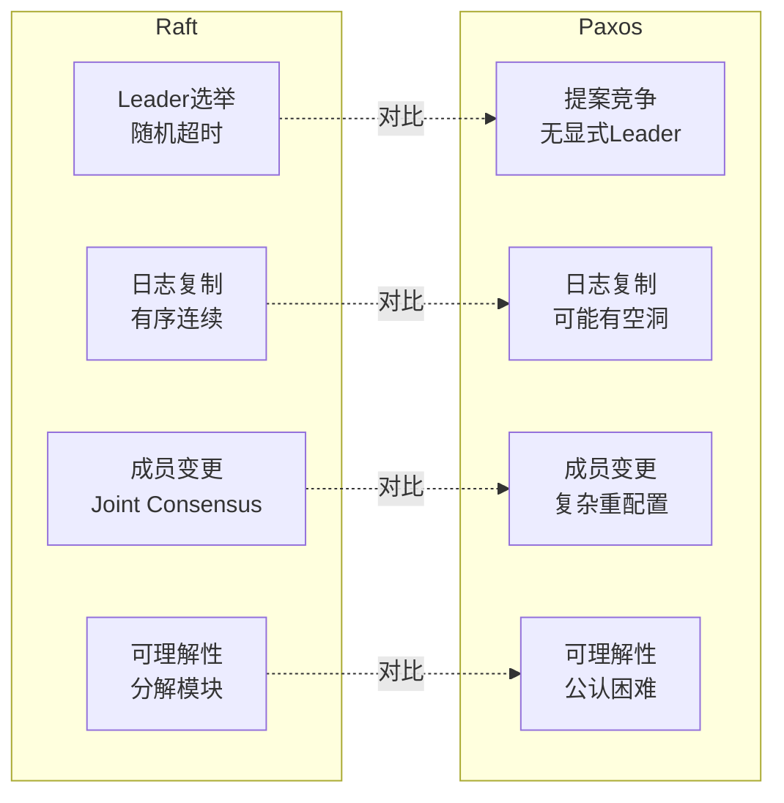
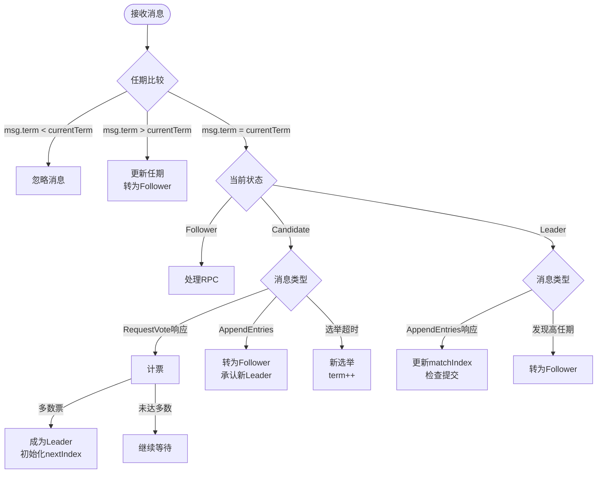

# Raft 共识算法

> 所属阶段: formal-methods/98-appendices | 前置依赖: [13-consensus.md](13-consensus.md), [15-linearizability.md](15-linearizability.md) | 形式化等级: L5

## 1. 概念定义 (Definitions)

### 1.1 Wikipedia 标准定义

**Raft**（**R**eliable, **R**eplicated, **R**edundant, **A**nd **F**ault-**T**olerant）是一种用于管理复制日志的共识算法。由 Diego Ongaro 和 John Ousterhout 于 2014 年在斯坦福大学提出，设计目标是提供比 Paxos 更易于理解的共识机制，同时保持同等的安全性和容错能力。

> **Def-Raft-01** (Raft 共识算法)
>
> Raft 是一个管理复制日志的算法，通过选举 Leader 并赋予其完整的日志管理责任，简化复制状态机的管理。算法保证所有节点按相同顺序执行相同的命令序列，从而在所有节点上产生相同的状态机状态。

**核心设计理念**：

- **强 Leader**：日志条目仅从 Leader 流向 Followers
- **Leader 选举**：使用随机化定时器选举新 Leader
- **成员变更**：通过 Joint Consensus 实现配置的安全转换

### 1.2 形式化模型

#### 1.2.1 系统模型

```
┌─────────────────────────────────────────────────────────────────┐
│                     Raft Cluster                                │
│                                                                 │
│  ┌─────────┐    ┌─────────┐    ┌─────────┐    ┌─────────┐      │
│  │ Node 1  │◄──►│ Node 2  │◄──►│ Node 3  │◄──►│ Node 4  │      │
│  │(Leader) │    │(Follower│    │(Follower│    │(Follower│      │
│  └────┬────┘    └────┬────┘    └────┬────┘    └────┬────┘      │
│       │              │              │              │            │
│       └──────────────┴──────────────┴──────────────┘            │
│                        │                                        │
│                   Log Replication                               │
│                                                                 │
│  ┌─────────────────────────────────────────────────────────┐   │
│  │                     State Machine                        │   │
│  │  ┌─────┐ ┌─────┐ ┌─────┐ ┌─────┐ ┌─────┐ ┌─────┐       │   │
│  │  │cmd=5│→│cmd=3│→│cmd=7│→│cmd=2│→│cmd=1│→│cmd=9│  ...   │   │
│  │  │idx=1│ │idx=2│ │idx=3│ │idx=4│ │idx=5│ │idx=6│       │   │
│  │  │term=1│ │term=1│ │term=2│ │term=2│ │term=3│ │term=3│      │   │
│  │  └─────┘ └─────┘ └─────┘ └─────┘ └─────┘ └─────┘       │   │
│  └─────────────────────────────────────────────────────────┘   │
└─────────────────────────────────────────────────────────────────┘
```

> **Def-Raft-02** (Raft 节点集合)
>
> 设 $N = \{n_1, n_2, \ldots, n_n\}$ 为集群中的节点集合，$|N| = n$。
>
> 定义节点状态函数 $s: N \rightarrow \{\text{Follower}, \text{Candidate}, \text{Leader}\}$

> **Def-Raft-03** (日志条目)
>
> 日志条目 $e = (\text{index}, \text{term}, \text{command})$，其中：
>
> - $\text{index} \in \mathbb{N}^+$：条目在日志中的位置
> - $\text{term} \in \mathbb{N}$：条目被创建时的任期号
> - $\text{command}$：要应用于状态机的指令

> **Def-Raft-04** (日志)
>
> 节点 $i$ 的日志 $L_i = [e_1, e_2, \ldots, e_k]$ 是条目的有序序列。
>
> 定义 $\text{lastLogIndex}(L_i) = k$，$\text{lastLogTerm}(L_i) = e_k.\text{term}$

#### 1.2.2 三种节点状态

**Follower（追随者）**：

- 被动响应来自 Leader 和 Candidate 的请求
- 处理 `AppendEntries` RPC（日志复制和心跳）
- 处理 `RequestVote` RPC（投票请求）
- 如果超时未收到 Leader 消息，转换为 Candidate

**Candidate（候选人）**：

- 主动发起 Leader 选举
- 递增当前任期，向其他节点发送 `RequestVote` RPC
- 如果获得多数票，成为 Leader
- 如果收到更高任期的消息，退回 Follower
- 如果选举超时，开始新一轮选举

**Leader（领导者）**：

- 处理所有客户端请求
- 发送 `AppendEntries` RPC 复制日志条目
- 维护每个 Follower 的 `nextIndex` 和 `matchIndex`
- 在心跳超时内发送空 `AppendEntries` 作为心跳



### 1.3 任期（Term）机制

> **Def-Raft-05** (任期)
>
> 任期 $\tau \in \mathbb{N}$ 是一个单调递增的逻辑时钟，将时间划分为连续的时间段。
>
> 每个任期最多有一个 Leader，可能因分裂投票而没有 Leader。

**任期的形式化**：

```
时间 →
─────────────────────────────────────────────────────────────►

  任期1         任期2              任期3           任期4
├─────────┬─────────────┬─────────────────┬─────────────┤
│ Leader A│  Leader B   │   (无Leader)    │  Leader C   │
│         │             │   (分裂投票)    │             │
└─────────┴─────────────┴─────────────────┴─────────────┘
          ▲
          └── 选举触发
```

> **Def-Raft-06** (任期号比较规则)
>
> 对于两个任期 $\tau_1$ 和 $\tau_2$：
>
> - 如果 $\tau_1 < \tau_2$，则 $\tau_1$ 比 $\tau_2$ "旧"
> - 所有 RPC 都携带发送者的任期号
> - 如果接收者的任期号小于发送者的，更新自己的任期号
> - 如果 Leader 或 Candidate 发现自己的任期号过期，立即转为 Follower

### 1.4 日志匹配性质

> **Def-Raft-07** (日志匹配性质 - Log Matching Property)
>
> 如果两个日志条目具有相同的索引和任期，则：
>
> 1. 它们存储相同的命令
> 2. 在该索引之前的所有日志条目完全相同
>
> 形式化表达：
> $$\forall i, j: (L_i[k].\text{index} = L_j[k].\text{index} \land L_i[k].\text{term} = L_j[k].\text{term}) \implies L_i[1..k] = L_j[1..k]$$

**日志一致性检查**：

- `AppendEntries` RPC 包含前一个条目的索引和任期 `(prevLogIndex, prevLogTerm)`
- Follower 只有在包含匹配条目时才接受新条目
- 不匹配时，Follower 拒绝并请求 Leader 递减 `nextIndex`

```
Leader日志: [1,1][2,1][3,2][4,2][5,3][6,3][7,3]
             │   │   │   │   │   │   │
             ▼   ▼   ▼   ▼   ▼   ▼   ▼
Follower A: [1,1][2,1][3,2][4,2]           ✓ 匹配
Follower B: [1,1][2,1][3,3]               ✗ 不匹配 (term冲突)
Follower C: [1,1][2,1][3,2][4,2][5,3]      ✓ 匹配 (较短)
```

### 1.5 状态机安全

> **Def-Raft-08** (提交条目)
>
> 条目 $e$ 被**提交**（committed）当且仅当：
>
> 1. $e$ 已被存储在 Leader 的日志中
> 2. Leader 已将 $e$ 复制到多数节点（包括自己）
>
> 一旦提交，条目保证被所有未来 Leader 包含。

> **Def-Raft-09** (状态机安全)
>
> 如果任何节点已将给定索引的日志条目应用于其状态机，则：
>
> - 没有其他节点会在相同索引应用不同的命令
>
> 形式化：
> $$\text{applied}_i[k] = c \implies \forall j: \neg\text{applied}_j[k] = c' \text{ where } c \neq c'$$

## 2. 属性推导 (Properties)

### 2.1 选举安全性质

> **Lemma-Raft-01** (选举安全性)
>
> 给定任期 $\tau$，至多有一个 Leader 被选举。
>
> $$\forall \tau: |\{n \in N : \text{state}(n) = \text{Leader} \land \text{currentTerm}(n) = \tau\}| \leq 1$$

**推导**：基于多数派投票的性质。Candidate 必须获得严格多数节点的投票才能成为 Leader。由于任意两个多数集必有交集，若两个 Candidate 同时获得多数票，至少有一个节点同时投票给两者，这与每个节点每任期只能投一票的规则矛盾。

### 2.2 Leader 完备性

> **Lemma-Raft-02** (Leader 完备性)
>
> 如果条目 $e$ 在任期 $\tau$ 被提交，则所有任期 $> \tau$ 的 Leader 都包含 $e$。
>
> $$\text{committed}(e, \tau) \implies \forall \tau' > \tau: \forall \text{Leader } l \text{ of } \tau': e \in L_l$$

**推导**：基于提交的定义（多数派复制）和 Leader 选举的限制（Candidate 的日志必须至少与投票者一样新）。

### 2.3 日志匹配性质的保持

> **Lemma-Raft-03** (日志匹配保持)
>
> 若 Leader 完备性成立，则日志匹配性质保持。

**推导**：Leader 在发送 `AppendEntries` 时，通过一致性检查确保 Follower 在冲突点截断日志。由于 Leader 的日志是"权威的"（包含所有已提交条目），Follower 复制 Leader 的日志后，两者在该点之前必然一致。

### 2.4 提交前缀性质

> **Lemma-Raft-04** (提交前缀)
>
> 如果索引 $k$ 的条目已提交，则所有索引 $< k$ 的条目也已提交。

**推导**：条目按顺序复制，Leader 只提交当前任期内的条目，且提交需要匹配之前所有已提交条目。

### 2.5 状态机安全保证

> **Lemma-Raft-05** (状态机安全推论)
>
> Leader 完备性 + 日志匹配性质 $\implies$ 状态机安全

**推导**：若节点 $i$ 在索引 $k$ 应用了命令 $c$，则 $L_i[k] = c$ 已提交。由 Leader 完备性，所有后续 Leader 包含该条目。由日志匹配性质，所有节点在索引 $k$ 将有相同条目，故不会应用不同命令。

## 3. 关系建立 (Relations)

### 3.1 Raft 与复制状态机的关系



**关系**：Raft 是复制状态机模型的具体实现，提供强一致性保证。

### 3.2 Raft 与 Paxos 的关系

| 特性 | Raft | Multi-Paxos |
|------|------|-------------|
| Leader 选举 | 显式、基于随机超时 | 隐式、竞争提案 |
| 日志结构 | 连续、有序 | 可能有空洞 |
| 活性保证 | 强 Leader 保证进展 | 可能出现活锁 |
| 成员变更 | Joint Consensus | 更复杂的重配置 |
| 可理解性 | 设计目标之一 | 公认难以理解 |

### 3.3 Raft 与 CAP 定理的关系

Raft 是一个 CP 系统：

- **一致性 (C)**：所有节点看到相同的日志顺序
- **分区容错 (P)**：在少数派分区中可用性下降
- **牺牲可用性 (A)**：当无法形成多数派时，系统不可用

```
         CP系统
           │
     ┌─────┴─────┐
     │   Raft    │
     │  Paxos    │
     │ ZAB/ZooKeeper│
     └─────┬─────┘
           │
    ┌──────┴──────┐
    │             │
  一致性         分区容错
    │             │
 强保证       网络容错
```

### 3.4 与 Linearizability 的关系

> **Prop-Raft-01** (Raft 提供 Linearizability)
>
> 正确实现的 Raft 提供线性一致性（Linearizability）。

**论证**：

1. 所有写操作通过 Leader 序列化
2. Leader 为每个操作分配全局顺序（日志索引）
3. 读操作若在 Leader 执行并验证自己仍是 Leader，可保证线性一致性
4. 这就是所谓的 "quorum read" 或 "read index" 机制

### 3.5 成员变更（Joint Consensus）

> **Def-Raft-10** (配置变更)
>
> 配置 $C$ 是集群中节点集合。从 $C_{\text{old}}$ 转换到 $C_{\text{new}}$ 需要安全过渡。

**问题**：直接切换配置可能导致两个独立多数派（$C_{\text{old}}$ 和 $C_{\text{new}}$ 各选一个 Leader）。

**解决方案 - Joint Consensus**：

1. Leader 收到配置变更请求
2. 创建 $C_{\text{old,new}}$（联合配置）：需要 $C_{\text{old}}$ 和 $C_{\text{new}}$ 的双重多数派
3. 复制 $C_{\text{old,new}}$ 到所有节点
4. 一旦 $C_{\text{old,new}}$ 提交，创建 $C_{\text{new}}$
5. 复制 $C_{\text{new}}$，提交后完成转换



**安全性**：在 $C_{\text{old,new}}$ 阶段，需要两个配置的多数派，保证不会有两个 Leader。

## 4. 论证过程 (Argumentation)

### 4.1 为什么需要 Leader

**Paxos 的问题**：

- 基础 Paxos 需要两阶段（Prepare/Promise, Accept/Accepted）
- 多提案者竞争可能导致活锁
- 无内置 Leader 选举机制

**Raft 的解决方案**：

- 显式 Leader 简化客户端交互
- Leader 全权负责日志管理
- Leader 失效时通过选举选择新 Leader

### 4.2 随机化超时的作用

**问题**：多个 Candidate 同时发起选举，可能导致永久分裂投票。

**解决方案**：

- 每个节点的选举超时在 $[T, 2T]$ 之间随机选择
- 概率上，只有一个节点首先超时并成为 Candidate
- 该节点在其他人超时前完成选举

**概率分析**：

- 设选举超时范围为 $[150ms, 300ms]$，网络延迟 $< 10ms$
- 第一个 Candidate 有充足时间完成选举
- 分裂投票概率极低

### 4.3 日志不一致的来源

**场景分析**：

```
场景1: Leader崩溃导致日志不一致
─────────────────────────────────
初始: 所有节点: [1,1][2,1][3,1]

Leader A 崩溃前只复制到部分节点:
  Node 1 (A): [1,1][2,1][3,1][4,2]
  Node 2:     [1,1][2,1][3,1][4,2]
  Node 3:     [1,1][2,1][3,1]
  Node 4:     [1,1][2,1][3,1][4,2][5,2]
  Node 5:     [1,1][2,1][3,1]

新Leader B (Node 3) 选举成功，开始同步:
  - Node 4 需要截断 [4,2][5,2]
  - Node 1,2 已经是正确的
  - 所有节点最终与 Leader B 一致
```

### 4.4 网络分区处理

```
分区前 (5节点):
┌─────────────────────────────────────┐
│  N1   N2   N3   N4   N5             │
│  (L)                              │
└─────────────────────────────────────┘

分区后:
┌─────────────┐     ┌─────────────────┐
│  N1   N2    │     │  N3   N4   N5   │
│  (L)        │     │  (新Leader)     │
│  旧Leader   │     │  多数派分区     │
│  无法提交   │     │  可以继续服务   │
└─────────────┘     └─────────────────┘

恢复后: 旧Leader识别更高任期，转为Follower
```

**关键行为**：

1. 旧 Leader 在少数派分区，无法获得多数确认，无法提交新条目
2. 多数派分区选举新 Leader
3. 分区恢复后，旧 Leader 发现更高任期，自动降级

## 5. 形式证明 (Formal Proofs)

### 5.1 证明：选举安全性

> **Thm-Raft-01** (Election Safety)
>
> 每任期至多有一个 Leader 被选举。

**证明**：

**反证法**：假设任期 $\tau$ 有两个 Leader $L_1$ 和 $L_2$。

1. $L_1$ 成为 Leader 需要获得严格多数节点的投票（设为 $V_1$，$|V_1| > n/2$）
2. $L_2$ 成为 Leader 需要获得严格多数节点的投票（设为 $V_2$，$|V_2| > n/2$）
3. 由鸽巢原理：$|V_1| + |V_2| > n$，故 $V_1 \cap V_2 \neq \emptyset$
4. 设 $v \in V_1 \cap V_2$
5. 节点 $v$ 每任期只能投一票（Raft 投票规则）
6. 矛盾：$v$ 不能同时投票给 $L_1$ 和 $L_2$

**结论**：假设不成立，每任期至多一个 Leader。$\square$

### 5.2 证明：提交条目不覆盖定理

> **Thm-Raft-02** (Committed Entry Preservation)
>
> 已提交的条目不会被覆盖或删除。

**证明**：

**定义**：条目 $e$ 在任期 $\tau$ 被提交，当 $e$ 被复制到多数节点。

**引理**：Candidate 的日志至少与投票节点的日志一样新。

**证明步骤**：

1. 设条目 $e = (k, \tau_c, cmd)$ 已提交（$k$ = 索引，$\tau_c$ = 创建任期）
2. 设 $C$ 为在任期 $\tau_c$ 的 Leader，$C$ 将 $e$ 复制到多数节点 $M$
3. 考虑任意后续任期 $\tau' > \tau_c$ 的新 Leader $L$
4. $L$ 必须获得多数节点的投票，设为 $V$
5. $M$ 和 $V$ 都是多数集，故 $M \cap V \neq \emptyset$
6. 设 $v \in M \cap V$，$v$ 已投票给 $L$
7. **选举限制**：节点只投票给日志至少和自己一样新的 Candidate
8. $v$ 包含 $e$（因为 $v \in M$）
9. $L$ 的日志至少和 $v$ 一样新
10. 由于 $e$ 在索引 $k$ 处，$L$ 要么在 $k$ 处有相同条目，要么 $L$ 的日志更长
11. 如果 $L$ 在 $k$ 处有相同任期条目，由日志匹配性质，条目相同
12. 如果 $L$ 的日志更长，则必然包含所有 $v$ 的条目，包括 $e$
13. 因此 $L$ 包含 $e$

**结论**：所有后续 Leader 包含已提交条目，条目不会被覆盖。$\square$

### 5.3 证明：状态机安全性

> **Thm-Raft-03** (State Machine Safety)
>
> 如果任何节点在索引 $k$ 应用了命令 $c$ 到其状态机，则没有其他节点会在索引 $k$ 应用不同的命令 $c'$。

**证明**：

1. 设节点 $n_i$ 在索引 $k$ 应用了命令 $c$
2. 由应用规则，$n_i$ 仅在条目 $e = (k, \tau, c)$ 被提交后才应用
3. 由 **Thm-Raft-02**（提交条目不覆盖），所有后续 Leader 包含 $e$
4. 由 **Lemma-Raft-02**（Leader 完备性），所有后续 Leader 的日志在 $k$ 处有 $e$
5. 考虑任意其他节点 $n_j$：
   - 如果 $n_j$ 和 $n_i$ 在同一 Leader 任期内，两者都从同一 Leader 接收日志，索引 $k$ 处相同
   - 如果 $n_j$ 在新 Leader 任期内，新 Leader 包含 $e$（由步骤4）
   - $n_j$ 从 Leader 复制日志，通过一致性检查确保索引 $k$ 处有 $e$
6. 由日志匹配性质，所有节点在索引 $k$ 处有相同条目 $e = (k, \tau, c)$
7. 因此 $n_j$ 无法在索引 $k$ 应用不同的 $c'$

**结论**：状态机安全性成立。$\square$

### 5.4 证明：活性定理（部分同步下）

> **Thm-Raft-04** (Liveness under Partial Synchrony)
>
> 在部分同步网络模型下，Raft 最终选举出 Leader 并持续处理请求。

**证明概要**：

**部分同步假设**：

- 网络在异步阶段可能有任意延迟
- 存在未知边界，之后进入同步阶段（消息延迟有上界）

**证明步骤**：

1. **选举最终成功**：
   - 同步阶段，消息延迟 $< \delta$
   - 选举超时范围 $[T, 2T]$，$T \gg \delta$
   - 概率上，恰好一个节点首先超时
   - 该节点在超时后 $O(n \cdot \delta)$ 时间内收集多数投票
   - 成为 Leader

2. **Leader 稳定性**：
   - Leader 每 $T_{\text{heartbeat}} < T$ 发送心跳
   - Followers 不会超时
   - Leader 保持稳定

3. **请求处理**：
   - 客户端请求到达 Leader
   - Leader 在 $O(n \cdot \delta)$ 时间内复制到多数节点
   - 条目提交并应用
   - 响应客户端

4. **故障恢复**：
   - Leader 故障后，Followers 在 $[T, 2T]$ 内超时
   - 重复步骤1，选举新 Leader

**结论**：Raft 在部分同步模型下提供活性保证。$\square$

### 5.5 形式化规范（TLA+风格）

```tlaplus
(* Raft 核心算法的形式化规范 *)

CONSTANTS Nodes,             (* 节点集合 *)
          MaxTerm,           (* 最大任期 *)
          MaxLogLen          (* 最大日志长度 *)

VARIABLES currentTerm,       (* 节点当前任期 *)
          state,             (* 节点状态 *)
          log,               (* 节点日志 *)
          votedFor,          (* 当前任期投票给谁 *)
          commitIndex        (* 已提交的最高索引 *)

(* 类型不变式 *)
TypeInvariant ==
  /\ currentTerm \in [Nodes -> 0..MaxTerm]
  /\ state \in [Nodes -> {"Follower", "Candidate", "Leader"}]
  /\ log \in [Nodes -> Seq([term: 0..MaxTerm, cmd: Commands])]
  /\ votedFor \in [Nodes -> Nodes \cup {None}]
  /\ commitIndex \in [Nodes -> 0..MaxLogLen]

(* 安全性质 *)
ElectionSafety ==
  \A n1, n2 \in Nodes :
    (state[n1] = "Leader" /\ state[n2] = "Leader" /\
     currentTerm[n1] = currentTerm[n2])
    => n1 = n2

LogMatching ==
  \A n1, n2 \in Nodes, i \in 1..Len(log[n1]) :
    (i <= Len(log[n2]) /\
     log[n1][i].term = log[n2][i].term)
    => log[n1][1..i] = log[n2][1..i]

LeaderCompleteness ==
  \A n \in Nodes, i \in 1..Len(log[n]) :
    (IsCommitted(log[n][i], i))
    => \A tm \in currentTerm[n]+1..MaxTerm :
       \A leader \in {l \in Nodes : state[l] = "Leader" /\
                                     currentTerm[l] = tm} :
         i <= Len(log[leader]) /\ log[leader][i] = log[n][i]

StateMachineSafety ==
  \A n1, n2 \in Nodes, i \in 1..Min(commitIndex[n1], commitIndex[n2]) :
    log[n1][i].cmd = log[n2][i].cmd
```

## 6. 实例验证 (Examples)

### 6.1 基本日志复制流程

```
客户端请求: SET x = 5
─────────────────────

Step 1: Leader 接收请求
┌─────────┐
│ Leader  │  创建条目: (index=1, term=1, cmd=SET x=5)
└────┬────┘
     │
     ▼
Step 2: 复制到 Followers
┌─────────┐     ┌─────────┐     ┌─────────┐
│Follower1│     │Follower2│     │Follower3│
└────┬────┘     └────┬────┘     └────┬────┘
     │               │               │
     ◄───────────────┴───────────────┘
     │    AppendEntries RPC
     │    (prevLogIndex=0, prevLogTerm=0, entries=[(1,1,SET x=5)])
     ▼
Step 3: Followers 响应成功
┌─────────┐     ┌─────────┐     ┌─────────┐
│Follower1│     │Follower2│     │Follower3│
└────┬────┘     └────┬────┘     └────┬────┘
     │               │               │
     └───────────────┼───────────────►
                     │    成功响应
                     ▼
Step 4: Leader 提交 (多数确认)
┌─────────┐
│ Leader  │  commitIndex = 1
└────┬────┘
     │
     ▼
Step 5: 应用到状态机
所有节点: state.x = 5

Step 6: 响应客户端
┌─────────┐
│ Leader  │  → 客户端: 成功
└─────────┘
```

### 6.2 Leader 选举示例

```
场景: 5节点集群，Leader 崩溃
──────────────────────────────

时间线:

T0: 正常运行
    ┌─────────────────────────────────────┐
    │  N1(L)  N2    N3    N4    N5       │
    │   │     │     │     │     │        │
    └───┴─────┴─────┴─────┴─────┘        │
          心跳消息 (每100ms)               │

T1: N1 崩溃
    ┌─────────────────────────────────────┐
    │  X    N2    N3    N4    N5          │
    │       │     │     │     │           │
    │       └──► 等待心跳 ◄───┘           │
    │                                     │
    └─────────────────────────────────────┘

T2: 选举超时 (随机化)
    N3 首先超时 (320ms)
    ┌─────────────────────────────────────┐
    │  X    N2    N3(C)   N4    N5        │
    │       ◄─────RequestVote───────────► │
    │            term=2, lastLog=(3,1)    │
    └─────────────────────────────────────┘

T3: 投票响应
    N2, N4, N5 都投票给 N3 (日志同样新或更旧)

    N3 计票: 1(自己) + 3 = 4 > 5/2 = 2.5 ✓ 多数

T4: N3 成为 Leader
    ┌─────────────────────────────────────┐
    │  X    N2    N3(L)   N4    N5        │
    │             │                       │
    │       发送心跳 (确立权威)            │
    └─────────────────────────────────────┘

T5: 系统恢复服务
```

### 6.3 日志冲突解决示例

```
场景: 旧 Leader 崩溃，部分复制导致不一致
───────────────────────────────────────────

崩溃前状态:
Leader N1: [1,1][2,1][3,2][4,2]  (term 2)
N2:       [1,1][2,1][3,2][4,2]  ✓ 完整复制
N3:       [1,1][2,1][3,2]        ✗ 缺少 4
N4:       [1,1][2,1][3,2][4,2][5,2]  ✗ 有额外条目(未提交)
N5:       [1,1][2,1][3,3]        ✗ 冲突 (term 3)

新 Leader N2 选举成功 (term 3)

冲突解决过程:

对于 N3 (缺少条目):
  N2 → N3: AppendEntries(prevLog=3/2, entries=[4,2])
  N3: 检查 prevLog (3/2) ✓ 匹配
  N3: 追加 [4,2]
  N3 结果: [1,1][2,1][3,2][4,2] ✓

对于 N4 (有额外条目):
  N2 → N4: AppendEntries(prevLog=4/2, entries=[])
  N4: 检查 prevLog (4/2) ✓ 匹配
  N4: 但已有 [5,2]，这是未提交的

  下一个条目:
  N2 → N4: AppendEntries(prevLog=4/2, entries=[...后续条目...])
  N4: 截断 [5,2] 及之后，从 Leader 复制
  N4 结果: [1,1][2,1][3,2][4,2] ✓

对于 N5 (冲突):
  N2 → N5: AppendEntries(prevLog=4/2, entries=[...])
  N5: 检查 prevLog (4/2) ✗ 不匹配! (N5[4] 不存在)
  N5: 拒绝，包含冲突提示

  N2 递减 nextIndex[N5]:
  N2 → N5: AppendEntries(prevLog=3/2, entries=[4,2,...])
  N5: 检查 prevLog (3/2) ✗ 不匹配! (N5[3]=(3,3), 期望 (3,2))

  N2 继续递减:
  N2 → N5: AppendEntries(prevLog=2/1, entries=[3,2,4,2,...])
  N5: 检查 prevLog (2/1) ✓ 匹配
  N5: 截断 [3,3] 及之后，复制 Leader 日志
  N5 结果: [1,1][2,1][3,2][4,2] ✓

最终一致性达成。
```

### 6.4 成员变更示例（Joint Consensus）

```
场景: 从 3节点 扩展到 5节点
────────────────────────────

初始配置 C_old = {N1, N2, N3}
新配置   C_new = {N1, N2, N3, N4, N5}

变更过程:

Phase 1: 创建 C_old,new
┌─────────────────────────────────────────────────┐
│ Leader N1 创建配置变更条目 C_old,new            │
│ C_old,new 要求: C_old 多数派 AND C_new 多数派   │
│ C_old 多数: 2/3, C_new 多数: 3/5               │
└─────────────────────────────────────────────────┘

Phase 2: 复制 C_old,new
  N1 → All: AppendEntries(C_old,new)
  确认复制到: N1, N2, N3 (C_old 多数 ✓)
              N1, N2, N4 (C_new 多数 ✓)
  C_old,new 提交 ✓

Phase 3: 切换到 C_new
┌─────────────────────────────────────────────────┐
│ Leader N1 创建配置条目 C_new                    │
│ 仅需要 C_new 多数派 (3/5)                       │
└─────────────────────────────────────────────────┘

Phase 4: 复制 C_new
  N1 → All: AppendEntries(C_new)
  确认复制到: N1, N2, N4 (C_new 多数 ✓)
  C_new 提交 ✓

Phase 5: 变更完成
  集群现在以 C_new = {N1, N2, N3, N4, N5} 运行
  可以容忍 2 个节点故障 (之前只能容忍 1 个)

安全性保证:
  在 C_old,new 阶段，不可能同时有两个 Leader：
  - 要成为 Leader，必须获得 C_old,new 的双重多数
  - 任何两个双重多数集必然相交
```

## 7. 可视化 (Visualizations)

### 7.1 Raft 核心机制思维导图



### 7.2 请求处理流程图



### 7.3 时间线视图：Leader 选举

```mermaid
gantt
    title Leader 选举时间线 (5节点集群)
    dateFormat X
    axisFormat %s

    section 正常运行
    Leader N1 心跳    :done, a1, 0, 100

    section 故障检测
    N1 崩溃           :crit, a2, 100, 100
    Followers 等待    :active, a3, 100, 320

    section 选举过程
    N3 超时成为Candidate :a4, 320, 325
    RequestVote RPC      :a5, 325, 330
    投票响应            :a6, 330, 335
    N3 成为 Leader      :milestone, a7, 335

    section 恢复
    心跳传播            :a8, 335, 345
    系统恢复服务        :milestone, a9, 345
```

### 7.4 安全性依赖图



### 7.5 Raft vs Paxos 对比矩阵



### 7.6 状态转换决策树



## 8. 关系建立 (Relations)

### 与Kubernetes验证的关系

Raft共识算法与Kubernetes形式化验证密切相关。Kubernetes使用etcd作为其分布式键值存储，而etcd正是基于Raft算法实现强一致性。

- 详见：[Kubernetes形式化验证](../../../04-application-layer/03-cloud-native/02-kubernetes-verification.md)

Raft在Kubernetes中的应用：

- **etcd存储**: Kubernetes的所有状态数据存储在etcd中
- **控制平面一致性**: API Server通过etcd保证集群状态的一致性
- **领导者选举**: Kubernetes组件使用etcd的Raft实现进行领导者选举

### Raft与Kubernetes控制循环

```
Kubernetes控制循环与Raft的映射:
┌─────────────────────────────────────────────────────────┐
│  etcd/Raft层              │  Kubernetes控制平面         │
├───────────────────────────┼─────────────────────────────┤
│  Leader选举               │  Controller选举             │
│  日志复制                 │  期望状态传播               │
│  状态机应用               │  实际状态收敛               │
│  成员变更                 │  集群扩缩容                 │
└─────────────────────────────────────────────────────────┘
```

### 形式化验证关联

- **etcd共识层**: Kubernetes形式化验证包含etcd的Raft共识模型
- **线性一致性**: Raft提供的Linearizability保证对应Kubernetes的声明式配置一致性
- **故障恢复**: Raft的领导者切换对应Kubernetes的控制器故障转移

---

## 9. 八维表征 (Eight-Dimensional Characterization)

### 8.1 一致性模型维度

| 维度 | Raft 特性 |
|------|-----------|
| **一致性模型** | Strong Consistency（强一致性） |
| **复制协议** | Primary-Backup with Consensus（基于共识的主备复制） |
| **故障模型** | Crash-Stop（崩溃停止） |
| **拜占庭容错** | 否（需 PBFT 等扩展） |
| **读写策略** | Leader-based Writes，Quorum Reads（可选） |
| **延迟特性** | 2 RTT（Leader→Followers→Leader） |
| **吞吐量** | Leader 瓶颈，约 10K-100K ops/sec |
| **扩展性** | 典型 3-7 节点，过多节点影响性能 |

### 8.2 详细八维分析

**维度 1: 一致性等级**

```
┌─────────────────────────────────────────────────┐
│  Linearizability ◄── Raft 提供此级别            │
│       │                                         │
│  Sequential Consistency                         │
│       │                                         │
│  Causal Consistency                             │
│       │                                         │
│  Eventual Consistency                           │
└─────────────────────────────────────────────────┘
```

Raft 提供 Linearizability：所有操作表现为在调用和响应之间的某个时间点原子执行。

**维度 2: 故障容忍**

```
┌─────────────────────────────────────────────────┐
│  集群大小 │ 可容忍故障 │ 写可用性 │ 读可用性    │
├─────────────────────────────────────────────────┤
│     3     │     1     │   需2    │    需2      │
│     5     │     2     │   需3    │    需3      │
│     7     │     3     │   需4    │    需4      │
└─────────────────────────────────────────────────┘
```

Raft 容忍少数派故障（$f$），需要 $2f+1$ 个节点。

**维度 3: 活性保证**

```
┌─────────────────────────────────────────────────┐
│  部分同步假设下：                                 │
│  • Leader 选举最终会成功（概率1）                 │
│  • 已提交条目最终会被所有节点应用                 │
│  • 客户端请求最终被处理                          │
│                                                 │
│  异步网络下：                                    │
│  • 不保证活性（FLP 不可能结果）                   │
└─────────────────────────────────────────────────┘
```

**维度 4: 复杂度评估**

```
┌─────────────────────────────────────────────────┐
│  Raft 设计目标：可理解性 > 最优性能              │
│                                                 │
│  模块化设计：                                    │
│  ├─ Leader 选举                                  │
│  ├─ 日志复制                                     │
│  └─ 成员变更                                     │
│                                                 │
│  教学验证：                                      │
│  • 学生理解测试：Raft 显著优于 Paxos             │
│  • 代码实现：简洁（etcd ~5K 行相关代码）          │
└─────────────────────────────────────────────────┘
```

**维度 5: 工程实现特性**

```
┌─────────────────────────────────────────────────┐
│  优点：                                          │
│  ✓ 易于理解和实现                                │
│  ✓ 有多个生产级实现（etcd, Consul, TiKV）         │
│  ✓ 强 Leader 简化客户端交互                      │
│  ✓ 显式成员变更支持                              │
│                                                 │
│  缺点：                                          │
│  ✗ Leader 是性能瓶颈                             │
│  ✗ 跨数据中心延迟高（Leader-Follower RTT）        │
│  ✗ 读操作需要额外机制保证线性一致性                │
│  ✗ 不支持 Byzantine 故障                         │
└─────────────────────────────────────────────────┘
```

**维度 6: 适用场景**

```
┌─────────────────────────────────────────────────┐
│  适用：                                          │
│  • 配置管理服务（etcd, Consul）                   │
│  • 分布式 KV 存储（TiKV, RethinkDB）              │
│  • 协调服务（ZooKeeper 替代品）                    │
│  • 需要强一致性的元数据存储                        │
│                                                 │
│  不适用：                                        │
│  • 高吞吐量写场景（考虑 EPaxos, Multi-Paxos 优化）  │
│  • 广域网部署（考虑 Spanner, CockroachDB）        │
│  • 对抗性环境（考虑 PBFT, Tendermint）            │
└─────────────────────────────────────────────────┘
```

**维度 7: 性能特征**

```
┌─────────────────────────────────────────────────┐
│  延迟（3节点，局域网）：                          │
│  • 写操作：~2-5ms（2 RTT + 磁盘写入）             │
│  • 读操作（Leader）：~0.5-1ms                     │
│  • 读操作（Follower）：~1-2ms（需 ReadIndex）      │
│                                                 │
│  吞吐量：                                        │
│  • 单 Leader：~10K-50K ops/sec（取决于负载）       │
│  • 批量写入可提升至 ~100K+ ops/sec                │
│                                                 │
│  瓶颈：                                          │
│  • Leader CPU/网络带宽                           │
│  • 磁盘写入延迟（fsync）                          │
└─────────────────────────────────────────────────┘
```

**维度 8: 扩展与变体**

```
┌─────────────────────────────────────────────────┐
│  Raft 变体与扩展：                                │
│                                                 │
│  • Multi-Raft：水平扩展（TiKV, CockroachDB）       │
│  • Pre-vote：避免不必要的任期增加                  │
│  • Check Quorum：Leader 故障快速检测               │
│  • Lease Read：本地读优化（牺牲部分容错）          │
│  • Witness：减少复制节点数量                       │
│  • Disaggregated Raft：分离日志和状态机复制        │
└─────────────────────────────────────────────────┘
```

## 9. 与 Paxos 的详细对比

### 9.1 算法结构对比

```
Paxos (Multi-Paxos):
┌─────────────────────────────────────────────────┐
│  Phase 1: Prepare/Promise                       │
│  ├─ 提案者选择提案号 n                          │
│  ├─ 向多数接受者发送 Prepare(n)                  │
│  └─ 接受者承诺不接受小于 n 的提案                │
│                                                 │
│  Phase 2: Accept/Accepted                       │
│  ├─ 提案者收到多数 Promise                      │
│  ├─ 发送 Accept(n, value)                       │
│  └─ 接受者接受并广播 Accepted                   │
│                                                 │
│  问题：多个提案者竞争，需选 Leader 优化           │
└─────────────────────────────────────────────────┘

Raft:
┌─────────────────────────────────────────────────┐
│  模块1: Leader 选举                             │
│  ├─ 超时触发选举                                │
│  ├─ RequestVote RPC                             │
│  └─ 多数派投票选出 Leader                        │
│                                                 │
│  模块2: 日志复制                                │
│  ├─ Leader 接收客户端请求                        │
│  ├─ AppendEntries RPC 复制                       │
│  └─ 多数确认后提交                               │
│                                                 │
│  优势：结构清晰，Leader 角色明确                  │
└─────────────────────────────────────────────────┘
```

### 9.2 日志结构对比

```
Paxos 日志（可能有空洞）:
┌─────┬─────┬─────┬─────┬─────┬─────┐
│ 1,1 │ 2,1 │     │ 4,2 │     │ 6,2 │  ...
└─────┴─────┴─────┴─────┴─────┴─────┘
索引  1     2     3     4     5     6
          ▲           ▲           ▲
          └───────────┴───────────┘  空洞（未填充位置）

Raft 日志（连续无空洞）:
┌─────┬─────┬─────┬─────┬─────┬─────┐
│ 1,1 │ 2,1 │ 3,2 │ 4,2 │ 5,2 │ 6,3 │  ...
└─────┴─────┴─────┴─────┴─────┴─────┘
索引  1     2     3     4     5     6
（顺序填充，无跳跃）
```

### 9.3 对比总结表

| 方面 | Paxos | Raft |
|------|-------|------|
| **核心思想** | 多数派接受提案 | 选举 Leader 管理日志 |
| **理解难度** | 公认困难 | 设计为可理解 |
| **Leader** | 隐式/需优化 | 显式，核心角色 |
| **日志** | 可能有空洞 | 连续有序 |
| **消息复杂度** | 2 RTT 每条目 | 1 RTT（批量） |
| **成员变更** | 复杂 | Joint Consensus |
| **学习曲线** | 陡峭 | 平缓 |
| **实现数量** | 较少 | 众多生产级 |
| **性能优化** | 需要更多工作 | 开箱即用 |
| **教学采用** | 较少 | 广泛 |

## 10. 引用参考 (References)


---

> **文档元数据**
>
> - 创建日期: 2026-04-10
> - 版本: v1.0
> - 作者: AnalysisDataFlow Project
> - 审核状态: 待审核
> - 相关文档: [13-consensus.md](13-consensus.md), [15-linearizability.md](15-linearizability.md), [12-byzantine-fault-tolerance.md](12-byzantine-fault-tolerance.md)
