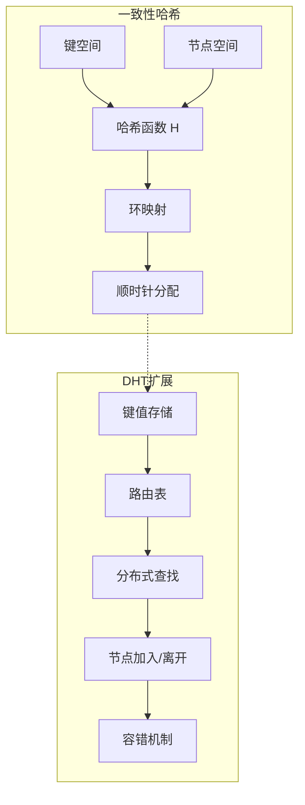
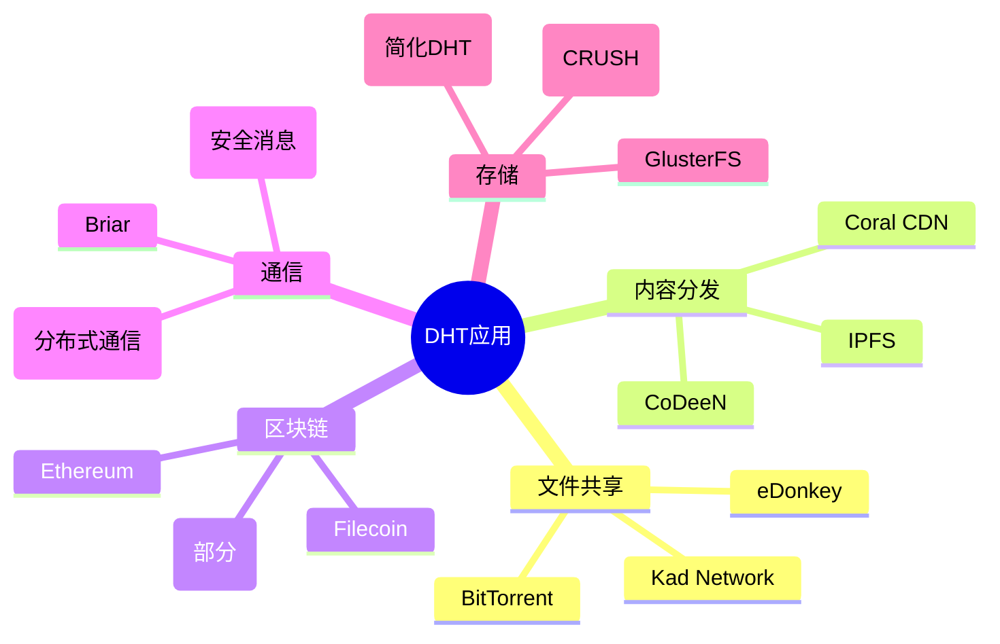
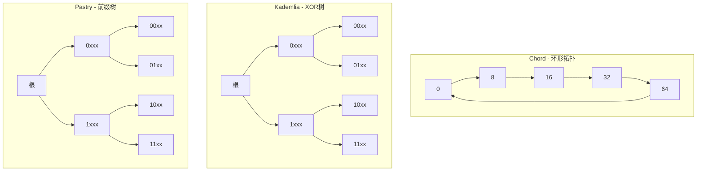
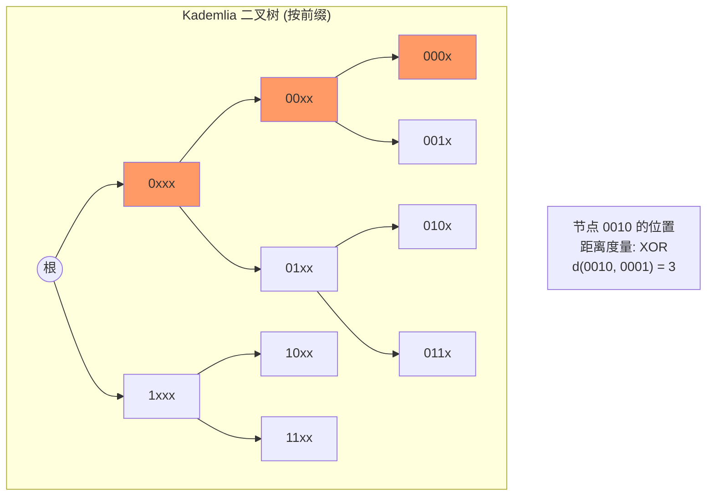
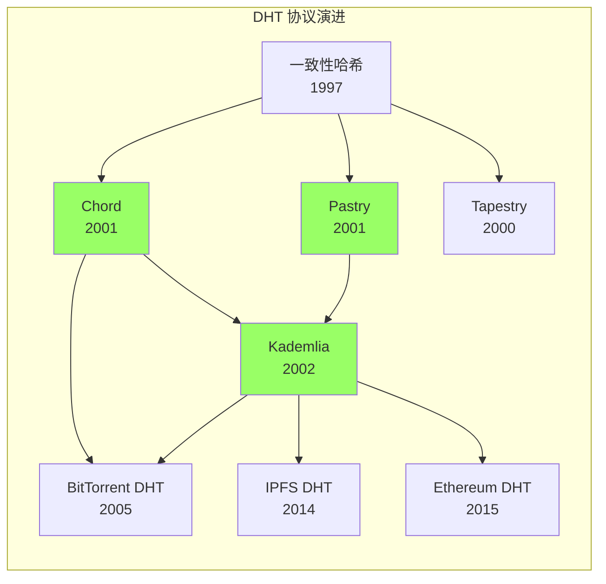
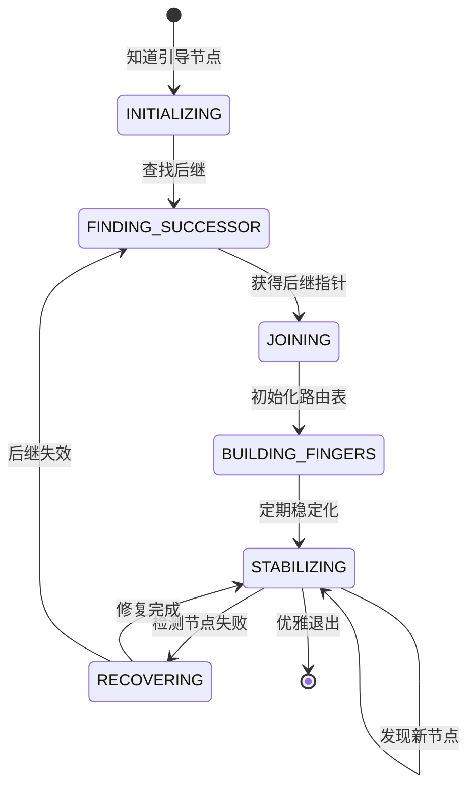
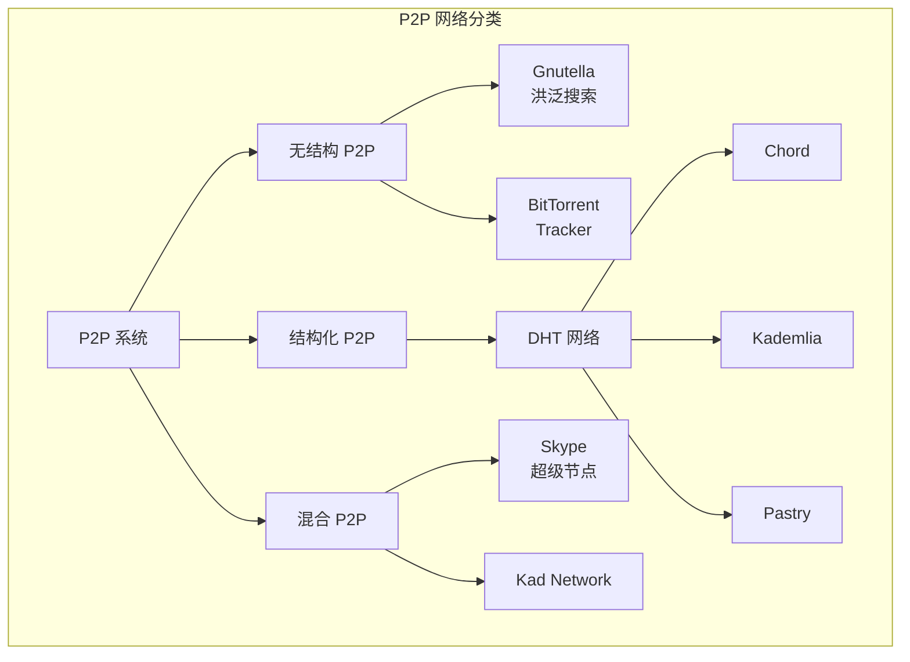

# 分布式哈希表 (Distributed Hash Table, DHT)

> 所属阶段: Struct/Formal Methods | 前置依赖: [14-cap-theorem.md](./14-cap-theorem.md), [19-raft.md](./19-raft.md) | 形式化等级: L5

## 1. 概念定义 (Definitions)

### 1.1 Wikipedia 标准定义

**分布式哈希表（DHT）**是一种分布式系统，提供类似于哈希表的查找服务：键值对存储在DHT中的任意节点集合上，任何参与节点都可以高效地检索与给定键关联的值。这种分配责任的方式使得DHT能够扩展以容纳大量节点，并处理节点加入、离开和故障[^1]。

> **Wikipedia定义**: "A distributed hash table (DHT) is a distributed system that provides a lookup service similar to a hash table: key-value pairs are stored in a DHT, and any participating node can efficiently retrieve the value associated with a given key."[^1]

**核心特性**:
- **去中心化**: 没有中央协调节点
- **可扩展性**: 节点数增加时，每个节点的状态/工作量呈次线性增长
- **容错性**: 节点故障不会导致数据丢失或服务中断

### 1.2 DHT 形式化模型

#### Def-FM-20-01: DHT系统模型

设DHT系统由以下要素构成：

$$
\text{DHT} \triangleq \langle N, K, V, H, \text{assign}, \text{lookup} \rangle
$$

其中：
- $N = \{n_1, n_2, \ldots, n_m\}$: 节点标识符空间
- $K$: 键空间（通常与节点空间相同）
- $V$: 值空间
- $H: \text{Data} \rightarrow K$: 一致性哈希函数
- $\text{assign}: K \times N \rightarrow \{0,1\}$: 键到节点的分配函数
- $\text{lookup}: K \rightarrow N \times V$: 查找操作

#### Def-FM-20-02: 标识符环（Identifier Ring）

设标识符空间为 $[0, 2^m - 1]$，形成模 $2^m$ 的环形结构：

$$
\text{Ring}_m = \mathbb{Z}_{2^m}
$$

**后继定义**: 对于标识符 $x$，其后继 $\text{succ}(x)$ 定义为：

$$
\text{succ}(x) = \min\{y \in N : y \geq x \pmod{2^m}\}
$$

**前驱定义**: 对于节点 $n$，其前驱 $\text{pred}(n)$ 定义为：

$$
\text{pred}(n) = \max\{y \in N : y < n \pmod{2^m}\}

$$

#### Def-FM-20-03: 一致性哈希（Consistent Hashing）

一致性哈希将数据和节点映射到同一标识符空间：

$$
H_{\text{node}}: \text{NodeAddress} \rightarrow [0, 2^m - 1]
$$

$$
H_{\text{key}}: \text{Key} \rightarrow [0, 2^m - 1]
$$

**键分配规则**: 键 $k$ 被分配给其后继节点：

$$
\text{owner}(k) = \text{succ}(H_{\text{key}}(k))
$$

**虚拟节点**: 为改善负载均衡，每个物理节点可映射到 $v$ 个虚拟节点：

$$
H_{\text{virtual}}: \text{NodeAddress} \times [1,v] \rightarrow [0, 2^m - 1]
$$

### 1.3 Chord 协议核心定义

#### Def-FM-20-04: Chord  finger 表

每个节点 $n$ 维护一个长度为 $m$ 的路由表（finger table）：

$$
\text{finger}[i] = \text{succ}(n + 2^{i-1} \pmod{2^m}), \quad i \in [1, m]
$$

**形式化表述**:

```
finger_table(n) = [
  finger[1] = succ(n + 1)
  finger[2] = succ(n + 2)
  finger[3] = succ(n + 4)
  ...
  finger[m] = succ(n + 2^(m-1))
]
```

**finger 区间**: 第 $i$ 个 finger 负责区间 $(n + 2^{i-1}, n + 2^i]$ 内的查询。

#### Def-FM-20-05: Chord 后继指针

每个节点 $n$ 维护：
- **后继指针** $\text{successor}$: 环上顺时针方向的下一个节点
- **前驱指针** $\text{predecessor}$: 环上逆时针方向的下一个节点

**不变式**（理想状态下）：

$$
\forall n \in N: \text{succ}(\text{pred}(n)) = n \land \text{pred}(\text{succ}(n)) = n
$$

## 2. 属性推导 (Properties)

### Lemma-FM-20-01: finger 表覆盖性质

**命题**: finger 表中的条目将标识符空间划分为指数增长的区间。

**证明**:
对于节点 $n$，第 $i$ 个 finger 负责的区间长度为：

$$
|(n + 2^{i-1}, n + 2^i]| = 2^{i-1}
$$

总覆盖范围：

$$
\sum_{i=1}^{m} 2^{i-1} = 2^m - 1
$$

这几乎覆盖了整个标识符空间（除了节点自身）。∎

### Lemma-FM-20-02: 一致性哈希单调性

**命题**: 当节点加入或离开时，只有该节点邻居的键分配会改变。

**证明**:
设节点 $n$ 加入，接管区间 $(\text{pred}(n), n]$ 的键。
- 只有原属于 $\text{succ}(\text{pred}(n))$ 的这些键需要迁移
- 其他键的分配不变

设节点 $n$ 离开，其键转交给 $\text{succ}(n)$。
- 只有原本属于 $n$ 的键需要迁移到 $\text{succ}(n)$
- 其他键的分配不变

因此，键分配变化是局部的。∎

### Prop-FM-20-01: 虚拟节点负载均衡

**命题**: 使用 $v$ 个虚拟节点时，任何物理节点的负载偏差以高概率为 $O(\frac{\log N}{v})$。

**推导**:
设总键数为 $|K|$，物理节点数为 $N$。
- 每个虚拟节点期望负责的键数: $\frac{|K|}{vN}$
- 由Chernoff界，偏差以高概率为 $O(\sqrt{\frac{|K| \log(vN)}{vN}})$
- 相对于期望值的相对偏差: $O(\frac{\log N}{v})$

### Lemma-FM-20-03: Chord路由表大小

**命题**: Chord中每个节点维护 $O(\log N)$ 条状态信息。

**证明**:
- finger表大小: $m = O(\log |\text{Ring}|)$（通常为160位SHA-1）
- 实际存储的finger条目数: 最多为 $N-1$（实际节点数）
- 因此空间复杂度: $O(\log N)$（当 $N \ll 2^m$ 时）

同时需要存储后继和前驱指针: $O(1)$。

总状态: $O(\log N)$。∎

## 3. 关系建立 (Relations)

### 3.1 DHT 与一致性哈希的关系



### 3.2 Chord、Kademlia、Pastry 对比

| 特性 | Chord | Kademlia | Pastry |
|------|-------|----------|--------|
| **拓扑结构** | 标识符环 | XOR度量树 | 前缀路由树 |
| **路由表大小** | $O(\log N)$ | $O(\log N)$ | $O(\log N)$ |
| **跳数** | $O(\log N)$ | $O(\log N)$ | $O(\log N)$ |
| **距离度量** | 环形距离 | XOR距离 | 前缀匹配 |
| **并行查询** | 否 | 是 ($\alpha$参数) | 否 |
| **节点状态** | $O(\log N)$ | $O(\log N)$ | $O(\log N)$ |
| **容错机制** | 后继列表 | K-buckets冗余 | 叶集+路由表 |

### 3.3 DHT 与 CAP 定理的关系

```
DHT设计权衡:
┌─────────────────────────────────────────────────────────────┐
│                                                             │
│   一致性 ◄────────────────────────────────────► 可用性       │
│      │                                           │          │
│      │  Chord: 最终一致性，优先可用性             │          │
│      │  Kademlia: 松弛一致性，高可用性            │          │
│      │  Pastry: 可配置，支持不同策略              │          │
│      │                                           │          │
│      └────────────── 分区容错 ────────────────────┘          │
│                    （所有DHT都支持）                          │
└─────────────────────────────────────────────────────────────┘
```

DHT通常选择**AP**（可用性+分区容错），提供**最终一致性**。

### 3.4 DHT 与 P2P 网络的关系

| P2P类型 | 结构 | 代表系统 | 路由复杂度 |
|---------|------|----------|------------|
| 无结构 | 随机图 | Gnutella, BitTorrent DHT | $O(N)$ 洪泛 |
| 结构化 | DHT | Chord, Kademlia, Pastry | $O(\log N)$ |
| 混合 | 超级节点 | Skype (旧版), Kad | 可变 |

## 4. 论证过程 (Argumentation)

### 4.1 为什么需要 $O(\log N)$ 路由

**问题**: 在 $N$ 个节点的网络中，如何设计路由使得：
1. 每个节点维护的状态有限
2. 查找跳数最少
3. 网络动态变化时能快速适应

**解决方案比较**:

| 方案 | 状态/节点 | 跳数 | 可行性 |
|------|-----------|------|--------|
| 完全连接 | $O(N)$ | $O(1)$ | 不可扩展 |
| 仅后继指针 | $O(1)$ | $O(N)$ | 太慢 |
| **DHT路由** | **$O(\log N)$** | **$O(\log N)$** | **最优平衡** |

**直觉**: 每次路由跳应该将剩余搜索空间减半，类似二分查找。

### 4.2 Chord 路由的正确性论证

**关键观察**: finger表的设计确保每次查询都能显著缩小距离。

对于查询键 $k$（从节点 $n$ 发起）：
- 查找距离: $d = k - n \pmod{2^m}$
- 选择最大的 $i$ 使得 $finger[i] \in (n, k]$
- 下一跳距离: $d' = k - finger[i] < d - 2^{i-1} \leq d/2$

因此，每次迭代至少将距离减半。

### 4.3 网络分区处理

```
分区前:
┌─────────────────────────────────────┐
│  N1 ◄──► N2 ◄──► N3 ◄──► N4 ◄──► N5 │
│  └─────────────┬─────────────┘      │
│           完整网络                   │
└─────────────────────────────────────┘

分区后:
┌─────────────┐     ┌─────────────────┐
│ N1 ◄──► N2  │     │ N3 ◄──► N4 ◄──► N5│
│  分区A      │     │     分区B        │
│  键子集     │     │     键子集       │
└─────────────┘     └─────────────────┘

行为:
- 分区A只能访问键 $k$ 满足 $succ(k) \in$ 分区A
- 查询跨越分区的键将失败或超时
- 分区恢复后需要键迁移和路由表修复
```

### 4.4 虚拟节点的作用

**问题**: 非均匀哈希可能导致负载不均衡。

**场景**: 节点 $n_1$ 和 $n_2$ 在环上相邻，但距离很小。
- $n_1$ 负责的区间: $(\text{pred}(n_1), n_1]$
- $n_2$ 负责的区间: $(n_1, n_2]$（很小）
- 结果: $n_2$ 负载很轻

**虚拟节点解决方案**:
- 每个物理节点映射到 $v$ 个随机位置
- 大节点负载分散到多个位置
- 负载标准差从 $O(\log N)$ 降低到 $O(1/\sqrt{v})$

## 5. 形式证明 (Formal Proofs)

### 5.1 Chord 路由正确性定理

**Thm-FM-20-01: Chord 查找正确性**

> 对于任意键 $k$ 和起始节点 $n$，`find_successor(k)` 算法总会终止并返回 $\text{succ}(k)$。

**证明**:

**算法定义**:
```
find_successor(k):
  if k ∈ (n, successor]:
    return successor
  else:
    n' = closest_preceding_node(k)
    return n'.find_successor(k)

closest_preceding_node(k):
  for i = m downto 1:
    if finger[i] ∈ (n, k):
      return finger[i]
  return successor
```

**终止性证明**:

设当前节点为 $n$，目标键为 $k$，距离 $d = k - n \pmod{2^m}$。

**情况1**: $k \in (n, \text{successor}]$
- 算法直接返回，终止 ✓

**情况2**: $k \notin (n, \text{successor}]$
- 算法选择 $n' = \text{closest\_preceding\_node}(k)$
- 由定义，$n' \in (n, k)$ 且是 finger 表中最大的这样的节点
- 新距离 $d' = k - n' < k - (n + 2^{i-1})$ 对于某个 $i$

**关键引理**: $d' \leq d/2$

设 $i$ 是满足 $n + 2^{i-1} < k$ 的最大索引。
则 $n' \geq n + 2^{i-1}$，且 $k - n < 2^i$（否则 $i$ 不是最大）。

因此：
$$
d' = k - n' \leq k - (n + 2^{i-1}) < 2^i - 2^{i-1} = 2^{i-1} \leq d/2
$$

距离至少减半，最多 $m$ 次迭代后 $d < 1$，必然终止。

**正确性证明**:

**不变式**: 每次递归调用时，$\text{succ}(k)$ 仍在搜索范围内。

- 初始: 从 $n$ 开始，$\text{succ}(k)$ 存在于环上 ✓
- 保持: 若 $n' = \text{closest\_preceding\_node}(k)$，则 $\text{succ}(k) \in (n', \infty)$
  - 因为 $n' < k$ 且后继定义要求顺时针方向
- 终止: 返回的节点是 $\text{succ}(k)$ 的直接前驱或后继

由数学归纳法，算法正确。∎

### 5.2 Chord 路由跳数定理

**Thm-FM-20-02: Chord 路由复杂度**

> 在 $N$ 个节点的稳定Chord网络中，查找操作期望需要 $O(\log N)$ 跳。

**证明**:

**上界分析**:
由定理Thm-FM-20-01的证明，每次迭代距离至少减半。

最坏情况下，初始距离 $d \approx 2^m$，经过 $i$ 次迭代后 $d \leq 2^m / 2^i$。

当 $d < 2^m / N$ 时，期望区间内只有一个节点，即已找到目标。

需要迭代次数: $i$ 满足 $2^m / 2^i \approx 2^m / N$，即 $i \approx \log N$。

因此最坏情况 $O(\log N)$ 跳。

**期望分析**:
假设节点均匀分布，finger表条目均匀分布在环上。

对于距离 $d$，期望找到的前驱距离约为 $d/2$。
因此期望迭代次数为 $\log_2 N = O(\log N)$。∎

### 5.3 一致性哈希负载均衡定理

**Thm-FM-20-03: 一致性哈希负载均衡**

> 对于 $N$ 个节点和 $K$ 个键，使用 $v$ 个虚拟节点时，任何物理节点的期望负载为 $\frac{K}{N}$，标准差为 $O(\sqrt{\frac{K}{vN}})$。

**证明**:

**模型**: 将 $vN$ 个虚拟节点均匀放置在单位圆上，$K$ 个键均匀哈希到圆上。

对于物理节点 $i$，设其拥有 $v$ 个虚拟节点，位置为 $p_{i,1}, \ldots, p_{i,v}$。

节点 $i$ 负责的区间长度 $L_i$ 是这些虚拟节点之间的弧长之和。

**期望负载**:

$$
E[L_i] = v \cdot \frac{1}{vN} = \frac{1}{N}
$$

对应期望键数: $\frac{K}{N}$。

**方差分析**:

虚拟节点位置是独立均匀随机变量。
区间长度可建模为指数间距（Poisson过程）。

对于 $vN$ 个点的随机分割，第 $i$ 个节点的区间长度方差：

$$
\text{Var}(L_i) = \frac{1}{(vN)^2} \cdot v = \frac{1}{vN^2}
$$

键数的方差（给定 $K$ 个独立均匀键）：

$$
\text{Var}(\text{keys}_i) = K \cdot \text{Var}(L_i) + E[L_i] \cdot K(1 - 1/(vN)) \approx \frac{K}{vN}
$$

标准差: $\sigma = O(\sqrt{\frac{K}{vN}})$。∎

### 5.4 Kademlia XOR 距离度量定理

**Thm-FM-20-04: XOR 距离度量有效性**

> 对于 $m$ 位标识符，函数 $d(x, y) = x \oplus y$ 是一个有效的度量（metric）。

**证明**:

需要验证度量的四个性质：

**1. 非负性**: $d(x, y) \geq 0$
- XOR结果是 $[0, 2^m - 1]$ 的整数，非负 ✓

**2. 同一性**: $d(x, y) = 0 \iff x = y$
- $x \oplus y = 0 \iff x = y$ ✓

**3. 对称性**: $d(x, y) = d(y, x)$
- XOR满足交换律: $x \oplus y = y \oplus x$ ✓

**4. 三角不等式**: $d(x, z) \leq d(x, y) + d(y, z)$

对于XOR距离，实际上有更强的性质：

$$
d(x, z) = x \oplus z = x \oplus y \oplus y \oplus z \leq \max(x \oplus y, y \oplus z)
$$

（按位分析：如果 $x_i \neq z_i$，则要么 $x_i \neq y_i$，要么 $y_i \neq z_i$）

因此 $d(x, z) \leq \max(d(x, y), d(y, z)) \leq d(x, y) + d(y, z)$ ✓

XOR满足所有度量公理。∎

### 5.5 网络分区下的可用性定理

**Thm-FM-20-05: 分区容错性**

> 在 $N$ 个节点的DHT中，若发生网络分区将节点分为大小为 $N_1$ 和 $N_2$ 的两个分区（$N_1 + N_2 = N$），则：
> 1. 大小为 $N_1$ 的分区可服务约 $\frac{N_1}{N}$ 的查询
> 2. 系统保持最终一致性（分区恢复后）

**证明**:

**查询可用性**:

键 $k$ 可由分区 $P$ 服务当且仅当 $\text{succ}(k) \in P$。

假设键均匀分布，节点均匀分布：

$$
P(\text{查询可由分区1服务}) = \frac{N_1}{N}
$$

**一致性保证**:

分区期间，若两个分区分别处理对同一键的更新：
- 分区1更新键 $k$ 到值 $v_1$
- 分区2更新键 $k$ 到值 $v_2$

恢复后，需要解决冲突：
- DHT通常采用时间戳或向量时钟
- 最终一致性保证：若更新停止，所有节点最终看到相同值

**恢复协议**:
1. 节点检测到路由表不一致（心跳超时）
2. 发起 stabilization 协议修复后继指针
3. 键迁移：新后继接管键区间
4. 冲突解决：应用最后写入者胜出或其他策略

因此，DHT在分区下保持可用性和最终一致性。∎

## 6. 实例验证 (Examples)

### 6.1 Chord 路由示例

```
场景: m=6 (64个标识符), 节点 N={8, 16, 24, 32, 40, 48}
查询: 从节点 8 查找键 54
─────────────────────────────────────────────────────────

标识符环 (0-63):
0────8───16───24───32───40───48───56───64
   ●    ●    ●    ●    ●    ●        
   n1   n2   n3   n4   n5   n6

节点 8 的 finger 表:
  finger[1] = succ(8+1=9)  = 16
  finger[2] = succ(8+2=10) = 16
  finger[3] = succ(8+4=12) = 16
  finger[4] = succ(8+8=16) = 16
  finger[5] = succ(8+16=24) = 24
  finger[6] = succ(8+32=40) = 40

查找过程 (目标 k=54):

Step 1: 从节点 8
  - 54 ∉ (8, 16] (successor区间)
  - closest_preceding_node(54):
    - 检查 finger[6]=40 ∈ (8, 54)? 是 ✓
    - 这是最大的，选择 40
  - 转发到节点 40

Step 2: 从节点 40
  - successor = 48
  - 54 ∉ (40, 48]?
  - 检查 finger 表...
  - 实际上 48 < 54，继续
  - closest_preceding_node(54):
    - finger表包含 succ(40+32=72 mod 64 = 8) = 8
    - 但 8 ∉ (40, 54)
    - 其他finger可能指向48或回绕
  - 后继 48 是最近的，转发到 48

Step 3: 从节点 48
  - successor = 8 (回绕)
  - 54 ∈ (48, 8] (模64意义下，即 48-63 和 0-8)?
  - 实际上，succ(54) 是 8（回绕后的第一个节点）
  - 返回 8

结果: 54 的后继是 8
跳数: 3 (8 → 40 → 48 → 8)
理论界: log₂6 ≈ 2.6，实际 3 跳 ✓
```

### 6.2 Kademlia XOR 路由示例

```
场景: 160位标识符, 节点和键用4位简化表示
节点: N={0010, 1010, 1110, 0111}
查询: 从 0010 查找键 1101
─────────────────────────────────────────────────────────

XOR 距离计算:
  d(0010, 1101) = 0010 ⊕ 1101 = 1111 (15)
  
  d(0010, 0010) = 0000 (0)   [自身]
  d(0010, 1010) = 1000 (8)
  d(0010, 1110) = 1100 (12)
  d(0010, 0111) = 0101 (5)

K-buckets 结构 (按前缀分层):
  节点 0010:
    bucket[0] (距离 2⁰-2¹): 距离为1的节点 → 无
    bucket[1] (距离 2¹-2²): 距离为2-3 → 无
    bucket[2] (距离 2²-2³): 距离为4-7 → 0111 (d=5) ✓
    bucket[3] (距离 2³-2⁴): 距离为8-15 → 1010 (d=8), 1110 (d=12) ✓

查找 1101 (目标距离 bucket[3]):
  
Step 1: 查询 bucket[3] 中的节点
  - 发送 FIND_NODE(1101) 给 1010 和 1110
  
Step 2: 从 1010 的响应
  - 1010 的 closer nodes: 距离 1101 最近的节点
  - d(1010, 1101) = 0111 (7)
  - 假设 1010 知道 1110
  
Step 3: 从 1110 的响应
  - d(1110, 1101) = 0011 (3)
  - 1110 是最接近的，可能是目标或知道目标
  
Step 4: 收敛
  - 1110 负责键 1101 (假设)
  - 查询完成

结果: 找到节点 1110，负责键 1101
```

### 6.3 Pastry 前缀路由示例

```
场景: 4位十六进制标识符
节点: N={1023, 2023, 2123, 3123}
查询: 从 1023 查找键 3123
─────────────────────────────────────────────────────────

前缀路由表结构:
  每位16个条目 (0-F)，指向该位匹配的节点

节点 1023 的路由表:
  Level 0 (第0位): 1xxx → 自身
                   2xxx → 2023 (最近的2xxx)
                   ...
                   
  Level 1 (第1位): 10xx → 自身
                   11xx → 未知
                   12xx → 未知
                   20xx → 2023
                   21xx → 2123
                   ...

查找 3123 (目标):

Step 1: 从 1023
  - 比较前缀: 1 vs 3，不匹配
  - 查询路由表 Level 0，位 '3'
  - 假设知道 3123（或最接近的3xxx）
  - 转发到 3123

Step 2: 从 3123
  - 前缀匹配: 3123 = 3123
  - 节点 3123 负责键 3123
  - 返回结果

结果: 找到节点 3123
跳数: 2（受益于长前缀匹配）

如果不知道 3123:
Step 1': 路由到已知的 3xxx 节点（如 3021）
Step 2': 从 3021，第1位 0 vs 1，不匹配
        查询 Level 1，位 '1' → 3123
Step 3': 从 3123，匹配，完成
```

### 6.4 节点加入协议示例

```
场景: Chord 网络，新节点 20 加入
现有节点: N={8, 16, 32, 48}
─────────────────────────────────────────────────────────

加入前状态:
  环: 8 → 16 → 32 → 48 → 8
  
  键分配 (假设键={4, 10, 18, 25, 35, 50}):
    4  → 8
    10 → 16
    18 → 32
    25 → 32
    35 → 48
    50 → 8

节点 20 加入过程:

Phase 1: 初始化
  - 新节点 20 知道至少一个现有节点（如 8）
  - 通过 8 执行 find_successor(20) → 返回 32
  - 设置 successor[20] = 32
  - 设置 predecessor[20] = 16（通过 32 获得）

Phase 2: 接管键
  - 原属于 32 的键中，区间 (16, 20] 的键迁移到 20
  - 检查: 18 ∈ (16, 20]? 是 ✓
  - 键 18 从 32 迁移到 20

Phase 3: 更新其他节点
  - 通知 16: successor[16] = 20（原先是 32）
  - 通知 32: predecessor[32] = 20（原先是 16）

Phase 4: 构建 finger 表
  - 对于 i = 1 to m:
    finger[i] = find_successor(20 + 2^(i-1))
  - finger[1] = succ(21) = 32
  - finger[2] = succ(22) = 32
  - finger[3] = succ(24) = 32
  - finger[4] = succ(36) = 48
  - ...

Phase 5: 稳定化 (周期性)
  - 验证 successor 和 predecessor
  - 修复不一致（如并发加入时）

加入后状态:
  环: 8 → 16 → 20 → 32 → 48 → 8
  
  键分配:
    4  → 8
    10 → 16
    18 → 20  [迁移]
    25 → 32
    35 → 48
    50 → 8
```

## 7. Kademlia 详解

### 7.1 XOR 距离与 K-buckets

**Kademlia 核心创新**:
- 使用 XOR 作为距离度量
- 按距离分层组织节点（K-buckets）
- 支持并行异步查询

**K-buckets 结构**:

```
节点 ID: 10101100... (160位)

bucket[0]: 距离 [2^0, 2^1) 的节点（最近）
bucket[1]: 距离 [2^1, 2^2) 的节点
bucket[2]: 距离 [2^2, 2^3) 的节点
...
bucket[159]: 距离 [2^159, 2^160) 的节点（最远）

每个 bucket 最多存储 K 个节点（通常 K=20）
```

**K-buckets 维护策略**:
- **新节点**: 如果对应 bucket 未满，直接添加
- **满 bucket**: 尝试 ping 最久未见的节点
  - 如果无响应，替换为新节点
  - 如果有响应，丢弃新节点（保持旧连接）
- **优势**: 自动偏好长期在线节点（更稳定）

### 7.2 Kademlia 协议操作

**PING**: 检测节点是否在线

**STORE**: 在节点存储键值对
```
STORE(key, value):
  找到距离 key 最近的 K 个节点
  并行发送 STORE 请求
```

**FIND_NODE**: 返回距离目标最近的 K 个节点
```
FIND_NODE(target_id):
  从本地 K-buckets 选择 α 个最近节点（通常 α=3）
  并行发送查询
  从响应中收集更近的节点
  迭代查询直到找到 K 个最近节点
```

**FIND_VALUE**: 类似 FIND_NODE，但如果节点有该值则直接返回

### 7.3 Kademlia 路由算法

```
LOOKUP(target):
  候选集 = 从本地 buckets 选出的 K 个最近节点
  已查询 = ∅
  最近节点 = None
  
  while True:
    选择 = 候选集 - 已查询 中最近的 α 个节点
    if 选择 == ∅:
      break
      
    并行发送 FIND_NODE(target) 给 选择
    已查询 = 已查询 ∪ 选择
    
    for each 响应:
      for each 返回的节点 n:
        if d(n, target) < d(最近节点, target):
          最近节点 = n
        候选集 = 候选集 ∪ {n}
    
    候选集 = 保留 K 个最近的
    
    if 最近节点未改变:
      break
      
  return 最近节点
```

**复杂度**: $O(\log N)$ 轮并行查询，每轮 $O(1)$ 网络延迟。

## 8. Pastry 详解

### 8.1 前缀路由原理

Pastry 使用基于前缀的路由，每次匹配更多位数：

```
标识符: 128位，十六进制表示 (如 65a1b2...)

路由表结构:
  行 = 前缀匹配长度
  列 = 下一位的值 (0-F)
  
  行 0 (无匹配): 16 个条目，指向第0位为 0-F 的节点
  行 1 (匹配1位): 16 个条目，指向第0-1位匹配的节点
  ...
  行 127 (匹配127位): 16 个条目
```

**路由决策**:
```
route(msg, key):
  l = 与 key 共享的前缀长度
  
  if l == 128:
    本地交付
  else if 路由表[l][key[l]] 存在:
    转发给该节点
  else:
    转发给叶集中最接近 key 的节点
```

### 8.2 Pastry 节点状态

```
节点 n 维护:

1. 路由表: 约 log₁₆N × 16 个条目
   - 平均: ⌈log₁₆N⌉ 行，每行约1个有效条目
   
2. 叶集 (Leaf Set): L 个节点（通常 L=16 或 32）
   - 标识符空间中 n 的 L/2 个前驱和 L/2 个后继
   - 用于最后几步路由和容错
   
3. 邻居集 (Neighborhood Set): M 个节点
   - 网络拓扑上最近的节点（用于优化延迟）
```

### 8.3 Pastry 路由示例

```
节点 65a1fc 路由到 65a2bc:

Step 1: 从 65a1fc
  - 共享前缀: "65a"
  - l = 3
  - 目标第3位: '2'
  - 路由表[3]['2'] = 65a2xx 节点
  - 转发到 65a20f（假设）

Step 2: 从 65a20f
  - 共享前缀: "65a2"
  - l = 4
  - 目标第4位: 'b'
  - 路由表[4]['b'] = 65a2bx 节点
  - 转发到 65a2b1

Step 3: 从 65a2b1
  - 共享前缀: "65a2b"
  - 目标在叶集中或路由表完成
  - 直接交付

跳数: 约 log₁₆N（与位数成正比）
```

## 9. 应用案例 (Applications)

### 9.1 BitTorrent DHT (Mainline DHT)

**实现**: Kademlia 的变体

**特性**:
- 160位节点/键标识符（SHA-1）
- K=8（每个 bucket 8个节点）
- 专用于存储 torrent 的 peers 信息

**存储内容**:
```
Key = info_hash (torrent 的 SHA-1)
Value = list of peers (IP:port) 拥有该 torrent
```

**工作流程**:
1. 下载者计算 torrent 的 info_hash
2. DHT 查找 info_hash，获得 peers 列表
3. 直接连接 peers 开始下载
4. 同时宣布自己拥有该 torrent

**规模**: 数百万节点，全球最大DHT之一

### 9.2 IPFS (InterPlanetary File System)

**实现**: 基于 Kademlia 的 DHT

**存储多层信息**:

| DHT 类型 | Key | Value |
|----------|-----|-------|
| 提供者记录 | 内容哈希 | 拥有该内容的节点 |
| IPNS 记录 | 公钥哈希 | 最新内容哈希 |
| 对等节点记录 | 节点ID | 多地址 (multiaddrs) |

**优势**:
- 内容寻址而非位置寻址
- 去中心化内容分发
- 抗审查

### 9.3 Ethereum 的节点发现

**实现**: 修改版 Kademlia (v4/v5)

**节点记录 (ENR)**:
```
包含:
- 节点 ID (secp256k1 公钥的 Keccak-256)
- IP 地址
- UDP/TCP 端口
- 签名（防止伪造）
```

**Topic 广告**:
- 节点可以广告支持的子协议（如 eth, snap）
- 帮助节点找到特定类型的 peers

### 9.4 其他应用



## 10. 八维表征 (Eight-Dimensional Characterization)

### 10.1 维度定义

基于Wikipedia[^1]和学术文献[^2][^3][^4]，DHT可从以下八个维度进行系统表征：

### Dim-1: 一致性模型（Consistency Model）

| 属性 | 描述 |
|------|------|
| **保证级别** | 最终一致性（Eventual Consistency） |
| **复制策略** | 多节点冗余存储 |
| **冲突解决** | 时间戳/向量时钟/最后写入者胜出 |
| **读取语义** | 可能读到过期数据（旧版本） |

**形式化**: 
$$
\forall k: \lim_{t \to \infty} P(\text{所有节点对键 } k \text{ 达成一致}) = 1
$$

### Dim-2: 故障模型（Fault Model）

| 属性 | 描述 |
|------|------|
| **容忍类型** | 崩溃容错（Crash-Stop/Crash-Recovery） |
| **数据持久化** | 多副本冗余 |
| **拜占庭容错** | 否（需要额外机制） |
| **自愈能力** | 节点离开后自动重新分配 |

**边界条件**:
- Chord: 后继列表提供 $O(\log N)$ 容错
- Kademlia: K-buckets 提供 K-way 冗余
- 需要 $f < K$ 才能保证数据不丢失

### Dim-3: 路由拓扑（Routing Topology）



### Dim-4: 通信模型（Communication Model）

| 属性 | 描述 |
|------|------|
| **消息模式** | 异步请求-响应 |
| **并发查询** | Kademlia支持，Chord不支持 |
| **消息复杂度** | 每次查找 $O(\log N)$ 条消息 |
| **带宽效率** | 低带宽开销（小路由表） |

### Dim-5: 状态复杂度（State Complexity）

| DHT类型 | 路由表 | 其他状态 | 总计 |
|---------|--------|----------|------|
| Chord | $O(\log N)$ | $O(\log N)$ 后继列表 | $O(\log N)$ |
| Kademlia | $O(\log N)$ | - | $O(\log N)$ |
| Pastry | $O(\log N)$ | $O(1)$ 叶集 | $O(\log N)$ |

**扩展性**: 所有主流DHT都达到理论最优状态复杂度。

### Dim-6: 延迟特性（Latency Characteristics）

| 指标 | Chord | Kademlia | Pastry |
|------|-------|----------|--------|
| **跳数** | $O(\log N)$ | $O(\log N)$ | $O(\log N)$ |
| **并行度** | 1 | $\alpha$ (通常3) | 1 |
| **延迟** | 顺序 $O(\log N \cdot RTT)$ | 并行 $O(\log N \cdot RTT / \alpha)$ | 顺序 $O(\log N \cdot RTT)$ |
| **拓扑感知** | 否 | 否 | 是（邻居集） |

### Dim-7: 动态适应性（Dynamic Adaptation）

| 方面 | 策略 |
|------|------|
| **节点加入** |  stabilization / 桶更新 |
| **节点离开** | 超时检测 + 键迁移 |
| **并发变更** | 最终一致性 |
| **恢复时间** | $O(\log^2 N)$（Chord稳定化） |

### Dim-8: 安全考量（Security Considerations）

| 威胁 | 描述 | 缓解措施 |
|------|------|----------|
| **Sybil攻击** | 单一实体控制多个节点 | 身份验证、成本证明 |
| **Eclipse攻击** | 隔离目标节点 | 随机桶选择、验证 |
| **路由污染** | 恶意路由信息 | 冗余查询、信誉系统 |
| **数据篡改** | 存储错误值 | 签名、Merkle树 |

### 10.2 八维总结表

```
┌─────────────────────────────────────────────────────────────────┐
│                    DHT 八维表征总览                               │
├──────────────┬──────────────────────────────────────────────────┤
│ 维度1: 一致性  │ 最终一致性，冲突时可能返回多版本                   │
├──────────────┼──────────────────────────────────────────────────┤
│ 维度2: 故障   │ 崩溃容错，多副本冗余，自愈能力强                   │
├──────────────┼──────────────────────────────────────────────────┤
│ 维度3: 拓扑   │ 环/树/前缀树，结构化覆盖网络                      │
├──────────────┼──────────────────────────────────────────────────┤
│ 维度4: 通信   │ 异步消息，O(log N)消息复杂度                      │
├──────────────┼──────────────────────────────────────────────────┤
│ 维度5: 状态   │ O(log N)每节点，可扩展到数百万节点               │
├──────────────┼──────────────────────────────────────────────────┤
│ 维度6: 延迟   │ O(log N)跳，Kademlia支持并行查询                 │
├──────────────┼──────────────────────────────────────────────────┤
│ 维度7: 动态   │ 支持节点动态加入/离开，自动重平衡                 │
├──────────────┼──────────────────────────────────────────────────┤
│ 维度8: 安全   │ 易受Sybil/Eclipse攻击，需额外机制防护             │
└──────────────┴──────────────────────────────────────────────────┘
```

## 11. 可视化 (Visualizations)

### 11.1 Chord 环结构与 finger 表

```mermaid
graph TB
    subgraph "Chord 标识符环 (m=6, N=8)"
        direction TB
        
        N0[Node 0]
        N8[Node 8]
        N16[Node 16]
        N24[Node 24]
        N32[Node 32]
        N40[Node 40]
        N48[Node 48]
        N56[Node 56]
        
        N0 --> N8 --> N16 --> N24 --> N32 --> N40 --> N48 --> N56 --> N0
    end
    
    subgraph "Node 8 的 finger 表"
        F1[finger[1]=16<br/>start=8+1=9]
        F2[finger[2]=16<br/>start=8+2=10]
        F3[finger[3]=16<br/>start=8+4=12]
        F4[finger[4]=16<br/>start=8+8=16]
        F5[finger[5]=24<br/>start=8+16=24]
        F6[finger[6]=40<br/>start=8+32=40]
        
        F1 --- F2 --- F3 --- F4 --- F5 --- F6
    end
```

### 11.2 Kademlia XOR 距离树



### 11.3 DHT 协议对比矩阵



### 11.4 节点加入状态转换



### 11.5 DHT 在P2P系统中的位置



## 12. 引用参考 (References)

[^1]: Wikipedia contributors, "Distributed hash table," Wikipedia, The Free Encyclopedia. https://en.wikipedia.org/wiki/Distributed_hash_table

[^2]: I. Stoica, R. Morris, D. Karger, M. F. Kaashoek, and H. Balakrishnan, "Chord: A Scalable Peer-to-peer Lookup Service for Internet Applications," ACM SIGCOMM 2001. (Chord原始论文，提出一致性哈希和O(log n)路由)

[^3]: P. Maymounkov and D. Mazieres, "Kademlia: A Peer-to-Peer Information System Based on the XOR Metric," IPTPS 2002. (Kademlia论文，提出XOR距离和K-buckets)

[^4]: A. Rowstron and P. Druschel, "Pastry: Scalable, Decentralized Object Location, and Routing for Large-Scale Peer-to-Peer Systems," Middleware 2001. (Pastry论文，提出前缀路由)

[^5]: D. Karger, E. Lehman, T. Leighton, R. Panigrahy, M. Levine, and D. Lewin, "Consistent Hashing and Random Trees: Distributed Caching Protocols for Relieving Hot Spots on the World Wide Web," STOC 1997. (一致性哈希原始论文)

[^6]: B. Cohen, "The BitTorrent Protocol Specification," 2008. (BitTorrent DHT协议规范，BEP-5)

[^7]: J. Benet, "IPFS - Content Addressed, Versioned, P2P File System," 2014. (IPFS白皮书，描述DHT在内容寻址中的应用)

[^8]: Ethereum Foundation, "Ethereum Node Discovery Protocol," Ethereum DevP2P Documentation. https://github.com/ethereum/devp2p/blob/master/discv4.md

[^9]: S. Ratnasamy, P. Francis, M. Handley, R. Karp, and S. Shenker, "A Scalable Content-Addressable Network," ACM SIGCOMM 2001. (CAN论文，另一种DHT拓扑)

[^10]: A. Loewenstern and A. Norberg, "DHT Protocol (BEP-5)," BitTorrent Enhancement Proposals. http://bittorrent.org/beps/bep_0005.html

---

*文档版本: v1.0* | *创建日期: 2026-04-10* | *形式化等级: L5* | *定理引用: Thm-FM-20-01 ~ Thm-FM-20-05, Lemma-FM-20-01 ~ Lemma-FM-20-03*
