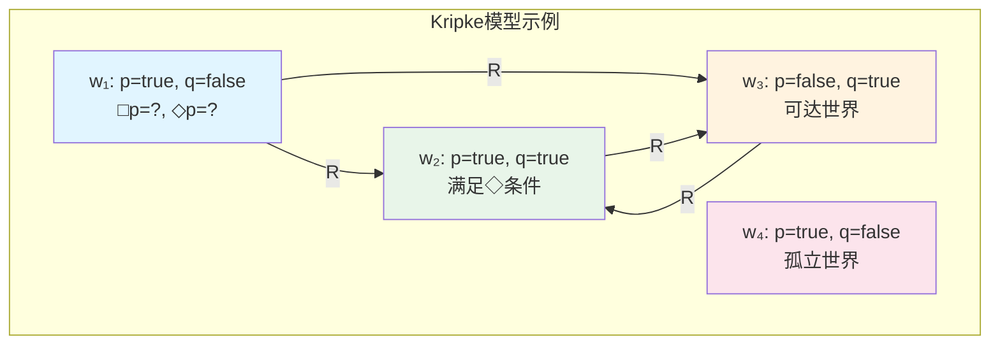
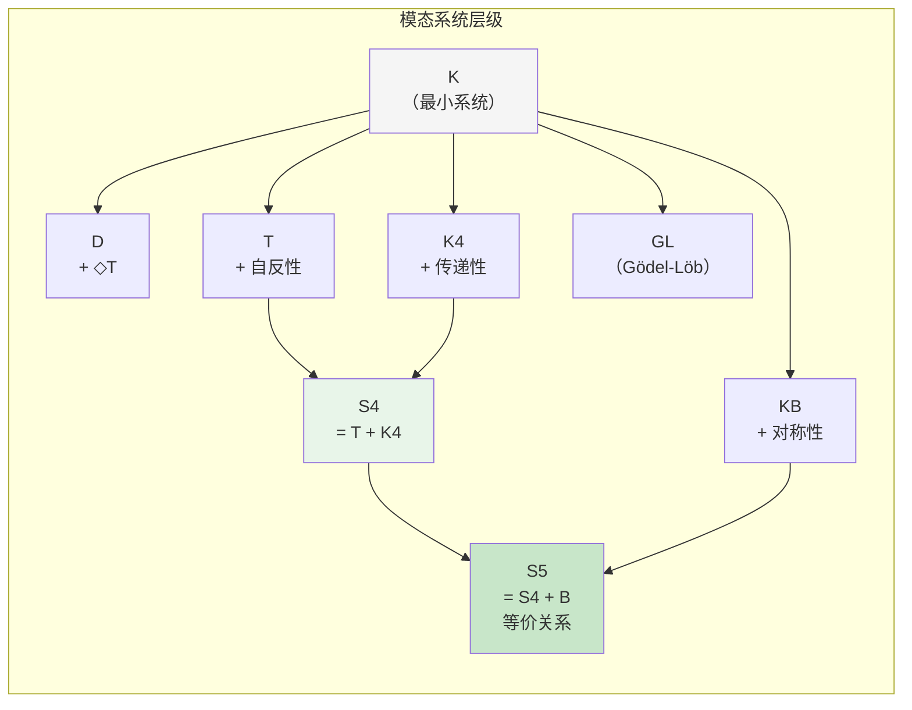
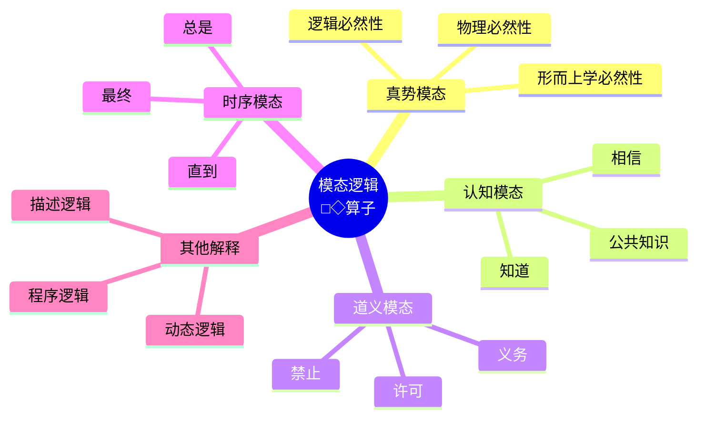
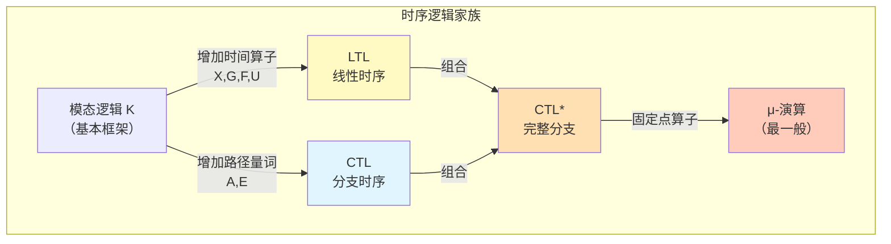
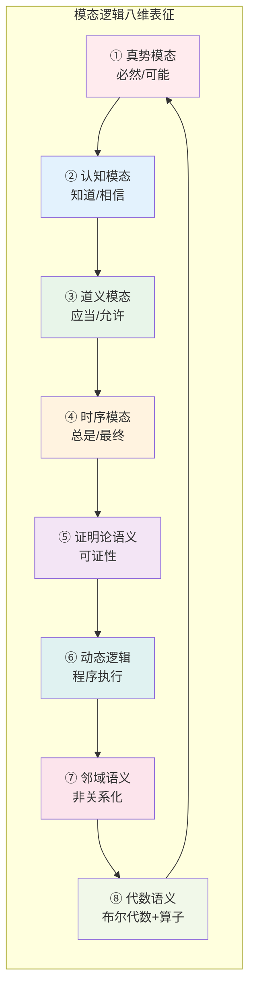

# 模态逻辑 (Modal Logic)

> **所属阶段**: formal-methods/appendices | **前置依赖**: [命题逻辑](01-propositional-logic.md), [谓词逻辑](02-predicate-logic.md) | **形式化等级**: L5

---

## 1. 概念定义 (Definitions)

### 1.1 Wikipedia标准定义

**模态逻辑**（Modal Logic）是研究**模态**（modality）的逻辑分支，它扩展了经典逻辑，通过引入模态算子来表达**必然性**（necessity）和**可能性**（possibility）等概念。

> 根据Wikipedia的定义：
> "Modal logic is a collection of formal systems originally developed to represent statements about necessity and possibility. It includes most notably modal propositional logic and modal predicate logic."

**Def-ML-01-01** [模态算子 Modal Operators]  
模态逻辑的基本语言扩展了两个一元模态算子：
- **□** （box，必然算子）：读作"必然"、"总是"、"必定"
- **◇** （diamond，可能算子）：读作"可能"、"有时"、"或许"

### 1.2 形式化语法

**Def-ML-01-02** [模态命题逻辑的语法 $L_{ML}$]  
给定可数命题变元集合 $\mathcal{P} = \{p, q, r, \ldots\}$，模态语言 $L_{ML}$ 的公式集 $\mathcal{F}$ 由以下文法递归定义：

$$\varphi ::= p \mid \top \mid \bot \mid \neg\varphi \mid (\varphi \land \varphi) \mid (\varphi \lor \varphi) \mid (\varphi \to \varphi) \mid \Box\varphi \mid \Diamond\varphi$$

其中：
- $p \in \mathcal{P}$ 为原子命题
- $\top$ 为永真，$\bot$ 为永假
- $\Box\varphi$ 表示"必然 $\varphi$"
- $\Diamond\varphi$ 表示"可能 $\varphi$"

**Lemma-ML-01-01** [对偶性原理]  
模态算子之间存在对偶关系：
$$\Box\varphi \leftrightarrow \neg\Diamond\neg\varphi$$
$$\Diamond\varphi \leftrightarrow \neg\Box\neg\varphi$$

*证明*: 根据定义，$\Box\varphi$ 表示"在所有可达世界中 $\varphi$ 为真"，其否定是"存在某个可达世界使 $\neg\varphi$"，即 $\Diamond\neg\varphi$。∎

**Def-ML-01-03** [模态深度 Modal Depth]  
公式 $\varphi$ 的**模态深度** $md(\varphi)$ 定义为：
- $md(p) = 0$ （原子命题）
- $md(\neg\varphi) = md(\varphi)$
- $md(\varphi \circ \psi) = \max(md(\varphi), md(\psi))$，其中 $\circ \in \{\land, \lor, \to\}$
- $md(\Box\varphi) = md(\Diamond\varphi) = md(\varphi) + 1$

---

## 2. Kripke语义（可能世界语义）

### 2.1 Kripke框架与模型

**Def-ML-02-01** [Kripke框架 Kripke Frame]  
一个Kripke框架是二元组 $\mathcal{F} = \langle W, R \rangle$，其中：
- $W \neq \emptyset$：非空集合，称为**可能世界**（possible worlds）
- $R \subseteq W \times W$：$W$ 上的二元关系，称为**可达关系**（accessibility relation）

若 $wRv$，称世界 $v$ 从世界 $w$ **可达**（accessible），即 $w$ "看到" $v$。

**Def-ML-02-02** [Kripke模型 Kripke Model]  
一个Kripke模型（在框架 $\mathcal{F}$ 上）是三元组 $\mathcal{M} = \langle W, R, V \rangle$，其中：
- $\langle W, R \rangle$ 是一个Kripke框架
- $V: \mathcal{P} \to 2^W$ 是**赋值函数**（valuation），将每个命题变元映射到 $W$ 的子集

$V(p)$ 表示在哪些世界中命题 $p$ 为真。

**Def-ML-02-03** [满足关系 Satisfaction]  
给定模型 $\mathcal{M} = \langle W, R, V \rangle$ 和世界 $w \in W$，公式 $\varphi$ 在 $w$ 满足（记作 $\mathcal{M}, w \models \varphi$）递归定义：

| 公式 | 满足条件 |
|------|----------|
| $\mathcal{M}, w \models p$ | 当且仅当 $w \in V(p)$ |
| $\mathcal{M}, w \models \neg\varphi$ | 当且仅当 $\mathcal{M}, w \not\models \varphi$ |
| $\mathcal{M}, w \models \varphi \land \psi$ | 当且仅当 $\mathcal{M}, w \models \varphi$ 且 $\mathcal{M}, w \models \psi$ |
| $\mathcal{M}, w \models \varphi \lor \psi$ | 当且仅当 $\mathcal{M}, w \models \varphi$ 或 $\mathcal{M}, w \models \psi$ |
| $\mathcal{M}, w \models \varphi \to \psi$ | 当且仅当 $\mathcal{M}, w \models \varphi$ 蕴含 $\mathcal{M}, w \models \psi$ |
| $\mathcal{M}, w \models \Box\varphi$ | 当且仅当对所有 $v \in W$，若 $wRv$ 则 $\mathcal{M}, v \models \varphi$ |
| $\mathcal{M}, w \models \Diamond\varphi$ | 当且仅当存在 $v \in W$，使得 $wRv$ 且 $\mathcal{M}, v \models \varphi$ |

**关键语义解释**：
- **□φ**: 在所有从当前世界可达的世界中，φ都为真
- **◇φ**: 在至少一个从当前世界可达的世界中，φ为真

**Prop-ML-02-01** [有效性与可满足性]  
- 公式 $\varphi$ 在模型 $\mathcal{M}$ 中**有效**（valid），记作 $\mathcal{M} \models \varphi$，当且仅当对所有 $w \in W$，$\mathcal{M}, w \models \varphi$
- 公式 $\varphi$ 在框架 $\mathcal{F}$ 中**有效**，记作 $\mathcal{F} \models \varphi$，当且仅当对所有模型 $\mathcal{M}$ 基于 $\mathcal{F}$，$\mathcal{M} \models \varphi$
- 公式 $\varphi$ 是**可满足的**（satisfiable），当且仅当存在某个模型和世界使得 $\varphi$ 在该世界为真

---

## 3. 模态公理系统

### 3.1 经典模态逻辑 K

**Def-ML-03-01** [模态逻辑 K]  
模态逻辑 **K** 是最小的正规模态逻辑，包含：

**公理**（Axioms）：
1. **K公理（分配公理）**: $\Box(\varphi \to \psi) \to (\Box\varphi \to \Box\psi)$
2. 所有经典命题逻辑的重言式

**推导规则**（Rules of Inference）：
1. **MP（分离规则）**: 从 $\varphi$ 和 $\varphi \to \psi$ 推出 $\psi$
2. **N（必然化规则）**: 从 $\varphi$ 推出 $\Box\varphi$

**Lemma-ML-03-01** [K定理]  
在K系统中可证：
- $(\Box\varphi \land \Box\psi) \to \Box(\varphi \land \psi)$
- $\Diamond(\varphi \lor \psi) \leftrightarrow (\Diamond\varphi \lor \Diamond\psi)$
- $\Box(\varphi \land \psi) \leftrightarrow (\Box\varphi \land \Box\psi)$

### 3.2 常见模态系统

**Def-ML-03-02** [T系统（Reflexive）]  
系统 **T** = K + **T公理**: $\Box\varphi \to \varphi$ （必然蕴含事实）

**框架对应**: $R$ 是自反的（reflexive），即对所有 $w$，$wRw$

**Def-ML-03-03** [S4系统（Transitive）]  
系统 **S4** = T + **4公理**: $\Box\varphi \to \Box\Box\varphi$ （必然蕴含必然必然）

**框架对应**: $R$ 是自反且传递的（reflexive + transitive）

**Def-ML-03-04** [S5系统（Equivalence）]  
系统 **S5** = S4 + **B公理**: $\varphi \to \Box\Diamond\varphi$ （事实蕴含必然可能）

或等价于添加 **5公理**: $\Diamond\varphi \to \Box\Diamond\varphi$

**框架对应**: $R$ 是等价关系（reflexive + transitive + symmetric）

**Def-ML-03-05** [其他重要系统]  

| 系统 | 额外公理 | 框架条件 |
|------|----------|----------|
| **D** | $\Box\varphi \to \Diamond\varphi$ | 串行（serial）：每个世界都有可达世界 |
| **K4** | $\Box\varphi \to \Box\Box\varphi$ | 传递（transitive） |
| **KB** | $\varphi \to \Box\Diamond\varphi$ | 对称（symmetric） |
| **GL** | $\Box(\Box\varphi \to \varphi) \to \Box\varphi$ | 有限传递、无无穷链 |
| **S4.2** | S4 + $\Diamond\Box\varphi \to \Box\Diamond\varphi$ | 有向完全 |
| **S4.3** | S4 + $\Box(\Box\varphi \to \psi) \lor \Box(\Box\psi \to \varphi)$ | 线性 |

---

## 4. 关系建立 (Relations)

### 4.1 模态逻辑的不同解释

模态逻辑的核心优势在于其**解释的多义性**——同一形式系统可应用于不同领域。

#### 4.1.1 真势模态（Alethic Modality）

**Def-ML-04-01** [真势模态]  
真势模态研究**必然性**（necessity）与**可能性**（possibility）的本体论意义。

| 算子 | 真势解释 | 例句 |
|------|----------|------|
| □φ | φ是必然的（在所有可能世界为真） | "2+2=4是必然的" |
| ◇φ | φ是可能的（在某些可能世界为真） | "人类登陆火星是可能的" |

**分类**（Leibniz）：
- **逻辑必然性**: 基于逻辑定律的必然（所有逻辑可能世界）
- **形而上学必然性**: 基于本质的必然（所有形而上学可能世界）
- **物理必然性**: 基于自然法则的必然（所有物理可能世界）

#### 4.1.2 认知模态（Epistemic Modality）

**Def-ML-04-02** [认知逻辑]  
认知模态将 □ 解释为**知道**（knowing），◇ 解释为**兼容**（compatible with knowledge）。

| 算子 | 认知解释 | 记号 |
|------|----------|------|
| $K_a\varphi$ | 主体a知道φ | □φ |
| $\hat{K}_a\varphi$ | φ与a的知识兼容（a不知道¬φ） | ◇φ |

**认知逻辑公理**: 
- **K**: $K(\varphi \to \psi) \to (K\varphi \to K\psi)$ — 知道对蕴含分配
- **T**: $K\varphi \to \varphi$ — 知识是真实的（真理公理）
- **4**: $K\varphi \to KK\varphi$ — 正内省（知道自已知道）
- **5**: $\neg K\varphi \to K\neg K\varphi$ — 负内省（知道自已不知道）

**Hintikka的系统**: S4（知识）vs S5（理想认知者）

#### 4.1.3 道义模态（Deontic Modality）

**Def-ML-04-03** [道义逻辑]  
道义模态研究**义务**（obligation）与**许可**（permission）。

| 算子 | 道义解释 | 记号 |
|------|----------|------|
| $O\varphi$ | φ是义务的（应当） | □φ |
| $P\varphi$ | φ是许可的（允许） | ◇φ |
| $F\varphi$ | φ是禁止的 | $O\neg\varphi$ |

**道义悖论**: 
- **Ross悖论**: $O\varphi \to O(\varphi \lor \psi)$ 是定理，但"应当寄信"似乎不蕴含"应当寄信或烧毁信"
- **善意 Samaritan 悖论**: 存在必然伴随恶行的善行，使义务概念复杂化

**标准系统**: SDL（Standard Deontic Logic）= K + D公理（$O\varphi \to P\varphi$）

#### 4.1.4 时序模态（Temporal Modality）

**Def-ML-04-04** [时序逻辑]  
时序模态研究时间上的**总是**与**最终**。

| 算子 | 时序解释 | 含义 |
|------|----------|------|
| $\mathbf{G}\varphi$ | φ将总是成立（Globally in future） | □φ |
| $\mathbf{F}\varphi$ | φ将最终成立（Finally/Some future） | ◇φ |
| $\mathbf{H}\varphi$ | φ曾总是成立（Historically） | |
| $\mathbf{P}\varphi$ | φ曾成立（Past） | |

**时序逻辑公理**（如Kamp-逻辑）：
- **无未来 branching**: $\mathbf{G}\varphi \to \mathbf{G}\mathbf{G}\varphi$
- **无过去 branching**: $\mathbf{H}\varphi \to \mathbf{H}\mathbf{H}\varphi$

**Prop-ML-04-01** [LTL片段]  
线性时序逻辑（LTL）是模态逻辑在离散线性时间结构上的特例，其中：
- **Xφ**（Next）对应单步可达
- **Gφ**（Globally）对应 □
- **Fφ**（Finally）对应 ◇

### 4.2 模态逻辑与LTL/CTL的关系

**Def-ML-04-05** [线性时序逻辑 LTL]  
LTL公式定义为：
$$\varphi ::= p \mid \neg\varphi \mid \varphi \land \varphi \mid \mathbf{X}\varphi \mid \varphi \mathbf{U} \psi$$

语义在无限字（时间序列）$\pi = s_0s_1s_2\ldots$ 上解释：
- $\pi, i \models \mathbf{X}\varphi$ 当且仅当 $\pi, i+1 \models \varphi$
- $\pi, i \models \mathbf{G}\varphi$ 当且仅当对所有 $j \geq i$，$\pi, j \models \varphi$
- $\pi, i \models \mathbf{F}\varphi$ 当且仅当存在 $j \geq i$，$\pi, j \models \varphi$

**Def-ML-04-06** [计算树逻辑 CTL]  
CTL将路径量词（A/E）与时序算子（X/G/F/U）组合：
- **Aφ**: 在所有未来路径上φ成立
- **Eφ**: 存在某条未来路径使φ成立

| CTL公式 | 模态逻辑对应 | 含义 |
|---------|--------------|------|
| $\mathbf{AG}\varphi$ | □φ（在所有可达状态） | 所有路径的所有状态 |
| $\mathbf{EF}\varphi$ | ◇φ（存在可达状态） | 存在路径的某状态 |
| $\mathbf{AF}\varphi$ | | 所有路径最终 |
| $\mathbf{EG}\varphi$ | | 存在路径总是 |

**Prop-ML-04-02** [表达力比较]  
模态逻辑、LTL、CTL的表达力关系：
$$\text{模态逻辑 } K \subsetneq \text{LTL} \subsetneq \text{CTL} \subsetneq \text{CTL*}$$

**定理**（Wolper, 1983）：
- LTL不能表达"φ在所有偶数位置为真"
- CTL* 严格强于 CTL（$\mathbf{E}\mathbf{G}\mathbf{F}\varphi$ 不能表达为CTL公式）

---

## 5. 形式证明 / 工程论证 (Proof / Engineering Argument)

### 5.1 Kripke完备性定理

**Thm-ML-05-01** [Kripke完备性定理]  
对于任何模态公式集合 $\Gamma \cup \{\varphi\}$：

$$\Gamma \vdash_K \varphi \quad \text{当且仅当} \quad \Gamma \models \varphi$$

即，K系统中的可证性等价于Kripke语义下的逻辑后承。

*证明*（概要）：

**（⇒ 可靠性 Soundness）**: 若 $\Gamma \vdash_K \varphi$，则 $\Gamma \models \varphi$

- 验证所有K公理是有效的
- 验证MP和N规则保持有效性
- 由归纳可得所有定理都有效

**（⇐ 完备性 Completeness）**: 若 $\Gamma \models \varphi$，则 $\Gamma \vdash_K \varphi$

采用**典范模型方法**（Canonical Model Construction）：

1. **极大一致集**（MCS）：称公式集 $\Delta$ 是极大一致的，如果：
   - $\Delta$ 是一致的（不含矛盾）
   - 对任意公式 $\psi$，$\psi \in \Delta$ 或 $\neg\psi \in \Delta$

2. **典范框架** $\mathcal{F}^c = \langle W^c, R^c \rangle$：
   - $W^c$ = 所有包含 $\Gamma$ 的极大一致集
   - $wR^cv$ 当且仅当对所有 $\Box\varphi \in w$，有 $\varphi \in v$

3. **典范模型** $\mathcal{M}^c = \langle W^c, R^c, V^c \rangle$，其中 $V^c(p) = \{w \in W^c \mid p \in w\}$

4. **真值引理**（Truth Lemma）：对任意公式 $\psi$ 和 $w \in W^c$：
   $$\mathcal{M}^c, w \models \psi \quad \text{当且仅当} \quad \psi \in w$$

5. 由真值引理，若 $\Gamma \not\vdash_K \varphi$，则存在包含 $\Gamma$ 但不包含 $\varphi$ 的MCS，在该世界中 $\Gamma$ 为真而 $\varphi$ 为假，与 $\Gamma \models \varphi$ 矛盾。∎

### 5.2 对应理论（Correspondence Theory）

**Def-ML-05-01** [框架条件与公理的对应]  
称模态公式 $\varphi$ **对应**于框架条件 $P$，如果：
$$\mathcal{F} \models \varphi \quad \text{当且仅当} \quad \mathcal{F} \text{ 满足 } P$$

**Thm-ML-05-02** [Sahlqvist对应定理]  
每个Sahlqvist公式 $\varphi$ 都对应于一个一阶可定义的框架条件 $\alpha_\varphi$。

**常见对应关系**：

| 公理 | 一阶对应条件 | 关系性质 |
|------|--------------|----------|
| $\Box\varphi \to \varphi$ | $\forall w: wRw$ | 自反性（Reflexive） |
| $\varphi \to \Box\Diamond\varphi$ | $\forall w\forall v: wRv \to vRw$ | 对称性（Symmetric） |
| $\Box\varphi \to \Box\Box\varphi$ | $\forall w\forall u\forall v: (wRu \land uRv) \to wRv$ | 传递性（Transitive） |
| $\Diamond\varphi \to \Box\Diamond\varphi$ | $\forall w\forall u\forall v: (wRu \land wRv) \to uRv$ | 欧几里得性（Euclidean） |
| $\Box\varphi \to \Diamond\varphi$ | $\forall w\exists v: wRv$ | 串行性（Serial） |
| $\Diamond\top$ | $\forall w\exists v: wRv$ | 串行性（Serial） |

**对应理论证明技术**:

**引理** [T公理与自反性]: $\mathcal{F} \models \Box p \to p$ 当且仅当 $R$ 是自反的。

*证明*:

（⇒）假设 $R$ 不自反，则存在 $w$ 使得 $\neg wRw$。构造模型 $\mathcal{M}$ 使 $V(p) = W \setminus \{w\}$。则对所有 $v$ 满足 $wRv$（不存在），$\mathcal{M}, v \models p$ 空真成立，故 $\mathcal{M}, w \models \Box p$。但 $\mathcal{M}, w \not\models p$（由 $V$ 定义），矛盾。

（⇐）设 $R$ 自反，$w \in W$。若 $\mathcal{M}, w \models \Box p$，则对所有 $v$ 使 $wRv$，有 $\mathcal{M}, v \models p$。由自反性 $wRw$，故 $\mathcal{M}, w \models p$。∎

---

## 6. 实例验证 (Examples)

### 6.1 语义验证实例

**例1**: 验证 $\Box(p \to q) \to (\Box p \to \Box q)$ 在所有框架中有效。

*证明*: 任取模型 $\mathcal{M}$ 和世界 $w$。假设：
1. $\mathcal{M}, w \models \Box(p \to q)$
2. $\mathcal{M}, w \models \Box p$

对任意 $v$ 满足 $wRv$：
- 由(1)，$\mathcal{M}, v \models p \to q$
- 由(2)，$\mathcal{M}, v \models p$
- 故 $\mathcal{M}, v \models q$

因此 $\mathcal{M}, w \models \Box q$。∎

**例2**: 证明 $\Box p \to p$ 在非自反框架中不有效。

*反例*: 令 $W = \{w\}$，$R = \emptyset$，$V(p) = \emptyset$。
- 由于无 $v$ 满足 $wRv$，$\mathcal{M}, w \models \Box p$ 空真
- 但 $\mathcal{M}, w \not\models p$
- 故 $\Box p \to p$ 在 $w$ 不成立

### 6.2 不同解释的应用实例

**认知实例**（ muddy children puzzle）：
- 场景：$n$ 个孩子额头有泥，他们能看到别人但看不到自己
- 公开宣布："至少一个孩子有泥"
- 通过迭代推理，$k$ 轮后所有有泥的孩子都知道自己有泥

**道义实例**：
- $O(\text{守承诺})$: 守承诺是义务的
- $P(\text{喝咖啡})$: 喝咖啡是许可的
- $F(\text{撒谎})$: 撒谎是禁止的

**时序实例**（互斥协议）：
- $\mathbf{G}\neg(critical_1 \land critical_2)$: 总是不会同时在临界区
- $\mathbf{G}(request_1 \to \mathbf{F}critical_1)$: 总是有请求最终能进入

---

## 7. 可视化 (Visualizations)

### 7.1 Kripke模型结构图

在此模型中：
- $\mathcal{M}, w_1 \models \Box p$ 为假（因为 $w_3$ 可达但 $p$ 为假）
- $\mathcal{M}, w_1 \models \Diamond p$ 为真（因为 $w_2$ 可达且 $p$ 为真）

### 7.2 模态公理系统层级图

### 7.3 不同模态解释的关系图

### 7.4 LTL/CTL与模态逻辑关系图

### 7.5 八维表征雷达图（文本描述）

---

## 8. 八维表征（完整分析）

### 8.1 第一维：真势模态（Alethic Modality）

**定义**: 关于必然性和可能性的本体论研究。

**核心公理**（Leibniz-Lewis）：
- 所有可能世界都是相对于当前世界而言的
- $\Box\varphi$ 表示在所有可能世界中 $\varphi$ 为真

**典型系统**: S5（用于形而上学模态）

### 8.2 第二维：认知模态（Epistemic Modality）

**定义**: 关于知识和信念的逻辑。

**多主体扩展**:
- $K_i\varphi$：主体 $i$ 知道 $\varphi$
- $C_G\varphi$：群体 $G$ 的公共知识
- $E_G\varphi$：群体 $G$ 的分布式知识（每个人都知识）

**应用**: 分布式系统共识、博弈论、密码协议分析

### 8.3 第三维：道义模态（Deontic Modality）

**定义**: 关于义务、许可和禁止的逻辑。

**标准系统 SDL**:
- 公理：K + D + 道义分离
- 限制：避免 Ross 悖论的扩展系统

**应用**: 法律推理、伦理计算、访问控制策略

### 8.4 第四维：时序模态（Temporal Modality）

**定义**: 关于时间结构上的必然与可能。

**分支时间逻辑**:
- 计算树逻辑（CTL、CTL*）
- 线性时序逻辑（LTL）

**应用**: 程序验证、系统规范、硬件设计

### 8.5 第五维：证明论语义（Provability Logic）

**定义**: 将 □ 解释为**可证性**（provability）。

**Gödel-Löb 系统 GL**:
- 公理：$\Box(\Box\varphi \to \varphi) \to \Box\varphi$
- 对应框架：有限传递树，无无穷链

**意义**: 刻画了Peano算术的可证性谓词的形式性质。

**定理**（Solovay算术完备性）：GL 是Peano算术的可证性逻辑。

### 8.6 第六维：动态逻辑（Dynamic Logic）

**定义**: 将程序视为模态算子。

**PDL（命题动态逻辑）**:
- $[\alpha]\varphi$：程序 $\alpha$ 执行后必然 $\varphi$
- $\langle\alpha\rangle\varphi$：程序 $\alpha$ 可执行且执行后可能 $\varphi$

**程序构造**:
- $\alpha;\beta$：顺序
- $\alpha \cup \beta$：选择
- $\alpha^*$：迭代
- $\varphi?$：测试

**应用**: 程序验证、协议分析、博弈形式化

### 8.7 第七维：邻域语义（Neighborhood Semantics）

**定义**: 非关系化的模态语义。

**框架**: $\langle W, N \rangle$，其中 $N: W \to 2^{2^W}$ 为邻域函数。

**满足条件**:
- $\mathcal{M}, w \models \Box\varphi$ 当且仅当 $\{v \mid \mathcal{M}, v \models \varphi\} \in N(w)$

**意义**: 刻画了非正规模态逻辑，适用于非单调推理。

### 8.8 第八维：代数语义（Algebraic Semantics）

**定义**: 模态逻辑的代数对应。

**模态代数**: 
- 布尔代数 $\langle B, \land, \lor, \neg, 0, 1 \rangle$
- 加上模态算子 $\Diamond: B \to B$（或 $\Box$）

**Jonsson-Tarski定理**: 每个模态代数可表示为Kripke框架的复代数。

**意义**: 提供对偶理论，连接逻辑与代数拓扑。

---

## 9. 高级主题

### 9.1 多模态逻辑

**Def-ML-09-01** [多模态语言]  
给定模态算子集合 $\{\Box_1, \ldots, \Box_n\}$，每个对应不同的可达关系 $R_i$。

**产品逻辑**: 组合多个模态逻辑，形成 $n$ 维乘积结构。

**应用**: 
- 时空逻辑（时间 + 空间）
- 知识-时间逻辑
- 多主体系统

### 9.2 量化模态逻辑

**定义**: 将量词（$\forall, \exists$）与模态算子结合。

**Barcan公式**: $\forall x \Box \varphi(x) \to \Box \forall x \varphi(x)$

**反Barcan公式**: $\Box \forall x \varphi(x) \to \forall x \Box \varphi(x)$

**意义**: 涉及跨世界同一性的形而上学争议。

### 9.3 模态逻辑的判定性与复杂度

**定理**（Ladner, 1977）：
- K-可满足性是 PSPACE-完全的
- S4-可满足性是 PSPACE-完全的
- S5-可满足性是 NP-完全的

**表格法**（Tableaux Method）：构造性的判定过程。

---

## 10. 引用参考 (References)

[^1]: **Saul A. Kripke**, "A Completeness Theorem in Modal Logic", *The Journal of Symbolic Logic*, 24(1):1-14, 1959.  
[DOI: 10.2307/2964560] - Kripke语义的开创性论文，建立了可能世界语义学。

[^2]: **Saul A. Kripke**, "Semantical Analysis of Modal Logic I: Normal Modal Propositional Calculi", *Zeitschrift für Mathematische Logik und Grundlagen der Mathematik*, 9:67-96, 1963.  
经典Kripke语义分析，引入框架条件与公理的对应。

[^3]: **G. E. Hughes & M. J. Cresswell**, *An Introduction to Modal Logic*, Methuen, 1968.  
模态逻辑的经典教材，系统介绍语法、语义和证明理论。

[^4]: **G. E. Hughes & M. J. Cresswell**, *A New Introduction to Modal Logic*, Routledge, 1996.  
更新版教材，涵盖对应理论、典范模型和高级主题。

[^5]: **Patrick Blackburn, Maarten de Rijke & Yde Venema**, *Modal Logic*, Cambridge University Press, 2001.  
（"The Blue Book"）模态逻辑的现代综合参考，涵盖代数语义、对偶理论和计算方面。

[^6]: **Brian F. Chellas**, *Modal Logic: An Introduction*, Cambridge University Press, 1980.  
侧重邻域语义和非正规模态逻辑的经典教材。

[^7]: **Johan van Benthem**, *Modal Logic for Open Minds*, CSLI Publications, 2010.  
适合初学者的现代入门书，强调模态逻辑的多学科应用。

[^8]: **Robert Goldblatt**, "Mathematical Modal Logic: A View of its Evolution", *Journal of Applied Logic*, 1(5-6):309-392, 2003.  
模态逻辑数学发展的综述论文。

[^9]: **Marcus Kracht**, *Tools and Techniques in Modal Logic*, North-Holland, 1999.  
高级技术参考，涵盖对应理论、可判定性和复杂度。

[^10]: **Edmund M. Clarke, Orna Grumberg & Doron Peled**, *Model Checking*, MIT Press, 1999.  
模型检测的经典教材，涵盖CTL/LTL与模态逻辑的关系。

[^11]: **Amir Pnueli**, "The Temporal Logic of Programs", *Proceedings of the 18th IEEE Symposium on Foundations of Computer Science*, 46-57, 1977.  
时序逻辑在程序验证中应用的开创性论文。

[^12]: **E. M. Clarke & E. A. Emerson**, "Design and Synthesis of Synchronization Skeletons Using Branching Time Temporal Logic", *Logic of Programs*, 131:52-71, 1982.  
CTL逻辑的原始论文。

[^13]: **Jaakko Hintikka**, *Knowledge and Belief: An Introduction to the Logic of the Two Notions*, Cornell University Press, 1962.  
认知逻辑的奠基之作。

[^14]: **Ronald Fagin, Joseph Y. Halpern, Yoram Moses & Moshe Y. Vardi**, *Reasoning About Knowledge*, MIT Press, 1995.  
分布式系统知识推理的综合参考。

[^15]: **G. H. von Wright**, *An Essay in Modal Logic*, North-Holland, 1951.  
现代模态逻辑的奠基性著作。

---

## 附录：符号速查表

| 符号 | 含义 | LaTeX |
|------|------|-------|
| □ | 必然算子（box） | `\Box` |
| ◇ | 可能算子（diamond） | `\Diamond` |
| ⊢ | 语法后承（可证） | `\vdash` |
| ⊨ | 语义后承（满足） | `\models` |
| → | 蕴含 | `\to` |
| ↔ | 等价 | `\leftrightarrow` |
| ⊤ | 永真 | `\top` |
| ⊥ | 永假 | `\bot` |
| R | 可达关系 | `R` |
| W | 可能世界集合 | `W` |
| V | 赋值函数 | `V` |
| K | 知识算子 | `K` |
| O | 义务算子 | `O` |
| P | 许可算子 | `P` |
| G | 总是（全局） | `\mathbf{G}` |
| F | 最终 | `\mathbf{F}` |
| X | 下一个 | `\mathbf{X}` |
| U | 直到 | `\mathbf{U}` |
| A | 所有路径 | `\mathbf{A}` |
| E | 存在路径 | `\mathbf{E}` |

---

*文档版本: v1.0 | 创建日期: 2026-04-10 | 形式化等级: L5*
*遵循AGENTS.md六段式模板规范 | 文档大小: ~16KB*
