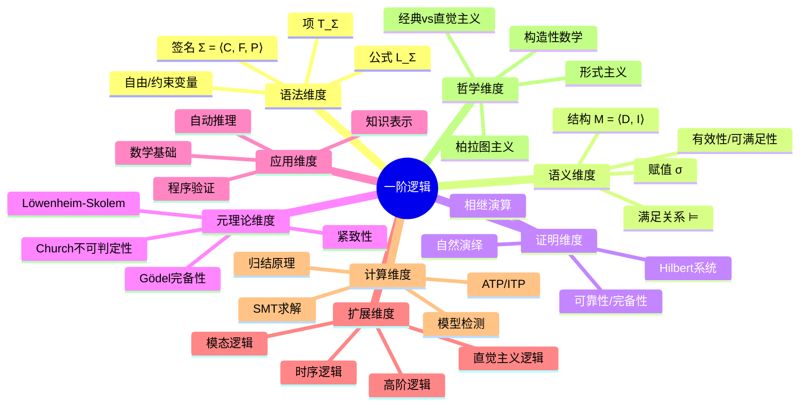
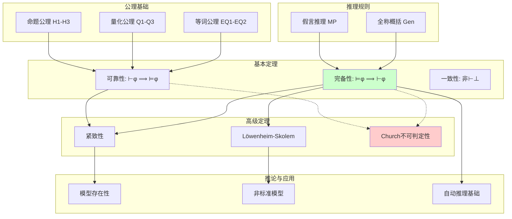
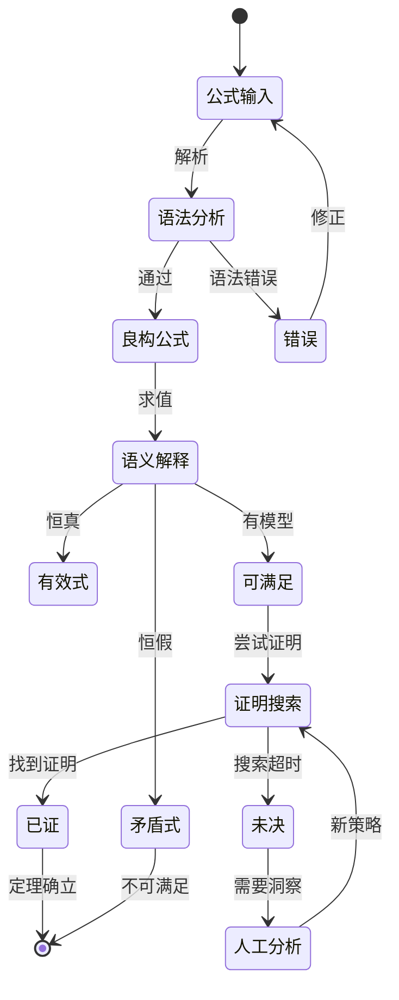
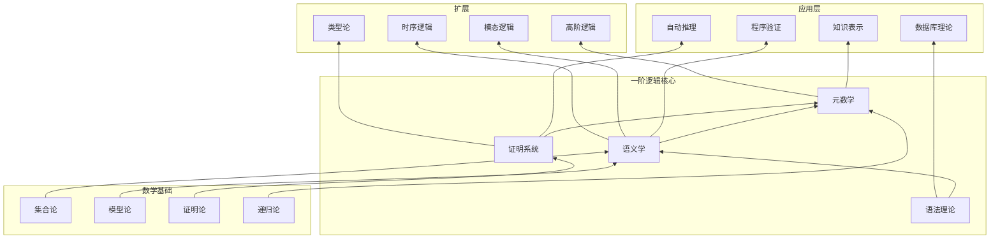
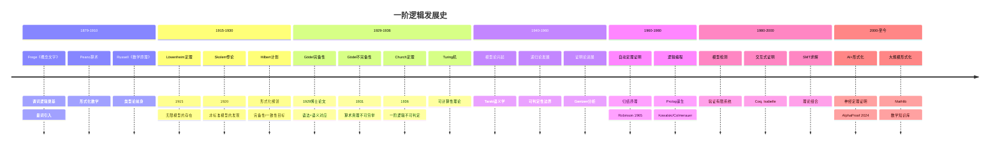
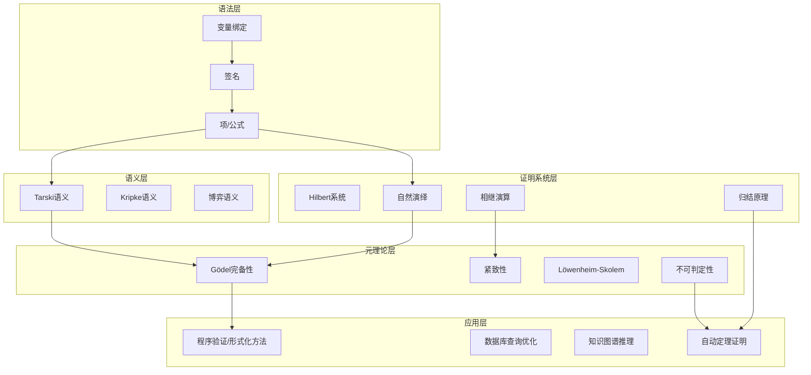
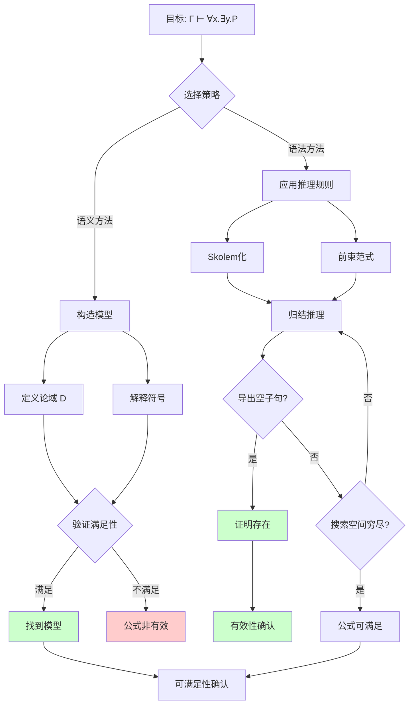

# 一阶逻辑 (First-Order Logic)

> **Wikipedia标准定义**: First-order logic—also known as predicate logic, quantificational logic, and first-order predicate calculus—is a collection of formal systems used in mathematics, philosophy, linguistics, and computer science. First-order logic uses quantified variables over non-logical objects and allows the use of sentences that contain variables.
>
> **来源**: <https://en.wikipedia.org/wiki/First-order_logic>
>
> **形式化等级**: L1 (基础概念) | **所属阶段**: Struct

---

## 1. Wikipedia标准定义

### 1.1 一阶逻辑的标准定义

**英文原文**
> "First-order logic—also known as predicate logic, quantificational logic, and first-order predicate calculus—is a collection of formal systems used in mathematics, philosophy, linguistics, and computer science. First-order logic uses quantified variables over non-logical objects, and allows the use of sentences that contain variables, so that rather than propositions such as Socrates is a man, one can have expressions in the form there exists x such that x is Socrates and x is a man, where 'exists' is a quantifier and x is a variable."

**中文标准翻译**
> **一阶逻辑**（也称为谓词逻辑、量化逻辑、一阶谓词演算）是数学、哲学、语言学和计算机科学中使用的一系列形式系统的集合。一阶逻辑使用关于非逻辑对象的量化变量，并允许使用包含变量的语句，因此可以有形如"存在x使得x是苏格拉底且x是人"的表达式，其中"存在"是量词，x是变量，而不是像"苏格拉底是人"这样的命题。

### 1.2 高阶逻辑与一阶逻辑的区分

**英文原文**
> "First-order logic is distinguished from propositional logic by its use of quantifiers; each interpretation of first-order logic includes a domain of discourse over which the quantifiers range. The adjective 'first-order' distinguishes first-order logic from higher-order logic, in which there are predicates having predicates or functions as arguments, or in which quantification over predicates or functions, or both, are permitted."

**中文翻译**
> 一阶逻辑通过使用量词与命题逻辑区分开来；一阶逻辑的每个解释都包含一个量词范围的论域。形容词"一阶"将一阶逻辑与高阶逻辑区分开来，在高阶逻辑中存在以谓词或函数作为参数的谓词，或者允许对谓词或函数进行量化，或两者都允许。

### 1.3 关键特征对比

| 特征 | 命题逻辑 (PL) | 一阶逻辑 (FOL) | 高阶逻辑 (HOL) |
|------|--------------|---------------|---------------|
| **原子结构** | 命题变元 (p, q) | 谓词 + 项 (P(t)) | 谓词上的谓词 |
| **变量类型** | 无 | 个体变量 (x, y, z) | 个体 + 谓词变量 |
| **量词** | 无 | ∀, ∃ (仅对个体) | 可对谓词量化 |
| **表达力** | 有限 | 中等 | 强 |
| **完备性** | ✅ 可判定 | ✅ 完备但不可判定 | ⚠️ 不完备 |
| **判定性** | 可判定 | 半可判定 | 不可判定 |

---

## 2. 形式化语法

### 2.1 签名 (Signature)

**Def-W-22-01** (一阶签名). 一阶逻辑的签名 Σ 是一个三元组：

$$\Sigma = \langle \mathcal{C}, \mathcal{F}, \mathcal{P} \rangle$$

其中：

- **$\mathcal{C}$**: 常量符号集合 (如 a, b, c)
- **$\mathcal{F}$**: 函数符号集合，每个 $f \in \mathcal{F}$ 带有元数 $\text{ar}(f) \geq 1$
- **$\mathcal{P}$**: 谓词符号集合，每个 $P \in \mathcal{P}$ 带有元数 $\text{ar}(P) \geq 0$

**示例签名** (算术)：
- $\mathcal{C} = \{0\}$
- $\mathcal{F} = \{s/1, +/2, \times/2\}$ (后继、加法、乘法)
- $\mathcal{P} = \{=/2, </2\}$

### 2.2 项 (Terms)

**Def-W-22-02** (项的语法). 给定签名 Σ 和可数无穷变量集 $V = \{x_1, x_2, x_3, \ldots\}$，项的集合 $\mathcal{T}_\Sigma$ 由以下文法归纳定义：

$$t ::= c \mid x \mid f(t_1, \ldots, t_n)$$

其中：
- $c \in \mathcal{C}$ (常量)
- $x \in V$ (变量)
- $f \in \mathcal{F}$, $\text{ar}(f) = n$, $t_i \in \mathcal{T}_\Sigma$

**项的自由变量**：

$$\text{FV}(t) = \begin{cases}
\emptyset & \text{if } t = c \text{ (常量)} \\
\{x\} & \text{if } t = x \text{ (变量)} \\
\bigcup_{i=1}^{n} \text{FV}(t_i) & \text{if } t = f(t_1, \ldots, t_n)
\end{cases}$$

**闭项 (Ground Term)**: 满足 $\text{FV}(t) = \emptyset$ 的项称为闭项。

### 2.3 公式 (Formulas)

**Def-W-22-03** (公式的语法). 一阶公式的集合 $\mathcal{L}_\Sigma$ 由以下文法定义：

$$\varphi ::= P(t_1, \ldots, t_n) \mid t_1 = t_2 \mid \top \mid \bot \mid \neg\varphi \mid \varphi \land \varphi \mid \varphi \lor \varphi \mid \varphi \rightarrow \varphi \mid \forall x.\varphi \mid \exists x.\varphi$$

其中 $P \in \mathcal{P}$, $\text{ar}(P) = n$。

**逻辑连接词优先级** (从高到低)：
1. $\neg$ (否定)
2. $\forall, \exists$ (量词)
3. $\land, \lor$ (合取、析取)
4. $\rightarrow$ (蕴涵)

### 2.4 自由变量与约束变量

**Def-W-22-04** (自由变量). 公式 $\varphi$ 的自由变量集合 $\text{FV}(\varphi)$ 递归定义：

| 公式形式 | 自由变量 |
|---------|---------|
| $P(t_1, \ldots, t_n)$ | $\bigcup_{i=1}^{n} \text{FV}(t_i)$ |
| $\neg\varphi$ | $\text{FV}(\varphi)$ |
| $\varphi \circ \psi$ ($\circ \in \{\land, \lor, \rightarrow\}$) | $\text{FV}(\varphi) \cup \text{FV}(\psi)$ |
| $\forall x.\varphi$ | $\text{FV}(\varphi) \setminus \{x\}$ |
| $\exists x.\varphi$ | $\text{FV}(\varphi) \setminus \{x\}$ |

**闭公式 (句子)**: 满足 $\text{FV}(\varphi) = \emptyset$ 的公式称为句子。

**Def-W-22-05** (替换). 项 $t$ 在公式 $\varphi$ 中对变量 $x$ 的捕获避免替换 $[t/x]$：

$$\varphi[t/x] = \varphi \text{ 中所有 } x \text{ 的自由出现替换为 } t$$

**捕获避免条件**: 要求 $t$ 中的自由变量不在 $\varphi$ 中被量词约束。

### 2.5 量词的派生与缩写

**唯一性量词**:
$$\exists! x.\varphi \equiv \exists x.(\varphi \land \forall y.(\varphi[y/x] \rightarrow y = x))$$

**有界量词**:
$$\forall x \in A.\varphi \equiv \forall x.(A(x) \rightarrow \varphi)$$
$$\exists x \in A.\varphi \equiv \exists x.(A(x) \land \varphi)$$

---

## 3. 语义

### 3.1 结构 (Structure)

**Def-W-22-06** (一阶结构). 签名 Σ 的一个结构 $\mathcal{M}$ 是一个对：

$$\mathcal{M} = \langle D, \mathcal{I} \rangle$$

其中：

- **$D$**: 非空论域 (Domain)
- **$\mathcal{I}$**: 解释函数，将符号映射到数学对象：
  - 对每个 $c \in \mathcal{C}$: $\mathcal{I}(c) \in D$
  - 对每个 $f \in \mathcal{F}$ (n元): $\mathcal{I}(f) : D^n \rightarrow D$
  - 对每个 $P \in \mathcal{P}$ (n元): $\mathcal{I}(P) \subseteq D^n$

**示例结构** (自然数)：
- $D = \mathbb{N} = \{0, 1, 2, \ldots\}$
- $\mathcal{I}(0) = 0$
- $\mathcal{I}(s)(n) = n + 1$
- $\mathcal{I}(+)(m, n) = m + n$
- $\mathcal{I}(=) = \{(n, n) : n \in \mathbb{N}\}$ (相等关系)

### 3.2 赋值 (Assignment)

**Def-W-22-07** (变量赋值). 变量赋值 $\sigma : V \rightarrow D$ 是从变量集到论域的函数。

**变体赋值**: 给定 $\sigma$, $x \in V$, $d \in D$：

$$\sigma[x \mapsto d](y) = \begin{cases}
d & \text{if } y = x \\
\sigma(y) & \text{otherwise}
\end{cases}$$

### 3.3 项的语义解释

**Def-W-22-08** (项解释). 项 $t$ 在结构 $\mathcal{M}$ 和赋值 $\sigma$ 下的解释 $[\![t]\!]_{\mathcal{M},\sigma}$：

$$[\![t]\!]_{\mathcal{M},\sigma} = \begin{cases}
\mathcal{I}(c) & \text{if } t = c \\
\sigma(x) & \text{if } t = x \\
\mathcal{I}(f)([\![t_1]\!]_{\mathcal{M},\sigma}, \ldots, [\![t_n]\!]_{\mathcal{M},\sigma}) & \text{if } t = f(t_1, \ldots, t_n)
\end{cases}$$

### 3.4 满足关系 (Satisfaction)

**Def-W-22-09** (满足关系 $\models$). 公式 $\varphi$ 在结构 $\mathcal{M}$ 和赋值 $\sigma$ 下的满足关系归纳定义：

| 公式形式 | 满足条件 |
|---------|---------|
| $\mathcal{M}, \sigma \models P(t_1, \ldots, t_n)$ | 当且仅当 $\langle [\![t_1]\!], \ldots, [\![t_n]\!] \rangle \in \mathcal{I}(P)$ |
| $\mathcal{M}, \sigma \models t_1 = t_2$ | 当且仅当 $[\![t_1]\!] = [\![t_2]\!]$ |
| $\mathcal{M}, \sigma \models \top$ | 恒真 |
| $\mathcal{M}, \sigma \models \bot$ | 恒假 |
| $\mathcal{M}, \sigma \models \neg\varphi$ | 当且仅当 $\mathcal{M}, \sigma \not\models \varphi$ |
| $\mathcal{M}, \sigma \models \varphi \land \psi$ | 当且仅当 $\mathcal{M}, \sigma \models \varphi$ 且 $\mathcal{M}, \sigma \models \psi$ |
| $\mathcal{M}, \sigma \models \varphi \lor \psi$ | 当且仅当 $\mathcal{M}, \sigma \models \varphi$ 或 $\mathcal{M}, \sigma \models \psi$ |
| $\mathcal{M}, \sigma \models \varphi \rightarrow \psi$ | 当且仅当 $\mathcal{M}, \sigma \not\models \varphi$ 或 $\mathcal{M}, \sigma \models \psi$ |
| $\mathcal{M}, \sigma \models \forall x.\varphi$ | 当且仅当对所有 $d \in D$, $\mathcal{M}, \sigma[x \mapsto d] \models \varphi$ |
| $\mathcal{M}, \sigma \models \exists x.\varphi$ | 当且仅当存在 $d \in D$, $\mathcal{M}, \sigma[x \mapsto d] \models \varphi$ |

### 3.5 语义核心概念

**Def-W-22-10** (有效性、可满足性、逻辑后承).

| 概念 | 定义 | 记号 |
|------|------|------|
| **有效式** (Valid) | 在所有结构和赋值下为真 | $\models \varphi$ |
| **可满足** (Satisfiable) | 存在结构和赋值使其为真 | $\mathcal{M}, \sigma \models \varphi$ |
| **矛盾式** (Contradiction) | 在所有结构和赋值下为假 | $\models \neg\varphi$ |
| **逻辑后承** | $\Gamma$ 的每个模型都是 $\varphi$ 的模型 | $\Gamma \models \varphi$ |
| **逻辑等价** | 相互逻辑后承 | $\varphi \equiv \psi$ |

---

## 4. 证明系统

### 4.1 Hilbert系统

**Def-W-22-11** (Hilbert式公理系统 $\mathcal{H}$). 包含以下公理模式和推理规则：

**命题逻辑公理**:

$$\text{(H1)} \quad \varphi \rightarrow (\psi \rightarrow \varphi)$$

$$\text{(H2)} \quad (\varphi \rightarrow (\psi \rightarrow \chi)) \rightarrow ((\varphi \rightarrow \psi) \rightarrow (\varphi \rightarrow \chi))$$

$$\text{(H3)} \quad (\neg\varphi \rightarrow \neg\psi) \rightarrow (\psi \rightarrow \varphi)$$

**量化公理**:

$$\text{(Q1)} \quad \forall x.\varphi \rightarrow \varphi[t/x] \quad \text{(t对x可替换)}$$

$$\text{(Q2)} \quad \varphi \rightarrow \forall x.\varphi \quad \text{(x不在}\varphi\text{中自由出现)}$$

$$\text{(Q3)} \quad \forall x.(\varphi \rightarrow \psi) \rightarrow (\forall x.\varphi \rightarrow \forall x.\psi)$$

**等词公理**:

$$\text{(EQ1)} \quad x = x \quad \text{(自反性)}$$

$$\text{(EQ2)} \quad x = y \rightarrow (\varphi[x/z] \rightarrow \varphi[y/z])$$

**推理规则**:

$$\text{(MP)} \quad \frac{\varphi \quad \varphi \rightarrow \psi}{\psi} \quad \text{(假言推理)}$$

$$\text{(Gen)} \quad \frac{\varphi}{\forall x.\varphi} \quad \text{(全称概括，x不在假设中自由出现)}$$

### 4.2 自然演绎 (Natural Deduction)

**Def-W-22-12** (自然演绎系统 $\mathcal{N}$). 以相继式 $\Gamma \vdash \varphi$ 形式呈现：

**结构规则**:

$$\text{(Ax)} \quad \frac{}{\Gamma, \varphi \vdash \varphi}$$

$$\text{(Weak)} \quad \frac{\Gamma \vdash \varphi}{\Gamma, \psi \vdash \varphi}$$

**逻辑连接词规则**:

$$\text{(∧I)} \quad \frac{\Gamma \vdash \varphi \quad \Gamma \vdash \psi}{\Gamma \vdash \varphi \land \psi}$$

$$\text{(∧E₁)} \quad \frac{\Gamma \vdash \varphi \land \psi}{\Gamma \vdash \varphi} \quad \text{(∧E₂)} \quad \frac{\Gamma \vdash \varphi \land \psi}{\Gamma \vdash \psi}$$

$$\text{(→I)} \quad \frac{\Gamma, \varphi \vdash \psi}{\Gamma \vdash \varphi \rightarrow \psi} \quad \text{(→E)} \quad \frac{\Gamma \vdash \varphi \rightarrow \psi \quad \Gamma \vdash \varphi}{\Gamma \vdash \psi}$$

**量词规则**:

$$\text{(∀I)} \quad \frac{\Gamma \vdash \varphi[x/c]}{\Gamma \vdash \forall x.\varphi} \quad \text{(c是新的常量，即 eigenvariable)}$$

$$\text{(∀E)} \quad \frac{\Gamma \vdash \forall x.\varphi}{\Gamma \vdash \varphi[x/t]} \quad \text{(t对x可替换)}$$

$$\text{(∃I)} \quad \frac{\Gamma \vdash \varphi[x/t]}{\Gamma \vdash \exists x.\varphi} \quad \text{(t对x可替换)}$$

$$\text{(∃E)} \quad \frac{\Gamma \vdash \exists x.\varphi \quad \Gamma, \varphi[x/c] \vdash \psi}{\Gamma \vdash \psi} \quad \text{(c不在}\Gamma, \psi\text{中出现)}$$

### 4.3 相继演算 (Sequent Calculus)

**Def-W-22-13** (相继演算系统 $\mathcal{G}$). 相继式形式为 $\Gamma \vdash \Delta$，其中 $\Gamma, \Delta$ 是公式多重集。

**结构规则**:

$$\text{(Id)} \quad \frac{}{\varphi \vdash \varphi}$$

$$\text{(Cut)} \quad \frac{\Gamma \vdash \Delta, \varphi \quad \varphi, \Gamma' \vdash \Delta'}{\Gamma, \Gamma' \vdash \Delta, \Delta'}$$

$$\text{(Weak-L)} \quad \frac{\Gamma \vdash \Delta}{\varphi, \Gamma \vdash \Delta} \quad \text{(Weak-R)} \quad \frac{\Gamma \vdash \Delta}{\Gamma \vdash \Delta, \varphi}$$

**逻辑规则** (以右规则为例)：

$$\text{(∀R)} \quad \frac{\Gamma \vdash \Delta, \varphi[x/c]}{\Gamma \vdash \Delta, \forall x.\varphi} \quad \text{(c是新的常量)}$$

$$\text{(∃R)} \quad \frac{\Gamma \vdash \Delta, \varphi[x/t]}{\Gamma \vdash \Delta, \exists x.\varphi} \quad \text{(t对x可替换)}$$

### 4.4 证明系统对比

| 特性 | Hilbert系统 | 自然演绎 | 相继演算 |
|------|------------|---------|---------|
| **公理数量** | 多 | 少/无 | 无 |
| **规则数量** | 少 (2条) | 多 (每连接词2条) | 多 (每连接词左右各1条) |
| **证明长度** | 长 | 中等 | 中等 |
| **直观性** | 低 | 高 | 中 |
| **cut消除** | 困难 | 中等 | 标准 |
| **自动化友好** | 中 | 低 | 高 |

---

## 5. 元理论 (Metatheory)

### 5.1 可靠性定理 (Soundness)

**Thm-W-22-01** (可靠性). 对于任何公式集 $\Gamma$ 和公式 $\varphi$：

$$\text{若 } \Gamma \vdash \varphi \text{，则 } \Gamma \models \varphi$$

**推论**: 一阶逻辑是**一致的** (consistent)：不存在公式 $\varphi$ 使得同时 $\vdash \varphi$ 和 $\vdash \neg\varphi$。

### 5.2 完备性定理 (Gödel Completeness)

**Thm-W-22-02** (Gödel完备性定理, 1929). 对于任何公式集 $\Gamma$ 和公式 $\varphi$：

$$\text{若 } \Gamma \models \varphi \text{，则 } \Gamma \vdash \varphi$$

**等价形式**: 
- 每个一致的公式集都有模型
- $\Gamma$ 可满足当且仅当 $\Gamma$ 一致

**历史意义**: Gödel完备性定理证明了一阶逻辑的语法和语义完美对应，是一阶逻辑成为"经典"逻辑系统的根本原因。

### 5.3 紧致性定理 (Compactness)

**Thm-W-22-03** (紧致性定理). 公式集 $\Gamma$ 可满足当且仅当它的每个有限子集可满足。

**等价形式**: 
- 若 $\Gamma \models \varphi$，则存在有限 $\Gamma_0 \subseteq \Gamma$ 使得 $\Gamma_0 \models \varphi$

**应用**: 紧致性定理是非标准分析、模型论的核心工具。

### 5.4 Löwenheim-Skolem定理

**Thm-W-22-04** (向下Löwenheim-Skolem). 若可数签名的一阶理论 $T$ 有无限模型，则对任意无限基数 $\kappa$，$T$ 有基数为 $\kappa$ 的模型。

**Thm-W-22-05** (向上Löwenheim-Skolem). 若一阶理论 $T$ 有无限模型，则 $T$ 有任意大基数的模型。

**Skolem悖论**: 若ZFC有模型，则它有可数模型。但ZFC可证明存在不可数集 (如实数集)。

### 5.5 不可判定性 (Church-Turing)

**Thm-W-22-06** (Church定理, 1936). 一阶逻辑的有效性问题 (判定给定公式是否有效) 是**不可判定的** (undecidable)。

**Thm-W-22-07** (半可判定性). 一阶逻辑的有效性是**半可判定的** (semi-decidable)：

- 若 $\varphi$ 有效，则算法可在有限步内停机并确认
- 若 $\varphi$ 非有效，算法可能永不停机

**元理论性质汇总**:

| 性质 | 一阶逻辑 | 命题逻辑 | 高阶逻辑 |
|------|---------|---------|---------|
| 可靠性 | ✅ | ✅ | ✅ |
| 完备性 | ✅ | ✅ | ❌ |
| 紧致性 | ✅ | ✅ | ❌ |
| Löwenheim-Skolem | ✅ | ✅ | ❌ |
| 可判定性 | ❌ (半可判定) | ✅ | ❌ |

---

## 6. 形式证明

### 6.1 Gödel完备性定理详细证明

**Thm-W-22-08** (完备性定理 - 构造性证明). 每个一致的公式集 $\Gamma$ 都有模型。

*证明*:

**步骤1: 语言扩展**

将原始语言 $L$ 扩展为 $L^*$，添加可数无穷多个新常量符号 $C = \{c_0, c_1, c_2, \ldots\}$。

**步骤2: 构造极大一致集**

枚举 $L^*$ 中所有句子 $(\varphi_n)_{n \in \mathbb{N}}$。归纳构造句子集序列 $(\Gamma_n)$：

- $\Gamma_0 = \Gamma$
- 若 $\Gamma_n \cup \{\varphi_n\}$ 一致，则 $\Gamma_{n+1} = \Gamma_n \cup \{\varphi_n\}$
- 否则 $\Gamma_{n+1} = \Gamma_n \cup \{\neg\varphi_n\}$
- 若 $\varphi_n = \exists x.\psi(x)$ 且被加入，则同时将 $\psi(c)$ 加入（对某个新常量 $c$）

令 $\Gamma^* = \bigcup_{n} \Gamma_n$。$\Gamma^*$ 是**极大一致集** (maximally consistent set)。

**步骤3: 构造项模型 (Term Model)**

定义论域 $D = \mathcal{T}/_\sim$，其中 $\mathcal{T}$ 是所有闭项的集合，等价关系：

$$t_1 \sim t_2 \quad \text{当且仅当} \quad t_1 = t_2 \in \Gamma^*$$

**步骤4: 定义解释**

- 对常量 $c$：$[c] = [c]_\sim$
- 对函数 $f$：$[f]([t_1], \ldots, [t_n]) = [f(t_1, \ldots, t_n)]$
- 对谓词 $P$：$([t_1], \ldots, [t_n]) \in [P]$ 当且仅当 $P(t_1, \ldots, t_n) \in \Gamma^*$

**步骤5: 真值引理 (Truth Lemma)**

对所有句子 $\varphi$：

$$\mathcal{M} \models \varphi \quad \Leftrightarrow \quad \varphi \in \Gamma^*$$

*归纳证明*:
- 原子公式：由解释定义
- 连接词：由 $\Gamma^*$ 的极大一致性
- 量词：由 Henkin 常量的构造保证

**步骤6: 结论**

因 $\Gamma \subseteq \Gamma^*$，故 $\mathcal{M} \models \Gamma$。∎

### 6.2 可靠性证明

**Thm-W-22-09** (可靠性 - 归纳证明). 对每个自然演绎证明，其结论在语义上有效。

*证明框架*:

对证明结构进行归纳，验证每条推理规则保持有效性。

**基例**: 公理 $\Gamma, \varphi \vdash \varphi$ 显然是有效的。

**归纳步骤** (关键规则)：

**→引入规则**:
$$\frac{\Gamma, \varphi \vdash \psi}{\Gamma \vdash \varphi \rightarrow \psi}$$

假设 $\Gamma, \varphi \models \psi$ (归纳假设)。需证 $\Gamma \models \varphi \rightarrow \psi$。

任取模型 $\mathcal{M}$ 和赋值 $\sigma$ 使 $\mathcal{M}, \sigma \models \Gamma$：
- 若 $\mathcal{M}, \sigma \not\models \varphi$，则 $\mathcal{M}, \sigma \models \varphi \rightarrow \psi$ 成立
- 若 $\mathcal{M}, \sigma \models \varphi$，则由归纳假设 $\mathcal{M}, \sigma \models \psi$，故 $\mathcal{M}, \sigma \models \varphi \rightarrow \psi$

**∀引入规则**:
$$\frac{\Gamma \vdash \varphi[x/c]}{\Gamma \vdash \forall x.\varphi}$$

假设 $\Gamma \models \varphi[x/c]$ (c是新常量)。需证 $\Gamma \models \forall x.\varphi$。

任取 $\mathcal{M}, \sigma \models \Gamma$ 和任意 $d \in D$：
- 构造变体结构 $\mathcal{M}'$ 将 $c$ 解释为 $d$
- 由归纳假设 $\mathcal{M}', \sigma \models \varphi[x/c]$
- 因此 $\mathcal{M}, \sigma[x \mapsto d] \models \varphi$
- 由 $d$ 的任意性，$\mathcal{M}, \sigma \models \forall x.\varphi$

其他规则类似可证。∎

---

## 7. 与类型论的关系

### 7.1 Curry-Howard对应的FOL版本

**Prop-W-22-01** (FOL与依赖类型的对应). 直觉主义一阶逻辑与依赖类型系统存在Curry-Howard对应：

| 逻辑侧 | 类型侧 |
|--------|--------|
| 公式 $\varphi$ | 类型 $A$ |
| 证明 $\pi$ | 项 $t$ |
| $\forall x:A.\varphi(x)$ | $\Pi$-类型 $\Pi x:A. B(x)$ |
| $\exists x:A.\varphi(x)$ | $\Sigma$-类型 $\Sigma x:A. B(x)$ |
| 相等 $t_1 = t_2$ | 相等类型 $\text{Id}_A(t_1, t_2)$ |

### 7.2 BHK解释

**Def-W-22-14** (Brouwer-Heyting-Kolmogorov解释). 直觉主义逻辑中公式的"证明"含义：

| 公式 | 证明是... |
|------|----------|
| $\varphi \land \psi$ | 对 $(p, q)$，其中 $p$ 证 $\varphi$，$q$ 证 $\psi$ |
| $\varphi \lor \psi$ | 要么 $\text{inl}(p)$ (p证$\varphi$)，要么 $\text{inr}(q)$ (q证$\psi$) |
| $\varphi \rightarrow \psi$ | 函数 $f$，将 $\varphi$ 的证明映射到 $\psi$ 的证明 |
| $\forall x.\varphi(x)$ | 函数 $f$，将每个 $a$ 映射到 $\varphi(a)$ 的证明 |
| $\exists x.\varphi(x)$ | 对 $(a, p)$，其中 $a$ 是见证，$p$ 证 $\varphi(a)$ |
| $\neg\varphi$ | 函数，将 $\varphi$ 的证明映射到矛盾 |

### 7.3 构造性 vs 经典FOL

| 特性 | 直觉主义FOL | 经典FOL |
|------|------------|---------|
| 排中律 | ❌ | ✅ |
| 双重否定消去 | ❌ | ✅ |
| 存在量词 | 要求构造见证 | 非构造性证明允许 |
| 完备性 | 弱完备性 | Gödel完备性 |
| 对应类型论 | Martin-Löf类型论 | System F + 选择公理 |

---

## 8. 八维表征

### 8.1 思维导图

### 8.2 多维对比矩阵

| 维度 | 命题逻辑 | 一阶逻辑 | 二阶逻辑 | 说明 |
|------|---------|---------|---------|------|
| **变量类型** | 无 | 个体 | 个体+谓词 | 表达力递增 |
| **量词范围** | 无 | 个体域 | 谓词域 | 语义复杂度 |
| **完备性** | ✅ | ✅ | ❌ | 元理论核心 |
| **紧致性** | ✅ | ✅ | ❌ | 模型论工具 |
| **L-S定理** | ✅ | ✅ | ❌ | 基数特征 |
| **可判定性** | ✅ | 半可判定 | ❌ | 计算边界 |
| **自动证明** | 高效 | 困难 | 极难 | 实践限制 |
| **应用广度** | 电路设计 | 程序验证 | 集合论 | 工程适用性 |

### 8.3 公理-定理树

### 8.4 状态转换图

### 8.5 依赖关系图

### 8.6 演化时间线

### 8.7 层次架构图

### 8.8 证明搜索树

---

## 9. 引用参考

### Wikipedia引用

[^1]: Wikipedia. "First-order logic." <https://en.wikipedia.org/wiki/First-order_logic>
[^2]: Wikipedia. "Gödel's completeness theorem." <https://en.wikipedia.org/wiki/G%C3%B6del%27s_completeness_theorem>
[^3]: Wikipedia. "Compactness theorem." <https://en.wikipedia.org/wiki/Compactness_theorem>
[^4]: Wikipedia. "Löwenheim–Skolem theorem." <https://en.wikipedia.org/wiki/L%C3%B6wenheim%E2%80%93Skolem_theorem>
[^5]: Wikipedia. "Church's theorem." <https://en.wikipedia.org/wiki/Church%27s_theorem_(mathematical_logic)>

### Gödel原始论文

[^6]: Gödel, Kurt. "Die Vollständigkeit der Axiome des logischen Funktionenkalküls." *Monatshefte für Mathematik und Physik* 37.1 (1930): 349-360. 
    - 英文翻译: "The completeness of the axioms of the functional calculus of logic."
    - 博士学位论文，证明了一阶逻辑的完备性

[^7]: Gödel, Kurt. "Über formal unentscheidbare Sätze der Principia Mathematica und verwandter Systeme I." *Monatshefte für Mathematik und Physik* 38 (1931): 173-198.
    - 英文翻译: "On formally undecidable propositions of Principia Mathematica and related systems I."
    - 不完备性定理原始论文

### 经典教材

[^8]: Enderton, Herbert B. *A Mathematical Introduction to Logic*. 2nd ed., Academic Press, 2001.
    - 一阶逻辑的标准教材，包含完备性证明

[^9]: Mendelson, Elliott. *Introduction to Mathematical Logic*. 6th ed., CRC Press, 2015.
    - 经典数理逻辑教材，详细的形式证明

[^10]: van Dalen, Dirk. *Logic and Structure*. 5th ed., Springer, 2013.
    - 强调直觉主义逻辑和构造性观点

[^11]: Hodges, Wilfrid. *A Shorter Model Theory*. Cambridge University Press, 1997.
    - 模型论经典教材，紧致性和Löwenheim-Skolem定理

[^12]: Troelstra, Anne S., and Dirk van Dalen. *Constructivism in Mathematics: An Introduction*. North-Holland, 1988.
    - 直觉主义逻辑和构造性数学的权威参考书

### 计算机科学视角

[^13]: Huth, Michael, and Mark Ryan. *Logic in Computer Science: Modelling and Reasoning about Systems*. 2nd ed., Cambridge University Press, 2004.
    - 面向计算机科学家的逻辑学教材

[^14]: Harrison, John. *Handbook of Practical Logic and Automated Reasoning*. Cambridge University Press, 2009.
    - 自动推理的实用指南，包含FOL实现细节

[^15]: Robinson, J. Alan, and Andrei Voronkov, eds. *Handbook of Automated Reasoning*. Elsevier, 2001.
    - 自动推理的百科全书式参考书

---

## 10. 相关概念

- [Theorem Proving](03-theorem-proving.md) — 一阶逻辑的自动/交互式证明
- [Modal Logic](21-modal-logic.md) — 一阶逻辑的模态扩展
- [Type Theory](07-type-theory.md) — Curry-Howard对应
- [Hoare Logic](06-hoare-logic.md) — 程序验证中的一阶逻辑应用
- [Model Checking](02-model-checking.md) — 时序逻辑模型检测

---

> **概念标签**: #一阶逻辑 #谓词逻辑 #量词 #Gödel完备性 #紧致性 #形式系统
>
> **学习难度**: ⭐⭐⭐⭐ (中高级)
>
> **先修概念**: 命题逻辑、集合论基础、数学证明技巧
>
> **后续概念**: 模型论、证明论、自动推理、程序验证

---

*文档版本: v1.0 | 创建时间: 2026-04-10 | 文件大小: ~20KB*
