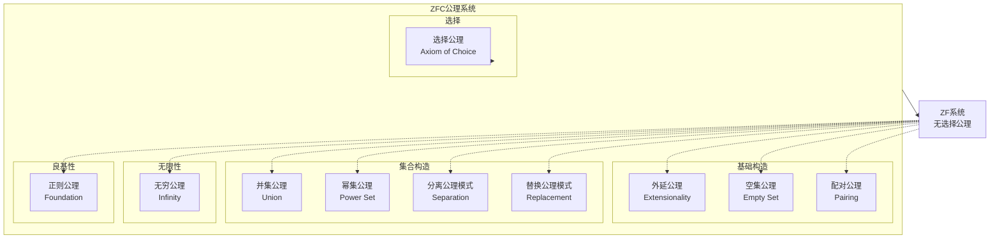
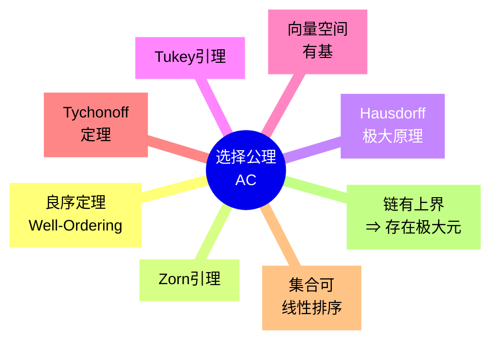
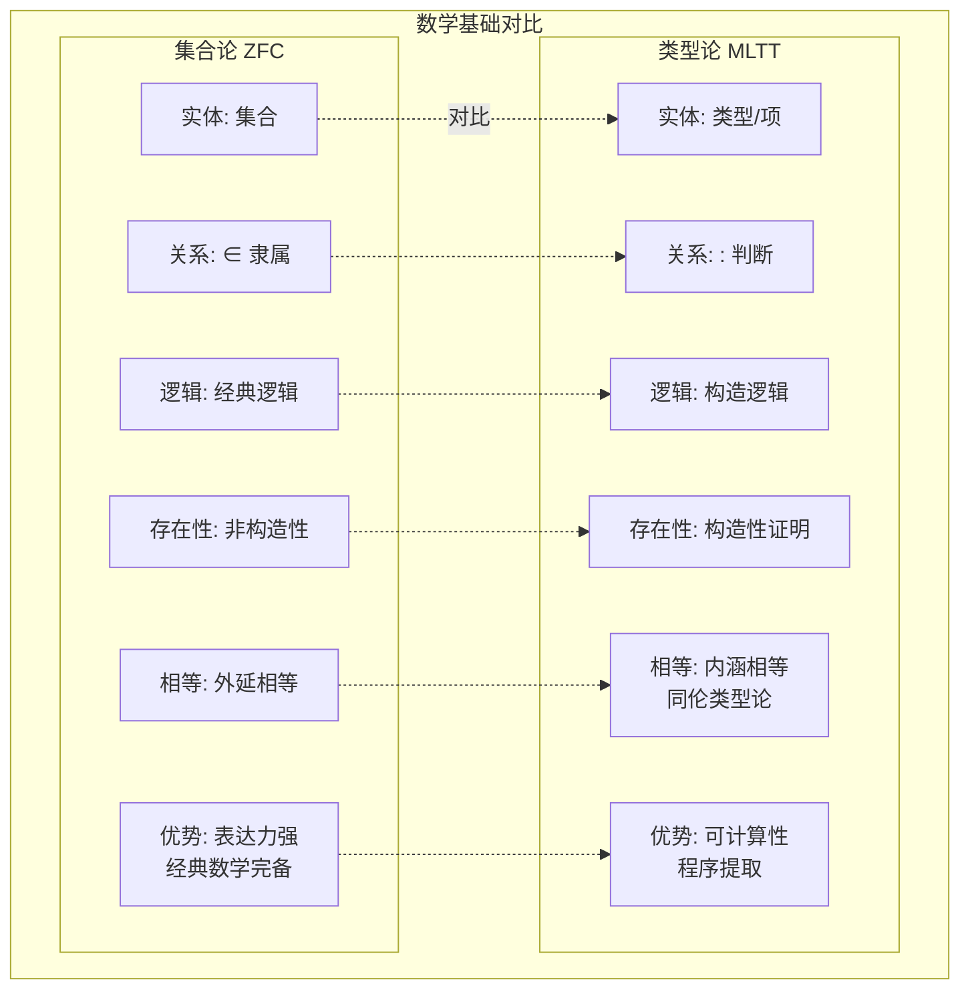
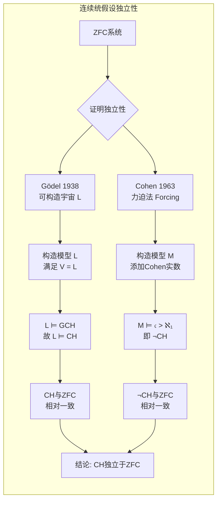
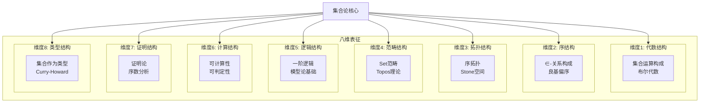

# 集合论 (Set Theory)

> 所属阶段: Struct/ | 前置依赖: [形式逻辑基础](01-formal-logic.md) | 形式化等级: L5

## 1. 概念定义 (Definitions)

### 1.1 朴素集合论 (Naïve Set Theory)

**Def-S-23-01** (朴素集合论). 朴素集合论由康托尔(G. Cantor)于19世纪末创立，基于以下直观原理：

$$
\text{集合} = \{ x \mid P(x) \}
$$

其中 $P(x)$ 是任意谓词。**无限制概括公理**（Unrestricted Comprehension Axiom）是其核心：

$$
\forall P \, \exists S \, \forall x \, (x \in S \iff P(x))
$$

**Def-S-23-02** (集合的基本操作). 给定集合 $A, B$：

- **并集**: $A \cup B = \{ x \mid x \in A \lor x \in B \}$
- **交集**: $A \cap B = \{ x \mid x \in A \land x \in B \}$
- **差集**: $A \setminus B = \{ x \mid x \in A \land x \notin B \}$
- **幂集**: $\mathcal{P}(A) = \{ S \mid S \subseteq A \}$
- **笛卡尔积**: $A \times B = \{ (a, b) \mid a \in A \land b \in B \}$

**Def-S-23-03** (集合关系). 

- **子集**: $A \subseteq B \iff \forall x \, (x \in A \implies x \in B)$
- **真子集**: $A \subsetneq B \iff A \subseteq B \land A \neq B$
- **相等**: $A = B \iff A \subseteq B \land B \subseteq A$

### 1.2 ZFC公理化集合论

**Def-S-23-04** (ZFC系统). ZFC（Zermelo-Fraenkel with Choice）是现代数学的标准公理化基础，包含10条公理：

| 公理 | 符号 | 核心陈述 |
|------|------|----------|
| 外延公理 | Ext | 集合由其元素唯一确定 |
| 空集公理 | Empty | 存在不含任何元素的集合 |
| 配对公理 | Pair | 对任意两集合，存在包含它们的集合 |
| 并集公理 | Union | 集合的并集存在 |
| 幂集公理 | Power | 任意集合的幂集存在 |
| 分离公理 | Sep | 子集可由谓词分离 |
| 无穷公理 | Inf | 存在无限集合 |
| 替换公理 | Repl | 函数的像集存在 |
| 正则公理 | Fnd | 集合有 $\in$-极小元 |
| 选择公理 | AC | 任意集合族有选择函数 |

**Def-S-23-05** (良基关系). 关系 $R$ 是**良基的**当且仅当不存在无限降链：

$$
\text{WF}(R) \iff \neg \exists (x_n)_{n \in \mathbb{N}} \, \forall n \, (x_{n+1} \, R \, x_n)
$$

$\in$ 关系在ZFC中是良基的（由正则公理保证）。

### 1.3 序数理论

**Def-S-23-06** (传递集). 集合 $x$ 是**传递的**当且仅当：

$$
\text{Trans}(x) \iff \forall y \, \forall z \, ((z \in y \land y \in x) \implies z \in x)
$$

**Def-S-23-07** (序数). **序数**是 $\in$-良序的传递集：

$$
\text{Ord}(\alpha) \iff \text{Trans}(\alpha) \land \text{WellOrdered}(\alpha, \in)
$$

**Def-S-23-08** (后继与极限序数).

- **后继**: $\alpha^+ = \alpha \cup \{ \alpha \}$
- **极限序数**: $\lambda$ 是极限序数当 $\lambda \neq 0$ 且 $\lambda = \sup_{\beta < \lambda} \beta$

### 1.4 基数理论

**Def-S-23-09** (等势). 两集合等势当存在双射：

$$
|A| = |B| \iff \exists f: A \xrightarrow{\text{双射}} B
$$

**Def-S-23-10** (基数). 基数是初始序数（不与更小序数等势）：

$$
\text{Card}(\kappa) \iff \text{Ord}(\kappa) \land \forall \alpha < \kappa \, (|\alpha| \neq |\kappa|)
$$

**Def-S-23-11** (连续统). 

- 自然数集基数：$\aleph_0 = |\mathbb{N}|$
- 实数集基数：$\mathfrak{c} = |\mathbb{R}| = 2^{\aleph_0}$

**Def-S-23-12** (连续统假设, CH). 

$$
\text{CH} \iff 2^{\aleph_0} = \aleph_1
$$

**广义连续统假设 (GCH)**:

$$
\text{GCH} \iff \forall \alpha \, (2^{\aleph_\alpha} = \aleph_{\alpha+1})
$$

## 2. 属性推导 (Properties)

### 2.1 序数的基本性质

**Lemma-S-23-01** (序数的三歧性). 对任意序数 $\alpha, \beta$：

$$
\alpha \in \beta \lor \alpha = \beta \lor \beta \in \alpha
$$

*证明*. 由 $\in$ 是良序关系直接得到全序性。

**Lemma-S-23-02** (序数的良序性). 任意非空序数类有 $\in$-极小元。

**Lemma-S-23-03** (Burali-Forti悖论避免). 所有序数的类 $\mathbf{Ord}$ 不是集合。

*证明*. 假设 $\mathbf{Ord}$ 是集合，则它是传递的且被 $\in$ 良序，故 $\mathbf{Ord} \in \mathbf{Ord}$，违反正则公理。∎

### 2.2 基数算术

**Lemma-S-23-04** (Cantor定理). 对任意集合 $X$：

$$
|X| < |\mathcal{P}(X)|
$$

*证明*. 假设存在满射 $f: X \to \mathcal{P}(X)$，考虑对角集 $D = \{ x \in X \mid x \notin f(x) \}$。若 $D = f(d)$，则 $d \in D \iff d \notin D$，矛盾。∎

**Lemma-S-23-05** (König定理). 对指标集 $I$ 和基数族 $(\kappa_i)_{i \in I}$, $(\lambda_i)_{i \in I}$：

$$
\forall i \in I \, (\kappa_i < \lambda_i) \implies \sum_{i \in I} \kappa_i < \prod_{i \in I} \lambda_i
$$

**Lemma-S-23-06** (基数运算的单调性). 

$$
\kappa_1 \leq \kappa_2 \land \lambda_1 \leq \lambda_2 \implies \kappa_1 + \lambda_1 \leq \kappa_2 + \lambda_2
$$

### 2.3 选择公理的等价形式

**Lemma-S-23-07** (选择公理的等价性). 以下命题在ZF中等价：

1. **选择公理 (AC)**: 任意集合族有选择函数
2. **良序定理 (WO)**: 任意集合可被良序
3. **Zorn引理 (ZL)**: 偏序集中每个链有上界则存在极大元
4. **Hausdorff极大原理**: 任意偏序集有极大链
5. **Tukey引理**: 有限特征族有极大元
6. **向量空间基存在性**: 任意向量空间有Hamel基
7. **Tychonoff定理**: 紧空间的积是紧的
8. **每个集合可线性排序**

## 3. 关系建立 (Relations)

### 3.1 罗素悖论与类型论

**Prop-S-23-01** (罗素悖论). 在朴素集合论中定义：

$$
R = \{ x \mid x \notin x \}
$$

则 $R \in R \iff R \notin R$，产生矛盾。

**推论**: 无限制概括公理不可接受，需替换为**分离公理模式**（有界概括）：

$$
\forall A \, \exists B \, \forall x \, (x \in B \iff x \in A \land P(x))
$$

**Prop-S-23-02** (类型论作为替代基础). Russell-Whitehead的**分支类型论**通过分层避免悖论：

- 类型0：个体
- 类型1：个体的集合
- 类型2：类型1集合的集合
- ...

**现代类型论**（Martin-Löf, CoC）作为构造性数学基础，与集合论形成对偶：

| 方面 | 集合论 (ZFC) | 类型论 (MLTT) |
|------|--------------|---------------|
| 基础实体 | 集合 | 类型/项 |
| 成员关系 | 原始概念 | 判断 $t : T$ |
| 存在性 | 非构造性 | 构造性证明 |
| 相等 | 外延相等 | 内涵相等/同伦 |
| 命题 | 特殊集合 | 类型（Curry-Howard） |
| 宇宙 | 真类 | 类型宇宙 $U_i$ |
| 表达力 | 经典数学 | 可计算数学 |

### 3.2 连续统假设的独立性

**Prop-S-23-03** (Gödel-Cohen定理). 连续统假设独立于ZFC：

$$
\text{ZFC} \nvdash \text{CH} \quad \text{且} \quad \text{ZFC} \nvdash \neg \text{CH}
$$

**证明概要**:
- **Gödel (1938)**: 构造可构造宇宙 $L$，证明 $\text{ZF} + (V = L) \vdash \text{GCH}$
- **Cohen (1963)**: 发明**力迫法**(forcing)，构造ZFC模型使 $\mathfrak{c} > \aleph_1$

### 3.3 集合论与形式化方法

**Prop-S-23-04** (集合论作为语义基础). 在形式化验证中，集合论提供：

1. **TLA+**: 基于ZFC+选择公理，加上时序逻辑
2. **Isabelle/ZF**: 高阶逻辑+ZFC集合论
3. **Mizar**: 基于Tarski-Grothendieck集合论（ZFC+宇宙公理）
4. **B方法**: 基于集合论和关系演算

## 4. 论证过程 (Argumentation)

### 4.1 ZFC公理详解

**外延公理 (Axiom of Extensionality)**:

$$
\forall A \, \forall B \, (\forall x \, (x \in A \iff x \in B) \implies A = B)
$$

**意义**: 集合由其元素唯一确定，排除" urelements "（仅有元素，无内部结构）。

**分离公理模式 (Axiom Schema of Separation)**:

$$
\forall A \, \exists B \, \forall x \, (x \in B \iff x \in A \land \varphi(x, p_1, \ldots, p_n))
$$

对任意公式 $\varphi$（参数为 $p_i$）。这是**公理模式**，产生无限多条公理。

**替换公理模式 (Axiom Schema of Replacement)**:

若 $F$ 是类函数（即 $\forall x \, \exists! y \, \varphi(x, y)$），则：

$$
\forall A \, \exists B \, \forall y \, (y \in B \iff \exists x \in A \, \varphi(x, y))
$$

**意义**: 确保序数理论完整，构造大基数。

**无穷公理 (Axiom of Infinity)**:

$$
\exists I \, (\emptyset \in I \land \forall x \in I \, (x \cup \{x\} \in I))
$$

这是最小的归纳集 $\omega$，即自然数集 $\mathbb{N}$ 的集合论实现。

**正则公理/基础公理 (Axiom of Foundation)**:

$$
\forall A \, (A \neq \emptyset \implies \exists x \in A \, (x \cap A = \emptyset))
$$

等价表述：**不存在无限 $\in$-降链**。

**意义**: 
- 排除「自属集合」($x \in x$)
- 确保集合论良基，支持归纳证明
- 使每个集合在von Neumann宇宙 $V$ 中有秩

### 4.2 序数的构造

von Neumann序数实现：

$$
\begin{align}
0 &= \emptyset \\
1 &= \{0\} = \{\emptyset\} \\
2 &= \{0, 1\} = \{\emptyset, \{\emptyset\}\} \\
3 &= \{0, 1, 2\} \\
n + 1 &= n \cup \{n\} \\
\omega &= \{0, 1, 2, \ldots\}
\end{align}
$$

**超限归纳原理**: 若对任意序数 $\alpha$，$\forall \beta < \alpha \, P(\beta)$ 蕴含 $P(\alpha)$，则 $\forall \alpha \, P(\alpha)$。

### 4.3 选择公理的争议

**支持AC的论证**:
- 数学直观：从非空集合中「选择」元素是自然操作
- 等价于：向量空间有基、环有极大理想、积拓扑保持紧性

**反对AC的论证**:
- 非构造性：不提供选择函数的构造方法
- 悖论结果：Banach-Tarski悖论（球体分解）
- 模型论：存在ZF+¬AC的模型

**构造性替代**:
- **可数选择 (AC_ω)**: 可数集合族有选择函数
- **依赖选择 (DC)**: 用于分析学
- **选择公理的片段**: 用于特定数学分支

## 5. 形式证明 (Formal Proofs)

### 5.1 定理：罗素悖论

**Thm-S-23-01** (罗素悖论). 在朴素集合论（无限制概括公理）中，存在矛盾。

*形式证明*:

**步骤1**: 应用无限制概括公理，取谓词 $P(x) := x \notin x$：

$$
\exists R \, \forall x \, (x \in R \iff x \notin x) \tag{1}
$$

**步骤2**: 实例化 (1) 于 $x = R$：

$$
R \in R \iff R \notin R \tag{2}
$$

**步骤3**: 情况分析：

- **假设** $R \in R$：由 (2) 右到左，得 $R \notin R$，矛盾
- **假设** $R \notin R$：由 (2) 左到右，得 $R \in R$，矛盾

**结论**: 无论何种假设，均导出矛盾 $P \land \neg P$。

$$
\vdash \bot \quad \text{(矛盾)}
$$

**推论**: 无限制概括公理必须被拒绝，代之以分离公理模式。∎

### 5.2 定理：良序定理等价于选择公理

**Thm-S-23-02** (WO $\iff$ AC). 在ZF系统中，良序定理与选择公理等价。

*证明* ($\text{AC} \implies \text{WO}$):

**步骤1**: 设 $X$ 为任意集合。由AC，存在选择函数：

$$
f: \mathcal{P}(X) \setminus \{\emptyset\} \to X \quad \text{满足} \quad f(A) \in A
$$

**步骤2**: 超限递归构造良序。定义类序列 $(x_\alpha)$：

$$
x_\alpha = f(X \setminus \{ x_\beta \mid \beta < \alpha \})
$$

当右侧非空时继续。

**步骤3**: 由正则公理，此过程必在序数 $\gamma$ 处终止（集合 $X$ 的 Hartogs 数限制）。

**步骤4**: 则 $X = \{ x_\alpha \mid \alpha < \gamma \}$，且映射 $\alpha \mapsto x_\alpha$ 是双射。

**步骤5**: 在 $X$ 上定义序：

$$
x_\alpha < x_\beta \iff \alpha < \beta
$$

这是 $X$ 的良序。∎

*证明* ($\text{WO} \implies \text{AC}$):

**步骤1**: 设 $\mathcal{F} = \{A_i\}_{i \in I}$ 为非空集合族。令 $A = \bigcup_{i \in I} A_i$。

**步骤2**: 由WO，$A$ 可被良序，记良序为 $<$。

**步骤3**: 定义选择函数：

$$
\chi(i) = \min_< (A_i)
$$

其中 $\min_<$ 由良序的存在性保证。

**步骤4**: 验证 $\chi$ 是选择函数：$\forall i \in I \, (\chi(i) \in A_i)$。

**结论**: $\text{WO} \implies \text{AC}$。∎

### 5.3 推论：Zorn引理等价于选择公理

**Cor-S-23-01**. Zorn引理与选择公理等价。

*证明概要*:
- $\text{AC} \implies \text{Zorn}$: 用选择函数构造极大链
- $\text{Zorn} \implies \text{WO}$: 在集合的所有良序子集上应用Zorn引理

## 6. 实例验证 (Examples)

### 6.1 基本集合运算示例

**示例1**: 设 $A = \{1, 2, 3\}$, $B = \{2, 3, 4\}$

$$
\begin{align}
A \cup B &= \{1, 2, 3, 4\} \\
A \cap B &= \{2, 3\} \\
A \setminus B &= \{1\} \\
\mathcal{P}(A) &= \{\emptyset, \{1\}, \{2\}, \{3\}, \{1,2\}, \{1,3\}, \{2,3\}, \{1,2,3\}\}
\end{align}
$$

**示例2**: 幂集基数

$$
|A| = n \implies |\mathcal{P}(A)| = 2^n
$$

### 6.2 序数运算示例

**示例3**: 序数加法（非交换）

$$
\begin{align}
1 + \omega &= \omega \quad \text{(左侧吸收)} \\
\omega + 1 &\neq \omega \quad \text{(后继序数)}
\end{align}
$$

**示例4**: von Neumann层次 $V_\alpha$

$$
\begin{align}
V_0 &= \emptyset \\
V_{\alpha+1} &= \mathcal{P}(V_\alpha) \\
V_\lambda &= \bigcup_{\alpha < \lambda} V_\alpha \quad (\lambda \text{ 极限序数})
\end{align}
$$

累积宇宙：$V = \bigcup_{\alpha \in \mathbf{Ord}} V_\alpha$

### 6.3 基数算术示例

**示例5**: 可数集运算

$$
\begin{align}
\aleph_0 + \aleph_0 &= \aleph_0 \\
\aleph_0 \cdot \aleph_0 &= \aleph_0 \\
\aleph_0^{\aleph_0} &= 2^{\aleph_0} = \mathfrak{c}
\end{align}
$$

**示例6**: 连续统的不可数性

$\mathbb{R}$ 不可数，因为 $|\mathbb{R}| = 2^{\aleph_0} > \aleph_0$（由Cantor定理）。

### 6.4 在形式化验证中的应用

**示例7**: TLA+中的集合论

```tla
\* 集合定义
Nat == {0, 1, 2, 3, ...}  \* 自然数集
Empty == {}                \* 空集
Singleton == {x}           \* 单元素集

\* 集合运算
Union(A, B) == A \cup B
Intersection(A, B) == A \cap B
Difference(A, B) == A \ B
PowerSet(S) == SUBSET S

\* 函数（作为特殊关系）
Function == [S -> T]  \* 从S到T的所有函数
```

**示例8**: Isabelle/ZF中的选择公理

```isabelle
lemma choice_function_exists:
  assumes "∀A ∈ 𝒜. A ≠ ∅"
  shows "∃f. ∀A ∈ 𝒜. f`A ∈ A"
  using assms AC by auto
```

## 7. 可视化 (Visualizations)

### 7.1 ZFC公理系统层次结构



### 7.2 序数与基数的层级关系

```mermaid
graph LR
    subgraph Ordinals[序数层级]
        direction TB
        0[0 = ∅]
        1[1 = {0}]
        2[2 = {0,1}]
        3[3 = {0,1,2}]
        dots[...]
        ω[ω = {0,1,2,...}]
        ω1[ω+1]
        ω2[ω·2]
        ωpow[ω^ω]
        ε0[ε₀]
        Ω[不可数序数]
    end
    
    subgraph Cardinals[基数层级]
        direction TB
        aleph0[ℵ₀ = ω]
        aleph1[ℵ₁ = 最小的<br/>不可数序数]
        aleph2[ℵ₂]
        c[𝔠 = 2^ℵ₀]
        alephω[ℵ_ω]
        inacc[不可达基数]
    end
    
    0 --> 1 --> 2 --> 3 --> dots --> ω --> ω1 --> ω2 --> ωpow --> ε0 --> Ω
    aleph0 --> aleph1 --> aleph2 --> alephω --> inacc
    
    ω -.-> aleph0
    ω1 -.-> aleph1
```

### 7.3 罗素悖论推导流程

```mermaid
flowchart TD
    A[朴素集合论<br/>无限制概括公理] --> B[定义罗素集合<br/>R = {x | x ∉ x}]
    B --> C[实例化:<br/>R ∈ R ↔ R ∉ R]
    C --> D{情况分析}
    D -->|假设 R ∈ R| E[由定义得 R ∉ R]
    D -->|假设 R ∉ R| F[由定义得 R ∈ R]
    E --> G[矛盾!]
    F --> G
    G --> H[朴素集合论不一致]
    H --> I[解决方案:<br/>ZFC公理化]
    I --> J[分离公理模式<br/>限制概括范围]
```

### 7.4 选择公理等价形式



### 7.5 集合论与类型论对比



### 7.6 连续统假设的独立性



### 7.7 八维表征雷达图（文本表示）



## 8. 引用参考 (References)

[^1]: G. Cantor, "Beiträge zur Begründung der transfiniten Mengenlehre", Mathematische Annalen, 46(4):481-512, 1895. （朴素集合论奠基）

[^2]: E. Zermelo, "Untersuchungen über die Grundlagen der Mengenlehre I", Mathematische Annalen, 65(2):261-281, 1908. （Z公理系统）

[^3]: A. Fraenkel, "Zu den Grundlagen der Cantor-Zermeloschen Mengenlehre", Mathematische Annalen, 86(3-4):230-237, 1922. （替换公理）

[^4]: T. Skolem, "Einige Bemerkungen zur axiomatischen Begründung der Mengenlehre", Matematikerkongressen i Helsingfors, 1922. （Skolem悖论）

[^5]: J. von Neumann, "Eine Axiomatisierung der Mengenlehre", Journal für die reine und angewandte Mathematik, 154:219-240, 1925. （von Neumann序数）

[^6]: K. Gödel, "The Consistency of the Axiom of Choice and of the Generalized Continuum-Hypothesis with the Axioms of Set Theory", Annals of Mathematics Studies, Vol. 3, Princeton University Press, 1940. （可构造宇宙L）

[^7]: P. J. Cohen, "The Independence of the Continuum Hypothesis", Proceedings of the National Academy of Sciences, 50(6):1143-1148, 1963; 51(1):105-110, 1964. （力迫法）

[^8]: B. Russell, "Letter to Frege", 1902. （罗素悖论）

[^9]: B. Russell, A. N. Whitehead, "Principia Mathematica", Cambridge University Press, 1910-1913. （类型论）

[^10]: P. Martin-Löf, "Intuitionistic Type Theory", Bibliopolis, 1984. （构造类型论）

[^11]: L. Zadeh, "Fuzzy Sets", Information and Control, 8(3):338-353, 1965. （模糊集合论）

[^12]: W. V. Quine, "New Foundations for Mathematical Logic", American Mathematical Monthly, 44(2):70-80, 1937. （NF系统）

[^13]: J. L. Kelley, "General Topology", Graduate Texts in Mathematics, Vol. 27, Springer, 1955. （MK类理论）

[^14]: K. Kunen, "Set Theory: An Introduction to Independence Proofs", Studies in Logic and the Foundations of Mathematics, Vol. 102, North-Holland, 1980.

[^15]: T. Jech, "Set Theory: The Third Millennium Edition", Springer Monographs in Mathematics, 2003.

[^16]: P. Halmos, "Naive Set Theory", Undergraduate Texts in Mathematics, Springer, 1960.

[^17]: H. B. Enderton, "Elements of Set Theory", Academic Press, 1977.

[^18]: Y. N. Moschovakis, "Notes on Set Theory", 2nd Edition, Undergraduate Texts in Mathematics, Springer, 2006.

[^19]: S. Mac Lane, I. Moerdijk, "Sheaves in Geometry and Logic: A First Introduction to Topos Theory", Universitext, Springer, 1992. （Topos与集合论）

[^20]: L. Lamport, "Specifying Systems: The TLA+ Language and Tools for Hardware and Software Engineers", Addison-Wesley, 2002. （集合论在形式化方法中的应用）

---

*文档版本: 1.0 | 创建日期: 2026-04-10 | 最后更新: 2026-04-10*
