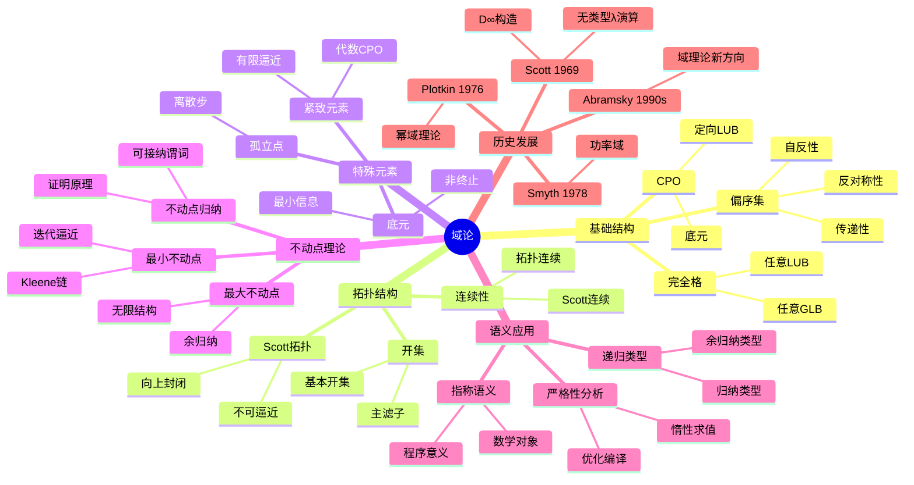
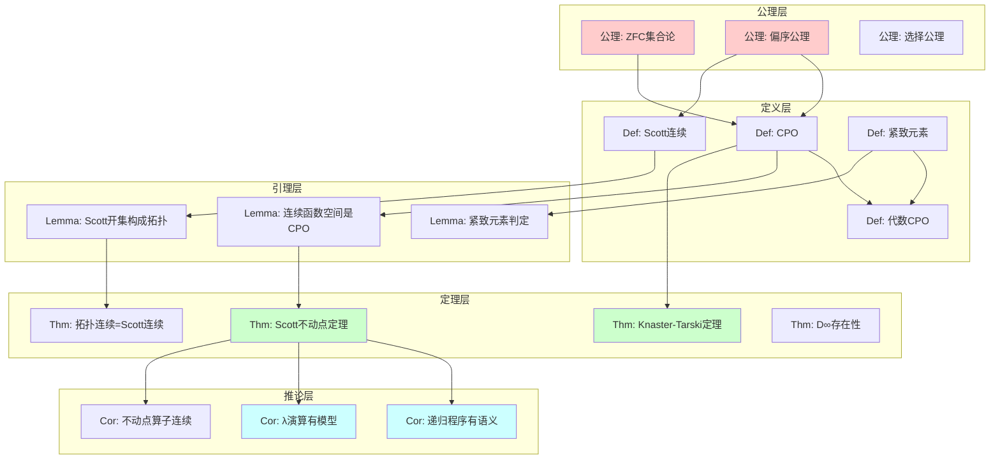
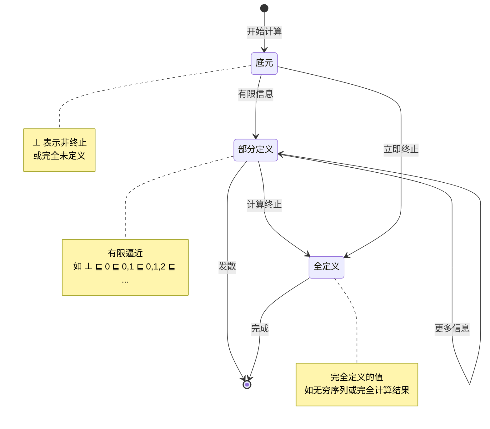
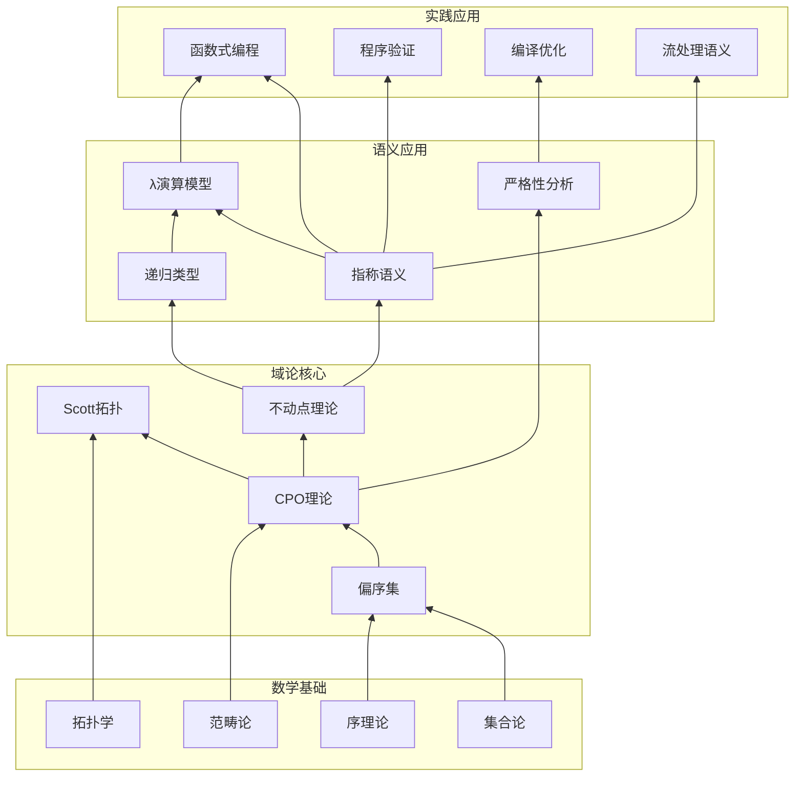
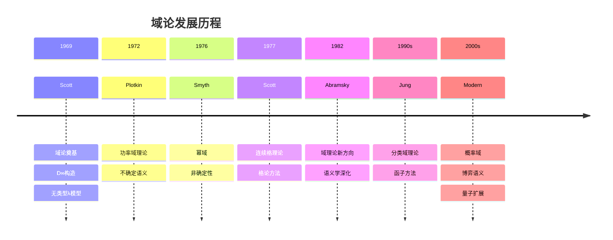
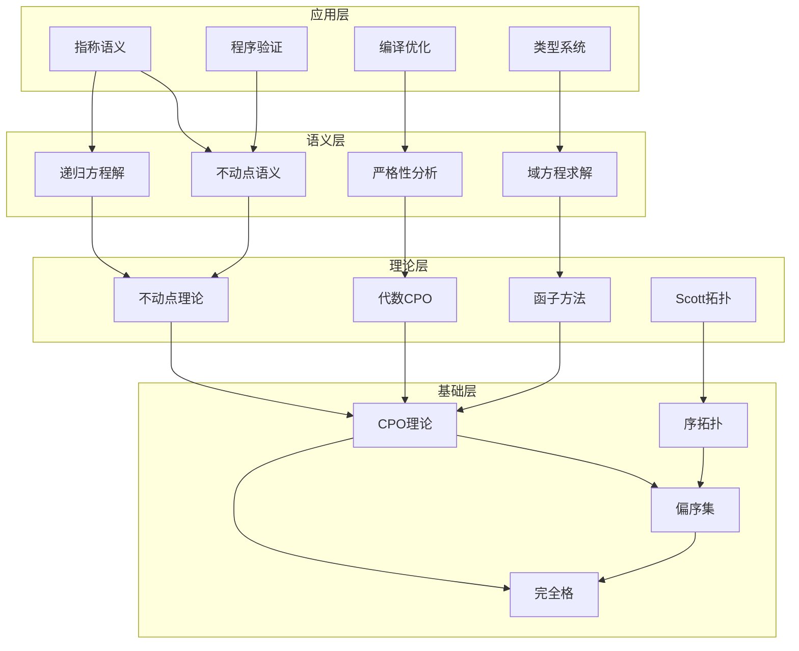

# Domain Theory (域论)

> **Wikipedia标准定义**: Domain theory is a branch of mathematics that studies special kinds of partially ordered sets (posets) commonly called domains. Consequently, domain theory can be considered as a branch of order theory. The field has major applications in computer science, where it is used to specify denotational semantics, especially for functional programming languages.
>
> **来源**: <https://en.wikipedia.org/wiki/Domain_theory>
>
> **形式化等级**: L3-L4

---

## 1. Wikipedia标准定义

### 英文原文

> "Domain theory is a branch of mathematics that studies special kinds of partially ordered sets (posets) commonly called domains. Consequently, domain theory can be considered as a branch of order theory. The field has major applications in computer science, where it is used to specify denotational semantics, especially for functional programming languages. Domain theory formalizes the intuitive ideas of approximation and convergence in a very general way and is closely related to topology."
>
> "Domain theory was introduced by Dana Scott in the late 1960s as a mathematical theory of programming languages. Scott wanted to provide a denotational semantics for the untyped lambda calculus, which requires solving the domain equation $D \cong [D \to D]$."

### 中文标准翻译

> **域论**是数学的一个分支，研究特殊类型的偏序集（通常称为域）。因此，域论可以被视为序理论的一个分支。该领域在计算机科学中有重要应用，用于指称语义规约，特别是函数式编程语言。域论以非常一般的形式化方式形式化了逼近和收敛的直观概念，并与拓扑学密切相关。
>
> 域论由 **Dana Scott** 在20世纪60年代末作为编程语言的数学理论引入。Scott希望为无类型λ演算提供指称语义，这需要解决域方程 $D \cong [D \to D]$。

---

## 2. 形式化表达

### 2.1 偏序集 (Partially Ordered Set, Poset)

**Def-S-98-01** (偏序集). 偏序集是一个二元组 $(D, \sqsubseteq)$，其中：

- $D$ 是一个集合
- $\sqsubseteq \subseteq D \times D$ 是一个二元关系，满足：
  1. **自反性**: $\forall x \in D. x \sqsubseteq x$
  2. **反对称性**: $\forall x, y \in D. (x \sqsubseteq y \land y \sqsubseteq x) \Rightarrow x = y$
  3. **传递性**: $\forall x, y, z \in D. (x \sqsubseteq y \land y \sqsubseteq z) \Rightarrow x \sqsubseteq z$

**Def-S-98-02** (定向集). 子集 $S \subseteq D$ 是**定向的**（directed），当且仅当：

$$\forall x, y \in S. \exists z \in S. (x \sqsubseteq z \land y \sqsubseteq z)$$

即 $S$ 中任意两个元素都有上界在 $S$ 中。

**Def-S-98-03** (链). 子集 $S \subseteq D$ 是**链**（chain），当且仅当：

$$\forall x, y \in S. (x \sqsubseteq y \lor y \sqsubseteq x)$$

即 $S$ 中任意两个元素都是可比较的。

### 2.2 完全偏序 (Complete Partial Order, CPO)

**Def-S-98-04** (完全偏序, CPO). 完全偏序是一个偏序集 $(D, \sqsubseteq)$ 满足：

1. **有底元**: 存在最小元素 $\bot \in D$，使得 $\forall x \in D. \bot \sqsubseteq x$
2. **定向最小上界存在**: 对任意定向子集 $S \subseteq D$，最小上界 $\bigsqcup S$ 存在

形式化地，$\bigsqcup S$ 满足：

- **上界**: $\forall x \in S. x \sqsubseteq \bigsqcup S$
- **最小性**: $\forall y \in D. (\forall x \in S. x \sqsubseteq y) \Rightarrow \bigsqcup S \sqsubseteq y$

**Def-S-98-05** ($\omega$-CPO). 若偏序集 $(D, \sqsubseteq)$ 有底元，且每个可数链都有最小上界，则称为 $\omega$-CPO。

**Lemma-S-98-01**. 每个CPO都是$\omega$-CPO，但反之不成立。

*证明*: 可数链是定向集的特例。反例：考虑不可数反链添加底元，它是$\omega$-CPO但不是CPO。∎

### 2.3 Scott连续性

**Def-S-98-06** (Scott连续函数). 函数 $f: D \to E$ 在CPO之间是**Scott连续的**，当且仅当：

1. **单调性**: $\forall x, y \in D. x \sqsubseteq_D y \Rightarrow f(x) \sqsubseteq_E f(y)$
2. **保持定向LUB**: 对任意定向集 $S \subseteq D$：

$$f\left(\bigsqcup_D S\right) = \bigsqcup_E \{f(s) \mid s \in S\}$$

**Def-S-98-07** (连续函数空间). 记 $[D \to E]$ 为从 $D$ 到 $E$ 的所有Scott连续函数集合，配备逐点序：

$$f \sqsubseteq_{[D \to E]} g \triangleq \forall x \in D. f(x) \sqsubseteq_E g(x)$$

**Lemma-S-98-02**. 若 $D, E$ 是CPO，则 $[D \to E]$ 也是CPO。

### 2.4 紧致元素

**Def-S-98-08** (紧致元素). 元素 $c \in D$ 是**紧致的**（compact 或 finite），当且仅当：

$$\forall \text{定向集 } S \subseteq D. \left(c \sqsubseteq \bigsqcup S \Rightarrow \exists s \in S. c \sqsubseteq s\right)$$

直观上，$c$ 紧致意味着 $c$ 的任何上界逼近都必须被某个有限阶段达到。

**Def-S-98-09** (代数CPO). CPO $D$ 是**代数的**，当且仅当：

$$\forall x \in D. x = \bigsqcup \{c \in D \mid c \text{ 紧致} \land c \sqsubseteq x\}$$

即每个元素都是其下方紧致元素的LUB。

**Def-S-98-10** (Scott域). 一个**Scott域**是满足以下条件的代数CPO：

1. 紧致元素构成的集合是可数的
2. 任意两个有上界的紧致元素有最小上界（且也是紧致的）

---

## 3. Scott拓扑

### 3.1 Scott拓扑的定义

**Def-S-98-11** (Scott拓扑). CPO $(D, \sqsubseteq)$ 上的**Scott拓扑** $\sigma(D)$ 定义为：

子集 $U \subseteq D$ 是开集，当且仅当：

1. **向上封闭**: $\forall x \in U. \forall y \in D. (x \sqsubseteq y \Rightarrow y \in U)$
2. **不可由定向LUB逼近**: $\forall \text{定向集 } S \subseteq D. \left(\bigsqcup S \in U \Rightarrow \exists s \in S. s \in U\right)$

**Lemma-S-98-03**. Scott开集恰好是Scott拓扑的拓扑开集。

### 3.2 Scott拓扑的性质

**Prop-S-98-01** (Scott拓扑的基本性质).

1. $D$ 中的闭集恰好是下集（lower sets）且在定向LUB下封闭
2. 所有主滤子 $\uparrow x = \{y \mid x \sqsubseteq y\}$ 都是开集
3. Scott拓扑是 $T_0$ 的，但一般不是 $T_1$ 的

**Def-S-98-12** (Scott开滤子基). 对紧致元素 $c$，定义基本开集：

$$\uparrow c = \{x \in D \mid c \sqsubseteq x\}$$

对于代数CPO，$\{\uparrow c \mid c \text{ 紧致}\}$ 构成Scott拓扑的一个基。

### 3.3 拓扑连续性等价

**Thm-S-98-01** (拓扑连续等价Scott连续). 函数 $f: D \to E$ 是Scott连续的（按Def-S-98-06）当且仅当 $f$ 关于Scott拓扑是拓扑连续的。

*证明*:

**($\Rightarrow$)** 设 $f$ Scott连续，$V \subseteq E$ Scott开。

- $f^{-1}(V)$ 向上封闭：若 $x \in f^{-1}(V)$ 且 $x \sqsubseteq y$，则 $f(x) \sqsubseteq f(y)$，故 $f(y) \in V$，即 $y \in f^{-1}(V)$
- $f^{-1}(V)$ 满足开集条件：设 $\bigsqcup S \in f^{-1}(V)$，则 $f(\bigsqcup S) = \bigsqcup f(S) \in V$，故 $\exists s \in S. f(s) \in V$

**($\Leftarrow$)** 设 $f$ 拓扑连续。

- 单调性：$x \sqsubseteq y$ 但 $f(x) \not\sqsubseteq f(y)$，则存在开集 $V$ 分离，与连续性矛盾
- 保持LUB：由开集定义直接可得 ∎

---

## 4. 不动点理论

### 4.1 最小不动点 (Least Fixed Point)

**Def-S-98-13** (不动点). 对函数 $f: D \to D$，元素 $x \in D$ 是**不动点**，当且仅当 $f(x) = x$。

**Def-S-98-14** (最小不动点). $x$ 是 $f$ 的**最小不动点**，记作 $\mu f$ 或 $\text{fix}(f)$，当且仅当：

1. $f(x) = x$（是不动点）
2. $\forall y \in D. (f(y) = y \Rightarrow x \sqsubseteq y)$（是最小的）

### 4.2 Knaster-Tarski定理

**Thm-S-98-02** (Knaster-Tarski不动点定理). 设 $(L, \sqsubseteq)$ 是完全格，$f: L \to L$ 是单调函数，则：

$$\mu f = \bigsqcup \{x \in L \mid x \sqsubseteq f(x)\}$$

是 $f$ 的最小不动点。

*证明*:

设 $S = \{x \in L \mid x \sqsubseteq f(x)\}$，$u = \bigsqcup S$。

**步骤1**: 证明 $u \sqsubseteq f(u)$。

对任意 $x \in S$，$x \sqsubseteq u$，由单调性 $f(x) \sqsubseteq f(u)$。因 $x \sqsubseteq f(x)$，有 $x \sqsubseteq f(u)$。故 $u = \bigsqcup S \sqsubseteq f(u)$。

**步骤2**: 证明 $f(u) \sqsubseteq u$。

由步骤1，$u \sqsubseteq f(u)$，故 $f(u) \sqsubseteq f(f(u))$，即 $f(u) \in S$。因此 $f(u) \sqsubseteq \bigsqcup S = u$。

**步骤3**: 证明最小性。

设 $v$ 是任意不动点，则 $v \sqsubseteq f(v) = v$，故 $v \in S$，因此 $u \sqsubseteq v$。∎

### 4.3 Scott不动点定理

**Thm-S-98-03** (Scott不动点定理). 设 $(D, \sqsubseteq)$ 是CPO，$f: D \to D$ 是Scott连续函数，则：

1. $f$ 有最小不动点
2. 最小不动点可计算为：$\mu f = \bigsqcup_{n \geq 0} f^n(\bot)$

其中 $f^0(x) = x$，$f^{n+1}(x) = f(f^n(x))$。

*详细证明见第7节*。

### 4.4 不动点归纳法

**Def-S-98-15** (可接纳谓词). 谓词 $P: D \to \mathbb{B}$ 是**可接纳的**（admissible），当且仅当：

$$\forall \text{定向集 } S \subseteq D. \left((\forall s \in S. P(s)) \Rightarrow P(\bigsqcup S)\right)$$

**Thm-S-98-04** (Scott不动点归纳). 设 $f: D \to D$ 连续，$P$ 是可接纳谓词，则：

$$\left(P(\bot) \land \forall x \in D. (P(x) \Rightarrow P(f(x)))\right) \Rightarrow P(\mu f)$$

---

## 5. 指称语义应用

### 5.1 程序语义的域论语义

**Def-S-98-16** (指称语义). 程序语言 $\mathcal{L}$ 的**指称语义**是一个解释函数：

$$\llbracket \cdot \rrbracket: \mathcal{L} \to D$$

将语法对象映射到数学对象（域元素），其中 $D$ 是适当的语义域。

**Def-S-98-17** (基本语义域). 常用语义域包括：

| 类型 | 语义域 | 解释 |
|------|--------|------|
| 无类型λ演算 | $D_\infty$ | $D \cong [D \to D]$ 的解 |
| 带错误 | $D_\bot$ | 提升构造 |
| 命令式 | $(S \to S_\bot)$ | 状态转换 |
| 并发 | 幂域 (Powerdomain) | 不确定性行为 |

### 5.2 递归方程的解

**Def-S-98-18** (递归域方程). 在指称语义中，递归类型对应于域方程：

$$D \cong F(D)$$

其中 $F$ 是域构造子函子（如积、和、函数空间、提升）。

**Thm-S-98-05** (逆极限定理). 对任意投影函子 $F$，域方程 $D \cong F(D)$ 在同构意义下有唯一解（在适当的范畴中）。

### 5.3 非终止的语义

**Def-S-98-19** (非终止). 程序的非终止由底元 $\bot$ 表示：

$$\llbracket \text{diverge} \rrbracket = \bot$$

**Def-S-98-20** (部分正确性与完全正确性).

- **部分正确性**: $\{P\}C\{Q\} \triangleq \forall s. (P(s) \Rightarrow (\llbracket C \rrbracket(s) \neq \bot \Rightarrow Q(\llbracket C \rrbracket(s))))$
- **完全正确性**: 加上终止性保证

---

## 6. 与递归类型的关系

### 6.1 递归类型的域论模型

**Def-S-98-21** (递归类型). 递归类型形如：

$$\mu \alpha. \tau$$

其中 $\alpha$ 是类型变量，$\tau$ 是类型表达式（可能包含$\alpha$）。

**Def-S-98-22** (递归类型的语义). 递归类型的语义是其展开的不动点：

$$\llbracket \mu \alpha. \tau \rrbracket = \mu \left(\lambda X. \llbracket \tau \rrbracket_{[\alpha \mapsto X]}\right)$$

### 6.2 典型递归类型

| 类型定义 | 语义域 | 不动点 |
|----------|--------|--------|
| `nat = Z \| S nat` | $\mathbb{N}_\bot$ | $\mu X. (1 + X)_\bot$ |
| `list A = Nil \| Cons A (list A)` | $[A]_\bot$ | $\mu X. (1 + A \times X)_\bot$ |
| `stream A = Cons A (stream A)` | $A^\omega$ | 最大不动点 $\nu X. A \times X$ |
| `lazy A = Delay A` | $A_\bot$ | $\mu X. X_\bot$ |

### 6.3 余递归与最大不动点

**Def-S-98-23** (最大不动点). 对完全格上的单调函数 $f$：

$$\nu f = \sqcap_{n \geq 0} f^n(\top)$$

表示**最大不动点**，用于建模无限数据结构（如流）。

**Def-S-98-24** (归纳类型 vs 余归纳类型).

| 特征 | 归纳类型 ($\mu$) | 余归纳类型 ($\nu$) |
|------|------------------|-------------------|
| 不动点 | 最小不动点 | 最大不动点 |
| 构造子 | 有限构造 | 无限观察 |
| 消去子 | 递归 (fold) | 余递归 (unfold) |
| 典型例子 | 列表、树 | 流、进程 |
| 终止性 | 保证终止 | 可能无限 |

---

## 7. 形式证明

### 7.1 Scott不动点定理详细证明

**Thm-S-98-06** (Scott不动点定理完整版). 设 $(D, \sqsubseteq)$ 是CPO，$f: D \to D$ 是Scott连续函数，则：

1. **存在性**: $f$ 有最小不动点
2. **可计算性**: $\mu f = \bigsqcup_{n \geq 0} f^n(\bot)$
3. **唯一最小性**: 这是唯一的最小不动点

*详细证明*:

**步骤1**: 证明序列 $\{f^n(\bot)\}_{n \geq 0}$ 是链。

通过归纳：

- 基础: $\bot \sqsubseteq f(\bot)$（$\bot$ 是最小元）
- 归纳: 假设 $f^n(\bot) \sqsubseteq f^{n+1}(\bot)$，由单调性 $f^{n+1}(\bot) \sqsubseteq f^{n+2}(\bot)$

因此 $\{f^n(\bot)\}$ 是链，从而是定向集。

**步骤2**: 证明 $u = \bigsqcup_{n \geq 0} f^n(\bot)$ 存在。

由CPO定义，定向集有LUB。

**步骤3**: 证明 $u$ 是不动点。

$$\begin{aligned}
f(u) &= f\left(\bigsqcup_{n \geq 0} f^n(\bot)\right) \\
     &= \bigsqcup_{n \geq 0} f(f^n(\bot)) \quad \text{(Scott连续性)} \\
     &= \bigsqcup_{n \geq 0} f^{n+1}(\bot) \\
     &= \bigsqcup_{n \geq 1} f^n(\bot) \\
     &= \bigsqcup_{n \geq 0} f^n(\bot) \quad \text{(因为 } f^0(\bot) = \bot \text{ 是最小元)} \\
     &= u
\end{aligned}$$

**步骤4**: 证明 $u$ 是最小不动点。

设 $v$ 是任意不动点，即 $f(v) = v$。

通过归纳证明 $\forall n \geq 0. f^n(\bot) \sqsubseteq v$：
- 基础: $\bot \sqsubseteq v$
- 归纳: 若 $f^n(\bot) \sqsubseteq v$，则 $f^{n+1}(\bot) = f(f^n(\bot)) \sqsubseteq f(v) = v$

因此 $v$ 是所有 $f^n(\bot)$ 的上界，故 $u = \bigsqcup_{n \geq 0} f^n(\bot) \sqsubseteq v$。

∎

### 7.2 CPO中连续函数存在唯一最小不动点

**Thm-S-98-07** (唯一最小不动点定理). 设 $D$ 是CPO，$f: D \to D$ 是Scott连续函数，则：

1. $f$ 的不动点集合构成完全格
2. $\mu f$ 是此格的最小元
3. 若 $D$ 是完全格，则同时存在最大不动点 $\nu f$

*证明*:

**部分1**: 不动点集合非空（由Thm-S-98-06）。

**部分2**: 设 $F = \{x \in D \mid f(x) = x\}$ 是不动点集合。定义：

$$m = \bigsqcup \{x \in D \mid x \sqsubseteq f(x)\}$$

由Knaster-Tarski定理证明的方法，$m$ 是不动点且是最小的。

**部分3**: 对任意两个不动点 $a, b$，设 $a \sqcap b$ 在格中存在。

$$f(a \sqcap b) \sqsubseteq f(a) \sqcap f(b) = a \sqcap b$$

因此 $a \sqcap b$ 是前不动点，而最小不动点 $m \sqsubseteq a \sqcap b$。

**部分4**: 完全格情况的最大不动点。

对偶地定义：

$$M = \sqcap \{x \in D \mid f(x) \sqsubseteq x\}$$

类似证明 $M$ 是最大不动点。∎

### 7.3 不动点算子的连续性

**Thm-S-98-08** (不动点算子的连续性). 函数 $\text{fix}: [D \to D] \to D$，定义为 $\text{fix}(f) = \mu f$，是Scott连续的。

*证明*:

**单调性**: 设 $f \sqsubseteq g$（逐点）。通过归纳证明 $\forall n. f^n(\bot) \sqsubseteq g^n(\bot)$，从而 $\mu f \sqsubseteq \mu g$。

**保持LUB**: 设 $\{f_i\}$ 是定向的连续函数集：

$$\begin{aligned}
\text{fix}(\bigsqcup_i f_i) &= \bigsqcup_n (\bigsqcup_i f_i)^n(\bot) \\
&= \bigsqcup_n \bigsqcup_i f_i^n(\bot) \quad \text{(连续性)} \\
&= \bigsqcup_i \bigsqcup_n f_i^n(\bot) \quad \text{(LUB交换)} \\
&= \bigsqcup_i \text{fix}(f_i)
\end{aligned}$$∎

---

## 8. 八维表征

### 8.1 思维导图



### 8.2 多维对比矩阵

| 维度 | 偏序集 | $\omega$-CPO | CPO | 完全格 | Scott域 |
|------|--------|--------------|-----|--------|---------|
| 底元 | 可选 | 必需 | 必需 | 可选 | 必需 |
| 链LUB | 否 | 可数链 | 所有定向 | 所有子集 | 定向 |
| 紧致元素 | 无 | 无 | 无 | 无 | 稠密 |
| 可数性 | 不要求 | 不要求 | 不要求 | 不要求 | 要求 |
| 适用场景 | 一般序 | 序列语义 | 一般语义 | 逻辑 | 可计算性 |

### 8.3 公理-定理树



### 8.4 状态转换图



### 8.5 依赖关系图



### 8.6 演化时间线



### 8.7 层次架构图



### 8.8 证明搜索树

```mermaid
graph TD
    A[证明目标: f有最小不动点] --> B{证明策略}

    B -->|构造法| C[Kleene序列]
    B -->|Tarski法| D[前不动点集]

    C --> C1[定义序列: a₀=⊥, aₙ₊₁=f(aₙ)]
    C1 --> C2[证明是链]
    C2 --> C3[归纳: aₙ ⊑ aₙ₊₁]
    C3 --> C4[使用单调性]

    C4 --> C5[取LUB: a=⨆aₙ]
    C5 --> C6[证明f(a)=a]
    C6 --> C7[Scott连续性]

    C7 --> C8[证明最小性]
    C8 --> C9[任取不动点b]
    C9 --> C10[归纳: aₙ ⊑ b]
    C10 --> C11[a=⨆aₙ ⊑ b]

    D --> D1[定义P={x|x⊑f(x)}]
    D1 --> D2[p=⨆P]
    D2 --> D3[证明p∈P]
    D3 --> D4[证明f(p)=p]
    D4 --> D5[证明最小性]

    C11 --> E[证明完成]
    D5 --> E

    style E fill:#ccffcc
    style C4 fill:#ffffcc
    style D4 fill:#ffffcc
```

---

## 9. 引用参考

### Wikipedia原文引用

[^1]: Wikipedia contributors. "Domain theory." Wikipedia, The Free Encyclopedia. <https://en.wikipedia.org/wiki/Domain_theory>

### 经典文献

[^2]: Scott, D.S. "Continuous Lattices." *Toposes, Algebraic Geometry and Logic* (1972): 97-136. DOI: 10.1007/BFb0073967

[^3]: Scott, D.S. "Data Types as Lattices." *SIAM Journal on Computing* 5.3 (1976): 522-587. DOI: 10.1137/0205037

[^4]: Scott, D.S. and Strachey, C. "Towards a Mathematical Semantics for Computer Languages." *Proceedings of the Symposium on Computers and Automata* (1971): 19-46.

[^5]: Plotkin, G.D. "A Powerdomain Construction." *SIAM Journal on Computing* 5.3 (1976): 452-487. DOI: 10.1137/0205035

[^6]: Plotkin, G.D. "LCF Considered as a Programming Language." *Theoretical Computer Science* 5.3 (1977): 223-255. DOI: 10.1016/0304-3975(77)90044-5

[^7]: Abramsky, S. and Jung, A. "Domain Theory." In: *Handbook of Logic in Computer Science*, Vol. 3, Oxford University Press (1994): 1-168. ISBN: 978-0198537625

[^8]: Gunter, C.A. *Semantics of Programming Languages: Structures and Techniques*. MIT Press (1992). ISBN: 978-0262570954

[^9]: Winskel, G. *The Formal Semantics of Programming Languages: An Introduction*. MIT Press (1993). ISBN: 978-0262731034

[^10]: Amadio, R.M. and Curien, P.L. *Domains and Lambda-Calculi*. Cambridge University Press (1998). ISBN: 978-0521062929

[^11]: Smyth, M.B. "Power Domains." *Journal of Computer and System Sciences* 16.1 (1978): 23-36. DOI: 10.1016/0022-0000(78)90048-X

[^12]: Jung, A. *Cartesian Closed Categories of Domains*. Ph.D. Thesis, Technische Hochschule Darmstadt (1988).

[^13]: Tarski, A. "A Lattice-Theoretical Fixpoint Theorem and its Applications." *Pacific Journal of Mathematics* 5.2 (1955): 285-309. DOI: 10.2140/pjm.1955.5.285

[^14]: Kleene, S.C. "Introduction to Metamathematics." North-Holland (1952). ISBN: 978-0923891572

---

## 10. 相关概念

- [Type Theory](07-type-theory.md)
- [Category Theory](25-category-theory.md)
- [Formal Methods](01-formal-methods.md)
- [Order Theory](../../01-foundations/01-order-theory.md)
- [Lambda Calculus](../../02-calculi/01-w-calculus-family/01-omega-calculus.md)

---

> **概念标签**: #域论 #指称语义 #不动点 #CPO #Scott拓扑 #函数式编程 #程序语义
>
> **学习难度**: ⭐⭐⭐⭐ (高级)
>
> **先修概念**: 序理论、λ演算、拓扑学基础
>
> **后续概念**: 指称语义、递归类型、程序验证
