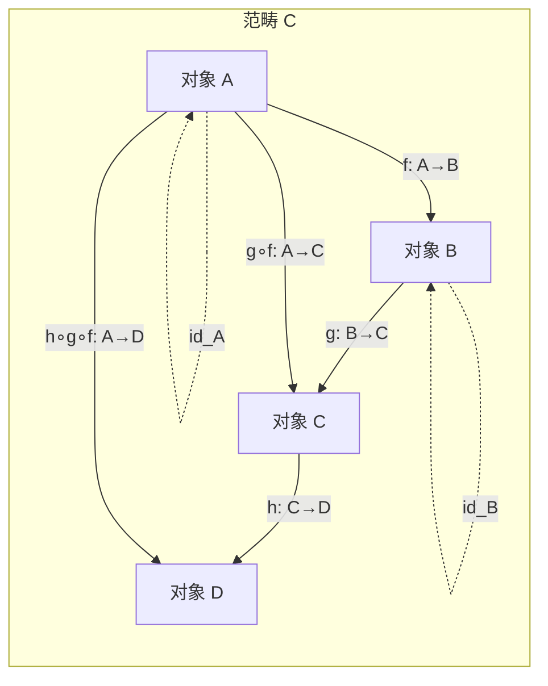
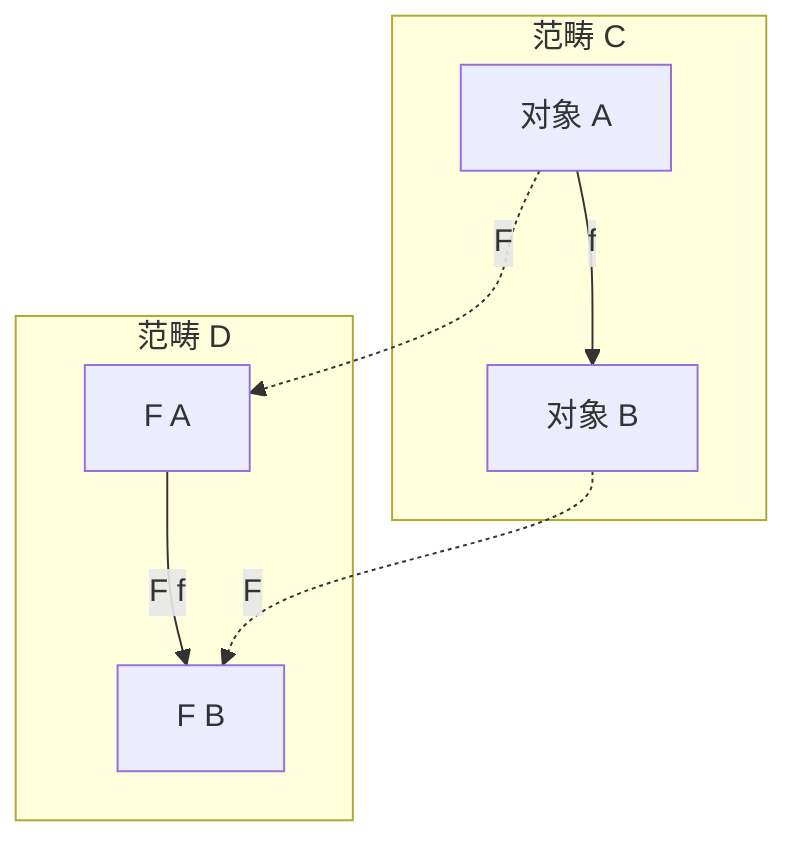
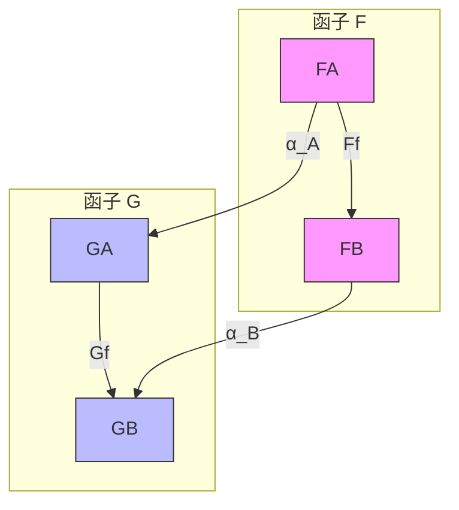
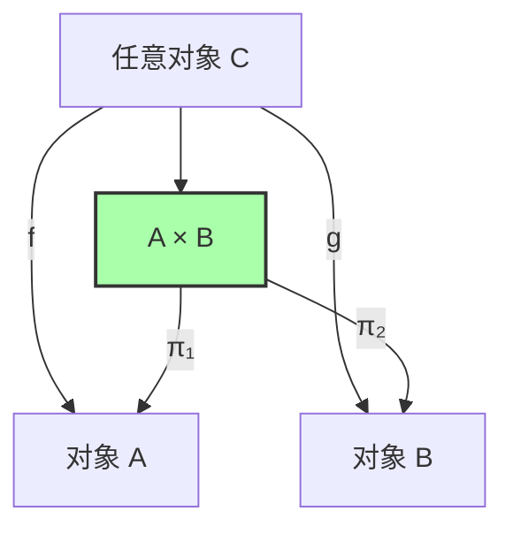
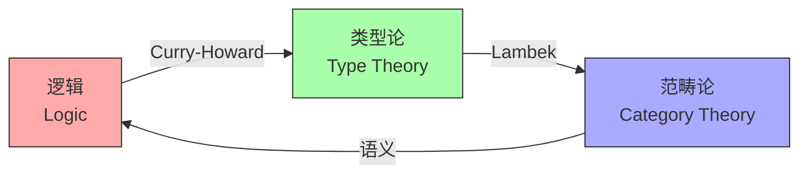
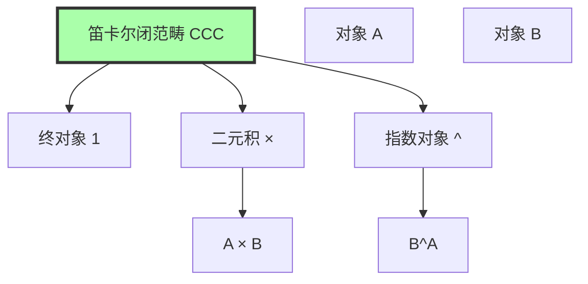
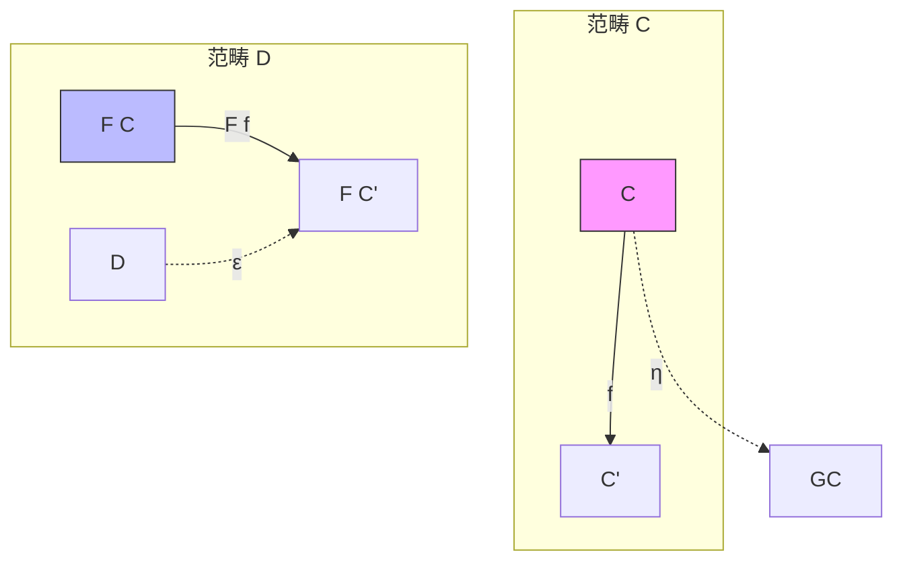

# Category Theory (范畴论)

> **Wikipedia标准定义**: Category theory is a general theory of mathematical structures and their relations. It was introduced by Samuel Eilenberg and Saunders Mac Lane in the middle of the 20th century in their foundational work on algebraic topology.
>
> **来源**: <https://en.wikipedia.org/wiki/Category_theory>
>
> **所属阶段**: formal-methods/98-appendices | **前置依赖**: [Type Theory](07-type-theory.md) | **形式化等级**: L5-L6

---

## 1. 概念定义 (Definitions)

### 1.1 Wikipedia标准定义

#### 英文原文

> "Category theory is a general theory of mathematical structures and their relations. It was introduced by Samuel Eilenberg and Saunders Mac Lane in the middle of the 20th century in their foundational work on algebraic topology. Category theory is used in almost all areas of mathematics, and in some areas of computer science. Modern category theory is the study of categories, which are collections of objects and morphisms (or arrows). A category has two basic properties: the ability to compose the arrows associatively and the existence of an identity arrow for each object."

#### 中文标准翻译

> 范畴论是**数学结构及其关系的通用理论**。它由**Samuel Eilenberg**和**Saunders Mac Lane**在20世纪中叶提出，源于他们在代数拓扑学上的奠基性工作。现代范畴论研究**范畴（categories）**，即**对象（objects）**和**态射/箭头（morphisms/arrows）**的集合。每个范畴具有两个基本性质：**态射可结合地复合**的能力，以及**每个对象存在单位态射**。

**Def-S-98-01** (范畴的Eilenberg-Mac Lane定义, 1945). 范畴 $\mathcal{C}$ 由以下部分组成：

$$
\mathcal{C} = (\text{Ob}(\mathcal{C}), \text{Hom}_{\mathcal{C}}, \circ, \text{id})
$$

其中：
- $\text{Ob}(\mathcal{C})$：对象类（class of objects）
- $\text{Hom}_{\mathcal{C}}(A, B)$：从对象 $A$ 到对象 $B$ 的态射集合
- $\circ$：态射复合运算
- $\text{id}_A: A \to A$：对象 $A$ 的单位态射

---

### 1.2 形式化表达

**Def-S-98-02** (对象与态射). 在范畴 $\mathcal{C}$ 中：

| 符号 | 含义 | 读法 |
|------|------|------|
| $A \in \text{Ob}(\mathcal{C})$ | $A$ 是 $\mathcal{C}$ 的对象 | "A is an object of C" |
| $f: A \to B$ 或 $f \in \text{Hom}_{\mathcal{C}}(A, B)$ | $f$ 是从 $A$ 到 $B$ 的态射 | "f is a morphism from A to B" |
| $\text{dom}(f) = A$ | $f$ 的定义域是 $A$ | domain |
| $\text{cod}(f) = B$ | $f$ 的余定义域是 $B$ | codomain |

**Def-S-98-03** (态射复合, Composition). 对于态射 $f: A \to B$ 和 $g: B \to C$，其复合 $g \circ f: A \to C$ 定义为：

$$
\frac{f: A \to B \quad g: B \to C}{g \circ f: A \to C}
$$

复合运算满足以下公理：

**Def-S-98-04** (结合律, Associativity). 对于任意 $f: A \to B$, $g: B \to C$, $h: C \to D$：

$$
(h \circ g) \circ f = h \circ (g \circ f)
$$

图示：
$$
\begin{array}{ccccc}
A & \xrightarrow{f} & B & \xrightarrow{g} & C & \xrightarrow{h} & D \\
\downarrow & & \downarrow & & \downarrow \\
A & \xrightarrow{g \circ f} & C & \xrightarrow{h} & D \\
\downarrow & & \downarrow \\
A & \xrightarrow{h \circ (g \circ f)} & D
\end{array}
$$

**Def-S-98-05** (单位态射, Identity Morphism). 对每个对象 $A$，存在单位态射 $\text{id}_A: A \to A$ 满足：

$$
\forall f: A \to B: \quad f \circ \text{id}_A = f = \text{id}_B \circ f
$$

**Def-S-98-06** (小范畴与局部小范畴). 

- **小范畴** (Small category)：$\text{Ob}(\mathcal{C})$ 是集合（而非真类）
- **局部小范畴** (Locally small category)：对所有 $A, B$，$\text{Hom}_{\mathcal{C}}(A, B)$ 是集合

---

### 1.3 函子 (Functor)

**Def-S-98-07** (函子). 函子 $F: \mathcal{C} \to \mathcal{D}$ 是两个范畴之间的结构保持映射，包含：

1. **对象映射**：$A \mapsto F(A)$，其中 $A \in \text{Ob}(\mathcal{C})$, $F(A) \in \text{Ob}(\mathcal{D})$
2. **态射映射**：$(f: A \to B) \mapsto (F(f): F(A) \to F(B))$

满足函子公理：
- **保持复合**：$F(g \circ_{\mathcal{C}} f) = F(g) \circ_{\mathcal{D}} F(f)$
- **保持单位**：$F(\text{id}_A) = \text{id}_{F(A)}$

**Def-S-98-08** (协变与逆变函子).

- **协变函子** (Covariant)：如上定义，保持箭头方向
- **逆变函子** (Contravariant)：$F: \mathcal{C}^{\text{op}} \to \mathcal{D}$，反转箭头方向：
  $$F(g \circ f) = F(f) \circ F(g)$$

**Def-S-98-09** (特殊函子类型).

| 函子类型 | 定义 | 符号 |
|----------|------|------|
| 恒等函子 | $\text{Id}_{\mathcal{C}}(A) = A$, $\text{Id}_{\mathcal{C}}(f) = f$ | $\text{Id}_{\mathcal{C}}$ |
| 遗忘函子 | 忘记某些结构 | $U: \mathbf{Grp} \to \mathbf{Set}$ |
| 自由函子 | 自由构造 | $F: \mathbf{Set} \to \mathbf{Grp}$ |
| Hom函子 | $\text{Hom}(A, -): \mathcal{C} \to \mathbf{Set}$ | $h^A$ |

---

### 1.4 自然变换 (Natural Transformation)

**Def-S-98-10** (自然变换). 给定函子 $F, G: \mathcal{C} \to \mathcal{D}$，自然变换 $\alpha: F \Rightarrow G$ 为每个对象 $A \in \mathcal{C}$ 指定一个分量态射 $\alpha_A: F(A) \to G(A)$，使得对任意 $f: A \to B$ 满足**自然性条件**：

$$
G(f) \circ \alpha_A = \alpha_B \circ F(f)
$$

即下图交换：

$$
\begin{array}{ccc}
F(A) & \xrightarrow{\alpha_A} & G(A) \\
F(f) \downarrow & & \downarrow G(f) \\
F(B) & \xrightarrow{\alpha_B} & G(B)
\end{array}
$$

**Def-S-98-11** (自然同构). 若每个 $\alpha_A$ 都是同构，则称 $\alpha$ 为**自然同构**，记作 $F \cong G$。

**Def-S-98-12** (函子范畴). 范畴 $[\mathcal{C}, \mathcal{D}]$ 或 $\mathcal{D}^{\mathcal{C}}$ 的对象是函子 $F: \mathcal{C} \to \mathcal{D}$，态射是自然变换。

---

### 1.5 泛性质 (Universal Properties)

**Def-S-98-13** (泛性质). 给定范畴 $\mathcal{C}$ 和函子 $F: \mathcal{J} \to \mathcal{C}$，泛性质刻画了某种"最优"的构造：

对象 $U \in \mathcal{C}$ 连同态射族 $(u_j: U \to F(j))_{j \in \mathcal{J}}$ 是**泛锥（universal cone）**，如果对任意其他锥 $(C, (c_j))$，存在唯一的 $f: C \to U$ 使得对所有 $j$：

$$
u_j \circ f = c_j
$$

---

#### 1.5.1 积 (Product)

**Def-S-98-14** (二元积). 对象 $A$ 和 $B$ 的**积**是对象 $A \times B$ 连同投影态射：

$$
\pi_1: A \times B \to A, \quad \pi_2: A \times B \to B
$$

满足泛性质：对任意对象 $C$ 和态射 $f: C \to A$, $g: C \to B$，存在唯一的 $\langle f, g \rangle: C \to A \times B$ 使得：

$$
\pi_1 \circ \langle f, g \rangle = f, \quad \pi_2 \circ \langle f, g \rangle = g
$$

图示：
$$
\begin{array}{ccc}
 & & C \\
 & \swarrow^{\langle f, g \rangle} & \downarrow^{f} & \searrow^{g} \\
A & \xleftarrow{\pi_1} & A \times B & \xrightarrow{\pi_2} & B
\end{array}
$$

---

#### 1.5.2 余积 (Coproduct)

**Def-S-98-15** (二元余积). 对象 $A$ 和 $B$ 的**余积**是对象 $A + B$（或 $A \sqcup B$）连同内射态射：

$$
i_1: A \to A + B, \quad \iota_2: B \to A + B
$$

满足泛性质：对任意对象 $C$ 和态射 $f: A \to C$, $g: B \to C$，存在唯一的 $[f, g]: A + B \to C$ 使得：

$$
[f, g] \circ \iota_1 = f, \quad [f, g] \circ \iota_2 = g
$$

图示：
$$
\begin{array}{ccc}
A & \xrightarrow{\iota_1} & A + B & \xleftarrow{\iota_2} & B \\
\downarrow^{f} & \swarrow^{[f, g]} & \downarrow^{g} & \searrow \\
C & & & & C
\end{array}
$$

---

#### 1.5.3 指数对象 (Exponential)

**Def-S-98-16** (指数对象). 对象 $B$ 的"$A$ 次幂"或指数对象是对象 $B^A$（也记作 $A \Rightarrow B$）连同求值态射：

$$
\text{eval}: B^A \times A \to B
$$

满足泛性质：对任意对象 $C$ 和态射 $f: C \times A \to B$，存在唯一的 $\lambda f: C \to B^A$ 使得：

$$
\text{eval} \circ (\lambda f \times \text{id}_A) = f
$$

图示（Currying）：
$$
\begin{array}{ccc}
C \times A & \xrightarrow{f} & B \\
\downarrow^{\lambda f \times \text{id}_A} & \nearrow_{\text{eval}} & \\
B^A \times A & &
\end{array}
$$

---

### 1.6 笛卡尔闭范畴 (Cartesian Closed Category, CCC)

**Def-S-98-17** (笛卡尔闭范畴). 范畴 $\mathcal{C}$ 是**笛卡尔闭范畴**（CCC），如果它满足：

1. **有终对象**：存在对象 $1$ 使得对所有 $A$，存在唯一的 $!_A: A \to 1$
2. **有二元积**：对任意 $A, B$，积 $A \times B$ 存在
3. **有指数对象**：对任意 $A, B$，指数对象 $B^A$ 存在

**Lemma-S-98-01** (CCC的基本性质). 在CCC中，以下自然同构成立：

$$
\text{Hom}(A \times B, C) \cong \text{Hom}(A, C^B) \cong \text{Hom}(B, C^A)
$$

这即是**Currying/去Currying**的范畴论表达。

---

## 2. 属性推导 (Properties)

### 2.1 基本范畴例子

**Prop-S-98-01** (常见范畴).

| 范畴 | 对象 | 态射 | 说明 |
|------|------|------|------|
| $\mathbf{Set}$ | 集合 | 函数 | 局部小范畴 |
| $\mathbf{Grp}$ | 群 | 群同态 | 代数范畴 |
| $\mathbf{Top}$ | 拓扑空间 | 连续映射 | 拓扑范畴 |
| $\mathbf{Vec}_k$ | $k$-向量空间 | 线性映射 | 线性代数 |
| $\mathbf{Pos}$ | 偏序集 | 单调函数 | 序范畴 |
| $\mathbf{Cat}$ | 小范畴 | 函子 | 范畴的范畴 |

**Prop-S-98-02** (预序作为范畴). 预序集 $(P, \leq)$ 可视为范畴，其中：
- 对象是 $P$ 的元素
- 存在态射 $p \to q$ 当且仅当 $p \leq q$
- 至多一个态射（thin category）

**Prop-S-98-03** (幺半群作为范畴). 幺半群 $(M, \cdot, e)$ 可视为只有一个对象 $*$ 的范畴，其中：
- 对象：$*$
- 态射：$m: * \to *$ 对应 $m \in M$
- 复合：$m \circ n = m \cdot n$
- 单位：$\text{id}_* = e$

---

### 2.2 特殊态射类型

**Def-S-98-18** (单态射与满态射).

- **单态射** (Monomorphism)：$f: A \to B$ 是单的，如果：
  $$\forall g, h: C \to A: \quad f \circ g = f \circ h \Rightarrow g = h$$
  
- **满态射** (Epimorphism)：$f: A \to B$ 是满的，如果：
  $$\forall g, h: B \to C: \quad g \circ f = h \circ f \Rightarrow g = h$$

**Def-S-98-19** (同构). 态射 $f: A \to B$ 是**同构**，如果存在 $f^{-1}: B \to A$ 使得：

$$
f^{-1} \circ f = \text{id}_A, \quad f \circ f^{-1} = \text{id}_B
$$

记作 $A \cong B$。

**Lemma-S-98-02**. 同构既是单的也是满的，但反之不成立（除非在$\mathbf{Set}$等良态范畴中）。

---

### 2.3 函子的性质

**Def-S-98-20** (函子性质分类).

| 性质 | 定义 | 意义 |
|------|------|------|
| **忠实** (Faithful) | $F_{A,B}: \text{Hom}(A,B) \to \text{Hom}(F(A),F(B))$ 单射 | 保持态射区分 |
| **满** (Full) | $F_{A,B}$ 满射 | 保持态射丰富性 |
| **完全忠实** (Fully faithful) | $F_{A,B}$ 双射 | 范畴嵌入 |
| **本质满** (Essentially surjective) | $\forall D \in \mathcal{D}, \exists C: F(C) \cong D$ | 覆盖对象 |

**Def-S-98-21** (范畴等价). 函子 $F: \mathcal{C} \to \mathcal{D}$ 是**范畴等价**，如果存在函子 $G: \mathcal{D} \to \mathcal{C}$ 使得：

$$
G \circ F \cong \text{Id}_{\mathcal{C}}, \quad F \circ G \cong \text{Id}_{\mathcal{D}}
$$

**Prop-S-98-04** (等价的刻画). $F$ 是范畴等价当且仅当 $F$ 是完全忠实的且本质满的。

---

## 3. 关系建立 (Relations)

### 3.1 与λ演算的对应 (Curry-Howard-Lambek)

**Def-S-98-22** (Curry-Howard-Lambek对应). 以下三个领域存在深层同构：

| 逻辑 (Logic) | 类型论 (Type Theory) | 范畴论 (Category Theory) |
|--------------|----------------------|--------------------------|
| 命题 $P$ | 类型 $P$ | 对象 $P$ |
| 证明 $p: P$ | 项 $p : P$ | 态射 $p: 1 \to P$ |
| $P \Rightarrow Q$ | 函数类型 $P \to Q$ | 指数对象 $Q^P$ |
| $P \land Q$ | 积类型 $P \times Q$ | 积 $P \times Q$ |
| $P \lor Q$ | 和类型 $P + Q$ | 余积 $P + Q$ |
| $\top$ (真) | 单位类型 $()$ | 终对象 $1$ |
| $\bot$ (假) | 空类型 $\text{Void}$ | 始对象 $0$ |
| 证明变换 | 程序变换 | 自然变换 |
| 逻辑等价 | 类型同构 | 范畴等价 |

---

### 3.2 伴随函子 (Adjunction)

**Def-S-98-23** (伴随). 函子 $F: \mathcal{C} \to \mathcal{D}$ 和 $G: \mathcal{D} \to \mathcal{C}$ 构成**伴随**，记作 $F \dashv G$，如果存在自然同构：

$$
\text{Hom}_{\mathcal{D}}(F(C), D) \cong \text{Hom}_{\mathcal{C}}(C, G(D))
$$

$F$ 称为**左伴随**，$G$ 称为**右伴随**。

**Prop-S-98-05** (伴随与逻辑量词). 在逻辑语义中，伴随对应量词：

$$
\exists \dashv \Delta \dashv \forall
$$

其中 $\Delta$ 是对角函子（复制），$\exists$ 是存在量词（余积），$\forall$ 是全称量词（积）。

---

### 3.3 在类型论中的应用

**Prop-S-98-06** (类型构造子的范畴解释).

| 类型构造子 | 范畴结构 | 说明 |
|------------|----------|------|
| 函数类型 $A \to B$ | 指数对象 $B^A$ | CCC的核心 |
| 积类型 $A \times B$ | 范畴积 | 配对/记录类型 |
| 和类型 $A + B$ | 范畴余积 | 变体/枚举类型 |
| 单位类型 $()$ | 终对象 | void返回 |
| 空类型 $\bot$ | 始对象 | 不可能类型 |
| 递归类型 $\mu X.F(X)$ | 初始代数 | 归纳数据 |
| 余递归类型 $\nu X.F(X)$ | 终余代数 | 共归纳数据 |

---

### 3.4 与序理论的对应

**Prop-S-98-07** (Galois连接作为伴随). 预序间的Galois连接 $(f, g)$：

$$
f(p) \leq q \Leftrightarrow p \leq g(q)
$$

正是伴随函子在预序（作为范畴）中的特例。

**Prop-S-98-08** (完备格作为范畴). 完备格 $(L, \leq)$ 作为范畴：
- 始对象：$\bot$（最小元）
- 终对象：$\top$（最大元）
- 积：$\wedge$（交/下确界）
- 余积：$\vee$（并/上确界）
- 指数对象：Heyting蕴含（如果存在）

---

## 4. 论证过程 (Argumentation)

### 4.1 为什么需要范畴论？

**论证**：范畴论提供了**统一的语言**来描述数学结构。

| 传统方法 | 范畴论方法 | 优势 |
|----------|------------|------|
| 单独定义每个结构 | 通过泛性质定义 | 揭示共性 |
| 显式构造 | 刻画唯一性 | 不依赖表示 |
| 元素层面 | 箭头层面 | 结构主义 |
| 具体实例 | 抽象模式 | 广泛适用 |

**例子**：积的定义不依赖于具体的集合、群或拓扑空间的元素，而是刻画了"投影"和"配对"的普遍行为。

---

### 4.2 对偶性原理

**原理** (Duality Principle)：对每个范畴论命题，其对偶命题（所有箭头反转）也成立。

**应用**：
- 积 $\leftrightarrow$ 余积
- 单态射 $\leftrightarrow$ 满态射
- 始对象 $\leftrightarrow$ 终对象
- 极限 $\leftrightarrow$ 余极限

这产生了一个强大的"买一送一"原则。

---

### 4.3 范畴论vs集合论

**对比**：

| 特征 | 集合论 (ZFC) | 范畴论 |
|------|--------------|--------|
| 基础 | 元素与隶属关系 | 对象与态射 |
| 相等 | 外延相等 $=$ | 同构 $\cong$ |
| 结构 | 静态 | 关系性 |
| 构造 | 自上而下 | 自下而上（泛性质） |
| 适用 | 具体数学 | 抽象结构 |

**Lawvere的论点**：范畴论可以作为数学的独立基础，不需要归约到集合论。

---

## 5. 形式证明 / 工程论证 (Proof)

### 5.1 CCC与简单类型λ演算的等价定理

**Thm-S-98-01** (CCC与λ演算的等价). 笛卡尔闭范畴与简单类型λ演算（带积类型）存在等价关系：

$$
\mathbf{CCC} \simeq \lambda_{\times,\to}\text{-理论}
$$

*证明概要*：

**方向1: CCC → λ演算**

给定CCC $\mathcal{C}$，构造λ理论：
- 类型 = 对象
- 项 $\Gamma \vdash t: A$ = 态射 $[\Gamma] \to A$
- 变量 = 投影复合
- 抽象 $\lambda x.t$ = 指数对象的转置 $\lambda([t])$
- 应用 = 求值态射

**方向2: λ演算 → CCC**

给定λ理论，构造CCC：
- 对象 = 类型
- 态射 $A \to B$ = 闭项 $x:A \vdash t: B$ 的等价类
- 积 = 积类型
- 指数 = 函数类型

验证CCC公理：

1. **终对象**：空上下文对应单位类型
2. **积的结合性**：$(A \times B) \times C \cong A \times (B \times C)$ 通过配对重排
3. **指数性质**：$\text{Hom}(A \times B, C) \cong \text{Hom}(A, C^B)$ 即Currying

$$
\frac{f: A \times B \to C}{\lambda f: A \to C^B}
$$

通过 $\text{eval} \circ ((\lambda f) \times \text{id}) = f$ 和唯一性验证。∎

---

### 5.2 Yoneda引理

**Thm-S-98-02** (Yoneda引理). 设 $F: \mathcal{C}^{\text{op}} \to \mathbf{Set}$ 是反变函子，$A \in \mathcal{C}$。则存在自然同构：

$$
\text{Nat}(\text{Hom}(-, A), F) \cong F(A)
$$

即自然变换 $h_A \Rightarrow F$ 与元素 $F(A)$ 一一对应。

*证明概要*：

**构造映射**：
- 给定 $\alpha: h_A \Rightarrow F$，定义 $u = \alpha_A(\text{id}_A) \in F(A)$
- 给定 $u \in F(A)$，定义 $\alpha_B(f) = F(f)(u)$ 对 $f: B \to A$

**验证自然性**：对 $g: C \to B$，

$$
\alpha_C(f \circ g) = F(f \circ g)(u) = F(g)(F(f)(u)) = F(g)(\alpha_B(f))
$$

**验证互逆**：
- $(u \mapsto \alpha \mapsto u')$：$u' = \alpha_A(\text{id}_A) = F(\text{id}_A)(u) = u$ ✓
- $(\alpha \mapsto u \mapsto \alpha')$：由唯一性，$\alpha' = \alpha$ ✓

**推论 (Yoneda嵌入)**：函子 $y: \mathcal{C} \to [\mathcal{C}^{\text{op}}, \mathbf{Set}]$，$A \mapsto h_A$ 是完全忠实的。∎

---

### 5.3 伴随函子与逻辑量词的对应

**Thm-S-98-03** (量词作为伴随). 在一阶逻辑的范畴语义中，量词是伴随函子：

设 $\pi: \mathcal{C}^{\Gamma, x:A} \to \mathcal{C}^{\Gamma}$ 是投影函子（忘记变量 $x$）：

$$
\exists_A \dashv \pi^* \dashv \forall_A
$$

其中：
- $\pi^*$：代入/重索引（ weaken ）
- $\exists_A$：沿纤维的存在量词（余积）
- $\forall_A$：沿纤维的全称量词（积）

*证明概要*：

对命题 $\varphi(\Gamma, x:A)$ 和 $\psi(\Gamma)$：

$$
\exists x.\varphi \vdash \psi \Leftrightarrow \varphi \vdash \psi[\pi] \Leftrightarrow \varphi \vdash \forall x.\psi
$$

这对应于：

$$
\text{Hom}(\exists_A(\varphi), \psi) \cong \text{Hom}(\varphi, \pi^*(\psi)) \cong \text{Hom}(\varphi, \forall_A(\psi))
$$

在 $\mathbf{Set}$ 中具体化：
- $\exists_A(\varphi) = \{a \mid \exists x \in A. (a, x) \in \varphi\}$
- $\forall_A(\varphi) = \{a \mid \forall x \in A. (a, x) \in \varphi\}$

这正是量词的直觉语义。∎

---

### 5.4 笛卡尔闭性的验证

**Thm-S-98-04** ($\mathbf{Set}$ 是CCC). 集合范畴是笛卡尔闭范畴。

*证明*：

1. **终对象**：任意单元素集 $\{*\}$，对所有 $A$，存在唯一的 $!_A: A \to \{*\}$

2. **积**：笛卡尔积 $A \times B = \{(a, b) \mid a \in A, b \in B\}$
   - $\pi_1(a, b) = a$
   - $\pi_2(a, b) = b$
   - $\langle f, g \rangle(c) = (f(c), g(c))$

3. **指数对象**：函数集 $B^A = \{f \mid f: A \to B\}$
   - $\text{eval}(f, a) = f(a)$
   - $\lambda f(c)(a) = f(c, a)$（Currying）

验证：

$$
\text{eval}(\lambda f(c), a) = \lambda f(c)(a) = f(c, a)
$$

唯一性：若 $g: C \to B^A$ 满足 $\text{eval} \circ (g \times \text{id}) = f$，则：

$$
g(c)(a) = \text{eval}(g(c), a) = f(c, a)
$$

因此 $g = \lambda f$。∎

---

## 6. 实例验证 (Examples)

### 6.1 示例：集合范畴中的构造

**例1 (积)**：$\{1, 2\} \times \{a, b\} = \{(1,a), (1,b), (2,a), (2,b)\}$

**例2 (指数)**：$\{a, b\}^{\{1, 2\}}$ 有 $2^2 = 4$ 个元素：
- $f_1: 1 \mapsto a, 2 \mapsto a$
- $f_2: 1 \mapsto a, 2 \mapsto b$
- $f_3: 1 \mapsto b, 2 \mapsto a$
- $f_4: 1 \mapsto b, 2 \mapsto b$

**例3 (Hom集)**：$\text{Hom}(\{1, 2\}, \{a, b, c\})$ 有 $3^2 = 9$ 个态射。

---

### 6.2 示例：编程语言中的范畴结构

**Haskell中的CCC结构**：

```haskell
-- 终对象 (单位类型)
terminal :: a -> ()
terminal _ = ()

-- 积类型 (元组)
proj1 :: (a, b) -> a
proj1 (x, _) = x

proj2 :: (a, b) -> b
proj2 (_, y) = y

pair :: (c -> a) -> (c -> b) -> c -> (a, b)
pair f g c = (f c, g c)

-- 指数类型 (函数)
eval :: (a -> b, a) -> b
eval (f, x) = f x

curry' :: ((a, b) -> c) -> a -> b -> c
curry' f x y = f (x, y)

uncurry' :: (a -> b -> c) -> (a, b) -> c
uncurry' f (x, y) = f x y
```

---

### 6.3 示例：类型系统的范畴语义

**简单类型λ演算的翻译**：

| λ项 | 范畴论表达 | 说明 |
|-----|------------|------|
| $\lambda x:A. x$ | $\text{id}_A: A \to A$ | 单位态射 |
| $\lambda x:A. \lambda y:B. x$ | $\pi_1^*: A \to (A \times B)^B$ | 投影的转置 |
| $\lambda f:A\to B. \lambda x:A. f\,x$ | $\eta: (A \Rightarrow B) \to (A \Rightarrow B)$ | 单位自然变换 |
| $f \circ g$ | 态射复合 | 函数复合 |

---

## 7. 可视化 (Visualizations)

### 7.1 范畴基本结构



### 7.2 函子映射



### 7.3 自然变换



### 7.4 积的泛性质



### 7.5 Curry-Howard-Lambek三角



### 7.6 CCC结构层次图



### 7.7 伴随函子图示



---

## 8. 八维表征 (Eight Dimensions)

### 8.1 定义表征

**范畴论**是研究数学结构及其关系的通用理论，通过对象和态射的复合来描述结构间的映射。

### 8.2 形式表征

范畴 $\mathcal{C} = (\text{Ob}, \text{Hom}, \circ, \text{id})$ 满足：
- 复合结合律：$(h \circ g) \circ f = h \circ (g \circ f)$
- 单位律：$f \circ \text{id} = f = \text{id} \circ f$

### 8.3 属性表征

| 属性 | 说明 |
|------|------|
| 抽象性 | 不依赖元素，只关注结构关系 |
| 统一性 | 统一描述多种数学结构 |
| 对偶性 | 每个概念都有对偶 |
| 泛性 | 通过泛性质定义构造 |

### 8.4 关系表征

- **与类型论**：Curry-Howard-Lambek对应
- **与逻辑**：命题作为对象，证明作为态射
- **与集合论**：结构主义的替代基础
- **与计算机科学**：编程语言的语义基础

### 8.5 历史表征

| 时间 | 事件 |
|------|------|
| 1945 | Eilenberg & Mac Lane提出范畴论 |
| 1950s-60s | Grothendieck在代数几何中的应用 |
| 1970s | Lawvere的基础研究 |
| 1980s-90s | 计算机科学应用（语义学） |
| 2000s+ | 同伦类型论（HoTT）的发展 |

### 8.6 应用表征

- **数学**：代数拓扑、代数几何、同调代数
- **计算机科学**：编程语言语义、类型论、函数式编程
- **逻辑**：范畴逻辑、线性逻辑
- **物理**：拓扑量子场论

### 8.7 可视化表征

通过交换图、泛性质图、伴随图等图示来直观理解范畴结构及其关系。

### 8.8 元理论表征

范畴论本身是一个元数学框架，提供：
- 统一的数学语言
- 结构间的翻译机制
- 高层次抽象模式

---

## 9. 引用参考 (References)

[^1]: S. Eilenberg and S. Mac Lane, "General Theory of Natural Equivalences," *Transactions of the American Mathematical Society*, 58(2), 231-294, 1945. https://doi.org/10.2307/1990284

[^2]: S. Mac Lane, *Categories for the Working Mathematician* (2nd ed.), Graduate Texts in Mathematics 5, Springer, 1998. ISBN: 978-0387984032

[^3]: S. Awodey, *Category Theory* (2nd ed.), Oxford Logic Guides 52, Oxford University Press, 2010. ISBN: 978-0199237180

[^4]: nLab, "Category Theory," https://ncatlab.org/nlab/show/category+theory

[^5]: J. Lambek and P.J. Scott, *Introduction to Higher Order Categorical Logic*, Cambridge Studies in Advanced Mathematics 7, Cambridge University Press, 1986.

[^6]: B. Pierce, *Basic Category Theory for Computer Scientists*, MIT Press, 1991. ISBN: 978-0262660716

[^7]: F.W. Lawvere and S.H. Schanuel, *Conceptual Mathematics: A First Introduction to Categories*, Cambridge University Press, 2009.

[^8]: E. Riehl, *Category Theory in Context*, Dover Publications, 2016. ISBN: 978-0486809038

[^9]: T. Leinster, *Basic Category Theory*, Cambridge Studies in Advanced Mathematics 143, Cambridge University Press, 2014. https://arxiv.org/abs/1612.09375

[^10]: Y. Cousineau and G. Kahn, "The Categorical Abstract Machine," *Science of Computer Programming*, 8(2), 173-202, 1987.

---

## 10. 相关概念

- [Type Theory](07-type-theory.md)
- [Curry-Howard Correspondence](08-curry-howard.md)
- [Set Theory](22-set-theory.md)
- [Lambda Calculus](23-lambda-calculus.md)
- [Logic Foundations](formal-methods/01-foundations/03-logic-foundations.md)
- [Domain Theory](formal-methods/01-foundations/04-domain-theory.md)

