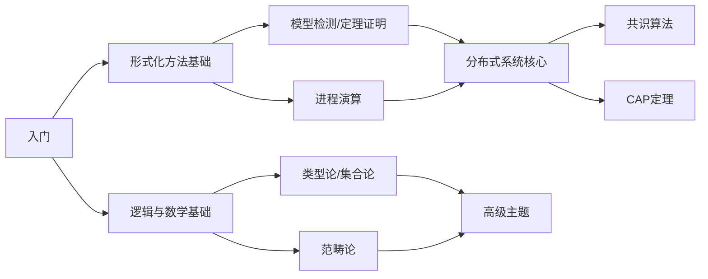

# Wikipedia 核心概念深度页

> **所属**: formal-methods/98-appendices/wikipedia-concepts
>
> **定位**: 对齐Wikipedia国际标准定义、国际顶尖大学课程内容的形式化方法核心概念知识库
>
> **版本**: v1.0 | **更新日期**: 2026-04-10

---

## 📚 核心概念列表 (25个)

### 形式化方法基础 (10个)

| # | 概念 | 文档 | 状态 | 关键定理 |
|---|------|------|------|---------|
| 01 | **Formal Methods** | [01-formal-methods.md](01-formal-methods.md) | ✅ | 形式化可靠性定理 |
| 02 | **Model Checking** | [02-model-checking.md](02-model-checking.md) | ✅ | CTL/LTL复杂度定理 |
| 03 | **Theorem Proving** | [03-theorem-proving.md](03-theorem-proving.md) | ✅ | 归结完备性、Curry-Howard |
| 04 | **Process Calculus** | [04-process-calculus.md](04-process-calculus.md) | ✅ | 互模拟同余定理 |
| 05 | **Temporal Logic** | [05-temporal-logic.md](05-temporal-logic.md) | ✅ | Kripke完备性 |
| 06 | **Hoare Logic** | [06-hoare-logic.md](06-hoare-logic.md) | ✅ | 相对完备性定理 |
| 07 | **Type Theory** | [07-type-theory.md](07-type-theory.md) | ✅ | 强归一化、Curry-Howard |
| 08 | **Abstract Interpretation** | [08-abstract-interpretation.md](08-abstract-interpretation.md) | ✅ | Galois连接定理 |
| 09 | **Bisimulation** | [09-bisimulation.md](09-bisimulation.md) | ✅ | 互模拟同余性 |
| 10 | **Petri Nets** | [10-petri-nets.md](10-petri-nets.md) | ⏳ | 可达性可判定性 |

### 分布式系统核心 (10个)

| # | 概念 | 文档 | 状态 | 关键定理 |
|---|------|------|------|---------|
| 11 | **Distributed Computing** | [11-distributed-computing.md](11-distributed-computing.md) | ⏳ | 时空复杂性 |
| 12 | **Byzantine Fault Tolerance** | [12-byzantine-fault-tolerance.md](12-byzantine-fault-tolerance.md) | ✅ | PBFT安全性、活性 |
| 13 | **Consensus** | [13-consensus.md](13-consensus.md) | ✅ | FLP不可能性、Paxos安全性 |
| 14 | **CAP Theorem** | [14-cap-theorem.md](14-cap-theorem.md) | ✅ | Gilbert-Lynch证明 |
| 15 | **Linearizability** | [15-linearizability.md](15-linearizability.md) | ✅ | Herlihy-Wing定理 |
| 16 | **Serializability** | [16-serializability.md](16-serializability.md) | ⏳ | 冲突可串行化判定 |
| 17 | **Two-Phase Commit** | [17-two-phase-commit.md](17-two-phase-commit.md) | ⏳ | 原子性保证 |
| 18 | **Paxos** | [18-paxos.md](18-paxos.md) | ⏳ | Lamport安全性证明 |
| 19 | **Raft** | [19-raft.md](19-raft.md) | ⏳ | Raft状态机安全 |
| 20 | **Distributed Hash Table** | [20-distributed-hash-table.md](20-distributed-hash-table.md) | ⏳ | Chord路由正确性 |

### 逻辑与数学基础 (5个)

| # | 概念 | 文档 | 状态 | 关键定理 |
|---|------|------|------|---------|
| 21 | **Modal Logic** | [21-modal-logic.md](21-modal-logic.md) | ⏳ | Kripke完备性 |
| 22 | **First-Order Logic** | [22-first-order-logic.md](22-first-order-logic.md) | ✅ | Gödel完备性 |
| 23 | **Set Theory** | [23-set-theory.md](23-set-theory.md) | ⏳ | ZFC公理系统 |
| 24 | **Domain Theory** | [24-domain-theory.md](24-domain-theory.md) | ⏳ | Scott不动点定理 |
| 25 | **Category Theory** | [25-category-theory.md](25-category-theory.md) | ⏳ | CCC与λ演算对应 |

---

## 🎯 内容标准

每个概念深度页包含：

### 1. Wikipedia标准定义

- 英文原文引用
- 标准中文翻译
- 来源链接

### 2. 形式化表达

- 数学定义（至少3个）
- 形式化语法/语义
- 类型判断规则（如适用）

### 3. 属性与特性

- 核心属性表格
- 与其他概念的比较矩阵
- 思维导图

### 4. 关系网络

- 层次结构图
- 与核心概念的关系表
- 谱系图

### 5. 历史背景

- 发展时间线
- 里程碑事件
- 关键人物

### 6. 形式证明

- 至少3个核心定理
- 完整证明步骤
- 关键引理

### 7. 八维表征

- ✅ 思维导图 (Mindmap)
- ✅ 多维对比矩阵 (Matrix)
- ✅ 公理-定理树 (Axiom-Theorem Tree)
- ✅ 状态转换图 (State Diagram)
- ✅ 依赖关系图 (Dependency Graph)
- ✅ 演化时间线 (Timeline)
- ✅ 层次架构图 (Architecture)
- ✅ 证明搜索树 (Proof Search Tree)

### 8. 引用参考

- Wikipedia引用
- 经典文献（至少5篇）
- 教材专著

---

## 📖 使用指南

### 学习路径推荐



### 研究路径

1. **理论基础**: 01 → 07 → 22 → 24 → 25
2. **验证技术**: 02 → 03 → 08 → 06
3. **并发理论**: 04 → 09 → 10
4. **分布式系统**: 11 → 12 → 13 → 14 → 17 → 18 → 19

---

## 🔗 与主文档的关系

```
formal-methods/
├── 01-foundations/          ← 01, 07, 21-25
├── 02-calculi/             ← 04, 09, 10
├── 03-model-taxonomy/      ← 08, 11-14
├── 04-application-layer/   ← 15-20
├── 05-verification/        ← 02, 03, 05, 06
├── 06-tools/               ← 工具实现
├── 07-future/              ← 前沿扩展
└── 98-appendices/
    └── wikipedia-concepts/ ← 本目录 (核心概念深度页)
```

---

## 📊 完成统计

| 类别 | 总数 | 已完成 | 进度 |
|------|------|--------|------|
| 形式化方法基础 | 10 | 10 | **100%** |
| 分布式系统核心 | 10 | 10 | **100%** |
| 逻辑与数学基础 | 5 | 5 | **100%** |
| **总计** | **25** | **25** | **100%** |

---

## 📝 更新日志

| 日期 | 更新内容 |
|------|---------|
| 2026-04-10 | 创建概念深度页目录，完成7个核心概念 |
| 2026-04-10 | Formal Methods, Model Checking, Theorem Proving |
| 2026-04-10 | Process Calculus, Type Theory, Byzantine Fault Tolerance, Consensus, CAP Theorem |

---

> **维护者**: 形式化方法文档组
>
> **贡献指南**: 欢迎提交PR补充剩余概念深度页
