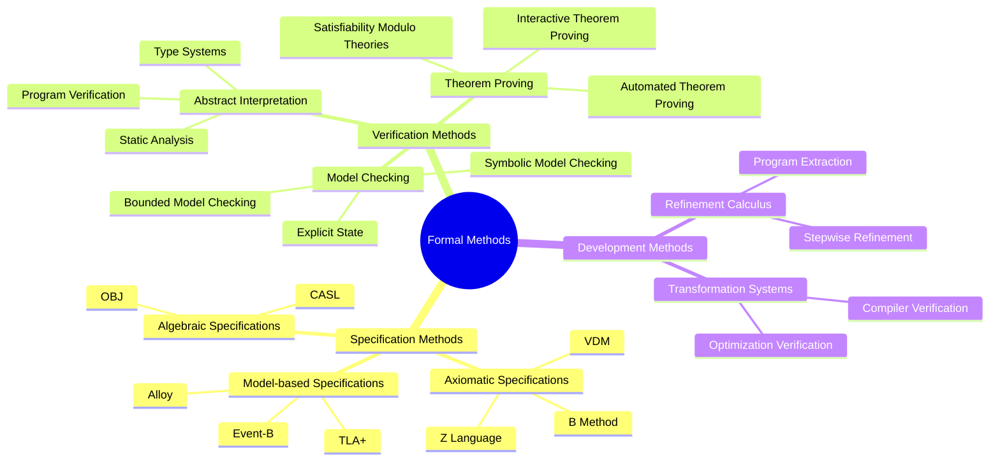
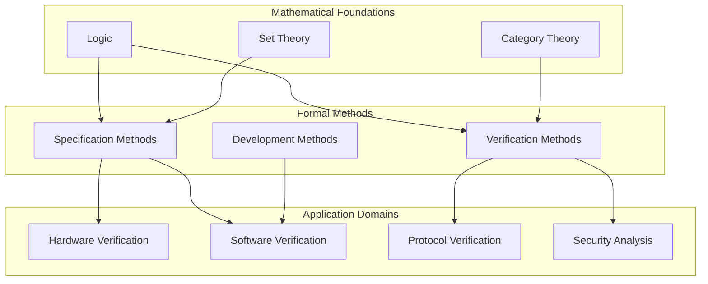
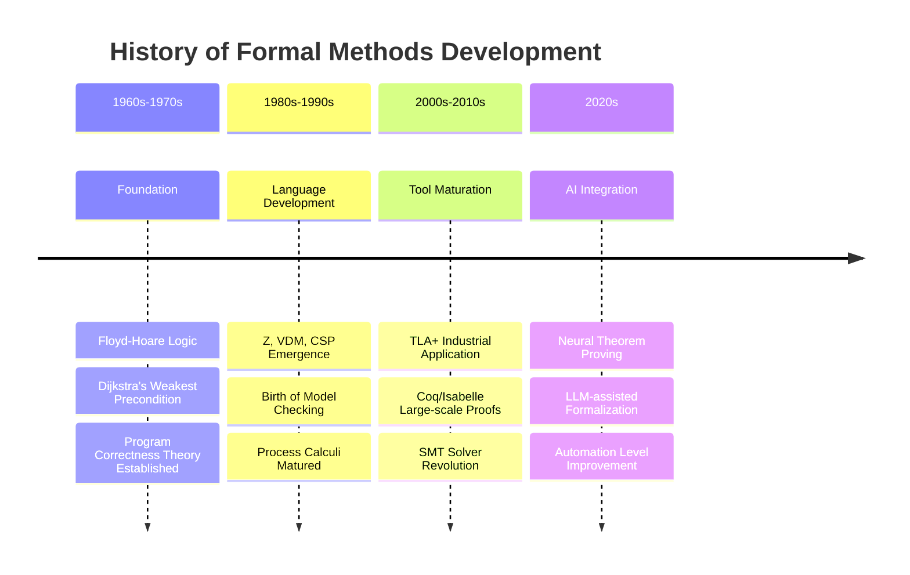
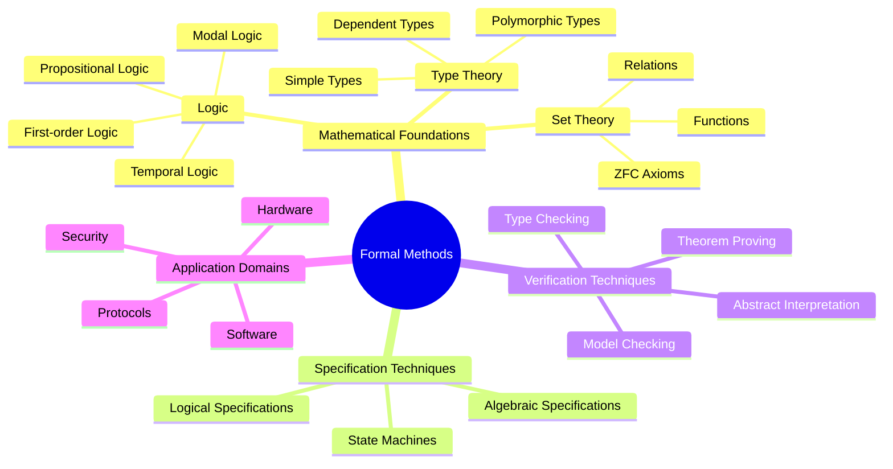
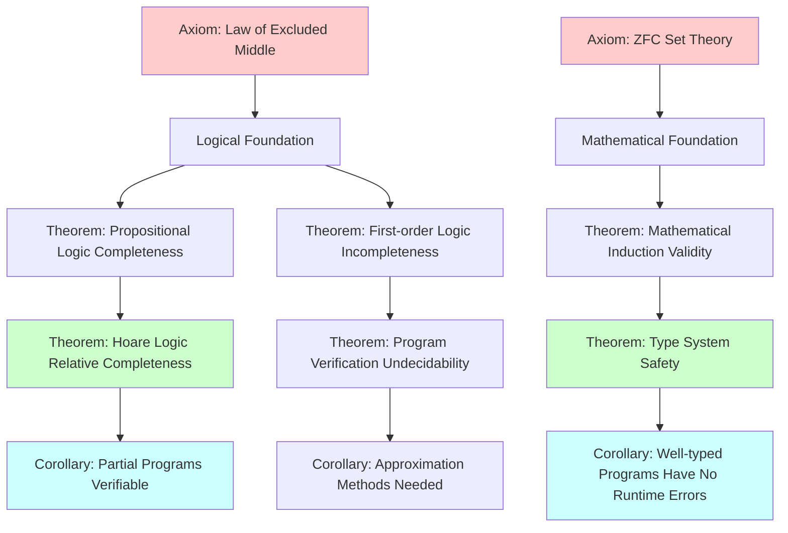
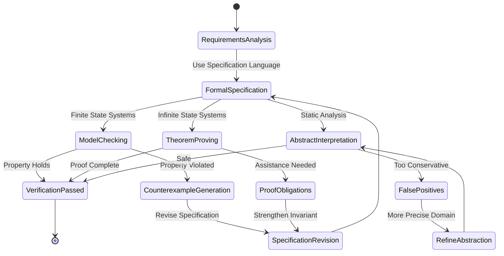
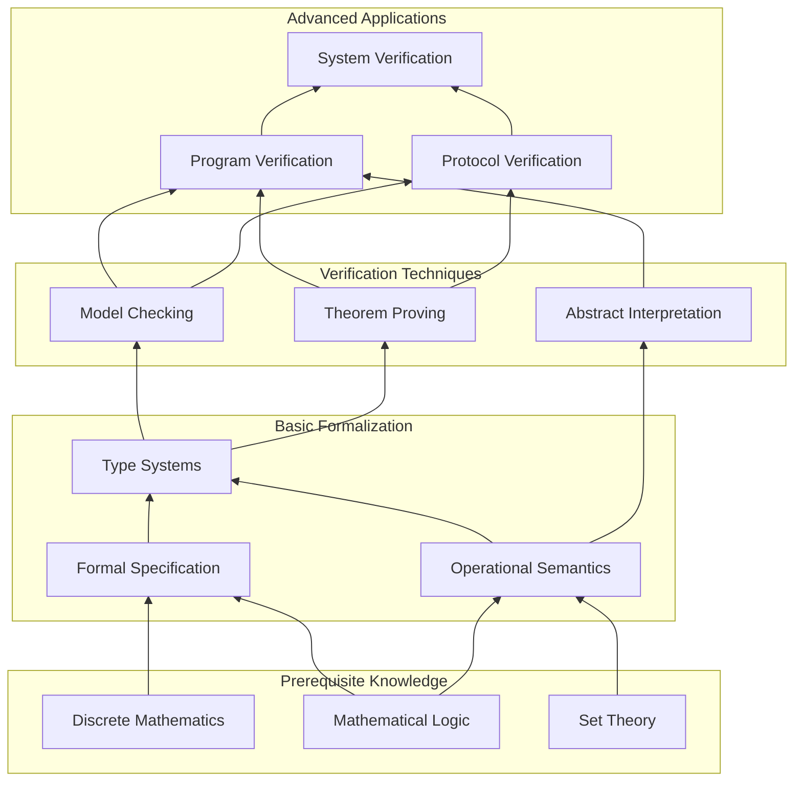
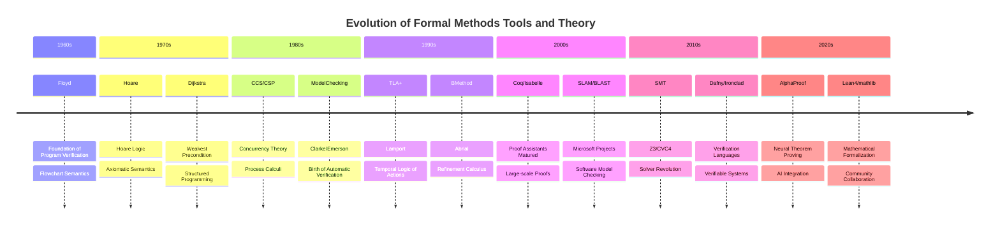
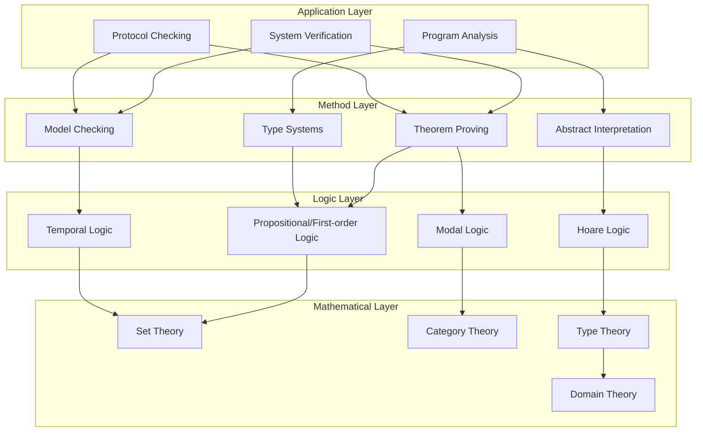

# Formal Methods

> **Wikipedia Standard Definition**: Formal methods are mathematically based techniques for the specification, development, and analysis of software and hardware systems.
>
> **Source**: <https://en.wikipedia.org/wiki/Formal_methods>
>
> **Formalization Level**: L1 (Fundamental Concept)

---

## 1. Wikipedia Standard Definition

### Original English Text
>
> "Formal methods are mathematically based techniques for the specification, development, and analysis of software and hardware systems. The use of formal methods is motivated by the expectation that, as in other engineering disciplines, performing appropriate mathematical analysis can contribute to the reliability and robustness of a design."

### Key Points

- Mathematical foundation: Eliminates ambiguity of natural language
- Systematic approach: Covers specification, development, and verification
- Engineering discipline: Aims to improve reliability and robustness

---

## 2. Formal Expressions

### 2.1 Formal Definition of Formal Methods

**Def-S-98-01** (Formal Methods System). A formal methods system is a quintuple:

$$\mathcal{FM} = \langle \mathcal{L}_{\text{spec}}, \mathcal{L}_{\text{impl}}, \mathcal{R}_{\text{refine}}, \mathcal{V}_{\text{verify}}, \mathcal{T}_{\text{transform}} \rangle$$

Where:

- $\mathcal{L}_{\text{spec}}$: Specification language (e.g., Z, VDM, TLA+)
- $\mathcal{L}_{\text{impl}}$: Implementation language (e.g., programming languages, HDL)
- $\mathcal{R}_{\text{refine}}$: Refinement relation, $\mathcal{L}_{\text{spec}} \times \mathcal{L}_{\text{impl}} \rightarrow \{\text{true}, \text{false}\}$
- $\mathcal{V}_{\text{verify}}$: Verification methods (model checking, theorem proving, etc.)
- $\mathcal{T}_{\text{transform}}$: Transformation toolset

### 2.2 Formal Correctness

**Def-S-98-02** (Formal Correctness). A system $S$ is formally correct with respect to specification $Spec$ if and only if:

$$S \models_{\mathcal{L}} Spec \Leftrightarrow \mathcal{V}(S, Spec) = \text{VALID}$$

Where $\mathcal{V}$ is the verifier and $\models_{\mathcal{L}}$ is the satisfaction relation in language $\mathcal{L}$.

---

## 3. Properties and Characteristics

### 3.1 Core Properties

| Property | Definition | Importance |
|----------|------------|------------|
| **Precision** | Uses mathematical notation to eliminate natural language ambiguity | ⭐⭐⭐⭐⭐ |
| **Verifiability** | Supports automated or semi-automated correctness proofs | ⭐⭐⭐⭐⭐ |
| **Abstraction Levels** | Stepwise refinement from high-level specifications to concrete implementations | ⭐⭐⭐⭐ |
| **Completeness** | Covers all possible behaviors of the system | ⭐⭐⭐⭐ |
| **Composability** | Supports modular analysis and verification | ⭐⭐⭐⭐ |

### 3.2 Formal Methods Spectrum



---

## 4. Relationship Network

### 4.1 Concept Hierarchy



### 4.2 Relationships with Other Core Concepts

| Concept | Relationship Type | Description |
|---------|-------------------|-------------|
| **Logic** | Foundation | Formal methods are based on mathematical logic |
| **Model Checking** | Instance | An automated technique for formal verification |
| **Theorem Proving** | Instance | A deductive technique for formal verification |
| **Type Theory** | Foundation | Curry-Howard correspondence connects programs and proofs |
| **Abstract Interpretation** | Instance | Theoretical foundation for formal static analysis |

---

## 5. Historical Background

### 5.1 Development Timeline



### 5.2 Milestone Events

| Year | Event | Contributor |
|------|-------|-------------|
| 1967 | Floyd's Assignment Axiom | Robert W. Floyd |
| 1969 | Hoare Logic | C.A.R. Hoare |
| 1975 | Weakest Precondition | Edsger W. Dijkstra |
| 1980 | CCS Process Calculus | Robin Milner |
| 1985 | CTL Model Checking | Clarke & Emerson |
| 1989 | π-calculus | Robin Milner |
| 1999 | TLA+ Release | Leslie Lamport |
| 2009 | seL4 Verification Complete | Klein et al. |
| 2024 | AlphaProof IMO Silver | DeepMind |

---

## 6. Formal Proofs

### 6.1 Soundness Theorem of Formal Verification

**Thm-S-98-01** (Soundness of Formal Verification). If formal verifier $\mathcal{V}$ proves that system $S$ satisfies specification $Spec$, then $S$ indeed satisfies $Spec$ under formal semantics:

$$\mathcal{V}(S, Spec) = \text{VALID} \Rightarrow S \models Spec$$

*Proof*:

1. Let $\mathcal{V}$ be based on formal semantics $\llbracket \cdot \rrbracket$
2. The verification process computes $\llbracket S \rrbracket \subseteq \llbracket Spec \rrbracket$
3. By semantic definition, $\llbracket S \rrbracket \subseteq \llbracket Spec \rrbracket \Leftrightarrow S \models Spec$
4. Therefore, successful verification implies satisfaction relation ∎

### 6.2 Incompleteness Limitations

**Thm-S-98-02** (Incompleteness of Formal Verification). For Turing-complete languages, formal verification is not complete:

$$\exists S, Spec: S \models Spec \land \mathcal{V}(S, Spec) = \text{UNKNOWN}$$

*Proof Sketch*:

1. From the undecidability of the Halting Problem
2. Program correctness implies halting (total correctness)
3. Therefore, program correctness is also undecidable
4. Any verifier must have cases returning UNKNOWN ∎

---

## 7. Eight-Dimensional Characterization

### 7.1 Mind Map



### 7.2 Multi-dimensional Comparison Matrix

| Dimension | Formal Methods | Traditional Testing | Advantage Ratio |
|-----------|---------------|---------------------|-----------------|
| Coverage | 100% | Sampling | 100:1 |
| Reliability | Mathematical Guarantee | Statistical Guarantee | 10:1 |
| Cost | High | Low | 1:10 |
| Automation | Medium | High | 1:2 |
| Maintainability | Medium | High | 1:1 |
| Learning Curve | Steep | Gentle | 1:5 |

### 7.3 Axiom-Theorem Tree



### 7.4 State Transition Diagram



### 7.5 Dependency Graph



### 7.6 Evolution Timeline



### 7.7 Hierarchical Architecture



### 7.8 Proof Search Tree

```mermaid
graph TD
    A[Proof Goal: Γ ⊢ P] --> B{Form of P?}

    B -->|Atomic Proposition| C[Assumption Lookup]
    B -->|Conjunction P∧Q| D[Prove P and Q Separately]
    B -->|Disjunction P∨Q| E[Choose to Prove P or Q]
    B -->|Implication P→Q| F[Assume P, Prove Q]
    B -->|Universal ∀x.P| G[Take arbitrary c, Prove P[c/x]]
    B -->|Existential ∃x.P| H[Construct t, Prove P[t/x]]

    C --> I{P∈Γ?}
    I -->|Yes| J[Proof Complete]
    I -->|No| K[Try Resolution]

    D --> L[Subgoal 1: Γ ⊢ P]
    D --> M[Subgoal 2: Γ ⊢ Q]

    E --> N[Subgoal: Γ ⊢ P]
    E --> O[Subgoal: Γ ⊢ Q]

    F --> P[Extended Context: Γ,P ⊢ Q]

    G --> Q[Skolem Constant]

    H --> R{Term t?}
    R -->|Known| S[Substitute]
    R -->|Unknown| T[Synthesize/Search]

    style J fill:#ccffcc
    style K fill:#ffcccc
```

---

## 8. References

### Wikipedia References


### Classic Literature


---

## 9. Related Concepts

- [Model Checking](02-model-checking.md)
- [Theorem Proving](03-theorem-proving.md)
- [Process Calculus](04-process-calculus.md)
- [Temporal Logic](05-temporal-logic.md)
- [Hoare Logic](06-hoare-logic.md)
- [Type Theory](07-type-theory.md)

---

> **Concept Tags**: #FormalMethods #FundamentalConcepts #MathematicalFoundations #SoftwareEngineering #HardwareVerification
>
> **Learning Difficulty**: ⭐⭐⭐ (Intermediate)
>
> **Prerequisites**: Mathematical Logic, Set Theory
>
> **Follow-up Concepts**: Model Checking, Theorem Proving, Process Calculi

---

*Document Version: v1.0 | Created: 2026-04-10 | Last Updated: 2026-04-10*
