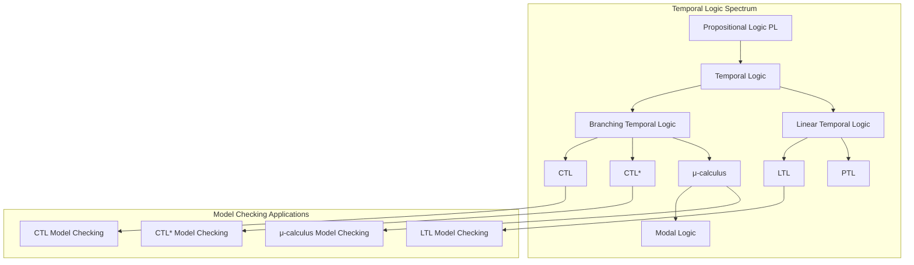
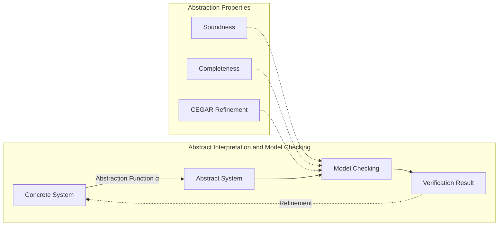
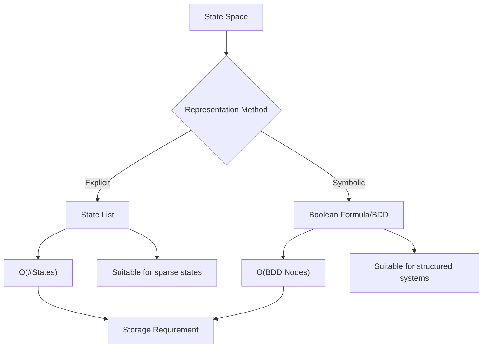
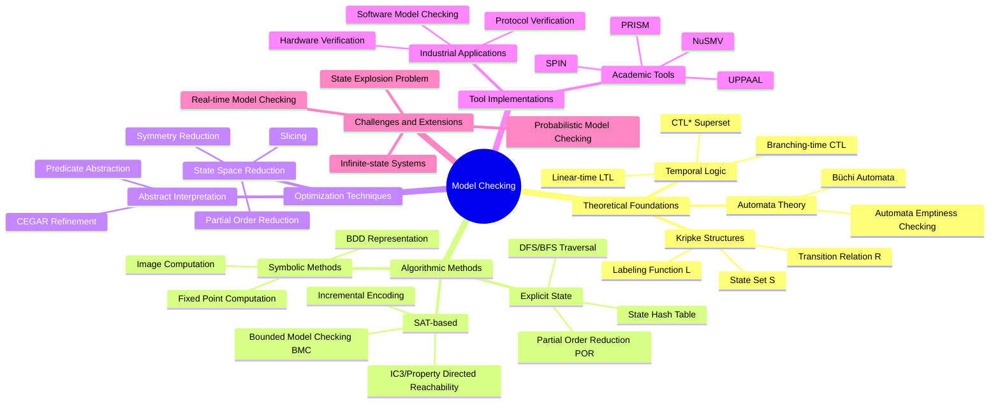
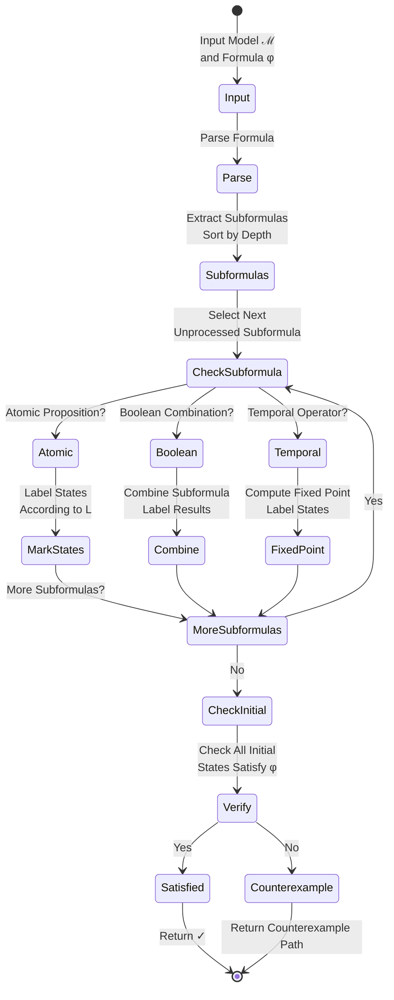
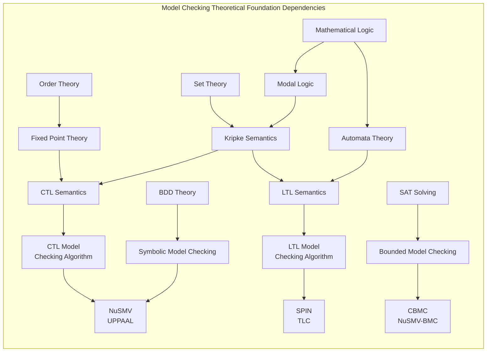
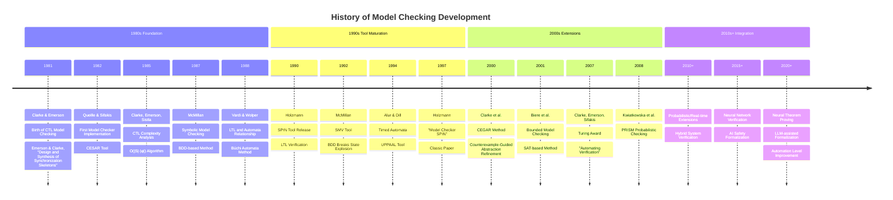
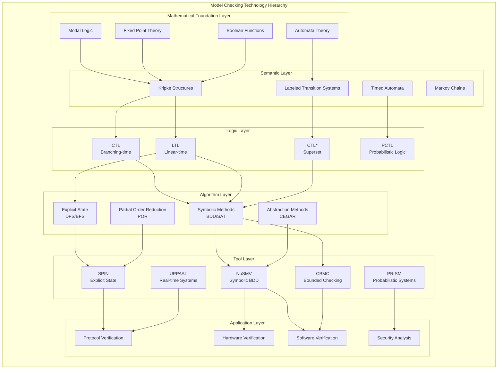

# Model Checking

> **Stage**: formal-methods/98-appendices/wikipedia-concepts | **Prerequisites**: [01-formal-methods](01-formal-methods.md) | **Formalization Level**: L1-L6
>
> **Wikipedia Standard Definition**: Model checking is a method for checking whether a finite-state model of a system meets a given specification.
>
> **Source**: <https://en.wikipedia.org/wiki/Model_checking>

---

## 1. Definitions

### Def-S-98-01 Model Checking

#### Original English Text (Wikipedia Standard Definition)
>
> "In computer science, **model checking** is a method for checking whether a finite-state model of a system meets a given specification. In order to solve such a problem algorithmically, both the model of the system and its specification are formulated in some precise mathematical formalism. To the extent possible, the method uses exhaustive and/or exploratory enumeration of the various states and transitions in the system."

#### Formal Definition

The **model checking problem** is a decision problem:

$$\mathcal{MC}: \mathcal{M} \times \Phi \to \{\top, \bot, \text{CounterExample}\}$$

Where:

- $\mathcal{M}$: System model (usually represented as Kripke structure)
- $\Phi$: Specification to verify (temporal logic formula)
- Output: Satisfied ($\top$), Not Satisfied ($\bot$) with counterexample, or Resource Exhaustion

### Def-S-98-02 Kripke Structure

The fundamental semantic structure for model checking:

$$\mathcal{M} = (S, S_0, R, L, AP)$$

Where each component is defined as:

| Symbol | Meaning | Type |
|--------|---------|------|
| $S$ | Finite set of states | Finite set |
| $S_0 \subseteq S$ | Set of initial states | Subset of $S$ |
| $R \subseteq S \times S$ | Total transition relation | Binary relation satisfying $\forall s \in S, \exists s' \in S: (s,s') \in R$ |
| $L: S \to 2^{AP}$ | State labeling function | Maps states to sets of atomic propositions |
| $AP$ | Set of atomic propositions | Finite set |

**Execution Path** (infinite state sequence):
$$\pi = s_0 s_1 s_2 \ldots \in S^\omega, \quad \text{satisfying } \forall i \geq 0: (s_i, s_{i+1}) \in R$$

**Path Suffix**:
$$\pi^i = s_i s_{i+1} s_{i+2} \ldots$$

### Def-S-98-03 Computation Tree Logic (CTL)

CTL is a **branching-time temporal logic** where formulas are composed of path quantifiers and temporal operators:

**Path Quantifiers**:

- $\mathbf{A}\phi$: All paths — all paths satisfy $\phi$
- $\mathbf{E}\phi$: Exists path — there exists a path satisfying $\phi$

**Temporal Operators**:

- $\mathbf{X}\phi$: neXt — next state satisfies $\phi$
- $\mathbf{F}\phi$: Future — eventually some state satisfies $\phi$
- $\mathbf{G}\phi$: Globally — all states satisfy $\phi$
- $\phi_1 \mathbf{U} \phi_2$: Until — $\phi_1$ holds continuously until $\phi_2$ holds

**CTL Syntax** (BNF):
$$\phi ::= p \ | \ \neg\phi \ | \ \phi \land \phi \ | \ \mathbf{AX}\phi \ | \ \mathbf{EX}\phi \ | \ \mathbf{AF}\phi \ | \ \mathbf{EF}\phi \ | \ \mathbf{AG}\phi \ | \ \mathbf{EG}\phi \ | \ \mathbf{A}(\phi \mathbf{U} \phi) \ | \ \mathbf{E}(\phi \mathbf{U} \phi)$$

**Semantic Definition**:

- $\mathcal{M}, s \models \mathbf{AX}\phi \iff \forall s': (s,s') \in R, \mathcal{M}, s' \models \phi$
- $\mathcal{M}, s \models \mathbf{EX}\phi \iff \exists s': (s,s') \in R, \mathcal{M}, s' \models \phi$
- $\mathcal{M}, s \models \mathbf{AF}\phi \iff$ from $s$, all paths eventually reach a state satisfying $\phi$
- $\mathcal{M}, s \models \mathbf{EF}\phi \iff$ there exists a path from $s$ that eventually reaches a state satisfying $\phi$
- $\mathcal{M}, s \models \mathbf{A}(\phi_1 \mathbf{U} \phi_2) \iff$ on all paths $\phi_1$ holds continuously until $\phi_2$ holds
- $\mathcal{M}, s \models \mathbf{E}(\phi_1 \mathbf{U} \phi_2) \iff$ there exists a path where $\phi_1$ holds continuously until $\phi_2$ holds

### Def-S-98-04 Linear Temporal Logic (LTL)

LTL describes properties along **single execution paths**, without distinguishing branches:

**LTL Syntax** (BNF):
$$\phi ::= p \ | \ \neg\phi \ | \ \phi \land \phi \ | \ \mathbf{X}\phi \ | \ \mathbf{F}\phi \ | \ \mathbf{G}\phi \ | \ \phi \mathbf{U} \phi$$

**Semantics** (based on path $\pi = s_0 s_1 s_2 \ldots$):

- $\pi \models \mathbf{X}\phi \iff \pi^1 \models \phi$ (next moment)
- $\pi \models \mathbf{F}\phi \iff \exists i \geq 0: \pi^i \models \phi$ (eventually holds)
- $\pi \models \mathbf{G}\phi \iff \forall i \geq 0: \pi^i \models \phi$ (globally holds)
- $\pi \models \phi_1 \mathbf{U} \phi_2 \iff \exists i \geq 0: (\pi^i \models \phi_2 \land \forall 0 \leq j < i: \pi^j \models \phi_1)$

**System Satisfaction Relation**:
$$\mathcal{M} \models \phi \iff \forall s_0 \in S_0, \forall \pi \in \Pi(s_0): \pi \models \phi$$

---

## 2. Property Derivation

### Lemma-S-98-01 CTL vs LTL Expressiveness Comparison

The expressiveness of CTL and LTL is **incomparable** (neither subsumes the other):

| Formula | Expressible In | Not Expressible In | Explanation |
|---------|----------------|-------------------|-------------|
| $\mathbf{AF}(p \land \mathbf{AX}q)$ | CTL | LTL | Requires branching semantics |
| $\mathbf{F}(p \land \mathbf{X}q)$ | LTL | CTL | Linear path constraint |
| $\mathbf{AG}(p \Rightarrow \mathbf{EF}q)$ | CTL | LTL | Response property in branching form |
| $\mathbf{G}(p \Rightarrow \mathbf{F}q)$ | LTL | CTL | LTL response property |

**Intersection**: The following formulas can be expressed in both:

- $\mathbf{AG}p \equiv \mathbf{G}p$ (Safety)
- $\mathbf{AF}p \equiv \mathbf{F}p$ (Liveness)

### Lemma-S-98-02 State Space Explosion Problem

For a concurrent system with $n$ components, each having $k$ states, the combined state space size is:

$$|S_{total}| = k^n$$

**Concrete Cases**:

- Two 32-bit counters in parallel: $(2^{32})^2 = 2^{64}$ states
- 10 Boolean variables: $2^{10} = 1024$ states
- 100 Boolean variables: $2^{100} \approx 10^{30}$ states (approximately the number of atoms on Earth)

**Storage Requirement Estimation**:

- Explicit enumeration requires storing state identifiers and labels
- $n$ Boolean variables require $n$ bits per state
- Total storage requirement is $O(2^n \cdot n)$ bits

### Prop-S-98-01 Model Checking Complexity

| Logic | Time Complexity | Space Complexity | Complexity Class |
|-------|-----------------|------------------|------------------|
| CTL | $O(|\mathcal{M}| \cdot |\phi|)$ | $O(|\mathcal{M}|)$ | P-complete |
| LTL | $O(|\mathcal{M}| \cdot 2^{|\phi|})$ | PSPACE | PSPACE-complete |
| CTL* | PSPACE | PSPACE | PSPACE-complete |
| $\mu$-calculus | $O(|\mathcal{M}| \cdot |\phi|)$ | $O(|\mathcal{M}|)$ | NP $\cap$ co-NP |

Where:

- $|\mathcal{M}| = |S| + |R|$ (model size)
- $|\phi|$ (formula size)

### Prop-S-98-02 Core Characteristics of Model Checking

| Characteristic | Definition | Importance |
|----------------|------------|------------|
| **Automation** | Verification process is fully automatic without human intervention | ⭐⭐⭐⭐⭐ |
| **Exhaustiveness** | Theoretically checks all reachable states and paths | ⭐⭐⭐⭐⭐ |
| **Counterexample Generation** | Automatically provides counterexample paths when verification fails | ⭐⭐⭐⭐⭐ |
| **Finiteness** | Traditional methods limited to finite-state systems | ⭐⭐⭐⭐ |
| **Compositionality** | Supports modular verification | ⭐⭐⭐ |

---

## 3. Relations

### 3.1 Relationship with Temporal Logic



**Relationship Notes**:

- **CTL ⊆ CTL* ⊇ LTL**: CTL* is a superset of both
- **Model Checking ↔ Temporal Logic**: Model checking problem is "does model $\mathcal{M}$ satisfy formula $\phi$?"
- **Satisfiability vs Validity**: Model checking is a special case of the satisfiability problem

### 3.2 Relationship with Process Calculi

| Process Calculus | Corresponding Model Checker | Verified Properties |
|-----------------|---------------------------|---------------------|
| **CSP** | FDR tool | Trace equivalence, deadlock detection |
| **CCS** | CWB tool | Bisimulation checking |
| **π-calculus** | Mobility Workbench | Mobility verification |
| **Promela** | SPIN | LTL properties |

**Encoding Relationship**:
$$\text{Process Algebra} \xrightarrow{\text{Semantic Mapping}} \text{Labeled Transition System} \xrightarrow{\text{Model Checking}} \text{Property Check}$$

### 3.3 Relationship with Abstract Interpretation



**Abstract Interpretation for State Explosion Mitigation**:

- **Abstraction**: $\alpha: \mathcal{C} \to \mathcal{A}$ maps concrete domain to abstract domain
- **Soundness**: $\alpha(\mathcal{M}) \models \phi \Rightarrow \mathcal{M} \models \phi$ (no false positives)
- **CEGAR**: Counterexample-Guided Abstraction Refinement

---

## 4. Argumentation

### 4.1 State Explosion Mitigation Strategies

**Strategy Spectrum**:

| Strategy | Principle | Effectiveness | Tool Support |
|----------|-----------|---------------|--------------|
| **Abstraction** | Hide irrelevant details | ⭐⭐⭐⭐ | SLAM, BLAST |
| **Symmetry Reduction** | Exploit system symmetry | ⭐⭐⭐ | Murφ |
| **Partial Order Reduction (POR)** | Ignore interleaving of independent actions | ⭐⭐⭐⭐ | SPIN |
| **Symbolic Methods** | BDD implicit representation | ⭐⭐⭐⭐⭐ | NuSMV |
| **Bounded Model Checking (BMC)** | Limit search depth | ⭐⭐⭐ | CBMC, NuSMV |
| **Compositional Verification** | Verify components separately | ⭐⭐⭐ | ASSUME-GUARANTEE |

**Symbolic vs Explicit Methods**:



### 4.2 Model Checking vs Theorem Proving vs Testing

| Dimension | Model Checking | Theorem Proving | Testing |
|-----------|---------------|-----------------|---------|
| **Completeness** | ✅ Complete (finite systems) | ✅ Complete (mathematically correct) | ❌ Incomplete (sampling) |
| **Automation** | ✅ Fully Automatic | ❌ Interactive | ✅ Can be automated |
| **Scalability** | ⚠️ State explosion | ✅ High | ✅ High |
| **Counterexample Generation** | ✅ Automatic | ⚠️ Requires manual effort | ✅ Automatic |
| **Applicable Systems** | Finite-state | Infinite-state | Any |
| **Formal Guarantee** | ✅ Mathematical guarantee | ✅ Mathematical guarantee | ❌ Statistical guarantee |
| **Manual Effort** | Low | High | Medium |
| **Typical Tools** | SPIN, NuSMV | Coq, Isabelle | JUnit, Selenium |

---

## 5. Formal Proofs

### Thm-S-98-01 Model Checking Algorithm Correctness Theorem

**Theorem**: For any Kripke structure $\mathcal{M}$ and CTL formula $\phi$, the CTL model checking algorithm returns $\top$ if and only if $\mathcal{M} \models \phi$.

**Formal Statement**:
$$\text{CTL-MC}(\mathcal{M}, \phi) = \top \iff \forall s_0 \in S_0: \mathcal{M}, s_0 \models \phi$$

**Algorithm** (Labeling Method):

```
Algorithm: CTL-Model-Checking(ℳ, ϕ)
Input: Kripke structure ℳ = (S, S₀, R, L, AP), CTL formula ϕ
Output: True or Counterexample

1:  // Bottom-up labeling of states satisfying each subformula
2:  for each subformula ψ of ϕ (in increasing formula depth) do
3:      case ψ of
4:          p (atomic proposition):
5:              label[s] ← (p ∈ L(s)) for all s ∈ S
6:          ¬ψ₁:
7:              label[s] ← ¬label₁[s] for all s ∈ S
8:          ψ₁ ∧ ψ₂:
9:              label[s] ← label₁[s] ∧ label₂[s] for all s ∈ S
10:         AXψ₁:
11:             label[s] ← ∀s': (s,s')∈R, label₁[s'] for all s ∈ S
12:         EXψ₁:
13:             label[s] ← ∃s': (s,s')∈R, label₁[s'] for all s ∈ S
14:         AFψ₁:
15:             label ← FixedPoint(λT. {s | label₁[s]} ∪ {s | ∀(s,s')∈R: s'∈T})
16:         EFψ₁:
17:             label ← FixedPoint(λT. {s | label₁[s]} ∪ {s | ∃(s,s')∈R: s'∈T})
18:         AGψ₁:
19:             label ← FixedPoint(λT. {s | label₁[s]} ∩ {s | ∀(s,s')∈R: s'∈T})
20:         EGψ₁:
21:             label ← FixedPoint(λT. {s | label₁[s]} ∩ {s | ∃(s,s')∈R: s'∈T})
22:         A(ψ₁ U ψ₂):
23:             label ← FixedPoint(λT. {s | label₂[s]} ∪ {s | label₁[s] ∧ ∀(s,s')∈R: s'∈T})
24:         E(ψ₁ U ψ₂):
25:             label ← FixedPoint(λT. {s | label₂[s]} ∪ {s | label₁[s] ∧ ∃(s,s')∈R: s'∈T})
26: return (∀s₀ ∈ S₀: label[s₀] = true)
```

**Proof Sketch**:

1. **Fixed Point Existence**: Since $S$ is finite and the labeling function is monotonic, by the Knaster-Tarski theorem, least and greatest fixed points exist.

2. **Semantic Preservation**: Prove by structural induction that algorithm labeling is equivalent to semantics.
   - Base case: Atomic proposition $p$, directly corresponds via labeling function $L$
   - Inductive step: Assuming subformulas are correct, compound formulas preserve via corresponding semantic rules

3. **Termination**: State set is finite, each fixed point computation iterates at most $|S|$ times.

### Thm-S-98-02 CTL Model Checking Complexity Theorem (P-complete)

**Theorem**: The CTL model checking problem is **P-complete**.

**Formal Statement**:
$$\text{CTL-MC} \in \mathbf{P} \text{ and CTL-MC is P-complete}$$

**Proof**:

**Part 1: CTL-MC ∈ P**

For CTL formula $\phi$ and model $\mathcal{M} = (S, R)$:

1. The algorithm performs one fixed point computation per subformula
2. Number of subformulas is $O(|\phi|)$
3. Each fixed point computation iterates at most $|S|$ times
4. Each iteration traverses all edges, complexity $O(|R|)$

Total complexity:
$$T(CTL\text{-}MC) = O(|\phi| \cdot |S| \cdot |R|) = O(|\phi| \cdot |\mathcal{M}|)$$

This is polynomial time in input size $|\mathcal{M}| + |\phi|$, therefore $\text{CTL-MC} \in \mathbf{P}$.

**Part 2: P-completeness**

Proved by reduction from **Circuit Value Problem (CVP)**:

1. CVP is P-complete
2. Given Boolean circuit $C$ and input $I$, Kripke structure $\mathcal{M}_C$ can be constructed in polynomial time
3. Construct CTL formula $\phi$ such that $\mathcal{M}_C \models \phi$ iff $C(I) = 1$
4. Therefore $CVP \leq_p CTL\text{-}MC$

### Thm-S-98-03 LTL Model Checking Complexity Theorem (PSPACE-complete)

**Theorem**: The LTL model checking problem is **PSPACE-complete**.

**Formal Statement**:
$$\text{LTL-MC} \in \mathbf{PSPACE} \text{ and LTL-MC is PSPACE-complete}$$

**Proof**:

**Part 1: LTL-MC ∈ PSPACE**

LTL model checking is implemented via Büchi automata construction:

1. Convert negated formula $\neg\phi$ to Büchi automaton $\mathcal{A}_{\neg\phi}$
   - Using Vardi-Wolper construction
   - Automaton size: $O(2^{|\phi|})$ states

2. Compute product automaton $\mathcal{M} \times \mathcal{A}_{\neg\phi}$
   - Size: $O(|S| \cdot 2^{|\phi|})$

3. Check if product automaton accepts non-empty language
   - Detect reachable accepting cycles
   - Use **on-the-fly** algorithm to avoid explicit construction of entire product
   - Only polynomial space needed to store current path and visited set

Space complexity: $O(|\phi| + \log(|\mathcal{M}|))$, therefore $\text{LTL-MC} \in \mathbf{NPSPACE} = \mathbf{PSPACE}$ (by Savitch's theorem).

**Part 2: PSPACE-hardness**

Proved by reduction from **Universality of Regular Expressions** or **QSAT**:

1. QSAT (Quantified Boolean Satisfiability) is PSPACE-complete
2. Given QSAT instance $Q_1x_1 \ldots Q_nx_n. \psi(x_1, \ldots, x_n)$
3. Construct Kripke structure $\mathcal{M}$ encoding variable assignment sequences
4. Construct LTL formula $\phi$ encoding quantifier structure
5. $\mathcal{M} \models \phi$ iff QSAT instance is true
6. Therefore $QSAT \leq_p LTL\text{-}MC$

**Complexity Summary**:

| Logic | Complexity | Algorithm Core | Bottleneck |
|-------|------------|----------------|------------|
| CTL | P-complete | Fixed point computation | State space size |
| LTL | PSPACE-complete | Büchi automata | Exponential blowup from formula to automaton |
| CTL* | PSPACE-complete | Hybrid method | Branching + Linear combination |

---

## 6. Examples

### 6.1 Mutual Exclusion Protocol Verification

**System Description**: Two processes competing for critical section resource

**Kripke Structure Definition**:

- States: $(p_1, p_2)$, where $p_i \in \{N, T, C\}$ (Non-critical, Trying, Critical)
- Total states: $3 \times 3 = 9$
- Legal states (excluding $(C, C)$): 8

**Verified Properties**:

| Property | CTL Formula | Expected |
|----------|-------------|----------|
| Mutual Exclusion | $\mathbf{AG}(\neg(c_1 \land c_2))$ | ✅ Satisfied |
| No Starvation | $\mathbf{AG}(t_1 \Rightarrow \mathbf{AF}c_1)$ | ⚠️ Depends on scheduler |
| Reachability | $\mathbf{EF}c_1 \land \mathbf{EF}c_2$ | ✅ Satisfied |

**NuSMV Code Snippet**:

```nusmv
MODULE main
VAR
  p1: {N, T, C};
  p2: {N, T, C};
ASSIGN
  init(p1) := N;
  init(p2) := N;
  next(p1) := case
    p1 = N : {N, T};
    p1 = T & p2 != C : C;
    p1 = C : N;
    TRUE : p1;
  esac;
  next(p2) := case
    p2 = N : {N, T};
    p2 = T & p1 != C : C;
    p2 = C : N;
    TRUE : p2;
  esac;

SPEC AG !(p1 = C & p2 = C)  -- Mutual exclusion property
SPEC AG (p1 = T -> AF p1 = C)  -- No starvation
```

### 6.2 Traffic Light Controller Verification

**Properties** (using LTL):

- $\mathbf{G}(\neg(green_{north} \land green_{east}))$ — Never both green simultaneously
- $\mathbf{G}(red_{north} \to \mathbf{F}green_{north})$ — Green must follow red
- $\mathbf{G}(yellow_{north} \to \mathbf{X}red_{north})$ — Yellow must be followed by red

---

## 7. Visualizations

### 7.1 Mind Map: Model Checking Concept System



### 7.2 Multi-dimensional Comparison Matrix

**Detailed Comparison Matrix**:

| Dimension | Model Checking | Theorem Proving | Testing | Abstract Interpretation |
|-----------|---------------|-----------------|---------|------------------------|
| **Completeness** | ⭐⭐⭐⭐⭐ | ⭐⭐⭐⭐⭐ | ⭐⭐ | ⭐⭐⭐ |
| **Automation** | ⭐⭐⭐⭐⭐ | ⭐⭐ | ⭐⭐⭐⭐⭐ | ⭐⭐⭐⭐⭐ |
| **Scalability** | ⭐⭐⭐ | ⭐⭐⭐⭐⭐ | ⭐⭐⭐⭐⭐ | ⭐⭐⭐⭐⭐ |
| **Counterexample Generation** | ⭐⭐⭐⭐⭐ | ⭐⭐ | ⭐⭐⭐⭐⭐ | ⭐⭐ |
| **Formal Guarantee** | ⭐⭐⭐⭐⭐ | ⭐⭐⭐⭐⭐ | ⭐⭐ | ⭐⭐⭐⭐ |
| **Learning Curve** | ⭐⭐⭐ | ⭐ | ⭐⭐⭐⭐⭐ | ⭐⭐⭐ |
| **Typical Tools** | SPIN, NuSMV | Coq, Isabelle | JUnit, Selenium | ASTREE, Infer |

### 7.3 Axiom-Theorem Tree: Kripke Semantics Axiom System

```mermaid
graph TB
    subgraph "Kripke Semantics Axiom System"
        direction TB

        A1["Axiom 1: Total Relation Axiom<br/>∀s ∈ S: ∃s' ∈ S: (s,s') ∈ R"] --> T1
        A2["Axiom 2: Labeling Consistency<br/>L: S → 2^AP"] --> T1
        A3["Axiom 3: Path Existence<br/>Every state has at least one outgoing edge"] --> T1

        T1["Theorem 1: Infinite Path Existence<br/>From any state there exists an infinite execution path"] --> T2
        T2["Theorem 2: CTL Semantic Well-definedness<br/>All CTL formulas have determined semantic values"] --> T3
        T3["Theorem 3: Fixed Point Existence<br/>Monotonic functions have fixed points on finite lattices"] --> T4
        T4["Theorem 4: Model Checking Decidability<br/>CTL checking on finite Kripke structures is decidable"]

        subgraph Inference Rules
            R1[Modus Ponens]<br/>φ, φ→ψ ⊢ ψ
            R2[Necessitation]<br/>⊢ φ ⇒ ⊢ ☐φ
            R3["Path Induction"]<br/>Prove by induction along all paths
        end
    end
```

### 7.4 State Transition Diagram: Model Checking Algorithm Flow



### 7.5 Dependency Graph



### 7.6 Evolution Timeline



### 7.7 Hierarchical Architecture



### 7.8 Proof Search Tree: Symbolic Model Checking

```mermaid
graph TB
    subgraph "Symbolic Model Checking Proof Search Tree"
        direction TB

        ROOT["Goal: Verify ℳ ⊨ φ"] --> DECOMPOSE{Formula Decomposition}

        DECOMPOSE --> SUB1["Subgoal 1: φ = p<br/>Atomic Proposition"]
        DECOMPOSE --> SUB2["Subgoal 2: φ = ¬ψ<br/>Negation"]
        DECOMPOSE --> SUB3["Subgoal 3: φ = ψ₁ ∧ ψ₂<br/>Conjunction"]
        DECOMPOSE --> SUB4["Subgoal 4: φ = AXψ<br/>Universal Next"]
        DECOMPOSE --> SUB5["Subgoal 5: φ = EXψ<br/>Existential Next"]
        DECOMPOSE --> SUB6["Subgoal 6: φ = AFψ<br/>Universal Finally"]
        DECOMPOSE --> SUB7["Subgoal 7: φ = EFψ<br/>Existential Finally"]

        SUB1 --> SOL1["BDD(S_p)<br/>Direct Labeling"]

        SUB2 --> SOL2["BDD(S_ψ) Complement<br/>¬BDD_ψ"]

        SUB3 --> SOL3["BDD_ψ₁ ∧ BDD_ψ₂<br/>Apply Algorithm"]

        SUB4 --> SOL4["∀ V': T(V,V') → BDD_ψ(V')<br/>Universal Quantification"]

        SUB5 --> SOL5["∃ V': T(V,V') ∧ BDD_ψ(V')<br/>Existential Quantification"]

        SUB6 --> ITER1{Fixed Point Iteration<br/>μZ.ψ ∨ AX Z}
        ITER1 -->|Iteration 1| I1[BDD₁ = BDD_ψ]
        ITER1 -->|Iteration i+1| I2[BDD_{i+1} = BDD_ψ ∨ AX BDD_i]
        ITER1 -->|Convergence| SOL6[BDD_AFψ]

        SUB7 --> ITER2{Fixed Point Iteration<br/>μZ.ψ ∨ EX Z}
        ITER2 -->|Iteration 1| J1[BDD₁ = BDD_ψ]
        ITER2 -->|Iteration i+1| J2[BDD_{i+1} = BDD_ψ ∨ EX BDD_i]
        ITER2 -->|Convergence| SOL7[BDD_EFψ]

        SOL1 --> COMBINE["Combine Results"]
        SOL2 --> COMBINE
        SOL3 --> COMBINE
        SOL4 --> COMBINE
        SOL5 --> COMBINE
        SOL6 --> COMBINE
        SOL7 --> COMBINE

        COMBINE --> CHECK{Check Initial States<br/>S₀ ⊆ SAT(φ)?}
        CHECK -->|Yes| VALID["✓ Verification Passed"]
        CHECK -->|No| INVALID["✗ Provide Counterexample<br/>BDD Path Extraction"]
    end
```

---

## 8. Historical Context

### 8.1 Key Milestones

| Year | Contributor | Contribution | Significance |
|------|-------------|--------------|--------------|
| **1981** | Clarke & Emerson | CTL Model Checking | **Founded branching-time temporal logic model checking** [^1] |
| **1982** | Queille & Sifakis | CESAR Tool | First model checker implementation [^2] |
| **1987** | McMillan | Symbolic Model Checking | BDD breaks state explosion limit [^3] |
| **1988** | Vardi & Wolper | LTL and Automata | Büchi automata method [^4] |
| **1990** | Holzmann | SPIN | Industrial-grade LTL verification tool [^5] |
| **1992** | Burch et al. | 10²⁰ States | Demonstration of symbolic method power [^3] |
| **2000** | Clarke et al. | CEGAR | Counterexample-Guided Abstraction Refinement [^6] |
| **2007** | Clarke, Emerson, Sifakis | **Turing Award** | "For developing model checking into a highly effective verification technology" [^7] |

### 8.2 2007 Turing Award

**Award Citation** (ACM Official):
> "For developing Model-Checking into a highly effective verification technology that is widely adopted in the hardware and software industries."

**Contributions of the Three Laureates**:

- **Edmund M. Clarke** (CMU): CTL creation, symbolic model checking
- **E. Allen Emerson** (UT Austin): CTL complexity analysis, fixed point algorithms
- **Joseph Sifakis** (VERIMAG): CESAR tool, real-time systems extension

---

## 9. References

### Related Concepts

- [Explicit-state Model Checking](../../05-verification/02-model-checking/01-explicit-state.md) - Detailed model checking implementation techniques

### Wikipedia References

[^1]: Wikipedia, "Model checking", <https://en.wikipedia.org/wiki/Model_checking>

### Classic Literature


[^2]: J. P. Queille and J. Sifakis, "Specification and verification of concurrent systems in CESAR," *5th International Symposium on Programming*, 1982. <https://doi.org/10.1007/3-540-11494-7_22>

[^3]: J. R. Burch, E. M. Clarke, K. L. McMillan, D. L. Dill, and L. J. Hwang, "Symbolic Model Checking: 10^20 States and Beyond," *Information and Computation*, 98(2), 1992. <https://doi.org/10.1016/0890-5401(92)90017-A>

[^4]: M. Y. Vardi and P. Wolper, "An Automata-Theoretic Approach to Automatic Program Verification," *Proceedings of LICS*, 1986. <https://doi.org/10.1109/LICS.1986.13>

[^5]: G. J. Holzmann, "The Model Checker SPIN," *IEEE Transactions on Software Engineering*, 23(5), 1997. <https://doi.org/10.1109/32.588521>

[^6]: E. Clarke, O. Grumberg, S. Jha, Y. Lu, and H. Veith, "Counterexample-Guided Abstraction Refinement," *CAV 2000*, LNCS 1855. <https://doi.org/10.1007/10722167_15>

[^7]: ACM Turing Award 2007, "Edmund M. Clarke, E. Allen Emerson, and Joseph Sifakis," <https://amturing.acm.org/award_winners/clarke_1167964.cfm>

---

## Appendix: CTL/LTL Semantic Comparison Table

| Natural Language Property | CTL Formula | LTL Formula | Notes |
|---------------------------|-------------|-------------|-------|
| Safety: Bad event never occurs | $\mathbf{AG}\neg p$ | $\mathbf{G}\neg p$ | Both equivalent |
| Liveness: Good event eventually occurs | $\mathbf{AF}p$ | $\mathbf{F}p$ | Both equivalent |
| Response: Request followed by response | $\mathbf{AG}(req \Rightarrow \mathbf{AF}ack)$ | $\mathbf{G}(req \Rightarrow \mathbf{F}ack)$ | Both equivalent |
| Branching choice | $\mathbf{AG}(req \Rightarrow \mathbf{EF}grant)$ | Not expressible | CTL only |
| Strong fairness | $\mathbf{AGF}enabled \Rightarrow \mathbf{AGF}executed$ | Requires extension | Complex fairness |
| Path-specific | Not expressible | $\mathbf{F}(p \land \mathbf{X}q)$ | LTL only |

---

*Document Version: v1.0 | Created: 2026-04-10 | Last Updated: 2026-04-10*
