# Theorem Proving

> **Wikipedia Standard Definition**: Automated theorem proving (ATP) is a subfield of automated reasoning and mathematical logic dealing with proving mathematical theorems by computer programs. Interactive theorem proving (ITP) is a related concept where the user guides the proof process.
>
> **Source**: <https://en.wikipedia.org/wiki/Automated_theorem_proving>
>
> **Formalization Level**: L2 (Advanced Concept)

---

## 1. Wikipedia Standard Definitions

### 1.1 Automated Theorem Proving (ATP)

**Original English Text**
> "Automated theorem proving (ATP) is a subfield of automated reasoning and mathematical logic dealing with proving mathematical theorems by computer programs. Automated reasoning over mathematical proof was a major impetus for the development of computer science."

### 1.2 Interactive Theorem Proving (ITP)

**Original English Text**
> "Interactive theorem proving (ITP) is the field of computer science and mathematical logic concerned with the development and use of formal proof assistants, which are software tools that help users create formal proofs."

### 1.3 ATP vs ITP Comparison

| Characteristic | Automated Theorem Proving (ATP) | Interactive Theorem Proving (ITP) |
|----------------|--------------------------------|-----------------------------------|
| **Automation Level** | Fully Automatic | Human-Computer Collaboration |
| **Applicable Scope** | First-order logic, Propositional logic | Higher-order logic, Type theory |
| **Typical Tools** | Vampire, E-Prover, Z3 | Coq, Isabelle, Lean, Agda |
| **User Role** | Passive Observer | Active Proof Strategy Guidance |
| **Applicable Problems** | Medium complexity logical problems | Complex mathematical theorems, program verification |
| **Output** | Yes/No/Unknown | Checkable proof terms |

---

## 2. Formal Expressions

### 2.1 Formal Definition of Proof Systems

**Def-S-98-01** (Formal Proof System). A formal proof system $\mathcal{P}$ is a quadruple:

$$\mathcal{P} = \langle \mathcal{L}, \mathcal{A}, \mathcal{R}, \vdash \rangle$$

Where:

- $\mathcal{L}$: Formal language (set of syntax)
- $\mathcal{A} \subseteq \mathcal{L}$: Set of axioms (basic propositions requiring no proof)
- $\mathcal{R}$: Set of inference rules, each rule $r \in \mathcal{R}$ has the form: $\frac{\Gamma \vdash \varphi_1 \quad \cdots \quad \Gamma \vdash \varphi_n}{\Gamma \vdash \varphi}$
- $\vdash \subseteq 2^{\mathcal{L}} \times \mathcal{L}$: Derivability relation

**Def-S-98-02** (Formal Proof). A formal proof of formula $\varphi$ from assumptions $\Gamma$ is a finite sequence $\pi = (\psi_1, \psi_2, \ldots, \psi_n)$, where:

- $\psi_n = \varphi$ (final conclusion is the target formula)
- For each $i \in [1,n]$, $\psi_i$ satisfies one of the following:
  1. $\psi_i \in \Gamma$ (assumption)
  2. $\psi_i \in \mathcal{A}$ (axiom)
  3. $\exists r \in \mathcal{R}, \exists j_1,\ldots,j_k < i: \psi_i = r(\psi_{j_1}, \ldots, \psi_{j_k})$ (inference rule application)

### 2.2 Natural Deduction Inference Rules

**Definition** (Natural Deduction System $\mathcal{N}$). Core inference rules include:

**Propositional Logic Rules:**

$$\text{($\land$-Intro)} \quad \frac{\Gamma \vdash \varphi \quad \Gamma \vdash \psi}{\Gamma \vdash \varphi \land \psi}
\qquad
\text{($\land$-Elim)} \quad \frac{\Gamma \vdash \varphi \land \psi}{\Gamma \vdash \varphi}$$

$$\text{($\rightarrow$-Intro)} \quad \frac{\Gamma, \varphi \vdash \psi}{\Gamma \vdash \varphi \rightarrow \psi}
\qquad
\text{($\rightarrow$-Elim/MP)} \quad \frac{\Gamma \vdash \varphi \rightarrow \psi \quad \Gamma \vdash \varphi}{\Gamma \vdash \psi}$$

$$\text{($\forall$-Intro)} \quad \frac{\Gamma \vdash \varphi[x/c]}{\Gamma \vdash \forall x.\varphi} \text{ (}c\text{ not in }\Gamma\text{)}$$

$$\text{($\forall$-Elim)} \quad \frac{\Gamma \vdash \forall x.\varphi}{\Gamma \vdash \varphi[x/t]}$$

### 2.3 Formalization of Resolution Principle

**Def-S-98-03** (Clauses and Clause Sets).

- Clause $C$ is a disjunction of literals: $C = L_1 \lor L_2 \lor \cdots \lor L_n$
- Literal $L$ is an atomic formula or its negation: $L = p$ or $L = \neg p$
- Empty clause $\square$ represents contradiction

**Def-S-98-04** (Resolution Rule). Given two clauses:

- $C_1 = P \lor C_1'$ (contains positive literal $P$)
- $C_2 = \neg P \lor C_2'$ (contains negative literal $\neg P$)

The resolvent is: $\text{Res}(C_1, C_2) = C_1' \lor C_2'$

**Definition** (Resolution Proof). A resolution proof for clause set $S$ is a sequence of clauses $(C_1, C_2, \ldots, C_n)$, where:

- $C_n = \square$ (empty clause)
- Each $C_i$ is either a clause in $S$ or a resolvent of two previous clauses

### 2.4 Curry-Howard Correspondence

**Def-S-98-05** (Curry-Howard Isomorphism). There exists a correspondence between intuitionistic propositional logic and simply typed $\lambda$-calculus:

| Logic Side | Computation Side |
|------------|------------------|
| Proposition $\varphi$ | Type $A$ |
| Proof $\pi$ | $\lambda$-term $t$ |
| $\varphi \rightarrow \psi$ | Function type $A \rightarrow B$ |
| $\varphi \land \psi$ | Product type $A \times B$ |
| $\varphi \lor \psi$ | Sum type $A + B$ |
| Proof normalization | $\beta$-reduction |
| Cut-free proof | Normal form |

Formal expression:
$$\Gamma \vdash \varphi \text{ (provable)} \quad \Leftrightarrow \quad \exists t. \Gamma \vdash t : \varphi \text{ (typable)}$$

### 2.5 Higher-Order Logic and Dependent Types

**Def-S-98-06** (Simply Typed Higher-Order Logic). Type definitions:

$$\tau ::= \iota \mid \omicron \mid \tau \rightarrow \tau$$

Where:

- $\iota$: Individual type
- $\omicron$: Proposition type (truth value type)
- $\tau_1 \rightarrow \tau_2$: Function type

**Def-S-98-07** (Dependent Types). Dependent function type ($\Pi$-type):

$$(x : A) \rightarrow B(x) \quad \text{or} \quad \Pi x:A. B(x)$$

Represents functions depending on $x$; when $B$ does not depend on $x$, it reduces to ordinary function type $A \rightarrow B$.

---

## 3. Properties and Characteristics

### 3.1 Core Properties

| Property | Definition | ATP | ITP |
|----------|------------|-----|-----|
| **Soundness** | Conclusions of proofs must be true | ✅ | ✅ |
| **Completeness** | True propositions must be provable | Limited | Manual guarantee |
| **Decidability** | Algorithm exists for decision | First-order logic | No |
| **Expressiveness** | Range of concepts expressible | Medium | High |
| **Automation** | Degree of human intervention | High | Medium |

### 3.2 Proof Search Strategies

| Strategy | Applicable Scenario | Characteristics |
|----------|---------------------|-----------------|
| **Resolution** | First-order logic | Complete, efficient |
| **Tableaux** | Modal logic | Intuitive, easy to implement |
| **Connection** | First-order logic | Goal-directed |
| **SMT Solving** | Theory combination | Industrial-grade efficiency |
| **Tactical Proof** | Higher-order logic | Structured, composable |

### 3.3 Proofs-as-Programs Feature

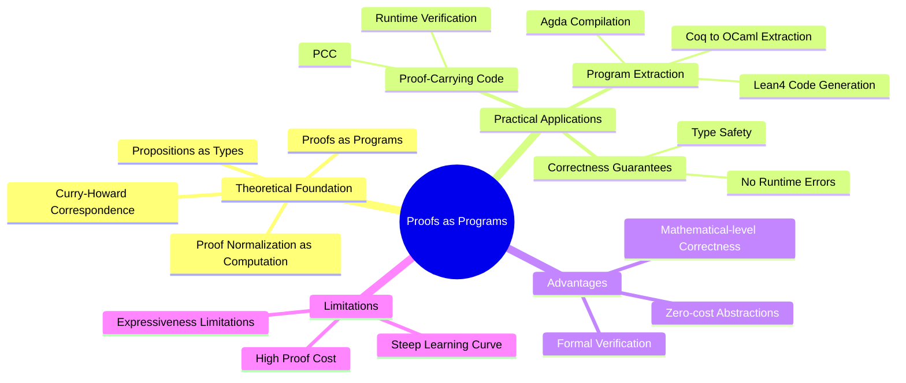

### 3.4 Comparison of Major Theorem Provers

| System | Logic Foundation | Main Features | Notable Applications |
|--------|------------------|---------------|---------------------|
| **Coq** | Calculus of Inductive Constructions | Dependent types, extraction | CompCert compiler, Four Color Theorem |
| **Isabelle/HOL** | Higher-order Logic | Automation tactics | seL4 microkernel, JavaCard |
| **Lean** | Dependent types | Modern meta-programming | Mathlib, LiquidTensor |
| **Agda** | Dependent types | Proof relevance | Type theory research |
| **Twelf** | LF Logical Framework | Higher-order abstract syntax | Programming language metatheory |

---

## 4. Relationship Network

### 4.1 Concept Hierarchy

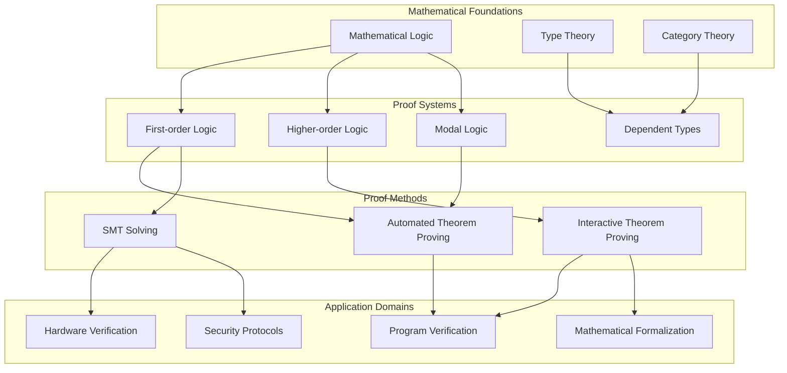

### 4.2 Relationships with Other Core Concepts

| Concept | Relationship | Description |
|---------|--------------|-------------|
| **SMT Solvers** | Tool Implementation | [SMT Solvers](../../../05-verification/03-theorem-proving/02-smt-solvers.md) - Automated verification tools based on theory combination |
| **First-order Logic (FOL)** | Foundation | Core processing object of ATP, decidable but incomplete |
| **Type Theory** | Curry-Howard | Deep correspondence between proofs and programs |
| **Hoare Logic** | Application Instance | Formal system for program correctness verification |
| **Model Checking** | Complementary Technology | ATP handles infinite states, model checking handles finite states |
| **Abstract Interpretation** | Approximation Method | Used for program analysis, can generate proof obligations |

### 4.3 Integration of Theorem Proving and Hoare Logic

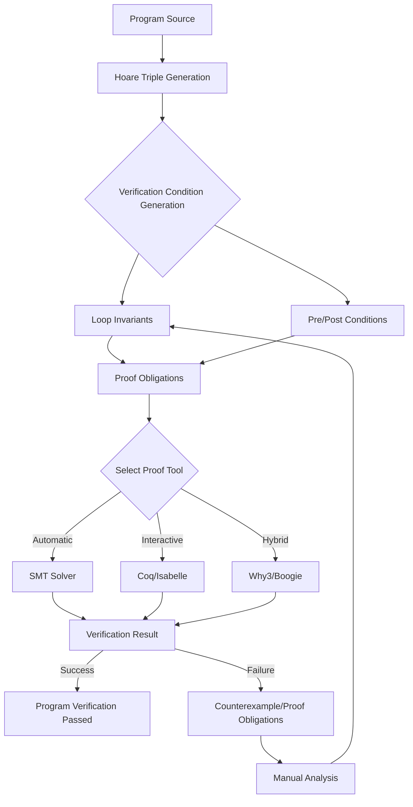

---

## 5. Historical Background

### 5.1 Development Timeline

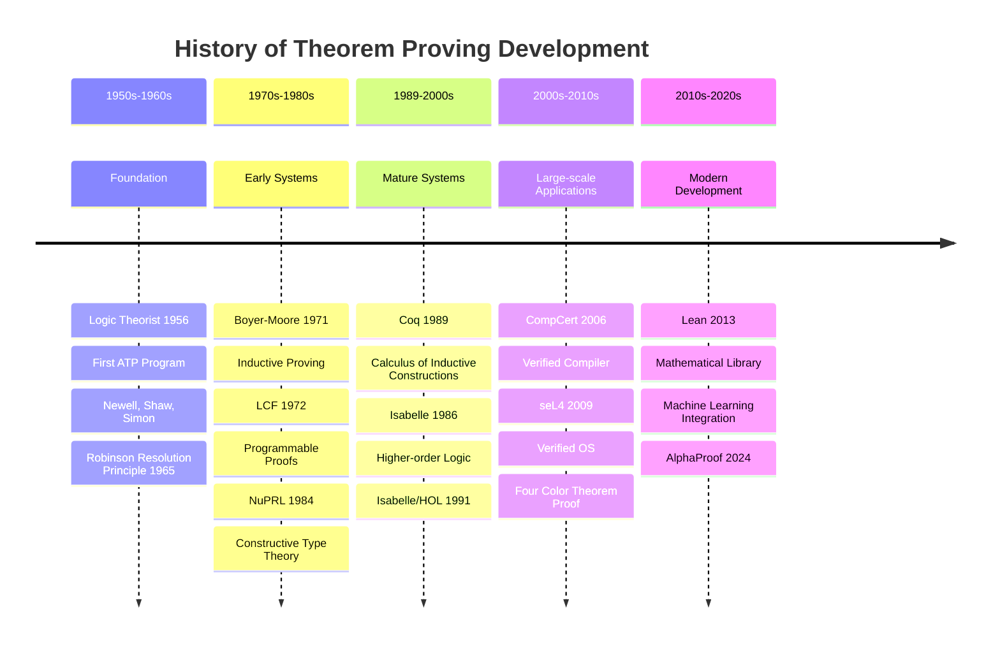

### 5.2 Milestone Events

| Year | Event | Contributor | Significance |
|------|-------|-------------|--------------|
| 1956 | **Logic Theorist** | Newell, Shaw, Simon | First automated theorem proving program, proved theorems from Principia Mathematica |
| 1965 | **Resolution Principle** | J.A. Robinson | Semi-decidable algorithm for first-order logic, theoretical foundation of ATP |
| 1972 | **LCF System** | Milner et al. | Programmable proof assistant paradigm, introduced meta-language ML |
| 1979 | **Boyer-Moore** | Boyer, Moore | Inductive theorem proving, verified computing systems |
| 1984 | **NuPRL** | Constable et al. | Constructive type theory implementation, proofs as programs |
| 1986 | **Isabelle** | Paulson | Generic logical framework supporting multiple logics |
| 1989 | **Coq** | INRIA | Calculus of Inductive Constructions, dependent type proof assistant |
| 1991 | **Isabelle/HOL** | Nipkow et al. | Higher-order logic automation, industrial applications |
| 2004 | **Four Color Theorem** | Gonthier | First completely formalized proof of a major mathematical theorem |
| 2006 | **CompCert** | Leroy | Verified optimizing compiler, commercial applications |
| 2009 | **seL4** | Klein et al. | Verified operating system microkernel |
| 2013 | **Lean** | de Moura | Modern theorem prover, Mathlib project |
| 2024 | **AlphaProof** | DeepMind | AI system reaching IMO silver medal level |

### 5.3 Logic Theorist in Detail

**Def-S-98-08** (Logic Theorist Principle). Logic Theorist searches for proofs through the following strategies:

1. **Substitution Strategy**: Replace subformulas in the theorem with known equivalent expressions
2. **Forward Chaining**: Derive new theorems from known theorems
3. **Backward Chaining**: Decompose goals into subgoals

$$\text{Logic Theorist} = \langle \mathcal{K}, \mathcal{S}, \mathcal{H} \rangle$$

Where:

- $\mathcal{K}$: Knowledge base (axioms and theorems from Principia Mathematica)
- $\mathcal{S}$: Set of substitution rules
- $\mathcal{H}$: Heuristic search strategy

### 5.4 Robinson Resolution Principle in Detail

**Def-S-98-09** (Robinson Resolution). Robinson (1965) proved the **refutation completeness** of the resolution principle:

$$S \models \varphi \quad \Leftrightarrow \quad S \cup \{\neg\varphi\} \vdash_{res} \square$$

That is:

- If clause set $S$ entails $\varphi$, then adding $\neg\varphi$ to $S$ allows derivation of the empty clause via resolution
- This is **refutation complete**: complete only for unsatisfiability, not for all logical consequences

---

## 6. Formal Proofs

### 6.1 Resolution Principle Completeness Theorem

**Thm-S-98-01** (Refutation Completeness of Resolution Principle). Let $S$ be a closed clause set in first-order logic, then:

$$S \text{ is unsatisfiable} \quad \Leftrightarrow \quad S \vdash_{res} \square$$

*Proof*:

**(⇒) Direction**: If $S$ is unsatisfiable, there exists a resolution proof deriving $\square$

1. By **Herbrand's Theorem**, $S$ is unsatisfiable iff there exists a finite ground instance set $S'$ of $S$ that is unsatisfiable
2. Induction on the size of $S'$:
   - **Base case**: $|S'| = 1$, then $S' = \{p, \neg p\}$, resolution directly yields $\square$
   - **Inductive step**: Assume holds for $|S'| < n$, consider $|S'| = n$
3. Take any literal $L$ in $S'$, divide clauses into three groups: containing $L$, containing $\neg L$, and containing neither
4. For clauses containing $L$, delete $L$; for clauses containing $\neg L$, delete $\neg L$; obtain $S''$
5. $S''$ remains unsatisfiable and is smaller, by inductive hypothesis there exists a resolution proof
6. Adding $L$ back yields the resolution proof for original $S'$
7. Through **Lifting Lemma**, ground resolution can be lifted to general resolution

**(⇐) Direction**: Resolution preserves satisfiability

1. Resolution rule is **sound**: If $C_1$ and $C_2$ are satisfiable, then $\text{Res}(C_1, C_2)$ is satisfiable
2. Therefore if $S \vdash_{res} \square$, and $\square$ is unsatisfiable
3. Then $S$ must be unsatisfiable (otherwise contradicts soundness of resolution) ∎

### 6.2 Curry-Howard Isomorphism Theorem

**Thm-S-98-02** (Curry-Howard Isomorphism). There exists the following correspondence between intuitionistic propositional logic $IPC$ and simply typed $\lambda$-calculus $\lambda_\rightarrow$:

$$\Gamma \vdash_{IPC} \varphi \quad \Leftrightarrow \quad \exists t. \Gamma \vdash_{\lambda_\rightarrow} t : \varphi$$

And proof normalization corresponds to $\beta$-reduction:

$$(\text{cut-elimination})(\pi) \quad \longleftrightarrow \quad (\beta\text{-reduction})(t_\pi)$$

*Proof Framework*:

**Part 1: Logic to Types**

Construct mapping $[\cdot] : \text{Form}(IPC) \rightarrow \text{Type}(\lambda_\rightarrow)$:

- $[p_i] = \alpha_i$ (propositional variables correspond to type variables)
- $[\varphi \rightarrow \psi] = [\varphi] \rightarrow [\psi]$
- $[\varphi \land \psi] = [\varphi] \times [\psi]$

Construct $\lambda$-term $t_\pi$ by induction on proof $\pi$:

- Axiom $\Gamma, \varphi \vdash \varphi$ corresponds to variable $x : [\varphi]$
- $\rightarrow$-Intro corresponds to $\lambda$-abstraction
- $\rightarrow$-Elim corresponds to function application
- $\land$-Intro corresponds to pair construction

**Part 2: Preservation Proof**

Proof normalization correspondence:

- Cut elimination in proof ↔ $\beta$-reduction in $(\lambda x.t)\ u \rightarrow_\beta t[u/x]$

**Part 3: Completeness**

Reverse construction: For any well-typed $\lambda$-term, extract corresponding logical proof structure ∎

### 6.3 Gödel's Incompleteness Theorems and Their Impact

**Thm-S-98-03** (Gödel's First Incompleteness Theorem). For any consistent formal system $F$ containing basic arithmetic, there exists a proposition $G$ such that:

$$F \not\vdash G \quad \text{and} \quad F \not\vdash \neg G$$

That is, $F$ is incomplete: there exist propositions neither provable nor refutable in $F$.

*Proof Sketch*:

1. **Gödel Encoding**: Encode formulas and proofs as natural numbers
   - $\ulcorner \varphi \urcorner$: Gödel number of formula $\varphi$
   - $\text{Proof}_F(x, y)$: Representable relation "$x$ is a proof of $y$ in $F$"

2. **Self-reference Construction**: Construct proposition $G$ expressing "$G$ is unprovable in $F$"
   $$G \equiv \neg \exists x. \text{Proof}_F(x, \ulcorner G \urcorner)$$

3. **Key Properties**:
   - If $F \vdash G$, then $G$ is false, contradicting consistency of $F$
   - If $F \vdash \neg G$, then $G$ is provable (since $G$ says "$G$ is unprovable"), also contradiction

**Thm-S-98-04** (Gödel's Second Incompleteness Theorem). For any consistent formal system $F$ containing basic arithmetic:

$$F \not\vdash \text{Con}(F)$$

Where $\text{Con}(F)$ represents the proposition "$F$ is consistent".

*Impact on Theorem Proving*:

| Aspect | Specific Meaning | Coping Strategy |
|--------|------------------|-----------------|
| **Absolute Completeness Unattainable** | Any sufficiently strong system is incomplete | Accept incompleteness, focus on provable problems |
| **Self-proof of Consistency Impossible** | System cannot prove its own consistency internally | Rely on metamathematical proofs from stronger systems |
| **Halting Problem Undecidable** | Program correctness generally undecidable | Use approximation methods, restricted languages |
| **Relative Completeness** | Hoare logic completeness relative to assertion language | Clarify relativity of completeness |

---

## 7. Eight-Dimensional Characterization

### 7.1 Mind Map

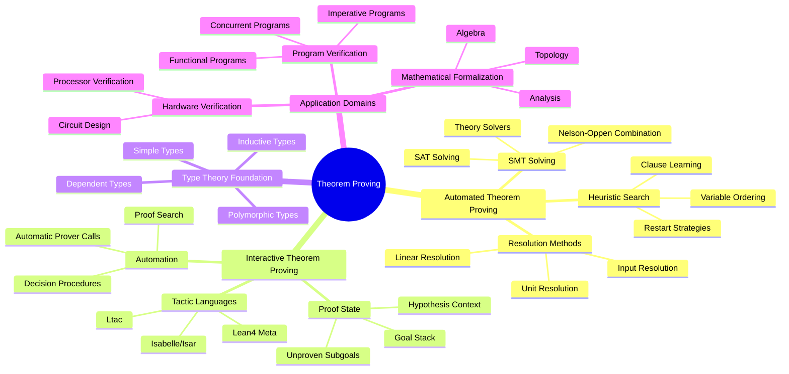

### 7.2 Multi-dimensional Comparison Matrix

| Dimension | ATP | ITP | Manual Proof | Advantage Ratio |
|-----------|-----|-----|--------------|-----------------|
| Automation Level | ⭐⭐⭐⭐⭐ | ⭐⭐⭐ | ⭐ | 5:3:1 |
| Scalability | ⭐⭐⭐ | ⭐⭐⭐⭐⭐ | ⭐⭐ | 3:5:2 |
| Guarantee Strength | ⭐⭐⭐⭐ | ⭐⭐⭐⭐⭐ | ⭐⭐⭐ | 4:5:3 |
| Applicable Scope | ⭐⭐ | ⭐⭐⭐⭐⭐ | ⭐⭐⭐⭐⭐ | 2:5:5 |
| User-friendliness | ⭐⭐⭐⭐ | ⭐⭐⭐ | ⭐⭐ | 4:3:2 |
| Maintenance Cost | Low | Medium | High | 1:2:3 |

### 7.3 Axiom-Theorem Tree

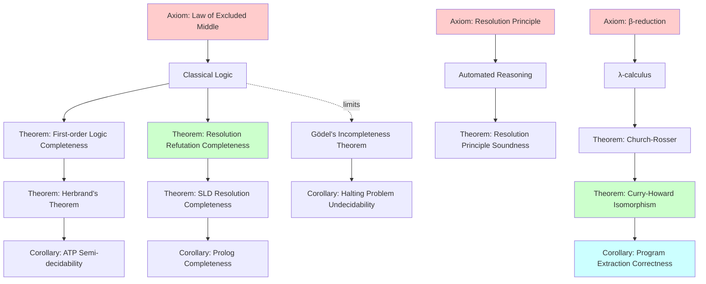

### 7.4 State Transition Diagram

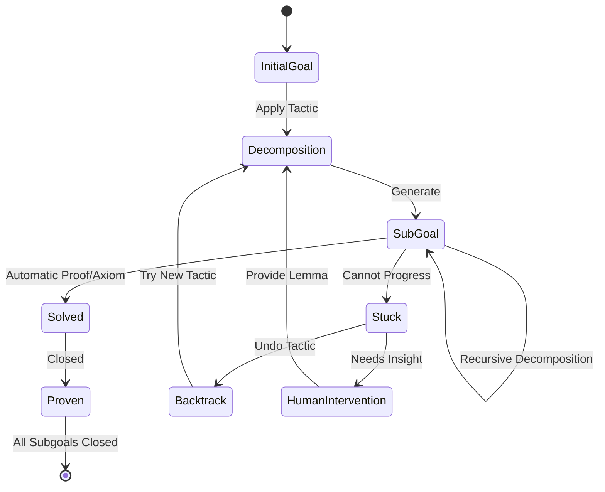

### 7.5 Dependency Graph

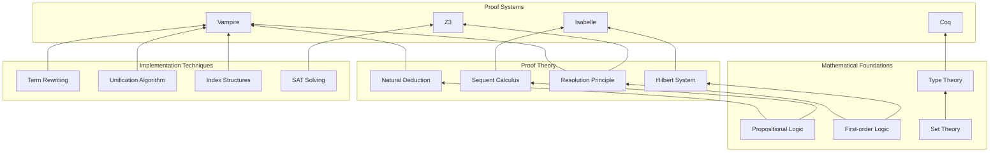

### 7.6 Evolution Timeline

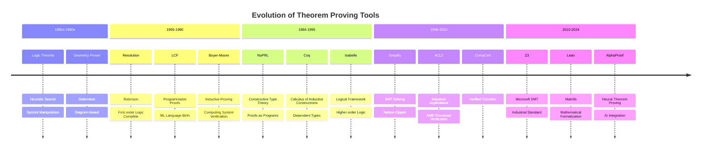

### 7.7 Hierarchical Architecture

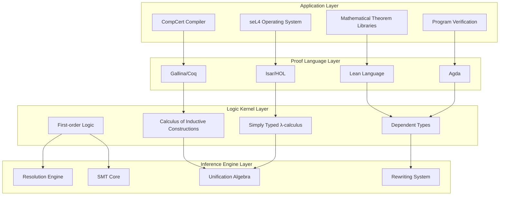

### 7.8 Proof Search Tree

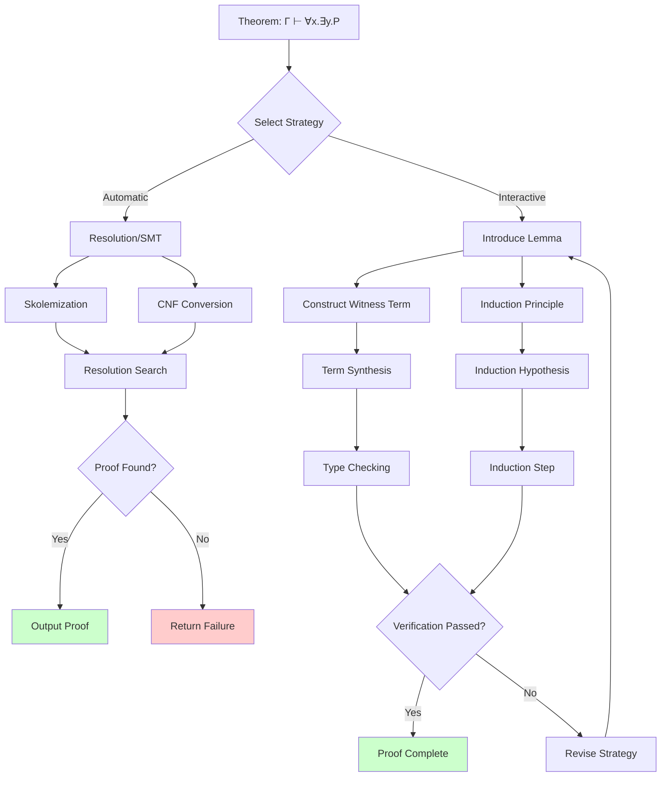

---

## 8. References

### Wikipedia References

### Classic Literature

---

## 9. Related Concepts

- [Coq/Isabelle Theorem Proving](../../../05-verification/03-theorem-proving/01-coq-isabelle.md) - Detailed mainstream theorem proving tools
- [Formal Methods](01-formal-methods.md)
- [Model Checking](02-model-checking.md)
- [Process Calculus](04-process-calculus.md)
- [Temporal Logic](05-temporal-logic.md)
- [Hoare Logic](06-hoare-logic.md)
- [Type Theory](07-type-theory.md)

---

> **Concept Tags**: #TheoremProving #AutomatedReasoning #CurryHoward #FormalVerification #MathematicalLogic
>
> **Learning Difficulty**: ⭐⭐⭐⭐ (Advanced)
>
> **Prerequisites**: First-order Logic, λ-calculus, Mathematical Logic Foundation
>
> **Follow-up Concepts**: Type Theory, Program Verification, Formalized Mathematics

---

*Document Version: v1.0 | Created: 2026-04-10 | Last Updated: 2026-04-10*
