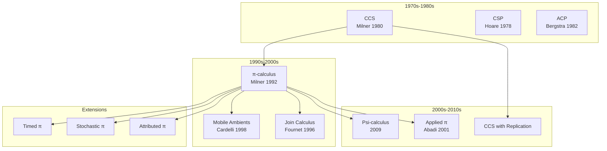
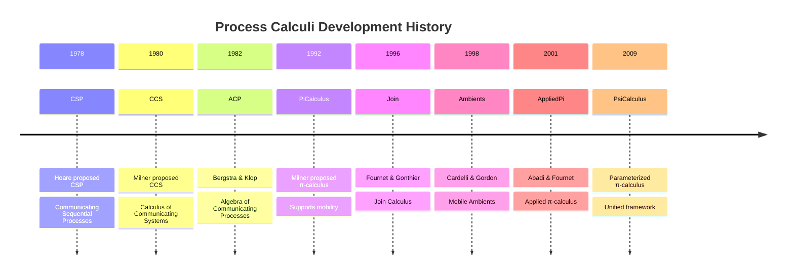
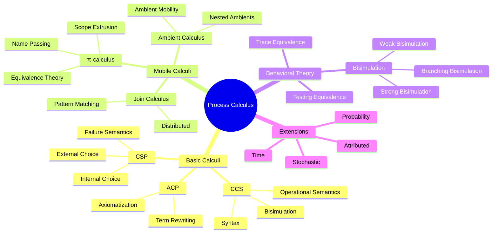
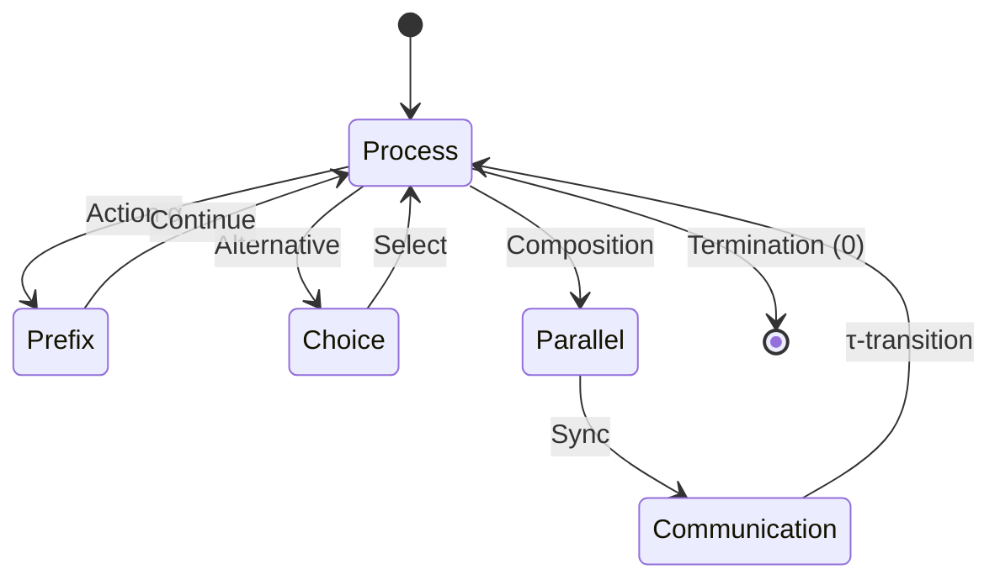
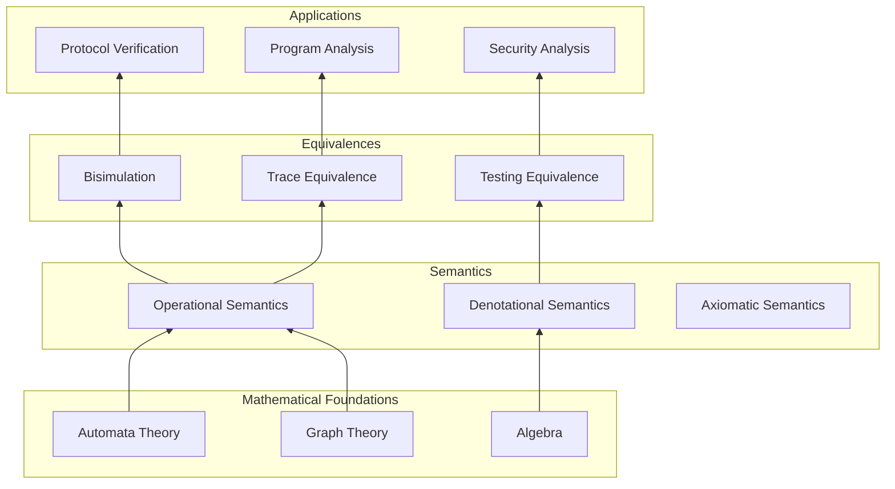
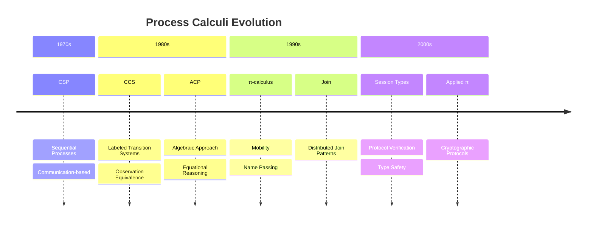
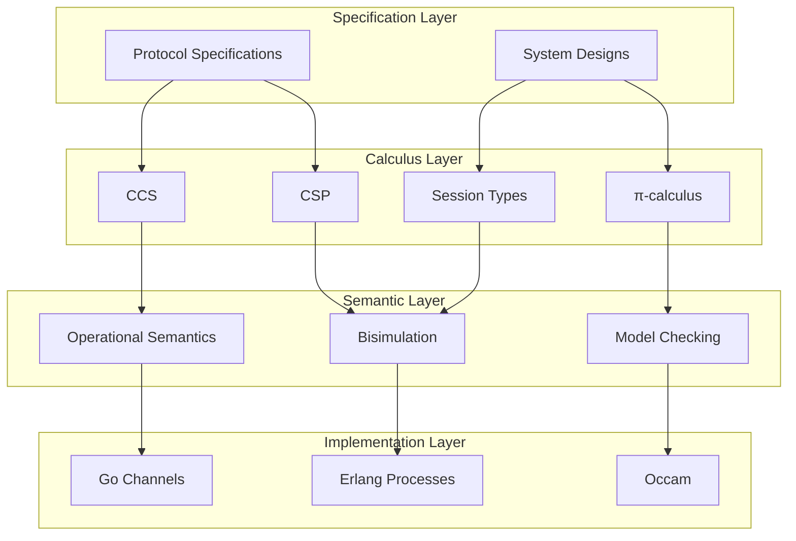

# Process Calculus

> **Wikipedia Standard Definition**: Process calculus is a diverse family of related approaches for formally modeling concurrent systems. Process calculi provide a tool for the high-level description of interactions, communications, and synchronizations between a collection of independent agents or processes.
>
> **Source**: <https://en.wikipedia.org/wiki/Process_calculus>
>
> **Formalization Level**: L4-L5

---

## 1. Wikipedia Standard Definition

### Original English Text
>
> "Process calculus is a diverse family of related approaches for formally modeling concurrent systems. Process calculi provide a tool for the high-level description of interactions, communications, and synchronizations between a collection of independent agents or processes. They also provide algebraic laws that allow process descriptions to be manipulated and analyzed, and permit formal reasoning about equivalences between processes."

---

## 2. Formal Expressions

### 2.1 CCS (Calculus of Communicating Systems)

**Def-S-98-01** (CCS Syntax). CCS processes are defined by the following syntax:

$$P, Q ::= 0 \mid \alpha.P \mid P + Q \mid P \mid Q \mid (\nu a)P \mid A$$

Where:

- $0$: Null process (termination)
- $\alpha.P$: Prefix, where $\alpha \in \mathcal{A} \cup \bar{\mathcal{A}} \cup \{\tau\}$
- $P + Q$: Nondeterministic choice
- $P \mid Q$: Parallel composition
- $(\nu a)P$: Restriction (hiding channel $a$)
- $A$: Process constant, $A \stackrel{\text{def}}{=} P_A$

**Def-S-98-02** (CCS Operational Semantics). SOS rules:

$$
\text{(ACT)} \quad \frac{}{\alpha.P \xrightarrow{\alpha} P}

\quad

\text{(SUM-L)} \quad \frac{P \xrightarrow{\alpha} P'}{P + Q \xrightarrow{\alpha} P'}
$$

$$
\text{(PAR-L)} \quad \frac{P \xrightarrow{\alpha} P'}{P \mid Q \xrightarrow{\alpha} P' \mid Q}

\quad

\text{(COM)} \quad \frac{P \xrightarrow{a} P', Q \xrightarrow{\bar{a}} Q'}{P \mid Q \xrightarrow{\tau} P' \mid Q'}
$$

$$
\text{(RES)} \quad \frac{P \xrightarrow{\alpha} P', \alpha \notin \{a, \bar{a}\}}{(\nu a)P \xrightarrow{\alpha} (\nu a)P'}

\quad

\text{(CON)} \quad \frac{P_A \xrightarrow{\alpha} P', A \stackrel{\text{def}}{=} P_A}{A \xrightarrow{\alpha} P'}
$$

### 2.2 CSP (Communicating Sequential Processes)

**Def-S-98-03** (CSP Syntax). CSP processes:

$$P, Q ::= \text{SKIP} \mid \text{STOP} \mid a \rightarrow P \mid P \square Q \mid P \sqcap Q \mid P \parallel_A Q \mid P \setminus A \mid \mu X \cdot F(X)$$

Where:

- $\square$: External choice (environment decides)
- $\sqcap$: Internal choice (process decides)
- $\parallel_A$: Parallel composition, synchronizing on $A$
- $\setminus A$: Hiding (abstraction)
- $\mu X \cdot F(X)$: Recursion

### 2.3 π-calculus (Pi Calculus)

**Def-S-98-04** (π-calculus Syntax). π-calculus extends CCS to support channel passing:

$$P, Q ::= 0 \mid \alpha.P \mid P + Q \mid P \mid Q \mid (\nu x)P \mid !P$$

Where actions $\alpha$:

- $x(y)$: Receive name $y$ on channel $x$
- $\bar{x}\langle y \rangle$: Send name $y$ on channel $x$
- $\tau$: Internal action

**Def-S-98-05** (Name Passing Semantics). Key rules:

$$
\text{(IN)} \quad x(y).P \xrightarrow{x(z)} P\{z/y\}

\quad

\text{(OUT)} \quad \bar{x}\langle y \rangle.P \xrightarrow{\bar{x}\langle y \rangle} P
$$

$$
\text{(CLOSE)} \quad \frac{P \xrightarrow{x(z)} P', Q \xrightarrow{\bar{x}\langle z \rangle} Q', z \notin \text{fn}(Q)}{P \mid Q \xrightarrow{\tau} (\nu z)(P' \mid Q')}
$$

---

## 3. Properties and Characteristics

### 3.1 Core Characteristics

| Characteristic | CCS | CSP | π-calculus |
|----------------|-----|-----|------------|
| **Communication Style** | Synchronous | Synchronous | Synchronous |
| **Channel Passing** | No | No | Yes |
| **Mobility** | No | No | Yes |
| **Choice Operators** | $+$ | $\square, \sqcap$ | $+$ |
| **Recursion** | Constant definition | $\mu$ operator | $!$ (replication) |

### 3.2 Behavioral Equivalences

**Def-S-98-06** (Strong Bisimulation). Relation $\mathcal{R}$ is a strong bisimulation if:

$$(P, Q) \in \mathcal{R} \Rightarrow \forall \alpha:$$

- If $P \xrightarrow{\alpha} P'$, then $\exists Q': Q \xrightarrow{\alpha} Q'$ and $(P', Q') \in \mathcal{R}$
- If $Q \xrightarrow{\alpha} Q'$, then $\exists P': P \xrightarrow{\alpha} P'$ and $(P', Q') \in \mathcal{R}$

**Def-S-98-07** (Weak Bisimulation). Ignoring internal action $\tau$:

$$P \approx Q \text{ (weak bisimulation)} \Leftrightarrow P \approx_b Q \text{ (branching bisimulation)}$$

**Def-S-98-08** (Bisimulation Equivalence). Maximum bisimulation:

$$\sim \stackrel{\text{def}}{=} \bigcup\{\mathcal{R} : \mathcal{R} \text{ is a bisimulation}\}$$

---

## 4. Relationship Network

### 4.1 Process Calculi Spectrum



### 4.2 Relationships with Core Concepts

| Concept | Relationship | Description |
|---------|--------------|-------------|
| **Bisimulation** | Core | Fundamental theory of process equivalence |
| **Temporal Logic** | Specification Language | Logic for describing process properties |
| **Model Checking** | Verification Tool | Automatic verification of process properties |
| **Type Theory** | Extension | Session types for verifying communication protocols |
| **Category Theory** | Semantic Foundation | Coalgebraic semantics, open maps |

---

## 5. Historical Background

### 5.1 Development Timeline



### 5.2 Milestones

| Year | Contribution | Significance |
|------|--------------|--------------|
| 1978 | CSP | Structured concurrent programming |
| 1980 | CCS | Foundation of concurrency theory |
| 1989 | Bisimulation Congruence | Milner proved CCS bisimulation is a congruence |
| 1992 | π-calculus | Mobile computing theory |
| 2001 | Consistency Checking | Session type theory |
| 2020+ | Probabilistic/Real-time Extensions | Quantitative analysis |

---

## 6. Formal Proofs

### 6.1 Bisimulation Congruence Theorem

**Thm-S-98-01** (CCS Bisimulation is a Congruence). Strong bisimulation $\sim$ is a congruence relation for CCS:

$$P \sim Q \Rightarrow \forall C[\cdot]: C[P] \sim C[Q]$$

Where $C[\cdot]$ is any context.

*Proof*:

1. Define context: Process expressions with holes
2. Prove each operator preserves bisimulation:
   - Prefix: If $P \sim Q$, then $\alpha.P \sim \alpha.Q$
   - Sum: If $P_1 \sim Q_1$ and $P_2 \sim Q_2$, then $P_1 + P_2 \sim Q_1 + Q_2$
   - Parallel: If $P_1 \sim Q_1$ and $P_2 \sim Q_2$, then $P_1 \mid P_2 \sim Q_1 \mid Q_2$
   - Restriction: If $P \sim Q$, then $(\nu a)P \sim (\nu a)Q$
3. By induction, all contexts preserve bisimulation ∎

### 6.2 Congruence in π-calculus

**Thm-S-98-02** (Early Bisimulation in π-calculus). In π-calculus, strong bisimulation is a congruence relation.

*Note*: For weak bisimulation, **early** or **late** semantic variants are needed.

### 6.3 Expressiveness Theorem

**Thm-S-98-03** (Turing Completeness of π-calculus). π-calculus is Turing complete.

*Proof Sketch*:

1. λ-calculus can be encoded in π-calculus
2. λ-calculus is Turing complete
3. Therefore π-calculus is also Turing complete ∎

---

## 7. Eight-Dimensional Characterization

### 7.1 Mind Map



### 7.2 Multi-dimensional Comparison Matrix

| Dimension | CCS | CSP | π-calculus | ACP |
|-----------|-----|-----|------------|-----|
| Learning Curve | Medium | Low | High | High |
| Expressiveness | Medium | Medium | High | Medium |
| Tool Support | Good | Excellent | Medium | Medium |
| Industrial Applications | Research | Widespread | Research | Research |
| Semantic Clarity | High | High | Medium | High |

### 7.3 Axiom-Theorem Tree

```mermaid
graph TD
    A1[Axiom: Process Calculus Basic Laws] --> B1[Sum Laws]
    A1 --> B2[Parallel Laws]
    A1 --> B3[Restriction Laws]

    B1 --> C1[Commutativity: P+Q = Q+P]
    B1 --> C2[Associativity: (P+Q)+R = P+(Q+R)]
    B1 --> C3[Identity: P+0 = P]

    B2 --> D1[Commutativity: P|Q = Q|P]
    B2 --> D2[Associativity: (P|Q)|R = P|(Q|R)]
    B2 --> D3[Identity: P|0 = P]

    B3 --> E1[Scope Restriction: (νa)0 = 0]
    B3 --> E2[Expansion: (νa)(P|Q) = P|(νa)Q, a∉fn(P)]

    C1 --> F1[Theorem: Bisimulation is a Congruence]
    D1 --> F1
    E2 --> F1

    F1 --> G1[Corollary: Equational Reasoning is Valid]

    style A1 fill:#ffcccc
    style F1 fill:#ccffcc
    style G1 fill:#ccffff
```

### 7.4 State Transition Diagram



### 7.5 Dependency Graph



### 7.6 Evolution Timeline



### 7.7 Hierarchical Architecture



### 7.8 Proof Search Tree

```mermaid
graph TD
    A[Goal: Prove P ~ Q] --> B{Structural Analysis}

    B -->|Both Atomic| C[Direct Comparison]
    B -->|Prefix| D[α.P ~ α.Q]
    B -->|Choice| E[P1+P2 ~ Q1+Q2]
    B -->|Parallel| F[P1|P2 ~ Q1|Q2]

    C --> G{Equal?}
    G -->|Yes| H[✓ Bisimilar]
    G -->|No| I[✗ Not Bisimilar]

    D --> J[Prove P ~ Q]
    E --> K[Prove P1 ~ Q1 or P1 ~ Q2]
    F --> L[Prove P1 ~ Q1 and P2 ~ Q2]

    J --> M{Recursive Check}
    K --> M
    L --> M

    M -->|Success| H
    M -->|Failure| I

    style H fill:#ccffcc
    style I fill:#ffcccc
```

---

## 8. References

### Wikipedia References


### Classic Literature


---

## 9. Related Concepts

- [Bisimulation](09-bisimulation.md)
- [Temporal Logic](05-temporal-logic.md)
- [Model Checking](02-model-checking.md)
- [Type Theory](07-type-theory.md) (Session types)

---

> **Concept Tags**: #ProcessCalculus #Concurrency #CCS #CSP #PiCalculus #Bisimulation
>
> **Learning Difficulty**: ⭐⭐⭐⭐ (Advanced)
>
> **Prerequisites**: Formal Semantics, Operational Semantics
>
> **Follow-up Concepts**: Bisimulation, Session Types, Concurrent Program Verification

---

*Document Version: v1.0 | Created: 2026-04-10 | Last Updated: 2026-04-10*
