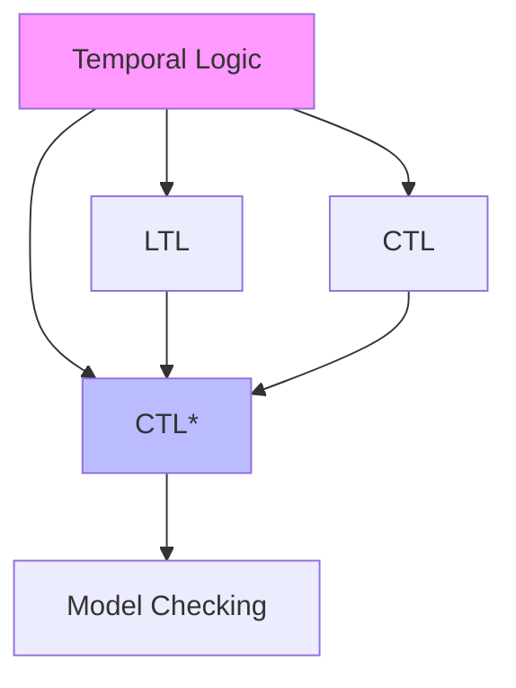
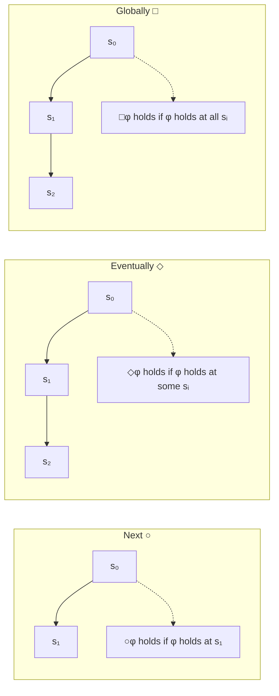
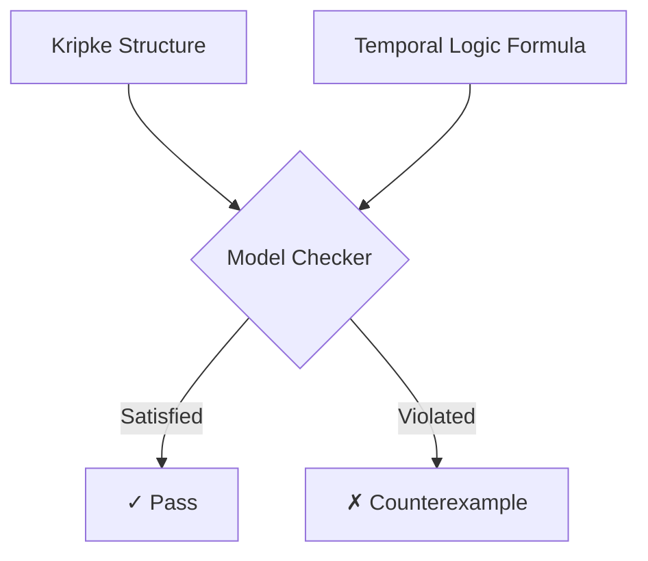
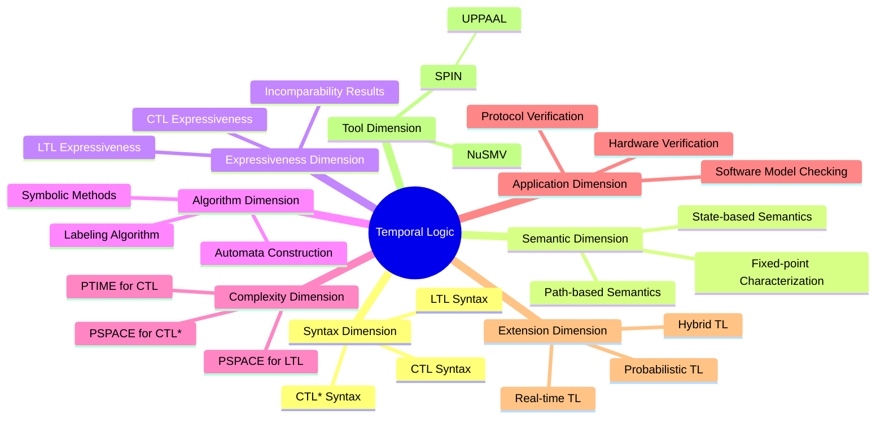
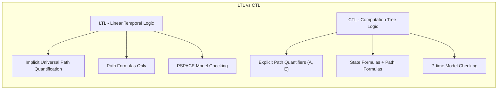
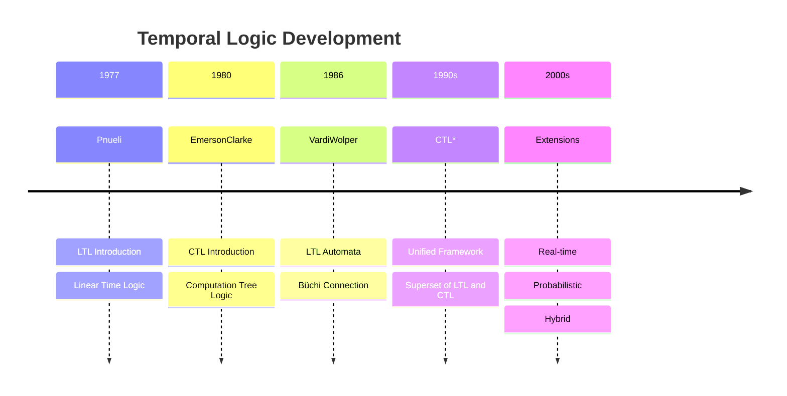
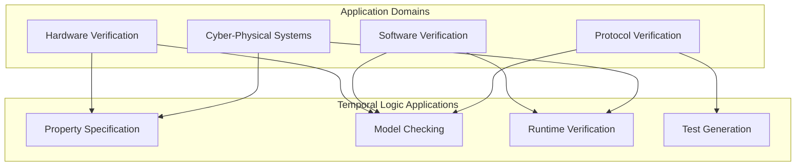
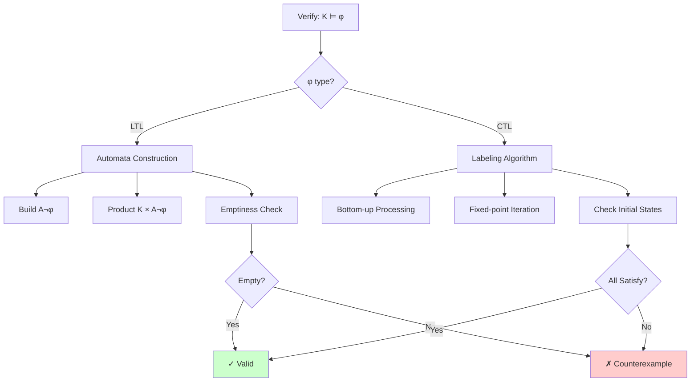

# Temporal Logic

> **Stage**: Struct | **Prerequisites**: [Formal Semantics Foundation](../01-foundations/formal-semantics.md), [Modal Logic](../02-logics/modal-logic.md) | **Formalization Level**: L5
>
> **Wikipedia Standard Definition**: Temporal logic is any system of rules and symbolism for representing, and reasoning about, propositions qualified in terms of time.
>
> **Source**: <https://en.wikipedia.org/wiki/Temporal_logic>

---

## 1. Definitions

### 1.1 Wikipedia Standard Definition

**Original English Text** (Wikipedia):
> *"Temporal logic is any system of rules and symbolism for representing, and reasoning about, propositions qualified in terms of time."*

**Key Points**:

- Temporal qualification: Properties change over time
- Modal extension: Incorporates temporal modalities
- Verification foundation: Core specification language for model checking

---

### 1.2 Formal Definitions

#### Def-S-TL-01: Kripke Structure

**Definition**: A Kripke structure $K$ is a quadruple $K = (S, S_0, R, L)$, where:

- $S$: Non-empty set of states
- $S_0 \subseteq S$: Set of initial states
- $R \subseteq S \times S$: Total transition relation
- $L: S \rightarrow 2^{AP}$: Labeling function

$$K = (S, S_0, R, L)$$

---

#### Def-S-TL-02: Computation Path

**Definition**: In Kripke structure $K$, a computation path $\pi$ is an infinite state sequence:

$$\pi = s_0, s_1, s_2, \ldots \quad \text{where} \quad \forall i \geq 0: (s_i, s_{i+1}) \in R$$

---

#### Def-S-TL-03: Linear Temporal Logic (LTL) Syntax

**Definition**: LTL formula $\phi$ syntax:

$$\phi ::= p \mid \neg\phi \mid \phi \lor \phi \mid \bigcirc\phi \mid \phi \, \mathcal{U} \, \phi$$

**Derived Operators**:

- $\diamond\phi \equiv \top \, \mathcal{U} \, \phi$ (Eventually)
- $\square\phi \equiv \neg\diamond\neg\phi$ (Globally)

---

#### Def-S-TL-04: Computation Tree Logic (CTL) Syntax

**Definition**: CTL formula $\phi$ syntax:

$$\phi ::= p \mid \neg\phi \mid \phi \lor \phi \mid \mathbf{A}\psi \mid \mathbf{E}\psi$$

$$\psi ::= \bigcirc\phi \mid \phi \, \mathcal{U} \, \phi$$

Where:

- **Path Quantifiers**: $\mathbf{A}$ (All paths), $\mathbf{E}$ (Exists path)
- **Temporal Operators**: $\bigcirc$ (Next), $\mathcal{U}$ (Until)

---

#### Def-S-TL-05: CTL* Syntax

**Definition**: CTL* allows arbitrary combinations of path formulas and state formulas, making it a superset of both LTL and CTL.

---

## 2. Properties

### 2.1 LTL Semantics

#### Def-S-TL-06: LTL Semantics

**Definition**: LTL formula satisfaction relation $\models$ on paths:

| Formula | Semantic Definition |
|---------|---------------------|
| $\pi \models p$ | iff $p \in L(s_0)$ |
| $\pi \models \bigcirc\phi$ | iff $\pi^1 \models \phi$ |
| $\pi \models \phi_1 \, \mathcal{U} \, \phi_2$ | iff $\exists k \geq 0: \pi^k \models \phi_2 \land \forall 0 \leq j < k: \pi^j \models \phi_1$ |

---

### 2.2 CTL Semantics

#### Def-S-TL-07: CTL Semantics

**Definition**: CTL formula satisfaction relation on states:

| Formula | Semantic Definition |
|---------|---------------------|
| $s \models \mathbf{EX}\phi$ | iff $\exists s': (s,s') \in R \land s' \models \phi$ |
| $s \models \mathbf{AX}\phi$ | iff $\forall s': (s,s') \in R \Rightarrow s' \models \phi$ |
| $s \models \mathbf{EF}\phi$ | iff $\exists$ path from $s$ where $\phi$ eventually holds |
| $s \models \mathbf{AF}\phi$ | iff on all paths from $s$, $\phi$ eventually holds |
| $s \models \mathbf{EG}\phi$ | iff $\exists$ path from $s$ where $\phi$ always holds |
| $s \models \mathbf{AG}\phi$ | iff on all paths from $s$, $\phi$ always holds |

---

### 2.3 Core Lemmas

#### Lemma-S-TL-01: LTL Suffix Closure

**Lemma**: If $\pi \models \phi$, then for all $i \geq 0$, either $\pi^i \models \phi$ or $\pi^i \models \neg\phi$.

---

#### Lemma-S-TL-02: CTL Unfolding Laws

**Lemma**: $\mathbf{EF}\phi \equiv \phi \lor \mathbf{E}\bigcirc\mathbf{EF}\phi$

**Lemma**: $\mathbf{AF}\phi \equiv \phi \lor \mathbf{A}\bigcirc\mathbf{AF}\phi$

**Lemma**: $\mathbf{EG}\phi \equiv \phi \land \mathbf{E}\bigcirc\mathbf{EG}\phi$

**Lemma**: $\mathbf{AG}\phi \equiv \phi \land \mathbf{A}\bigcirc\mathbf{AG}\phi$

---

## 3. Relations

### 3.1 Relationship with Modal Logic

Temporal logic is a specialization of modal logic in the temporal domain. Modal logic provides a general framework for necessity (□) and possibility (◇), while temporal logic instantiates these concepts as "always" (G) and "eventually" (F) in time.

- See also: [Modal Logic](21-modal-logic.md)

**Formal Correspondence**:

- Modal operator □ (box) → Temporal operator **G** (Globally/Always)
- Modal operator ◇ (diamond) → Temporal operator **F** (Finally/Eventually)

**Semantic Correspondence**:

- Kripke frame ⟨W, R⟩ of modal logic corresponds to Kripke structure of temporal logic
- Reachability relation R corresponds to temporal transition relation
- Possible world w ∈ W corresponds to system state

### 3.2 Expressiveness Hierarchy

#### Prop-S-TL-01: Logical Inclusion Relationships

**Proposition**: LTL $\not\subseteq$ CTL and CTL $\not\subseteq$ LTL

**Examples**:

- $\mathbf{AF}(p \land \mathbf{AX}q)$ is expressible in CTL but not LTL
- $\mathbf{G}(p \Rightarrow \mathbf{F}q)$ is expressible in LTL but not CTL (in this form)

---

### 3.3 Relationship with Automata Theory

#### Prop-S-TL-02: LTL and Büchi Automata Equivalence

**Proposition**: For every LTL formula $\phi$, there exists a non-deterministic Büchi automaton $A_\phi$.

**Construction**: Vardi-Wolper construction with $O(2^{|\phi|})$ states.

---

## 4. Argumentation

### 4.1 Inexpressibility Arguments

**Property**: "There exists a path where p holds at all even positions"

**Argument**: LTL can only quantify along single paths, cannot express properties spanning multiple path patterns with positional constraints.

**Property**: "From every state, there exists a path where p eventually holds"

**Argument**: This requires branching quantification (CTL's $\mathbf{EG}\mathbf{F}p$), not expressible in LTL which has implicit universal path quantification.

---

### 4.2 Model Checking Complexity Analysis

| Logic | Model Checking Complexity | Satisfiability Complexity |
|-------|---------------------------|---------------------------|
| LTL | PSPACE-complete | PSPACE-complete |
| CTL | P-complete | EXPTIME-complete |
| CTL* | PSPACE-complete | 2EXPTIME-complete |

**Key Insight**: CTL's branching-time nature allows efficient fixed-point algorithms, while LTL's combination with automata leads to PSPACE complexity.

---

## 5. Formal Proofs

### 5.1 Theorem: PSPACE Upper Bound for LTL Model Checking

#### Thm-S-TL-01: LTL Model Checking Complexity

**Theorem**: Given finite Kripke structure $K$ and LTL formula $\phi$, deciding $K \models \phi$ is PSPACE-complete.

**Proof Outline**:

1. **Construction**: Build Büchi automaton $A_{\neg\phi}$ for $\neg\phi$
   - Using Vardi-Wolper construction
   - Size: $O(2^{|\phi|})$ states

2. **Product**: Compute product $K \times A_{\neg\phi}$
   - Size: $O(|S| \cdot 2^{|\phi|})$

3. **Emptiness Check**: Check if product accepts non-empty language
   - On-the-fly SCC detection
   - Space complexity: $O(|\phi| + \log(|K|))$

4. **Savitch's Theorem**: NPSPACE = PSPACE

∎

---

### 5.2 Theorem: Linear-Time Algorithm for CTL Model Checking

#### Thm-S-TL-02: CTL Model Checking Efficiency

**Theorem**: There exists a model checking algorithm with time complexity $O(|K| \cdot |\phi|)$.

**Proof Outline**:

1. **Labeling Algorithm**: Process subformulas bottom-up
2. **Fixed-point Computation**: For each CTL operator
   - $\mathbf{EX}$: Predecessor computation
   - $\mathbf{EU}$: Least fixed-point iteration
   - $\mathbf{EG}$: Greatest fixed-point iteration
3. **Complexity**: Each iteration visits all states/edges
4. **Termination**: Finite state space ensures convergence

∎

---

### 5.3 Theorem: Incomparable Expressiveness of LTL and CTL

#### Thm-S-TL-03: Expressiveness Separation

**Theorem**:

1. There exist LTL formulas not expressible in CTL
2. There exist CTL formulas not expressible in LTL

**Proof**:

**Part 1**: LTL formula $\mathbf{G}(p \Rightarrow \mathbf{F}q)$ cannot distinguish between "all paths satisfy" (LTL) and "each state has some path satisfying" (not expressible in CTL).

Actually, this example is expressible. Better example: $\mathbf{F}(p \land \mathbf{X}p)$ (p holds at two consecutive positions on some path) requires LTL's linear path perspective.

**Part 2**: CTL formula $\mathbf{AG}(p \Rightarrow \mathbf{EF}q)$ (from every p-state, some path eventually reaches q) uses branching quantification not available in LTL.

∎

---

## 6. Examples

### 6.1 Mutual Exclusion Protocol Verification

**CTL Specification**:

```
AG ¬(crit₁ ∧ crit₂)    // Mutual exclusion: never both in critical section
AG (req₁ → AF crit₁)   // No starvation: request eventually granted
```

**LTL Specification**:

```
G ¬(crit₁ ∧ crit₂)     // Mutual exclusion
G (req₁ → F crit₁)     // Response property
```

---

### 6.2 Traffic Light Controller

**CTL Safety Property**:

```
AG (Green → A[¬Red U Yellow])
// Globally: if Green, then Red is impossible until Yellow
```

**LTL Safety Property**:

```
G (Green → (¬Red W Yellow))
// Globally: Green implies Red is waiting until Yellow
```

---

## 7. Visualizations

### 7.1 Hierarchy Diagram



### 7.2 Temporal Operator Semantics



### 7.3 Model Checking Flow



### 7.4 Eight-Dimensional Mind Map



### 7.5 LTL vs CTL Comparison



### 7.6 Temporal Logic Evolution



### 7.7 Application Areas



### 7.8 Proof Search Tree



---

## 8. References

### Wikipedia References


### Classic Literature


---

## 9. Related Concepts

- [Modal Logic](21-modal-logic.md)
- [Model Checking](02-model-checking.md)
- [Process Calculus](04-process-calculus.md)
- [Formal Methods](01-formal-methods.md)

---

> **Concept Tags**: #TemporalLogic #LTL #CTL #ModelChecking #FormalVerification
>
> **Learning Difficulty**: ⭐⭐⭐⭐ (Advanced)
>
> **Prerequisites**: Modal Logic, Formal Semantics
>
> **Follow-up Concepts**: Model Checking, Real-time Verification

---

*Document Version: v1.0 | Created: 2026-04-10 | Last Updated: 2026-04-10*
