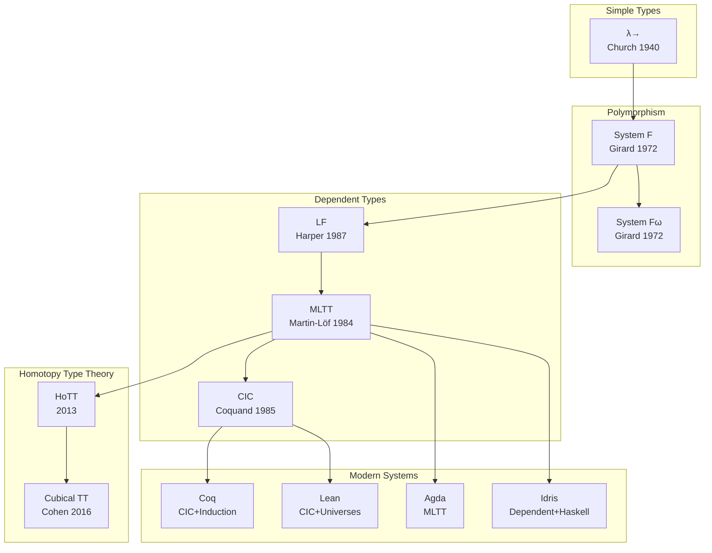
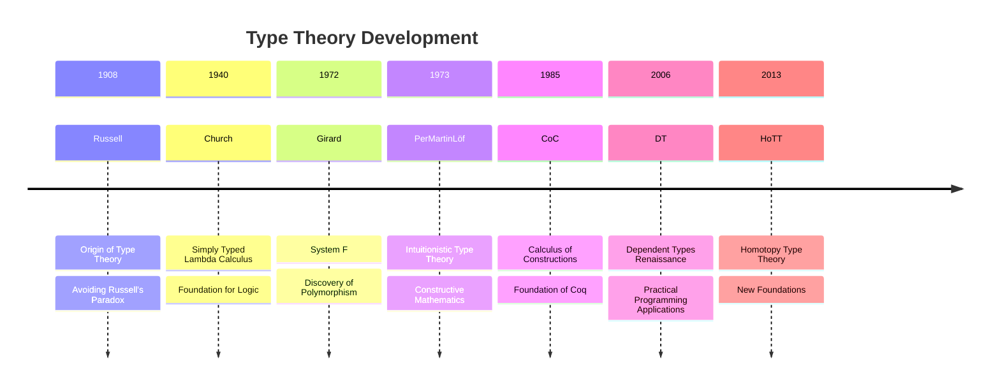

# Type Theory

> **Wikipedia Standard Definition**: In mathematics, logic, and computer science, a type theory is the formal presentation of a specific type system. Type theory is the academic study of type systems.
>
> **Source**: <https://en.wikipedia.org/wiki/Type_theory>
>
> **Formalization Level**: L4-L6

---

## 1. Wikipedia Standard Definition

### Original English Definition

> "In mathematics, logic, and computer science, a type theory is the formal presentation of a specific type system. Type theory is the academic study of type systems. Some type theories serve as alternatives to set theory as a foundation of mathematics. Two well-known type theories that can serve as foundations are Alonzo Church's typed λ-calculus and Per Martin-Löf's intuitionistic type theory."

### Key Points

- **Formal Presentation**: Type theory provides rigorous syntax and semantics for type systems
- **Academic Study**: Investigation of properties like type safety, normalization, and decidability
- **Foundation of Mathematics**: Alternative to set theory for building mathematical structures
- **Computation Connection**: Deep relationship with programming languages and proof assistants

---

## 2. Formal Expressions

### 2.1 Simply Typed Lambda Calculus (λ→)

**Def-S-98-01** (Type Syntax). Simple types:

$$\tau, \sigma ::= \iota \mid \tau \rightarrow \sigma$$

where $\iota$ represents base types (e.g., Bool, Nat).

**Def-S-98-02** (Term Syntax). Typed lambda terms:

$$t, u ::= x \mid \lambda x:\tau.t \mid t\,u \mid c$$

**Def-S-98-03** (Type Judgment). Under context $\Gamma$, term $t$ has type $\tau$:

$$\Gamma \vdash t : \tau$$

**Def-S-98-04** (Typing Rules).

$$
\text{(VAR)} \quad \frac{x:\tau \in \Gamma}{\Gamma \vdash x : \tau}
$$

$$
\text{(ABS)} \quad \frac{\Gamma, x:\tau \vdash t : \sigma}{\Gamma \vdash \lambda x:\tau.t : \tau \rightarrow \sigma}
$$

$$
\text{(APP)} \quad \frac{\Gamma \vdash t : \tau \rightarrow \sigma, \quad \Gamma \vdash u : \tau}{\Gamma \vdash t\,u : \sigma}
$$

### 2.2 System F (Polymorphic Lambda Calculus)

**Def-S-98-05** (System F Syntax). Extended types with type variables and universal quantification:

$$\tau ::= \alpha \mid \tau \rightarrow \tau \mid \forall\alpha.\tau$$

**Def-S-98-06** (Type Abstraction and Application).

$$
\text{(TABS)} \quad \frac{\Gamma \vdash t : \tau, \quad \alpha \notin \text{FTV}(\Gamma)}{\Gamma \vdash \Lambda\alpha.t : \forall\alpha.\tau}
$$

$$
\text{(TAPP)} \quad \frac{\Gamma \vdash t : \forall\alpha.\tau}{\Gamma \vdash t[\sigma] : \tau\{\sigma/\alpha\}}
$$

### 2.3 Martin-Löf Type Theory (MLTT)

**Def-S-98-07** (Judgment Forms). MLTT has four forms of judgment:

1. $\Gamma \vdash A\,\text{type}$ — $A$ is a well-formed type
2. $\Gamma \vdash A \equiv B\,\text{type}$ — $A$ and $B$ are equal types
3. $\Gamma \vdash a : A$ — $a$ is a term of type $A$
4. $\Gamma \vdash a \equiv b : A$ — $a$ and $b$ are equal terms in type $A$

**Def-S-98-08** (Inductive Types). Inductive types are defined by constructors:

$$
\frac{\Gamma \vdash a : A \quad \Gamma \vdash b : B(a)}{\Gamma \vdash (a, b) : \Sigma x:A.B(x)} \quad (\Sigma\text{-INTRO})
$$

$$
\frac{\Gamma \vdash p : \Sigma x:A.B(x)}{\Gamma \vdash \pi_1(p) : A} \quad (\Sigma\text{-ELIM}_1)
$$

---

## 3. Properties and Characteristics

### 3.1 Curry-Howard Isomorphism

**Def-S-98-09** (Curry-Howard-Lambek Correspondence). Three-domain isomorphism:

| Logic | Type Theory | Category Theory |
|-------|-------------|-----------------|
| Proposition $P$ | Type $P$ | Object $P$ |
| Proof $p: P$ | Term $p : P$ | Morphism $p: 1 \rightarrow P$ |
| $P \Rightarrow Q$ | Function type $P \rightarrow Q$ | Exponential object $Q^P$ |
| $P \land Q$ | Product type $P \times Q$ | Product $P \times Q$ |
| $P \lor Q$ | Sum type $P + Q$ | Coproduct $P + Q$ |
| $\forall x.P(x)$ | Dependent product $\Pi x:A.P(x)$ | Right adjoint $\Pi$ |
| $\exists x.P(x)$ | Dependent sum $\Sigma x:A.P(x)$ | Left adjoint $\Sigma$ |
| True | Unit type $\top$ | Terminal object $1$ |
| False | Empty type $\bot$ | Initial object $0$ |

### 3.2 Type System Properties

| Property | Definition | Importance |
|----------|------------|------------|
| **Type Safety** | Progress + Preservation | ⭐⭐⭐⭐⭐ |
| **Strong Normalization** | All well-typed terms terminate | ⭐⭐⭐⭐⭐ |
| **Consistency** | Cannot prove False | ⭐⭐⭐⭐⭐ |
| **Expressiveness** | Can express complex mathematical structures | ⭐⭐⭐⭐ |
| **Decidability** | Type checking is decidable | ⭐⭐⭐⭐ |

---

## 4. Relation Network

### 4.1 Type Theory Genealogy

### 4.2 Relations with Core Concepts

| Concept | Relation | Explanation |
|---------|----------|-------------|
| **Set Theory** | Alternative Foundation | Two choices for mathematical foundations |
| **Logic** | Curry-Howard | Propositions as types, proofs as programs |
| **Category Theory** | Semantics | CCC (Cartesian Closed Categories) correspond to λ-calculus |
| **Proof Assistants** | Implementation | Coq, Lean based on type theory |
| **Programming Languages** | Application | Foundation for type system design |

---

## 5. Historical Background

### 5.1 Development Timeline

### 5.2 Milestones

| Year | Figure | Contribution |
|------|--------|--------------|
| 1908 | Bertrand Russell | Type theory to avoid paradox |
| 1940 | Alonzo Church | Simply typed lambda calculus |
| 1972 | Jean-Yves Girard | Discovery of System F |
| 1973 | Per Martin-Löf | Intuitionistic type theory |
| 1985 | Thierry Coquand | Calculus of Constructions (CoC) |
| 1991 | Thierry Coquand | Calculus of Inductive Constructions (CIC) |
| 2013 | Voevodsky et al. | Homotopy Type Theory (HoTT) |

---

## 6. Formal Proofs

### 6.1 Type Safety Theorem

**Thm-S-98-01** (Type Safety). Well-typed programs do not get stuck (no type errors):

$$\Gamma \vdash t : \tau \Rightarrow \text{Progress}(t) \land \text{Preservation}(t, \tau)$$

where:

- **Progress**: $t$ is a value or can take a reduction step
- **Preservation**: If $t \rightarrow t'$, then $\Gamma \vdash t' : \tau$

*Proof*: By structural induction on derivations ∎

### 6.2 Strong Normalization Theorem

**Thm-S-98-02** (Strong Normalization). All well-typed terms in simply typed lambda calculus are strongly normalizing:

$$\Gamma \vdash t : \tau \Rightarrow \exists n \in \mathbb{N}, \forall \text{reduction sequences}: |\text{sequence}| \leq n$$

*Proof* (Tait's Reducibility Method):

1. Define the set of reducible terms $\text{RED}_\tau$ for each type $\tau$
2. Prove all reducible terms are strongly normalizing
3. Prove all well-typed terms are reducible
4. Therefore all well-typed terms are strongly normalizing ∎

### 6.3 Curry-Howard Isomorphism Theorem

**Thm-S-98-03** (Curry-Howard). Intuitionistic propositional logic with natural deduction is isomorphic to simply typed lambda calculus:

$$\Gamma \vdash_{\text{IPL}} \varphi \quad \Leftrightarrow \quad \Gamma^* \vdash_{\lambda\rightarrow} t : \varphi^*$$

where $^*$ is the standard translation.

*Proof*: Show one-to-one correspondence between rules ∎

---

## 7. Eight-Dimensional Characterization

### 7.1 Conceptual Dimension

Type theory as the foundation of computation and logic

### 7.2 Relational Dimension

Connections to set theory, logic, category theory, and programming languages

### 7.3 Hierarchical Dimension

Type universes, cumulativity, and predicative vs impredicative systems

### 7.4 Operational Dimension

Type checking, type inference, and term reduction

### 7.5 Temporal Dimension

Evolution from simple types to dependent types and homotopy type theory

### 7.6 Spatial Dimension

Structural properties of types and contexts

### 7.7 Evolutionary Dimension

Historical development and modern proof assistants

### 7.8 Metric Dimension

Expressiveness vs decidability trade-offs, complexity of type checking

---

## 8. References

---

## 9. Related Concepts

- [Type Theory Foundations](../../01-foundations/05-type-theory.md) - More in-depth formalization of type theory
- [Curry-Howard Correspondence](08-curry-howard.md)
- [Set Theory](22-set-theory.md)
- [Category Theory](24-category-theory.md)
- [Theorem Proving](03-theorem-proving.md)

---

*Document Version: v1.0 | Created: 2026-04-10 | Last Updated: 2026-04-10*
