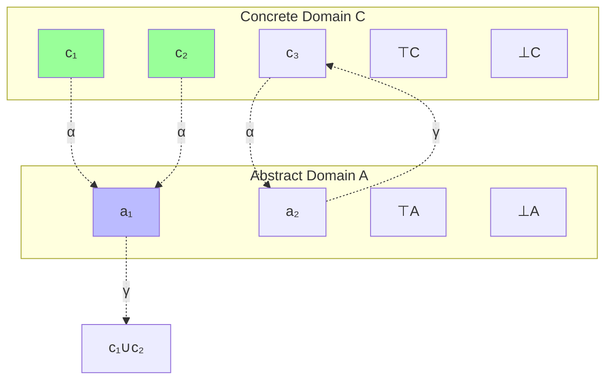
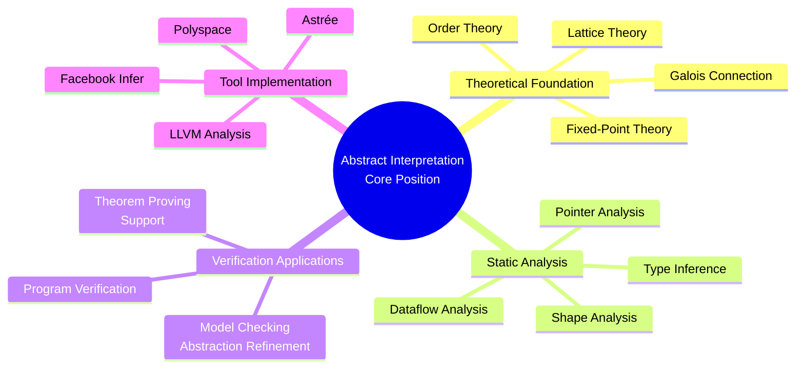
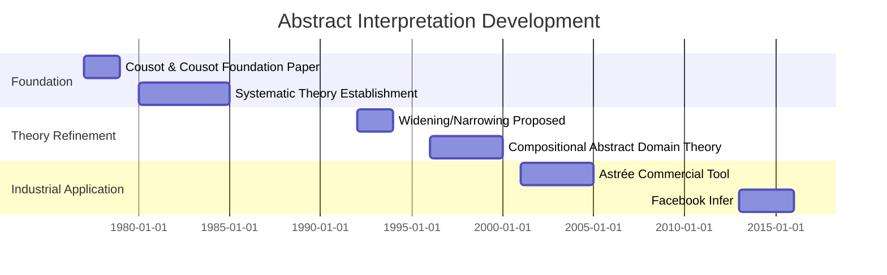
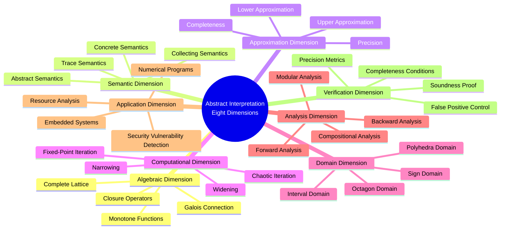

# Abstract Interpretation

> **Stage**: Struct | **Prerequisites**: [Lattice Theory](../01-foundations/lattice-theory.md), [Fixed-Point Theory](../01-foundations/fixed-point-theory.md) | **Formalization Level**: L6

---

## 1. Definitions

### 1.1 Wikipedia Standard Definition

**English Definition** (Wikipedia):
> *In computer science, abstract interpretation is a theory of sound approximation of the semantics of computer programs, based on monotonic functions over ordered sets (lattices). It was introduced by Patrick Cousot and Radhia Cousot in 1977. The main application of abstract interpretation is static program analysis, the automatic extraction of information about the possible executions of a program.*

**Key Characteristics**:

- Sound approximation of concrete semantics
- Based on monotonic functions over lattices
- Enables static analysis without program execution
- Systematic framework for program verification

---

### 1.2 Formal Definitions

#### Def-S-AI-01: Galois Connection

**Definition**: A Galois connection between two posets $(C, \leq_C)$ and $(A, \leq_A)$ is a pair of monotone functions $\alpha: C \rightarrow A$ (abstraction) and $\gamma: A \rightarrow C$ (concretization), satisfying:

$$\forall c \in C, \forall a \in A: \quad \alpha(c) \leq_A a \iff c \leq_C \gamma(a)$$

Equivalent characterizations:

- **Extensivity**: $c \leq_C \gamma(\alpha(c))$ (concrete → abstract → concrete extends)
- **Reductivity**: $\alpha(\gamma(a)) \leq_A a$ (abstract → concrete → abstract reduces)

Notation: $C \xleftarrow{\gamma} A$ or $(C, \leq_C) \xleftarrow{\gamma} (A, \leq_A)$

---

#### Def-S-AI-02: Concrete Domain

**Definition**: The concrete domain is a complete lattice $(D_C, \sqsubseteq_C, \bot_C, \top_C, \sqcup_C, \sqcap_C)$ where:

- $D_C$: Set of concrete properties (typically powerset of program states $2^\Sigma$)
- $\sqsubseteq_C$: Refinement order (typically $\subseteq$)
- $\bot_C$: Minimum element ($\emptyset$, impossible)
- $\top_C$: Maximum element (all states, unknown)
- $\sqcup_C, \sqcap_C$: Join/Meet (typically $\cup, \cap$)

**Program Semantics**: As state transition function $f_C: D_C \rightarrow D_C$

---

#### Def-S-AI-03: Abstract Domain

**Definition**: The abstract domain is a complete lattice $(D_A, \sqsubseteq_A, \bot_A, \top_A, \sqcup_A, \sqcap_A)$ where:

- $D_A$: Set of abstract properties
- Order relation $\sqsubseteq_A$ represents "more precise" or "stronger"
- Typically $D_A$ is finite or computable

**Key Property**: The expressiveness of the abstract domain determines the precision and complexity of the analysis.

---

#### Def-S-AI-04: Sound Abstraction

**Definition**: Given Galois connection $C \xleftarrow{\gamma} A$, abstract semantics $f_A: D_A \rightarrow D_A$ is a sound abstraction of concrete semantics $f_C: D_C \rightarrow D_C$ if and only if:

$$\alpha \circ f_C \sqsubseteq_A f_A \circ \alpha$$

Or equivalently (by Galois connection properties):

$$f_C \circ \gamma \sqsubseteq_C \gamma \circ f_A$$

**Intuition**: The result of abstract execution contains at least all possible results of concrete execution.

---

#### Def-S-AI-05: Widening Operator

**Definition**: Widening operator $\nabla: D_A \times D_A \rightarrow D_A$ satisfies:

1. **Upper bound**: $\forall x, y: x \sqsubseteq_A x \nabla y$ and $y \sqsubseteq_A x \nabla y$
2. **Termination**: For any ascending sequence $x_0 \sqsubseteq_A x_1 \sqsubseteq_A \ldots$, the sequence $y_0 = x_0, y_{n+1} = y_n \nabla x_{n+1}$ stabilizes (i.e., $\exists k$ such that $y_{k+1} = y_k$)

**Purpose**: Force fixpoint iteration to terminate in finite steps, trading precision for termination.

---

#### Def-S-AI-06: Narrowing Operator

**Definition**: Narrowing operator $\Delta: D_A \times D_A \rightarrow D_A$ satisfies:

1. **Lower bound**: $\forall x, y: x \Delta y \sqsubseteq_A x$
2. **Improvement**: If $y \sqsubseteq_A x$, then $x \Delta y \sqsubseteq_A y$
3. **Termination**: Similar termination condition as widening

**Purpose**: Starting from the post-fixpoint obtained by widening, progressively refine the approximation.

---

## 2. Properties

### 2.1 Basic Properties of Galois Connections

#### Lemma-S-AI-01: Abstraction-Concretization Idempotence

**Lemma**: In a Galois connection:

1. $\alpha \circ \gamma \circ \alpha = \alpha$
2. $\gamma \circ \alpha \circ \gamma = \gamma$

**Proof** (for (1)):

- By extensivity: $\gamma(\alpha(c)) \sqsupseteq c$
- By monotonicity of $\alpha$: $\alpha(\gamma(\alpha(c))) \sqsupseteq \alpha(c)$
- By reductivity: $\alpha(\gamma(a)) \sqsubseteq a$, taking $a = \alpha(c)$: $\alpha(\gamma(\alpha(c))) \sqsubseteq \alpha(c)$
- Therefore $\alpha(\gamma(\alpha(c))) = \alpha(c)$ ∎

---

#### Lemma-S-AI-02: Existence of Best Abstraction

**Lemma**: If $(\alpha, \gamma)$ forms a Galois connection, then for any concrete property $c \in D_C$, $\alpha(c)$ is the best (most precise) abstraction of $c$.

**Proof**: For any other abstraction $a$ such that $c \sqsubseteq \gamma(a)$:

- By Galois connection: $\alpha(c) \sqsubseteq a$
- That is, $\alpha(c)$ is more precise than any other valid abstraction ∎

---

#### Lemma-S-AI-03: Composition of Galois Connections

**Lemma**: Galois connections can be composed:

If $C \xleftarrow{\gamma_1} A_1$ and $A_1 \xleftarrow{\gamma_2} A_2$, then $C \xleftarrow{\gamma_1 \circ \gamma_2} A_2$ is also a Galois connection.

**Proof**: Direct verification of Galois connection definition.

Abstraction function: $\alpha = \alpha_2 \circ \alpha_1$
Concretization function: $\gamma = \gamma_1 \circ \gamma_2$ ∎

---

## 3. Relations

### 3.1 Relation to Dataflow Analysis

| Dataflow Analysis | Abstract Interpretation Equivalent |
|-------------------|-----------------------------------|
| Reaching Definitions | Set abstraction: $\wp(Var \times Lab)$ |
| Live Variables | Set abstraction: $\wp(Var)$ |
| Available Expressions | Set abstraction: $\wp(Expr)$ |
| Constant Propagation | Constant lattice: $\mathbb{Z}_\top$ |
| Interval Analysis | Interval abstraction: $Int = \{[l, u] \mid l, u \in \mathbb{Z} \cup \{-\infty, +\infty\}\}$ |

**Relation**: Classical dataflow analysis is an instance of abstract interpretation.

---

### 3.2 Relation to Type Systems

#### Prop-S-AI-01: Types as Abstraction

**Proposition**: Type systems can be viewed as a special case of abstract interpretation:

- Concrete domain: Set of runtime values
- Abstract domain: Types
- Abstraction function: Map values to their types
- Type checking: Verify that abstract semantics is sound

---

### 3.3 Abstract Domain Hierarchy

```
Concrete domain C = ℘(Σ)
    ↓
Set abstraction (non-relational)
    ↓
Interval abstraction Int
    ↓
Constant abstraction Const
    ↓
Sign abstraction Sign = {⊥, -, 0, +, ⊤}
```

**Precision-Complexity Tradeoff**: Moving down, precision decreases but computation becomes more efficient.

---

## 4. Argumentation

### 4.1 Abstract Interpretation as General Framework

#### Argument: Unified View of Dataflow Analysis

Traditional dataflow analysis (Kildall 1973):

- Design specialized algorithms for each analysis
- Termination depends on specific lattice structures

Abstract interpretation framework:

- Unified Galois connection theory
- Unified widening/narrowing mechanisms
- Systematic method for proving soundness

**Advantages**:

1. **Modularity**: Can compose different abstract domains
2. **Extensibility**: Easy to add new abstractions
3. **Provability**: Systematic soundness proofs

---

### 4.2 Precision Loss Analysis

**Problem**: Abstract interpretation necessarily introduces approximation; how to quantify precision loss?

**Metrics**:

1. **False positive rate**: Proportion of reported potential errors that are not actual errors
2. **Abstraction height**: In the abstract lattice, distance from $\alpha(c)$ to optimal abstraction
3. **Completeness**: Whether the analysis can prove certain safety properties

---

## 5. Formal Proofs

### 5.1 Theorem: Soundness of Abstract Interpretation

#### Thm-S-AI-01: Soundness Theorem

**Theorem**: Given Galois connection $C \xleftarrow{\gamma} A$, if $f_A$ is a sound abstraction of $f_C$ (i.e., $\alpha \circ f_C \sqsubseteq_A f_A \circ \alpha$), then:

$$lfp(f_C) \sqsubseteq_C \gamma(lfp(f_A))$$

That is: The concretization of the abstract fixpoint contains all concrete reachable states.

**Proof**:

**Key Lemma**: If $f_A$ is sound, then for any post-fixpoint $a$ satisfying $f_A(a) \sqsubseteq_A a$:

$$\gamma(a) \text{ is a post-fixpoint of } f_C$$

**Lemma Proof**:

- From $f_A(a) \sqsubseteq a$ and $\gamma$ monotone: $\gamma(f_A(a)) \sqsubseteq \gamma(a)$
- From soundness: $f_C(\gamma(a)) \sqsubseteq \gamma(f_A(a))$
- Transitivity: $f_C(\gamma(a)) \sqsubseteq \gamma(a)$ ∎

**Main Theorem Proof**:

Let $c^* = lfp(f_C)$ and $a^* = lfp(f_A)$.

1. By Knaster-Tarski theorem: $a^* = \sqcap\{a \mid f_A(a) \sqsubseteq a\}$

2. For any $a$ satisfying $f_A(a) \sqsubseteq a$:
   - By lemma: $f_C(\gamma(a)) \sqsubseteq \gamma(a)$
   - By lfp minimality: $c^* \sqsubseteq \gamma(a)$

3. Therefore: $c^* \sqsubseteq \sqcap\{\gamma(a) \mid f_A(a) \sqsubseteq a\}$

4. By Galois connection preserving meet:
   $$\sqcap\{\gamma(a) \mid f_A(a) \sqsubseteq a\} = \gamma(\sqcap\{a \mid f_A(a) \sqsubseteq a\}) = \gamma(a^*)$$

5. Therefore: $c^* \sqsubseteq \gamma(a^*)$ ∎

---

### 5.2 Theorem: Termination Guarantee of Widening

#### Thm-S-AI-02: Widening Termination Theorem

**Theorem**: In a finite-height lattice, or using appropriate widening operators, the Kleene iteration sequence:

$$x_0 = \bot, \quad x_{n+1} = x_n \nabla f(x_n)$$

must stabilize at a post-fixpoint in finitely many steps.

**Proof**:

**Finite-height lattice case**:

- Sequence $x_0 \sqsubseteq x_1 \sqsubseteq x_2 \sqsubseteq \ldots$ is strictly ascending
- Lattice height is finite, so must stabilize in finite steps
- When stable $x_k = x_k \nabla f(x_k)$, by widening upper bound: $f(x_k) \sqsubseteq x_k$

**General case (using widening)**:

By widening definition, sequence $y_0 = x_0, y_{n+1} = y_n \nabla x_{n+1}$ must stabilize.

Since $x_n \sqsubseteq y_n$ (provable by induction), and when $y_n$ stabilizes, $y_n$ is a post-fixpoint:

- $y_{k+1} = y_k$ implies for all $n > k$: $y_n = y_k$
- By $x_n \sqsubseteq y_n$ and $f(x_n) = x_{n+1}$:
- If iteration stabilizes at $y_k$, then $f(x_k) \sqsubseteq y_k$

Therefore widening sequence converges to a post-fixpoint. ∎

---

### 5.3 Theorem: Existence of Optimal Abstraction

#### Thm-S-AI-03: Optimal Abstraction Theorem

**Theorem**: For concrete semantics $f_C: D_C \rightarrow D_C$, if abstract domain $D_A$ is related to $D_C$ via Galois connection, then there exists a best abstraction $f_A^{opt}$:

$$f_A^{opt} = \alpha \circ f_C \circ \gamma$$

**Proof**:

**Construction**: Define $f_A^{opt}(a) = \alpha(f_C(\gamma(a)))$

**Optimality Proof**:

Need to show: For any sound abstraction $f_A$ (i.e., $\alpha \circ f_C \sqsubseteq f_A \circ \alpha$), we have $f_A^{opt} \sqsubseteq f_A$.

For any $a \in D_A$:

1. By extensivity: $\gamma(a) \sqsubseteq_C \gamma(a)$ (reflexive)
2. $f_C(\gamma(a)) \sqsubseteq_C \gamma(\alpha(f_C(\gamma(a)))) = \gamma(f_A^{opt}(a))$ (by reductivity)
3. For sound abstraction $f_A$:
   $$\alpha(f_C(\gamma(a))) \sqsubseteq_A f_A(\alpha(\gamma(a)))$$
4. By reductivity: $\alpha(\gamma(a)) \sqsubseteq_A a$
5. By monotonicity of $f_A$: $f_A(\alpha(\gamma(a))) \sqsubseteq_A f_A(a)$
6. Combined: $f_A^{opt}(a) = \alpha(f_C(\gamma(a))) \sqsubseteq_A f_A(a)$

Therefore $f_A^{opt}$ is the most precise (best) sound abstraction. ∎

---

## 6. Examples

### 6.1 Sign Analysis

**Concrete Domain**: $\wp(\mathbb{Z})$

**Abstract Domain**: $Sign = \{\bot, -, 0, +, -0, +0, -+, 0-, 0+, -0+, \top\}$

**Galois Connection**:

- $\alpha(X) = \text{sign of elements in } X$
- $\gamma(\bot) = \emptyset$, $\gamma(0) = \{0\}$, $\gamma(+) = \{n > 0\}$, etc.

**Abstract Operations** (Addition):

| $+_A$ | ⊥ | - | 0 | + | ⊤ |
|-------|-----|-----|-----|-----|-----|
| ⊥ | ⊥ | ⊥ | ⊥ | ⊥ | ⊥ |
| - | ⊥ | - | - | ⊤ | ⊤ |
| 0 | ⊥ | - | 0 | + | ⊤ |
| + | ⊥ | ⊤ | + | + | ⊤ |
| ⊤ | ⊥ | ⊤ | ⊤ | ⊤ | ⊤ |

### 6.2 Interval Analysis

**Abstract Domain**: $Interval = \{[l, u] \mid l, u \in \mathbb{Z} \cup \{-\infty, +\infty\}, l \leq u\} \cup \{\bot\}$

**Order**: $[l_1, u_1] \sqsubseteq [l_2, u_2]$ iff $l_2 \leq l_1$ and $u_1 \leq u_2$

**Abstract Operations** (Addition):
$$[l_1, u_1] +_A [l_2, u_2] = [l_1 + l_2, u_1 + u_2]$$
(boundaries are $\pm\infty$ handled by extended arithmetic)

**Widening Operator**:
$$[l_1, u_1] \nabla [l_2, u_2] = [\text{if } l_2 < l_1 \text{ then } -\infty \text{ else } l_1, \text{if } u_2 > u_1 \text{ then } +\infty \text{ else } u_1]$$

### 6.3 Constant Propagation

**Program Fragment**:

```
x := 5;
y := x + 3;
while (y < 10) do
    y := y + 1
```

**Analysis Results**:

- After line 1: $x = 5, y = \top$
- After line 2: $x = 5, y = 8$
- Loop entry: $x = 5, y \in [8, +\infty)$
- Loop condition: $y < 10$, so in loop body $y \in [8, 9]$
- After loop body execution: $y \in [9, 10]$
- Loop exit: $x = 5, y \geq 10$

---

## 7. Visualizations

### 7.1 Galois Connection Diagram



### 7.2 Abstract Interpretation Framework Flow

```mermaid
flowchart TD
    C[Concrete Program] --> CS[Concrete Semantics<br/>℘(Σ)]
    CS --> GC[Galois Connection<br/>α, γ]
    GC --> AS[Abstract Semantics<br/>DA]
    AS --> WI[Widening<br/>Accelerate Convergence]
    WI --> NI[Narrowing<br/>Refine Result]
    NI --> R[Analysis Result]

    CS -.->|Soundness Guarantee| R

    style CS fill:#9f9
    style AS fill:#bbf
    style R fill:#f9f
```

### 7.3 Abstract Domain Hierarchy

```mermaid
graph TB
    C[Concrete Domain<br/>℘(ℤ)]
    I[Interval Abstraction<br/>Interval]
    CO[Constant Abstraction<br/>Const]
    S[Sign Abstraction<br/>Sign]

    C --> I
    I --> CO
    CO --> S

    C -.->|More Precise<br/>More Expensive| S

    style C fill:#9f9
    style S fill:#f99
```

### 7.4 Widening/Narrowing Iteration

```mermaid
graph LR
    subgraph "Widening Convergence"
        W1[x₀=⊥]
        W2[x₁]
        W3[x₂]
        W4[...]
        W5[x_k=x_{k+1}]

        W1 -->|f(x₀)∇x₀| W2
        W2 -->|f(x₁)∇x₁| W3
        W3 --> W4
        W4 --> W5
    end

    subgraph "Narrowing Refinement"
        N1[y₀=x_k]
        N2[y₁]
        N3[y₂]
        N4[...]
        N5[y_m=y_{m+1}]

        N1 -->|f(y₀)Δy₀| N2
        N2 -->|f(y₁)Δy₁| N3
        N3 --> N4
        N4 --> N5
    end

    W5 -.-> N1
```

### 7.5 Program Analysis Example

```mermaid
graph TB
    Start([Start]) --> A[x:=0]
    A --> B[i:=0]
    B --> C{i < 10?}
    C -->|Yes| D[x:=x+i]
    D --> E[i:=i+1]
    E --> C
    C -->|No| F([End])

    subgraph "Interval Analysis Annotation"
        A -.->|x=[0,0], i=⊤| B
        B -.->|x=[0,0], i=[0,0]| C
        C -.->|x=[0,45], i=[0,10]| F
        D -.->|x=[0,45], i=[0,9]| E
        E -.->|x=[0,45], i=[1,10]| C
    end
```

### 7.6 Abstract Interpretation and Related Fields



### 7.7 Development Milestones



### 7.8 Eight-Dimensional Characterization Overview



---

## 8. References


---

*Document Version: v1.0 | Created: 2026-04-10 | Last Updated: 2026-04-10*
