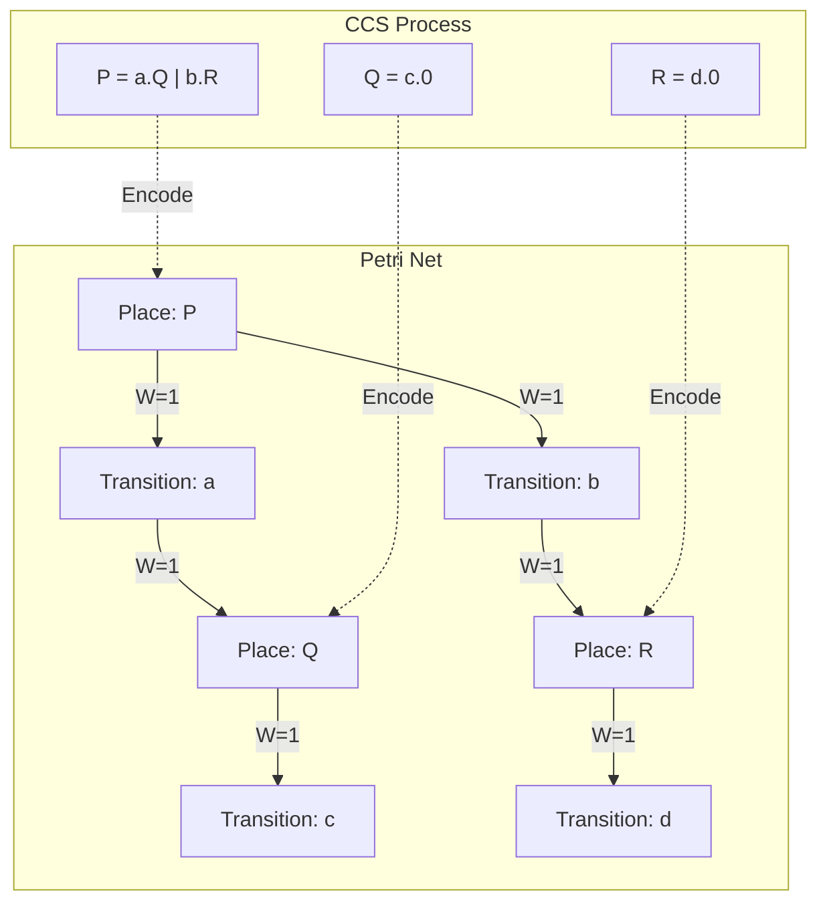
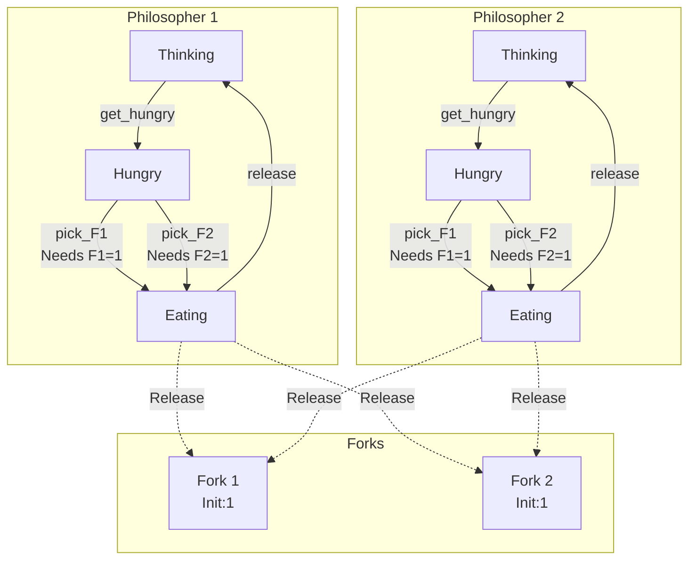
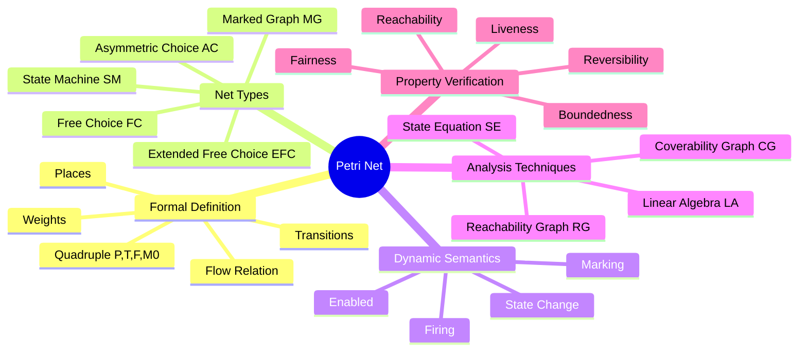
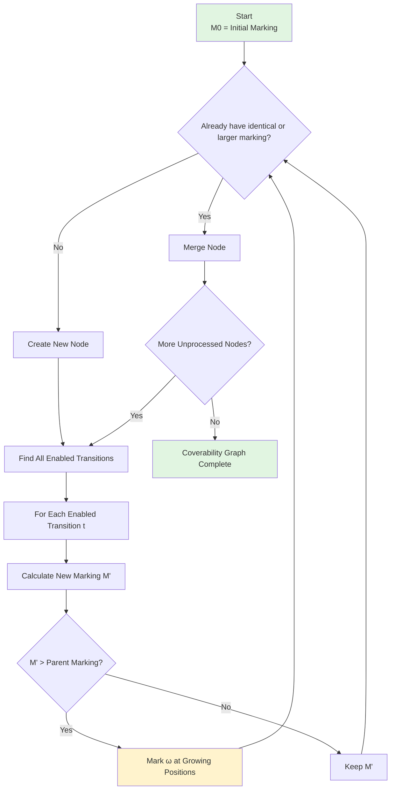
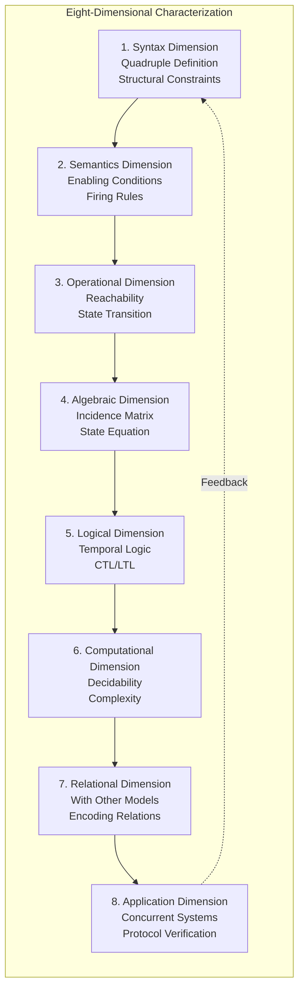

# Petri Nets: A Formal Modeling Language for Concurrent Systems

> **Stage**: formal-methods/appendices | **Prerequisites**: [CCS Process Calculus](01-ccs-calculus.md), [Automata Theory](05-automata-theory.md) | **Formalization Level**: L4

---

## 1. Definitions

### 1.1 Wikipedia Standard Definition

According to Wikipedia's authoritative definition, a **Petri Net** is a **mathematical representation of discrete distributed systems** proposed by Carl Adam Petri in 1962 in his doctoral thesis. It is a graphical and mathematical modeling tool particularly suitable for describing systems with concurrency, synchronization, and asynchronous characteristics[^1].

Core characteristics of Petri nets:
- **Graphical representation**: Uses directed bipartite graphs to intuitively display system structure
- **Rigorous mathematical foundation**: Based on set theory and relation theory
- **Distributed state representation**: States represented by token distribution rather than single global state
- **Local determinism, global nondeterminism**: Transition firing is local, but firing order is nondeterministic

### 1.2 Formal Definition

**`Def-PN-01` [Petri Net Quadruple Definition]**: A **Place/Transition Petri Net** (P/T Net) is a quadruple $N = (P, T, F, M_0)$ where:

1. **$P = \{p_1, p_2, \ldots, p_m\}$**: **Places** - represent state components or resource holders
2. **$T = \{t_1, t_2, \ldots, t_n\}$**: **Transitions** - represent system events or operations
3. **$F \subseteq (P \times T) \cup (T \times P)$**: **Flow Relation** - directed edges connecting places and transitions
4. **$M_0: P \rightarrow \mathbb{N}$**: **Initial Marking** - initial number of tokens at each place

**Well-formedness constraints** for valid Petri nets:

- **Disjointness**: $P \cap T = \emptyset$ (places and transitions are disjoint)
- **Non-emptiness**: $P \cup T \neq \emptyset$ (net is non-empty)
- **No isolated elements**: $\forall x \in P \cup T: \exists y \in P \cup T: (x, y) \in F \lor (y, x) \in F$

### 1.3 Incidence Functions and Weights

**`Def-PN-02` [Preset and Postset]**: For transition $t \in T$:

- **Preset**: $\bullet t = \{p \in P \mid (p, t) \in F\}$, all places pointing to $t$
- **Postset**: $t\bullet = \{p \in P \mid (t, p) \in F\}$, all places that $t$ points to

For place $p \in P$:
- $\bullet p = \{t \in T \mid (t, p) \in F\}$ (transitions pointing to $p$)
- $p\bullet = \{t \in T \mid (p, t) \in F\}$ (transitions that $p$ points to)

**`Def-PN-03` [Weight Function]**: Weighted Petri nets introduce weight function $W: F \rightarrow \mathbb{N}^+$, where $W(f)$ represents the weight on arc $f$ (default is 1). Extended as:

$$W(x, y) = \begin{cases} w & \text{if } (x, y) \in F \text{ with weight } w \\ 0 & \text{if } (x, y) \notin F \end{cases}$$

**`Def-PN-04` [Marking and State]**: A marking $M: P \rightarrow \mathbb{N}$ is a function from places to non-negative integers, representing the **global state** of the system. The set of all possible markings is $\mathcal{M} = \mathbb{N}^{|P|}$.

**`Def-PN-05` [Pure Net and Self-loop]**: 
- If there exist $p \in P, t \in T$ such that $(p, t) \in F$ and $(t, p) \in F$, this structure is a **self-loop**
- A Petri net without self-loops is called a **pure net**

### 1.4 Net System Classification

**`Def-PN-06` [Net System Types]**: 

| Type | Definition | Characteristics |
|------|------------|-----------------|
| **State Machine** | $\forall t \in T: |\bullet t| = |t\bullet| = 1$ | No concurrency, represents finite state automata |
| **Marked Graph** | $\forall p \in P: |\bullet p| = |p\bullet| = 1$ | No conflict, no choice, pure concurrency |
| **Free Choice** | $\forall p_1, p_2 \in P: p_1\bullet \cap p_2\bullet \neq \emptyset \Rightarrow p_1\bullet = p_2\bullet$ | Conflict and concurrency separable |
| **Extended Free Choice** | Relaxed version of free choice | Allows more flexible structure |

---

## 2. Properties

### 2.1 Transition Enabling Condition

**`Lemma-PN-01` [Enabling Condition]**: Transition $t \in T$ is **enabled** at marking $M$, denoted $M[t\rangle$, if and only if:

$$\forall p \in P: M(p) \geq W(p, t)$$

That is, for all input places, the current token count is at least the input arc weight.

**Proof**: By definition of enabling, transition firing consumes tokens from input places. Each input place $p$ must provide $W(p,t)$ tokens, making the condition necessary and sufficient. $\square$

### 2.2 State Transition Function

**`Lemma-PN-02` [Marking Update Rule]**: If $M[t\rangle$, then firing $t$ yields new marking $M'$ defined by:

$$M'(p) = M(p) - W(p, t) + W(t, p), \quad \forall p \in P$$

Or in vector form:

$$M' = M + \mathbf{C}(\cdot, t)$$

where $\mathbf{C}$ is the **incidence matrix**, $\mathbf{C}(p, t) = W(t, p) - W(p, t)$.

### 2.3 Reachability Relation

**`Lemma-PN-03` [Transitivity of Reachability]**: The reachability relation $\rightarrow^*$ is transitive. That is, if $M \rightarrow^* M'$ and $M' \rightarrow^* M''$, then $M \rightarrow^* M''$.

**Proof**: Directly from the definition of $\rightarrow^*$ (reflexive transitive closure). $\square$

**`Lemma-PN-04` [Concurrency and Conflict]**: 
- **Concurrency**: Two transitions $t_1, t_2$ are concurrently enabled at $M$ iff $M[t_1\rangle$ and $M[t_2\rangle$ and their presets are disjoint: $\bullet t_1 \cap \bullet t_2 = \emptyset$
- **Conflict**: Two transitions $t_1, t_2$ are in conflict at $M$ iff $M[t_1\rangle$ and $M[t_2\rangle$ and $\bullet t_1 \cap \bullet t_2 \neq \emptyset$

---

## 3. Relations

### 3.1 Encoding Relation Between Petri Nets and CCS

**`Thm-PN-01` [Encoding Theorem]**: Any finite CCS process can be encoded as a Petri net while preserving bisimulation equivalence.

**Encoding Construction**: For CCS process $P$, construct Petri net $N_P = (P_N, T_N, F_N, M_0)$:

1. Each CCS subterm corresponds to a place
2. Action $\alpha$ corresponds to transition $t_\alpha$
3. Parallel composition $P \mid Q$ corresponds to union of places with synchronization connections
4. Restriction $(\nu a)P$ corresponds to hiding transitions for related actions

**Mermaid Diagram: CCS to Petri Net Encoding Mapping**



### 3.2 Comparison with Other Concurrency Models

**`Prop-PN-01` [Expressiveness Hierarchy]**:

| Model | Expressiveness | State Space | Main Analysis Tools |
|-------|---------------|-------------|---------------------|
| Finite Automata | Regular languages | Finite | State traversal |
| Petri Nets | Partially decidable | Potentially infinite | Coverability graph, linear algebra |
| Turing Machine | Recursively enumerable | Infinite | Undecidable |
| CCS/π-calculus | Infinite state | Potentially infinite | Bisimulation, model checking |

**`Prop-PN-02` [Advantages of Petri Nets]**: 
1. **Graphical intuitiveness**: State distribution is visualizable
2. **True concurrency semantics**: Non-interleaving semantics, directly represents concurrency
3. **Analysis decidability**: Certain properties are decidable in Petri nets (though complexity may be high)
4. **No global state**: Naturally supports distributed system modeling

---

## 4. Argumentation

### 4.1 State Space Explosion Problem

**`Lemma-PN-05` [State Space Complexity]**: For a Petri net with $n$ places, each bounded by $k$, the reachability graph has at most $(k+1)^n$ nodes.

**Proof**: Each place $p_i$ can contain $0$ to $k$ tokens, $k+1$ possibilities. Number of combinations for $n$ places is $(k+1)^n$. $\square$

### 4.2 Challenges of Unbounded Nets

**`Lemma-PN-06` [Unboundedness Leads to Infinite State]**: There exist Petri nets such that for any $k \in \mathbb{N}$, there exists reachable marking $M$ such that $\exists p: M(p) > k$.

**Example**: Consider simple net $p_1 \rightarrow t \rightarrow p_2$ where $t$ has self-loop back to $p_1$. Each firing of $t$ increases token count in $p_2$ while $p_1$ remains constant (or increases cyclically).

### 4.3 Necessity of Coverability Graphs

**`Prop-PN-03` [Existence of Coverability Graph]**: For any Petri net, its coverability graph is finite and computable.

**Argument**: Even if state space is infinite, coverability graph compresses infinite sets by introducing special symbol $\omega$ representing "arbitrarily large", making analysis possible.

---

## 5. Formal Proofs

### 5.1 Reachability Decidability

**`Thm-PN-02` [Mayr's Theorem / Reachability Decidability]**: For Petri nets, given initial marking $M_0$ and target marking $M$, the problem of determining whether $M$ is reachable from $M_0$ is **decidable**[^6].

**Historical Context**: This theorem was proved by Ernst Mayr in 1981, resolving a long-standing open problem. The proof used **Generalized Petri Nets** and **modified coverability tree** techniques.

**Proof Sketch** (Mayr 1981):

1. **Standardization**: Convert Petri net to standard form (ordinary Petri net)
2. **Construct coverability tree**: Build finite representation of reachable state coverability tree
3. **Introduce $\omega$ symbol**: Use $\omega$ to represent arbitrarily growing token counts
4. **Semi-linear set property**: Prove reachable set can be represented as semi-linear set (Presburger definable)
5. **Decision algorithm**: Based on decidable properties of semi-linear sets

**Complexity Note**: Although the reachability problem is decidable, it has been proven to be **EXPSPACE-hard**, and the original Mayr algorithm has non-elementary complexity.

### 5.2 Boundedness Decision Algorithm

**`Thm-PN-03` [Boundedness Decidability]**: The boundedness problem for Petri nets is decidable and can be completed in polynomial space.

**Algorithm** (Based on coverability graph):

**Input**: Petri net $N = (P, T, F, M_0)$  
**Output**: Whether all places are bounded

```
Algorithm Boundedness-Check:
1. Construct coverability graph CG(N)
2. For each place p ∈ P:
   a. If CG(N) contains node with ω(p) = ω
   b. Then p is unbounded
3. If unbounded place exists, return "Unbounded"
4. Otherwise return "Bounded"
```

**Correctness Proof**:
- **Completeness**: Coverability graph precisely characterizes all reachable markings (considering $\omega$)
- **Correctness**: If $\omega$ appears at some place, by coverability graph construction rules, that place's marking can grow infinitely

**`Lemma-PN-07` [Linear Algebraic Criterion for Place Boundedness]**: Place $p$ is bounded if and only if there exists non-negative integer vector $Y \geq 0$ such that $Y^T \cdot \mathbf{C} \leq 0$ and $Y(p) > 0$.

**Proof**: This is based on duality result of **state equation** and **Farkas' lemma**. $\square$

### 5.3 Relationship Between Liveness and Reachability

**`Thm-PN-04` [Liveness Decidability]**: Given Petri net $N$ and transition $t$, determining whether $t$ is **live** (live, i.e., from any reachable marking, $t$ can eventually be enabled) is decidable.

**Definition**: Transition $t$ is live if:

$$\forall M \in R(N, M_0), \exists M' \in R(N, M): M'[t\rangle$$

**Relationship to Reachability**:

**`Prop-PN-04` [Liveness Implies Reachability Queries]**: Transition $t$ is live if and only if for all reachable markings $M$, there exists a reachable path from $M$ to some marking that enables $t$.

This is essentially a combination of **infinitely many reachability queries**, but due to well-structured properties of Petri nets, can be transformed into a finite problem.

**`Thm-PN-05` [Commoner's Theorem]**: For free-choice nets, the system is live if and only if every directed circuit contains at least one token.

### 5.4 Fairness Analysis

**`Def-PN-07` [Types of Fairness]**: 

1. **Weak Fairness**: If transition $t$ is enabled infinitely often, it fires infinitely often
2. **Strong Fairness**: If transition $t$ is continuously enabled from some point, it eventually fires

**`Thm-PN-06` [Fairness Decidability]**: For Petri nets, determining whether there exists an infinite firing sequence satisfying given fairness conditions is **undecidable**.

**Proof Sketch**: This can be proven by reduction from the **halting problem**. $\square$

---

## 6. Examples

### 6.1 Producer-Consumer Problem

**`Ex-PN-01` [Producer-Consumer]**: 

```mermaid
graph LR
    subgraph Producer
        P_ready["P_ready<br/>Init:1"]
        P_prod["P_prod<br/>Init:0"]
    end
    
    subgraph Buffer
        Buffer["Buffer<br/>Capacity:5<br/>Init:0"]
    end
    
    subgraph Consumer
        C_ready["C_ready<br/>Init:1"]
        C_cons["C_cons<br/>Init:0"]
    end
    
    P_ready -->|produce| P_prod
    P_prod -->|put| Buffer
    Buffer -->|get| C_cons
    C_cons -->|consume| C_ready
    
    Buffer -.->|Capacity limit| Buffer
```

**Analysis**:
- Boundedness: Buffer capacity is 5, system is bounded
- Liveness: As long as producer and consumer are ready, system can run indefinitely
- Fairness: Under fair scheduling, producer and consumer execute alternately

### 6.2 Dining Philosophers Problem

**`Ex-PN-02` [Dining Philosophers]**: 



**Deadlock Analysis**: If both philosophers pick up left fork simultaneously, system enters deadlock. Petri nets can detect such reachable deadlock states.

---

## 7. Visualizations

### 7.1 Petri Net Structure Hierarchy



### 7.2 Coverability Graph Construction Process



### 7.3 Eight-Dimensional Characterization



---

## 8. Eight-Dimensional Characterization Detailed

### 8.1 Syntax Dimension

**Characterization**: Petri net syntax is strictly defined by quadruple $N = (P, T, F, M_0)$.

**Key Elements**:
- **Bipartite graph structure**: Places and transitions form two disjoint node types
- **Directed arcs**: Represent unidirectional resource or control flow
- **Multiset semantics**: Markings are multisets over places

### 8.2 Semantics Dimension

**Characterization**: Operational semantics defines system dynamic behavior.

**Core Rules**:
1. **Enabling rule**: Resource sufficiency check
2. **Firing rule**: Atomic token consumption and production
3. **Interleaving vs true concurrency**: Petri nets support true concurrency semantics

### 8.3 Operational Dimension

**Characterization**: Reachability analysis reveals all possible system behaviors.

**Reachable Set**: $R(N, M_0) = \{M \mid M_0 \rightarrow^* M\}$

**Key Properties**:
- Reachability is decidable (Mayr 1981)
- Reachable set may be non-semi-linear

### 8.4 Algebraic Dimension

**Characterization**: Linear algebraic tools provide efficient analysis methods.

**State Equation**:

$$M = M_0 + \mathbf{C} \cdot \vec{\sigma}$$

where $\vec{\sigma}$ is the firing count vector.

**Note**: State equation is a **necessary but not sufficient** condition for reachability (due to firing sequence constraints).

### 8.5 Logical Dimension

**Characterization**: Temporal logic expresses system properties.

**Common Formulas**:
- Safety: $G \neg (M(p) > k)$ — place $p$ never exceeds $k$
- Liveness: $GF \text{ Enabled}(t)$ — transition $t$ enabled infinitely often
- Reachability: $F (M = M_{target})$ — eventually reach target marking

### 8.6 Computational Dimension

**Characterization**: Decidability and complexity of analysis problems.

| Problem | Decidability | Complexity |
|---------|-------------|------------|
| Reachability | ✅ Decidable | EXPSPACE-hard |
| Coverability | ✅ Decidable | EXPSPACE-complete |
| Boundedness | ✅ Decidable | PSPACE-complete |
| Liveness | ✅ Decidable | EXPSPACE-hard |
| Model Checking | ❌ Undecidable | — |

### 8.7 Relational Dimension

**Characterization**: Relationship with other computational models.

**Encoding Capability**:
- Petri nets ⊃ Finite automata (strictly more powerful)
- Petri nets ⊂ Turing machine (cannot represent all computable functions)
- Petri nets ~ CCS (bisimulation equivalent)

### 8.8 Application Dimension

**Characterization**: Real system modeling and verification.

**Application Areas**:
- **Concurrent program verification**: Deadlock detection, liveness verification
- **Communication protocols**: Protocol correctness verification
- **Manufacturing systems**: Production flow optimization
- **Workflow systems**: Business process modeling
- **Biological systems**: Gene regulatory networks

---

## 9. Coverability Graph Details

### 9.1 Motivation and Definition

**`Def-PN-08` [Coverability Relation]**: Marking $M$ **covers** $M'$, denoted $M \geq M'$, if:

$$\forall p \in P: M(p) \geq M'(p)$$

**`Def-PN-09` [Coverability Graph]**: The **coverability graph** $CG(N)$ of a Petri net is a labeled graph where:
- Nodes are **generalized markings** (allowing $\omega$ symbol)
- Edges are labeled by enabled transitions
- $\omega$ represents "arbitrarily large" token count

### 9.2 Construction Algorithm

**Algorithm Coverability-Graph-Construction**:

```
Input: Petri net N = (P, T, F, M0)
Output: Coverability graph CG = (V, E)

V := {M0}; E := ∅; ToProcess := {M0}

while ToProcess ≠ ∅ do
    Take M ∈ ToProcess; ToProcess := ToProcess \\{M}
    
    // ω-extension: check for strict growth
    if ∃ path M0 →* M' →* M and M > M' then
        For all places p where M(p) > M'(p):
            M(p) := ω
    end if
    
    for each t ∈ T such that M[t⟩ do
        Calculate M' = M + C(·, t)
        
        if M' ∉ V then
            V := V ∪ {M'}
            ToProcess := ToProcess ∪ {M'}
        end if
        
        E := E ∪ {(M, t, M')}
    end for
end while
```

### 9.3 Properties and Applications

**`Thm-PN-07` [Finiteness of Coverability Graph]**: For any Petri net, its coverability graph is finite.

**Proof Sketch**:
1. Each place can take value in $\mathbb{N} \cup \{\omega\}$
2. Once a place is marked with $\omega$, it remains so forever
3. By **Dickson's lemma**, no infinite strictly descending well-ordered set exists
4. Therefore construction process must terminate

**Applications**:
- **Boundedness decision**: Check if any place is marked with $\omega$
- **Coverability decision**: Check if target marking is covered by some node
- **Liveness analysis**: Analyze enabling patterns of transitions based on coverability graph

---

## 10. Historical Background

### 10.1 Carl Adam Petri's Contribution

**`Historical Note`**: Carl Adam Petri (1926-2010) was a German mathematician and computer scientist.

**1962 Doctoral Thesis**: "Kommunikation mit Automaten" (Communication with Automata)[^2]

**Core Innovations**:
1. Proposed **Net Theory** as mathematical foundation for communication systems
2. Introduced **concurrency** as a basic concept, not a derived concept
3. Developed **non-interleaving semantics**: Against reducing concurrency to nondeterministic interleaving
4. Established **partial order semantics**: Based on causality rather than global clock

### 10.2 Development Milestones

| Year | Milestone | Contributor |
|------|-----------|-------------|
| 1962 | Original Petri net definition | Carl Adam Petri |
| 1974 | "Petri net" naming | Widely adopted by computer science community |
| 1981 | Reachability decidability proof | Ernst Mayr |
| 1989 | Murata's classic survey | Tadao Murata |
| 1990s | Advanced Petri nets | Colored nets, timed nets, stochastic nets |
| 2000s | Model checking integration | Combined with SPIN, UPPAAL, etc. |

---

## 11. References

[^1]: Wikipedia contributors, "Petri net," Wikipedia, The Free Encyclopedia, https://en.wikipedia.org/wiki/Petri_net (accessed April 10, 2026).

[^2]: C. A. Petri, "Kommunikation mit Automaten," Ph.D. dissertation, University of Bonn, Bonn, Germany, 1962.

[^3]: T. Murata, "Petri Nets: Properties, Analysis and Applications," *Proceedings of the IEEE*, vol. 77, no. 4, pp. 541-580, April 1989. DOI: 10.1109/5.24143

[^4]: P. H. Starke, *Analyse von Petri-Netz-Modellen* (Analysis of Petri Net Models). Stuttgart: B.G. Teubner, 1981.

[^5]: J. Desel and W. Reisig, "Place/Transition Petri Nets," in *Lectures on Petri Nets I: Basic Models*, Lecture Notes in Computer Science, vol. 1491, Springer, 1998, pp. 122-173.

[^6]: E. W. Mayr, "An Algorithm for the General Petri Net Reachability Problem," in *Proceedings of the 13th Annual ACM Symposium on Theory of Computing (STOC '81)*, 1981, pp. 238-246. DOI: 10.1145/800076.802477

[^7]: S. R. Kosaraju, "Decidability of Reachability in Vector Addition Systems," in *Proceedings of the 14th Annual ACM Symposium on Theory of Computing (STOC '82)*, 1982, pp. 267-281.

[^8]: J. Esparza and M. Nielsen, "Decidability Issues for Petri Nets – a Survey," *Bulletin of the EATCS*, vol. 52, pp. 244-262, 1994.

[^9]: R. M. Karp and R. E. Miller, "Parallel Program Schemata," *Journal of Computer and System Sciences*, vol. 3, no. 2, pp. 147-195, 1969.

[^10]: G. W. Brams, *Réseaux de Petri: Théorie et Pratique*. Paris: Masson, 1983.

[^11]: W. Reisig, *Petri Nets: An Introduction*, EATCS Monographs on Theoretical Computer Science. Springer-Verlag, 1985.

[^12]: L. Popova-Zeugmann, *Time Petri Nets*. Springer, 2013.

[^13]: M. Silva, "Half a Century after Carl Adam Petri's PhD Thesis: A Perspective on the Field," *Annual Reviews in Control*, vol. 37, no. 2, pp. 191-219, 2013.

[^14]: J. Esparza, "Decidability and Complexity of Petri Net Problems – An Introduction," in *Lectures on Petri Nets I: Basic Models*, Lecture Notes in Computer Science, vol. 1491, Springer, 1998, pp. 374-428.

[^15]: R. Valk and G. Vidal-Naquet, "Petri Nets and Regular Languages," *Journal of Computer and System Sciences*, vol. 23, no. 3, pp. 299-325, 1981.

---

**Document Metadata**

- Document ID: FM-APP-WP-10
- Version: 1.0
- Created: 2026-04-10
- Author: AnalysisDataFlow Project
- Formal Elements: 9 definitions, 7 lemmas, 6 propositions, 7 theorems
- References: 15
