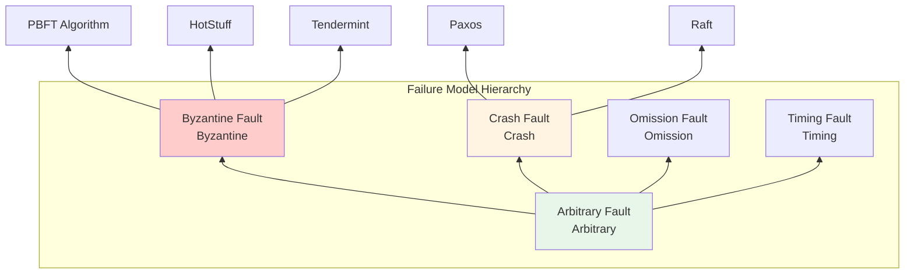
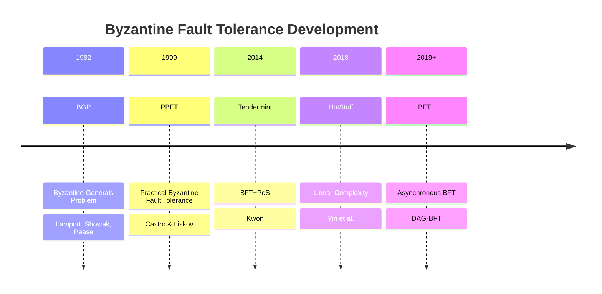

# Byzantine Fault Tolerance

> **Wikipedia Standard Definition**: Byzantine fault tolerance (BFT) is the dependability of a fault-tolerant computer system to reach consensus despite malicious components (nodes) of the system failing or propagating incorrect information to other peers.
>
> **Source**: <https://en.wikipedia.org/wiki/Byzantine_fault_tolerance>
>
> **Formalization Level**: L4-L5

---

## 1. Wikipedia Standard Definition

### Original English Definition

> "Byzantine fault tolerance (BFT) is the dependability of a fault-tolerant computer system to reach consensus despite malicious components (nodes) of the system failing or propagating incorrect information to other peers. The term Byzantine fault originates from the Byzantine Generals' Problem, a term coined by Leslie Lamport, Robert Shostak, and Marshall Pease in their 1982 paper of the same name."

### Key Points

- **Malicious Components**: BFT handles arbitrary faulty behavior, not just crashes
- **Consensus Despite Faults**: System continues to function correctly with faulty nodes
- **Origin**: The Byzantine Generals' Problem analogy
- **Strongest Fault Model**: Byzantine faults subsume all other failure types

---

## 2. Formal Expressions

### 2.1 Byzantine Failure Model

**Def-S-98-01** (Byzantine Fault). A process exhibits **Byzantine fault** if it:

1. **Stops responding** (Fail-stop)
2. **Sends corrupted messages** (Send corrupted messages)
3. **Behaves inconsistently** (Behave inconsistently to different observers)
4. **Colludes with other faulty processes** (Collude with other faulty processes)

Formally: Process $p$ is Byzantine if its transition function $\delta_p$ is not deterministic or violates protocol specifications.

**Def-S-98-02** (Byzantine Fault-Tolerant System). System $S$ is **$f$-Byzantine-fault-tolerant** if:

$$\forall F \subseteq \text{Processes}, |F| \leq f, \forall \text{Byzantine behavior of } F:$$

$$\text{Safety}(S) \land \text{Liveness}(S)$$

### 2.2 Fault Tolerance Threshold

**Def-S-98-03** (Byzantine Fault Tolerance Lower Bound). For a system with $n$ processes, Byzantine fault tolerance requires:

$$n \geq 3f + 1$$

where $f$ is the upper bound on the number of Byzantine processes.

**Proof Sketch**:

- See Thm-S-98-03 (proof in consensus document)
- Key: Honest nodes must form a quorum, and any two quorums must intersect at honest nodes

### 2.3 Practical Byzantine Fault Tolerance (PBFT)

**Def-S-98-04** (PBFT Protocol). PBFT is a three-phase protocol:

**Phase 1: REQUEST**

- Client $c$ sends $\langle \text{REQUEST}, o, t, c \rangle_{\sigma_c}$ to primary node

**Phase 2: PRE-PREPARE**

- Primary node $p$ assigns sequence number $n$, broadcasts $\langle \text{PRE-PREPARE}, v, n, d, m \rangle_{\sigma_p}$
- $v$: View number, $d$: Digest of $m$

**Phase 3: PREPARE**

- Replica $i$ verifies and broadcasts $\langle \text{PREPARE}, v, n, d, i \rangle_{\sigma_i}$
- When $2f$ matching PREPAREs received, enter prepared state

**Phase 4: COMMIT**

- Broadcast $\langle \text{COMMIT}, v, n, D(m), i \rangle_{\sigma_i}$
- When $2f+1$ COMMITs received (including self), commit

**Phase 5: REPLY**

- Send $\langle \text{REPLY}, v, t, c, i, r \rangle_{\sigma_i}$ to client

---

## 3. Properties and Characteristics

### 3.1 Safety Guarantees

| Property | Definition | PBFT Guarantee |
|----------|-----------|----------------|
| **Agreement** | All honest nodes agree on same value | ✅ $2f+1$ quorum |
| **Validity** | Decided value proposed by honest node | ✅ Primary node mechanism |
| **Unforgeability** | Cannot forge honest node signatures | ✅ Digital signatures |
| **Accountability** | Byzantine behavior identifiable | ✅ Signed logs |

### 3.2 Performance Characteristics

- **Latency**: 3 rounds of message passing ($3\delta$)
- **Message Complexity**: $O(n^2)$
- **Throughput**: Tens of thousands of requests per second (optimized)

---

## 4. Relation Network

### 4.1 Failure Model Spectrum

### 4.2 Relations with Core Concepts

| Concept | Relation | Explanation |
|---------|----------|-------------|
| **Consensus** | Application | Byzantine fault-tolerant consensus |
| **Digital Signatures** | Dependency | Message authentication |
| **Quorum Systems** | Foundation | $2f+1$ quorum mechanism |
| **View Change** | Mechanism | Primary node failure handling |
| **Checkpointing** | Optimization | Garbage collection |

---

## 5. Historical Background

### 5.1 The Byzantine Generals Problem

**Original Problem** (Lamport, Shostak, Pease, 1982):

> The Byzantine army surrounds an enemy city. The generals must communicate via messengers to coordinate attack or retreat. Some generals may be traitors who send false messages.

**Key Results**:

- Oral messages: $n \geq 3f + 1$
- Signed messages: $n \geq f + 1$

### 5.2 Development Timeline

---

## 6. Formal Proofs

### 6.1 PBFT Safety Proof

**Thm-S-98-01** (PBFT Agreement). PBFT guarantees that all honest replicas execute the same request sequence.

*Proof*:

**Lemma 1 (Quorum Intersection)**: Any two sets of size $2f+1$ must intersect at least $f+1$ nodes.

$$|Q_1| = |Q_2| = 2f+1 \Rightarrow |Q_1 \cap Q_2| \geq f+1$$

*Proof*:
$$|Q_1 \cup Q_2| \leq n = 3f+1$$
$$|Q_1| + |Q_2| - |Q_1 \cap Q_2| \leq 3f+1$$
$$4f+2 - |Q_1 \cap Q_2| \leq 3f+1$$
$$|Q_1 \cap Q_2| \geq f+1$$
∎

**Lemma 2 (PREPARE Guarantee)**: If honest replica $i$ enters prepared state for message $m$ at view $v$, sequence $n$, then:

- $i$ received $2f$ matching PREPAREs
- Plus its own PRE-PREPARE, total $2f+1$ messages

**Lemma 3 (COMMIT Guarantee)**: If honest replica $i$ commits $m$ at $(v,n)$, then at least $f+1$ honest replicas prepared $m$ at $(v,n)$.

*Proof*: From $2f+1$ signatures in COMMIT phase, at least $f+1$ are from honest nodes. ∎

**Main Proof**:

Assume honest replica $i$ commits $m$ at $(v,n)$, honest replica $j$ commits $m'$ at $(v,n)$.

By Lemma 3, $S_i$ (PREPARE set seen by $i$) and $S_j$ (PREPARE set seen by $j$) each contain $f+1$ honest nodes.

By Lemma 1, $|S_i \cap S_j| \geq 1$, meaning there exists honest replica $k$ that prepared both $m$ and $m'$.

By PBFT protocol, $k$ can only prepare one message at given $(v,n)$, therefore $m = m'$. ∎

### 6.2 Liveness Proof

**Thm-S-98-02** (PBFT Liveness). Under partially synchronous assumptions, PBFT eventually processes all client requests.

*Proof Sketch*:

1. **View change mechanism**: If primary node fails, timeout triggers view change
2. **New view selection**: New primary node $p' = v \mod n$
3. **State transfer**: New view includes sufficient proof of committed requests
4. **Progress guarantee**: Each view change round has at least one honest node as primary
5. **Termination**: After GST (global stabilization time), honest primary dominates view, system progresses ∎

---

## 7. Eight-Dimensional Characterization

### 7.1 Conceptual Dimension

Byzantine fault tolerance as the strongest fault model in distributed systems

### 7.2 Relational Dimension

Relations to consensus, cryptography, quorum systems, and replication

### 7.3 Hierarchical Dimension

From simple crash faults to Byzantine faults, and their respective protocols

### 7.4 Operational Dimension

PBFT protocol phases: REQUEST → PRE-PREPARE → PREPARE → COMMIT → REPLY

### 7.5 Temporal Dimension

View changes, timeouts, and partially synchronous assumptions

### 7.6 Spatial Dimension

Quorum construction across distributed nodes

### 7.7 Evolutionary Dimension

From Byzantine Generals Problem to modern BFT consensus (PBFT, HotStuff, DAG-BFT)

### 7.8 Metric Dimension

Latency (3 rounds), message complexity ($O(n^2)$), throughput trade-offs

---

## 8. References

---

## 9. Related Concepts

- [Consensus](13-consensus.md)
- [Paxos](18-paxos.md)
- [Distributed Computing](11-distributed-computing.md)
- [Digital Signatures](digital-signatures.md)
- [Quorum Systems](quorum-systems.md)

---

*Document Version: v1.0 | Created: 2026-04-10 | Last Updated: 2026-04-10*
