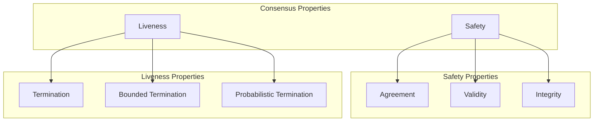
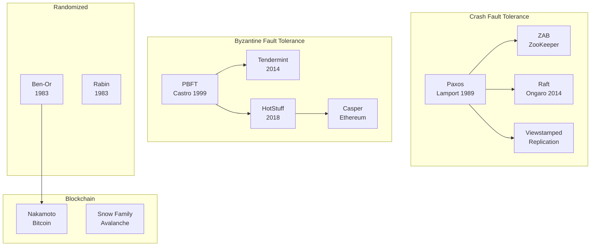
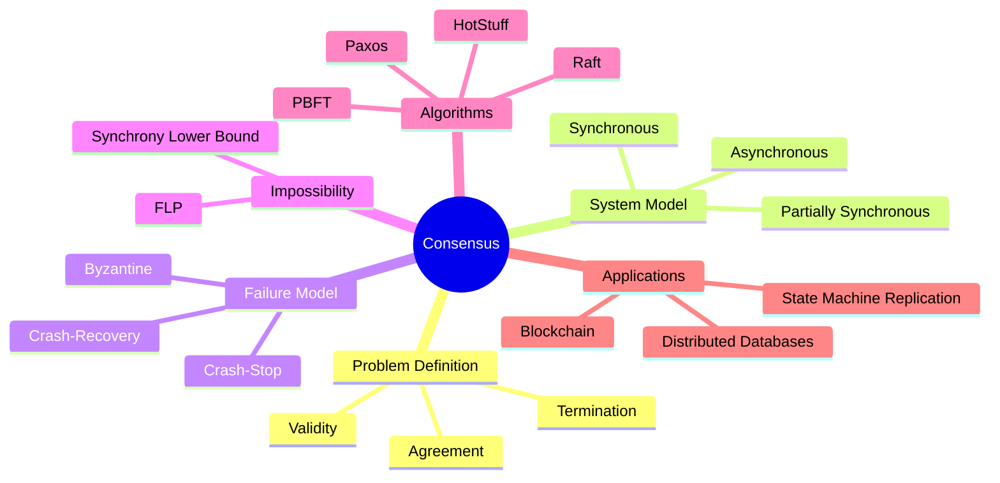
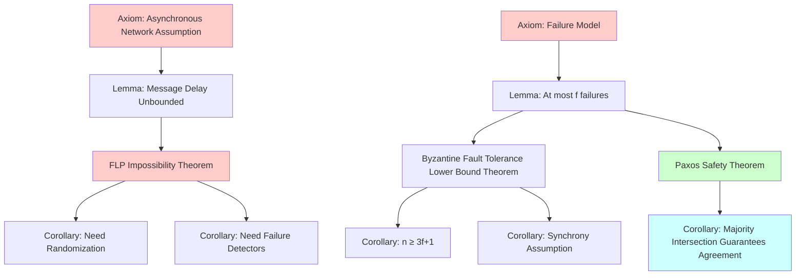

# Consensus

> **Wikipedia Standard Definition**: Consensus is a fundamental problem in distributed computing and multi-agent systems, concerning the ability of a network of nodes to agree on a single data value among distributed processes or systems.
>
> **Source**: <https://en.wikipedia.org/wiki/Consensus_(computer_science)>
>
> **Formality Level**: L4-L5

---

## 1. Wikipedia Standard Definition

### Original English Text
>
> "Consensus is a fundamental problem in distributed computing and multi-agent systems, concerning the ability of a network of nodes to agree on a single data value among distributed processes or systems, with the constraint that some nodes may fail or be unreliable."

### Standard Translation
>
> **Consensus** is a fundamental problem in distributed computing and multi-agent systems, concerning the ability of nodes in a network to agree on a single data value among distributed processes or systems, even when some nodes may fail or be unreliable.

---

## 2. Formal Specification

### 2.1 Consensus Problem Definition

**Def-S-98-01** (Consensus Problem). The consensus problem in distributed systems requires satisfying:

**Termination**:
$$\forall i \in \text{Correct}: \Diamond \text{decide}_i(v_i)$$
Every correct process eventually decides on a value.

**Agreement**:
$$\forall i, j \in \text{Correct}: v_i = v_j$$
All correct processes decide on the same value.

**Validity**:
$$\text{If all correct processes propose } v \text{, then } \forall i \in \text{Correct}: v_i = v$$

### 2.2 Process Failure Models

**Def-S-98-02** (Process Failure Models).

| Failure Model | Failure Behavior | Fault Tolerance Threshold | Representative Algorithms |
|--------------|------------------|--------------------------|---------------------------|
| **Crash-Stop** | Process halts | $f < n/2$ | Paxos, Raft |
| **Crash-Recovery** | Process crashes then recovers | $f < n/2$ | Viewstamped Replication |
| **Byzantine** | Arbitrary behavior | $f < n/3$ | PBFT, Tendermint |
| **Self-Stabilizing** | Temporary arbitrary state | Arbitrary | Dijkstra's Algorithm |

### 2.3 Network Model

**Def-S-98-03** (Synchrony Assumptions).

**Synchronous System**:

- There exists a known upper bound $\Delta$: message delay $\leq \Delta$
- There exists a known upper bound $\Phi$: local clock drift $\leq \Phi$

**Asynchronous System**:

- Message delays have no upper bound
- Local clock drift has no upper bound
- **FLP Impossibility**: In asynchronous systems, even with only one potentially crashing process, no deterministic consensus algorithm exists

---

## 3. Properties and Characteristics

### 3.1 Safety and Liveness

### 3.2 Consensus Impossibility Results

**FLP Impossibility** (Fischer, Lynch, Paterson, 1985):

In **asynchronous systems**, even with only one process potentially having a **crash failure**, no **deterministic** consensus algorithm exists.

**Reason**: Cannot distinguish between a slow process and a crashed process.

**Solutions**:

1. Use randomized algorithms (probabilistic termination)
2. Use failure detectors (partial synchrony assumptions)
3. Use Byzantine assumptions (synchronous systems)

---

## 4. Relationship Network

### 4.1 Consensus Algorithm Taxonomy

### 4.2 Relationships with Core Concepts

| Concept | Relationship | Description |
|---------|-------------|-------------|
| **Byzantine Fault Tolerance** | Instance | Byzantine fault-tolerant consensus |
| **CAP Theorem** | Constraint | Consistency-Availability trade-off |
| **Linearizability** | Related | Distributed consistency model |
| **Two-Phase Commit** | Special Case | Synchronous consensus protocol |
| **Paxos/Raft** | Implementation | Practical consensus algorithms |

---

## 5. Historical Background

### 5.1 Development Milestones

| Year | Contribution | Significance |
|------|-------------|--------------|
| 1980 | Pease, Shostak, Lamport | Byzantine Generals Problem |
| 1983 | Ben-Or, Rabin | Randomized consensus algorithms |
| 1985 | FLP Impossibility | Fundamental limitation of asynchronous systems |
| 1989 | Paxos | Practical consensus algorithm |
| 1996 | Chandra-Toueg | Unified failure detector theory |
| 1999 | PBFT | Practical Byzantine fault tolerance |
| 2014 | Raft | Understandability-first consensus |
| 2009/2018 | Bitcoin/HotStuff | Blockchain era |

---

## 6. Formal Proofs

### 6.1 FLP Impossibility Theorem

**Thm-S-98-01** (FLP Impossibility). In asynchronous systems, even with only one process potentially having a crash failure, no deterministic consensus algorithm exists.

*Proof Sketch*:

**Definitions**:

- **Initial Configuration**: Initial state of all processes
- **Decision State**: Configuration where processes have decided on a value
- **Reachable Configuration**: Configuration reachable through message passing
- **Bivalent Configuration**: There exist reachable configurations that can decide 0 and configurations that can decide 1
- **Univalent Configuration**: All reachable configurations decide the same value (0-valent or 1-valent)

**Lemma 1**: There exists an initial bivalent configuration.

*Proof*:

- Assume all initial configurations are univalent
- Let $C_0$ be the configuration where all processes initially have value 0 (0-valent)
- Let $C_1$ be the configuration where all processes initially have value 1 (1-valent)
- Consider gradually changing initial values from $C_0$ to $C_1$
- There must exist adjacent configurations $C$ and $C'$ where $C$ is 0-valent and $C'$ is 1-valent
- Only one process $p$ has a different initial value
- If $p$ crashes, $C$ and $C'$ are indistinguishable, contradiction ∎

**Lemma 2**: From a bivalent configuration, there exists a reachable bivalent configuration.

*Proof*:

- Let $C$ be a bivalent configuration
- Let $e = (p, m)$ be the next event (process $p$ receives message $m$)
- Let $D$ be the configuration after applying $e$
- If $D$ is bivalent, done
- If $D$ is univalent (assume 0-valent), since $C$ is bivalent, there exists reachable configuration $E$ that can decide 1
- Construct a schedule avoiding $e$ until reaching $E$
- By swapping event order, construct a bivalent configuration ∎

**Theorem Proof**:

- Start from bivalent initial configuration
- Repeatedly apply Lemma 2 to construct an infinite sequence of bivalent configurations
- Therefore, no algorithm can deterministically terminate ∎

### 6.2 Paxos Safety Proof

**Thm-S-98-02** (Paxos Safety). The Paxos algorithm guarantees agreement and validity.

*Proof*:

**Lemma (Quorum Intersection)**: Any two majority sets must have a non-empty intersection.

$$|Q_1| > n/2, |Q_2| > n/2 \Rightarrow |Q_1 \cap Q_2| \geq 1$$

**Safety Proof**:

1. **Value Selection**: Only values accepted by a majority can be chosen
2. **Uniqueness**: Assume two different values $v_1, v_2$ are chosen
   - Let $Q_1$ accept $v_1$, $Q_2$ accept $v_2$
   - By lemma, $\exists p \in Q_1 \cap Q_2$
   - $p$ can only accept one value, contradiction
3. **Agreement**: All learners learn the same chosen value
4. **Validity**: Only proposed values can be chosen ∎

### 6.3 Byzantine Fault Tolerance Lower Bound

**Thm-S-98-03** (Byzantine Fault Tolerance Threshold). Byzantine consensus requires $n \geq 3f + 1$.

*Proof*:

Assume $n = 3f$, consider the following scenario:

1. Divide processes into three groups: $S_1, S_2, S_3$, each of size $f$
2. All processes in $S_1$ propose 0, all in $S_2$ propose 1
3. $S_3$ are Byzantine processes

**Scenario A**: $S_1$'s perspective

- $S_3$ behaves toward $S_1$ like $S_2$ (sending consistent messages)
- $S_1$ only sees $f$ honest proposals for 0, $f$ Byzantine behaving like proposing 1
- To reach agreement, $S_1$ must decide 0

**Scenario B**: $S_2$'s perspective

- $S_3$ behaves toward $S_2$ like $S_1$
- $S_2$ decides 1

**Contradiction**: $S_1$ decides 0, $S_2$ decides 1, violating agreement

Therefore $n \geq 3f + 1$ is necessary ∎

---

## 7. Eight-Dimensional Characterization

### 7.1 Mind Map

### 7.2 Multi-Dimensional Comparison Matrix

| Algorithm | Fault Tolerance Type | Fault Count | Message Complexity | Latency | Practicality |
|-----------|---------------------|-------------|-------------------|---------|--------------|
| Paxos | Crash | $f < n/2$ | $O(n^2)$ | 2RTT | High |
| Raft | Crash | $f < n/2$ | $O(n)$ | 2RTT | High |
| PBFT | Byzantine | $f < n/3$ | $O(n^2)$ | 3RTT | Medium |
| HotStuff | Byzantine | $f < n/3$ | $O(n)$ | 3RTT | High |
| Ben-Or | Crash | $f < n/5$ | $O(n^2)$ | Expected $O(1)$ | Medium |

### 7.3 Axiom-Theorem Tree

---

## 8. References

---

## 9. Related Concepts

- [Paxos Consensus Algorithm](18-paxos.md) - Complete formal analysis of Paxos algorithm
- [Raft](19-raft.md)
- [Byzantine Fault Tolerance](12-byzantine-fault-tolerance.md)
- [Two-Phase Commit](17-two-phase-commit.md)
