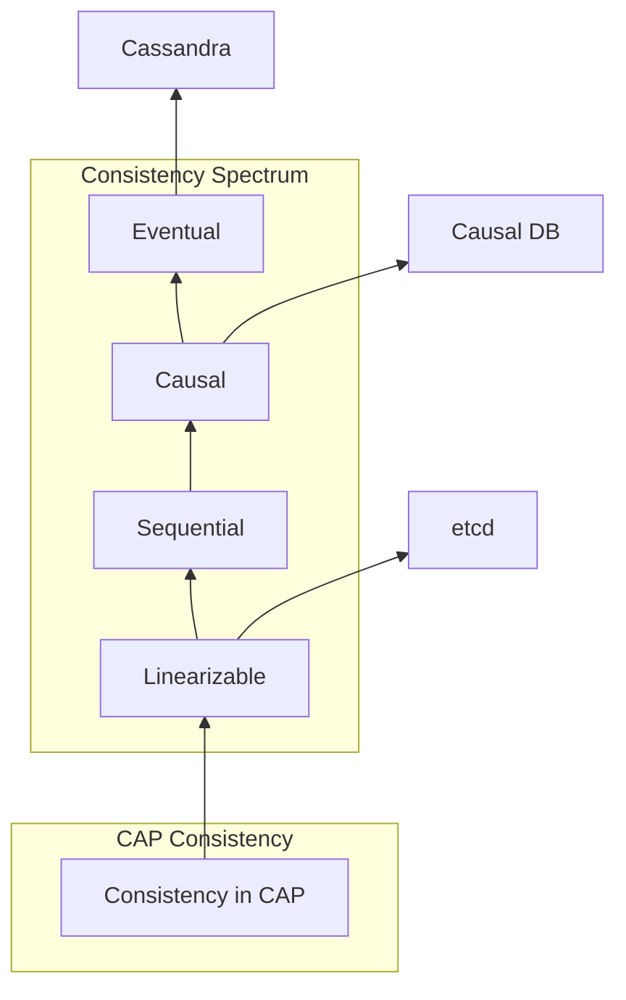
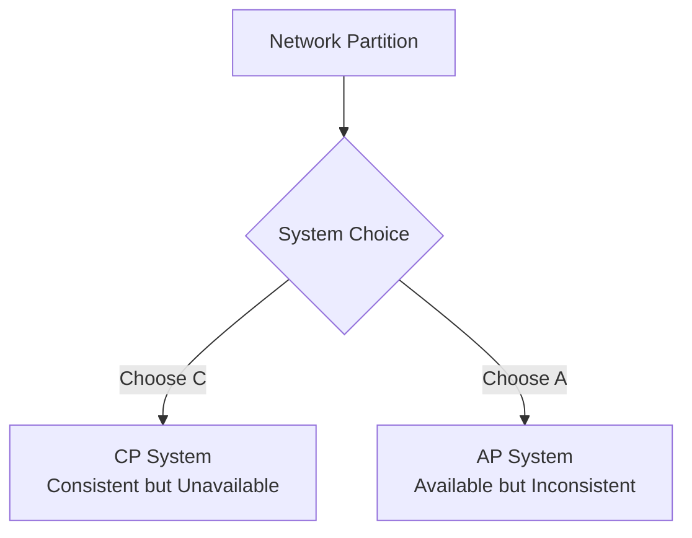
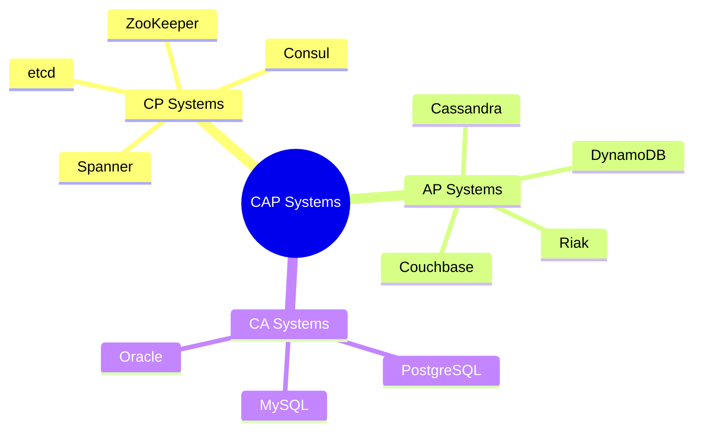
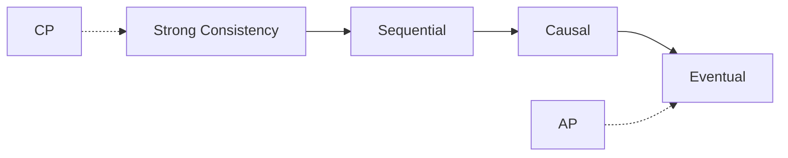

# CAP Theorem

> **Wikipedia Standard Definition**: In theoretical computer science, the CAP theorem, also named Brewer's theorem after computer scientist Eric Brewer, states that any distributed data store can provide only two of the following three guarantees: Consistency, Availability, and Partition tolerance.
>
> **Source**: <https://en.wikipedia.org/wiki/CAP_theorem>
>
> **Formality Level**: L4 (Fundamental Theory of Distributed Systems)

---

## 1. Wikipedia Standard Definition

### Original English Text
>
> "In theoretical computer science, the CAP theorem, also named Brewer's theorem after computer scientist Eric Brewer, states that any distributed data store can provide only two of the following three guarantees: Consistency (every read receives the most recent write or an error), Availability (every request receives a non-error response, without the guarantee that it contains the most recent write), and Partition tolerance (the system continues to operate despite an arbitrary number of messages being dropped or delayed by the network between nodes)."

### Standard Translation
>
> In theoretical computer science, the **CAP theorem** (also named **Brewer's theorem** after computer scientist Eric Brewer) states that any distributed data store can provide only two of the following three guarantees: **Consistency** (every read receives the most recent write or an error), **Availability** (every request receives a non-error response, without the guarantee that it contains the most recent write), and **Partition Tolerance** (the system continues to operate despite an arbitrary number of messages being dropped or delayed by the network between nodes).

---

## 2. Formal Specification

### 2.1 Gilbert-Lynch Formalization

**Def-S-98-01** (Asynchronous Network Model). Distributed system model $\mathcal{A}$:

- Process set $\Pi = \{p_1, p_2, \ldots, p_n\}$
- Shared register set $\mathcal{R}$
- Each register supports $read()$ and $write(v)$ operations
- **Asynchrony**: Message delays have no upper bound, no clocks

**Def-S-98-02** (CAP Three Properties Formalization).

**Consistency**:
$$\forall r \in \text{Reads}: r.\text{value} = \text{latest-write}(r.\text{register})$$

Or returns an error.

**Availability**:
$$\forall \text{requests}: \neg \text{timeout}(\text{request}) \land \neg \text{error}(\text{response})$$

**Partition Tolerance**:
$$\text{partition}(\Pi_1, \Pi_2) \Rightarrow \text{system-operational}(\Pi_1) \land \text{system-operational}(\Pi_2)$$

### 2.2 PACELC Extension

**Def-S-98-03** (PACELC). If Partition (P) then Availability (A) or Consistency (C), Else (E) Latency (L) or Consistency (C):

$$\text{If } P \text{ then } (A \text{ or } C) \text{ else } (L \text{ or } C)$$

---

## 3. Properties and Characteristics

### 3.1 CAP Trade-off Space

```mermaid
graph TB
    subgraph "CAP Three-Dimensional Space"
        C[Consistency]
        A[Availability]
        P[Partition Tolerance]
    end

    subgraph "System Choices"
        CP[CP System<br/>Consistent + Partition-tolerant]
        AP[AP System<br/>Available + Partition-tolerant]
        CA[CA System<br/>(Non-distributed only)]
    end

    C --> CP
    P --> CP
    P --> AP
    A --> AP

    style CP fill:#ccffcc
    style AP fill:#ccffff
    style CA fill:#ffcccc
```

### 3.2 System Classification

| System | Type | Consistency Model | Application Scenario |
|--------|------|-------------------|---------------------|
| **etcd** | CP | Linearizable | Configuration Management |
| **ZooKeeper** | CP | Sequential | Coordination Service |
| **Cassandra** | AP | Eventual | High-throughput Writes |
| **DynamoDB** | AP | Eventual | Key-Value Store |
| **MongoDB** | CP | Strong | Document Store |
| **Spanner** | CP | External Consistency | Global Database |

---

## 4. Relationship Network

### 4.1 Relationship with Consistency Models



### 4.2 Relationships with Core Concepts

| Concept | Relationship | Description |
|---------|-------------|-------------|
| **Consensus** | Constraint | FLP limits CA in asynchronous networks |
| **Linearizability** | Instance | Consistency in CAP usually refers to Linearizability |
| **Quorum** | Mechanism | $R+W>N$ implements CP, $R+W \leq N$ implements AP |
| **Vector Clocks** | Tool | Causal tracking for AP systems |

---

## 5. Historical Background

### 5.1 Development Timeline

| Year | Event | Author |
|------|-------|--------|
| 2000 | CAP Conjecture Proposed | Eric Brewer (PODC keynote) |
| 2002 | CAP Formal Proof | Gilbert & Lynch |
| 2010 | CAP Revisited | Brewer (IEEE Computer) |
| 2012 | CAP Twelve Years Later | Brewer Retrospective |
| 2015 | PACELC Proposed | Kleppmann & Martin |
| 2017 | Latency-Sensitive Framework | Kleppmann |

### 5.2 Gilbert-Lynch Proof

**Theorem**: In asynchronous networks, it is impossible to simultaneously guarantee Consistency, Availability, and Partition Tolerance.

*Proof Sketch*:

**Assumption**: There exists algorithm $A$ satisfying C, A, and P.

**Scenario Construction**:

1. **Partition**: Divide network into $G_1$ and $G_2$, messages cannot cross partition
2. **Client $c_1 \in G_1$ executes $write(v_1)$**
3. **Client $c_2 \in G_2$ executes $read()$**

**Contradiction Derivation**:

- By Availability (A): $read()$ must return a non-error value
- By Consistency (C): $read()$ must return $v_1$
- But $c_2$ cannot know $v_1$ (partition prevents message delivery)
- Therefore, either Consistency or Availability must be violated

∎ Contradiction!

---

## 6. Formal Proofs

### 6.1 Gilbert-Lynch Complete Proof

**Thm-S-98-01** (CAP Theorem). In asynchronous networks, shared register systems cannot simultaneously satisfy Consistency, Availability, and Partition Tolerance.

*Detailed Proof*:

**System Model**:

- $n \geq 2$ processes
- Each process stores a local copy of registers
- Asynchronous message passing

**Execution Construction**:

**Execution $\alpha_1$**:

- Process $p$ executes $write(1)$ to register $r$
- Only sends messages to processes in $G_1$
- Processes in $G_2$ receive no messages

**Execution $\alpha_2$**:

- Same as $\alpha_1$, but from $G_2$'s perspective
- Processes in $G_2$ see initial value $v_0$ for $r$

**Key Observation**:

- Processes in $G_2$ cannot distinguish between:
  1. $write(1)$ has not occurred
  2. $write(1)$ occurred but messages were lost (partition)

**Contradiction**:

- If process $q$ in $G_2$ responds to $read(r)$:
  - Returns $v_0$: violates Consistency (if $write$ occurred)
  - Returns $1$: violates Consistency (if $write$ did not occur)
  - Returns error: violates Availability

Therefore, it is impossible to simultaneously satisfy C, A, and P. ∎

### 6.2 Quorum System CAP Boundaries

**Thm-S-98-02** (Quorum CAP Boundaries). For read Quorum $R$ and write Quorum $W$:

$$R + W > N \Rightarrow \text{CP System}$$
$$R + W \leq N \Rightarrow \text{AP System}$$

*Proof*:

**CP Case** ($R+W > N$):

- Any read Quorum and write Quorum must intersect
- Read operations must see the latest write
- During partition, may not form Quorum, sacrificing availability

**AP Case** ($R+W \leq N$):

- Read Quorum may not contain the latest write
- During partition, each partition can independently serve read requests
- Maintains availability, sacrifices strong consistency

∎

---

## 7. Eight-Dimensional Characterization

### Dimension 1: Consistency Model

| System Type | Consistency Guarantee | Use Case |
|-------------|----------------------|----------|
| CP | Strong Consistency | Financial transactions |
| AP | Eventual Consistency | Social media feeds |
| CA | Strong Consistency (non-distributed) | Single-node databases |

### Dimension 2: Network Partitions



### Dimension 3: Latency Trade-offs

| Choice | Read Latency | Write Latency |
|--------|--------------|---------------|
| CP | Higher (quorum) | Higher (replication) |
| AP | Lower | Lower |

### Dimension 4: Implementation Complexity

| Aspect | CP | AP |
|--------|-----|-----|
| Conflict Resolution | None needed | Required |
| Vector Clocks | Optional | Required |
| Read Repair | Optional | Required |

### Dimension 5: System Examples



### Dimension 6: Failure Modes

| Scenario | CP Behavior | AP Behavior |
|----------|-------------|-------------|
| Partition | Reject operations | Continue with stale data |
| Node Failure | May become unavailable | Remains available |
| Network Delay | Timeout | Return local copy |

### Dimension 7: Consistency Spectrum



### Dimension 8: Practical Considerations

| Factor | CP | AP |
|--------|-----|-----|
| Data Criticality | High | Medium/Low |
| User Experience | Consistency first | Availability first |
| Business Domain | Banking, Inventory | Social, Analytics |

---

## 8. References


---

## 9. Related Concepts

- [CAP Theorem Detailed Analysis](../../03-model-taxonomy/04-consistency/02-cap-theorem.md) - Complete formal analysis and proof of CAP theorem
- [Consensus](13-consensus.md)
- [Linearizability](15-linearizability.md)
- [Consistency Models](01-consistency-spectrum.md)
