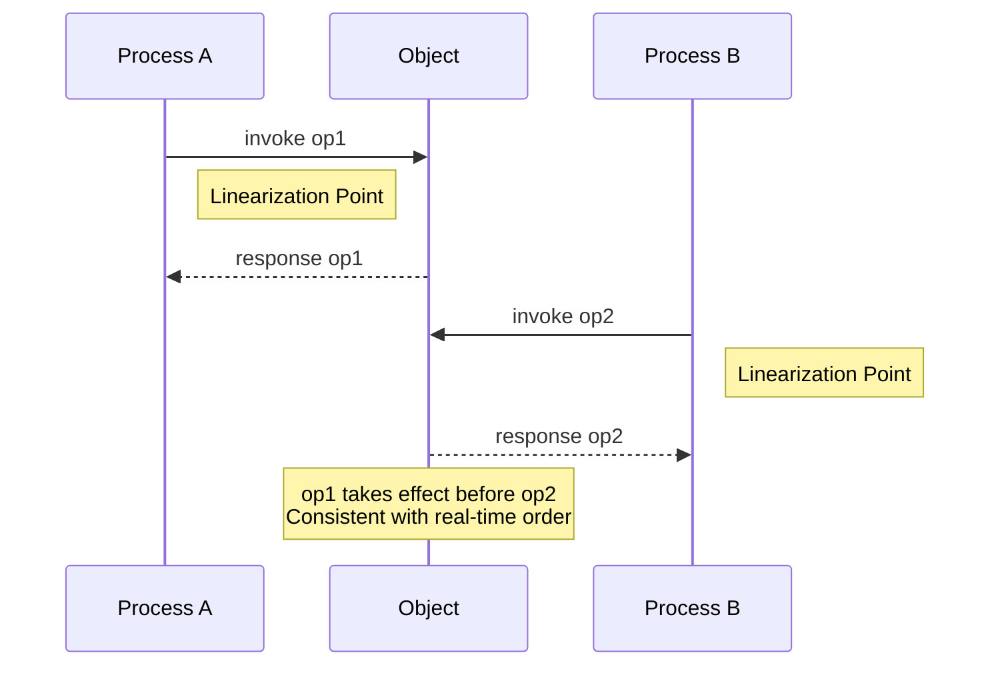
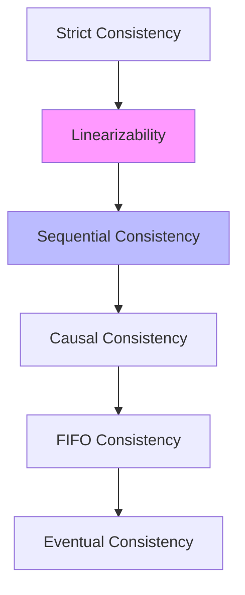
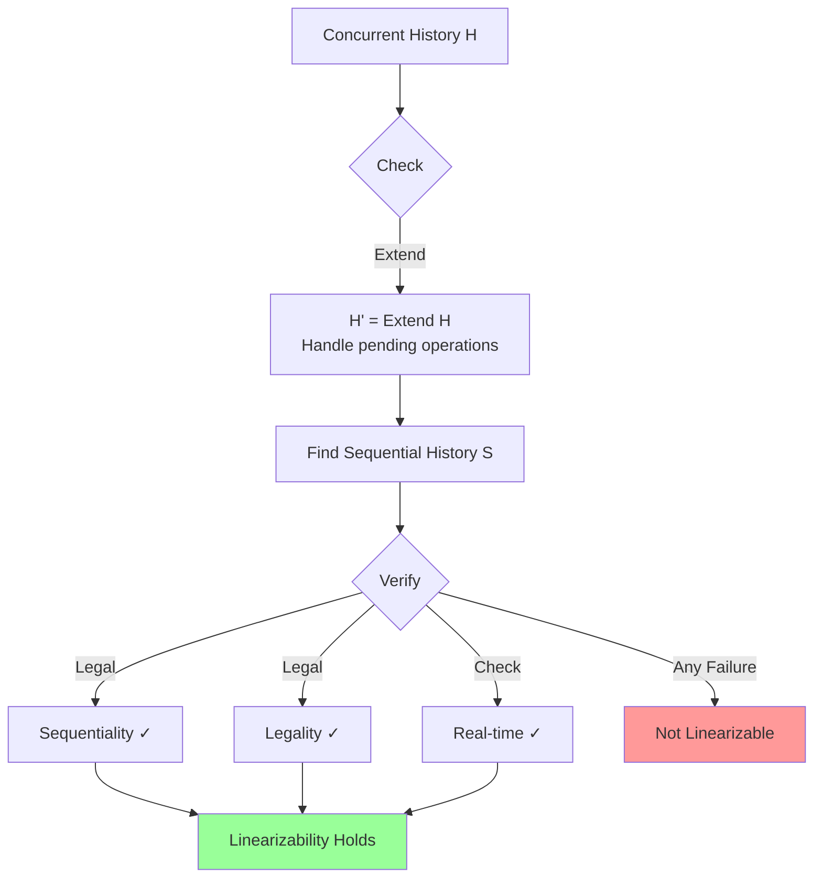
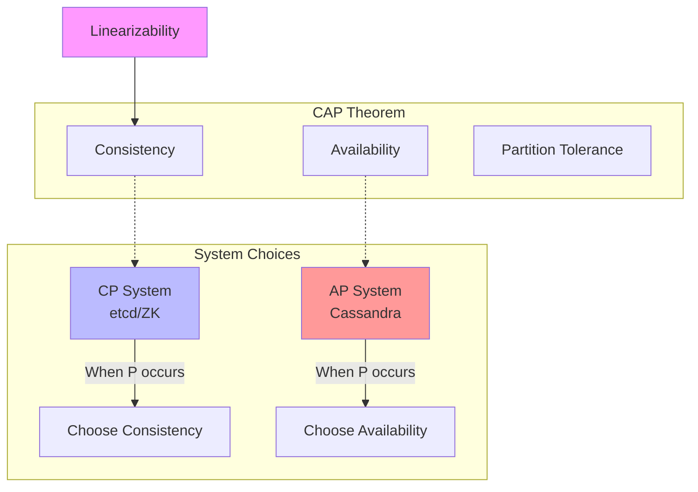
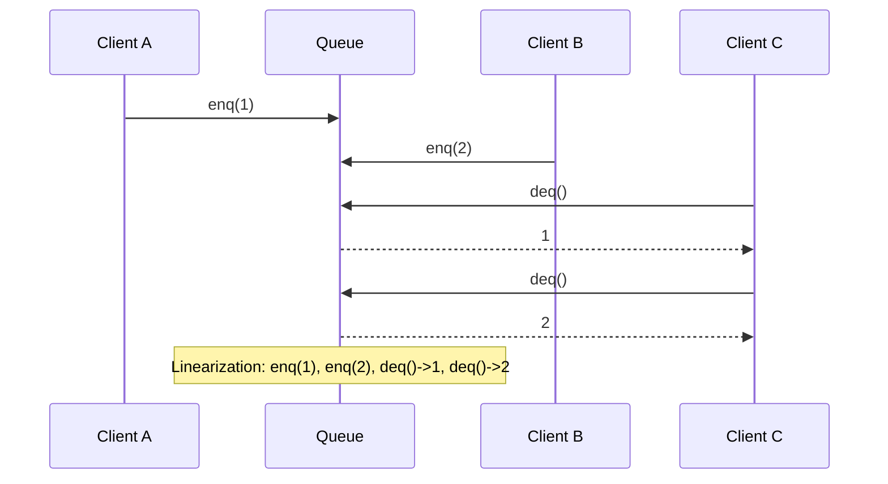
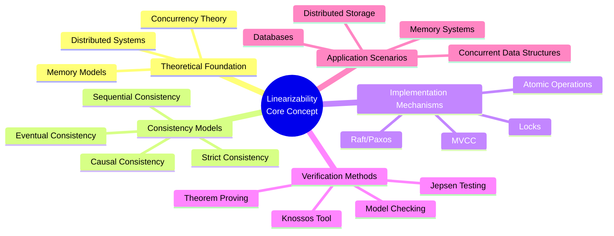
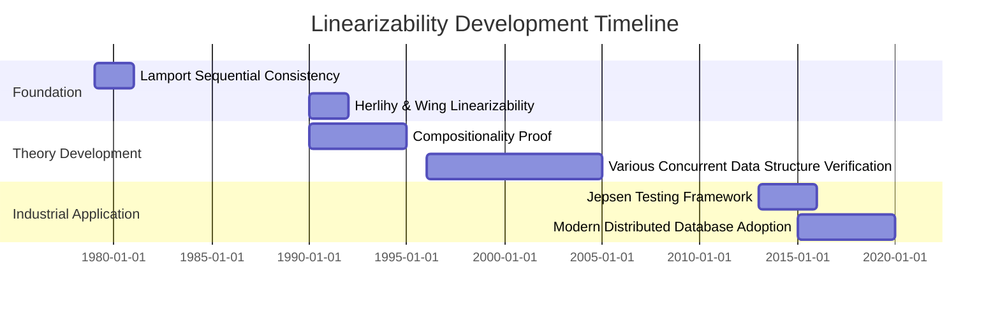
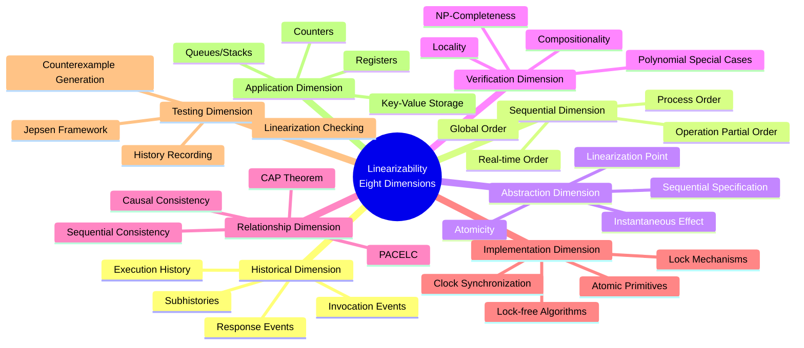

# Linearizability

> **Stage**: Struct | **Prerequisites**: [Concurrency Theory](../03-models/concurrency-theory.md), [Distributed Consistency](../04-distributed/consistency-models.md) | **Formality Level**: L5

---

## 1. Definitions

### 1.1 Wikipedia Standard Definition

**English Definition** (Wikipedia):
> *Linearizability is a correctness condition for concurrent objects that ensures that operations appear to take effect instantaneously at some point between their invocation and response. It was introduced by Herlihy and Wing in 1990 as a strict correctness condition for concurrent data structures.*

**Chinese Definition** (Wikipedia):
> *Linearizability is a correctness condition for concurrent objects that ensures operations appear to take effect instantaneously at some point between invocation and response. It was introduced by Herlihy and Wing in 1990 as a strict correctness condition for concurrent data structures.*

---

### 1.2 Formal Definitions

#### Def-S-LIN-01: Execution History

**Definition**: An execution history $H$ is a finite sequence of events, where events can be:

- **Invocation event**: $\langle x\, \text{op}(args)\, A \rangle$ — Process $A$ invokes operation $op$ on object $x$
- **Response event**: $\langle x\, \text{res}\, A \rangle$ — Operation of process $A$ returns result $res$

**Complete Operation**: An operation consists of a matching invocation-response pair.

**History Notation**:

- $H|A$: Subhistory of process $A$ in $H$
- $H|x$: Subhistory of object $x$ in $H$
- $\text{complete}(H)$: All completed operations in $H$

---

#### Def-S-LIN-02: Sequential History

**Definition**: History $S$ is sequential if and only if:

1. $S$ begins with an invocation event
2. Except possibly for the last event, each invocation is immediately followed by its matching response
3. Except for the first event, each response is immediately preceded by its matching invocation

**Formal**: Sequential histories have no overlapping operations; each operation completes atomically.

---

#### Def-S-LIN-03: Linearization Point

**Definition**: For an operation $op$ executing in history $H$, its linearization point is a moment between invocation and response such that:

- The operation appears to complete instantaneously at this moment
- The effects of the operation become visible to other operations at this moment

**Intuition**: The linearization point is the moment when the operation "appears" to take effect.

---

#### Def-S-LIN-04: Linearizability

**Definition** (Herlihy & Wing, 1990): History $H$ is linearizable if and only if:

1. $H$ can be extended to $H'$ by appending response events for some pending invocations (or removing them)
2. There exists a permutation $S$ of all complete operations in $H'$ satisfying:
   - **Sequentiality**: $S$ is a sequential history
   - **Validity**: $S$ conforms to the sequential specification of the object
   - **Real-time**: If operation $op_1$ completes before $op_2$ is invoked in $H$, then $op_1$ precedes $op_2$ in $S$

**Formal**:
$$\text{Linearizable}(H) \iff \exists S: \text{Sequential}(S) \land \text{Legal}(S) \land \forall op_1, op_2: (op_1 <_H op_2 \rightarrow op_1 <_S op_2)$$

Where $op_1 <_H op_2$ means $op_1$ completes before $op_2$ is invoked in $H$.

---

#### Def-S-LIN-05: Sequential Specification

**Definition**: The sequential specification of object $x$ is a function $Spec_x$ mapping each possible sequential history $S$ to {legal, illegal}.

**Example** (Queue):

- $enq(x)$: Enqueue $x$
- $deq() \Rightarrow y$: Dequeue returns $y$
- Legal sequential history: FIFO order

---

## 2. Properties

### 2.1 Basic Properties of Linearizability

#### Lemma-S-LIN-01: Locality

**Lemma**: History $H$ is linearizable if and only if for each object $x$, $H|x$ is linearizable.

*Proof Sketch*:

- ($\Rightarrow$): If $H$ is linearizable, restriction to single object is clearly linearizable
- ($\Leftarrow$): If all object subhistories are linearizable, combining linearization points of each object yields global linearization

**Significance**: Linearizability can be verified independently for each object, then composed.

---

#### Lemma-S-LIN-02: Non-blocking

**Lemma**: Linearizability does not restrict pending (incomplete) operations.

**Explanation**: The definition allows pending operations to be ignored or assigned arbitrary responses, making linearizability not require processes to complete operations.

---

#### Lemma-S-LIN-03: Compositionality

**Lemma**: If objects $O_1$ and $O_2$ implement linearizable sequential specifications $Spec_1$ and $Spec_2$ respectively, then the system $(O_1, O_2)$ implements linearizable specification $Spec_1 \times Spec_2$.

---

## 3. Relations

### 3.1 Relationship with Sequential Consistency

| Property | Linearizability | Sequential Consistency |
|----------|----------------|----------------------|
| Operation Order | Global real-time order | Per-process order |
| Cross-process Visibility | Immediate | Delayed |
| Implementation Difficulty | Harder | Easier |
| Typical Systems | Databases, Locks | CPU caches, Distributed Storage |

**Relationship**: Linearizability $\Rightarrow$ Sequential Consistency

**Counterexample**: Execution that is sequentially consistent but not linearizable

- Process A: write(x, 1)
- Process B: write(x, 2)
- Process C: read() $\Rightarrow$ 2, read() $\Rightarrow$ 1

If write 1 completes before write 2 (real-time order), but C sees 2 before 1, this violates linearizability but satisfies sequential consistency.

---

### 3.2 Relationship with CAP Theorem

#### Prop-S-LIN-01: Linearizability in CAP

**Proposition**: The "Consistency" in CAP theorem usually refers to linearizability or sequential consistency.

**CAP Trade-off**:

- **CP Systems**: Provide linearizability (e.g., etcd, ZooKeeper, Consul)
- **AP Systems**: Provide weaker consistency for availability (e.g., Cassandra, DynamoDB)

**PACELC Theorem** (CAP Extension):

- If Partition (P), choose between Availability (A) and Consistency (C)
- Else (E), choose between Latency (L) and Consistency (C)

---

### 3.3 Relationship with Other Consistency Models

**Consistency Strength Hierarchy**:

```
Strict Consistency > Linearizability > Sequential Consistency >
Causal Consistency > FIFO Consistency > Eventual Consistency
```

**Memory Consistency Models**:

- **Sequential Consistency** (Lamport, 1979)
- **Processor Consistency** (Goodman, 1989)
- **Release Consistency** (Gharachorloo et al., 1990)

---

## 4. Argumentation

### 4.1 Rationale for Linearizability

#### Argument: Why Linearizability as the Standard

**Intuitive Foundation**:

1. **Real-time**: Aligns with causality in the physical world
2. **Composability**: Allows modular verification
3. **Implementability**: Most concurrent data structures can achieve it

**Comparison with Other Models**:

| Scenario | Linearizability Advantage |
|----------|--------------------------|
| Distributed Locks | Ensures lock mutual exclusion is verifiable |
| Concurrent Queues | Guarantees FIFO semantics |
| Atomic Counters | Ensures read values are exact at some moment |

---

### 4.2 Linearization Point Detection Argument

**Problem**: How to determine the linearization point of an operation?

**Strategies**:

1. **Code Annotation**: Explicitly mark linearization points in implementation
2. **Verification**: Prove that annotated points satisfy linearizability conditions
3. **Automation**: Use model checking or theorem proving

**Example** (Compare-And-Swap):

```
CAS(addr, expected, new):
    if *addr == expected:
        *addr = new
        return true    // Linearization point: successful write
    return false       // Linearization point: failed read comparison
```

---

## 5. Formal Proofs

### 5.1 Theorem: Compositionality of Linearizability

#### Thm-S-LIN-01: Compositionality Theorem

**Theorem** (Herlihy & Wing): Let $H$ be a history involving multiple objects. $H$ is linearizable if and only if for each object $x$, subhistory $H|x$ is linearizable.

**Proof**:

**($\Rightarrow$) Direction**:

If $H$ is linearizable, then there exists a linearization $S$.
For any object $x$, $S|x$ is a linearization of $H|x$ (since restriction preserves order relations).

**($\Leftarrow$) Direction**:

Assume for all objects $x$, $H|x$ has a linearization $S_x$.

**Construct Global Linearization $S$**:

1. For each object $x$, $S_x$ defines linearization points for operations in $H|x$
2. Sort all operations from all objects by their linearization point times
3. Need to prove: This ordering satisfies the real-time condition

**Key Observation**:

If $op_1 <_H op_2$ ($op_1$ completes before $op_2$ is invoked), then:

- If $op_1, op_2$ are on the same object $x$: $S_x$ guarantees $op_1$ precedes $op_2$
- If on different objects: By real-time condition, need to ensure $op_1$ precedes $op_2$ in $S$

**Construction Algorithm**:

Use topological sort:

- Vertices: All complete operations in $H$
- Edges:
  - Object edges: $op_1 \rightarrow op_2$ if $op_1 <_{S_x} op_2$ for some $x$
  - Real-time edges: $op_1 \rightarrow op_2$ if $op_1 <_H op_2$

**Prove Acyclicity**:

Assume there exists a cycle $op_1 \rightarrow op_2 \rightarrow \ldots \rightarrow op_n \rightarrow op_1$.

Edge type analysis:

- If cycle consists entirely of object edges: Contradicts some $S_x$ being a total order
- If cycle contains real-time edges: Violates transitivity of real-time

Therefore the graph is acyclic, topological sort exists, hence $H$ is linearizable. ∎

---

### 5.2 Theorem: Linearizability Implies Sequential Consistency

#### Thm-S-LIN-02: Implication Relationship

**Theorem**: If history $H$ is linearizable, then $H$ is sequentially consistent.

**Proof**:

Let $H$ be linearizable, with linearization $S$ satisfying:

1. $S$ is a sequential history
2. $S$ is legal
3. Real-time: $op_1 <_H op_2 \implies op_1 <_S op_2$

**Verify Sequential Consistency Conditions**:

Sequential consistency requires a sequential history $S'$ satisfying:

- Legal
- Preserves each process's invocation-response order

**Construction**:
Take $S' = S$.

Verify process order:

- If in the same process $A$, $op_1$ is invoked before $op_2$
- Then $op_1$'s invocation precedes $op_2$'s invocation in $H|A$
- If $op_1$ has completed, then $op_1 <_H op_2$, and by real-time $op_1 <_S op_2$
- If $op_1$ has not completed... (detailed analysis)

In sequential consistency, incomplete operations can be reordered. The real-time condition of linearizability is a stronger constraint, therefore it implies sequential consistency. ∎

---

### 5.3 Theorem: Complexity of Linearizability and Linearization

#### Thm-S-LIN-03: Verification Complexity

**Theorem**: Determining whether a finite history $H$ is linearizable is NP-complete.

**Proof Sketch**:

**NP Membership**:

- Certificate: Linearization $S$
- Verification: Check if $S$ satisfies sequentiality, legality, and real-time
- Can be done in polynomial time

**NP-Hardness** (by reduction from some scheduling problem):

Reduction from interval scheduling or partial order dimension problems to prove the difficulty of determining linearizability.

**Key Observation**: Linearization point selection is essentially a combinatorial problem, potentially requiring exponential time search.

**Special Cases**:

- Certain data structures (queues, stacks) have polynomial-time algorithms
- General case remains NP-complete ∎

---

## 6. Examples

### 6.1 Linearizability of Concurrent Queue

**Operations**:

- `enq(x)`: Enqueue
- `deq() -> y`: Dequeue

**Sequential Specification**: FIFO

**Linearizable History Example**:

```
Timeline:
A: enq(1) =====>
B: enq(2) ==========>
C: deq() ==============> 1
D: deq() ==================> 2
```

**Possible Linearizations**:

- $S_1$: enq(1), enq(2), deq()->1, deq()->2 ✓
- $S_2$: enq(2), enq(1), deq()->1... ✗ (Violates FIFO)

Verify $S_1$ satisfies real-time: enq(1) completes before deq() is invoked, hence precedes deq.

---

### 6.2 Linearization Points of Lock-Free Stack

**Treiber Stack Implementation**:

```
push(x):
    repeat:
        old = top
        new = Node(x, old)
    until CAS(top, old, new)  // Linearization point

pop():
    repeat:
        old = top
        if old == null: return EMPTY
        new = old.next
    until CAS(top, old, new)  // Linearization point
    return old.value
```

**Linearization Points**: Successful CAS operations.

---

### 6.3 Jepsen Testing Example

**Test Scenario**: Distributed key-value store

**Test Method**:

1. Clients concurrently execute read/write operations
2. Record complete history (including timestamps)
3. Use tools like Knossos to verify linearizability

**Common Violations**:

- **Read Monotonicity Violation**: Read old value then read even older value
- **Causal Violation**: Write W then read R, R does not see W

**Linearizability Verification**: Check if a legal linearization exists.

---

## 7. Visualizations

### 7.1 Linearization Point Diagram



### 7.2 Consistency Model Hierarchy



### 7.3 Linearizability Verification Flow



### 7.4 Linearizability in CAP Theorem



### 7.5 Concurrent Queue Linearization Example



### 7.6 Relationship with Related Concepts



### 7.7 Development Timeline



### 7.8 Eight-Dimensional Characterization Overview



---

## 8. Relations

### Relationship with Consistency Spectrum

Linearizability is a core concept in the consistency spectrum, located between strict consistency and sequential consistency. It provides single-object strong consistency guarantees and is the gold standard for distributed storage system design.

- See: [Consistency Spectrum](../../../03-model-taxonomy/04-consistency/01-consistency-spectrum.md)

Consistency hierarchy relationship:

```
Strict Consistency > Linearizability > Sequential Consistency > Causal Consistency > FIFO Consistency > Eventual Consistency
```

Characteristics of Linearizability in the consistency spectrum:

- **Strength**: Provides global real-time ordering guarantee
- **Implementability**: Can be achieved through consensus algorithms like Paxos/Raft
- **Performance Cost**: Requires synchronous replication, higher latency
- **Application Scenarios**: Financial transactions, distributed locks, strongly consistent storage

---

## 9. References


---

*Document Version: v1.0 | Created: 2026-04-10 | Last Updated: 2026-04-10*
