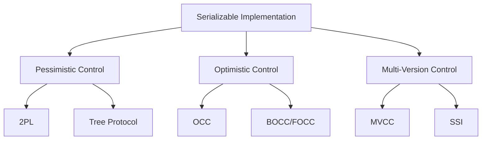
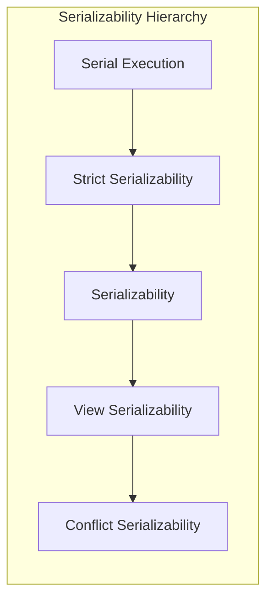
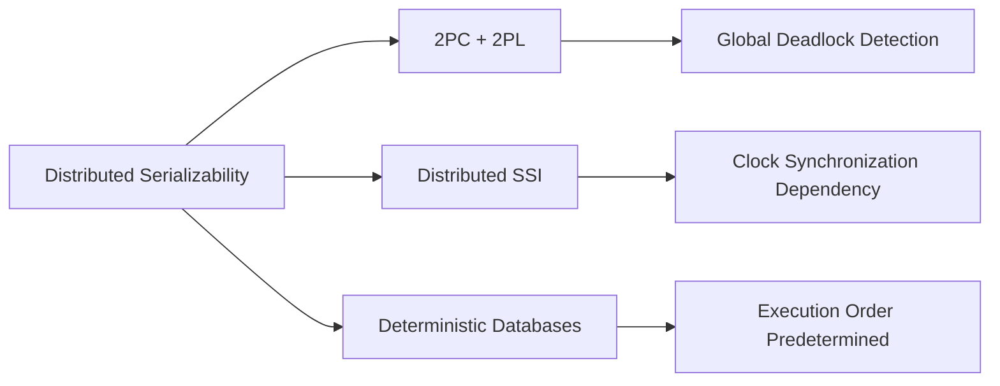
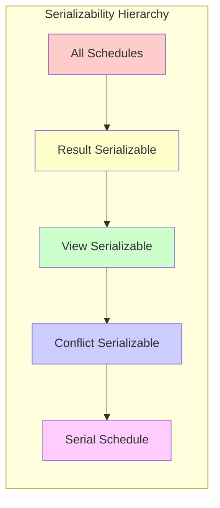
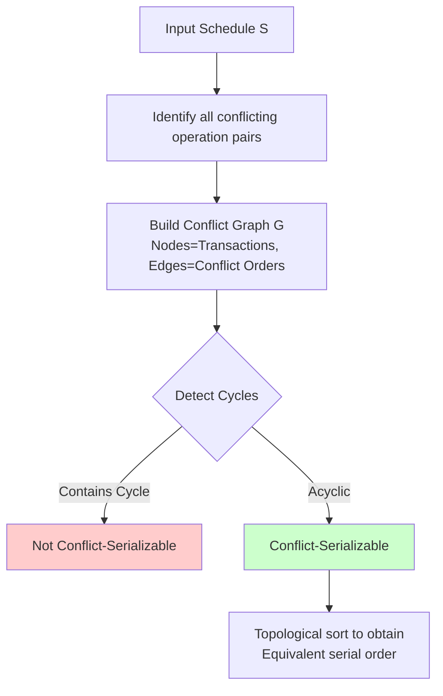
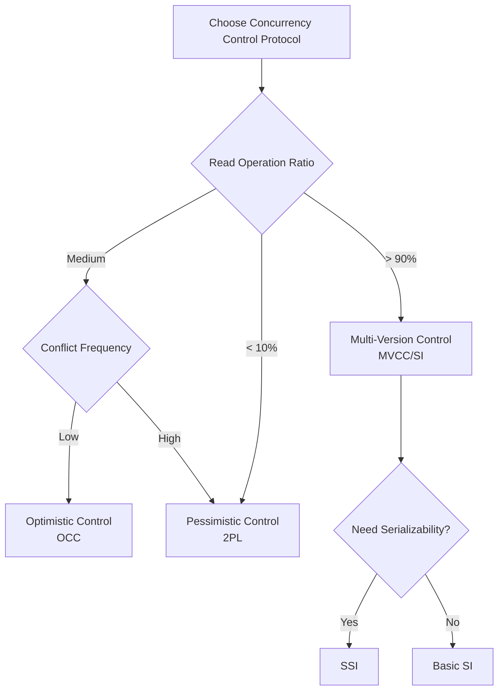
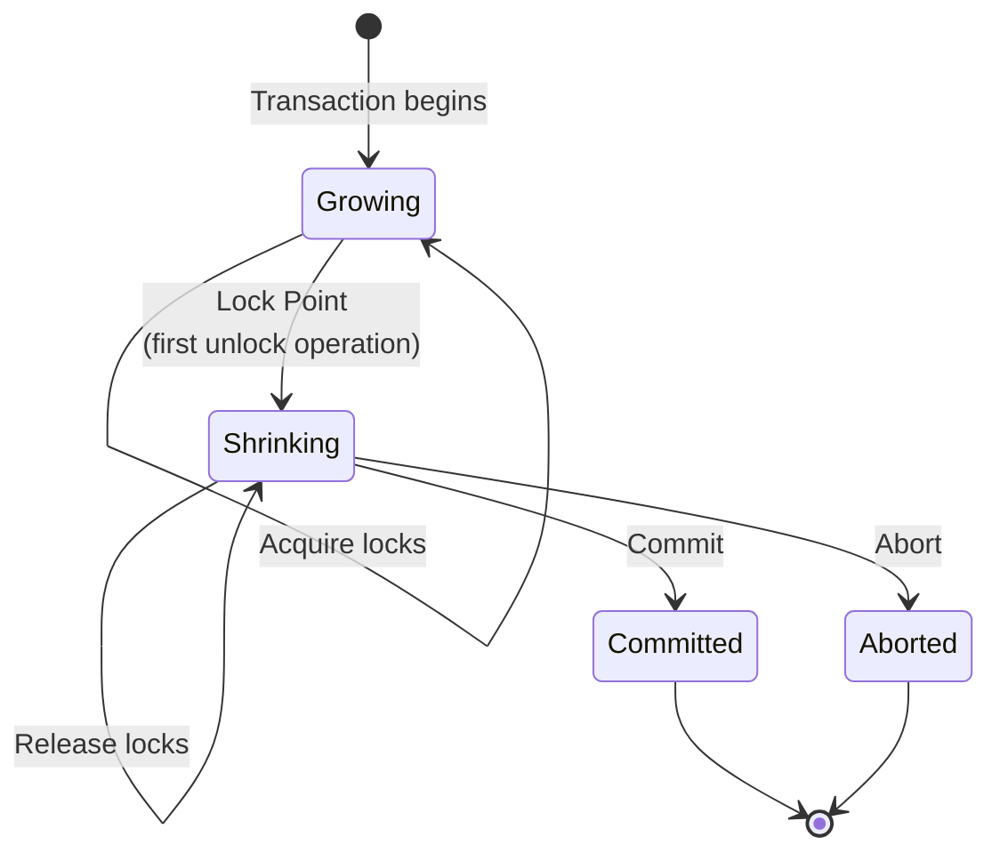

# Serializability

> **Stage**: Struct | **Prerequisites**: [Transaction Theory Foundations](01-transaction-theory.md), [Concurrency Control Principles](02-concurrency-control.md) | **Formality Level**: L5
>
> **Tags**: #serializability #concurrency-control #transaction-isolation #conflict-serializability #view-serializability #two-phase-locking #ssi

## 1. Definitions

### 1.1 Wikipedia Standard Definition

> **Serializability** is the highest isolation level for database transaction concurrency control, ensuring that the execution result of concurrent transactions is equivalent to some serial execution of those transactions [^1].

According to Wikipedia, serializability is a property of concurrency control that guarantees the correctness of database transaction schedules. A schedule is called serializable if and only if it is result-equivalent to some serial schedule.

---

### 1.2 Formal Foundations

#### Def-S-98-01: Transaction

A transaction $T_i$ is a finite sequence of operations:

$$T_i = \langle op_{i1}, op_{i2}, \ldots, op_{in} \rangle$$

Where operation $op_{ij}$ can be one of the following types:

- **Read operation**: $r_i[x]$ — Transaction $T_i$ reads data item $x$
- **Write operation**: $w_i[x]$ — Transaction $T_i$ writes data item $x$
- **Begin**: $b_i$ — Transaction $T_i$ begins
- **Commit**: $c_i$ — Transaction $T_i$ commits
- **Abort**: $a_i$ — Transaction $T_i$ aborts (rolls back)

#### Def-S-98-02: Schedule

**Definition (Schedule)**: A schedule $S$ is an interleaved sequence of operations from multiple transactions, formalized as:

$$S = \langle op_1, op_2, \ldots, op_m \rangle$$

Where each $op_k$ belongs to some transaction $T_i$, and for each transaction $T_i$, its operations appear in $S$ in the same relative order as in $T_i$.

**Schedule Example**:

Consider two transactions:

```
T1: r1[x] w1[x] r1[y] w1[y] c1
T2: r2[x] w2[x] r2[y] w2[y] c2
```

A possible concurrent schedule:

```
S: r1[x] r2[x] w1[x] w2[x] r1[y] w1[y] c1 r2[y] w2[y] c2
```

#### Def-S-98-03: Serial Schedule

**Definition (Serial Schedule)**: A serial schedule is one where transactions execute without interleaving, i.e., all operations of one transaction complete before any operation of another transaction begins.

Formal expression: Schedule $S$ is serial if and only if:

$$\forall T_i, T_j \in S, i \neq j: \text{if } T_i \prec_S T_j \text{ then } \forall op_i \in T_i, \forall op_j \in T_j: op_i <_S op_j$$

Where $\prec_S$ denotes the execution order of transactions in schedule $S$, and $<_S$ denotes the precedence order of operations in schedule $S$.

---

### 1.3 Equivalence Relations

#### Def-S-98-04: Result Equivalence

Two schedules $S_1$ and $S_2$ are result-equivalent if for any database initial state, they produce the same final database state:

$$S_1 \equiv_R S_2 \iff \forall DB_{init}: \text{FinalState}(S_1, DB_{init}) = \text{FinalState}(S_2, DB_{init})$$

#### Def-S-98-05: Conflict Equivalence

**Definition (Conflict Equivalence)**: Two schedules $S_1$ and $S_2$ are conflict-equivalent if they:

1. Contain the same set of transactions and the same set of operations per transaction
2. Each pair of conflicting operations has the same relative order in both schedules

Formal expression:

$$S_1 \equiv_C S_2 \iff \forall op_i, op_j \in \text{Ops}(S_1): op_i \bowtie op_j \Rightarrow (op_i <_{S_1} op_j \Leftrightarrow op_i <_{S_2} op_j)$$

---

## 2. Properties

### 2.1 Conflicting Operations

#### Def-S-98-06: Conflicting Operation Pairs

Two operations $op_i \in T_i$ and $op_j \in T_j$ ($i \neq j$) form a **conflict** if and only if:

1. They access the same data item: $\text{Data}(op_i) = \text{Data}(op_j)$
2. At least one is a write operation: $op_i = w_i[x]$ or $op_j = w_j[x]$
3. They belong to different transactions: $i \neq j$

**Conflicting Operation Type Matrix**:

| Operation | $r_j[x]$ | $w_j[x]$ |
|-----------|----------|----------|
| $r_i[x]$ | No Conflict | **Conflict** (R-W) |
| $w_i[x]$ | **Conflict** (W-R) | **Conflict** (W-W) |

#### Lemma-S-98-01: Commutativity of Non-conflicting Operations

**Lemma**: Two non-conflicting operations can be safely swapped without affecting the final database state.

*Proof*: Let $op_i$ and $op_j$ be non-conflicting operations.

- If accessing different data items: They are independent, swapping does not affect any state
- If both are reads: Read operations have no side effects, order does not matter
- If belonging to the same transaction: Schedule definition does not allow changing internal order

Therefore non-conflicting operations are commutative. ∎

---

### 2.2 Serializability Classification

#### Def-S-98-07: Conflict Serializability

**Definition**: Schedule $S$ is **conflict-serializable** if it is conflict-equivalent to some serial schedule.

$$S \in \text{CSR} \iff \exists S_{serial}: S \equiv_C S_{serial}$$

#### Def-S-98-08: View Serializability

**Definition**: Schedule $S$ is **view-serializable** if it is view-equivalent to some serial schedule.

View equivalence requires satisfying three conditions:

1. **Initial Read Equivalence**: For each data item $x$, the transaction that first reads $x$ in $S$ also first reads $x$ in $S'$
2. **Write-Read Equivalence**: If $T_i$ reads $T_j$'s write of $x$ in $S$, then it does so in $S'$ as well
3. **Final Write Equivalence**: The transaction that last writes $x$ in $S$ also last writes $x$ in $S'$

$$S \in \text{VSR} \iff \exists S_{serial}: S \equiv_V S_{serial}$$

#### Prop-S-98-01: Serializability Hierarchy

**Proposition**: Conflict Serializability $\subseteq$ View Serializability

$$\text{CSR} \subseteq \text{VSR}$$

*Proof*: Conflict-equivalent schedules are necessarily view-equivalent. Because preserving the order of conflicting operations means all read-write dependency relationships are preserved, thus satisfying the three conditions of view equivalence. ∎

---

## 3. Relations

### 3.1 Conflict Graph Decision Method

#### Def-S-98-09: Serialization Graph / Conflict Graph

For schedule $S$, its **conflict graph** $G(S) = (V, E)$ is defined as:

- **Vertex set** $V$: Set of transactions participating in schedule $\{T_1, T_2, \ldots, T_n\}$
- **Edge set** $E$: If there exist $op_i \in T_i$ and $op_j \in T_j$ satisfying:
  1. $op_i$ and $op_j$ are conflicting operations
  2. In $S$, $op_i <_S op_j$

  Then there exists a directed edge $T_i \rightarrow T_j$

**Conflict Graph Construction Example**:

```
Schedule S:
r1[x] w1[x] r2[x] w2[x] r1[y] w1[y] c1 r2[y] w2[y] c2

Conflict Analysis:
- w1[x] → r2[x]: T1 → T2 (W-R conflict)
- w1[x] → w2[x]: T1 → T2 (W-W conflict)
- r1[y] → w2[y]: T1 → T2 (R-W conflict)
- w1[y] → r2[y]: T1 → T2 (W-R conflict)
- w1[y] → w2[y]: T1 → T2 (W-W conflict)

Conflict Graph: T1 → T2 (acyclic)
```

### 3.2 Relationship with Linearizability

#### Def-S-98-10: Linearizability

**Linearizability** is a correctness condition for single-object concurrency: each operation appears to execute atomically at some instant between invocation and return, consistent with real-time order.

#### Comparison Table

| Property | Serializability | Linearizability |
|----------|-----------------|-----------------|
| **Granularity** | Transaction-level (multi-operation) | Single-operation level |
| **Object Scope** | Multi-object | Single object |
| **Order Definition** | Program order + Transaction order | Real-time order |
| **Primary Application** | Database transactions | Distributed data structures |
| **Composability** | Non-composable | Composable (local→global) |

#### Thm-S-98-01: Strict Serializability Implies Linearizability

**Theorem**: Strict serializability implies Linearizability.

*Proof Sketch*: Strict serializability requires serializability by real-time order. For single-operation transactions, this is equivalent to the requirements of Linearizability. ∎

---

## 4. Argumentation

### 4.1 Serializability Decision Complexity

#### Conflict Serializability Decision Complexity

**Analysis**: Building the conflict graph requires scanning the schedule once, with time complexity $O(n^2 \cdot m)$, where $n$ is the number of transactions and $m$ is the number of data items.

Cycle detection uses standard graph algorithms (DFS/BFS): $O(V + E) = O(n + n^2) = O(n^2)$

**Conclusion**: Conflict serializability decision is **polynomial-time solvable** (Class P problem).

#### View Serializability Decision Complexity

**Analysis**: View serializability requires finding an equivalent serial schedule, which essentially verifies whether a total order satisfying specific constraints exists.

**Conclusion**: View serializability decision is **NP-complete** [^2].

---

### 4.2 Serializability Anomalies

#### Write Skew

Even if a schedule is view-serializable, it may still exhibit anomalies violating business constraints:

```
Constraint: x + y > 0
Initial: x = 50, y = 50

T1: r1[x](50) r1[y](50) Check passed  w1[x] = -40
T2: r2[x](50) r2[y](50) Check passed        w2[y] = -40

Result: x = -40, y = -40, x + y = -80 < 0 (Constraint violated!)
```

**Analysis**: This schedule is view-serializable (equivalent to T1→T2 or T2→T1), yet still produces inconsistent results. This shows serializability cannot prevent all business-level anomalies.

---

## 5. Formal Proofs

### 5.1 Conflict Serializability Decision Theorem

#### Thm-S-98-02: Acyclic Conflict Graph ⟺ Conflict Serializable

**Theorem**: Schedule $S$ is conflict-serializable if and only if its conflict graph $G(S)$ is acyclic.

**Proof**:

**(⇒) Direction**: Assume $S$ is conflict-serializable, then there exists a serial schedule $S'$ conflict-equivalent to $S$.

- In $S'$, if $T_i$ precedes $T_j$, then all operations of $T_i$ precede all operations of $T_j$
- Therefore in $G(S')$, edges only go from earlier to later transactions
- That is, $G(S')$ is a directed acyclic graph (DAG), with topological order being the transaction execution order
- Since $S \equiv_C S'$, $G(S) = G(S')$
- Hence $G(S)$ is acyclic

**(⇐) Direction**: Assume $G(S)$ is acyclic.

- Topologically sort the DAG to obtain a total order of transactions $T_{i_1}, T_{i_2}, \ldots, T_{i_n}$
- Construct serial schedule $S' = T_{i_1} \circ T_{i_2} \circ \cdots \circ T_{i_n}$
- For any conflicting operation pair $op_a <_S op_b$ in $S$ ($op_a \in T_i, op_b \in T_j$):
  - There exists edge $T_i \rightarrow T_j$ in $G(S)$
  - Topological order guarantees $T_i$ precedes $T_j$
  - Hence in $S'$, $op_a <_{S'} op_b$
- Therefore $S \equiv_C S'$, $S$ is conflict-serializable ∎

---

### 5.2 Two-Phase Locking Guarantees Serializability

#### Def-S-98-11: Two-Phase Locking Protocol (2PL)

**Two-Phase Locking Protocol** requires each transaction to:

1. **Growing Phase**: Before accessing any data item, must acquire the corresponding lock, can only acquire locks, cannot release locks
2. **Shrinking Phase**: After releasing the first lock, enters this phase, can only release locks, cannot acquire locks
3. **Lock Point**: The moment when a transaction acquires its last lock, the boundary between growing and shrinking phases

Lock types:

- **Shared Lock** (S-Lock/Read Lock): For read operations, can coexist
- **Exclusive Lock** (X-Lock/Write Lock): For write operations, exclusive

#### Thm-S-98-03: 2PL Guarantees Conflict Serializability

**Theorem**: All legal schedules obeying the Two-Phase Locking protocol are conflict-serializable.

**Proof**:

Let $S$ be a legal schedule obeying 2PL, $T_i$ and $T_j$ are two different transactions, and $T_i$'s lock point precedes $T_j$'s lock point.

We need to prove: if $op_i \in T_i$ and $op_j \in T_j$ are conflicting operations, then $op_i <_S op_j$.

**Case Analysis**:

1. **$op_i = r_i[x], op_j = w_j[x]$ (R-W conflict)**:
   - $T_i$ must acquire S-Lock before reading $x$
   - This lock must be acquired before $T_i$'s lock point
   - $T_i$'s lock point precedes $T_j$'s lock point
   - $T_j$ must acquire X-Lock before writing $x$
   - S-Lock and X-Lock are incompatible, $T_j$ must wait for $T_i$ to release S-Lock
   - $T_i$ begins releasing locks after its lock point
   - Therefore $r_i[x] <_S w_j[x]$

2. **$op_i = w_i[x], op_j = r_j[x]$ (W-R conflict)**:
   - Similarly, $T_i$ must acquire and release X-Lock first
   - $T_j$ can then acquire S-Lock to read
   - Therefore $w_i[x] <_S r_j[x]$

3. **$op_i = w_i[x], op_j = w_j[x]$ (W-W conflict)**:
   - Both transactions need X-Lock
   - $T_j$ must wait for $T_i$ to release X-Lock
   - Therefore $w_i[x] <_S w_j[x]$

**Conclusion**: For any two transactions, if $T_i$'s lock point precedes $T_j$'s, then all conflicting operations of $T_i$ precede the corresponding operations of $T_j$.

This means the lock point order of transactions is consistent with the order of conflicting operations, forming a total order.

Therefore the conflict graph contains no cycles, and the schedule is conflict-serializable ∎

---

### 5.3 View Serializability NP-Completeness

#### Thm-S-98-04: View Serializability Decision is NP-Complete

**Theorem**: The problem of determining whether a schedule is view-serializable is NP-complete [^2].

**Proof Sketch**:

**NP Membership**:

Given a candidate serial schedule, it can be verified in polynomial time whether it is view-equivalent to the original schedule (checking initial read, write-read, and final write conditions).

**NP-Hardness**:

By reduction from **Directed Graph Acyclic Partitioning** problem or **Boolean Satisfiability Problem**.

Classic reduction construction (from Papadimitriou [^2]):

Given a Boolean formula $\phi$, construct a schedule $S_\phi$ such that:

- $S_\phi$ is view-serializable ⟺ $\phi$ is satisfiable

Specific construction involves:

1. Creating transaction pairs for each Boolean variable
2. Creating transactions for each clause
3. Designing read/write operations so that conflict patterns encode Boolean constraints

Due to polynomial boundedness of the construction, view serializability decision is NP-hard.

In summary, view serializability decision is NP-complete ∎

---

## 6. Examples

### 6.1 Conflict Serializability Examples

**Example 1: Serializable Schedule**

```
Schedule S1:
r1[x] w1[x] c1 r2[x] w2[x] c2

Conflict Graph: No edges (T1 commits before T2 starts)
Decision: Acyclic, serializable (serial order: T1, T2)
```

**Example 2: Conflict-Serializable Concurrent Schedule**

```
Schedule S2:
r1[x] r2[y] w1[x] r2[x] w2[y] c2 w1[y] c1

Conflict Analysis:
- r1[x] and w2[y]: Different data items, no conflict
- w1[x] and r2[x]: Same data item x, W-R conflict, T1 → T2
- w1[y] and w2[y]: Same data item y, W-W conflict, T2 → T1

Conflict Graph: T1 ↔ T2 (bidirectional edge = cycle)
Decision: Contains cycle, not conflict-serializable
```

**Example 3: Acyclic Conflict Graph**

```
Schedule S3:
r1[x] w1[x] r2[x] w2[x] r1[y] c1 r2[y] w2[y] c2

Conflict Analysis:
- w1[x] precedes r2[x]: T1 → T2
- r1[y] precedes w2[y]: T1 → T2

Conflict Graph: T1 → T2
Decision: Acyclic, serializable (serial order: T1, T2)
```

### 6.2 View Serializable but Not Conflict Serializable

```
Schedule S4:
r1[x] r2[x] w1[x] w2[x]

Conflict Analysis:
- r1[x] and w2[x]: R-W conflict, no ordering required
- r2[x] and w1[x]: R-W conflict, no ordering required
- w1[x] and w2[x]: W-W conflict, ordering required

If w1[x] < w2[x]: T1 → T2
If w2[x] < w1[x]: T2 → T1

Conflict Graph contains bidirectional edge (cycle), not conflict-serializable.

But view analysis:
- Initial read: Both T1 and T2 read initial value
- Final write: w2[x] is the last write
- Equivalent serial schedule T1→T2 produces the same result

Therefore S4 is view-serializable but not conflict-serializable.
```

---

## 7. Concurrency Control Protocols

### 7.1 Two-Phase Locking (2PL) Protocol Details

#### 7.1.1 Basic 2PL

```
Transaction Execution Flow:
┌─────────────────────────────────────────┐
│  Phase 1: Growing (Lock Acquisition)    │
│  ├── Read x: Acquire S-Lock(x)          │
│  ├── Write y: Acquire X-Lock(y)         │
│  ├── Read z: Acquire S-Lock(z)          │
│  └── [Lock Point: Acquire last lock]    │
├─────────────────────────────────────────┤
│  Phase 2: Shrinking (Lock Release)      │
│  ├── Execute operations                 │
│  ├── Commit/Abort                       │
│  └── Release all locks                  │
└─────────────────────────────────────────┘
```

#### 7.1.2 Strict Two-Phase Locking (Strict 2PL)

**Enhanced Rule**: All exclusive locks (X-Lock) must be held until transaction commit or abort.

**Advantage**: Prevents cascading aborts

**Cost**: Longer lock holding time, reduced concurrency

#### 7.1.3 Conservative Two-Phase Locking (Conservative 2PL)

**Strategy**: Transaction pre-declares all data items to be accessed at start, and acquires all locks at once.

**Advantage**: No deadlock (no waiting, either get all or none)

**Cost**: Longest lock holding time, lowest concurrency

### 7.2 Optimistic Concurrency Control (OCC)

#### Def-S-98-12: OCC Three-Phase Model

**Optimistic Concurrency Control** assumes conflicts are rare, divided into three phases:

1. **Read Phase**: Transaction reads data items into local workspace, all writes performed locally
2. **Validation Phase**: Before commit, check for conflicts with other committed transactions
3. **Write Phase**: If validation passes, write local modifications to database

#### OCC Validation Algorithm (Forward Validation)

```
function validate(T_i):
    for each T_j that has committed after T_i started:
        if WriteSet(T_j) ∩ ReadSet(T_i) ≠ ∅:
            return ABORT  // T_j's write affected T_i's read
    return COMMIT
```

**Conflict Serializability Guarantee**: OCC ensures the equivalent serial order is consistent with transaction validation success order.

### 7.3 Serializable Snapshot Isolation (SSI)

#### Def-S-98-13: Snapshot Isolation (SI)

**Snapshot Isolation** provides:

- Transactions read a snapshot of the database as of transaction start time
- Transaction writes are only locally visible until commit
- **First-Committer-Wins** rule: If two concurrent transactions write the same data item, first committer succeeds, second aborts

#### Def-S-98-14: Serializable Snapshot Isolation (SSI)

**SSI** is an enhancement to snapshot isolation that guarantees serializability by detecting specific dangerous structures [^3]:

**Dangerous Structure**: Two concurrent rw-dependencies forming a cycle

```
T1 ──rw──→ T2
  ↑____rw___┘
```

**rw-dependency**: $T_i$ reads some version, then $T_j$ writes a new version (T_i's read precedes T_j's write)

#### SSI Detection Algorithm

```
For each transaction T_i:
  Maintain: inConflict(T_i) = how many T_j satisfy T_j ──rw──→ T_i
  Maintain: outConflict(T_i) = how many T_j satisfy T_i ──rw──→ T_j

At transaction commit:
  If inConflict(T_i) > 0 and outConflict(T_i) > 0:
     Abort T_i  // Dangerous structure detected
```

**Advantage**: SSI provides better concurrent performance than 2PL in most workloads while guaranteeing serializability.

---

## 8. Eight-Dimensional Characterization

Serializability can be fully characterized from the following eight dimensions:

### Dimension 1: Equivalence Relation Types

| Equivalence Type | Decision Complexity | Inclusion Relationship |
|------------------|--------------------|----------------------|
| Result Equivalence | Undecidable | Most permissive |
| View Equivalence | NP-Complete | Medium |
| Conflict Equivalence | P | Most restrictive |

### Dimension 2: Implementation Mechanisms



### Dimension 3: Granularity Levels

| Granularity | Description | Example |
|-------------|-------------|---------|
| Attribute-level | Single attribute | Column-level locks |
| Record-level | Single row | Row-level locks |
| Page-level | Data page | Page locks |
| Table-level | Entire table | Table locks |
| Database-level | Entire database | Global locks |

### Dimension 4: Strictness Levels



### Dimension 5: Performance Characteristics

| Protocol | Low Conflict | High Conflict | Read/Write Ratio |
|----------|------------|---------------|------------------|
| 2PL | Poor | Good | Irrelevant |
| OCC | Good | Poor | Read-heavy suitable |
| SSI | Good | Medium | Read-heavy suitable |

### Dimension 6: Anomaly Prevention

| Anomaly Type | Conflict Serializability | SSI | SI |
|--------------|-------------------------|-----|-----|
| Dirty Read | ✓ | ✓ | ✓ |
| Non-repeatable Read | ✓ | ✓ | ✓ |
| Phantom Read | ✓ | ✓ | ✗ |
| Write Skew | ✓ | ✓ | ✗ |

### Dimension 7: Distributed Extensions



### Dimension 8: Real System Mapping

| Database System | Implementation Mechanism | Serializable Support |
|-----------------|------------------------|---------------------|
| PostgreSQL | SSI | Yes (default RR+) |
| MySQL/InnoDB | 2PL | Yes (SERIALIZABLE) |
| SQL Server | 2PL | Yes |
| Oracle | SI + Locks | Limited |
| CockroachDB | SSI | Yes (default) |
| FaunaDB | Calvin | Yes (Strict Serializability) |

---

## 9. Visualizations

### 9.1 Serializability Hierarchy Diagram



### 9.2 Conflict Graph Decision Flow



### 9.3 Concurrency Control Protocol Comparison Decision Tree



### 9.4 2PL Lock State Transition Diagram



---

## 10. Relations

### Relationship with Workflow Formalization

Serializability has deep connections with workflow formalization in terms of concurrency control and execution correctness. Transaction execution in workflow systems requires consistency guarantees, and serializability provides the theoretical foundation for transaction scheduling.

- See: [Workflow System Formalization Goals and Technology Stack](../../../04-application-layer/01-workflow/01-workflow-formalization.md)

Serializability and workflow formalization associations:

- **Transaction Isolation**: Activity execution in workflows can be viewed as transactions requiring isolation guarantees
- **Schedule Correctness**: Concurrent execution of workflows requires serializability guarantees
- **Conflict Detection**: Data dependencies between workflow activities can be analyzed through conflict serializability

### Serializability in Workflows

| Workflow Characteristic | Serializability Corresponding Concept |
|------------------------|--------------------------------------|
| Activity Concurrent Execution | Transaction Concurrent Scheduling |
| Data Dependency | Conflicting Operation Pairs |
| Execution Order | Serialization Order |
| Correctness Verification | Conflict Graph Acyclicity Detection |

---

## 11. References

### Core Textbooks

[^1]: **Wikipedia - Serializability**

    - <https://en.wikipedia.org/wiki/Serializability>
    - Standard definition and basic concept overview

[^2]: **Bernstein, P.A., Hadzilacos, V., & Goodman, N. (1987)**

    - *Concurrency Control and Recovery in Database Systems*
    - Addison-Wesley, Reading, MA
    - Classic textbook in database concurrency control, systematically introducing serializability theory, 2PL, OCC, etc.

### Academic Papers

[^3]: **Cahill, M.J., Röhm, U., & Fekete, A.D. (2009)**

    - "Serializable Isolation for Snapshot Databases"
    - *ACM Transactions on Database Systems*, 34(4), 1-42
    - First proposed Serializable Snapshot Isolation (SSI) algorithm


    - *Weak Consistency: A Generalized Theory and Optimistic Implementations for Distributed Transactions*
    - Ph.D. Thesis, MIT
    - Proposed transaction consistency hierarchy based on dependency graphs, defining isolation levels such as PL-1, PL-2, PL-3


    - "The Serializability of Concurrent Database Updates"
    - *Journal of the ACM*, 26(4), 631-653
    - Proved NP-completeness of view serializability decision


    - "On Optimistic Methods for Concurrency Control"
    - *ACM Transactions on Database Systems*, 6(2), 213-226
    - Pioneering paper on optimistic concurrency control


    - "The Notions of Consistency and Predicate Locks in a Database System"
    - *Communications of the ACM*, 19(11), 624-633
    - Original paper on two-phase locking protocol


    - "Linearizability: A Correctness Condition for Concurrent Objects"
    - *ACM Transactions on Programming Languages and Systems*, 12(3), 463-492
    - Foundational paper on Linearizability


    - *Transaction Processing: Concepts and Techniques*
    - Morgan Kaufmann
    - Authoritative reference in transaction processing


    - *Transactional Information Systems: Theory, Algorithms, and the Practice of Concurrency Control and Recovery*
    - Morgan Kaufmann
    - Comprehensive reference for modern transaction processing systems

---

## Appendix: Terminology Glossary

| English Term | Chinese Translation | Definition |
|--------------|---------------------|------------|
| Serializability | 可串行化 | Concurrent execution result equivalent to some serial execution |
| Conflict Serializability | 冲突可串行化 | Based on conflict operation order equivalence |
| View Serializability | 视图可串行化 | Based on read-write dependency relationship equivalence |
| Schedule | 调度 | Execution sequence of transaction operations |
| Conflict Graph | 冲突图 | Directed graph representing conflict dependencies between transactions |
| Two-Phase Locking | 两阶段锁 | Lock acquisition-release two-phase concurrency control protocol |
| Optimistic CC | 乐观并发控制 | Assumes low conflict, validate then commit |
| SSI | 可串行化快照隔离 | Multi-version serializability scheme based on snapshots |
| Linearizability | 线性一致性 | Single-object level atomicity guarantee |

---

*Document Version: 1.0 | Last Updated: 2026-04-10 | Formality Level: L5*
