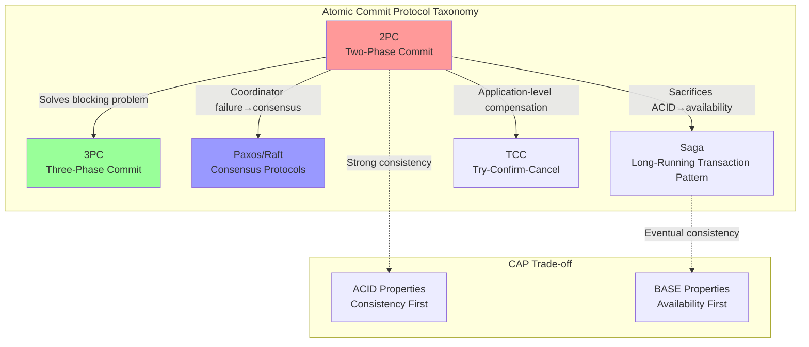
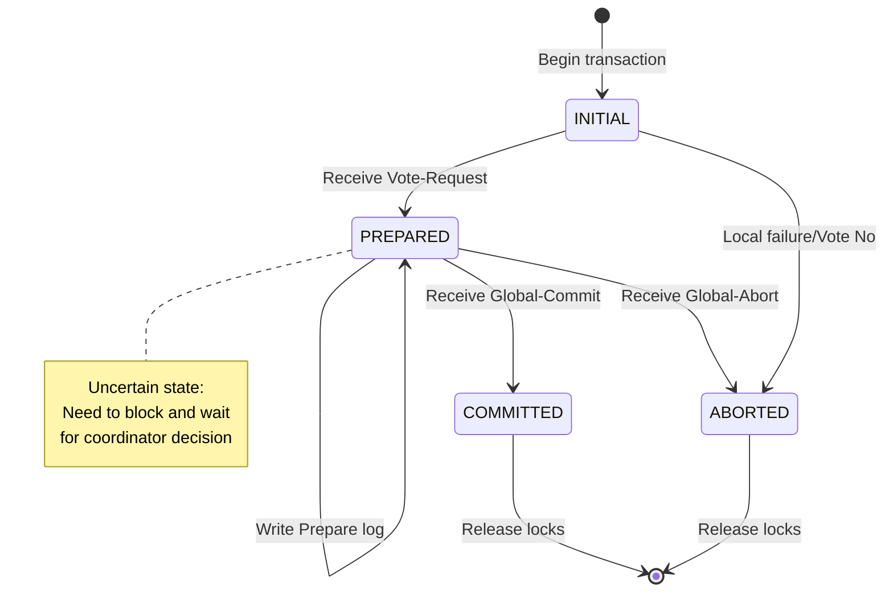
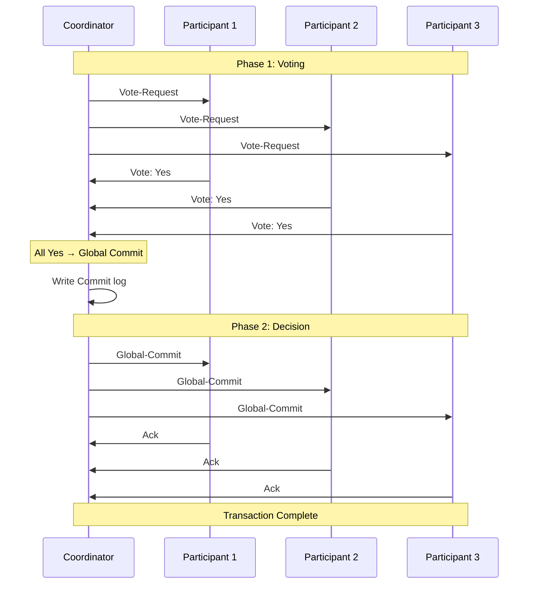
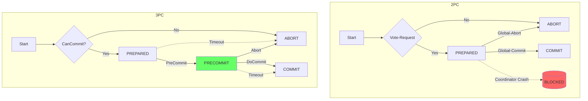

# Two-Phase Commit (2PC)

> **Stage**: Struct/Appendices/Wikipedia-Concepts | **Prerequisites**: [Consensus Protocols](./15-consensus-protocols.md), [Paxos](./18-paxos.md) | **Formality Level**: L4

---

## 1. Definitions

### 1.1 Wikipedia Standard Definition

**Two-Phase Commit (2PC)** is a protocol used to achieve atomic transaction commitment in distributed systems. It ensures that all participants either all commit a transaction or all abort it, thereby maintaining the **atomicity** of distributed transactions.

**Def-S-98-01 (2PC Protocol)**: Let a distributed transaction involve a Coordinator $C$ and a set of participants $\{P_1, P_2, \ldots, P_n\}$. The Two-Phase Commit protocol is an atomic commitment protocol consisting of the following two phases:

- **Phase 1 (Voting Phase)**: Coordinator asks all participants if they can commit the transaction
- **Phase 2 (Decision Phase)**: Coordinator makes a global decision based on participants' responses

**Def-S-98-02 (Coordinator)**: The node responsible for initiating transaction commit, collecting participant votes, making global decisions, and propagating them to all participants.

**Def-S-98-03 (Participant)**: A node that executes transaction operations and votes at commit time. Each participant maintains a **local log** to support failure recovery.

**Def-S-98-04 (Transaction Result States)**:

- **Global Commit**: All participants successfully commit the transaction
- **Global Abort**: At least one participant votes to abort, or coordinator decides to abort

---

## 2. Properties

### 2.1 Basic Properties of 2PC

**Lemma-S-98-01 (Consistency Guarantee)**: If the 2PC protocol completes normally, all participants reach the same decision.

*Proof Sketch*: The coordinator acts as a single decision point, collects all participants' votes, makes a unified decision, and broadcasts this decision to all participants. ∎

**Lemma-S-98-02 (Recoverability)**: Participants can recover to the correct state through local logs after a crash.

*Proof Sketch*: Participants write "Prepare" logs before sending votes, and "Commit" logs before committing. After a crash, they can determine whether they need to communicate with the coordinator to obtain the final decision based on log state. ∎

**Lemma-S-98-03 (Coordinator Single-Point Bottleneck)**: The coordinator is a performance bottleneck and single point of failure in 2PC.

*Argument*: All messages must pass through the coordinator, whose processing capacity and network bandwidth limit overall throughput. ∎

---

## 3. Relations

### 3.1 Relationships with Other Protocols



**Relationship with Paxos**:

- 2PC assumes a reliable coordinator; Paxos solves the coordinator election problem
- 2PC blocks when coordinator fails; Paxos guarantees availability through majorities
- Can be combined: Use Paxos for leader election to replace the coordinator in 2PC

**Relationship with 3PC**:

- 3PC is an extension of 2PC, adding a "pre-commit" phase to solve the blocking problem
- 3PC may still be inconsistent during network partitions, but avoids indefinite blocking

---

## 4. Argumentation

### 4.1 Detailed Voting Phase Flow

```
Coordinator C                    Participant P_i
    |                            |
    |---- Vote-Request ---------->|  (Phase 1a)
    |         (Can you commit?)  |
    |                            |  Execute local transaction
    |                            |  Write Prepare log
    |<--- Yes/No ----------------|  (Phase 1b)
    |         (Vote)             |
```

**Phase 1a - Vote-Request**: Coordinator sends vote requests to all participants, asking if they can commit the transaction.

**Phase 1b - Voting**: Participants:

1. Execute local operations of the transaction (without actually committing)
2. Write "Prepare" record in local log
3. Send "Yes" (can commit) or "No" (cannot commit) to coordinator

**Key Decision Point**: After voting "Yes", participants must be able to commit the transaction (already hold all locks, resources reserved).

### 4.2 Detailed Decision Phase Flow

```
Coordinator C                    Participant P_i
    |                            |
    | Collect all votes          |
    | If all Yes → Global Commit |
    | If any No  → Global Abort  |
    |                            |
    |---- Global-Commit -------->|  (Phase 2a)
    |    or Global-Abort         |
    |                            |  Execute commit or rollback
    |                            |  Write Commit/Abort log
    |<--- Ack -------------------|  (Phase 2b)
    |                            |  Release locks
```

**Phase 2a - Global Decision**:

- Coordinator makes global decision after receiving all votes
- If all participants vote "Yes", decides "Global-Commit"
- If any participant votes "No" or times out, decides "Global-Abort"
- Coordinator writes decision to local log, then broadcasts to all participants

**Phase 2b - Execution**:

- Participants execute corresponding operations upon receiving global decision
- Write "Commit" or "Abort" log records
- Send acknowledgment (Ack) to coordinator
- Release all locks held by the transaction

### 4.3 Participant State Machine



**State Descriptions**:

- **INITIAL**: Transaction begins, execute local operations
- **PREPARED**: Voted "Yes", waiting for coordinator decision
- **COMMITTED**: Transaction committed
- **ABORTED**: Transaction aborted

---

## 5. Formal Proof

### 5.1 2PC Atomicity Theorem

**Thm-S-98-01 (2PC Atomicity Theorem)**: For any distributed transaction using 2PC, either all participants commit the transaction, or all participants abort it; there is no partial commit.

**Formal Expression**: Let the set of participants be $\mathcal{P} = \{P_1, \ldots, P_n\}$, define decision variable $d_i \in \{Commit, Abort\}$ as the final state of participant $P_i$. Then:

$$\forall i, j \in \{1, \ldots, n\}: d_i = d_j$$

**Proof**:

1. **Coordinator as Decision Authority**: According to Def-S-98-01, coordinator $C$ is the only node making global decisions.

2. **Decision Propagation**: Coordinator broadcasts the same decision to all participants in Phase 2a (according to Phase 2 protocol definition).

3. **Participant Behavior**: Each participant executes operations in Phase 2b based on the received decision, and the protocol specifies participants can only change state based on the coordinator's decision.

4. **Proof by Contradiction**: Assume there exist $P_i$ that commits and $P_j$ that aborts.
   - Case 1: $P_i$ receives "Global-Commit", $P_j$ receives "Global-Abort"
   - This contradicts the coordinator making only one global decision (coordinator does not send conflicting decisions for the same transaction)
   - Case 2: $P_j$ aborts due to timeout
   - This requires $P_j$ did not vote "Yes" or aborted before PREPARED state
   - If $P_j$ did not vote "Yes", coordinator must decide "Global-Abort", $P_i$ should also receive "Global-Abort"

5. **Conclusion**: Contradiction, assumption is false, hence all participants make the same decision. ∎

### 5.2 Blocking Inevitability Theorem

**Thm-S-98-02 (2PC Blocking Theorem)**: In the 2PC protocol, when the coordinator crashes during Phase 2 and cannot recover, participants who have voted "Yes" will block indefinitely.

**Formal Expression**: Let coordinator $C$ crash after sending some "Global-Commit" messages. For participant $P_i$ who voted "Yes" but has not received the decision:

$$\square\, (State(P_i) = PREPARED \land \diamondsuit\, \neg Recovered(C) \Rightarrow \square\, Blocked(P_i))$$

Where $\square$ means "always", $\diamondsuit$ means "eventually".

**Proof**:

1. **Participant State Analysis**: Participant $P_i$ who voted "Yes" is in PREPARED state, holding resource locks, waiting for coordinator decision.

2. **Decision Dependency**: According to 2PC protocol, participants cannot unilaterally decide to commit or abort; must depend on the coordinator's global decision.

3. **Insufficient Information**: After coordinator crash, $P_i$ cannot determine:
   - Voting status of other participants
   - Global decision already made by coordinator
   - Whether other participants have committed or aborted

4. **Safety Requirement**: If $P_i$ unilaterally decides to commit:
   - Coordinator may have actually decided "Global-Abort"
   - Violates atomicity (Thm-S-98-01)

   If $P_i$ unilaterally decides to abort:
   - Coordinator may have decided "Global-Commit" and some participants have already committed
   - Also violates atomicity

5. **Conclusion**: $P_i$ must block waiting for coordinator recovery to obtain the final decision. If coordinator cannot recover, blocking continues indefinitely. ∎

### 5.3 3PC Non-blocking Proof

**Def-S-98-05 (Three-Phase Commit 3PC)**: 3PC adds a "Pre-Commit" phase between the two phases of 2PC:

- **Phase 1**: Can-Commit? (CanCommit/No)
- **Phase 2**: Pre-Commit (participants pre-commit, enter PRECOMMIT state)
- **Phase 3**: Do-Commit/Abort (actual commit)

**Thm-S-98-03 (3PC Non-blocking Theorem)**: In the 3PC protocol, assuming the network does not partition simultaneously, there is no indefinite blocking for participants who have voted.

**Proof Sketch**:

1. **Timeout Mechanism**: 3PC introduces participant timeouts, allowing independent decisions after timeout.

2. **State Derivability**:
   - If participant is in PRECOMMIT state (received Pre-Commit):
     - Indicates coordinator has received all Yes votes
     - Coordinator must have decided to commit
     - Participant can safely commit after timeout

   - If participant is in PREPARED state (has not received Pre-Commit):
     - Indicates coordinator may not have received all Yes votes
     - Participant can safely abort (coordinator cannot have decided to commit)

3. **Network Assumption**: Under synchronous network assumption (bounded message delay), participants can infer system state through timeouts.

4. **Difference from 2PC**:
   - 2PC PREPARED state participants cannot infer global state
   - 3PC PRECOMMIT state participants can infer coordinator has decided to commit

5. **Conclusion**: Participants can make independent decisions after timeout, avoiding indefinite blocking. ∎

**Limitation Note**: 3PC's non-blocking property depends on **synchronous network assumption** (bounded message delay). In asynchronous networks, cannot distinguish between "coordinator has crashed" and "message delay", 3PC may degrade to blocking state.

---

## 6. Examples

### 6.1 Bank Transfer Example

```
Scenario: Account A (Bank 1) transfers $100 to Account B (Bank 2)

Coordinator: Transfer Service
Participants: Bank 1 Node (P1), Bank 2 Node (P2)

Phase 1 - Voting Phase:
  Coordinator → P1: Vote-Request {deduct $100 from A}
  Coordinator → P2: Vote-Request {add $100 to B}

  P1: Check A balance ≥ $100, reserve funds, write Prepare log
  P1 → Coordinator: Yes

  P2: Check B account valid, reserve quota, write Prepare log
  P2 → Coordinator: Yes

Phase 2 - Decision Phase:
  Coordinator: Received all Yes, decides Global-Commit
  Coordinator writes Commit log

  Coordinator → P1: Global-Commit
  Coordinator → P2: Global-Commit

  P1: Execute deduction, write Commit log, release locks
  P1 → Coordinator: Ack

  P2: Execute deposit, write Commit log, release locks
  P2 → Coordinator: Ack

Result: Transaction completes atomically, A deducted $100, B deposited $100
```

### 6.2 Coordinator Failure Scenario

```
Failure Scenario: Coordinator crashes after sending Global-Commit

Timeline:
  T1: Coordinator sends Global-Commit to P1
  T2: Coordinator crashes (decision not sent to P2)
  T3: P1 commits transaction
  T4: P2 blocks in PREPARED state

Recovery Process:
  1. New coordinator (or recovered original coordinator) queries participant states
  2. Discovers P1 has committed → infers global decision was Commit
  3. Commands P2 to commit transaction
  4. System recovers consistency

Key: Must recover global decision through logs or participant states
```

### 6.3 3PC Execution Example

```
3PC Execution Flow (Transfer Scenario):

Phase 1 - CanCommit:
  Coordinator → All Participants: CanCommit?
  Participants → Coordinator: Yes/No

Phase 2 - PreCommit (New):
  If all Yes:
    Coordinator writes PreCommit log
    Coordinator → All Participants: PreCommit

    Participants receive PreCommit:
      Write PreCommit log (enter PRECOMMIT state)
      Send ACK to Coordinator

    Coordinator receives all ACKs, enters Phase 3

  If any No:
    Jump directly to Abort

Phase 3 - DoCommit:
  Coordinator writes Commit log
  Coordinator → All Participants: DoCommit

  Participants commit transaction, write Commit log

Timeout Handling (Key Improvement):
  - PRECOMMIT state timeout → Can safely commit
  - PREPARED state timeout → Can safely abort
```

---

## 7. Visualizations

### 7.1 2PC Complete Sequence Diagram



### 7.2 2PC vs 3PC Comparison



### 7.3 Protocol Feature Radar Chart (Text Representation)

```
Feature Comparison Radar Chart (Max 5 points):

                Consistency
                  5
                  |
    Fault Tolerance ------+------ Availability
    2PC: 2       |       2PC: 2
    3PC: 3       |       3PC: 3
    Paxos: 4     |       Paxos: 4
                 |
    Performance -------+------- Complexity
    2PC: 4       |       2PC: 3
    3PC: 3       |       3PC: 4
    Paxos: 2     |       Paxos: 5
                 |
               Scalability
```

---

## 8. Eight-Dimensional Characterization

### 8.1 Formal Dimension Analysis

| Dimension | 2PC Feature | 3PC Improvement | Description |
|-----------|-------------|-----------------|-------------|
| **1. Temporal** | Two-phase synchronous | Three-phase synchronous | 3PC adds pre-commit phase |
| **2. Causal** | Coordinator decision causality | Timeout event causality | 3PC introduces timeout causality |
| **3. Modal** | □(Atomicity) | ◇(Non-blocking) | 2PC guarantees necessity, 3PC guarantees possibility |
| **4. Proof** | Constructive proof | Timeout mechanism | Avoids blocking through timing constraints |
| **5. State** | 4-state machine | 5-state machine | 3PC adds PRECOMMIT state |
| **6. Calculus** | Synchronous messages | Messages with timeout | Extends CSP operators |
| **7. Logic** | Classical logic | Temporal logic | 3PC requires temporal reasoning |
| **8. Type** | Binary decision type | Ternary decision type | Commit/Abort/Timeout |

### 8.2 Detailed Characterization by Dimension

**Dimension 1 - Temporal**:

```
2PC Temporal Structure:
  Vote-Request → Vote-Response → Global-Decision → Ack

3PC Temporal Structure:
  CanCommit → Yes/No → PreCommit → Ack → DoCommit → Ack
```

**Dimension 2 - Causal**:

- In 2PC, participant commit behavior causally depends on coordinator's Global-Commit message
- In 3PC, PRECOMMIT state participant commit can causally depend on timeout event

**Dimension 3 - Modal**:

- 2PC modal formula: $\square(Committed \lor Aborted) \land \neg\diamond(Committed \land Aborted)$
- 3PC modal formula: $\diamond\neg Blocked$ (eventually non-blocking)

**Dimension 4 - Proof**:

- 2PC atomicity proof: Through coordinator single decision point
- 3PC non-blocking proof: Through state derivability and timeout mechanism

**Dimension 5 - State**:

| Protocol | Number of States | Key States |
|----------|-----------------|------------|
| 2PC | 4 | INITIAL, PREPARED, COMMITTED, ABORTED |
| 3PC | 5 | Adds PRECOMMIT state |

**Dimension 6 - Calculus**:

```
2PC Formalization (CSP style):
  Coordinator = vote_request → (yes → commit | no → abort)
  Participant = vote_request → (if can_commit then yes → (commit → SKIP | abort → SKIP))

3PC Formalization (with timeout):
  Participant = can_commit? → (if ok then yes → (precommit → (docommit → SKIP ▷ timeout → SKIP)))
```

**Dimension 7 - Logic**:

- 2PC: Classical propositional logic + modal operators
- 3PC: Linear Temporal Logic (LTL) or Computation Tree Logic (CTL)

**Dimension 8 - Type**:

```haskell
-- 2PC decision type
data Decision2PC = Commit | Abort

-- 3PC decision type (adds timeout)
data Decision3PC = Commit | Abort | TimeoutCommit
```

---

## 9. Practical Applications

### 9.1 Applications in Distributed Databases

| Database System | 2PC Implementation | Optimization Strategies |
|-----------------|-------------------|------------------------|
| **MySQL XA** | Standard 2PC | Supports one-phase optimization (single resource) |
| **PostgreSQL** | Standard 2PC | PREPARE TRANSACTION optimization |
| **Oracle RAC** | Distributed 2PC | Cluster-internal optimized communication |
| **MongoDB** | 2PC-like | Two-phase commit protocol |
| **TiDB** | Percolator | Optimistic locking + 2PC variant |
| **Google Spanner** | 2PC + Paxos | Paxos groups as participants |

### 9.2 Transaction Processing Middleware

```java
// [伪代码片段 - 不可直接运行] 仅展示核心逻辑
// JTA (Java Transaction API) 2PC Example
UserTransaction ut = getUserTransaction();
try {
    ut.begin();

    // Operate on data source 1
    connection1.prepareStatement("UPDATE...").execute();

    // Operate on data source 2
    connection2.prepareStatement("INSERT...").execute();

    ut.commit(); // Internally uses 2PC
} catch (Exception e) {
    ut.rollback();
}
```

### 9.3 Microservices Saga Pattern Comparison

```
2PC vs Saga Selection in Microservices:

2PC Applicable Scenarios:
├── Strong consistency requirements (financial core transactions)
├── Few participants (<10)
├── Short transaction execution time (second-level)
└── Low network partition tolerance

Saga Applicable Scenarios:
├── Eventual consistency acceptable
├── Many participants
├── Long-running transactions (minutes/hours)
└── High availability priority
```

---

## 10. References

### 10.1 Original Papers


### 10.2 Consensus and Atomic Commit


### 10.3 Modern Implementations and Applications


### 10.4 Online Resources


---

*Document Version: v1.0 | Created: 2026-04-10 | Author: AnalysisDataFlow Project*
