# Paxos Consensus Algorithm

> Stage: Struct/Formal Methods | Prerequisites: [Consensus](13-consensus.md), [Linearizability](15-linearizability.md) | Formality Level: L5
>
> **Related Concepts**: [Consensus Overview](./13-consensus.md) - General introduction to the consensus problem

## 1. Definitions

### Def-S-98-01: Paxos Algorithm (Wikipedia Standard Definition)

**Paxos** is a distributed consensus algorithm proposed by Leslie Lamport in 1989 and published in 1998 [^1]. It solves the non-Byzantine version of the **Byzantine Generals Problem** — how to get multiple nodes in a distributed system to agree on a value under the **crash-fault** model.

> **Wikipedia Definition**: "Paxos is a family of protocols for solving consensus in a network of unreliable processors (that is, processors that may fail)." [^2]

**Core Problem Statement**: Given a set of processes that may fail, design a protocol such that:

- All **non-failed** processes eventually agree on the same value
- The agreed value must **be proposed by some process**

### Def-S-98-02: Proposal

A proposal is the basic unit of operation in the Paxos protocol, defined as an ordered pair:

$$
\text{Proposal} \triangleq \langle n, v \rangle
$$

Where:

- $n \in \mathbb{N}$: **Proposal Number**, globally unique and monotonically increasing
- $v \in \mathcal{V}$: **Proposal Value**, from value domain $\mathcal{V}$

**Total Order of Proposal Numbers**: For any two proposals $\langle n_1, v_1 \rangle$ and $\langle n_2, v_2 \rangle$:

$$
\langle n_1, v_1 \rangle < \langle n_2, v_2 \rangle \iff n_1 < n_2
$$

### Def-S-98-03: Role Definitions

Paxos defines three roles, and a process can hold multiple roles simultaneously:

| Role | Responsibility | State Maintenance |
|------|---------------|-------------------|
| **Proposer** | Proposes proposals, drives consensus | Current proposal number, collected Promise responses |
| **Acceptor** | Votes on proposals, stores accepted values | Promised max proposal number $minProposal$, accepted max proposal $acceptedProposal$ |
| **Learner** | Learns the chosen value | Learned value, confirmation status |

**Formal Role States**:

```
ProposerState ::= { proposalNum: ℕ,
                    promises: Set⟨Promise⟩,
                    phase: {IDLE, PREPARING, ACCEPTING, CHOSEN} }

AcceptorState ::= { minProposal: ℕ ∪ {⊥},
                    acceptedProposal: Proposal ∪ {⊥},
                    maxAcceptedNum: ℕ ∪ {⊥} }

LearnerState ::= { chosenValue: 𝒱 ∪ {⊥},
                   acceptorsHeardFrom: Set⟨AcceptorID⟩ }
```

### Def-S-98-04: Quorum

**Def-S-98-04a: Quorum Definition**

For a set of $N$ Acceptors $\mathcal{A} = \{A_1, A_2, ..., A_N\}$, Quorum $Q$ is a subset of $\mathcal{A}$ satisfying:

$$
Q \subseteq \mathcal{A} \land |Q| > \frac{N}{2}
$$

**Def-S-98-04b: Quorum Intersection Property**

For any two Quorums $Q_1, Q_2$:

$$
Q_1 \cap Q_2 \neq \emptyset
$$

This is the core mathematical foundation of Paxos safety.

### Def-S-98-05: Value Chosen

A value $v$ is **chosen** if and only if:

$$
\exists Q \in \text{Quorum}: \forall A \in Q: \text{accepted}(A, \langle n, v \rangle)
$$

That is, a Quorum of Acceptors have all accepted a proposal containing value $v$.

## 2. Properties

### Lemma-S-98-01: Uniqueness of Proposal Numbers

**Proposition**: During Paxos protocol execution, proposal numbers generated by different Proposers are globally unique.

**Proof Sketch**:
Assume there are $M$ Proposers, the $i$-th Proposer uses the number sequence:

$$
\text{proposalNum}_i = i, i + M, i + 2M, i + 3M, ...
$$

Then for any $i \neq j$, $i + kM \neq j + lM$ for all $k, l \in \mathbb{N}$.

∎

### Lemma-S-98-02: Promise Monotonicity

**Proposition**: Once Acceptor $A$ sends a Promise for proposal number $n$, $A$ will not accept any proposal with number $n' < n$.

**Proof**:
By Promise definition, when sending Promise, Acceptor updates:

$$
minProposal(A) := \max(minProposal(A), n)
$$

Accept phase precondition:

$$
\text{accept}(A, \langle n', v \rangle) \text{ requires } n' \geq minProposal(A)
$$

Therefore when $n' < n \leq minProposal(A)$, acceptance is rejected. ∎

### Prop-S-98-01: Value Validity

**Proposition**: Any chosen value $v$ must have been proposed by some Proposer.

**Proof**:
By Chosen definition, requires Quorum of Acceptors to accept the proposal. Acceptors only accept when receiving Accept requests, which are sent by Proposers and must contain the Proposer's chosen value. ∎

### Prop-S-98-02: Non-empty Quorum Intersection

**Proposition**: For $N$ Acceptors, any two Quorums of size $\lceil (N+1)/2 \rceil$ must have a non-empty intersection.

**Proof**:
Let $|Q_1| = |Q_2| = \lceil (N+1)/2 \rceil$, by pigeonhole principle:

$$
|Q_1| + |Q_2| = 2 \cdot \lceil (N+1)/2 \rceil > N = |\mathcal{A}|
$$

Therefore $Q_1 \cap Q_2 \neq \emptyset$. ∎

## 3. Relations

### Paxos and the Consensus Problem

Paxos solves **crash-fault consensus**, and its relationship with the classic consensus problem:

| Dimension | FLP Impossibility | Paxos Solution |
|-----------|------------------|----------------|
| Failure Model | Asynchronous system single failure | Crash fault tolerance |
| Liveness Guarantee | No deterministic algorithm | Partial synchrony assumption |
| Safety | Can guarantee | Fully guaranteed |

### Paxos and 2PC (Two-Phase Commit)

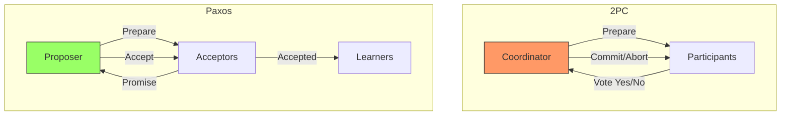

**Key Differences**:

- 2PC: Coordinator single point, blocking protocol
- Paxos: Multiple Proposers, non-blocking, fault-tolerant

### Paxos and Raft

| Feature | Paxos | Raft |
|---------|-------|------|
| Leader | Implicit (Multi-Paxos optimization) | Explicit, strong leader |
| Understandability | Widely recognized as complex | Designed for understandability |
| Log replication | Each independent Paxos instance | Continuous log entries |
| Membership change | Requires additional protocol | Joint Consensus |

### Paxos and PBFT

```
Paxos: f failures → requires 2f+1 nodes (crash fault tolerance)
PBFT: f failures → requires 3f+1 nodes (Byzantine fault tolerance)
```

Paxos is a simplified version of PBFT for crash fault tolerance scenarios.

## 4. Argumentation

### 4.1 Necessity of Two-Phase Design

**Why is the Prepare phase needed?**

Assume only Accept phase:

1. Proposer P1 sends Accept(n=1, v=X) to Acceptor A1
2. P2 sends Accept(n=2, v=Y) to A2
3. Both obtain "majorities" (but different Acceptor sets)
4. **Conflict**: Different Learners may learn different values

**Role of Prepare phase**: Through the Promise mechanism, ensures monotonicity of proposal numbers, thereby guaranteeing only the latest proposal number can succeed.

### 4.2 Behavior Under Network Partition

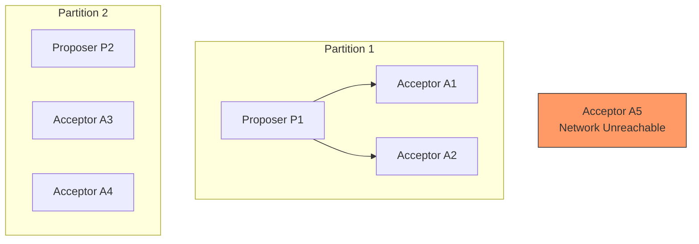

**Analysis**:

- Partition 1: 2 Acceptors, cannot form Quorum (assuming N=5, need ≥3)
- Partition 2: Similarly cannot form Quorum
- **Safety**: No conflicting values can be Chosen (because all require Quorum)
- **Liveness**: Cannot reach consensus during partition

### 4.3 Livelock Problem

**Scenario**: Multiple Proposers competing

```
t=1: P1 sends Prepare(n=1)
t=2: P2 sends Prepare(n=2)
t=3: Acceptors promise n=2, P1's Accept(n=1) rejected
      P1 increments to n=3, sends Prepare(n=3)
t=4: P3 sends Prepare(n=4)
...
```

**Solutions**:

- **Leader election**: Let a single Proposer dominate (Multi-Paxos)
- **Random backoff**: Random wait after conflict
- **Proposal number spacing**: Proposers use widely spaced proposal numbers

## 5. Formal Proofs

### 5.1 Paxos Safety Theorem (Single-Value Agreement)

**Thm-S-98-01: Paxos Safety (Agreement)**

> If value $v$ is first chosen, then any subsequently chosen value equals $v$.

**Formal Expression**:

$$
\forall v_1, v_2 \in \mathcal{V}, n_1, n_2 \in \mathbb{N}:
$$
$$
\text{chosen}(\langle n_1, v_1 \rangle) \land \text{chosen}(\langle n_2, v_2 \rangle) \land n_1 < n_2
$$
$$
\Rightarrow v_1 = v_2
$$

**Proof**:

Let $Q_1$ be the Quorum that makes $\langle n_1, v_1 \rangle$ chosen, $Q_2$ be the Quorum that makes $\langle n_2, v_2 \rangle$ chosen.

By Quorum intersection property (corollary of Lemma-S-98-02):

$$
\exists A \in \mathcal{A}: A \in Q_1 \cap Q_2
$$

**Key Observation**:

- Since $A \in Q_1$, $A$ accepted $\langle n_1, v_1 \rangle$, i.e., $\text{accepted}(A, \langle n_1, v_1 \rangle)$
- Since $A \in Q_2$, $A$ accepted $\langle n_2, v_2 \rangle$

By Lemma-S-98-02 (Promise monotonicity), Acceptor must have sent Promise for $n_2$ before accepting $\langle n_2, v_2 \rangle$.

**Case Analysis**:

**Case 1**: $A$ had already accepted $\langle n_1, v_1 \rangle$ before sending Promise.

In Promise response, $A$ returns the maximum accepted proposal:

$$
\text{Promise}(A, n_2) = \{..., \langle n_1, v_1 \rangle, ...\}
$$

Proposer must use the accepted value in Phase 2 (Paxos Made Simple rule):

$$
v_2 = v_1
$$

**Case 2**: $A$ sends Promise(n₂) first, then accepts ⟨n₁,v₁⟩.

This cannot happen, because accepting $n_1 < n_2$ requires $n_1 \geq minProposal(A) \geq n_2$, contradiction.

In summary, $v_1 = v_2$. ∎

### 5.2 Quorum Intersection Lemma

**Lemma-S-98-03: Quorum Intersection**

For a system with $N$ Acceptors, any two Quorums $Q_1, Q_2$ satisfy:

$$
|Q_1 \cap Q_2| \geq 2|Q| - N
$$

Where $|Q| = \lceil (N+1)/2 \rceil$ is the standard Quorum size.

**Proof**:

By inclusion-exclusion principle:

$$
|Q_1 \cup Q_2| = |Q_1| + |Q_2| - |Q_1 \cap Q_2| \leq N
$$

Therefore:

$$
|Q_1 \cap Q_2| \geq |Q_1| + |Q_2| - N = 2|Q| - N
$$

When $|Q| = \lceil (N+1)/2 \rceil$:

- If $N = 2k+1$ (odd): $|Q| = k+1$, intersection $\geq 2(k+1) - (2k+1) = 1$ ✓
- If $N = 2k$ (even): $|Q| = k+1$, intersection $\geq 2(k+1) - 2k = 2$ ✓

∎

### 5.3 Liveness Theorem (Partial Synchrony Model)

**Thm-S-98-02: Paxos Liveness**

Under **partial synchrony** model, assuming:

1. A Quorum of Acceptors will not fail
2. Message delay is bounded by $\Delta$
3. At most one Proposer proposes at any time

Then the Paxos algorithm will eventually choose a value.

**Proof**:

**Phase 1**: Prepare phase succeeds

Let Proposer P send Prepare(n) to all Acceptors at $t=0$.

For non-failed Acceptor $A$, receives request by $t \leq \Delta$, P receives Promise by $t \leq 2\Delta$.

Let Quorum $Q$ all be non-failed Acceptors, then by $t \leq 2\Delta$, P receives $|Q|$ Promises.

**Phase 2**: Accept phase succeeds

P immediately sends Accept(n, v) after receiving Promises, where:

$$
v = \begin{cases}
v_{max} & \text{if } \exists \langle n', v' \rangle \in \text{Promises} \\
v_{proposed} & \text{otherwise}
\end{cases}
$$

Similarly, by $t \leq 3\Delta$, all $A \in Q$ receive Accept requests.

By Lemma-S-98-02, these Acceptors have $minProposal \geq n$ after Promise, so acceptance conditions are satisfied.

**Phase 3**: Learning phase

Each $A \in Q$ sends Accepted message, Learner receives confirmation from Quorum by $t \leq 4\Delta$, determining the value has been Chosen.

Therefore, within $t \leq 4\Delta$ time, the value is chosen. ∎

### 5.4 Safety-Liveness Trade-off (FLP Result)

**Cor-S-98-01: FLP Impossibility**

In **pure asynchronous** systems, if at least one process failure is allowed, then no deterministic consensus algorithm simultaneously satisfies:

- **Termination**: All non-failed processes eventually decide
- **Agreement**: All deciding processes decide the same value
- **Validity**: The decided value is proposed by some process

**Note**: Paxos guarantees safety by **sacrificing liveness** — during network partitions or multi-Proposer competition, the protocol may not terminate, but will never violate agreement.

## 6. Examples

### 6.1 Basic Paxos Execution Example

**Scenario**: 3 Acceptors (A1, A2, A3), Quorum size=2, 1 Proposer P

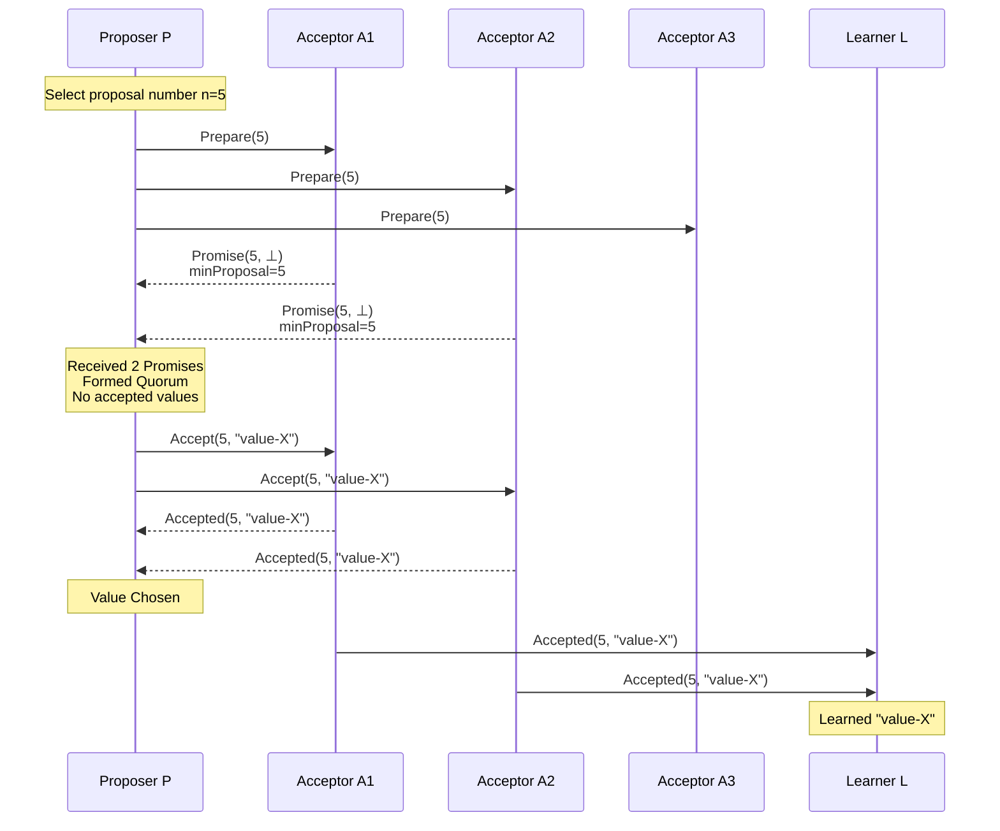

### 6.2 Conflict Resolution Example

**Scenario**: Proposer P1 (n=5) competes with P2 (n=8)

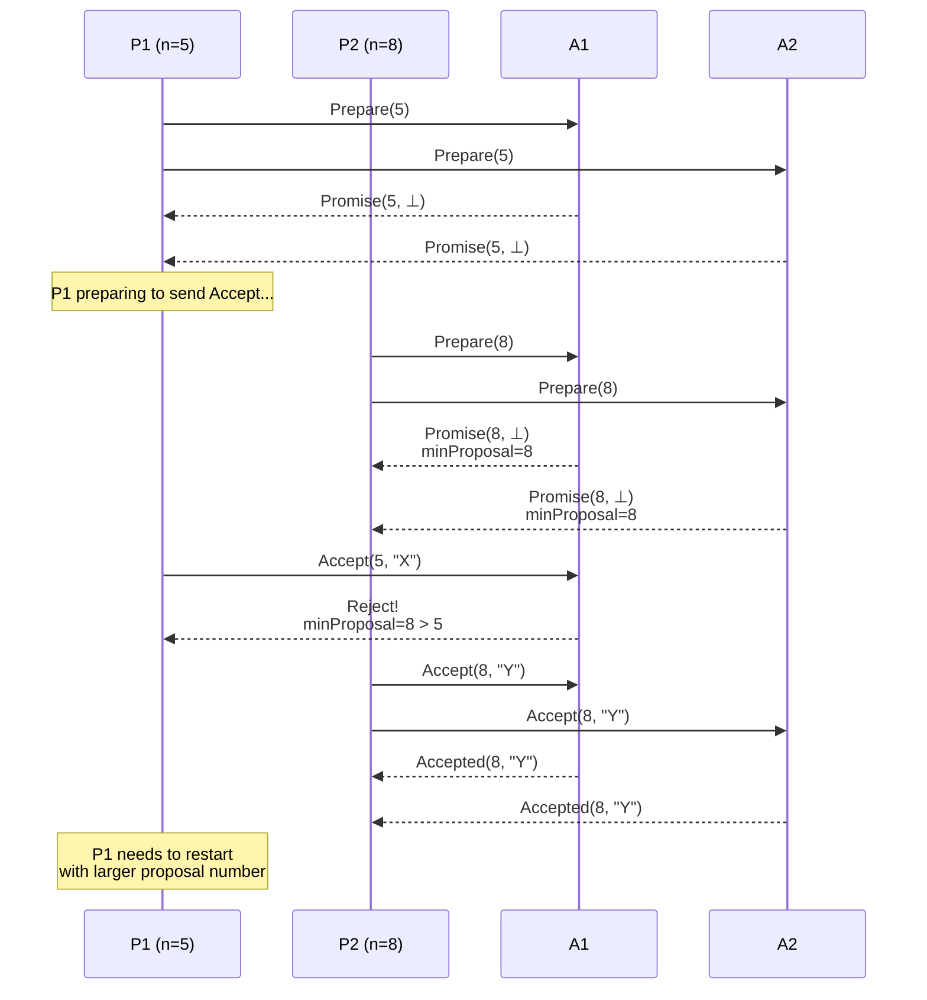

### 6.3 Value Inheritance Example

**Scenario**: P1's proposal partially succeeds in Accept phase before P2 inherits

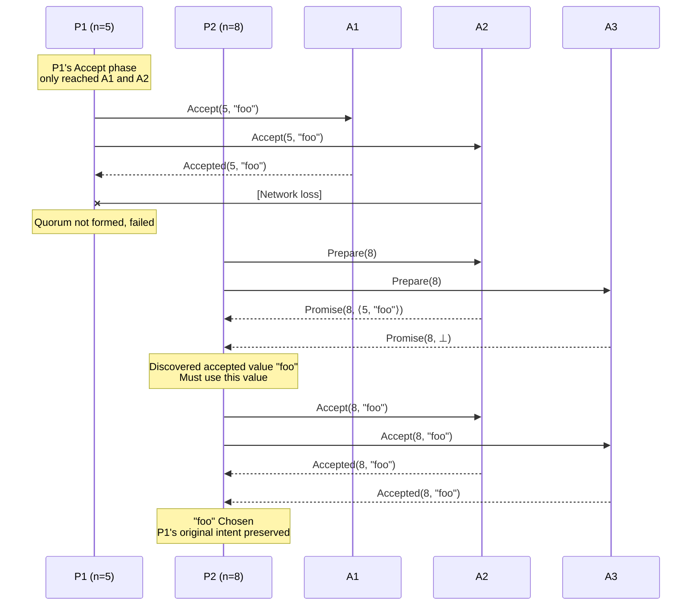

## 7. Variants and Optimizations

### 7.1 Multi-Paxos

**Problem**: Basic Paxos requires two rounds of RPC per chosen value (Prepare + Accept).

**Optimization**: Introduce **stable Leader**, skip Prepare phase during Leader's term.

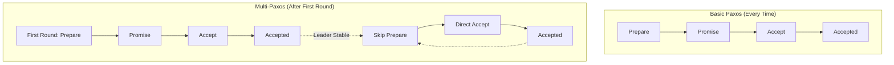

**Leader Election**: Typically uses heartbeat mechanism; if Leader fails, new Leader proposes itself as Leader through Paxos.

### 7.2 Fast Paxos

**Goal**: Reduce message latency from 3 RTT to 2 RTT in stable state.

**Mechanism**:

- **Classic Quorum**: $|Q_C| = \lceil (N+1)/2 \rceil$
- **Fast Quorum**: $|Q_F| = \lceil 3N/4 \rceil$ (larger Quorum)

**Protocol**:

1. If Leader detects no conflict, directly sends Accept (skip Prepare)
2. Client can directly send proposals to Acceptors
3. Uses larger Fast Quorum to tolerate conflicts

```
Latency Comparison:
Basic Paxos:  Client → Leader → Acceptors → Leader → Client = 3 RTT
Fast Paxos:   Client → Acceptors → Client = 2 RTT (Best case)
```

### 7.3 Flexible Paxos

**Core Idea**: Relax Quorum constraints, allow different sized Quorum combinations.

**Traditional Paxos**: Prepare Quorum = Accept Quorum = Majority

**Flexible Paxos**:

- Prepare Quorum: $Q_P$
- Accept Quorum: $Q_A$

**Constraint**:

$$
\forall q_P \in Q_P, \forall q_A \in Q_A: q_P \cap q_A \neq \emptyset
$$

**Example**: N=5

- $Q_P$: Any 2 Acceptors
- $Q_A$: Any 4 Acceptors
- Intersection: 2 + 4 - 5 = 1 (satisfies constraint)

**Application Scenarios**:

- Read-optimized systems: Reduce Prepare phase overhead
- Geographically distributed: Reduce cross-region communication

### 7.4 Variant Comparison Table

| Variant | Prepare Optimization | Latency | Application Scenario |
|---------|---------------------|---------|---------------------|
| Basic Paxos | None | 3 RTT | Education, simple scenarios |
| Multi-Paxos | Skip after Leader stable | 1 RTT (stable) | Production systems, log replication |
| Fast Paxos | Conditional skip | 2 RTT | Low latency requirements |
| Flexible Paxos | Adjustable Quorum | Variable | Heterogeneous networks, cross-region |
| EPaxos | No Leader | 1-2 RTT | Low conflict workloads |
| Vertical Paxos | Dynamic membership change | - | Frequent membership changes |

## 8. Industrial Applications

### 8.1 Chubby (Google)

**Purpose**: Distributed lock service, coarse-grained synchronization, metadata storage

**Paxos Application**:

- Uses Multi-Paxos to implement replicated state machine
- 5 replicas, typically deployed across data centers
- Log replication ensures all replicas are consistent

**Features**:

- Long connections, client caching
- Event notification mechanism
- Supports small file read/write

### 8.2 ZooKeeper (Apache)

**Protocol**: ZAB (ZooKeeper Atomic Broadcast)

**Relationship with Paxos**:

```
ZAB ≈ Multi-Paxos + Ordering Guarantee + Crash Recovery Optimization
```

**Key Differences**:

- ZAB guarantees **FIFO client order**
- Synchronization phase during primary-backup switchover
- All updates go through Leader

**Use Cases**: Configuration management, naming service, distributed coordination

### 8.3 etcd (CoreOS/Red Hat)

**Protocol**: Raft (Paxos-like)

**Design Goals**:

- Simplicity (easier to understand than Paxos)
- Safety
- Availability
- Performance

**Paxos Elements in Raft**:

| Raft Concept | Paxos Equivalent |
|--------------|------------------|
| Leader Election | Paxos Leader |
| Log Replication | Multi-Paxos instances |
| Safety | Quorum mechanism |

**Kubernetes Integration**: etcd serves as K8s metadata storage, all cluster state is stored there.

### 8.4 Other Applications

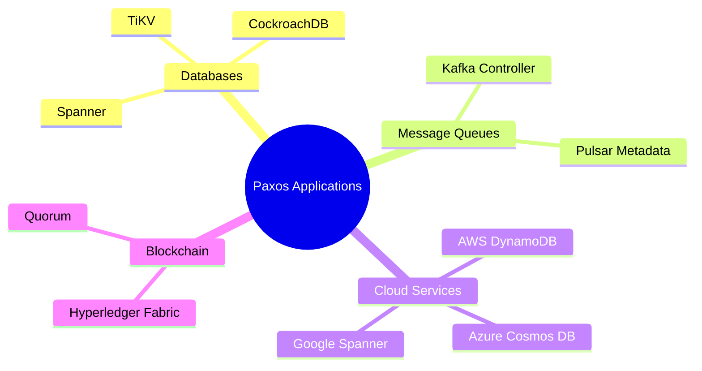

## 9. Eight-Dimensional Characterization

### 9.1 Dimension Definitions

Based on Wikipedia and academic literature [^2][^3][^4], Paxos can be systematically characterized from the following eight dimensions:

### Dim-1: Consistency Model

| Property | Description |
|----------|-------------|
| **Guarantee Level** | Linearizability |
| **Decision Semantics** | Single-value atomicity |
| **Visibility** | Once Chosen, visible to all Learners |

**Formal**: Paxos satisfies Linearizability, all operations have a consistent order on the global timeline.

### Dim-2: Fault Model

| Property | Description |
|----------|-------------|
| **Tolerance Type** | Crash-Stop / Crash-Recovery |
| **Tolerance Count** | $f$ failures require $2f+1$ nodes |
| **Byzantine Tolerance** | No (requires PBFT extension) |

**Boundary Conditions**:

- With fewer than majority failures, safety is always guaranteed
- With majority failures, liveness is lost but safety is maintained

### Dim-3: Communication Model

| Property | Description |
|----------|-------------|
| **Message Assumption** | Asynchronous + Partial Synchrony (for liveness) |
| **Message Loss** | Tolerated (can retry) |
| **Message Reordering** | Handled through proposal numbers |
| **FIFO** | Not required |

### Dim-4: Time Assumptions

| Property | Description |
|----------|-------------|
| **Safety** | No time assumptions (asynchronously safe) |
| **Liveness** | Requires partial synchrony |
| **Timeout Strategy** | Used for failure detection and leader election |

### Dim-5: Participant Roles

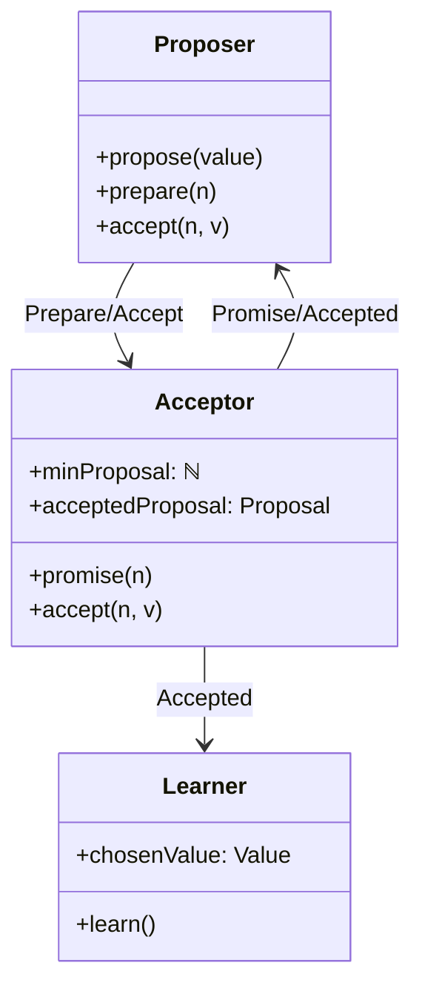

### Dim-6: Decision Mechanism

| Mechanism | Description |
|-----------|-------------|
| **Voting Method** | Two-phase commit variant |
| **Quorum Type** | Majority |
| **Decision Condition** | Quorum acceptance |
| **Conflict Resolution** | Proposal number priority |

### Dim-7: Complexity Analysis

| Metric | Basic Paxos | Multi-Paxos |
|--------|-------------|-------------|
| **Message Complexity** | $O(N)$ per value | $O(N)$ amortized |
| **Time Complexity** | $O(1)$ rounds | $O(1)$ rounds |
| **Space Complexity** | $O(1)$ per Acceptor | $O(\log N)$ log entries |
| **Leader Overhead** | None | Leader bottleneck |

### Dim-8: Engineering Considerations

| Aspect | Challenge | Solution |
|--------|-----------|----------|
| **Membership Change** | Dynamic add/remove nodes | Vertical Paxos / Joint Consensus |
| **Snapshot** | Infinite log growth | Periodic snapshots + log truncation |
| **Flow Control** | Network congestion | Backpressure / batch processing |
| **Monitoring** | State visibility | Expose internal state metrics |

### 9.2 Eight-Dimensional Summary Table

```
┌─────────────────────────────────────────────────────────────────┐
│                    Paxos Eight-Dimensional Overview              │
├──────────────┬──────────────────────────────────────────────────┤
│ Dim 1: Consistency │ Linearizability, Single-value atomicity      │
├──────────────┼──────────────────────────────────────────────────┤
│ Dim 2: Fault    │ Crash-fault tolerant, f failures→2f+1 nodes     │
├──────────────┼──────────────────────────────────────────────────┤
│ Dim 3: Communication │ Asynchronous messages, tolerate loss/reorder/delay │
├──────────────┼──────────────────────────────────────────────────┤
│ Dim 4: Time    │ Safety requires no time assumption, liveness requires partial synchrony │
├──────────────┼──────────────────────────────────────────────────┤
│ Dim 5: Roles   │ Proposer + Acceptor + Learner                    │
├──────────────┼──────────────────────────────────────────────────┤
│ Dim 6: Decision │ Two-phase + Majority Quorum                     │
├──────────────┼──────────────────────────────────────────────────┤
│ Dim 7: Complexity │ O(N) messages, O(1) time, O(1) space          │
├──────────────┼──────────────────────────────────────────────────┤
│ Dim 8: Engineering │ Snapshots/Membership change/Flow control/Monitoring │
└──────────────┴──────────────────────────────────────────────────┘
```

## 10. Visualizations

### 10.1 Paxos State Machine Diagram

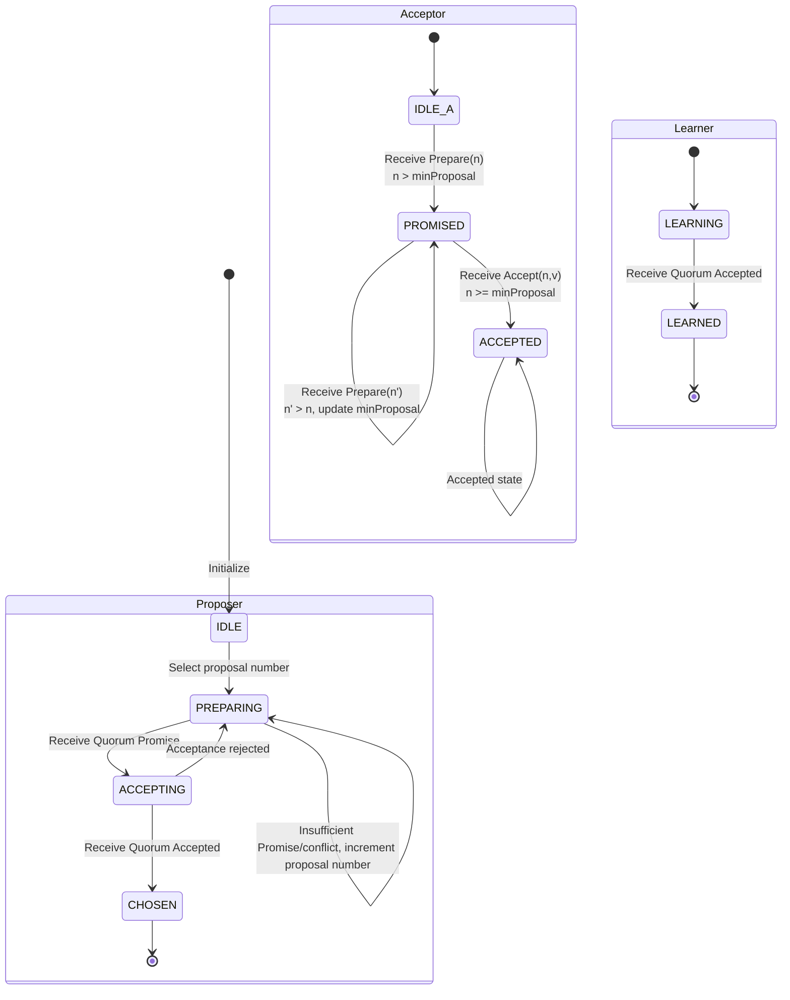

### 10.2 Quorum Intersection Principle Diagram

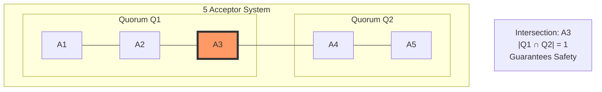

### 10.3 Paxos vs Other Consensus Algorithms Comparison Matrix

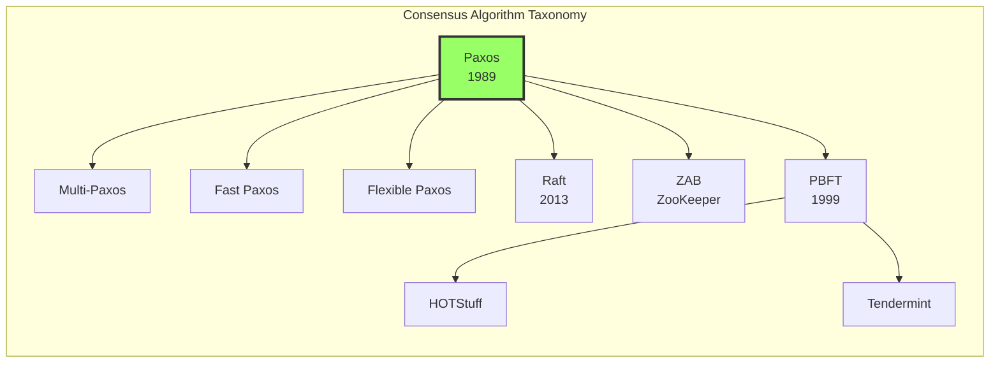

### 10.4 Production System Paxos Deployment Architecture

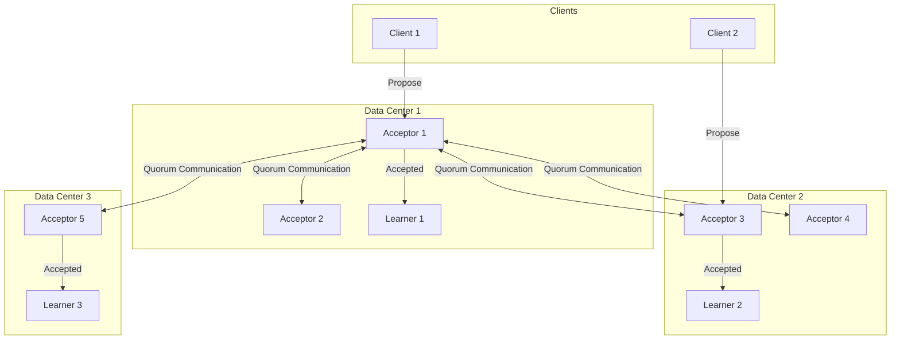

## 11. References

[^1]: L. Lamport, "The Part-Time Parliament," ACM Transactions on Computer Systems, 16(2), pp. 133-169, 1998. (Paxos original paper, describing algorithm through metaphor of Paxos island parliament)

[^2]: L. Lamport, "Paxos Made Simple," ACM SIGACT News, 32(4), pp. 51-58, 2001. (Simplified Paxos description, easier to understand)

[^3]: Wikipedia contributors, "Paxos (computer science)," Wikipedia, The Free Encyclopedia. <https://en.wikipedia.org/wiki/Paxos_(computer_science)>

[^4]: T. D. Chandra, R. Griesemer, and J. Redstone, "Paxos Made Live - An Engineering Perspective," PODC 2007. (Engineering experience from Google Chubby team)


---

*Document Version: v1.0* | *Created: 2026-04-10* | *Formality Level: L5* | *Theorem References: Thm-S-98-01, Thm-S-98-02, Lemma-S-98-01~03*
