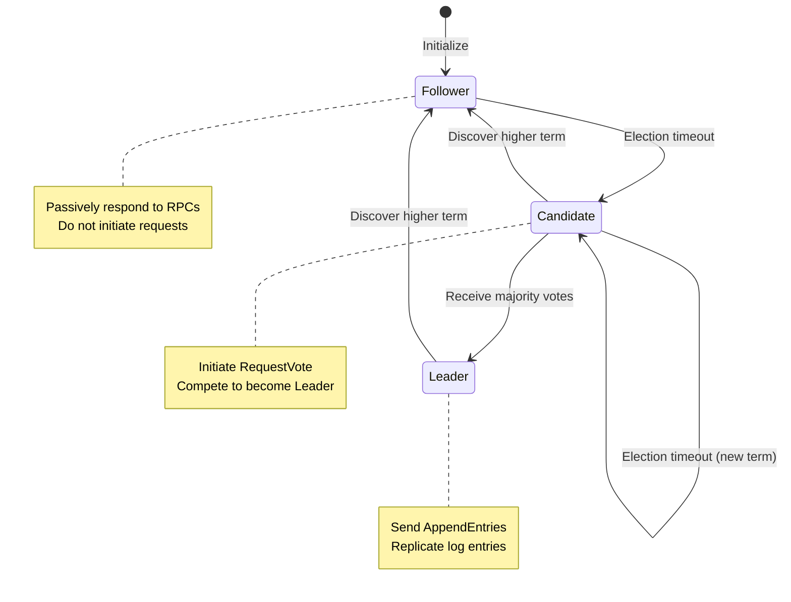
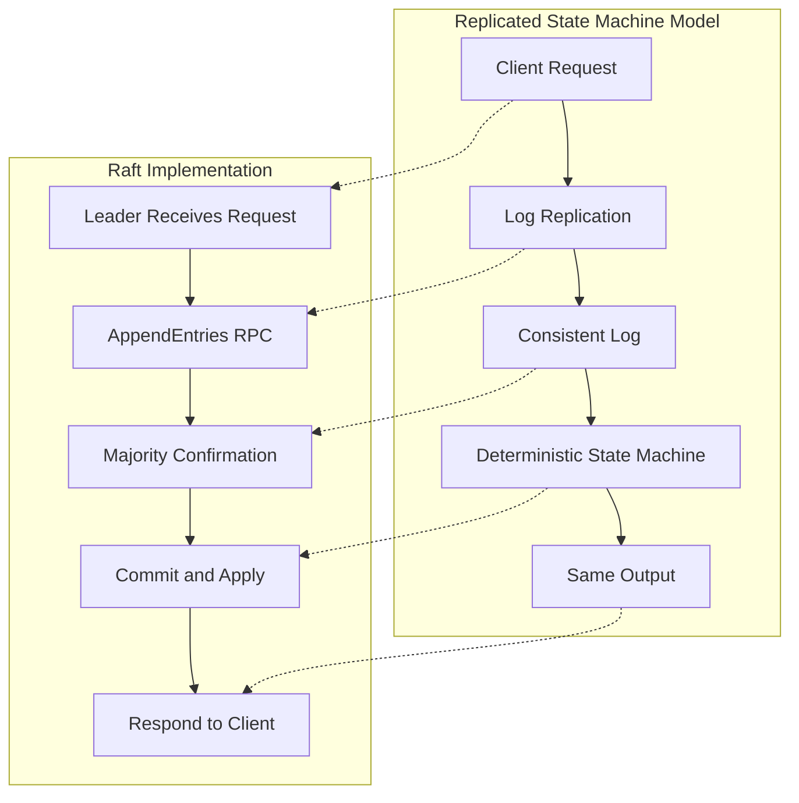
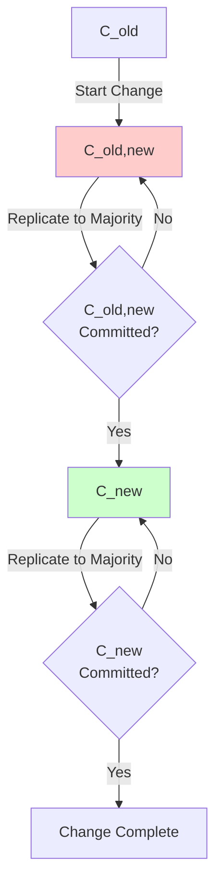
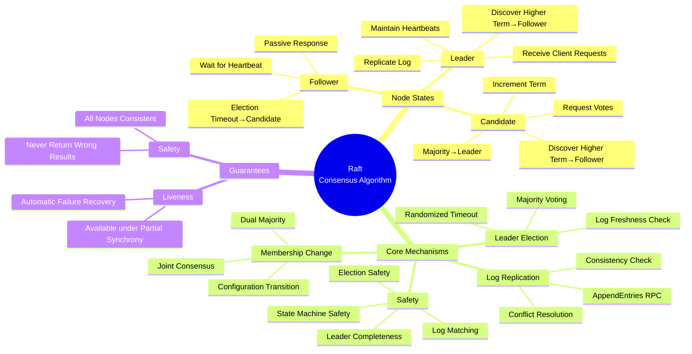
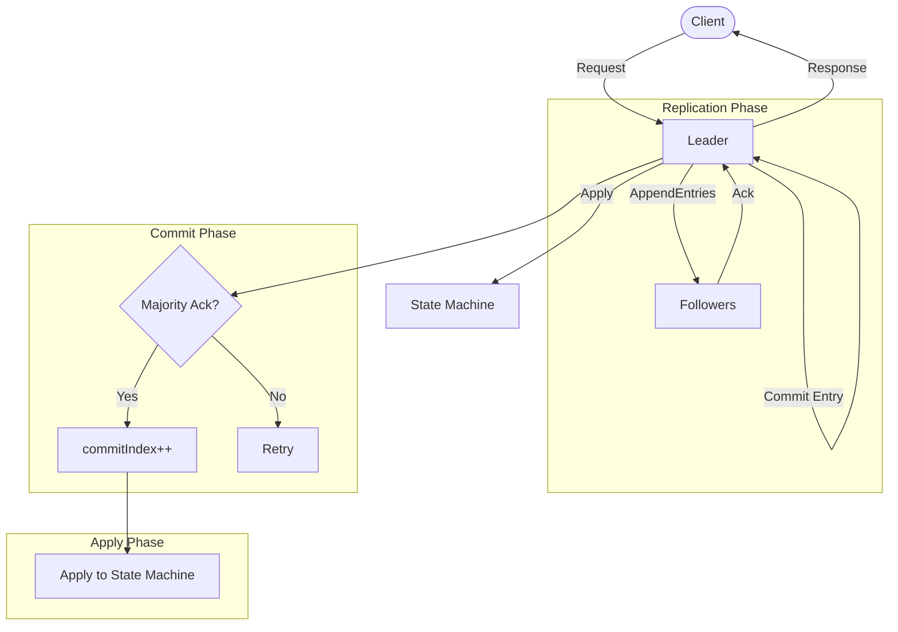
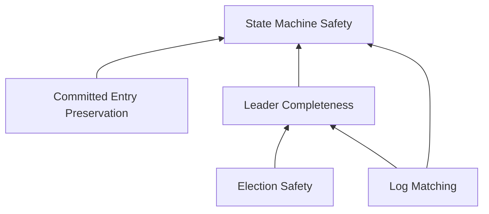
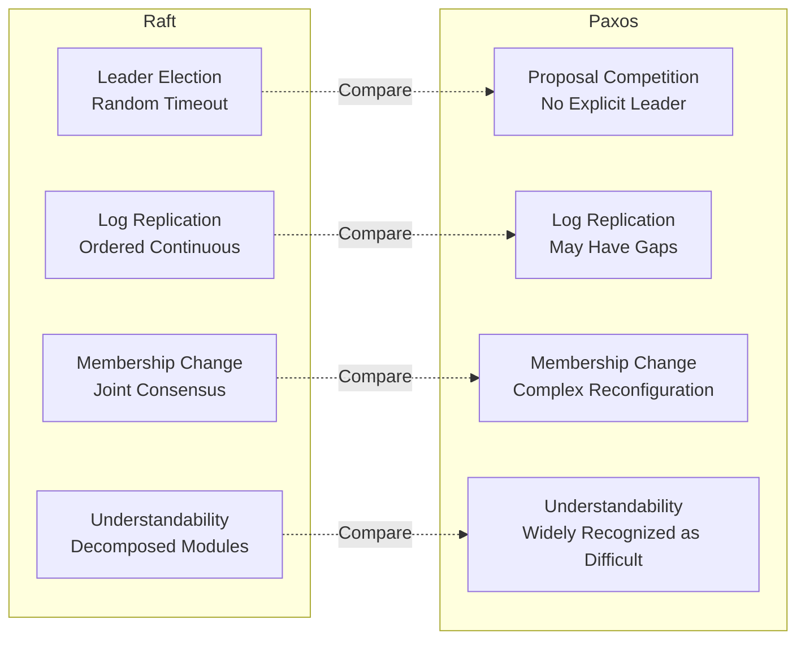
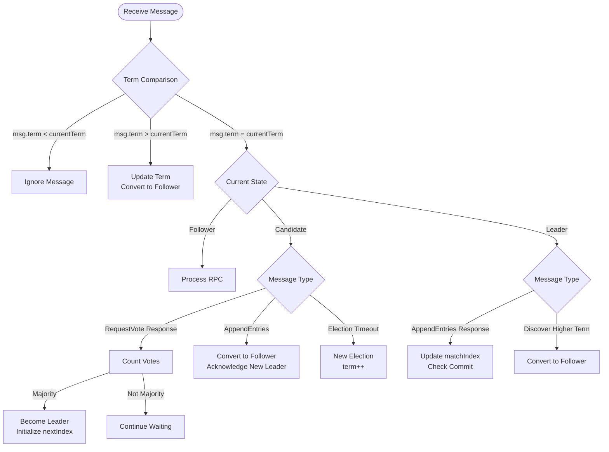
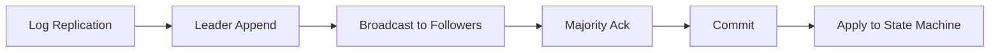
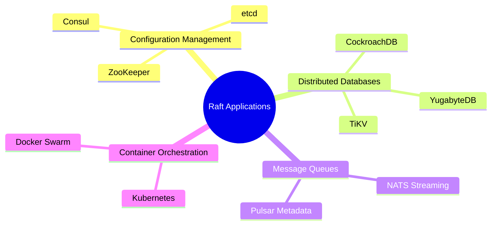

# Raft Consensus Algorithm

> Stage: formal-methods/98-appendices | Prerequisites: [Consensus](13-consensus.md), [Linearizability](15-linearizability.md) | Formality Level: L5

## 1. Definitions

### 1.1 Wikipedia Standard Definition

**Raft** (**R**eliable, **R**eplicated, **R**edundant, **A**nd **F**ault-**T**olerant) is a consensus algorithm for managing replicated logs. Proposed by Diego Ongaro and John Ousterhout at Stanford University in 2014, it was designed to provide a more understandable consensus mechanism than Paxos while maintaining equivalent safety and fault tolerance.

> **Def-Raft-01** (Raft Consensus Algorithm)
>
> Raft is an algorithm for managing replicated logs. By electing a Leader and giving it full responsibility for log management, it simplifies replicated state machine management. The algorithm guarantees that all nodes execute the same command sequence in the same order, thereby producing the same state machine state on all nodes.

**Core Design Principles**:

- **Strong Leader**: Log entries only flow from Leader to Followers
- **Leader Election**: Uses randomized timers to elect new Leaders
- **Membership Change**: Achieves safe configuration transitions through Joint Consensus

### 1.2 Formal Model

#### 1.2.1 System Model

```
┌─────────────────────────────────────────────────────────────────┐
│                     Raft Cluster                                │
│                                                                 │
│  ┌─────────┐    ┌─────────┐    ┌─────────┐    ┌─────────┐      │
│  │ Node 1  │◄──►│ Node 2  │◄──►│ Node 3  │◄──►│ Node 4  │      │
│  │(Leader) │    │(Follower│    │(Follower│    │(Follower│      │
│  └────┬────┘    └────┬────┘    └────┬────┘    └────┬────┘      │
│       │              │              │              │            │
│       └──────────────┴──────────────┴──────────────┘            │
│                        │                                        │
│                   Log Replication                               │
│                                                                 │
│  ┌─────────────────────────────────────────────────────────┐   │
│  │                     State Machine                        │   │
│  │  ┌─────┐ ┌─────┐ ┌─────┐ ┌─────┐ ┌─────┐ ┌─────┐       │   │
│  │  │cmd=5│→│cmd=3│→│cmd=7│→│cmd=2│→│cmd=1│→│cmd=9│  ...   │   │
│  │  │idx=1│ │idx=2│ │idx=3│ │idx=4│ │idx=5│ │idx=6│       │   │
│  │  │term=1│ │term=1│ │term=2│ │term=2│ │term=3│ │term=3│      │   │
│  │  └─────┘ └─────┘ └─────┘ └─────┘ └─────┘ └─────┘       │   │
│  └─────────────────────────────────────────────────────────┘   │
└─────────────────────────────────────────────────────────────────┘
```

> **Def-Raft-02** (Raft Node Set)
>
> Let $N = \{n_1, n_2, \ldots, n_n\}$ be the set of nodes in the cluster, $|N| = n$.
>
> Define node state function $s: N \rightarrow \{\text{Follower}, \text{Candidate}, \text{Leader}\}$

> **Def-Raft-03** (Log Entry)
>
> Log entry $e = (\text{index}, \text{term}, \text{command})$, where:
>
> - $\text{index} \in \mathbb{N}^+$: Position of entry in the log
> - $\text{term} \in \mathbb{N}$: Term number when entry was created
> - $\text{command}$: Instruction to apply to state machine

> **Def-Raft-04** (Log)
>
> Node $i$'s log $L_i = [e_1, e_2, \ldots, e_k]$ is an ordered sequence of entries.
>
> Define $\text{lastLogIndex}(L_i) = k$, $\text{lastLogTerm}(L_i) = e_k.\text{term}$

#### 1.2.2 Three Node States

**Follower**:

- Passively responds to requests from Leader and Candidate
- Processes `AppendEntries` RPC (log replication and heartbeat)
- Processes `RequestVote` RPC (vote requests)
- Converts to Candidate if times out without receiving Leader message

**Candidate**:

- Actively initiates Leader election
- Increments current term, sends `RequestVote` RPC to other nodes
- Becomes Leader if receives majority votes
- Reverts to Follower if receives message from higher term
- Starts new election if election times out

**Leader**:

- Handles all client requests
- Sends `AppendEntries` RPC to replicate log entries
- Maintains `nextIndex` and `matchIndex` for each Follower
- Sends empty `AppendEntries` as heartbeat within heartbeat timeout



### 1.3 Term Mechanism

> **Def-Raft-05** (Term)
>
> Term $\tau \in \mathbb{N}$ is a monotonically increasing logical clock, dividing time into continuous intervals.
>
> Each term has at most one Leader, and may have no Leader due to split votes.

**Formalization of Terms**:

```
Time →
─────────────────────────────────────────────────────────────►

  Term 1         Term 2              Term 3           Term 4
├─────────┬─────────────┬─────────────────┬─────────────┤
│ Leader A│  Leader B   │   (No Leader)   │  Leader C   │
│         │             │   (Split Vote)  │             │
└─────────┴─────────────┴─────────────────┴─────────────┘
          ▲
          └── Election triggered
```

> **Def-Raft-06** (Term Number Comparison Rules)
>
> For two terms $\tau_1$ and $\tau_2$:
>
> - If $\tau_1 < \tau_2$, then $\tau_1$ is "older" than $\tau_2$
> - All RPCs carry the sender's term number
> - If receiver's term number is less than sender's, update own term number
> - If Leader or Candidate discovers its term number is outdated, immediately convert to Follower

### 1.4 Log Matching Property

> **Def-Raft-07** (Log Matching Property)
>
> If two log entries have the same index and term, then:
>
> 1. They store the same command
> 2. All log entries before this index are identical
>
> Formal expression:
> $$\forall i, j: (L_i[k].\text{index} = L_j[k].\text{index} \land L_i[k].\text{term} = L_j[k].\text{term}) \implies L_i[1..k] = L_j[1..k]$$

**Log Consistency Check**:

- `AppendEntries` RPC contains previous entry's index and term `(prevLogIndex, prevLogTerm)`
- Follower only accepts new entries if it contains a matching entry
- If mismatch, Follower rejects and requests Leader to decrement `nextIndex`

```
Leader Log: [1,1][2,1][3,2][4,2][5,3][6,3][7,3]
             │   │   │   │   │   │   │
             ▼   ▼   ▼   ▼   ▼   ▼   ▼
Follower A: [1,1][2,1][3,2][4,2]           ✓ Match
Follower B: [1,1][2,1][3,3]               ✗ Mismatch (term conflict)
Follower C: [1,1][2,1][3,2][4,2][5,3]      ✓ Match (shorter)
```

### 1.5 State Machine Safety

> **Def-Raft-08** (Committed Entry)
>
> Entry $e$ is **committed** if and only if:
>
> 1. $e$ is stored in Leader's log
> 2. Leader has replicated $e$ to a majority of nodes (including itself)
>
> Once committed, the entry is guaranteed to be included by all future Leaders.

> **Def-Raft-09** (State Machine Safety)
>
> If any node has applied a log entry at a given index to its state machine, then:
>
> - No other node will apply a different command at the same index
>
> Formal:
> $$\text{applied}_i[k] = c \implies \forall j: \neg\text{applied}_j[k] = c' \text{ where } c \neq c'$$

## 2. Properties

### 2.1 Election Safety Property

> **Lemma-Raft-01** (Election Safety)
>
> For a given term $\tau$, at most one Leader is elected.
>
> $$\forall \tau: |\{n \in N : \text{state}(n) = \text{Leader} \land \text{currentTerm}(n) = \tau\}| \leq 1$$

**Derivation**: Based on the property of majority voting. A Candidate must receive votes from a strict majority of nodes to become Leader. Since any two majorities must intersect, if two Candidates simultaneously receive majority votes, at least one node voted for both, which contradicts the rule that each node can only vote once per term.

### 2.2 Leader Completeness

> **Lemma-Raft-02** (Leader Completeness)
>
> If entry $e$ is committed in term $\tau$, then all Leaders of terms $> \tau$ contain $e$.
>
> $$\text{committed}(e, \tau) \implies \forall \tau' > \tau: \forall \text{Leader } l \text{ of } \tau': e \in L_l$$

**Derivation**: Based on the definition of commit (majority replication) and Leader election restriction (Candidate's log must be at least as new as the voter's log).

### 2.3 Log Matching Property Preservation

> **Lemma-Raft-03** (Log Matching Preservation)
>
> If Leader Completeness holds, then Log Matching Property is preserved.

**Derivation**: When Leader sends `AppendEntries`, it ensures Followers truncate logs at conflict points through consistency checks. Since Leader's log is "authoritative" (contains all committed entries), after Followers replicate Leader's log, they must be consistent before that point.

### 2.4 Commit Prefix Property

> **Lemma-Raft-04** (Commit Prefix)
>
> If the entry at index $k$ is committed, then all entries with index $< k$ are also committed.

**Derivation**: Entries are replicated in order, Leaders only commit entries from the current term, and committing requires matching all previously committed entries.

### 2.5 State Machine Safety Guarantee

> **Lemma-Raft-05** (State Machine Safety Corollary)
>
> Leader Completeness + Log Matching Property $\implies$ State Machine Safety

**Derivation**: If node $i$ applies command $c$ at index $k$, then $L_i[k] = c$ is committed. By Leader Completeness, all subsequent Leaders contain this entry. By Log Matching Property, all nodes will have the same entry at index $k$, so they cannot apply different commands.

## 3. Relations

### 3.1 Relationship between Raft and Replicated State Machine



**Relationship**: Raft is a concrete implementation of the replicated state machine model, providing strong consistency guarantees.

### 3.2 Relationship between Raft and Paxos

| Feature | Raft | Multi-Paxos |
|---------|------|-------------|
| Leader Election | Explicit, based on random timeout | Implicit, competitive proposals |
| Log Structure | Continuous, ordered | May have gaps |
| Liveness Guarantee | Strong Leader guarantees progress | May experience livelock |
| Membership Change | Joint Consensus | More complex reconfiguration |
| Understandability | Design goal | Widely recognized as difficult |

### 3.3 Relationship between Raft and CAP Theorem

Raft is a CP system:

- **Consistency (C)**: All nodes see the same log order
- **Partition Tolerance (P)**: Availability degrades in minority partitions
- **Sacrifices Availability (A)**: When majority cannot be formed, system is unavailable

```
         CP System
           │
     ┌─────┴─────┐
     │   Raft    │
     │  Paxos    │
     │ ZAB/ZooKeeper│
     └─────┬─────┘
           │
    ┌──────┴──────┐
    │             │
  Consistency    Partition Tolerance
    │             │
 Strong Guarantee  Network Fault Tolerance
```

### 3.4 Relationship with Linearizability

> **Prop-Raft-01** (Raft Provides Linearizability)
>
> Correctly implemented Raft provides Linearizability.

**Argument**:

1. All write operations are serialized through Leader
2. Leader assigns a global order (log index) to each operation
3. If read operations execute on Leader and verify it is still Leader, Linearizability is guaranteed
4. This is the so-called "quorum read" or "read index" mechanism

### 3.5 Membership Change (Joint Consensus)

> **Def-Raft-10** (Configuration Change)
>
> Configuration $C$ is the set of nodes in the cluster. Transitioning from $C_{\text{old}}$ to $C_{\text{new}}$ requires safe transition.

**Problem**: Directly switching configurations may lead to two independent majorities ($C_{\text{old}}$ and $C_{\text{new}}$ each electing a Leader).

**Solution - Joint Consensus**:

1. Leader receives configuration change request
2. Creates $C_{\text{old,new}}$ (joint configuration): requires dual majorities of $C_{\text{old}}$ AND $C_{\text{new}}$
3. Replicates $C_{\text{old,new}}$ to all nodes
4. Once $C_{\text{old,new}}$ is committed, creates $C_{\text{new}}$
5. Replicates $C_{\text{new}}$, completes transition after commitment



**Safety**: During $C_{\text{old,new}}$ phase, two Leaders are impossible because dual majorities are required, and any two dual majorities must intersect.

## 4. Argumentation

### 4.1 Why Leader is Needed

**Problems with Paxos**:

- Basic Paxos requires two phases (Prepare/Promise, Accept/Accepted)
- Multiple Proposers competing may cause livelock
- No built-in Leader election mechanism

**Raft's Solution**:

- Explicit Leader simplifies client interaction
- Leader has full responsibility for log management
- When Leader fails, new Leader is elected through election

### 4.2 Role of Randomized Timeout

**Problem**: Multiple Candidates simultaneously initiating elections may cause permanent split votes.

**Solution**:

- Each node's election timeout is randomly chosen between $[T, 2T]$
- Probabilistically, only one node times out first and becomes Candidate
- This node completes election before others timeout

**Probability Analysis**:

- Let election timeout range be $[150ms, 300ms]$, network delay $< 10ms$
- First Candidate has ample time to complete election
- Split vote probability is extremely low

### 4.3 Sources of Log Inconsistency

**Scenario Analysis**:

```
Scenario 1: Leader crash causes log inconsistency
─────────────────────────────────
Initial: All nodes: [1,1][2,1][3,1]

Leader A crashes before replicating to all nodes:
  Node 1 (A): [1,1][2,1][3,1][4,2]
  Node 2:     [1,1][2,1][3,1][4,2]
  Node 3:     [1,1][2,1][3,1]
  Node 4:     [1,1][2,1][3,1][4,2][5,2]
  Node 5:     [1,1][2,1][3,1]

New Leader B (Node 3) elected successfully (term 3), begins synchronization:
  - Node 4 needs to truncate [4,2][5,2]
  - Node 1,2 are already correct
  - All nodes eventually consistent with Leader B
```

### 4.4 Network Partition Handling

```
Before Partition (5 nodes):
┌─────────────────────────────────────┐
│  N1   N2   N3   N4   N5             │
│  (L)                              │
└─────────────────────────────────────┘

After Partition:
┌─────────────┐     ┌─────────────────┐
│  N1   N2    │     │  N3   N4   N5   │
│  (L)        │     │  (New Leader)   │
│  Old Leader │     │  Majority Partition│
│  Cannot Commit│    │  Can Continue Service│
└─────────────┘     └─────────────────┘

After Recovery: Old Leader recognizes higher term, converts to Follower
```

**Key Behaviors**:

1. Old Leader is in minority partition, cannot obtain majority confirmation, cannot commit new entries
2. Majority partition elects new Leader
3. After partition recovery, old Leader discovers higher term, automatically downgrades

## 5. Formal Proofs

### 5.1 Proof: Election Safety

> **Thm-Raft-01** (Election Safety)
>
> At most one Leader can be elected per term.

**Proof**:

**Proof by Contradiction**: Assume term $\tau$ has two Leaders $L_1$ and $L_2$.

1. $L_1$ becoming Leader requires receiving votes from a strict majority of nodes (let this be $V_1$, $|V_1| > n/2$)
2. $L_2$ becoming Leader requires receiving votes from a strict majority of nodes (let this be $V_2$, $|V_2| > n/2$)
3. By pigeonhole principle: $|V_1| + |V_2| > n$, so $V_1 \cap V_2 \neq \emptyset$
4. Let $v \in V_1 \cap V_2$
5. Node $v$ can only vote once per term (Raft voting rule)
6. Contradiction: $v$ cannot vote for both $L_1$ and $L_2$

**Conclusion**: Assumption is false, at most one Leader per term. $\square$

### 5.2 Proof: Committed Entry Preservation Theorem

> **Thm-Raft-02** (Committed Entry Preservation)
>
> Committed entries will not be overwritten or deleted.

**Proof**:

**Definition**: Entry $e$ is committed in term $\tau$ when $e$ is replicated to a majority of nodes.

**Lemma**: Candidate's log is at least as new as the voter's log.

**Proof Steps**:

1. Let entry $e = (k, \tau_c, cmd)$ be committed ($k$ = index, $\tau_c$ = creation term)
2. Let $C$ be the Leader in term $\tau_c$, $C$ replicates $e$ to majority nodes $M$
3. Consider any new Leader $L$ in subsequent term $\tau' > \tau_c$
4. $L$ must receive votes from a majority of nodes, let this be $V$
5. Both $M$ and $V$ are majorities, so $M \cap V \neq \emptyset$
6. Let $v \in M \cap V$, $v$ voted for $L$
7. **Election Restriction**: Nodes only vote for Candidates with logs at least as new as their own
8. $v$ contains $e$ (because $v \in M$)
9. $L$'s log is at least as new as $v$'s
10. Since $e$ is at index $k$, $L$ either has the same entry at $k$, or $L$'s log is longer
11. If $L$ has same-term entry at $k$, by Log Matching Property, the entry is the same
12. If $L$'s log is longer, it must contain all of $v$'s entries, including $e$
13. Therefore $L$ contains $e$

**Conclusion**: All subsequent Leaders contain committed entries, entries will not be overwritten. $\square$

### 5.3 Proof: State Machine Safety

> **Thm-Raft-03** (State Machine Safety)
>
> If any node applies command $c$ to its state machine at index $k$, then no other node will apply a different command $c'$ at index $k$.

**Proof**:

1. Let node $n_i$ apply command $c$ at index $k$
2. By application rule, $n_i$ only applies after entry $e = (k, \tau, c)$ is committed
3. By **Thm-Raft-02** (Committed Entry Preservation), all subsequent Leaders contain $e$
4. By **Lemma-Raft-02** (Leader Completeness), all subsequent Leaders' logs have $e$ at $k$
5. Consider any other node $n_j$:
   - If $n_j$ and $n_i$ are in the same Leader term, both receive logs from the same Leader, same at index $k$
   - If $n_j$ is in a new Leader term, the new Leader contains $e$ (by step 4)
   - $n_j$ replicates log from Leader, ensures $e$ at index $k$ through consistency check
6. By Log Matching Property, all nodes have the same entry $e = (k, \tau, c)$ at index $k$
7. Therefore $n_j$ cannot apply different $c'$ at index $k$

**Conclusion**: State Machine Safety holds. $\square$

### 5.4 Proof: Liveness Theorem (Under Partial Synchrony)

> **Thm-Raft-04** (Liveness under Partial Synchrony)
>
> Under partial synchrony network model, Raft eventually elects a Leader and continuously processes requests.

**Proof Sketch**:

**Partial Synchrony Assumptions**:

- Network may have arbitrary delays during asynchronous phase
- There exists an unknown bound after which the system enters synchronous phase (message delays have upper bound)

**Proof Steps**:

1. **Election Eventually Succeeds**:
   - Synchronous phase, message delay $< \delta$
   - Election timeout range $[T, 2T]$, $T \gg \delta$
   - Probabilistically, exactly one node times out first
   - This node collects majority votes within $O(n \cdot \delta)$ time after timeout
   - Becomes Leader

2. **Leader Stability**:
   - Leader sends heartbeat every $T_{\text{heartbeat}} < T$
   - Followers do not time out
   - Leader remains stable

3. **Request Processing**:
   - Client request arrives at Leader
   - Leader replicates to majority within $O(n \cdot \delta)$ time
   - Entry committed and applied
   - Respond to client

4. **Failure Recovery**:
   - After Leader failure, Followers time out within $[T, 2T]$
   - Repeat step 1, elect new Leader

**Conclusion**: Raft provides liveness guarantee under partial synchrony model. $\square$

### 5.5 Formal Specification (TLA+ Style)

```tlaplus
(* Formal specification of Raft core algorithm *)

CONSTANTS Nodes,             (* Set of nodes *)
          MaxTerm,           (* Maximum term *)
          MaxLogLen          (* Maximum log length *)

VARIABLES currentTerm,       (* Node current term *)
          state,             (* Node state *)
          log,               (* Node log *)
          votedFor,          (* Who voted for in current term *)
          commitIndex        (* Highest committed index *)

(* Type invariant *)
TypeInvariant ==
  /\ currentTerm \in [Nodes -> 0..MaxTerm]
  /\ state \in [Nodes -> {"Follower", "Candidate", "Leader"}]
  /\ log \in [Nodes -> Seq([term: 0..MaxTerm, cmd: Commands])]
  /\ votedFor \in [Nodes -> Nodes \cup {None}]
  /\ commitIndex \in [Nodes -> 0..MaxLogLen]

(* Safety properties *)
ElectionSafety ==
  \A n1, n2 \in Nodes :
    (state[n1] = "Leader" /\ state[n2] = "Leader" /\
     currentTerm[n1] = currentTerm[n2])
    => n1 = n2

LogMatching ==
  \A n1, n2 \in Nodes, i \in 1..Len(log[n1]) :
    (i <= Len(log[n2]) /\
     log[n1][i].term = log[n2][i].term)
    => log[n1][1..i] = log[n2][1..i]

LeaderCompleteness ==
  \A n \in Nodes, i \in 1..Len(log[n]) :
    (IsCommitted(log[n][i], i))
    => \A tm \in currentTerm[n]+1..MaxTerm :
       \A leader \in {l \in Nodes : state[l] = "Leader" /\
                                     currentTerm[l] = tm} :
         i <= Len(log[leader]) /\ log[leader][i] = log[n][i]

StateMachineSafety ==
  \A n1, n2 \in Nodes, i \in 1..Min(commitIndex[n1], commitIndex[n2]) :
    log[n1][i].cmd = log[n2][i].cmd
```

## 6. Examples

### 6.1 Basic Log Replication Flow

```
Client Request: SET x = 5
─────────────────────

Step 1: Leader Receives Request
┌─────────┐
│ Leader  │  Create entry: (index=1, term=1, cmd=SET x=5)
└────┬────┘
     │
     ▼
Step 2: Replicate to Followers
┌─────────┐     ┌─────────┐     ┌─────────┐
│Follower1│     │Follower2│     │Follower3│
└────┬────┘     └────┬────┘     └────┬────┘
     │               │               │
     ◄───────────────┴───────────────┘
     │    AppendEntries RPC
     │    (prevLogIndex=0, prevLogTerm=0, entries=[(1,1,SET x=5)])
     ▼
Step 3: Followers Respond Success
┌─────────┐     ┌─────────┐     ┌─────────┐
│Follower1│     │Follower2│     │Follower3│
└────┬────┘     └────┬────┘     └────┬────┘
     │               │               │
     └───────────────┼───────────────►
                     │    Success Response
                     ▼
Step 4: Leader Commits (Majority Confirmation)
┌─────────┐
│ Leader  │  commitIndex = 1
└────┬────┘
     │
     ▼
Step 5: Apply to State Machine
All nodes: state.x = 5

Step 6: Respond to Client
┌─────────┐
│ Leader  │  → Client: Success
└─────────┘
```

### 6.2 Leader Election Example

```
Scenario: 5-node cluster, Leader crashes
──────────────────────────────

Timeline:

T0: Normal Operation
    ┌─────────────────────────────────────┐
    │  N1(L)  N2    N3    N4    N5       │
    │   │     │     │     │     │        │
    └───┴─────┴─────┴─────┴─────┘        │
          Heartbeat messages (every 100ms) │

T1: N1 Crashes
    ┌─────────────────────────────────────┐
    │  X    N2    N3    N4    N5          │
    │       │     │     │     │           │
    │       └──►  Waiting for Heartbeat ◄───┘           │
    │                                     │
    └─────────────────────────────────────┘

T2: Election Timeout (Randomized)
    N3 times out first (320ms)
    ┌─────────────────────────────────────┐
    │  X    N2    N3(C)   N4    N5        │
    │       ◄─────RequestVote───────────► │
    │            term=2, lastLog=(3,1)    │
    └─────────────────────────────────────┘

T3: Vote Response
    N2, N4, N5 all vote for N3 (logs equally new or older)

    N3 counts votes: 1(self) + 3 = 4 > 5/2 = 2.5 ✓ Majority

T4: N3 Becomes Leader
    ┌─────────────────────────────────────┐
    │  X    N2    N3(L)   N4    N5        │
    │             │                       │
    │       Send Heartbeats (Establish Authority)            │
    └─────────────────────────────────────┘

T5: System Resumes Service
```

### 6.3 Log Conflict Resolution Example

```
Scenario: Old Leader crashes, partial replication causes inconsistency
───────────────────────────────────────────

State before crash:
Leader N1: [1,1][2,1][3,2][4,2]  (term 2)
N2:       [1,1][2,1][3,2][4,2]  ✓ Fully replicated
N3:       [1,1][2,1][3,2]        ✗ Missing 4
N4:       [1,1][2,1][3,2][4,2][5,2]  ✗ Has extra entry (uncommitted)
N5:       [1,1][2,1][3,3]        ✗ Conflict (term 3)

New Leader N2 elected successfully (term 3)

Conflict Resolution Process:

For N3 (Missing entry):
  N2 → N3: AppendEntries(prevLog=3/2, entries=[4,2])
  N3: Check prevLog (3/2) ✓ Match
  N3: Append [4,2]
  N3 Result: [1,1][2,1][3,2][4,2] ✓

For N4 (Has extra entry):
  N2 → N4: AppendEntries(prevLog=4/2, entries=[])
  N4: Check prevLog (4/2) ✓ Match
  N4: But has [5,2], this is uncommitted

  Next entry:
  N2 → N4: AppendEntries(prevLog=4/2, entries=[...subsequent entries...])
  N4: Truncate [5,2] and after, replicate from Leader
  N4 Result: [1,1][2,1][3,2][4,2] ✓

For N5 (Conflict):
  N2 → N5: AppendEntries(prevLog=4/2, entries=[...])
  N5: Check prevLog (4/2) ✗ Mismatch! (N5[4] doesn't exist)
  N5: Reject, include conflict hint

  N2 decrements nextIndex[N5]:
  N2 → N5: AppendEntries(prevLog=3/2, entries=[4,2,...])
  N5: Check prevLog (3/2) ✗ Mismatch! (N5[3]=(3,3), expected (3,2))

  N2 continues decrementing:
  N2 → N5: AppendEntries(prevLog=2/1, entries=[3,2,4,2,...])
  N5: Check prevLog (2/1) ✓ Match
  N5: Truncate [3,3] and after, replicate Leader log
  N5 Result: [1,1][2,1][3,2][4,2] ✓

Final consistency achieved.
```

### 6.4 Membership Change Example (Joint Consensus)

```
Scenario: Scale from 3 nodes to 5 nodes
────────────────────────────

Initial Configuration C_old = {N1, N2, N3}
New Configuration   C_new = {N1, N2, N3, N4, N5}

Change Process:

Phase 1: Create C_old,new
┌─────────────────────────────────────────────────┐
│ Leader N1 creates configuration change entry C_old,new            │
│ C_old,new requires: C_old Majority AND C_new Majority   │
│ C_old Majority: 2/3, C_new Majority: 3/5               │
└─────────────────────────────────────────────────┘

Phase 2: Replicate C_old,new
  N1 → All: AppendEntries(C_old,new)
  Confirm replication to: N1, N2, N3 (C_old Majority ✓)
              N1, N2, N4 (C_new Majority ✓)
  C_old,new Committed ✓

Phase 3: Switch to C_new
┌─────────────────────────────────────────────────┐
│ Leader N1 creates configuration entry C_new                    │
│ Only requires C_new Majority (3/5)                       │
└─────────────────────────────────────────────────┘

Phase 4: Replicate C_new
  N1 → All: AppendEntries(C_new)
  Confirm replication to: N1, N2, N4 (C_new Majority ✓)
  C_new Committed ✓

Phase 5: Change Complete
  Cluster now operates with C_new = {N1, N2, N3, N4, N5}
  Can tolerate 2 node failures (previously only 1)

Safety Guarantee:
  During C_old,new phase, two Leaders are impossible:
  - To become Leader, must obtain dual majorities of C_old,new
  - Any two dual majorities must intersect
```

## 7. Visualizations

### 7.1 Raft Core Mechanism Mind Map



### 7.2 Request Processing Flowchart



### 7.3 Timeline View: Leader Election

```mermaid
gantt
    title Leader Election Timeline (5-node Cluster)
    dateFormat X
    axisFormat %s

    section Normal Operation
    Leader N1 Heartbeat    :done, a1, 0, 100

    section Failure Detection
    N1 Crash           :crit, a2, 100, 100
    Followers Wait    :active, a3, 100, 320

    section Election Process
    N3 Timeout→Candidate :a4, 320, 325
    RequestVote RPC      :a5, 325, 330
    Vote Responses            :a6, 330, 335
    N3 Becomes Leader      :milestone, a7, 335

    section Recovery
    Heartbeat Propagation            :a8, 335, 345
    System Resumes Service        :milestone, a9, 345
```

### 7.4 Safety Dependency Graph



### 7.5 Raft vs Paxos Comparison Matrix



### 7.6 State Transition Decision Tree



## 8. Relations

### Relationship with Kubernetes Verification

The Raft consensus algorithm is closely related to Kubernetes formal verification. Kubernetes uses etcd as its distributed key-value store, and etcd is based on the Raft algorithm to achieve strong consistency.

- See: [Kubernetes Formal Verification](../../../04-application-layer/03-cloud-native/02-kubernetes-verification.md)

Raft Applications in Kubernetes:

- **etcd Storage**: All Kubernetes state data is stored in etcd
- **Control Plane Consistency**: API Server ensures cluster state consistency through etcd
- **Leader Election**: Kubernetes components use etcd's Raft implementation for leader election

### Raft and Kubernetes Control Loop

```
Mapping of Kubernetes Control Loop to Raft:
┌─────────────────────────────────────────────────────────┐
│  etcd/Raft Layer              │  Kubernetes Control Plane         │
├───────────────────────────┼─────────────────────────────┤
│  Leader Election               │  Controller Election             │
│  Log Replication                 │  Desired State Propagation               │
│  State Machine Application               │  Actual State Convergence               │
│  Membership Change                 │  Cluster Scaling                 │
└─────────────────────────────────────────────────────────┘
```

### Formal Verification Associations

- **etcd Consensus Layer**: Kubernetes formal verification includes etcd's Raft consensus model
- **Linearizability**: Linearizability provided by Raft corresponds to Kubernetes declarative configuration consistency
- **Failure Recovery**: Raft's leader switching corresponds to Kubernetes controller failover

---

## 9. Eight-Dimensional Characterization

### 9.1 Consistency Model Dimension

| Dimension | Raft Characteristic |
|-----------|---------------------|
| **Consistency Model** | Strong Consistency |
| **Replication Protocol** | Primary-Backup with Consensus |
| **Failure Model** | Crash-Stop |
| **Byzantine Tolerance** | No (requires PBFT extensions) |
| **Read/Write Strategy** | Leader-based Writes, Quorum Reads (optional) |
| **Latency Characteristics** | 2 RTT (Leader→Followers→Leader) |
| **Throughput** | Leader bottleneck, ~10K-100K ops/sec |

### 9.2 Fault Tolerance Dimension

| Aspect | Raft Behavior |
|--------|---------------|
| **Fault Tolerance Count** | f failures tolerable with 2f+1 nodes |
| **Leader Failure** | Automatic re-election within milliseconds to seconds |
| **Follower Failure** | Continues operation, re-synchronizes after recovery |
| **Network Partition** | Minority partition unavailable, majority partition continues |

### 9.3 Log Replication Dimension



### 9.4 Safety Guarantee Dimension

| Property | Guarantee Mechanism |
|----------|---------------------|
| Election Safety | Majority voting, one vote per term |
| Leader Completeness | Log freshness check during voting |
| Log Matching | Consistency check in AppendEntries |
| State Machine Safety | Only commit entries from current term |

### 9.5 Membership Change Dimension

| Strategy | Description |
|----------|-------------|
| Joint Consensus | Dual configuration majority requirement |
| Single-Step Change | Direct switching (risky) |
| Automatic Discovery | Dynamic node discovery (extended Raft) |

### 9.6 Performance Characteristics Dimension

| Metric | Typical Value | Influencing Factors |
|--------|---------------|---------------------|
| Write Latency | 1-10ms | Network delay, log size |
| Read Latency | 0.1-1ms | Leader read vs. Follower read |
| Throughput | 10K-100K ops/sec | Leader capability, batch size |
| Recovery Time | 100ms-10s | Timeout settings, network conditions |

### 9.7 Engineering Implementation Dimension

| Component | Implementation Complexity | Key Points |
|-----------|--------------------------|------------|
| Log Storage | Medium | Snapshot, compaction |
| Network Layer | High | RPC, heartbeat, retry |
| State Machine | Low | Deterministic execution |
| Configuration Management | High | Joint Consensus implementation |

### 9.8 Application Scenarios Dimension



---

## 10. References


---

*Document Version: v1.0 | Created: 2026-04-10 | Formality Level: L5*
