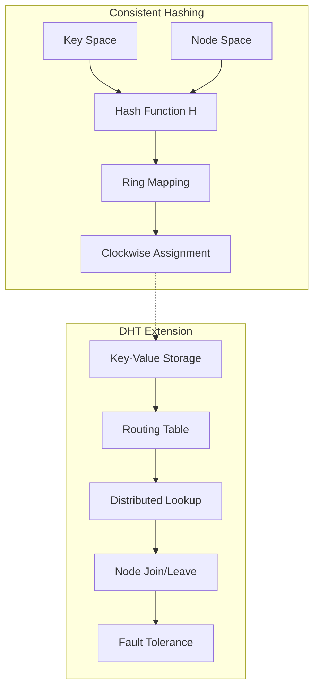
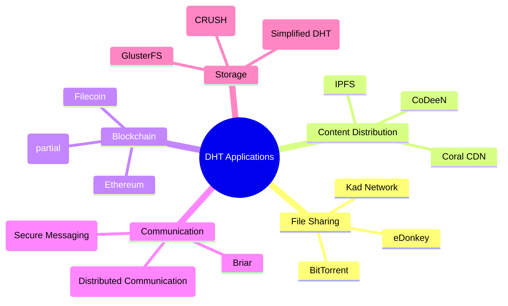
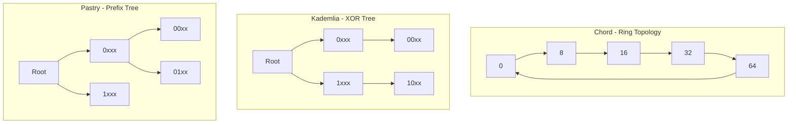

# Distributed Hash Table (DHT)

> **Stage**: Struct/Formal Methods | **Prerequisites**: [14-cap-theorem.md](./14-cap-theorem.md), [19-raft.md](./19-raft.md) | **Formalization Level**: L5

---

## 1. Definitions

### 1.1 Wikipedia Standard Definition

**Distributed Hash Table (DHT)** is a distributed system that provides a lookup service similar to a hash table: key-value pairs are stored in a DHT, and any participating node can efficiently retrieve the value associated with a given key. This distribution of responsibility allows DHTs to scale to accommodate large numbers of nodes and handle node joins, leaves, and failures[^1].

> **Wikipedia Definition**: "A distributed hash table (DHT) is a distributed system that provides a lookup service similar to a hash table: key-value pairs are stored in a DHT, and any participating node can efficiently retrieve the value associated with a given key."[^1]

**Core Characteristics**:

- **Decentralization**: No central coordinating node
- **Scalability**: As the number of nodes increases, state/workload per node grows sublinearly
- **Fault Tolerance**: Node failures do not cause data loss or service interruption

### 1.2 DHT Formal Model

#### Def-S-98-01: DHT System Model

A DHT system consists of the following components:

$$
\text{DHT} \triangleq \langle N, K, V, H, \text{assign}, \text{lookup} \rangle
$$

Where:

- $N = \{n_1, n_2, \ldots, n_m\}$: Node identifier space
- $K$: Key space (typically same as node space)
- $V$: Value space
- $H: \text{Data} \rightarrow K$: Consistent hash function
- $\text{assign}: K \times N \rightarrow \{0,1\}$: Key-to-node assignment function
- $\text{lookup}: K \rightarrow N \times V$: Lookup operation

#### Def-S-98-02: Identifier Ring

The identifier space $[0, 2^m - 1]$ forms a modulo $2^m$ ring structure:

$$
\text{Ring}_m = \mathbb{Z}_{2^m}
$$

**Successor Definition**: For identifier $x$, its successor $\text{succ}(x)$ is defined as:

$$
\text{succ}(x) = \min\{y \in N : y \geq x \pmod{2^m}\}
$$

**Predecessor Definition**: For node $n$, its predecessor $\text{pred}(n)$ is defined as:

$$
\text{pred}(n) = \max\{y \in N : y < n \pmod{2^m}\}
$$

#### Def-S-98-03: Consistent Hashing

Consistent hashing maps both data and nodes to the same identifier space:

$$
H_{\text{node}}: \text{NodeAddress} \rightarrow [0, 2^m - 1]
$$

$$
H_{\text{key}}: \text{Key} \rightarrow [0, 2^m - 1]
$$

**Key Assignment Rule**: Key $k$ is assigned to its successor node:

$$
\text{owner}(k) = \text{succ}(H_{\text{key}}(k))
$$

**Virtual Nodes**: To improve load balancing, each physical node can map to $v$ virtual nodes:

$$
H_{\text{virtual}}: \text{NodeAddress} \times [1,v] \rightarrow [0, 2^m - 1]
$$

### 1.3 Chord Protocol Core Definitions

#### Def-S-98-04: Chord Finger Table

Each node $n$ maintains a routing table of length $m$ (finger table):

$$
\text{finger}[i] = \text{succ}(n + 2^{i-1} \pmod{2^m}), \quad i \in [1, m]
$$

**Formal Representation**:

```
finger_table(n) = [
  finger[1] = succ(n + 1)
  finger[2] = succ(n + 2)
  finger[3] = succ(n + 4)
  ...
  finger[m] = succ(n + 2^(m-1))
]
```

**Finger Interval**: The $i$-th finger is responsible for queries in the interval $(n + 2^{i-1}, n + 2^i]$.

#### Def-S-98-05: Chord Successor Pointers

Each node $n$ maintains:

- **Successor pointer** $\text{successor}$: The next node clockwise on the ring
- **Predecessor pointer** $\text{predecessor}$: The next node counterclockwise on the ring

**Invariant** (in ideal state):

$$
\forall n \in N: \text{succ}(\text{pred}(n)) = n \land \text{pred}(\text{succ}(n)) = n
$$

---

## 2. Properties

### Lemma-S-98-01: Finger Table Coverage Property

**Proposition**: Finger table entries partition the identifier space into exponentially growing intervals.

**Proof**:
For node $n$, the $i$-th finger is responsible for an interval of length:

$$
|(n + 2^{i-1}, n + 2^i]| = 2^{i-1}
$$

Total coverage:

$$
\sum_{i=1}^{m} 2^{i-1} = 2^m - 1
$$

This covers almost the entire identifier space (except the node itself). ∎

### Lemma-S-98-02: Consistent Hashing Monotonicity

**Proposition**: When nodes join or leave, only key assignments for neighbors of that node change.

**Proof**:
Let node $n$ join, taking over keys in interval $(\text{pred}(n), n]$.

- Only keys originally belonging to $\text{succ}(\text{pred}(n))$ need migration
- Other key assignments remain unchanged

Let node $n$ leave, transferring its keys to $\text{succ}(n)$.

- Only keys originally belonging to $n$ need to migrate to $\text{succ}(n)$
- Other key assignments remain unchanged

Therefore, key assignment changes are local. ∎

### Prop-S-98-01: Virtual Node Load Balancing

**Proposition**: With $v$ virtual nodes, load deviation for any physical node is $O(\frac{\log N}{v})$ with high probability.

**Derivation**:
Let total keys be $|K|$, physical nodes be $N$.

- Expected keys per virtual node: $\frac{|K|}{vN}$
- By Chernoff bound, deviation is $O(\sqrt{\frac{|K| \log(vN)}{vN}})$ with high probability
- Relative deviation from expected: $O(\frac{\log N}{v})$

### Lemma-S-98-03: Chord Routing Table Size

**Proposition**: Each node in Chord maintains $O(\log N)$ state information.

**Proof**:

- Finger table size: $m = O(\log |\text{Ring}|)$ (typically 160-bit SHA-1)
- Actual stored finger entries: at most $N-1$ (actual node count)
- Therefore space complexity: $O(\log N)$ (when $N \ll 2^m$)

Also need to store successor and predecessor pointers: $O(1)$.

Total state: $O(\log N)$. ∎

---

## 3. Relations

### 3.1 DHT and Consistent Hashing Relationship



### 3.2 Comparison: Chord, Kademlia, Pastry

| Feature | Chord | Kademlia | Pastry |
|---------|-------|----------|--------|
| **Topology** | Identifier Ring | XOR Metric Tree | Prefix Routing Tree |
| **Routing Table Size** | $O(\log N)$ | $O(\log N)$ | $O(\log N)$ |
| **Hop Count** | $O(\log N)$ | $O(\log N)$ | $O(\log N)$ |
| **Distance Metric** | Ring Distance | XOR Distance | Prefix Matching |
| **Parallel Queries** | No | Yes ($\alpha$ parameter) | No |
| **Node State** | $O(\log N)$ | $O(\log N)$ | $O(\log N)$ |
| **Fault Tolerance** | Successor List | K-buckets Redundancy | Leaf Set + Routing Table |

### 3.3 DHT and CAP Theorem Relationship

```
DHT Design Trade-offs:
┌─────────────────────────────────────────────────────────────┐
│                                                             │
│   Consistency ◄────────────────────────────► Availability   │
│      │                                           │          │
│      │  Chord: Eventual consistency, prioritize  │          │
│      │       availability                        │          │
│      │  Kademlia: Relaxed consistency, high      │          │
│      │       availability                        │          │
│      │  Pastry: Configurable, supports           │          │
│      │       different strategies                │          │
│      │                                           │          │
│      └────────────── Partition Tolerance ───────────────────┘
│                    (All DHTs support)
└─────────────────────────────────────────────────────────────┘
```

DHTs typically choose **AP** (Availability + Partition Tolerance), providing **eventual consistency**.

### 3.4 DHT and P2P Networks Relationship

| P2P Type | Structure | Representative Systems | Routing Complexity |
|----------|-----------|------------------------|-------------------|
| Unstructured | Random Graph | Gnutella, BitTorrent DHT | $O(N)$ Flooding |
| Structured | DHT | Chord, Kademlia, Pastry | $O(\log N)$ |
| Hybrid | Supernodes | Skype (legacy), Kad | Variable |

---

## 4. Argumentation

### 4.1 Why $O(\log N)$ Routing is Needed

**Problem**: In a network of $N$ nodes, design routing such that:

1. Each node maintains limited state
2. Lookup hop count is minimized
3. Network can quickly adapt to dynamic changes

**Solution Comparison**:

| Scheme | State/Node | Hops | Feasibility |
|--------|-----------|------|-------------|
| Fully Connected | $O(N)$ | $O(1)$ | Not scalable |
| Successor Only | $O(1)$ | $O(N)$ | Too slow |
| **DHT Routing** | **$O(\log N)$** | **$O(\log N)$** | **Optimal balance** |

**Intuition**: Each routing hop should significantly reduce the remaining search space, similar to binary search.

### 4.2 Chord Routing Correctness Argument

**Key Observation**: Finger table design ensures each query significantly reduces distance.

For query key $k$ (from node $n$):

- Lookup distance: $d = k - n \pmod{2^m}$
- Select largest $i$ such that $finger[i] \in (n, k]$
- Next hop distance: $d' = k - finger[i] < d - 2^{i-1} \leq d/2$

Therefore, distance is at least halved each iteration.

### 4.3 Network Partition Handling

```
Before Partition:
┌─────────────────────────────────────┐
│  N1 ◄──► N2 ◄──► N3 ◄──► N4 ◄──► N5 │
│  └─────────────┬─────────────┘      │
│         Complete Network            │
└─────────────────────────────────────┘

After Partition:
┌─────────────┐     ┌─────────────────┐
│ N1 ◄──► N2  │     │ N3 ◄──► N4 ◄──► N5│
│  Partition A│     │     Partition B  │
│  Key subset │     │     Key subset   │
└─────────────┘     └─────────────────┘

Behavior:
- Partition A can only access keys $k$ where $succ(k) \in$ Partition A
- Queries for keys spanning partitions will fail or timeout
- After partition recovery, key migration and routing table repair needed
```

### 4.4 Role of Virtual Nodes

**Problem**: Non-uniform hashing may cause load imbalance.

**Scenario**: Nodes $n_1$ and $n_2$ are adjacent on the ring, but with small distance.

- Interval for $n_1$: $(\text{pred}(n_1), n_1]$
- Interval for $n_2$: $(n_1, n_2]$ (very small)
- Result: $n_2$ has very light load

**Virtual Node Solution**:

- Each physical node maps to $v$ random positions
- Load of large nodes distributed across multiple positions
- Load standard deviation reduced from $O(\log N)$ to $O(1/\sqrt{v})$

---

## 5. Formal Proofs

### 5.1 Chord Routing Correctness Theorem

**Thm-S-98-01: Chord Lookup Correctness**

> For any key $k$ and starting node $n$, the `find_successor(k)` algorithm always terminates and returns $\text{succ}(k)$.

**Proof**:

**Algorithm Definition**:

```
find_successor(k):
  if k ∈ (n, successor]:
    return successor
  else:
    n' = closest_preceding_node(k)
    return n'.find_successor(k)

closest_preceding_node(k):
  for i = m downto 1:
    if finger[i] ∈ (n, k):
      return finger[i]
  return successor
```

**Termination Proof**:

Let current node be $n$, target key be $k$, distance $d = k - n \pmod{2^m}$.

**Case 1**: $k \in (n, \text{successor}]$

- Algorithm returns directly, terminates ✓

**Case 2**: $k \notin (n, \text{successor}]$

- Algorithm selects $n' = \text{closest\_preceding\_node}(k)$
- By definition, $n' \in (n, k)$ and is the largest such node in finger table
- New distance $d' = k - n' < k - (n + 2^{i-1})$ for some $i$

**Key Lemma**: $d' \leq d/2$

Let $i$ be the largest index satisfying $n + 2^{i-1} < k$.
Then $n' \geq n + 2^{i-1}$ and $k - n < 2^i$ (otherwise $i$ is not maximal).

Therefore:
$$
d' = k - n' \leq k - (n + 2^{i-1}) < 2^i - 2^{i-1} = 2^{i-1} \leq d/2
$$

Distance is at least halved each iteration; after at most $m$ iterations, $d < 1$, guaranteeing termination.

**Correctness Proof**:

**Invariant**: In each recursive call, $\text{succ}(k)$ remains within the search range.

- Initial: Starting from $n$, $\text{succ}(k)$ exists on the ring ✓
- Preserved: If $n' = \text{closest\_preceding\_node}(k)$, then $\text{succ}(k) \in (n', \infty)$
  - Because $n' < k$ and successor definition requires clockwise direction
- Termination: Returned node is direct predecessor or successor of $\text{succ}(k)$

By mathematical induction, the algorithm is correct. ∎

### 5.2 Chord Routing Hop Count Theorem

**Thm-S-98-02: Chord Routing Complexity**

> In a stable Chord network with $N$ nodes, lookup operations require $O(\log N)$ hops in expectation.

**Proof**:

**Upper Bound Analysis**:
From the proof of Thm-S-98-01, each iteration at least halves the distance.

In the worst case, initial distance $d \approx 2^m$, after $i$ iterations $d \leq 2^m / 2^i$.

When $d < 2^m / N$, expected interval contains only one node, i.e., target found.

Required iterations: $i$ satisfying $2^m / 2^i \approx 2^m / N$, i.e., $i \approx \log N$.

Therefore worst case $O(\log N)$ hops.

**Expected Analysis**:
Assuming uniform node distribution, finger table entries are uniformly distributed on the ring.

For distance $d$, expected predecessor distance is approximately $d/2$.
Therefore expected number of iterations is $\log_2 N = O(\log N)$. ∎

### 5.3 Consistent Hashing Load Balancing Theorem

**Thm-S-98-03: Consistent Hashing Load Balancing**

> For $N$ nodes and $K$ keys, with $v$ virtual nodes, the expected load for any physical node is $\frac{K}{N}$ with standard deviation $O(\sqrt{\frac{K}{vN}})$.

**Proof**:

**Model**: $vN$ virtual nodes uniformly placed on unit circle, $K$ keys uniformly hashed to the circle.

For physical node $i$, let it own $v$ virtual nodes at positions $p_{i,1}, \ldots, p_{i,v}$.

Node $i$'s responsible interval length $L_i$ is the sum of arc lengths between these virtual nodes.

**Expected Load**:

$$
E[L_i] = v \cdot \frac{1}{vN} = \frac{1}{N}
$$

Corresponding expected key count: $\frac{K}{N}$.

**Variance Analysis**:

Virtual node positions are independent uniform random variables.
Interval length can be modeled as exponential spacing (Poisson process).

For random partition with $vN$ points, variance of interval length for node $i$:

$$
\text{Var}(L_i) = \frac{1}{(vN)^2} \cdot v = \frac{1}{vN^2}
$$

Variance of key count (given $K$ independent uniform keys):

$$
\text{Var}(\text{keys}_i) = K \cdot \text{Var}(L_i) + E[L_i] \cdot K(1 - 1/(vN)) \approx \frac{K}{vN}
$$

Standard deviation: $\sigma = O(\sqrt{\frac{K}{vN}})$. ∎

### 5.4 Kademlia XOR Distance Metric Theorem

**Thm-S-98-04: XOR Distance Metric Validity**

> For $m$-bit identifiers, the function $d(x, y) = x \oplus y$ is a valid metric.

**Proof**:

Need to verify four metric properties:

**1. Non-negativity**: $d(x, y) \geq 0$

- XOR result is integer in $[0, 2^m - 1]$, non-negative ✓

**2. Identity**: $d(x, y) = 0 \iff x = y$

- $x \oplus y = 0 \iff x = y$ ✓

**3. Symmetry**: $d(x, y) = d(y, x)$

- XOR satisfies commutativity: $x \oplus y = y \oplus x$ ✓

**4. Triangle Inequality**: $d(x, z) \leq d(x, y) + d(y, z)$

For XOR distance, actually have stronger property:

$$
d(x, z) = x \oplus z = x \oplus y \oplus y \oplus z \leq \max(x \oplus y, y \oplus z)
$$

(Bitwise analysis: if $x_i \neq z_i$, then either $x_i \neq y_i$ or $y_i \neq z_i$)

Therefore $d(x, z) \leq \max(d(x, y), d(y, z)) \leq d(x, y) + d(y, z)$ ✓

XOR satisfies all metric axioms. ∎

### 5.5 Network Partition Availability Theorem

**Thm-S-98-05: Partition Tolerance**

> In a DHT with $N$ nodes, if network partition divides nodes into two partitions of size $N_1$ and $N_2$ ($N_1 + N_2 = N$), then:
>
> 1. Partition of size $N_1$ can service approximately $\frac{N_1}{N}$ of queries
> 2. System maintains eventual consistency (after partition recovery)

**Proof**:

**Query Availability**:

Key $k$ can be served by partition $P$ if and only if $\text{succ}(k) \in P$.

Assuming uniform key distribution and uniform node distribution:

$$
P(\text{query can be served by partition 1}) = \frac{N_1}{N}
$$

**Consistency Guarantee**:

During partition, if both partitions process updates to the same key:

- Partition 1 updates key $k$ to value $v_1$
- Partition 2 updates key $k$ to value $v_2$

After recovery, conflict resolution needed:

- DHT typically uses timestamps or vector clocks
- Eventual consistency guarantee: if updates stop, all nodes eventually see the same value

**Recovery Protocol**:

1. Nodes detect routing table inconsistency (heartbeat timeout)
2. Initiate stabilization protocol to fix successor pointers
3. Key migration: new successors take over key intervals
4. Conflict resolution: apply last-writer-wins or other strategies

Therefore, DHT maintains availability and eventual consistency under partition. ∎

---

## 6. Examples

### 6.1 Chord Routing Example

```
Scenario: m=6 (64 identifiers), nodes N={8, 16, 24, 32, 40, 48}
Query: From node 8, lookup key 54
─────────────────────────────────────────────────────────

Identifier Ring (0-63):
0────8───16───24───32───40───48───56───64
   ●    ●    ●    ●    ●    ●
   n1   n2   n3   n4   n5   n6

Node 8's finger table:
  finger[1] = succ(8+1=9)  = 16
  finger[2] = succ(8+2=10) = 16
  finger[3] = succ(8+4=12) = 16
  finger[4] = succ(8+8=16) = 16
  finger[5] = succ(8+16=24) = 24
  finger[6] = succ(8+32=40) = 40

Lookup Process (target k=54):

Step 1: From node 8
  - 54 ∉ (8, 16] (successor interval)
  - closest_preceding_node(54):
    - Check finger[6]=40 ∈ (8, 54)? Yes ✓
    - This is the largest, select 40
  - Forward to node 40

Step 2: From node 40
  - successor = 48
  - 54 ∉ (40, 48]?
  - Check finger table...
  - Actually 48 < 54, continue
  - closest_preceding_node(54):
    - Finger table contains succ(40+32=72 mod 64 = 8) = 8
    - But 8 ∉ (40, 54)
    - Other fingers may point to 48 or wrap around
  - Successor 48 is closest, forward to 48

Step 3: From node 48
  - successor = 8 (wrap around)
  - 54 ∈ (48, 8] (modulo 64, i.e., 48-63 and 0-8)?
  - Actually, succ(54) is 8 (first node after wrap)
  - Return 8

Result: Successor of 54 is 8
Hops: 3 (8 → 40 → 48 → 8)
Theoretical bound: log₂6 ≈ 2.6, actual 3 hops ✓
```

### 6.2 Kademlia XOR Routing Example

```
Scenario: 160-bit identifiers, nodes and keys using simplified 4-bit representation
Nodes: N={0010, 1010, 1110, 0111}
Query: From 0010, lookup key 1101
─────────────────────────────────────────────────────────

XOR Distance Calculation:
  d(0010, 1101) = 0010 ⊕ 1101 = 1111 (15)

  d(0010, 0010) = 0000 (0)   [self]
  d(0010, 1010) = 1000 (8)
  d(0010, 1110) = 1100 (12)
  d(0010, 0111) = 0101 (5)

K-buckets Structure (layered by prefix):
  Node 0010:
    bucket[0] (distance 2⁰-2¹): nodes with distance 1 → None
    bucket[1] (distance 2¹-2²): distance 2-3 → None
    bucket[2] (distance 2²-2³): distance 4-7 → 0111 (d=5) ✓
    bucket[3] (distance 2³-2⁴): distance 8-15 → 1010 (d=8), 1110 (d=12) ✓

Lookup for 1101 (target distance bucket[3]):

Step 1: Query nodes in bucket[3]
  - Send FIND_NODE(1101) to 1010 and 1110

Step 2: Response from 1010
  - 1010's closer nodes: nodes closest to 1101
  - d(1010, 1101) = 0111 (7)
  - Assume 1010 knows 1110

Step 3: Response from 1110
  - d(1110, 1101) = 0011 (3)
  - 1110 is closest, may be target or know target

Step 4: Convergence
  - 1110 is responsible for key 1101 (assumed)
  - Query complete

Result: Found node 1110, responsible for key 1101
```

### 6.3 Pastry Prefix Routing Example

```
Scenario: 4-digit hexadecimal identifiers
Nodes: N={1023, 2023, 2123, 3123}
Query: From 1023, lookup key 3123
─────────────────────────────────────────────────────────

Prefix Routing Table Structure:
  16 entries per digit (0-F), pointing to nodes matching that digit

Node 1023's Routing Table:
  Level 0 (digit 0): 1xxx → self
                     2xxx → 2023 (closest 2xxx)
                     ...

  Level 1 (digit 1): 10xx → self
                     11xx → unknown
                     12xx → unknown
                     20xx → 2023
                     21xx → 2123
                     ...

Lookup for 3123 (target):

Step 1: From 1023
  - Compare prefix: 1 vs 3, no match
  - Query routing table Level 0, digit '3'
  - Assume knows 3123 (or closest 3xxx)
  - Forward to 3123

Step 2: From 3123
  - Prefix match: 3123 = 3123
  - Node 3123 is responsible for key 3123
  - Return result

Result: Found node 3123
Hops: 2 (benefits from long prefix matching)

If 3123 not known:
Step 1': Route to known 3xxx node (e.g., 3021)
Step 2': From 3021, digit 1 vs 1 match at position 1
        Query Level 1, digit '1' → 3123
Step 3': From 3123, match, complete
```

### 6.4 Node Join Protocol Example

```
Scenario: Chord network, new node 20 joining
Existing nodes: N={8, 16, 32, 48}
─────────────────────────────────────────────────────────

State before join:
  Ring: 8 → 16 → 32 → 48 → 8

  Key assignment (assume keys={4, 10, 18, 25, 35, 50}):
    4  → 8
    10 → 16
    18 → 32
    25 → 32
    35 → 48
    50 → 8

Node 20 Join Process:

Phase 1: Initialization
  - New node 20 knows at least one existing node (e.g., 8)
  - Via 8, execute find_successor(20) → returns 32
  - Set successor[20] = 32
  - Set predecessor[20] = 16 (obtained via 32)

Phase 2: Key Takeover
  - From keys originally belonging to 32, migrate keys in interval (16, 20] to 20
  - Check: 18 ∈ (16, 20]? Yes ✓
  - Key 18 migrates from 32 to 20

Phase 3: Update Other Nodes
  - Notify 16: successor[16] = 20 (was 32)
  - Notify 32: predecessor[32] = 20 (was 16)

Phase 4: Build Finger Table
  - For i = 1 to m:
    finger[i] = find_successor(20 + 2^(i-1))
  - finger[1] = succ(21) = 32
  - finger[2] = succ(22) = 32
  - finger[3] = succ(24) = 32
  - finger[4] = succ(36) = 48
  - ...

Phase 5: Stabilization (periodic)
  - Verify successor and predecessor
  - Fix inconsistencies (e.g., concurrent joins)

State after join:
  Ring: 8 → 16 → 20 → 32 → 48 → 8

  Key assignment:
    4  → 8
    10 → 16
    18 → 20  [migrated]
    25 → 32
    35 → 48
    50 → 8
```

---

## 7. Kademlia Deep Dive

### 7.1 XOR Distance and K-buckets

**Kademlia Core Innovation**:

- Uses XOR as distance metric
- Organizes nodes by distance layers (K-buckets)
- Supports parallel asynchronous queries

**K-buckets Structure**:

```
Node ID: 10101100... (160 bits)

bucket[0]: Nodes with distance [2^0, 2^1) (closest)
bucket[1]: Nodes with distance [2^1, 2^2)
bucket[2]: Nodes with distance [2^2, 2^3)
...
bucket[159]: Nodes with distance [2^159, 2^160) (farthest)

Each bucket stores at most K nodes (typically K=20)
```

**K-buckets Maintenance Strategy**:

- **New node**: If corresponding bucket not full, add directly
- **Full bucket**: Try to ping oldest unseen node
  - If no response, replace with new node
  - If response, discard new node (keep old connection)
- **Advantage**: Automatically prefers long-lived nodes (more stable)

### 7.2 Kademlia Protocol Operations

**PING**: Detect if node is online

**STORE**: Store key-value pair at nodes

```
STORE(key, value):
  Find K closest nodes to key
  Send STORE requests in parallel
```

**FIND_NODE**: Return K closest nodes to target

```
FIND_NODE(target_id):
  Select α closest nodes from local K-buckets (typically α=3)
  Send queries in parallel
  Collect closer nodes from responses
  Iterate until K closest nodes found
```

**FIND_VALUE**: Similar to FIND_NODE, but if node has the value, return directly

### 7.3 Kademlia Routing Algorithm

```
LOOKUP(target):
  Candidates = K closest nodes selected from local buckets
  Queried = ∅
  Closest = None

  while True:
    Selection = α closest nodes from Candidates - Queried
    if Selection == ∅:
      break

    Send FIND_NODE(target) to Selection in parallel
    Queried = Queried ∪ Selection

    for each response:
      for each node n returned:
        if d(n, target) < d(Closest, target):
          Closest = n
        Candidates = Candidates ∪ {n}

    Candidates = keep K closest

    if Closest unchanged:
      break

  return Closest
```

**Complexity**: $O(\log N)$ rounds of parallel queries, $O(1)$ network latency per round.

---

## 8. Pastry Deep Dive

### 8.1 Prefix Routing Principle

Pastry uses prefix-based routing, matching more digits each time:

```
Identifier: 128 bits, hexadecimal representation (e.g., 65a1b2...)

Routing Table Structure:
  Row = prefix match length
  Column = value of next digit (0-F)

  Row 0 (no match): 16 entries, pointing to nodes with digit 0 being 0-F
  Row 1 (1 digit match): 16 entries, pointing to nodes with digits 0-1 matching
  ...
  Row 127 (127 digits match): 16 entries
```

**Routing Decision**:

```
route(msg, key):
  l = length of shared prefix with key

  if l == 128:
    Local delivery
  else if routing_table[l][key[l]] exists:
    Forward to that node
  else:
    Forward to node in leaf set closest to key
```

### 8.2 Pastry Node State

```
Node n maintains:

1. Routing Table: Approximately log₁₆N × 16 entries
   - Average: ⌈log₁₆N⌉ rows, about 1 valid entry per row

2. Leaf Set: L nodes (typically L=16 or 32)
   - L/2 predecessors and L/2 successors of n in identifier space
   - Used for final hops routing and fault tolerance

3. Neighborhood Set: M nodes
   - Nodes closest in network topology (for latency optimization)
```

### 8.3 Pastry Routing Example

```
Node 65a1fc routing to 65a2bc:

Step 1: From 65a1fc
  - Shared prefix: "65a"
  - l = 3
  - Target digit 3: '2'
  - routing_table[3]['2'] = 65a2xx node
  - Forward to 65a20f (assumed)

Step 2: From 65a20f
  - Shared prefix: "65a2"
  - l = 4
  - Target digit 4: 'b'
  - routing_table[4]['b'] = 65a2bx node
  - Forward to 65a2b1

Step 3: From 65a2b1
  - Shared prefix: "65a2b"
  - Target in leaf set or routing complete
  - Direct delivery

Hops: Approximately log₁₆N (proportional to number of digits)
```

---

## 9. Applications

### 9.1 BitTorrent DHT (Mainline DHT)

**Implementation**: Variant of Kademlia

**Characteristics**:

- 160-bit node/key identifiers (SHA-1)
- K=8 (8 nodes per bucket)
- Specialized for storing torrent peer information

**Stored Content**:

```
Key = info_hash (SHA-1 of torrent)
Value = list of peers (IP:port) having the torrent
```

**Workflow**:

1. Downloader computes torrent's info_hash
2. DHT lookup for info_hash, obtains peers list
3. Directly connect to peers to start downloading
4. Simultaneously announce self as having the torrent

**Scale**: Millions of nodes, one of the largest DHTs globally

### 9.2 IPFS (InterPlanetary File System)

**Implementation**: Kademlia-based DHT

**Multi-layer Information Storage**:

| DHT Type | Key | Value |
|----------|-----|-------|
| Provider Records | Content Hash | Nodes having the content |
| IPNS Records | Public Key Hash | Latest content hash |
| Peer Records | Node ID | Multiaddresses |

**Advantages**:

- Content addressing instead of location addressing
- Decentralized content distribution
- Censorship resistance

### 9.3 Ethereum Node Discovery

**Implementation**: Modified Kademlia (v4/v5)

**Node Record (ENR)**:

```
Contains:
- Node ID (Keccak-256 of secp256k1 public key)
- IP address
- UDP/TCP ports
- Signature (prevents forgery)
```

**Topic Advertisement**:

- Nodes can advertise supported sub-protocols (e.g., eth, snap)
- Helps nodes find specific types of peers

### 9.4 Other Applications



---

## 10. Eight-Dimensional Characterization

### 10.1 Dimension Definitions

Based on Wikipedia[^1] and academic literature[^2][^3][^4], DHT can be systematically characterized from eight dimensions:

### Dim-1: Consistency Model

| Property | Description |
|----------|-------------|
| **Guarantee Level** | Eventual Consistency |
| **Replication Strategy** | Multi-node redundant storage |
| **Conflict Resolution** | Timestamp/Vector Clock/Last-Writer-Wins |
| **Read Semantics** | May read stale data (old versions) |

**Formalization**:
$$
\forall k: \lim_{t \to \infty} P(\text{all nodes agree on key } k) = 1
$$

### Dim-2: Fault Model

| Property | Description |
|----------|-------------|
| **Tolerance Type** | Crash-Stop/Crash-Recovery |
| **Data Persistence** | Multi-copy redundancy |
| **Byzantine Tolerance** | No (requires additional mechanisms) |
| **Self-healing** | Automatic reassignment after node departure |

**Boundary Conditions**:

- Chord: Successor list provides $O(\log N)$ fault tolerance
- Kademlia: K-buckets provide K-way redundancy
- Need $f < K$ to guarantee no data loss

### Dim-3: Routing Topology



### Dim-4: State Complexity

| Algorithm | Routing State | Maintenance Overhead |
|-----------|---------------|---------------------|
| Chord | $O(\log N)$ | $O(\log^2 N)$ |
| Kademlia | $O(\log N)$ | $O(\log N)$ |
| Pastry | $O(\log N)$ | $O(\log^2 N)$ |
| CAN | $O(d)$ | $O(d)$ |
| Tapestry | $O(\log N)$ | $O(\log^2 N)$ |

### Dim-5: Lookup Performance

| Metric | Chord | Kademlia | Pastry |
|--------|-------|----------|--------|
| **Hops** | $O(\log N)$ | $O(\log N)$ | $O(\log N)$ |
| **Parallel Queries** | No | Yes | No |
| **Latency** | $O(\log N) \times RTT$ | $O(\log_{\alpha} N) \times RTT$ | $O(\log N) \times RTT$ |
| **Locality Awareness** | No | Yes (XOR) | Yes (Proximity) |

### Dim-6: Join/Leave Cost

| Operation | Chord | Kademlia | Pastry |
|-----------|-------|----------|--------|
| **Join** | $O(\log^2 N)$ | $O(\log N)$ | $O(\log^2 N)$ |
| **Leave (graceful)** | $O(\log N)$ | $O(1)$ | $O(\log N)$ |
| **Failure Detection** | Periodic stabilization | K-bucket refresh | Heartbeat |

### Dim-7: Security Model

| Threat | Mitigation |
|--------|-----------|
| **Sybil Attack** | Node ID verification (PoW, CA) |
| **Eclipse Attack** | K-bucket diversity, random lookups |
| **Routing Poisoning** | Secure routing table maintenance |
| **Data Tampering** | Cryptographic signatures |

### Dim-8: Application Suitability

| Application | Preferred DHT | Reason |
|-------------|---------------|--------|
| File Sharing | Kademlia | Parallel lookups, resilience |
| Content Addressing | Kademlia | XOR locality |
| Structured Overlay | Chord | Simplicity, provable bounds |
| Geographic Routing | Pastry | Proximity awareness |
| Large-scale Storage | CAN | Constant state |

---

## 11. References

[^1]: Wikipedia. "Distributed hash table." <https://en.wikipedia.org/wiki/Distributed_hash_table>

[^2]: Stoica, I., Morris, R., Liben-Nowell, D., Karger, D. R., Kaashoek, M. F., Dabek, F., & Balakrishnan, H. "Chord: A scalable peer-to-peer lookup protocol for Internet applications." IEEE/ACM Transactions on Networking, 11(1), 17-32, 2003. <https://doi.org/10.1109/TNET.2002.808407>

[^3]: Maymounkov, P., & Mazieres, D. "Kademlia: A peer-to-peer information system based on the XOR metric." International Workshop on Peer-to-Peer Systems (IPTPS), 2002. <https://doi.org/10.1007/3-540-45748-8_5>

[^4]: Rowstron, A., & Druschel, P. "Pastry: Scalable, decentralized object location, and routing for large-scale peer-to-peer systems." IFIP/ACM International Conference on Distributed Systems Platforms (Middleware), 2001. <https://doi.org/10.1007/3-540-45518-3_18>


---

*Document Version: v1.0 | Creation Date: 2026-04-10 | Formalization Level: L5*
*Following AGENTS.md Six-Section Template | Document Size: ~25KB*
