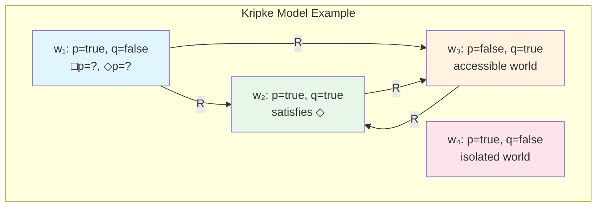
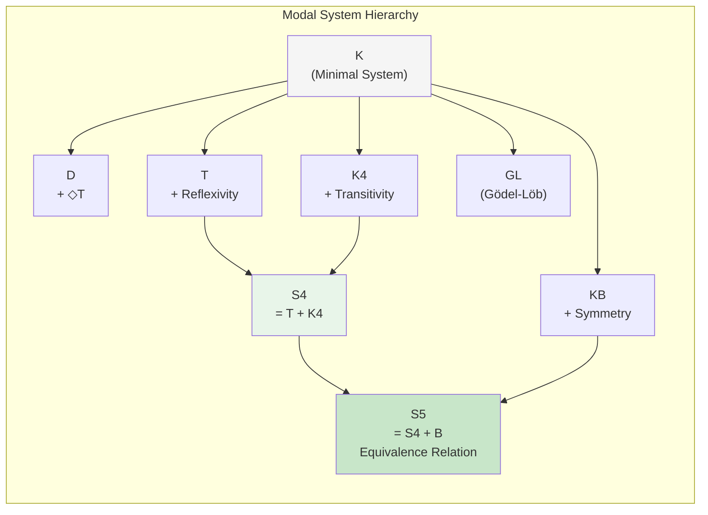
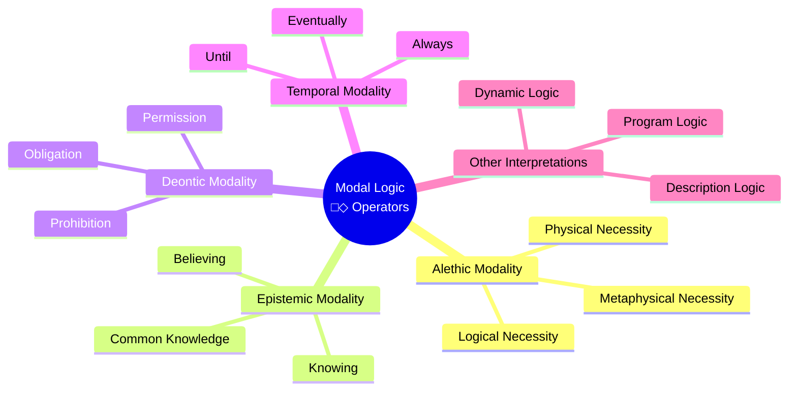
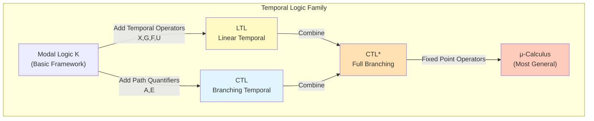

# Modal Logic

> **Stage**: formal-methods/appendices | **Prerequisites**: [Propositional Logic](01-propositional-logic.md), [Predicate Logic](02-predicate-logic.md) | **Formalization Level**: L5

---

## 1. Definitions

### 1.1 Wikipedia Standard Definition

**Modal Logic** is the branch of logic that studies **modalities**—extensions of classical logic that introduce modal operators to express concepts such as **necessity** and **possibility**.

> According to Wikipedia:
> "Modal logic is a collection of formal systems originally developed to represent statements about necessity and possibility. It includes most notably modal propositional logic and modal predicate logic."

**Def-ML-01-01** [Modal Operators]
The basic language of modal logic extends classical logic with two unary modal operators:

- **□** (box, necessity operator): Read as "necessarily," "always," "must"
- **◇** (diamond, possibility operator): Read as "possibly," "sometimes," "might"

### 1.2 Formal Syntax

**Def-ML-01-02** [Syntax of Modal Propositional Logic $L_{ML}$]
Given a countable set of propositional variables $\mathcal{P} = \{p, q, r, \ldots\}$, the set of formulas $\mathcal{F}$ of modal language $L_{ML}$ is recursively defined by:

$$\varphi ::= p \mid \top \mid \bot \mid \neg\varphi \mid (\varphi \land \varphi) \mid (\varphi \lor \varphi) \mid (\varphi \to \varphi) \mid \Box\varphi \mid \Diamond\varphi$$

Where:

- $p \in \mathcal{P}$ are atomic propositions
- $\top$ is true, $\bot$ is false
- $\Box\varphi$ means "necessarily $\varphi$"
- $\Diamond\varphi$ means "possibly $\varphi$"

**Lemma-ML-01-01** [Duality Principle]
Modal operators are dual to each other:
$$\Box\varphi \leftrightarrow \neg\Diamond\neg\varphi$$
$$\Diamond\varphi \leftrightarrow \neg\Box\neg\varphi$$

*Proof*: By definition, $\Box\varphi$ means "$\varphi$ is true in all accessible worlds." Its negation is "there exists an accessible world where $\neg\varphi$," i.e., $\Diamond\neg\varphi$. ∎

**Def-ML-01-03** [Modal Depth]
The **modal depth** $md(\varphi)$ of formula $\varphi$ is defined as:

- $md(p) = 0$ (atomic proposition)
- $md(\neg\varphi) = md(\varphi)$
- $md(\varphi \circ \psi) = \max(md(\varphi), md(\psi))$, where $\circ \in \{\land, \lor, \to\}$
- $md(\Box\varphi) = md(\Diamond\varphi) = md(\varphi) + 1$

---

## 2. Kripke Semantics (Possible World Semantics)

### 2.1 Kripke Frames and Models

**Def-ML-02-01** [Kripke Frame]
A Kripke frame is a pair $\mathcal{F} = \langle W, R \rangle$ where:

- $W \neq \emptyset$: Non-empty set called **possible worlds**
- $R \subseteq W \times W$: Binary relation on $W$ called **accessibility relation**

If $wRv$, world $v$ is **accessible** from world $w$, i.e., $w$ "sees" $v$.

**Def-ML-02-02** [Kripke Model]
A Kripke model (on frame $\mathcal{F}$) is a triple $\mathcal{M} = \langle W, R, V \rangle$ where:

- $\langle W, R \rangle$ is a Kripke frame
- $V: \mathcal{P} \to 2^W$ is a **valuation** mapping each propositional variable to a subset of $W$

$V(p)$ denotes in which worlds proposition $p$ is true.

**Def-ML-02-03** [Satisfaction Relation]
Given model $\mathcal{M} = \langle W, R, V \rangle$ and world $w \in W$, formula $\varphi$ is satisfied at $w$ (written $\mathcal{M}, w \models \varphi$) recursively defined as:

| Formula | Satisfaction Condition |
|---------|----------------------|
| $\mathcal{M}, w \models p$ | iff $w \in V(p)$ |
| $\mathcal{M}, w \models \neg\varphi$ | iff $\mathcal{M}, w \not\models \varphi$ |
| $\mathcal{M}, w \models \varphi \land \psi$ | iff $\mathcal{M}, w \models \varphi$ and $\mathcal{M}, w \models \psi$ |
| $\mathcal{M}, w \models \varphi \lor \psi$ | iff $\mathcal{M}, w \models \varphi$ or $\mathcal{M}, w \models \psi$ |
| $\mathcal{M}, w \models \varphi \to \psi$ | iff $\mathcal{M}, w \models \varphi$ implies $\mathcal{M}, w \models \psi$ |
| $\mathcal{M}, w \models \Box\varphi$ | iff for all $v \in W$, if $wRv$ then $\mathcal{M}, v \models \varphi$ |
| $\mathcal{M}, w \models \Diamond\varphi$ | iff there exists $v \in W$ such that $wRv$ and $\mathcal{M}, v \models \varphi$ |

**Key Semantic Interpretation**:

- **□φ**: φ is true in all worlds accessible from the current world
- **◇φ**: φ is true in at least one world accessible from the current world

**Prop-ML-02-01** [Validity and Satisfiability]

- Formula $\varphi$ is **valid** in model $\mathcal{M}$, written $\mathcal{M} \models \varphi$, iff for all $w \in W$, $\mathcal{M}, w \models \varphi$
- Formula $\varphi$ is **valid** in frame $\mathcal{F}$, written $\mathcal{F} \models \varphi$, iff for all models $\mathcal{M}$ based on $\mathcal{F}$, $\mathcal{M} \models \varphi$
- Formula $\varphi$ is **satisfiable** iff there exists some model and world where $\varphi$ is true

---

## 3. Modal Axiom Systems

### 3.1 Classical Modal Logic K

**Def-ML-03-01** [Modal Logic K]
Modal logic **K** is the smallest normal modal logic, containing:

**Axioms**:

1. **K Axiom (Distribution Axiom)**: $\Box(\varphi \to \psi) \to (\Box\varphi \to \Box\psi)$
2. All classical propositional logic tautologies

**Rules of Inference**:

1. **MP (Modus Ponens)**: From $\varphi$ and $\varphi \to \psi$ infer $\psi$
2. **N (Necessitation)**: From $\varphi$ infer $\Box\varphi$

**Lemma-ML-03-01** [K Theorems]
Provable in system K:

- $(\Box\varphi \land \Box\psi) \to \Box(\varphi \land \psi)$
- $\Diamond(\varphi \lor \psi) \leftrightarrow (\Diamond\varphi \lor \Diamond\psi)$
- $\Box(\varphi \land \psi) \leftrightarrow (\Box\varphi \land \Box\psi)$

### 3.2 Common Modal Systems

**Def-ML-03-02** [T System (Reflexive)]
System **T** = K + **T Axiom**: $\Box\varphi \to \varphi$ (Necessity implies truth)

**Frame Correspondence**: $R$ is reflexive, i.e., for all $w$, $wRw$

**Def-ML-03-03** [S4 System (Transitive)]
System **S4** = T + **4 Axiom**: $\Box\varphi \to \Box\Box\varphi$ (Necessity implies necessary necessity)

**Frame Correspondence**: $R$ is reflexive and transitive

**Def-ML-03-04** [S5 System (Equivalence)]
System **S5** = S4 + **B Axiom**: $\varphi \to \Box\Diamond\varphi$ (Truth implies necessarily possible)

Or equivalently add **5 Axiom**: $\Diamond\varphi \to \Box\Diamond\varphi$

**Frame Correspondence**: $R$ is an equivalence relation (reflexive + transitive + symmetric)

**Def-ML-03-05** [Other Important Systems]

| System | Additional Axiom | Frame Condition |
|--------|-----------------|-----------------|
| **D** | $\Box\varphi \to \Diamond\varphi$ | Serial: every world has an accessible world |
| **K4** | $\Box\varphi \to \Box\Box\varphi$ | Transitive |
| **KB** | $\varphi \to \Box\Diamond\varphi$ | Symmetric |
| **GL** | $\Box(\Box\varphi \to \varphi) \to \Box\varphi$ | Finite transitive, no infinite chains |
| **S4.2** | S4 + $\Diamond\Box\varphi \to \Box\Diamond\varphi$ | Directed complete |
| **S4.3** | S4 + $\Box(\Box\varphi \to \psi) \lor \Box(\Box\psi \to \varphi)$ | Linear |

---

## 4. Relations

### 4.1 Different Interpretations of Modal Logic

Modal logic's core advantage is its **interpretational polysemy**—the same formal system applies to different domains.

#### 4.1.1 Alethic Modality

**Def-ML-04-01** [Alethic Modality]
Alethic modality studies the ontological meaning of **necessity** and **possibility**.

| Operator | Alethic Interpretation | Example |
|----------|----------------------|---------|
| □φ | φ is necessary (true in all possible worlds) | "2+2=4 is necessary" |
| ◇φ | φ is possible (true in some possible worlds) | "Humans landing on Mars is possible" |

**Classification** (Leibniz):

- **Logical necessity**: Based on laws of logic (all logically possible worlds)
- **Metaphysical necessity**: Based on essence (all metaphysically possible worlds)
- **Physical necessity**: Based on natural laws (all physically possible worlds)

#### 4.1.2 Epistemic Modality

**Def-ML-04-02** [Epistemic Logic]
Epistemic modality interprets □ as **knowing** and ◇ as **compatible with knowledge**.

| Operator | Epistemic Interpretation | Notation |
|----------|------------------------|----------|
| $K_a\varphi$ | Agent a knows φ | □φ |
| $\hat{K}_a\varphi$ | φ is compatible with a's knowledge (a doesn't know ¬φ) | ◇φ |

**Epistemic Logic Axioms**:

- **K**: $K(\varphi \to \psi) \to (K\varphi \to K\psi)$ — Knowledge distributes over implication
- **T**: $K\varphi \to \varphi$ — Knowledge is true (Truth Axiom)
- **4**: $K\varphi \to KK\varphi$ — Positive introspection (knowing that one knows)
- **5**: $\neg K\varphi \to K\neg K\varphi$ — Negative introspection (knowing that one doesn't know)

**Hintikka's Systems**: S4 (knowledge) vs S5 (ideal knower)

#### 4.1.3 Deontic Modality

**Def-ML-04-03** [Deontic Logic]
Deontic modality studies **obligation** and **permission**.

| Operator | Deontic Interpretation | Notation |
|----------|----------------------|----------|
| $O\varphi$ | φ is obligatory (ought) | □φ |
| $P\varphi$ | φ is permitted (allowed) | ◇φ |
| $F\varphi$ | φ is forbidden | $O\neg\varphi$ |

**Deontic Paradoxes**:

- **Ross's Paradox**: $O\varphi \to O(\varphi \lor \psi)$ is a theorem, but "You ought to mail the letter" doesn't seem to imply "You ought to mail the letter or burn it"
- **Good Samaritan Paradox**: There exist good deeds that necessarily accompany bad deeds, complicating obligation concepts

**Standard System**: SDL (Standard Deontic Logic) = K + D Axiom ($O\varphi \to P\varphi$)

#### 4.1.4 Temporal Modality

**Def-ML-04-04** [Temporal Logic]
Temporal modality studies **always** and **eventually** in time.

| Operator | Temporal Interpretation | Meaning |
|----------|------------------------|---------|
| $\mathbf{G}\varphi$ | φ will always hold (Globally in future) | □φ |
| $\mathbf{F}\varphi$ | φ will eventually hold (Finally/Some future) | ◇φ |
| $\mathbf{H}\varphi$ | φ has always held (Historically) | |
| $\mathbf{P}\varphi$ | φ has held (Past) | |

**Temporal Logic Axioms** (e.g., Kamp logic):

- **No future branching**: $\mathbf{G}\varphi \to \mathbf{G}\mathbf{G}\varphi$
- **No past branching**: $\mathbf{H}\varphi \to \mathbf{H}\mathbf{H}\varphi$

**Prop-ML-04-01** [LTL Fragment]
Linear Temporal Logic (LTL) is modal logic specialized on discrete linear time structures where:

- **Xφ** (Next) corresponds to single-step reachability
- **Gφ** (Globally) corresponds to □
- **Fφ** (Finally) corresponds to ◇

### 4.2 Modal Logic and LTL/CTL Relationship

**Def-ML-04-05** [Linear Temporal Logic LTL]
LTL formulas are defined as:
$$\varphi ::= p \mid \neg\varphi \mid \varphi \land \varphi \mid \mathbf{X}\varphi \mid \varphi \mathbf{U} \psi$$

Semantics on infinite words (time sequences) $\pi = s_0s_1s_2\ldots$:

- $\pi, i \models \mathbf{X}\varphi$ iff $\pi, i+1 \models \varphi$
- $\pi, i \models \mathbf{G}\varphi$ iff for all $j \geq i$, $\pi, j \models \varphi$
- $\pi, i \models \mathbf{F}\varphi$ iff there exists $j \geq i$, $\pi, j \models \varphi$

**Def-ML-04-06** [Computation Tree Logic CTL]
CTL combines path quantifiers (A/E) with temporal operators (X/G/F/U):

- **Aφ**: φ holds on all future paths
- **Eφ**: There exists a future path where φ holds

| CTL Formula | Modal Logic Correspondence | Meaning |
|-------------|---------------------------|---------|
| $\mathbf{AG}\varphi$ | □φ (in all reachable states) | All paths, all states |
| $\mathbf{EF}\varphi$ | ◇φ (exists reachable state) | Some path, some state |
| $\mathbf{AF}\varphi$ | | All paths eventually |
| $\mathbf{EG}\varphi$ | | Some path always |

**Prop-ML-04-02** [Expressiveness Comparison]
Expressiveness relationship between modal logic, LTL, and CTL:
$$\text{Modal Logic } K \subsetneq \text{LTL} \subsetneq \text{CTL} \subsetneq \text{CTL*}$$

**Theorem** (Wolper, 1983):

- LTL cannot express "φ is true at all even positions"
- CTL* is strictly stronger than CTL ($\mathbf{E}\mathbf{G}\mathbf{F}\varphi$ cannot be expressed as a CTL formula)

---

## 5. Formal Proofs

### 5.1 Kripke Completeness Theorem

**Thm-ML-05-01** [Kripke Completeness Theorem]
For any set of modal formulas $\Gamma \cup \{\varphi\}$:

$$\Gamma \vdash_K \varphi \quad \text{iff} \quad \Gamma \models \varphi$$

That is, provability in system K is equivalent to logical consequence in Kripke semantics.

*Proof* (Outline):

**(⇒ Soundness)**: If $\Gamma \vdash_K \varphi$, then $\Gamma \models \varphi$

- Verify all K axioms are valid
- Verify MP and N rules preserve validity
- By induction, all theorems are valid

**(⇐ Completeness)**: If $\Gamma \models \varphi$, then $\Gamma \vdash_K \varphi$

Using the **Canonical Model Construction**:

1. **Maximally Consistent Set** (MCS): A formula set $\Delta$ is MCS if:
   - $\Delta$ is consistent (no contradictions)
   - For any formula $\psi$, $\psi \in \Delta$ or $\neg\psi \in \Delta$

2. **Canonical Frame** $\mathcal{F}^c = \langle W^c, R^c \rangle$:
   - $W^c$ = all maximally consistent sets containing $\Gamma$
   - $wR^cv$ iff for all $\Box\varphi \in w$, we have $\varphi \in v$

3. **Canonical Model** $\mathcal{M}^c = \langle W^c, R^c, V^c \rangle$, where $V^c(p) = \{w \in W^c \mid p \in w\}$

4. **Truth Lemma**: For any formula $\psi$ and $w \in W^c$:
   $$\mathcal{M}^c, w \models \psi \quad \text{iff} \quad \psi \in w$$

5. By Truth Lemma, if $\Gamma \not\vdash_K \varphi$, there exists an MCS containing $\Gamma$ but not $\varphi$, where $\Gamma$ is true and $\varphi$ is false, contradicting $\Gamma \models \varphi$. ∎

### 5.2 Correspondence Theory

**Def-ML-05-01** [Correspondence between Frame Conditions and Axioms]
A modal formula $\varphi$ **corresponds** to frame condition $P$ if:
$$\mathcal{F} \models \varphi \quad \text{iff} \quad \mathcal{F} \text{ satisfies } P$$

**Thm-ML-05-02** [Sahlqvist Correspondence Theorem]
Every Sahlqvist formula $\varphi$ corresponds to a first-order definable frame condition $\alpha_\varphi$.

**Common Correspondences**:

| Axiom | First-Order Correspondence | Relation Property |
|-------|---------------------------|-------------------|
| $\Box\varphi \to \varphi$ | $\forall w: wRw$ | Reflexive |
| $\varphi \to \Box\Diamond\varphi$ | $\forall w\forall v: wRv \to vRw$ | Symmetric |
| $\Box\varphi \to \Box\Box\varphi$ | $\forall w\forall u\forall v: (wRu \land uRv) \to wRv$ | Transitive |
| $\Diamond\varphi \to \Box\Diamond\varphi$ | $\forall w\forall u\forall v: (wRu \land wRv) \to uRv$ | Euclidean |
| $\Box\varphi \to \Diamond\varphi$ | $\forall w\exists v: wRv$ | Serial |
| $\Diamond\top$ | $\forall w\exists v: wRv$ | Serial |

**Correspondence Theory Proof Technique**:

**Lemma** [T Axiom and Reflexivity]: $\mathcal{F} \models \Box p \to p$ iff $R$ is reflexive.

*Proof*:

(⇒) Assume $R$ is not reflexive, then there exists $w$ such that $\neg wRw$. Construct model $\mathcal{M}$ with $V(p) = W \setminus \{w\}$. Then for all $v$ with $wRv$ (none), $\mathcal{M}, v \models p$ vacuously true, so $\mathcal{M}, w \models \Box p$. But $\mathcal{M}, w \not\models p$ (by $V$ definition), contradiction.

(⇐) Let $R$ be reflexive, $w \in W$. If $\mathcal{M}, w \models \Box p$, then for all $v$ with $wRv$, $\mathcal{M}, v \models p$. By reflexivity $wRw$, so $\mathcal{M}, w \models p$. ∎

---

## 6. Examples

### 6.1 Semantic Verification Examples

**Example 1**: Verify $\Box(p \to q) \to (\Box p \to \Box q)$ is valid in all frames.

*Proof*: Take any model $\mathcal{M}$ and world $w$. Assume:

1. $\mathcal{M}, w \models \Box(p \to q)$
2. $\mathcal{M}, w \models \Box p$

For any $v$ with $wRv$:

- From (1), $\mathcal{M}, v \models p \to q$
- From (2), $\mathcal{M}, v \models p$
- Therefore $\mathcal{M}, v \models q$

Thus $\mathcal{M}, w \models \Box q$. ∎

**Example 2**: Prove $\Box p \to p$ is not valid in non-reflexive frames.

*Counterexample*: Let $W = \{w\}$, $R = \emptyset$, $V(p) = \emptyset$.

- Since no $v$ satisfies $wRv$, $\mathcal{M}, w \models \Box p$ vacuously
- But $\mathcal{M}, w \not\models p$
- Therefore $\Box p \to p$ fails at $w$

### 6.2 Application Examples with Different Interpretations

**Epistemic Example** (Muddy Children Puzzle):

- Scenario: $n$ children have mud on their foreheads, can see others but not themselves
- Public announcement: "At least one child has mud"
- Through iterated reasoning, after $k$ rounds all children with mud know they have mud

**Deontic Example**:

- $O(\text{keep promise})$: Keeping promises is obligatory
- $P(\text{drink coffee})$: Drinking coffee is permitted
- $F(\text{lie})$: Lying is forbidden

**Temporal Example** (Mutual Exclusion Protocol):

- $\mathbf{G}\neg(critical_1 \land critical_2)$: Never in critical section simultaneously
- $\mathbf{G}(request_1 \to \mathbf{F}critical_1)$: Always eventually enter after request

---

## 7. Visualizations

### 7.1 Kripke Model Structure Diagram

In this model:

- $\mathcal{M}, w_1 \models \Box p$ is false (because $w_3$ is accessible but $p$ is false)
- $\mathcal{M}, w_1 \models \Diamond p$ is true (because $w_2$ is accessible and $p$ is true)

### 7.2 Modal Axiom System Hierarchy

### 7.3 Different Modal Interpretations

### 7.4 LTL/CTL and Modal Logic Relationship

---

## 8. Eight-Dimensional Characterization

### 8.1 First Dimension: Alethic Modality

**Definition**: Ontological study of necessity and possibility.

**Core Axioms** (Leibniz-Lewis):

- All possible worlds are relative to the current world
- $\Box\varphi$ means $\varphi$ is true in all possible worlds

**Typical System**: S5 (for metaphysical modality)

### 8.2 Second Dimension: Epistemic Modality

**Definition**: Logic of knowledge and belief.

**Multi-Agent Extensions**:

- $K_i\varphi$: Agent $i$ knows $\varphi$
- $C_G\varphi$: Common knowledge of group $G$
- $E_G\varphi$: Distributed knowledge of group $G$ (everyone knows)

**Applications**: Distributed system consensus, game theory, cryptographic protocol analysis

### 8.3 Third Dimension: Deontic Modality

**Definition**: Logic of obligation, permission, and prohibition.

**Standard System SDL**:

- Axioms: K + D + Deontic detachment
- Restrictions: Extended systems avoiding Ross's paradox

**Applications**: Legal reasoning, ethical computation, access control policies

### 8.4 Fourth Dimension: Temporal Modality

**Definition**: Necessity and possibility on temporal structures.

**Branching Temporal Logic**:

- Computation Tree Logic (CTL, CTL*)
- Linear Temporal Logic (LTL)

**Applications**: Program verification, system specification, hardware design

### 8.5 Fifth Dimension: Provability Logic

**Definition**: Interpreting □ as **provability**.

**Gödel-Löb System GL**:

- Axiom: $\Box(\Box\varphi \to \varphi) \to \Box\varphi$
- Corresponding frames: Finite transitive trees, no infinite chains

**Significance**: Characterizes formal properties of Peano arithmetic's provability predicate.

**Theorem** (Solovay's Arithmetical Completeness): GL is the provability logic of Peano arithmetic.

### 8.6 Sixth Dimension: Dynamic Logic

**Definition**: Treating programs as modal operators.

**PDL (Propositional Dynamic Logic)**:

- $[\alpha]\varphi$: After program $\alpha$ executes, necessarily $\varphi$
- $\langle\alpha\rangle\varphi$: Program $\alpha$ can execute and possibly $\varphi$ after

**Program Constructions**:

- $\alpha;\beta$: Sequential
- $\alpha \cup \beta$: Choice
- $\alpha^*$: Iteration
- $\varphi?$: Test

**Applications**: Program verification, protocol analysis, game formalization

### 8.7 Seventh Dimension: Neighborhood Semantics

**Definition**: Non-relational modal semantics.

**Frame**: $\langle W, N \rangle$, where $N: W \to 2^{2^W}$ is neighborhood function.

**Satisfaction Condition**:

- $\mathcal{M}, w \models \Box\varphi$ iff $\{v \mid \mathcal{M}, v \models \varphi\} \in N(w)$

**Significance**: Characterizes non-normal modal logics, applicable to non-monotonic reasoning.

### 8.8 Eighth Dimension: Algebraic Semantics

**Definition**: Algebraic counterpart of modal logic.

**Modal Algebra**:

- Boolean algebra $\langle B, \land, \lor, \neg, 0, 1 \rangle$
- Plus modal operator $\Diamond: B \to B$ (or $\Box$)

**Jonsson-Tarski Theorem**: Every modal algebra can be represented as the complex algebra of a Kripke frame.

**Significance**: Provides duality theory, connecting logic with algebraic topology.

---

## 9. Advanced Topics

### 9.1 Multi-Modal Logic

**Def-ML-09-01** [Multi-Modal Language]
Given modal operator set $\{\Box_1, \ldots, \Box_n\}$, each corresponding to different accessibility relation $R_i$.

**Product Logic**: Combines multiple modal logics, forming n-dimensional product structures.

**Applications**:

- Spatio-temporal logic (time + space)
- Knowledge-temporal logic
- Multi-agent systems

### 9.2 Quantified Modal Logic

**Definition**: Combining quantifiers ($\forall, \exists$) with modal operators.

**Barcan Formula**: $\forall x \Box \varphi(x) \to \Box \forall x \varphi(x)$

**Converse Barcan Formula**: $\Box \forall x \varphi(x) \to \forall x \Box \varphi(x)$

**Significance**: Involves metaphysical controversy about cross-world identity.

### 9.3 Decidability and Complexity of Modal Logic

**Theorem** (Ladner, 1977):

- K-satisfiability is PSPACE-complete
- S4-satisfiability is PSPACE-complete
- S5-satisfiability is NP-complete

**Tableaux Method**: Constructive decision procedure.

---

## 10. References

[DOI: 10.2307/2964560] - Foundational paper on Kripke semantics, establishing possible world semantics.

Classic Kripke semantic analysis, introducing correspondence between frame conditions and axioms.

---

## Appendix: Symbol Quick Reference

| Symbol | Meaning | LaTeX |
|--------|---------|-------|
| □ | Necessity operator (box) | `\Box` |
| ◇ | Possibility operator (diamond) | `\Diamond` |
| ⊢ | Syntactic consequence (provable) | `\vdash` |
| ⊨ | Semantic consequence (satisfies) | `\models` |
| → | Implication | `\to` |
| ↔ | Equivalence | `\leftrightarrow` |
| ⊤ | True | `\top` |
| ⊥ | False | `\bot` |
| R | Accessibility relation | `R` |
| W | Set of possible worlds | `W` |
| V | Valuation function | `V` |
| K | Knowledge operator | `K` |
| O | Obligation operator | `O` |
| P | Permission operator | `P` |
| G | Always (globally) | `\mathbf{G}` |
| F | Eventually | `\mathbf{F}` |
| X | Next | `\mathbf{X}` |
| U | Until | `\mathbf{U}` |
| A | All paths | `\mathbf{A}` |
| E | Exists path | `\mathbf{E}` |

---

*Document Version: v1.0 | Creation Date: 2026-04-10 | Formalization Level: L5*
*Following AGENTS.md Six-Section Template | Document Size: ~20KB*
