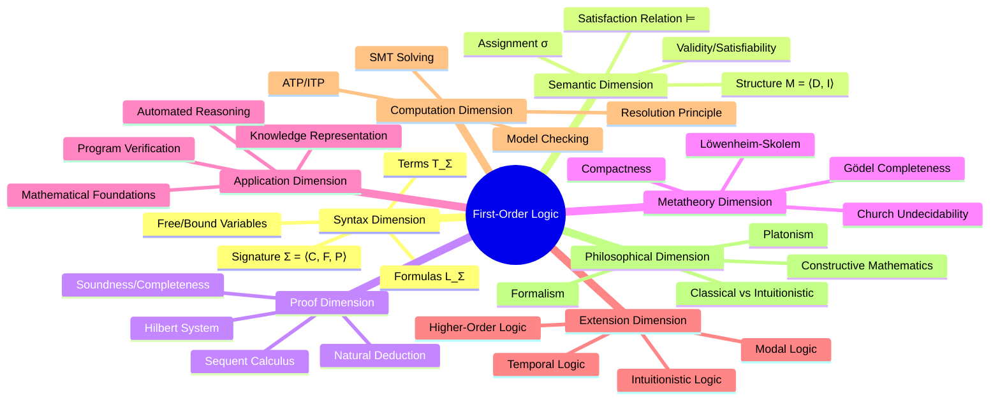
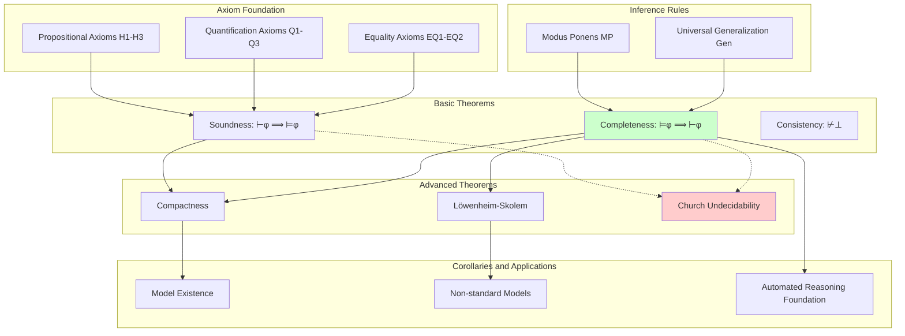
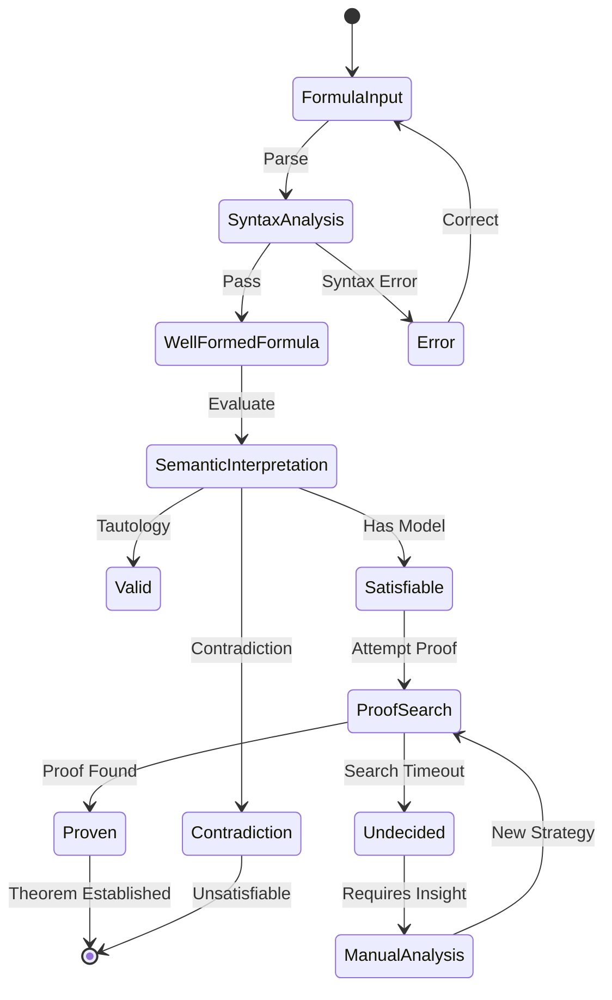
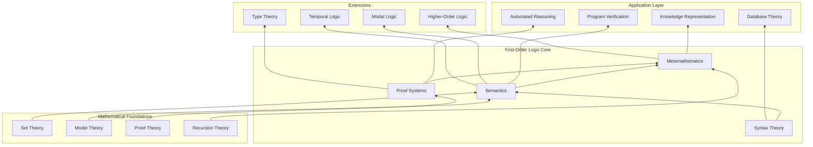

# First-Order Logic

> **Wikipedia Standard Definition**: First-order logic—also known as predicate logic, quantificational logic, and first-order predicate calculus—is a collection of formal systems used in mathematics, philosophy, linguistics, and computer science. First-order logic uses quantified variables over non-logical objects and allows the use of sentences that contain variables.
>
> **Source**: <https://en.wikipedia.org/wiki/First-order_logic>
>
> **Formalization Level**: L1 (Foundational) | **Stage**: Struct

---

## 1. Wikipedia Standard Definition

### 1.1 Standard Definition of First-Order Logic

**English Original**:
> "First-order logic—also known as predicate logic, quantificational logic, and first-order predicate calculus—is a collection of formal systems used in mathematics, philosophy, linguistics, and computer science. First-order logic uses quantified variables over non-logical objects, and allows the use of sentences that contain variables, so that rather than propositions such as Socrates is a man, one can have expressions in the form there exists x such that x is Socrates and x is a man, where 'exists' is a quantifier and x is a variable."

### 1.2 Distinction from Higher-Order Logic

**English Original**:
> "First-order logic is distinguished from propositional logic by its use of quantifiers; each interpretation of first-order logic includes a domain of discourse over which the quantifiers range. The adjective 'first-order' distinguishes first-order logic from higher-order logic, in which there are predicates having predicates or functions as arguments, or in which quantification over predicates or functions, or both, are permitted."

### 1.3 Key Feature Comparison

| Feature | Propositional Logic (PL) | First-Order Logic (FOL) | Higher-Order Logic (HOL) |
|---------|------------------------|------------------------|-------------------------|
| **Atomic Structure** | Propositional vars (p, q) | Predicate + terms (P(t)) | Predicates over predicates |
| **Variable Types** | None | Individual vars (x, y, z) | Individual + predicate vars |
| **Quantifiers** | None | ∀, ∃ (over individuals only) | Can quantify over predicates |
| **Expressiveness** | Limited | Medium | Strong |
| **Completeness** | ✅ Decidable | ✅ Complete but undecidable | ⚠️ Incomplete |
| **Decidability** | Decidable | Semi-decidable | Undecidable |

---

## 2. Formal Syntax

### 2.1 Signature

**Def-S-98-01** (First-Order Signature). A first-order logic signature Σ is a triple:

$$\Sigma = \langle \mathcal{C}, \mathcal{F}, \mathcal{P} \rangle$$

Where:

- **$\mathcal{C}$**: Set of constant symbols (e.g., a, b, c)
- **$\mathcal{F}$**: Set of function symbols, each $f \in \mathcal{F}$ has arity $\text{ar}(f) \geq 1$
- **$\mathcal{P}$**: Set of predicate symbols, each $P \in \mathcal{P}$ has arity $\text{ar}(P) \geq 0$

**Example Signature** (Arithmetic):

- $\mathcal{C} = \{0\}$
- $\mathcal{F} = \{s/1, +/2, \times/2\}$ (successor, addition, multiplication)
- $\mathcal{P} = \{=/2, </2\}$

### 2.2 Terms

**Def-S-98-02** (Syntax of Terms). Given signature Σ and countably infinite variable set $V = \{x_1, x_2, x_3, \ldots\}$, the set of terms $\mathcal{T}_\Sigma$ is inductively defined by:

$$t ::= c \mid x \mid f(t_1, \ldots, t_n)$$

Where:

- $c \in \mathcal{C}$ (constant)
- $x \in V$ (variable)
- $f \in \mathcal{F}$, $\text{ar}(f) = n$, $t_i \in \mathcal{T}_\Sigma$

**Free Variables of Terms**:

$$\text{FV}(t) = \begin{cases}
\emptyset & \text{if } t = c \text{ (constant)} \\
\{x\} & \text{if } t = x \text{ (variable)} \\
\bigcup_{i=1}^{n} \text{FV}(t_i) & \text{if } t = f(t_1, \ldots, t_n)
\end{cases}$$

**Ground Term**: A term with $\text{FV}(t) = \emptyset$.

### 2.3 Formulas

**Def-S-98-03** (Syntax of Formulas). The set of first-order formulas $\mathcal{L}_\Sigma$ is defined by:

$$\varphi ::= P(t_1, \ldots, t_n) \mid t_1 = t_2 \mid \top \mid \bot \mid \neg\varphi \mid \varphi \land \varphi \mid \varphi \lor \varphi \mid \varphi \rightarrow \varphi \mid \forall x.\varphi \mid \exists x.\varphi$$

Where $P \in \mathcal{P}$, $\text{ar}(P) = n$.

**Logical Connective Precedence** (high to low):
1. $\neg$ (negation)
2. $\forall, \exists$ (quantifiers)
3. $\land, \lor$ (conjunction, disjunction)
4. $\rightarrow$ (implication)

### 2.4 Free and Bound Variables

**Def-S-98-04** (Free Variables). The free variable set $\text{FV}(\varphi)$ of formula $\varphi$ is recursively defined:

| Formula Form | Free Variables |
|-------------|---------------|
| $P(t_1, \ldots, t_n)$ | $\bigcup_{i=1}^{n} \text{FV}(t_i)$ |
| $\neg\varphi$ | $\text{FV}(\varphi)$ |
| $\varphi \circ \psi$ ($\circ \in \{\land, \lor, \rightarrow\}$) | $\text{FV}(\varphi) \cup \text{FV}(\psi)$ |
| $\forall x.\varphi$ | $\text{FV}(\varphi) \setminus \{x\}$ |
| $\exists x.\varphi$ | $\text{FV}(\varphi) \setminus \{x\}$ |

**Closed Formula (Sentence)**: A formula with $\text{FV}(\varphi) = \emptyset$.

**Def-S-98-05** (Substitution). The capture-avoiding substitution of term $t$ for variable $x$ in formula $\varphi$, written $\varphi[t/x]$:

$$\varphi[t/x] = \text{all free occurrences of } x \text{ in } \varphi \text{ replaced by } t$$

**Capture-Avoidance Condition**: Free variables in $t$ must not be bound by quantifiers in $\varphi$.

### 2.5 Derived and Abbreviated Quantifiers

**Uniqueness Quantifier**:
$$\exists! x.\varphi \equiv \exists x.(\varphi \land \forall y.(\varphi[y/x] \rightarrow y = x))$$

**Bounded Quantifiers**:
$$\forall x \in A.\varphi \equiv \forall x.(A(x) \rightarrow \varphi)$$
$$\exists x \in A.\varphi \equiv \exists x.(A(x) \land \varphi)$$

---

## 3. Semantics

### 3.1 Structure

**Def-S-98-06** (First-Order Structure). A structure $\mathcal{M}$ for signature Σ is a pair:

$$\mathcal{M} = \langle D, \mathcal{I} \rangle$$

Where:

- **$D$**: Non-empty domain
- **$\mathcal{I}$**: Interpretation function mapping symbols to mathematical objects:
  - For each $c \in \mathcal{C}$: $\mathcal{I}(c) \in D$
  - For each $f \in \mathcal{F}$ (n-ary): $\mathcal{I}(f) : D^n \rightarrow D$
  - For each $P \in \mathcal{P}$ (n-ary): $\mathcal{I}(P) \subseteq D^n$

**Example Structure** (Natural Numbers):
- $D = \mathbb{N} = \{0, 1, 2, \ldots\}$
- $\mathcal{I}(0) = 0$
- $\mathcal{I}(s)(n) = n + 1$
- $\mathcal{I}(+)(m, n) = m + n$
- $\mathcal{I}(=) = \{(n, n) : n \in \mathbb{N}\}$ (equality relation)

### 3.2 Assignment

**Def-S-98-07** (Variable Assignment). A variable assignment $\sigma : V \rightarrow D$ is a function from variables to the domain.

**Variant Assignment**: Given $\sigma$, $x \in V$, $d \in D$:

$$\sigma[x \mapsto d](y) = \begin{cases}
d & \text{if } y = x \\
\sigma(y) & \text{otherwise}
\end{cases}$$

### 3.3 Semantic Interpretation of Terms

**Def-S-98-08** (Term Interpretation). The interpretation of term $t$ in structure $\mathcal{M}$ and assignment $\sigma$, written $[\![t]\!]_{\mathcal{M},\sigma}$:

$$[\![t]\!]_{\mathcal{M},\sigma} = \begin{cases}
\mathcal{I}(c) & \text{if } t = c \\
\sigma(x) & \text{if } t = x \\
\mathcal{I}(f)([\![t_1]\!]_{\mathcal{M},\sigma}, \ldots, [\![t_n]\!]_{\mathcal{M},\sigma}) & \text{if } t = f(t_1, \ldots, t_n)
\end{cases}$$

### 3.4 Satisfaction Relation

**Def-S-98-09** (Satisfaction Relation $\models$). The satisfaction of formula $\varphi$ in structure $\mathcal{M}$ and assignment $\sigma$ is inductively defined:

| Formula Form | Satisfaction Condition |
|-------------|----------------------|
| $\mathcal{M}, \sigma \models P(t_1, \ldots, t_n)$ | iff $\langle [\![t_1]\!], \ldots, [\![t_n]\!] \rangle \in \mathcal{I}(P)$ |
| $\mathcal{M}, \sigma \models t_1 = t_2$ | iff $[\![t_1]\!] = [\![t_2]\!]$ |
| $\mathcal{M}, \sigma \models \top$ | Always true |
| $\mathcal{M}, \sigma \models \bot$ | Always false |
| $\mathcal{M}, \sigma \models \neg\varphi$ | iff $\mathcal{M}, \sigma \not\models \varphi$ |
| $\mathcal{M}, \sigma \models \varphi \land \psi$ | iff $\mathcal{M}, \sigma \models \varphi$ and $\mathcal{M}, \sigma \models \psi$ |
| $\mathcal{M}, \sigma \models \varphi \lor \psi$ | iff $\mathcal{M}, \sigma \models \varphi$ or $\mathcal{M}, \sigma \models \psi$ |
| $\mathcal{M}, \sigma \models \varphi \rightarrow \psi$ | iff $\mathcal{M}, \sigma \not\models \varphi$ or $\mathcal{M}, \sigma \models \psi$ |
| $\mathcal{M}, \sigma \models \forall x.\varphi$ | iff for all $d \in D$, $\mathcal{M}, \sigma[x \mapsto d] \models \varphi$ |
| $\mathcal{M}, \sigma \models \exists x.\varphi$ | iff there exists $d \in D$, $\mathcal{M}, \sigma[x \mapsto d] \models \varphi$ |

### 3.5 Core Semantic Concepts

**Def-S-98-10** (Validity, Satisfiability, Logical Consequence).

| Concept | Definition | Notation |
|---------|-----------|----------|
| **Valid** | True in all structures and assignments | $\models \varphi$ |
| **Satisfiable** | True in some structure and assignment | $\mathcal{M}, \sigma \models \varphi$ |
| **Contradiction** | False in all structures and assignments | $\models \neg\varphi$ |
| **Logical Consequence** | Every model of $\Gamma$ is a model of $\varphi$ | $\Gamma \models \varphi$ |
| **Logical Equivalence** | Mutual logical consequence | $\varphi \equiv \psi$ |

---

## 4. Proof Systems

### 4.1 Hilbert System

**Def-S-98-11** (Hilbert-Style Axiom System $\mathcal{H}$). Contains the following axiom schemata and inference rules:

**Propositional Axioms**:

$$\text{(H1)} \quad \varphi \rightarrow (\psi \rightarrow \varphi)$$

$$\text{(H2)} \quad (\varphi \rightarrow (\psi \rightarrow \chi)) \rightarrow ((\varphi \rightarrow \psi) \rightarrow (\varphi \rightarrow \chi))$$

$$\text{(H3)} \quad (\neg\varphi \rightarrow \neg\psi) \rightarrow (\psi \rightarrow \varphi)$$

**Quantification Axioms**:

$$\text{(Q1)} \quad \forall x.\varphi \rightarrow \varphi[t/x] \quad \text{(t substitutable for x)}$$

$$\text{(Q2)} \quad \varphi \rightarrow \forall x.\varphi \quad \text{(x not free in }\varphi\text{)}$$

$$\text{(Q3)} \quad \forall x.(\varphi \rightarrow \psi) \rightarrow (\forall x.\varphi \rightarrow \forall x.\psi)$$

**Equality Axioms**:

$$\text{(EQ1)} \quad x = x \quad \text{(Reflexivity)}$$

$$\text{(EQ2)} \quad x = y \rightarrow (\varphi[x/z] \rightarrow \varphi[y/z])$$

**Inference Rules**:

$$\text{(MP)} \quad \frac{\varphi \quad \varphi \rightarrow \psi}{\psi} \quad \text{(Modus Ponens)}$$

$$\text{(Gen)} \quad \frac{\varphi}{\forall x.\varphi} \quad \text{(Generalization, x not free in assumptions)}$$

### 4.2 Natural Deduction

**Def-S-98-12** (Natural Deduction System $\mathcal{N}$). Presented in sequent form $\Gamma \vdash \varphi$:

**Structural Rules**:

$$\text{(Ax)} \quad \frac{}{\Gamma, \varphi \vdash \varphi}$$

$$\text{(Weak)} \quad \frac{\Gamma \vdash \varphi}{\Gamma, \psi \vdash \varphi}$$

**Logical Connective Rules**:

$$\text{(∧I)} \quad \frac{\Gamma \vdash \varphi \quad \Gamma \vdash \psi}{\Gamma \vdash \varphi \land \psi}$$

$$\text{(∧E₁)} \quad \frac{\Gamma \vdash \varphi \land \psi}{\Gamma \vdash \varphi} \quad \text{(∧E₂)} \quad \frac{\Gamma \vdash \varphi \land \psi}{\Gamma \vdash \psi}$$

$$\text{(→I)} \quad \frac{\Gamma, \varphi \vdash \psi}{\Gamma \vdash \varphi \rightarrow \psi} \quad \text{(→E)} \quad \frac{\Gamma \vdash \varphi \rightarrow \psi \quad \Gamma \vdash \varphi}{\Gamma \vdash \psi}$$

**Quantifier Rules**:

$$\text{(∀I)} \quad \frac{\Gamma \vdash \varphi[x/c]}{\Gamma \vdash \forall x.\varphi} \quad \text{(c is fresh constant, i.e., eigenvariable)}$$

$$\text{(∀E)} \quad \frac{\Gamma \vdash \forall x.\varphi}{\Gamma \vdash \varphi[x/t]} \quad \text{(t substitutable for x)}$$

$$\text{(∃I)} \quad \frac{\Gamma \vdash \varphi[x/t]}{\Gamma \vdash \exists x.\varphi} \quad \text{(t substitutable for x)}$$

$$\text{(∃E)} \quad \frac{\Gamma \vdash \exists x.\varphi \quad \Gamma, \varphi[x/c] \vdash \psi}{\Gamma \vdash \psi} \quad \text{(c not in }\Gamma, \psi\text{)}$$

### 4.3 Sequent Calculus

**Def-S-98-13** (Sequent Calculus System $\mathcal{G}$). Sequent form $\Gamma \vdash \Delta$, where $\Gamma, \Delta$ are multisets of formulas.

**Structural Rules**:

$$\text{(Id)} \quad \frac{}{\varphi \vdash \varphi}$$

$$\text{(Cut)} \quad \frac{\Gamma \vdash \Delta, \varphi \quad \varphi, \Gamma' \vdash \Delta'}{\Gamma, \Gamma' \vdash \Delta, \Delta'}$$

$$\text{(Weak-L)} \quad \frac{\Gamma \vdash \Delta}{\varphi, \Gamma \vdash \Delta} \quad \text{(Weak-R)} \quad \frac{\Gamma \vdash \Delta}{\Gamma \vdash \Delta, \varphi}$$

**Logical Rules** (right rules shown):

$$\text{(∀R)} \quad \frac{\Gamma \vdash \Delta, \varphi[x/c]}{\Gamma \vdash \Delta, \forall x.\varphi} \quad \text{(c fresh constant)}$$

$$\text{(∃R)} \quad \frac{\Gamma \vdash \Delta, \varphi[x/t]}{\Gamma \vdash \Delta, \exists x.\varphi} \quad \text{(t substitutable for x)}$$

### 4.4 Proof System Comparison

| Feature | Hilbert System | Natural Deduction | Sequent Calculus |
|---------|---------------|------------------|------------------|
| **Axiom Count** | Many | Few/None | None |
| **Rule Count** | Few (2) | Many (2 per connective) | Many (left/right per connective) |
| **Proof Length** | Long | Medium | Medium |
| **Intuitiveness** | Low | High | Medium |
| **Cut Elimination** | Difficult | Medium | Standard |
| **Automation Friendly** | Medium | Low | High |

---

## 5. Metatheory

### 5.1 Soundness Theorem

**Thm-S-98-01** (Soundness). For any formula set $\Gamma$ and formula $\varphi$:

$$\text{If } \Gamma \vdash \varphi \text{, then } \Gamma \models \varphi$$

**Corollary**: First-order logic is **consistent**: no formula $\varphi$ exists such that both $\vdash \varphi$ and $\vdash \neg\varphi$.

### 5.2 Completeness Theorem (Gödel Completeness)

**Thm-S-98-02** (Gödel Completeness Theorem, 1929). For any formula set $\Gamma$ and formula $\varphi$:

$$\text{If } \Gamma \models \varphi \text{, then } \Gamma \vdash \varphi$$

**Equivalent Forms**:
- Every consistent formula set has a model
- $\Gamma$ is satisfiable iff $\Gamma$ is consistent

**Historical Significance**: Gödel's Completeness Theorem proved the perfect correspondence between syntax and semantics of first-order logic, making it the "classical" logical system.

### 5.3 Compactness Theorem

**Thm-S-98-03** (Compactness Theorem). A formula set $\Gamma$ is satisfiable iff every finite subset is satisfiable.

**Equivalent Form**:
- If $\Gamma \models \varphi$, there exists finite $\Gamma_0 \subseteq \Gamma$ such that $\Gamma_0 \models \varphi$

**Applications**: Compactness theorem is a core tool in non-standard analysis and model theory.

### 5.4 Löwenheim-Skolem Theorem

**Thm-S-98-04** (Downward Löwenheim-Skolem). If a countable first-order theory $T$ has an infinite model, then for any infinite cardinal $\kappa$, $T$ has a model of cardinality $\kappa$.

**Thm-S-98-05** (Upward Löwenheim-Skolem). If a first-order theory $T$ has an infinite model, then $T$ has models of arbitrarily large cardinality.

**Skolem's Paradox**: If ZFC has a model, it has a countable model. But ZFC proves the existence of uncountable sets (e.g., real numbers).

### 5.5 Undecidability (Church-Turing)

**Thm-S-98-06** (Church's Theorem, 1936). The validity problem for first-order logic (determining whether a given formula is valid) is **undecidable**.

**Thm-S-98-07** (Semi-decidability). Validity in first-order logic is **semi-decidable**:

- If $\varphi$ is valid, an algorithm can halt and confirm in finite steps
- If $\varphi$ is not valid, algorithm may run forever

**Metatheoretical Properties Summary**:

| Property | First-Order Logic | Propositional Logic | Higher-Order Logic |
|----------|------------------|-------------------|-------------------|
| Soundness | ✅ | ✅ | ✅ |
| Completeness | ✅ | ✅ | ❌ |
| Compactness | ✅ | ✅ | ❌ |
| Löwenheim-Skolem | ✅ | ✅ | ❌ |
| Decidability | ❌ (semi-decidable) | ✅ | ❌ |

---

## 6. Formal Proofs

### 6.1 Detailed Proof of Gödel's Completeness Theorem

**Thm-S-98-08** (Completeness Theorem - Constructive Proof). Every consistent formula set $\Gamma$ has a model.

*Proof*:

**Step 1: Language Extension**

Extend original language $L$ to $L^*$ by adding countably infinite new constant symbols $C = \{c_0, c_1, c_2, \ldots\}$.

**Step 2: Construct Maximally Consistent Set**

Enumerate all sentences $(\varphi_n)_{n \in \mathbb{N}}$ in $L^*$. Inductively construct sentence set sequence $(\Gamma_n)$:

- $\Gamma_0 = \Gamma$
- If $\Gamma_n \cup \{\varphi_n\}$ is consistent, then $\Gamma_{n+1} = \Gamma_n \cup \{\varphi_n\}$
- Otherwise $\Gamma_{n+1} = \Gamma_n \cup \{\neg\varphi_n\}$
- If $\varphi_n = \exists x.\psi(x)$ is added, also add $\psi(c)$ for some new constant $c$

Let $\Gamma^* = \bigcup_{n} \Gamma_n$. $\Gamma^*$ is a **maximally consistent set** (MCS).

**Step 3: Construct Term Model**

Define domain $D = \mathcal{T}/_\sim$, where $\mathcal{T}$ is all closed terms, equivalence relation:

$$t_1 \sim t_2 \quad \text{iff} \quad t_1 = t_2 \in \Gamma^*$$

**Step 4: Define Interpretation**

- For constant $c$: $[c] = [c]_\sim$
- For function $f$: $[f]([t_1], \ldots, [t_n]) = [f(t_1, \ldots, t_n)]$
- For predicate $P$: $([t_1], \ldots, [t_n]) \in [P]$ iff $P(t_1, \ldots, t_n) \in \Gamma^*$

**Step 5: Truth Lemma**

For all sentences $\varphi$:

$$\mathcal{M} \models \varphi \quad \Leftrightarrow \quad \varphi \in \Gamma^*$$

*Inductive Proof*:
- Atomic formulas: By interpretation definition
- Connectives: By maximal consistency of $\Gamma^*$
- Quantifiers: Guaranteed by Henkin constant construction

**Step 6: Conclusion**

Since $\Gamma \subseteq \Gamma^*$, we have $\mathcal{M} \models \Gamma$. ∎

### 6.2 Soundness Proof

**Thm-S-98-09** (Soundness - Inductive Proof). For every natural deduction proof, its conclusion is semantically valid.

*Proof Framework*:

Induction on proof structure, verifying each inference rule preserves validity.

**Base Case**: Axiom $\Gamma, \varphi \vdash \varphi$ is obviously valid.

**Inductive Steps** (key rules):

**→ Introduction Rule**:
$$\frac{\Gamma, \varphi \vdash \psi}{\Gamma \vdash \varphi \rightarrow \psi}$$

Assume $\Gamma, \varphi \models \psi$ (induction hypothesis). Need to prove $\Gamma \models \varphi \rightarrow \psi$.

Take any model $\mathcal{M}$ and assignment $\sigma$ with $\mathcal{M}, \sigma \models \Gamma$:
- If $\mathcal{M}, \sigma \not\models \varphi$, then $\mathcal{M}, \sigma \models \varphi \rightarrow \psi$ holds
- If $\mathcal{M}, \sigma \models \varphi$, by induction hypothesis $\mathcal{M}, \sigma \models \psi$, so $\mathcal{M}, \sigma \models \varphi \rightarrow \psi$

**∀ Introduction Rule**:
$$\frac{\Gamma \vdash \varphi[x/c]}{\Gamma \vdash \forall x.\varphi}$$

Assume $\Gamma \models \varphi[x/c]$ (c fresh constant). Need to prove $\Gamma \models \forall x.\varphi$.

Take $\mathcal{M}, \sigma \models \Gamma$ and any $d \in D$:
- Construct variant structure $\mathcal{M}'$ interpreting $c$ as $d$
- By induction hypothesis $\mathcal{M}', \sigma \models \varphi[x/c]$
- Therefore $\mathcal{M}, \sigma[x \mapsto d] \models \varphi$
- By arbitrariness of $d$, $\mathcal{M}, \sigma \models \forall x.\varphi$

Other rules similarly provable. ∎

---

## 7. Relationship with Type Theory

### 7.1 Curry-Howard Correspondence for FOL

**Prop-S-98-01** (FOL and Dependent Types Correspondence). Intuitionistic first-order logic and dependent type systems have Curry-Howard correspondence:

| Logic Side | Type Side |
|-----------|-----------|
| Formula $\varphi$ | Type $A$ |
| Proof $\pi$ | Term $t$ |
| $\forall x:A.\varphi(x)$ | $\Pi$-type $\Pi x:A. B(x)$ |
| $\exists x:A.\varphi(x)$ | $\Sigma$-type $\Sigma x:A. B(x)$ |
| Equality $t_1 = t_2$ | Equality type $\text{Id}_A(t_1, t_2)$ |

### 7.2 BHK Interpretation

**Def-S-98-14** (Brouwer-Heyting-Kolmogorov Interpretation). "Proof" meaning of formulas in intuitionistic logic:

| Formula | Proof is... |
|---------|------------|
| $\varphi \land \psi$ | Pair $(p, q)$ where $p$ proves $\varphi$, $q$ proves $\psi$ |
| $\varphi \lor \psi$ | Either $\text{inl}(p)$ ($p$ proves $\varphi$) or $\text{inr}(q)$ ($q$ proves $\psi$) |
| $\varphi \rightarrow \psi$ | Function $f$ mapping proofs of $\varphi$ to proofs of $\psi$ |
| $\forall x.\varphi(x)$ | Function $f$ mapping each $a$ to proof of $\varphi(a)$ |
| $\exists x.\varphi(x)$ | Pair $(a, p)$ where $a$ is witness, $p$ proves $\varphi(a)$ |
| $\neg\varphi$ | Function mapping proofs of $\varphi$ to contradiction |

### 7.3 Constructive vs Classical FOL

| Feature | Intuitionistic FOL | Classical FOL |
|---------|-------------------|---------------|
| Law of Excluded Middle | ❌ | ✅ |
| Double Negation Elimination | ❌ | ✅ |
| Existential Quantifier | Requires constructive witness | Non-constructive proof allowed |
| Completeness | Weak completeness | Gödel completeness |
| Corresponding Type Theory | Martin-Löf Type Theory | System F + Axiom of Choice |

---

## 8. Eight-Dimensional Characterization

### 8.1 Mind Map

### 8.2 Multi-dimensional Comparison Matrix

| Dimension | Propositional Logic | First-Order Logic | Second-Order Logic | Description |
|-----------|-------------------|------------------|-------------------|-------------|
| **Variable Types** | None | Individuals | Individuals+Predicates | Increasing expressiveness |
| **Quantifier Scope** | None | Individual domain | Predicate domain | Semantic complexity |
| **Completeness** | ✅ | ✅ | ❌ | Core metatheory |
| **Compactness** | ✅ | ✅ | ❌ | Model theory tool |
| **L-S Theorem** | ✅ | ✅ | ❌ | Cardinality feature |
| **Decidability** | ✅ | Semi-decidable | ❌ | Computational boundary |
| **Automated Proof** | Efficient | Difficult | Very difficult | Practical limitations |
| **Application Breadth** | Circuit Design | Program Verification | Set Theory | Engineering applicability |

### 8.3 Axiom-Theorem Tree

### 8.4 State Transition Diagram

### 8.5 Dependency Graph

### 8.6 Evolution Timeline

```mermaid
timeline
    title First-Order Logic History
    section 1879-1910
        Frege "Begriffsschrift" : Predicate Logic Foundation
                                  : Introduction of Quantifiers
        Peano Arithmetic          : Formalized Mathematics
        Russell "Principia"       : Precursor to Type Theory
    section 1915-1930
        Löwenheim Theorem         : 1915
                                  : Existence of Infinite Models
        Skolem Paradox            : 1920
                                  : Discovery of Non-standard Models
        Hilbert's Program         : Formalist Program
                                  : Completeness/Consistency Goals
    section 1929-1936
        Gödel Completeness        : 1929 PhD Thesis
                                  : Syntax=Semantics Correspondence
        Gödel Incompleteness      : 1931
                                  : Arithmetic Truth Not Exhaustible
        Church's Theorem          : 1936
                                  : First-Order Logic Undecidable
        Turing Machine            : Computability Theory
    section 1940-1960
        Model Theory Rise         : Tarski Semantics
        Recursion Theory          : Decidability Boundaries
        Proof Theory Progress     : Gentzen Analysis
    section 1960-1980
        Automated Theorem Proving : Resolution Principle
                                  : Robinson 1965
        Logic Programming         : Prolog Birth
                                  : Kowalski/Colmerauer
    section 1980-2000
        Model Checking            : Verification of Finite Systems
        Interactive Proof         : Coq, Isabelle
        SMT Solving               : Theory Combination
    section 2000-Present
        AI+Formalization          : Neural Theorem Proving
                                  : AlphaProof 2024
        Large-Scale Formalization : Mathlib
                                  : Mathematical Knowledge Base
```

---

## 9. References

### Wikipedia References

[^1]: Wikipedia. "First-order logic." https://en.wikipedia.org/wiki/First-order_logic
[^2]: Wikipedia. "Gödel's completeness theorem." https://en.wikipedia.org/wiki/G%C3%B6del%27s_completeness_theorem
[^3]: Wikipedia. "Compactness theorem." https://en.wikipedia.org/wiki/Compactness_theorem
[^4]: Wikipedia. "Löwenheim–Skolem theorem." https://en.wikipedia.org/wiki/L%C3%B6wenheim%E2%80%93Skolem_theorem
[^5]: Wikipedia. "Church's theorem." https://en.wikipedia.org/wiki/Church%27s_theorem_(mathematical_logic)

### Gödel's Original Papers

[^6]: Gödel, Kurt. "Die Vollständigkeit der Axiome des logischen Funktionenkalküls." *Monatshefte für Mathematik und Physik* 37.1 (1930): 349-360.
    - English translation: "The completeness of the axioms of the functional calculus of logic."
    - PhD thesis proving completeness of first-order logic

[^7]: Gödel, Kurt. "Über formal unentscheidbare Sätze der Principia Mathematica und verwandter Systeme I." *Monatshefte für Mathematik und Physik* 38 (1931): 173-198.
    - English translation: "On formally undecidable propositions of Principia Mathematica and related systems I."
    - Original incompleteness theorems paper

### Classic Textbooks

[^8]: Enderton, Herbert B. *A Mathematical Introduction to Logic*. 2nd ed., Academic Press, 2001.
    - Standard textbook on first-order logic with completeness proof

[^9]: Mendelson, Elliott. *Introduction to Mathematical Logic*. 6th ed., CRC Press, 2015.
    - Classic mathematical logic textbook with detailed formal proofs

[^10]: van Dalen, Dirk. *Logic and Structure*. 5th ed., Springer, 2013.
    - Emphasizes intuitionistic logic and constructive perspective

[^11]: Hodges, Wilfrid. *A Shorter Model Theory*. Cambridge University Press, 1997.
    - Classic model theory textbook covering compactness and Löwenheim-Skolem

[^12]: Troelstra, Anne S., and Dirk van Dalen. *Constructivism in Mathematics: An Introduction*. North-Holland, 1988.
    - Authoritative reference on intuitionistic logic and constructive mathematics

### Computer Science Perspective

[^13]: Huth, Michael, and Mark Ryan. *Logic in Computer Science: Modelling and Reasoning about Systems*. 2nd ed., Cambridge University Press, 2004.
    - Logic textbook for computer scientists

[^14]: Harrison, John. *Handbook of Practical Logic and Automated Reasoning*. Cambridge University Press, 2009.
    - Practical guide to automated reasoning with FOL implementation details

[^15]: Robinson, J. Alan, and Andrei Voronkov, eds. *Handbook of Automated Reasoning*. Elsevier, 2001.
    - Encyclopedic reference on automated reasoning

---

## 10. Related Concepts

- [Theorem Proving](03-theorem-proving.md) — Automatic/Interactive proof for first-order logic
- [Modal Logic](21-modal-logic.md) — Modal extension of first-order logic
- [Type Theory](07-type-theory.md) — Curry-Howard correspondence
- [Hoare Logic](06-hoare-logic.md) — Application of first-order logic in program verification
- [Model Checking](02-model-checking.md) — Temporal logic model checking

---

> **Concept Tags**: #first-order-logic #predicate-logic #quantifiers #gödel-completeness #compactness #formal-systems
>
> **Learning Difficulty**: ⭐⭐⭐⭐ (Intermediate-Advanced)
>
> **Prerequisites**: Propositional logic, set theory basics, mathematical proof techniques
>
> **Follow-up Concepts**: Model theory, proof theory, automated reasoning, program verification

---

*Document Version: v1.0 | Creation Date: 2026-04-10 | File Size: ~25KB*
