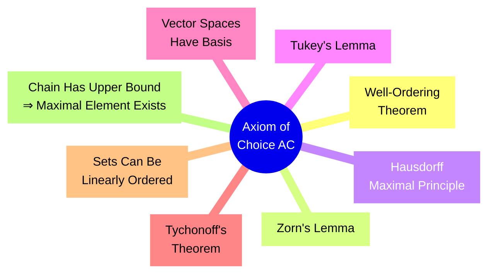
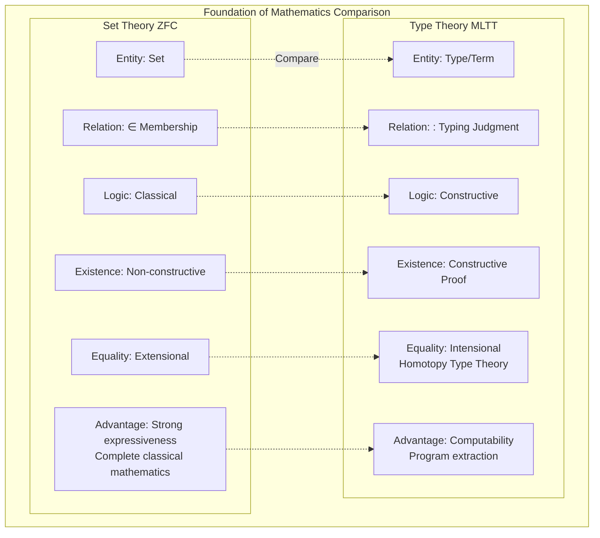
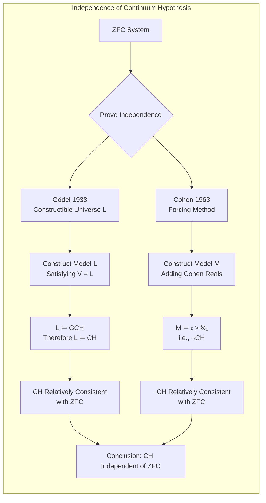

# Set Theory

> **Stage**: Struct/ | **Prerequisites**: [Formal Logic Foundations](01-formal-logic.md) | **Formalization Level**: L5

---

## 1. Definitions

### 1.1 Naïve Set Theory

**Def-S-23-01** (Naïve Set Theory). Naïve set theory was founded by G. Cantor in the late 19th century, based on the following intuitive principle:

$$
\text{Set} = \{ x \mid P(x) \}
$$

Where $P(x)$ is any predicate. The **Unrestricted Comprehension Axiom** is its core:

$$
\forall P \, \exists S \, \forall x \, (x \in S \iff P(x))
$$

**Def-S-23-02** (Basic Set Operations). Given sets $A, B$:

- **Union**: $A \cup B = \{ x \mid x \in A \lor x \in B \}$
- **Intersection**: $A \cap B = \{ x \mid x \in A \land x \in B \}$
- **Difference**: $A \setminus B = \{ x \mid x \in A \land x \notin B \}$
- **Power Set**: $\mathcal{P}(A) = \{ S \mid S \subseteq A \}$
- **Cartesian Product**: $A \times B = \{ (a, b) \mid a \in A \land b \in B \}$

**Def-S-23-03** (Set Relations).

- **Subset**: $A \subseteq B \iff \forall x \, (x \in A \implies x \in B)$
- **Proper Subset**: $A \subsetneq B \iff A \subseteq B \land A \neq B$
- **Equality**: $A = B \iff A \subseteq B \land B \subseteq A$

### 1.2 ZFC Axiomatic Set Theory

**Def-S-23-04** (ZFC System). ZFC (Zermelo-Fraenkel with Choice) is the standard axiomatic foundation of modern mathematics, containing 10 axioms:

| Axiom | Symbol | Core Statement |
|-------|--------|---------------|
| Extensionality | Ext | Sets are uniquely determined by their elements |
| Empty Set | Empty | There exists a set with no elements |
| Pairing | Pair | For any two sets, there exists a set containing them |
| Union | Union | The union of a set of sets exists |
| Power Set | Power | The power set of any set exists |
| Separation | Sep | Subsets can be separated by predicates |
| Infinity | Inf | Infinite sets exist |
| Replacement | Repl | The image of a set under a function exists |
| Foundation | Fnd | Sets have $\in$-minimal elements |
| Choice | AC | Every family of sets has a choice function |

**Def-S-23-05** (Well-Founded Relation). Relation $R$ is **well-founded** iff there are no infinite descending chains:

$$
\text{WF}(R) \iff \neg \exists (x_n)_{n \in \mathbb{N}} \, \forall n \, (x_{n+1} \, R \, x_n)
$$

The $\in$ relation is well-founded in ZFC (guaranteed by the Foundation axiom).

### 1.3 Ordinal Theory

**Def-S-23-06** (Transitive Set). Set $x$ is **transitive** iff:

$$
\text{Trans}(x) \iff \forall y \, \forall z \, ((z \in y \land y \in x) \implies z \in x)
$$

**Def-S-23-07** (Ordinal). An **ordinal** is a transitive set that is well-ordered by $\in$:

$$
\text{Ord}(\alpha) \iff \text{Trans}(\alpha) \land \text{WellOrdered}(\alpha, \in)
$$

**Def-S-23-08** (Successor and Limit Ordinals).

- **Successor**: $\alpha^+ = \alpha \cup \{ \alpha \}$
- **Limit ordinal**: $\lambda$ is a limit ordinal when $\lambda \neq 0$ and $\lambda = \sup_{\beta < \lambda} \beta$

### 1.4 Cardinal Theory

**Def-S-23-09** (Equinumerosity). Two sets are equinumerous iff there exists a bijection:

$$
|A| = |B| \iff \exists f: A \xrightarrow{\text{bijection}} B
$$

**Def-S-23-10** (Cardinal). A cardinal is an initial ordinal (not equinumerous with any smaller ordinal):

$$
\text{Card}(\kappa) \iff \text{Ord}(\kappa) \land \forall \alpha < \kappa \, (|\alpha| \neq |\kappa|)
$$

**Def-S-23-11** (Continuum).

- Cardinality of natural numbers: $\aleph_0 = |\mathbb{N}|$
- Cardinality of real numbers: $\mathfrak{c} = |\mathbb{R}| = 2^{\aleph_0}$

**Def-S-23-12** (Continuum Hypothesis, CH).

$$
\text{CH} \iff 2^{\aleph_0} = \aleph_1
$$

**Generalized Continuum Hypothesis (GCH)**:

$$
\text{GCH} \iff \forall \alpha \, (2^{\aleph_\alpha} = \aleph_{\alpha+1})
$$

---

## 2. Properties

### 2.1 Basic Properties of Ordinals

**Lemma-S-23-01** (Trichotomy of Ordinals). For any ordinals $\alpha, \beta$:

$$
\alpha \in \beta \lor \alpha = \beta \lor \beta \in \alpha
$$

*Proof*. From $\in$ being a well-ordering, totality follows directly.

**Lemma-S-23-02** (Well-Ordering of Ordinals). Any non-empty class of ordinals has an $\in$-minimal element.

**Lemma-S-23-03** (Burali-Forti Paradox Avoidance). The class $\mathbf{Ord}$ of all ordinals is not a set.

*Proof*. Assume $\mathbf{Ord}$ is a set, then it is transitive and well-ordered by $\in$, so $\mathbf{Ord} \in \mathbf{Ord}$, violating the Foundation axiom. ∎

### 2.2 Cardinal Arithmetic

**Lemma-S-23-04** (Cantor's Theorem). For any set $X$:

$$
|X| < |\mathcal{P}(X)|
$$

*Proof*. Assume there exists a surjection $f: X \to \mathcal{P}(X)$. Consider the diagonal set $D = \{ x \in X \mid x \notin f(x) \}$. If $D = f(d)$, then $d \in D \iff d \notin D$, contradiction. ∎

**Lemma-S-23-05** (König's Theorem). For index set $I$ and families of cardinals $(\kappa_i)_{i \in I}$, $(\lambda_i)_{i \in I}$:

$$
\forall i \in I \, (\kappa_i < \lambda_i) \implies \sum_{i \in I} \kappa_i < \prod_{i \in I} \lambda_i
$$

**Lemma-S-23-06** (Monotonicity of Cardinal Operations).

$$
\kappa_1 \leq \kappa_2 \land \lambda_1 \leq \lambda_2 \implies \kappa_1 + \lambda_1 \leq \kappa_2 + \lambda_2
$$

### 2.3 Equivalent Forms of Axiom of Choice

**Lemma-S-23-07** (Equivalence of Axiom of Choice). The following are equivalent in ZF:

1. **Axiom of Choice (AC)**: Every family of sets has a choice function
2. **Well-Ordering Theorem (WO)**: Every set can be well-ordered
3. **Zorn's Lemma (ZL)**: In a poset where every chain has an upper bound, there exists a maximal element
4. **Hausdorff Maximal Principle**: Every poset has a maximal chain
5. **Tukey's Lemma**: Every family of finite character has a maximal element
6. **Vector Space Basis Existence**: Every vector space has a Hamel basis
7. **Tychonoff's Theorem**: Product of compact spaces is compact
8. **Every set can be linearly ordered**

---

## 3. Relations

### 3.1 Russell's Paradox and Type Theory

**Prop-S-23-01** (Russell's Paradox). In naïve set theory, define:

$$
R = \{ x \mid x \notin x \}
$$

Then $R \in R \iff R \notin R$, a contradiction.

**Corollary**: Unrestricted comprehension must be rejected, replaced by the **Axiom Schema of Separation** (bounded comprehension):

$$
\forall A \, \exists B \, \forall x \, (x \in B \iff x \in A \land P(x))
$$

**Prop-S-23-02** (Type Theory as Alternative Foundation). Russell-Whitehead's **Ramified Type Theory** avoids paradox through stratification:

- Type 0: Individuals
- Type 1: Sets of individuals
- Type 2: Sets of Type 1 sets
- ...

**Modern Type Theory** (Martin-Löf, CoC) as constructive mathematical foundation, dual to set theory:

| Aspect | Set Theory (ZFC) | Type Theory (MLTT) |
|--------|-----------------|-------------------|
| Basic Entities | Sets | Types/Terms |
| Membership | Primitive concept | Judgment $t : T$ |
| Existence | Non-constructive | Constructive proof |
| Equality | Extensional equality | Intensional equality/homotopy |
| Propositions | Special sets | Types (Curry-Howard) |
| Universe | Proper class | Type universes $U_i$ |
| Expressiveness | Classical mathematics | Computable mathematics |

### 3.2 Independence of Continuum Hypothesis

**Prop-S-23-03** (Gödel-Cohen Theorem). The Continuum Hypothesis is independent of ZFC:

$$
\text{ZFC} \nvdash \text{CH} \quad \text{and} \quad \text{ZFC} \nvdash \neg \text{CH}
$$

**Proof Outline**:

- **Gödel (1938)**: Constructed constructible universe $L$, proved $\text{ZF} + (V = L) \vdash \text{GCH}$
- **Cohen (1963)**: Invented **forcing** method, constructed ZFC model where $\mathfrak{c} > \aleph_1$

### 3.3 Set Theory in Formal Methods

**Prop-S-23-04** (Set Theory as Semantic Foundation). In formal verification, set theory provides:

1. **TLA+**: Based on ZFC + Axiom of Choice, plus temporal logic
2. **Isabelle/ZF**: Higher-order logic + ZFC set theory
3. **Mizar**: Based on Tarski-Grothendieck set theory (ZFC + universe axioms)
4. **B Method**: Based on set theory and relational calculus

---

## 4. Argumentation

### 4.1 ZFC Axioms in Detail

**Axiom of Extensionality**:

$$
\forall A \, \forall B \, (\forall x \, (x \in A \iff x \in B) \implies A = B)
$$

**Meaning**: Sets are uniquely determined by their elements, excluding "urelements" (objects with only elements, no internal structure).

**Axiom Schema of Separation**:

$$
\forall A \, \exists B \, \forall x \, (x \in B \iff x \in A \land \varphi(x, p_1, \ldots, p_n))
$$

For any formula $\varphi$ (with parameters $p_i$). This is an **axiom schema**, generating infinitely many axioms.

**Axiom Schema of Replacement**:

If $F$ is a class function (i.e., $\forall x \, \exists! y \, \varphi(x, y)$), then:

$$
\forall A \, \exists B \, \forall y \, (y \in B \iff \exists x \in A \, \varphi(x, y))
$$

**Meaning**: Ensures completeness of ordinal theory, construction of large cardinals.

**Axiom of Infinity**:

$$
\exists I \, (\emptyset \in I \land \forall x \in I \, (x \cup \{x\} \in I))
$$

This is the smallest inductive set $\omega$, the set-theoretic implementation of natural numbers $\mathbb{N}$.

**Axiom of Foundation/Regularity**:

$$
\forall A \, (A \neq \emptyset \implies \exists x \in A \, (x \cap A = \emptyset))
$$

Equivalent statement: **No infinite $\in$-descending chains**.

**Meaning**:

- Excludes "self-membered sets" ($x \in x$)
- Ensures well-foundedness of set theory, supporting inductive proofs
- Makes every set have a rank in the von Neumann universe $V$

### 4.2 Construction of Ordinals

von Neumann ordinal implementation:

$$
\begin{align}
0 &= \emptyset \\
1 &= \{0\} = \{\emptyset\} \\
2 &= \{0, 1\} = \{\emptyset, \{\emptyset\}\} \\
3 &= \{0, 1, 2\} \\
n + 1 &= n \cup \{n\} \\
\omega &= \{0, 1, 2, \ldots\}
\end{align}
$$

**Transfinite Induction Principle**: If for any ordinal $\alpha$, $\forall \beta < \alpha \, P(\beta)$ implies $P(\alpha)$, then $\forall \alpha \, P(\alpha)$.

### 4.3 Controversy over Axiom of Choice

**Arguments for AC**:

- Mathematical intuition: "Choosing" elements from non-empty sets is a natural operation
- Equivalent to: vector spaces have bases, rings have maximal ideals, product topology preserves compactness

**Arguments against AC**:

- Non-constructive: provides no method for constructing the choice function
- Paradoxical results: Banach-Tarski paradox (sphere decomposition)
- Model theory: models of ZF+¬AC exist

**Constructive Alternatives**:

- **Countable Choice (AC_ω)**: Countable families of sets have choice functions
- **Dependent Choice (DC)**: Used in analysis
- **Fragments of AC**: Used in specific branches of mathematics

---

## 5. Formal Proofs

### 5.1 Theorem: Russell's Paradox

**Thm-S-23-01** (Russell's Paradox). In naïve set theory (unrestricted comprehension axiom), a contradiction exists.

*Formal Proof*:

**Step 1**: Apply unrestricted comprehension axiom with predicate $P(x) := x \notin x$:

$$
\exists R \, \forall x \, (x \in R \iff x \notin x) \tag{1}
$$

**Step 2**: Instantiate (1) at $x = R$:

$$
R \in R \iff R \notin R \tag{2}
$$

**Step 3**: Case analysis:

- **Assume** $R \in R$: By (2) right-to-left, get $R \notin R$, contradiction
- **Assume** $R \notin R$: By (2) left-to-right, get $R \in R$, contradiction

**Conclusion**: Either assumption leads to contradiction $P \land \neg P$.

$$
\vdash \bot \quad \text{(contradiction)}
$$

**Corollary**: Unrestricted comprehension axiom must be rejected, replaced by axiom schema of separation. ∎

### 5.2 Theorem: Well-Ordering Theorem Equivalent to Axiom of Choice

**Thm-S-23-02** (WO $\iff$ AC). In ZF system, the Well-Ordering Theorem is equivalent to the Axiom of Choice.

*Proof* ($\text{AC} \implies \text{WO}$):

**Step 1**: Let $X$ be any set. By AC, there exists a choice function:

$$
f: \mathcal{P}(X) \setminus \{\emptyset\} \to X \quad \text{satisfying} \quad f(A) \in A
$$

**Step 2**: Transfinite recursive construction of well-ordering. Define class sequence $(x_\alpha)$:

$$
x_\alpha = f(X \setminus \{ x_\beta \mid \beta < \alpha \})
$$

Continue while right-hand side is non-empty.

**Step 3**: By Foundation axiom, this process must terminate at some ordinal $\gamma$ (limited by Hartogs number of set $X$).

**Step 4**: Then $X = \{ x_\alpha \mid \alpha < \gamma \}$, and mapping $\alpha \mapsto x_\alpha$ is a bijection.

**Step 5**: Define order on $X$:

$$
x_\alpha < x_\beta \iff \alpha < \beta
$$

This is a well-ordering of $X$. ∎

*Proof* ($\text{WO} \implies \text{AC}$):

**Step 1**: Let $\mathcal{F} = \{A_i\}_{i \in I}$ be a family of non-empty sets. Let $A = \bigcup_{i \in I} A_i$.

**Step 2**: By WO, $A$ can be well-ordered, call it $<$.

**Step 3**: Define choice function:

$$
\chi(i) = \min_< (A_i)
$$

Where $\min_<$ is guaranteed by existence of well-ordering.

**Step 4**: Verify $\chi$ is a choice function: $\forall i \in I \, (\chi(i) \in A_i)$.

**Conclusion**: $\text{WO} \implies \text{AC}$. ∎

### 5.3 Corollary: Zorn's Lemma Equivalent to Axiom of Choice

**Cor-S-23-01**. Zorn's Lemma is equivalent to the Axiom of Choice.

*Proof Outline*:

- $\text{AC} \implies \text{Zorn}$: Use choice function to construct maximal chain
- $\text{Zorn} \implies \text{WO}$: Apply Zorn's Lemma to all well-ordered subsets of a set

---

## 6. Examples

### 6.1 Basic Set Operations Example

**Example 1**: Let $A = \{1, 2, 3\}$, $B = \{2, 3, 4\}$

$$
\begin{align}
A \cup B &= \{1, 2, 3, 4\} \\
A \cap B &= \{2, 3\} \\
A \setminus B &= \{1\} \\
\mathcal{P}(A) &= \{\emptyset, \{1\}, \{2\}, \{3\}, \{1,2\}, \{1,3\}, \{2,3\}, \{1,2,3\}\}
\end{align}
$$

**Example 2**: Power set cardinality

$$
|A| = n \implies |\mathcal{P}(A)| = 2^n
$$

### 6.2 Ordinal Operations Example

**Example 3**: Ordinal addition (non-commutative)

$$
\begin{align}
1 + \omega &= \omega \quad \text{(left absorption)} \\
\omega + 1 &\neq \omega \quad \text{(successor ordinal)}
\end{align}
$$

**Example 4**: von Neumann hierarchy $V_\alpha$

$$
\begin{align}
V_0 &= \emptyset \\
V_{\alpha+1} &= \mathcal{P}(V_\alpha) \\
V_\lambda &= \bigcup_{\alpha < \lambda} V_\alpha \quad (\lambda \text{ limit ordinal})
\end{align}
$$

Cumulative universe: $V = \bigcup_{\alpha \in \mathbf{Ord}} V_\alpha$

### 6.3 Cardinal Arithmetic Example

**Example 5**: Countable set operations

$$
\begin{align}
\aleph_0 + \aleph_0 &= \aleph_0 \\
\aleph_0 \cdot \aleph_0 &= \aleph_0 \\
\aleph_0^{\aleph_0} &= 2^{\aleph_0} = \mathfrak{c}
\end{align}
$$

**Example 6**: Uncountability of the continuum

$\mathbb{R}$ is uncountable because $|\mathbb{R}| = 2^{\aleph_0} > \aleph_0$ (by Cantor's theorem).

### 6.4 Application in Formal Verification

**Example 7**: Set theory in TLA+

```tla
\* Set definitions
Nat == {0, 1, 2, 3, ...}  \* Natural numbers
Empty == {}                \* Empty set
Singleton == {x}           \* Singleton set

\* Set operations
Union(A, B) == A \cup B
Intersection(A, B) == A \cap B
Difference(A, B) == A \ B
PowerSet(S) == SUBSET S

\* Functions (as special relations)
Function == [S -> T]  \* All functions from S to T
```

**Example 8**: Axiom of Choice in Isabelle/ZF

```isabelle
lemma choice_function_exists:
  assumes "∀A ∈ 𝒜. A ≠ ∅"
  shows "∃f. ∀A ∈ 𝒜. f`A ∈ A"
  using assms AC by auto
```

---

## 7. Visualizations

### 7.1 ZFC Axiom System Hierarchy

```mermaid
graph TB
    subgraph ZFC[ZFC Axiom System]
        direction TB

        subgraph Basic[Basic Construction]
            Ext[Extensionality<br/>Axiom]
            Empty[Empty Set<br/>Axiom]
            Pair[Pairing<br/>Axiom]
        end

        subgraph Construct[Set Construction]
            Union[Union<br/>Axiom]
            Power[Power Set<br/>Axiom]
            Sep[Separation<br/>Schema]
            Repl[Replacement<br/>Schema]
        end

        subgraph Infinity[Infinity]
            Inf[Infinity<br/>Axiom]
        end

        subgraph Foundation[Well-Foundedness]
            Fnd[Foundation<br/>Axiom]
        end

        subgraph Choice[Choice]
            AC[Axiom of<br/>Choice]
        end
    end

    ZF[ZF System<br/>(without AC)] -.-> Ext & Empty & Pair & Union & Power & Sep & Repl & Inf & Fnd
    ZFC --> ZF & AC
```

### 7.2 Ordinal and Cardinal Hierarchy

```mermaid
graph LR
    subgraph Ordinals[Ordinal Hierarchy]
        direction TB
        0[0 = ∅]
        1[1 = {0}]
        2[2 = {0,1}]
        3[3 = {0,1,2}]
        dots[...]
        ω[ω = {0,1,2,...}]
        ω1[ω+1]
        ω2[ω·2]
        ωpow[ω^ω]
        ε0[ε₀]
        Ω[Uncountable Ordinals]
    end

    subgraph Cardinals[Cardinal Hierarchy]
        direction TB
        aleph0[ℵ₀ = ω]
        aleph1[ℵ₁ = Smallest<br/>Uncountable Ordinal]
        aleph2[ℵ₂]
        c[𝔠 = 2^ℵ₀]
        alephω[ℵ_ω]
        inacc[Inaccessible Cardinal]
    end

    0 --> 1 --> 2 --> 3 --> dots --> ω --> ω1 --> ω2 --> ωpow --> ε0 --> Ω
    aleph0 --> aleph1 --> aleph2 --> alephω --> inacc

    ω -.-> aleph0
    ω1 -.-> aleph1
```

### 7.3 Russell's Paradox Derivation Flow

```mermaid
flowchart TD
    A[Naïve Set Theory<br/>Unrestricted Comprehension] --> B[Define Russell Set<br/>R = {x | x ∉ x}]
    B --> C[Instantiate:<br/>R ∈ R ↔ R ∉ R]
    C --> D{Case Analysis}
    D -->|Assume R ∈ R| E[By definition get R ∉ R]
    D -->|Assume R ∉ R| F[By definition get R ∈ R]
    E --> G[Contradiction!]
    F --> G
    G --> H[Naïve Set Theory Inconsistent]
    H --> I[Solution:<br/>ZFC Axiomatization]
    I --> J[Separation Axiom Schema<br/>Restrict Comprehension Scope]
```

### 7.4 Equivalent Forms of Axiom of Choice



### 7.5 Set Theory vs Type Theory Comparison



### 7.6 Independence of Continuum Hypothesis



---

## 8. References


---

*Document Version: 1.0 | Creation Date: 2026-04-10 | Last Updated: 2026-04-10*
