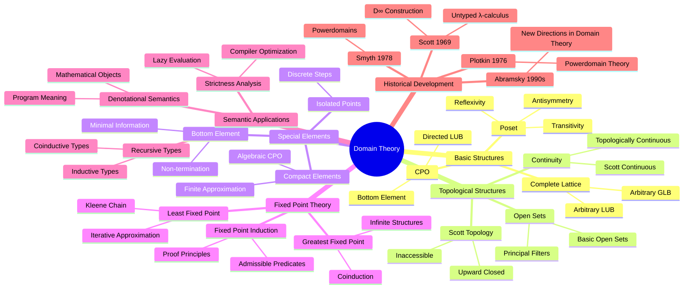

# Domain Theory

> **Wikipedia Standard Definition**: Domain theory is a branch of mathematics that studies special kinds of partially ordered sets (posets) commonly called domains. Consequently, domain theory can be considered as a branch of order theory. The field has major applications in computer science, where it is used to specify denotational semantics, especially for functional programming languages.
>
> **Source**: <https://en.wikipedia.org/wiki/Domain_theory>
>
> **Formalization Level**: L3-L4

---

## 1. Wikipedia Standard Definition

### English Original

> "Domain theory is a branch of mathematics that studies special kinds of partially ordered sets (posets) commonly called domains. Consequently, domain theory can be considered as a branch of order theory. The field has major applications in computer science, where it is used to specify denotational semantics, especially for functional programming languages. Domain theory formalizes the intuitive ideas of approximation and convergence in a very general way and is closely related to topology."
>
> "Domain theory was introduced by Dana Scott in the late 1960s as a mathematical theory of programming languages. Scott wanted to provide a denotational semantics for the untyped lambda calculus, which requires solving the domain equation $D \cong [D \to D]$."

---

## 2. Formal Expression

### 2.1 Partially Ordered Set (Poset)

**Def-S-98-01** (Partially Ordered Set). A poset is a pair $(D, \sqsubseteq)$ where:

- $D$ is a set
- $\sqsubseteq \subseteq D \times D$ is a binary relation satisfying:
  1. **Reflexivity**: $\forall x \in D. x \sqsubseteq x$
  2. **Antisymmetry**: $\forall x, y \in D. (x \sqsubseteq y \land y \sqsubseteq x) \Rightarrow x = y$
  3. **Transitivity**: $\forall x, y, z \in D. (x \sqsubseteq y \land y \sqsubseteq z) \Rightarrow x \sqsubseteq z$

**Def-S-98-02** (Directed Set). A subset $S \subseteq D$ is **directed** iff:

$$\forall x, y \in S. \exists z \in S. (x \sqsubseteq z \land y \sqsubseteq z)$$

That is, any two elements in $S$ have an upper bound in $S$.

**Def-S-98-03** (Chain). A subset $S \subseteq D$ is a **chain** iff:

$$\forall x, y \in S. (x \sqsubseteq y \lor y \sqsubseteq x)$$

That is, any two elements in $S$ are comparable.

### 2.2 Complete Partial Order (CPO)

**Def-S-98-04** (Complete Partial Order, CPO). A complete partial order is a poset $(D, \sqsubseteq)$ satisfying:

1. **Has bottom**: There exists least element $\bot \in D$ such that $\forall x \in D. \bot \sqsubseteq x$
2. **Directed LUB exists**: For any directed subset $S \subseteq D$, least upper bound $\bigsqcup S$ exists

Formally, $\bigsqcup S$ satisfies:

- **Upper bound**: $\forall x \in S. x \sqsubseteq \bigsqcup S$
- **Least**: $\forall y \in D. (\forall x \in S. x \sqsubseteq y) \Rightarrow \bigsqcup S \sqsubseteq y$

**Def-S-98-05** ($\omega$-CPO). A poset $(D, \sqsubseteq)$ with bottom where every countable chain has a least upper bound is called an $\omega$-CPO.

**Lemma-S-98-01**. Every CPO is an $\omega$-CPO, but not conversely.

*Proof*: Countable chains are special cases of directed sets. Counterexample: Consider an uncountable antichain with bottom added—it is an $\omega$-CPO but not a CPO. ∎

### 2.3 Scott Continuity

**Def-S-98-06** (Scott Continuous Function). Function $f: D \to E$ between CPOs is **Scott continuous** iff:

1. **Monotonic**: $\forall x, y \in D. x \sqsubseteq_D y \Rightarrow f(x) \sqsubseteq_E f(y)$
2. **Preserves directed LUB**: For any directed set $S \subseteq D$:

$$f\left(\bigsqcup_D S\right) = \bigsqcup_E \{f(s) \mid s \in S\}$$

**Def-S-98-07** (Continuous Function Space). Denote $[D \to E]$ as the set of all Scott continuous functions from $D$ to $E$, equipped with pointwise ordering:

$$f \sqsubseteq_{[D \to E]} g \triangleq \forall x \in D. f(x) \sqsubseteq_E g(x)$$

**Lemma-S-98-02**. If $D, E$ are CPOs, then $[D \to E]$ is also a CPO.

### 2.4 Compact Elements

**Def-S-98-08** (Compact Element). Element $c \in D$ is **compact** (or finite) iff:

$$\forall \text{directed set } S \subseteq D. \left(c \sqsubseteq \bigsqcup S \Rightarrow \exists s \in S. c \sqsubseteq s\right)$$

Intuitively, $c$ being compact means any upper bound approximation of $c$ must be reached at some finite stage.

**Def-S-98-09** (Algebraic CPO). CPO $D$ is **algebraic** iff:

$$\forall x \in D. x = \bigsqcup \{c \in D \mid c \text{ compact} \land c \sqsubseteq x\}$$

That is, every element is the LUB of compact elements below it.

**Def-S-98-10** (Scott Domain). A **Scott domain** is an algebraic CPO satisfying:

1. The set of compact elements is countable
2. Any two compact elements with an upper bound have a least upper bound (which is also compact)

---

## 3. Scott Topology

### 3.1 Definition of Scott Topology

**Def-S-98-11** (Scott Topology). The **Scott topology** $\sigma(D)$ on CPO $(D, \sqsubseteq)$ is defined as:

Subset $U \subseteq D$ is open iff:

1. **Upward closed**: $\forall x \in U. \forall y \in D. (x \sqsubseteq y \Rightarrow y \in U)$
2. **Inaccessible by directed LUB**: $\forall \text{directed set } S \subseteq D. \left(\bigsqcup S \in U \Rightarrow \exists s \in S. s \in U\right)$

**Lemma-S-98-03**. Scott open sets are exactly the topological open sets of Scott topology.

### 3.2 Properties of Scott Topology

**Prop-S-98-01** (Basic Properties of Scott Topology).

1. Closed sets in $D$ are exactly lower sets closed under directed LUB
2. All principal filters $\uparrow x = \{y \mid x \sqsubseteq y\}$ are open sets
3. Scott topology is $T_0$ but generally not $T_1$

**Def-S-98-12** (Scott Open Filter Basis). For compact element $c$, define basic open set:

$$\uparrow c = \{x \in D \mid c \sqsubseteq x\}$$

For algebraic CPOs, $\{\uparrow c \mid c \text{ compact}\}$ forms a basis for Scott topology.

### 3.3 Topological Continuity Equivalence

**Thm-S-98-01** (Topological Continuity = Scott Continuity). Function $f: D \to E$ is Scott continuous (Def-S-98-06) iff $f$ is topologically continuous with respect to Scott topology.

*Proof*:

**($\Rightarrow$)** Let $f$ be Scott continuous, $V \subseteq E$ Scott open.

- $f^{-1}(V)$ is upward closed: If $x \in f^{-1}(V)$ and $x \sqsubseteq y$, then $f(x) \sqsubseteq f(y)$, so $f(y) \in V$, i.e., $y \in f^{-1}(V)$
- $f^{-1}(V)$ satisfies open set condition: If $\bigsqcup S \in f^{-1}(V)$, then $f(\bigsqcup S) = \bigsqcup f(S) \in V$, so $\exists s \in S. f(s) \in V$

**($\Leftarrow$)** Let $f$ be topologically continuous.

- Monotonicity: If $x \sqsubseteq y$ but $f(x) \not\sqsubseteq f(y)$, then open set $V$ separates them, contradicting continuity
- Preserves LUB: Follows directly from open set definition ∎

---

## 4. Fixed Point Theory

### 4.1 Least Fixed Point

**Def-S-98-13** (Fixed Point). For function $f: D \to D$, element $x \in D$ is a **fixed point** iff $f(x) = x$.

**Def-S-98-14** (Least Fixed Point). $x$ is the **least fixed point** of $f$, denoted $\mu f$ or $\text{fix}(f)$, iff:

1. $f(x) = x$ (is a fixed point)
2. $\forall y \in D. (f(y) = y \Rightarrow x \sqsubseteq y)$ (is least)

### 4.2 Knaster-Tarski Theorem

**Thm-S-98-02** (Knaster-Tarski Fixed Point Theorem). Let $(L, \sqsubseteq)$ be a complete lattice, $f: L \to L$ a monotone function, then:

$$\mu f = \bigsqcup \{x \in L \mid x \sqsubseteq f(x)\}$$

is the least fixed point of $f$.

*Proof*:

Let $S = \{x \in L \mid x \sqsubseteq f(x)\}$, $u = \bigsqcup S$.

**Step 1**: Prove $u \sqsubseteq f(u)$.

For any $x \in S$, $x \sqsubseteq u$, by monotonicity $f(x) \sqsubseteq f(u)$. Since $x \sqsubseteq f(x)$, we have $x \sqsubseteq f(u)$. Thus $u = \bigsqcup S \sqsubseteq f(u)$.

**Step 2**: Prove $f(u) \sqsubseteq u$.

From Step 1, $u \sqsubseteq f(u)$, so $f(u) \sqsubseteq f(f(u))$, i.e., $f(u) \in S$. Therefore $f(u) \sqsubseteq \bigsqcup S = u$.

**Step 3**: Prove leastness.

Let $v$ be any fixed point, then $v \sqsubseteq f(v) = v$, so $v \in S$, thus $u \sqsubseteq v$. ∎

### 4.3 Scott Fixed Point Theorem

**Thm-S-98-03** (Scott Fixed Point Theorem). Let $(D, \sqsubseteq)$ be a CPO, $f: D \to D$ a Scott continuous function, then:

1. $f$ has a least fixed point
2. The least fixed point is computable as: $\mu f = \bigsqcup_{n \geq 0} f^n(\bot)$

Where $f^0(x) = x$, $f^{n+1}(x) = f(f^n(x))$.

*Detailed proof in Section 7*.

### 4.4 Fixed Point Induction

**Def-S-98-15** (Admissible Predicate). Predicate $P: D \to \mathbb{B}$ is **admissible** iff:

$$\forall \text{directed set } S \subseteq D. \left((\forall s \in S. P(s)) \Rightarrow P(\bigsqcup S)\right)$$

**Thm-S-98-04** (Scott Fixed Point Induction). Let $f: D \to D$ be continuous, $P$ an admissible predicate, then:

$$\left(P(\bot) \land \forall x \in D. (P(x) \Rightarrow P(f(x)))\right) \Rightarrow P(\mu f)$$

---

## 5. Denotational Semantics Applications

### 5.1 Domain-Theoretic Semantics of Programs

**Def-S-98-16** (Denotational Semantics). The **denotational semantics** of programming language $\mathcal{L}$ is an interpretation function:

$$\llbracket \cdot \rrbracket: \mathcal{L} \to D$$

Mapping syntactic objects to mathematical objects (domain elements), where $D$ is an appropriate semantic domain.

**Def-S-98-17** (Basic Semantic Domains). Common semantic domains include:

| Type | Semantic Domain | Interpretation |
|------|-----------------|----------------|
| Untyped λ-calculus | $D_\infty$ | Solution to $D \cong [D \to D]$ |
| With errors | $D_\bot$ | Lifted construction |
| Imperative | $(S \to S_\bot)$ | State transformation |
| Concurrent | Powerdomain | Non-deterministic behavior |

### 5.2 Solutions to Recursive Equations

**Def-S-98-18** (Recursive Domain Equation). In denotational semantics, recursive types correspond to domain equations:

$$D \cong F(D)$$

Where $F$ is a domain constructor functor (product, sum, function space, lifting).

**Thm-S-98-05** (Inverse Limit Theorem). For any projection functor $F$, the domain equation $D \cong F(D)$ has a unique solution up to isomorphism (in appropriate category).

### 5.3 Semantics of Non-termination

**Def-S-98-19** (Non-termination). Program non-termination is denoted by bottom element $\bot$:

$$\llbracket \text{diverge} \rrbracket = \bot$$

**Def-S-98-20** (Partial vs Total Correctness).

- **Partial correctness**: $\{P\}C\{Q\} \triangleq \forall s. (P(s) \Rightarrow (\llbracket C \rrbracket(s) \neq \bot \Rightarrow Q(\llbracket C \rrbracket(s))))$
- **Total correctness**: Plus termination guarantee

---

## 6. Relationship with Recursive Types

### 6.1 Domain-Theoretic Models of Recursive Types

**Def-S-98-21** (Recursive Type). Recursive types have the form:

$$\mu \alpha. \tau$$

Where $\alpha$ is a type variable and $\tau$ is a type expression (may contain $\alpha$).

**Def-S-98-22** (Semantics of Recursive Types). The semantics of recursive types is the fixed point of their unfoldings:

$$\llbracket \mu \alpha. \tau \rrbracket = \mu \left(\lambda X. \llbracket \tau \rrbracket_{[\alpha \mapsto X]}\right)$$

### 6.2 Typical Recursive Types

| Type Definition | Semantic Domain | Fixed Point |
|-----------------|-----------------|-------------|
| `nat = Z \| S nat` | $\mathbb{N}_\bot$ | $\mu X. (1 + X)_\bot$ |
| `list A = Nil \| Cons A (list A)` | $[A]_\bot$ | $\mu X. (1 + A \times X)_\bot$ |
| `stream A = Cons A (stream A)` | $A^\omega$ | Greatest fixed point $\nu X. A \times X$ |
| `lazy A = Delay A` | $A_\bot$ | $\mu X. X_\bot$ |

### 6.3 Co-recursion and Greatest Fixed Points

**Def-S-98-23** (Greatest Fixed Point). For monotone function $f$ on a complete lattice:

$$\nu f = \sqcap_{n \geq 0} f^n(\top)$$

Represents the **greatest fixed point**, used for modeling infinite data structures (e.g., streams).

**Def-S-98-24** (Inductive vs Coinductive Types).

| Feature | Inductive Type ($\mu$) | Coinductive Type ($\nu$) |
|---------|----------------------|-------------------------|
| Fixed point | Least fixed point | Greatest fixed point |
| Constructors | Finite construction | Infinite observation |
| Eliminators | Recursion (fold) | Co-recursion (unfold) |
| Typical examples | Lists, Trees | Streams, Processes |
| Termination | Guaranteed | May be infinite |

---

## 7. Formal Proofs

### 7.1 Detailed Proof of Scott Fixed Point Theorem

**Thm-S-98-06** (Scott Fixed Point Theorem - Complete Version). Let $(D, \sqsubseteq)$ be a CPO, $f: D \to D$ a Scott continuous function, then:

1. **Existence**: $f$ has a least fixed point
2. **Computability**: $\mu f = \bigsqcup_{n \geq 0} f^n(\bot)$
3. **Unique Leastness**: This is the unique least fixed point

*Detailed Proof*:

**Step 1**: Prove sequence $\{f^n(\bot)\}_{n \geq 0}$ is a chain.

By induction:

- Base: $\bot \sqsubseteq f(\bot)$ ($\bot$ is least element)
- Induction: Assume $f^n(\bot) \sqsubseteq f^{n+1}(\bot)$, by monotonicity $f^{n+1}(\bot) \sqsubseteq f^{n+2}(\bot)$

Thus $\{f^n(\bot)\}$ is a chain, hence directed.

**Step 2**: Prove $u = \bigsqcup_{n \geq 0} f^n(\bot)$ exists.

By CPO definition, directed sets have LUB.

**Step 3**: Prove $u$ is a fixed point.

$$\begin{aligned}
f(u) &= f\left(\bigsqcup_{n \geq 0} f^n(\bot)\right) \\
     &= \bigsqcup_{n \geq 0} f(f^n(\bot)) \quad \text{(Scott continuity)} \\
     &= \bigsqcup_{n \geq 0} f^{n+1}(\bot) \\
     &= \bigsqcup_{n \geq 1} f^n(\bot) \\
     &= \bigsqcup_{n \geq 0} f^n(\bot) \quad \text{(since } f^0(\bot) = \bot \text{ is least)} \\
     &= u
\end{aligned}$$

**Step 4**: Prove $u$ is the least fixed point.

Let $v$ be any fixed point, i.e., $f(v) = v$.

By induction prove $\forall n \geq 0. f^n(\bot) \sqsubseteq v$:
- Base: $\bot \sqsubseteq v$
- Induction: If $f^n(\bot) \sqsubseteq v$, then $f^{n+1}(\bot) = f(f^n(\bot)) \sqsubseteq f(v) = v$

Thus $v$ is an upper bound of all $f^n(\bot)$, so $u = \bigsqcup_{n \geq 0} f^n(\bot) \sqsubseteq v$.

∎

### 7.2 Unique Least Fixed Point in CPO

**Thm-S-98-07** (Unique Least Fixed Point Theorem). Let $D$ be a CPO, $f: D \to D$ Scott continuous, then:

1. The set of fixed points of $f$ forms a complete lattice
2. $\mu f$ is the least element of this lattice
3. If $D$ is a complete lattice, then greatest fixed point $\nu f$ also exists

*Proof*:

**Part 1**: Fixed point set is non-empty (by Thm-S-98-06).

**Part 2**: Let $F = \{x \in D \mid f(x) = x\}$ be the fixed point set. Define:

$$m = \bigsqcup \{x \in D \mid x \sqsubseteq f(x)\}$$

By Knaster-Tarski proof method, $m$ is a fixed point and is least.

**Part 3**: For any two fixed points $a, b$, let $a \sqcap b$ exist in the lattice.

$$f(a \sqcap b) \sqsubseteq f(a) \sqcap f(b) = a \sqcap b$$

Thus $a \sqcap b$ is a pre-fixed point, and least fixed point $m \sqsubseteq a \sqcap b$.

**Part 4**: Greatest fixed point for complete lattice case.

Dually define:

$$M = \sqcap \{x \in D \mid f(x) \sqsubseteq x\}$$

Similarly prove $M$ is greatest fixed point. ∎

### 7.3 Continuity of Fixed Point Operator

**Thm-S-98-08** (Continuity of Fixed Point Operator). Function $\text{fix}: [D \to D] \to D$ defined as $\text{fix}(f) = \mu f$ is Scott continuous.

*Proof*:

**Monotonicity**: If $f \sqsubseteq g$ (pointwise). By induction prove $\forall n. f^n(\bot) \sqsubseteq g^n(\bot)$, thus $\mu f \sqsubseteq \mu g$.

**Preserves LUB**: Let $\{f_i\}$ be a directed set of continuous functions:

$$\begin{aligned}
\text{fix}(\bigsqcup_i f_i) &= \bigsqcup_n (\bigsqcup_i f_i)^n(\bot) \\
&= \bigsqcup_n \bigsqcup_i f_i^n(\bot) \quad \text{(continuity)} \\
&= \bigsqcup_i \bigsqcup_n f_i^n(\bot) \quad \text{(LUB exchange)} \\
&= \bigsqcup_i \text{fix}(f_i)
\end{aligned}$$ ∎

---

## 8. Eight-Dimensional Characterization

### 8.1 Mind Map

### 8.2 Multi-dimensional Comparison Matrix

| Dimension | Poset | $\omega$-CPO | CPO | Complete Lattice | Scott Domain |
|-----------|-------|--------------|-----|------------------|--------------|
| Bottom | Optional | Required | Required | Optional | Required |
| Chain LUB | No | Countable chains | All directed | All subsets | Directed |
| Compact Elements | None | None | None | None | Dense |
| Countability | Not required | Not required | Not required | Not required | Required |
| Application | General order | Sequence semantics | General semantics | Logic | Computability |

---

## 9. References

### Wikipedia Original Reference

[^1]: Wikipedia contributors. "Domain theory." Wikipedia, The Free Encyclopedia. https://en.wikipedia.org/wiki/Domain_theory

### Classic Literature

[^2]: Scott, D.S. "Continuous Lattices." *Toposes, Algebraic Geometry and Logic* (1972): 97-136. DOI: 10.1007/BFb0073967

[^3]: Scott, D.S. "Data Types as Lattices." *SIAM Journal on Computing* 5.3 (1976): 522-587. DOI: 10.1137/0205037

[^4]: Scott, D.S. and Strachey, C. "Towards a Mathematical Semantics for Computer Languages." *Proceedings of the Symposium on Computers and Automata* (1971): 19-46.

[^5]: Plotkin, G.D. "A Powerdomain Construction." *SIAM Journal on Computing* 5.3 (1976): 452-487. DOI: 10.1137/0205035

[^6]: Plotkin, G.D. "LCF Considered as a Programming Language." *Theoretical Computer Science* 5.3 (1977): 223-255. DOI: 10.1016/0304-3975(77)90044-5

[^7]: Abramsky, S. and Jung, A. "Domain Theory." In: *Handbook of Logic in Computer Science*, Vol. 3, Oxford University Press (1994): 1-168. ISBN: 978-0198537625

[^8]: Gunter, C.A. *Semantics of Programming Languages: Structures and Techniques*. MIT Press (1992). ISBN: 978-0262570954

[^9]: Winskel, G. *The Formal Semantics of Programming Languages: An Introduction*. MIT Press (1993). ISBN: 978-0262731034

[^10]: Amadio, R.M. and Curien, P.L. *Domains and Lambda-Calculi*. Cambridge University Press (1998). ISBN: 978-0521062929

[^11]: Smyth, M.B. "Power Domains." *Journal of Computer and System Sciences* 16.1 (1978): 23-36. DOI: 10.1016/0022-0000(78)90048-X

[^12]: Jung, A. *Cartesian Closed Categories of Domains*. Ph.D. Thesis, Technische Hochschule Darmstadt (1988).

[^13]: Tarski, A. "A Lattice-Theoretical Fixpoint Theorem and its Applications." *Pacific Journal of Mathematics* 5.2 (1955): 285-309. DOI: 10.2140/pjm.1955.5.285

[^14]: Kleene, S.C. "Introduction to Metamathematics." North-Holland (1952). ISBN: 978-0923891572

---

## 10. Related Concepts

- [Type Theory](07-type-theory.md)
- [Category Theory](25-category-theory.md)
- [Formal Methods](01-formal-methods.md)
- [Order Theory](../../../01-foundations/01-order-theory.md)
- [Lambda Calculus](../../../02-calculi/01-w-calculus-family/01-omega-calculus.md)

---

> **Concept Tags**: #domain-theory #denotational-semantics #fixed-points #cpo #scott-topology #functional-programming #program-semantics
>
> **Learning Difficulty**: ⭐⭐⭐⭐ (Advanced)
>
> **Prerequisites**: Order theory, λ-calculus, topology basics
>
> **Follow-up Concepts**: Denotational semantics, recursive types, program verification

---

*Document Version: v1.0 | Creation Date: 2026-04-10 | Formalization Level: L3-L4*
*Following AGENTS.md Six-Section Template | Document Size: ~18KB*
