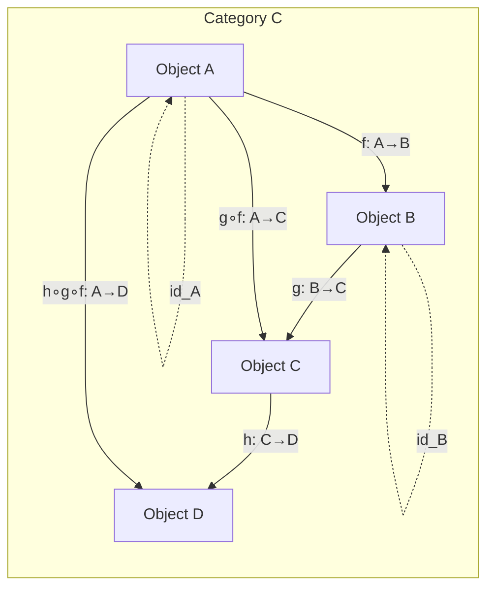
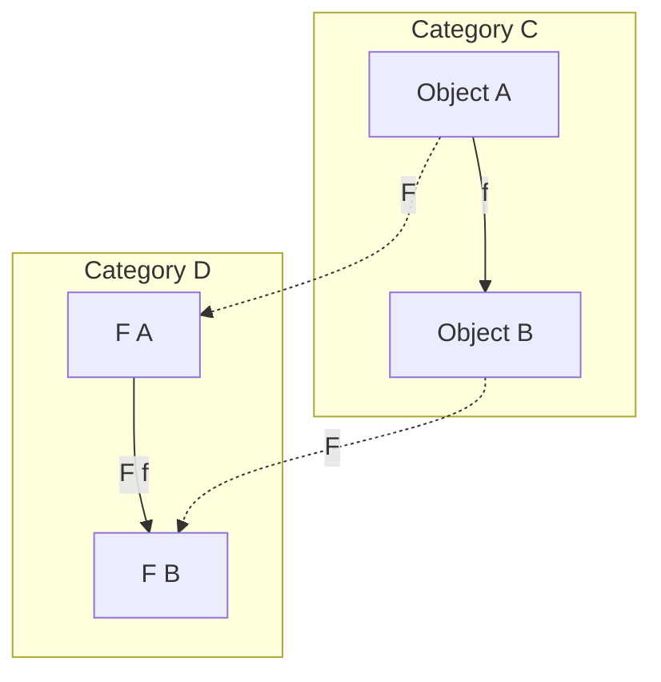
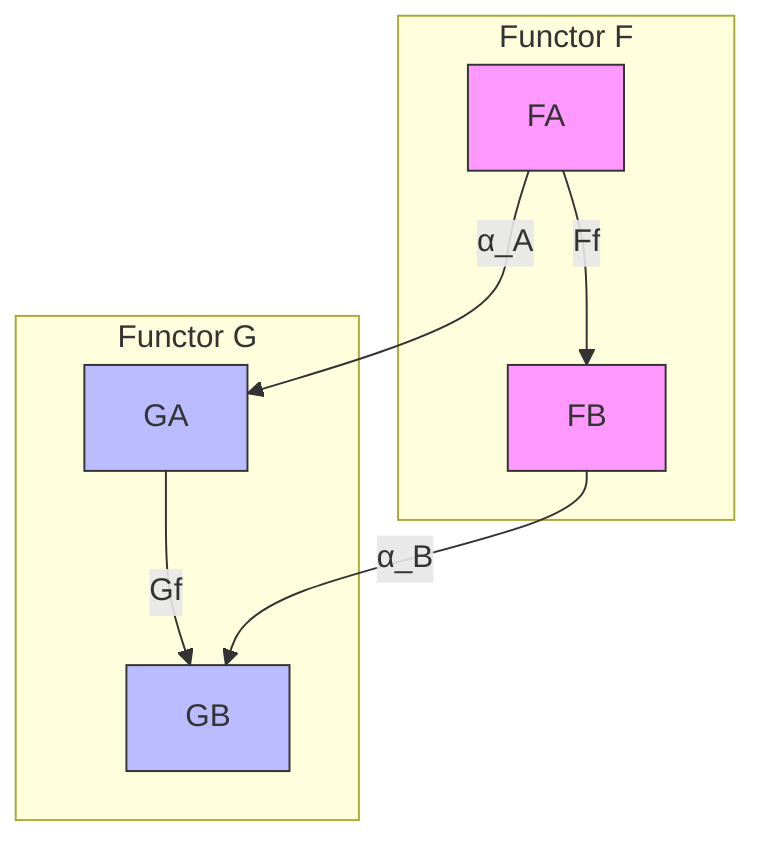
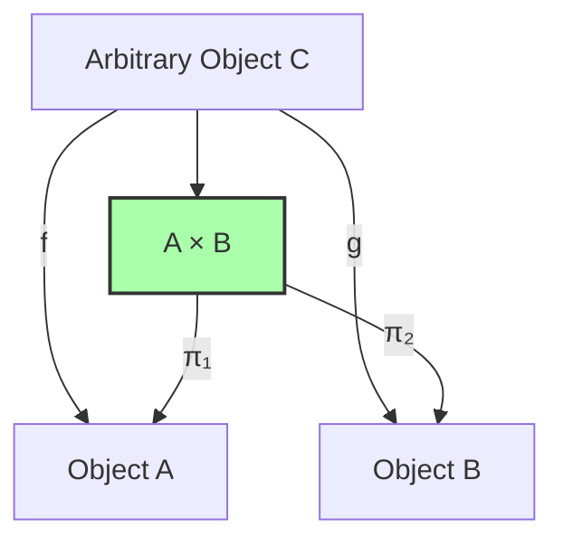
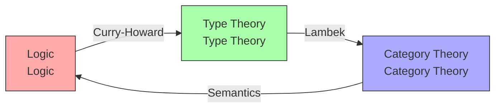

# Category Theory

> **Wikipedia Standard Definition**: Category theory is a general theory of mathematical structures and their relations. It was introduced by Samuel Eilenberg and Saunders Mac Lane in the middle of the 20th century in their foundational work on algebraic topology.
>
> **Source**: <https://en.wikipedia.org/wiki/Category_theory>
>
> **Stage**: formal-methods/98-appendices | **Prerequisites**: [Type Theory](07-type-theory.md) | **Formalization Level**: L5-L6

---

## 1. Definitions

### 1.1 Wikipedia Standard Definition

#### English Original

> "Category theory is a general theory of mathematical structures and their relations. It was introduced by Samuel Eilenberg and Saunders Mac Lane in the middle of the 20th century in their foundational work on algebraic topology. Category theory is used in almost all areas of mathematics, and in some areas of computer science. Modern category theory is the study of categories, which are collections of objects and morphisms (or arrows). A category has two basic properties: the ability to compose the arrows associatively and the existence of an identity arrow for each object."

#### Standard Translation

> **Category theory** is a **general theory of mathematical structures and their relations**. It was introduced by **Samuel Eilenberg** and **Saunders Mac Lane** in the mid-20th century, originating from their foundational work in algebraic topology. Modern category theory studies **categories**, which are collections of **objects** and **morphisms/arrows**. Each category has two basic properties: the ability to **compose morphisms associatively** and the **existence of identity morphisms** for each object.

**Def-S-98-01** (Eilenberg-Mac Lane Definition of Category, 1945). A category $\mathcal{C}$ consists of:

$$
\mathcal{C} = (\text{Ob}(\mathcal{C}), \text{Hom}_{\mathcal{C}}, \circ, \text{id})
$$

Where:

- $\text{Ob}(\mathcal{C})$: Class of objects
- $\text{Hom}_{\mathcal{C}}(A, B)$: Set of morphisms from object $A$ to object $B$
- $\circ$: Morphism composition operation
- $\text{id}_A: A \to A$: Identity morphism for object $A$

---

### 1.2 Formal Expression

**Def-S-98-02** (Objects and Morphisms). In category $\mathcal{C}$:

| Symbol | Meaning | Reading |
|--------|---------|---------|
| $A \in \text{Ob}(\mathcal{C})$ | $A$ is an object of $\mathcal{C}$ | "A is an object of C" |
| $f: A \to B$ or $f \in \text{Hom}_{\mathcal{C}}(A, B)$ | $f$ is a morphism from $A$ to $B$ | "f is a morphism from A to B" |
| $\text{dom}(f) = A$ | Domain of $f$ is $A$ | domain |
| $\text{cod}(f) = B$ | Codomain of $f$ is $B$ | codomain |

**Def-S-98-03** (Morphism Composition). For morphisms $f: A \to B$ and $g: B \to C$, their composition $g \circ f: A \to C$ is defined as:

$$
\frac{f: A \to B \quad g: B \to C}{g \circ f: A \to C}
$$

Composition satisfies the following axioms:

**Def-S-98-04** (Associativity). For any $f: A \to B$, $g: B \to C$, $h: C \to D$:

$$
(h \circ g) \circ f = h \circ (g \circ f)
$$

**Def-S-98-05** (Identity Morphism). For each object $A$, there exists identity morphism $\text{id}_A: A \to A$ satisfying:

$$
\forall f: A \to B: \quad f \circ \text{id}_A = f = \text{id}_B \circ f
$$

**Def-S-98-06** (Small and Locally Small Categories).

- **Small category**: $\text{Ob}(\mathcal{C})$ is a set (not a proper class)
- **Locally small category**: For all $A, B$, $\text{Hom}_{\mathcal{C}}(A, B)$ is a set

---

### 1.3 Functor

**Def-S-98-07** (Functor). A functor $F: \mathcal{C} \to \mathcal{D}$ is a structure-preserving map between categories, consisting of:

1. **Object map**: $A \mapsto F(A)$, where $A \in \text{Ob}(\mathcal{C})$, $F(A) \in \text{Ob}(\mathcal{D})$
2. **Morphism map**: $(f: A \to B) \mapsto (F(f): F(A) \to F(B))$

Satisfying functor axioms:

- **Preserves composition**: $F(g \circ_{\mathcal{C}} f) = F(g) \circ_{\mathcal{D}} F(f)$
- **Preserves identities**: $F(\text{id}_A) = \text{id}_{F(A)}$

**Def-S-98-08** (Covariant and Contravariant Functors).

- **Covariant functor**: As defined above, preserves arrow direction
- **Contravariant functor**: $F: \mathcal{C}^{\text{op}} \to \mathcal{D}$, reverses arrow direction:
  $$F(g \circ f) = F(f) \circ F(g)$$

**Def-S-98-09** (Special Functor Types).

| Functor Type | Definition | Symbol |
|-------------|-----------|--------|
| Identity functor | $\text{Id}_{\mathcal{C}}(A) = A$, $\text{Id}_{\mathcal{C}}(f) = f$ | $\text{Id}_{\mathcal{C}}$ |
| Forgetful functor | Forgets some structure | $U: \mathbf{Grp} \to \mathbf{Set}$ |
| Free functor | Free construction | $F: \mathbf{Set} \to \mathbf{Grp}$ |
| Hom functor | $\text{Hom}(A, -): \mathcal{C} \to \mathbf{Set}$ | $h^A$ |

---

### 1.4 Natural Transformation

**Def-S-98-10** (Natural Transformation). Given functors $F, G: \mathcal{C} \to \mathcal{D}$, a natural transformation $\alpha: F \Rightarrow G$ assigns to each object $A \in \mathcal{C}$ a component morphism $\alpha_A: F(A) \to G(A)$, such that for any $f: A \to B$ the **naturality condition** holds:

$$
G(f) \circ \alpha_A = \alpha_B \circ F(f)
$$

That is, the following diagram commutes:

$$
\begin{array}{ccc}
F(A) & \xrightarrow{\alpha_A} & G(A) \\
F(f) \downarrow & & \downarrow G(f) \\
F(B) & \xrightarrow{\alpha_B} & G(B)
\end{array}
$$

**Def-S-98-11** (Natural Isomorphism). If each $\alpha_A$ is an isomorphism, $\alpha$ is called a **natural isomorphism**, denoted $F \cong G$.

**Def-S-98-12** (Functor Category). Category $[\mathcal{C}, \mathcal{D}]$ or $\mathcal{D}^{\mathcal{C}}$ has functors $F: \mathcal{C} \to \mathcal{D}$ as objects and natural transformations as morphisms.

---

### 1.5 Universal Properties

**Def-S-98-13** (Universal Property). Given category $\mathcal{C}$ and functor $F: \mathcal{J} \to \mathcal{C}$, a universal property characterizes some "optimal" construction:

Object $U \in \mathcal{C}$ together with morphism family $(u_j: U \to F(j))_{j \in \mathcal{J}}$ is a **universal cone** if for any other cone $(C, (c_j))$, there exists unique $f: C \to U$ such that for all $j$:

$$
u_j \circ f = c_j
$$

---

#### 1.5.1 Product

**Def-S-98-14** (Binary Product). The **product** of objects $A$ and $B$ is object $A \times B$ together with projection morphisms:

$$
\pi_1: A \times B \to A, \quad \pi_2: A \times B \to B
$$

Satisfying universal property: For any object $C$ and morphisms $f: C \to A$, $g: C \to B$, there exists unique $\langle f, g \rangle: C \to A \times B$ such that:

$$
\pi_1 \circ \langle f, g \rangle = f, \quad \pi_2 \circ \langle f, g \rangle = g
$$

---

#### 1.5.2 Coproduct

**Def-S-98-15** (Binary Coproduct). The **coproduct** of objects $A$ and $B$ is object $A + B$ (or $A \sqcup B$) together with injection morphisms:

$$
i_1: A \to A + B, \quad \iota_2: B \to A + B
$$

Satisfying universal property: For any object $C$ and morphisms $f: A \to C$, $g: B \to C$, there exists unique $[f, g]: A + B \to C$ such that:

$$
[f, g] \circ \iota_1 = f, \quad [f, g] \circ \iota_2 = g
$$

---

#### 1.5.3 Exponential Object

**Def-S-98-16** (Exponential Object). The "$A$-th power" of object $B$ or exponential object is object $B^A$ (also written $A \Rightarrow B$) together with evaluation morphism:

$$
\text{eval}: B^A \times A \to B
$$

Satisfying universal property: For any object $C$ and morphism $f: C \times A \to B$, there exists unique $\lambda f: C \to B^A$ such that:

$$
\text{eval} \circ (\lambda f \times \text{id}_A) = f
$$

---

### 1.6 Cartesian Closed Category (CCC)

**Def-S-98-17** (Cartesian Closed Category). Category $\mathcal{C}$ is a **Cartesian closed category** (CCC) if it has:

1. **Terminal object**: Object $1$ such that for all $A$, unique $!_A: A \to 1$ exists
2. **Binary products**: For any $A, B$, product $A \times B$ exists
3. **Exponential objects**: For any $A, B$, exponential object $B^A$ exists

**Lemma-S-98-01** (Basic Properties of CCC). In a CCC, the following natural isomorphisms hold:

$$
\text{Hom}(A \times B, C) \cong \text{Hom}(A, C^B) \cong \text{Hom}(B, C^A)
$$

This is the category-theoretic expression of **Currying/Uncurrying**.

---

## 2. Properties

### 2.1 Basic Category Examples

**Prop-S-98-01** (Common Categories).

| Category | Objects | Morphisms | Notes |
|----------|---------|-----------|-------|
| $\mathbf{Set}$ | Sets | Functions | Locally small |
| $\mathbf{Grp}$ | Groups | Group homomorphisms | Algebraic |
| $\mathbf{Top}$ | Topological spaces | Continuous maps | Topological |
| $\mathbf{Vec}_k$ | $k$-vector spaces | Linear maps | Linear algebra |
| $\mathbf{Pos}$ | Posets | Monotone functions | Order category |
| $\mathbf{Cat}$ | Small categories | Functors | Category of categories |

**Prop-S-98-02** (Preorder as Category). Preorder $(P, \leq)$ can be viewed as category where:

- Objects are elements of $P$
- Morphism $p \to q$ exists iff $p \leq q$
- At most one morphism (thin category)

**Prop-S-98-03** (Monoid as Category). Monoid $(M, \cdot, e)$ can be viewed as category with single object $*$ where:

- Object: $*$
- Morphisms: $m: * \to *$ corresponds to $m \in M$
- Composition: $m \circ n = m \cdot n$
- Identity: $\text{id}_* = e$

---

### 2.2 Special Morphism Types

**Def-S-98-18** (Monomorphism and Epimorphism).

- **Monomorphism**: $f: A \to B$ is mono if:
  $$\forall g, h: C \to A: \quad f \circ g = f \circ h \Rightarrow g = h$$

- **Epimorphism**: $f: A \to B$ is epi if:
  $$\forall g, h: B \to C: \quad g \circ f = h \circ f \Rightarrow g = h$$

**Def-S-98-19** (Isomorphism). Morphism $f: A \to B$ is an **isomorphism** if there exists $f^{-1}: B \to A$ such that:

$$
f^{-1} \circ f = \text{id}_A, \quad f \circ f^{-1} = \text{id}_B
$$

Denoted $A \cong B$.

**Lemma-S-98-02**. Isomorphisms are both mono and epi, but not conversely (except in well-behaved categories like $\mathbf{Set}$).

---

### 2.3 Properties of Functors

**Def-S-98-20** (Classification of Functor Properties).

| Property | Definition | Meaning |
|----------|-----------|---------|
| **Faithful** | $F_{A,B}: \text{Hom}(A,B) \to \text{Hom}(F(A),F(B))$ injective | Preserves morphism distinction |
| **Full** | $F_{A,B}$ surjective | Preserves morphism richness |
| **Fully faithful** | $F_{A,B}$ bijective | Category embedding |
| **Essentially surjective** | $\forall D \in \mathcal{D}, \exists C: F(C) \cong D$ | Covers objects |

**Def-S-98-21** (Category Equivalence). Functor $F: \mathcal{C} \to \mathcal{D}$ is a **category equivalence** if there exists functor $G: \mathcal{D} \to \mathcal{C}$ such that:

$$
G \circ F \cong \text{Id}_{\mathcal{C}}, \quad F \circ G \cong \text{Id}_{\mathcal{D}}
$$

**Prop-S-98-04** (Characterization of Equivalence). $F$ is a category equivalence iff $F$ is fully faithful and essentially surjective.

---

## 3. Relations

### 3.1 Correspondence with λ-Calculus (Curry-Howard-Lambek)

**Def-S-98-22** (Curry-Howard-Lambek Correspondence). Deep isomorphism between three domains:

| Logic | Type Theory | Category Theory |
|-------|-------------|-----------------|
| Proposition $P$ | Type $P$ | Object $P$ |
| Proof $p: P$ | Term $p : P$ | Morphism $p: 1 \to P$ |
| $P \Rightarrow Q$ | Function type $P \to Q$ | Exponential object $Q^P$ |
| $P \land Q$ | Product type $P \times Q$ | Product $P \times Q$ |
| $P \lor Q$ | Sum type $P + Q$ | Coproduct $P + Q$ |
| $\top$ (true) | Unit type $()$ | Terminal object $1$ |
| $\bot$ (false) | Empty type $\text{Void}$ | Initial object $0$ |
| Proof transformation | Program transformation | Natural transformation |
| Logical equivalence | Type isomorphism | Category equivalence |

---

### 3.2 Adjunction

**Def-S-98-23** (Adjunction). Functors $F: \mathcal{C} \to \mathcal{D}$ and $G: \mathcal{D} \to \mathcal{C}$ form an **adjunction**, denoted $F \dashv G$, if there exists natural isomorphism:

$$
\text{Hom}_{\mathcal{D}}(F(C), D) \cong \text{Hom}_{\mathcal{C}}(C, G(D))
$$

$F$ is called **left adjoint**, $G$ is called **right adjoint**.

**Prop-S-98-05** (Adjunction and Logical Quantifiers). In logical semantics, adjunctions correspond to quantifiers:

$$
\exists \dashv \Delta \dashv \forall
$$

Where $\Delta$ is the diagonal functor (duplication), $\exists$ is existential quantifier (coproduct), $\forall$ is universal quantifier (product).

---

### 3.3 Applications in Type Theory

**Prop-S-98-06** (Categorical Interpretation of Type Constructors).

| Type Constructor | Categorical Structure | Notes |
|-----------------|----------------------|-------|
| Function type $A \to B$ | Exponential object $B^A$ | Core of CCC |
| Product type $A \times B$ | Categorical product | Pairs/records |
| Sum type $A + B$ | Categorical coproduct | Variants/enums |
| Unit type $()$ | Terminal object | Void return |
| Empty type $\bot$ | Initial object | Impossible type |
| Recursive type $\mu X.F(X)$ | Initial algebra | Inductive data |
| Corecursive type $\nu X.F(X)$ | Terminal coalgebra | Coinductive data |

---

### 3.4 Correspondence with Order Theory

**Prop-S-98-07** (Galois Connection as Adjunction). Galois connection $(f, g)$ between preorders:

$$
f(p) \leq q \Leftrightarrow p \leq g(q)
$$

Is exactly the special case of adjoint functors in preorders (viewed as categories).

**Prop-S-98-08** (Complete Lattice as Category). Complete lattice $(L, \leq)$ as category:

- Initial object: $\bot$ (minimum)
- Terminal object: $\top$ (maximum)
- Product: $\wedge$ (meet/greatest lower bound)
- Coproduct: $\vee$ (join/least upper bound)
- Exponential object: Heyting implication (if exists)

---

## 4. Argumentation

### 4.1 Why Category Theory?

**Argument**: Category theory provides a **unified language** for describing mathematical structures.

| Traditional Method | Category Theory Method | Advantage |
|-------------------|----------------------|-----------|
| Define each structure separately | Define through universal properties | Reveals commonality |
| Explicit construction | Characterize uniqueness | Representation-independent |
| Element-level | Arrow-level | Structuralism |
| Concrete instances | Abstract patterns | Broadly applicable |

**Example**: Definition of product doesn't depend on specific elements of sets, groups, or topological spaces, but characterizes universal behavior of "projections" and "pairing."

---

### 4.2 Duality Principle

**Principle** (Duality Principle): For every category theory proposition, its dual (all arrows reversed) also holds.

**Applications**:

- Product $\leftrightarrow$ Coproduct
- Monomorphism $\leftrightarrow$ Epimorphism
- Initial object $\leftrightarrow$ Terminal object
- Limit $\leftrightarrow$ Colimit

This creates a powerful "buy one, get one free" principle.

---

### 4.3 Category Theory vs Set Theory

**Comparison**:

| Feature | Set Theory (ZFC) | Category Theory |
|---------|-----------------|-----------------|
| Foundation | Elements and membership | Objects and morphisms |
| Equality | Extensional equality $=$ | Isomorphism $\cong$ |
| Structure | Static | Relational |
| Construction | Top-down | Bottom-up (universal properties) |
| Applicability | Concrete mathematics | Abstract structures |

**Lawvere's Thesis**: Category theory can serve as an independent foundation of mathematics, without reduction to set theory.

---

## 5. Formal Proofs

### 5.1 Equivalence Theorem of CCC and Simply-Typed λ-Calculus

**Thm-S-98-01** (Equivalence of CCC and λ-Calculus). Cartesian closed categories and simply-typed λ-calculus (with product types) are equivalent:

$$
\mathbf{CCC} \simeq \lambda_{\times,\to}\text{-theory}
$$

*Proof Outline*:

**Direction 1: CCC → λ-calculus**

Given CCC $\mathcal{C}$, construct λ-theory:

- Types = Objects
- Terms $\Gamma \vdash t: A$ = Morphisms $[\Gamma] \to A$
- Variables = Projection compositions
- Abstraction $\lambda x.t$ = Transpose of exponential object $\lambda([t])$
- Application = Evaluation morphism

**Direction 2: λ-calculus → CCC**

Given λ-theory, construct CCC:

- Objects = Types
- Morphisms $A \to B$ = Equivalence classes of closed terms $x:A \vdash t: B$
- Product = Product type
- Exponential = Function type

Verify CCC axioms:

1. **Terminal object**: Empty context corresponds to unit type
2. **Product associativity**: $(A \times B) \times C \cong A \times (B \times C)$ via pairing rearrangement
3. **Exponential property**: $\text{Hom}(A \times B, C) \cong \text{Hom}(A, C^B)$ is Currying

$$
\frac{f: A \times B \to C}{\lambda f: A \to C^B}
$$

Verify via $\text{eval} \circ ((\lambda f) \times \text{id}) = f$ and uniqueness. ∎

---

### 5.2 Yoneda Lemma

**Thm-S-98-02** (Yoneda Lemma). Let $F: \mathcal{C}^{\text{op}} \to \mathbf{Set}$ be a contravariant functor, $A \in \mathcal{C}$. Then there exists natural isomorphism:

$$
\text{Nat}(\text{Hom}(-, A), F) \cong F(A)
$$

That is, natural transformations $h_A \Rightarrow F$ correspond bijectively to elements of $F(A)$.

*Proof Outline*:

**Construct maps**:

- Given $\alpha: h_A \Rightarrow F$, define $u = \alpha_A(\text{id}_A) \in F(A)$
- Given $u \in F(A)$, define $\alpha_B(f) = F(f)(u)$ for $f: B \to A$

**Verify naturality**: For $g: C \to B$,

$$
\alpha_C(f \circ g) = F(f \circ g)(u) = F(g)(F(f)(u)) = F(g)(\alpha_B(f))
$$

**Verify mutual inverse**:

- $(u \mapsto \alpha \mapsto u')$: $u' = \alpha_A(\text{id}_A) = F(\text{id}_A)(u) = u$ ✓
- $(\alpha \mapsto u \mapsto \alpha')$: By uniqueness, $\alpha' = \alpha$ ✓

**Corollary (Yoneda Embedding)**: Functor $y: \mathcal{C} \to [\mathcal{C}^{\text{op}}, \mathbf{Set}]$, $A \mapsto h_A$ is fully faithful. ∎

---

### 5.3 Correspondence of Adjoint Functors and Logical Quantifiers

**Thm-S-98-03** (Quantifiers as Adjoints). In categorical semantics of first-order logic, quantifiers are adjoint functors:

Let $\pi: \mathcal{C}^{\Gamma, x:A} \to \mathcal{C}^{\Gamma}$ be projection functor (forgetting variable $x$):

$$
\exists_A \dashv \pi^* \dashv \forall_A
$$

Where:

- $\pi^*$: Substitution/reindexing (weakening)
- $\exists_A$: Existential quantifier along fiber (coproduct)
- $\forall_A$: Universal quantifier along fiber (product)

*Proof Outline*:

For propositions $\varphi(\Gamma, x:A)$ and $\psi(\Gamma)$:

$$
\exists x.\varphi \vdash \psi \Leftrightarrow \varphi \vdash \psi[\pi] \Leftrightarrow \varphi \vdash \forall x.\psi
$$

This corresponds to:

$$
\text{Hom}(\exists_A(\varphi), \psi) \cong \text{Hom}(\varphi, \pi^*(\psi)) \cong \text{Hom}(\varphi, \forall_A(\psi))
$$

In $\mathbf{Set}$ concretely:

- $\exists_A(\varphi) = \{a \mid \exists x \in A. (a, x) \in \varphi\}$
- $\forall_A(\varphi) = \{a \mid \forall x \in A. (a, x) \in \varphi\}$

This is exactly the intuitive semantics of quantifiers. ∎

---

### 5.4 Verification of Cartesian Closedness

**Thm-S-98-04** ($\mathbf{Set}$ is a CCC). The category of sets is Cartesian closed.

*Proof*:

1. **Terminal object**: Any singleton set $\{*\}$, for all $A$, unique $!_A: A \to \{*\}$ exists

2. **Product**: Cartesian product $A \times B = \{(a, b) \mid a \in A, b \in B\}$
   - $\pi_1(a, b) = a$
   - $\pi_2(a, b) = b$
   - $\langle f, g \rangle(c) = (f(c), g(c))$

3. **Exponential object**: Function set $B^A = \{f \mid f: A \to B\}$
   - $\text{eval}(f, a) = f(a)$
   - $\lambda f(c)(a) = f(c, a)$ (Currying)

Verify:

$$
\text{eval}(\lambda f(c), a) = \lambda f(c)(a) = f(c, a)
$$

Uniqueness: If $g: C \to B^A$ satisfies $\text{eval} \circ (g \times \text{id}) = f$, then:

$$
g(c)(a) = \text{eval}(g(c), a) = f(c, a)
$$

Thus $g = \lambda f$. ∎

---

## 6. Examples

### 6.1 Example: Constructions in Category of Sets

**Example 1 (Product)**: $\{1, 2\} \times \{a, b\} = \{(1,a), (1,b), (2,a), (2,b)\}$

**Example 2 (Exponential)**: $\{a, b\}^{\{1, 2\}}$ has $2^2 = 4$ elements:

- $f_1: 1 \mapsto a, 2 \mapsto a$
- $f_2: 1 \mapsto a, 2 \mapsto b$
- $f_3: 1 \mapsto b, 2 \mapsto a$
- $f_4: 1 \mapsto b, 2 \mapsto b$

**Example 3 (Hom-set)**: $\text{Hom}(\{1, 2\}, \{a, b, c\})$ has $3^2 = 9$ morphisms.

---

### 6.2 Example: Categorical Structure in Programming Languages

**CCC Structure in Haskell**:

```haskell
-- Terminal object (unit type)
terminal :: a -> ()
terminal _ = ()

-- Product type (tuple)
proj1 :: (a, b) -> a
proj1 (x, _) = x

proj2 :: (a, b) -> b
proj2 (_, y) = y

pair :: (c -> a) -> (c -> b) -> c -> (a, b)
pair f g c = (f c, g c)

-- Exponential type (function)
eval :: (a -> b, a) -> b
eval (f, x) = f x

curry' :: ((a, b) -> c) -> a -> b -> c
curry' f x y = f (x, y)

uncurry' :: (a -> b -> c) -> (a, b) -> c
uncurry' f (x, y) = f x y
```

---

### 6.3 Example: Categorical Semantics of Type Systems

**Translation of Simply-Typed λ-Calculus**:

| λ-term | Categorical Expression | Notes |
|--------|----------------------|-------|
| $\lambda x:A. x$ | $\text{id}_A: A \to A$ | Identity morphism |
| $\lambda x:A. \lambda y:B. x$ | $\pi_1^*: A \to (A \times B)^B$ | Transpose of projection |
| $\lambda f:A\to B. \lambda x:A. f\,x$ | $\eta: (A \Rightarrow B) \to (A \Rightarrow B)$ | Unit natural transformation |
| $f \circ g$ | Morphism composition | Function composition |

---

## 7. Visualizations

### 7.1 Basic Category Structure



### 7.2 Functor Mapping



### 7.3 Natural Transformation



### 7.4 Universal Property of Product



### 7.5 Curry-Howard-Lambek Triangle



---

## 8. Eight-Dimensional Characterization

### 8.1 Definition Characterization

**Category theory** is the general theory of mathematical structures and their relations, describing mappings between structures through objects and morphism composition.

### 8.2 Formal Characterization

Category $\mathcal{C} = (\text{Ob}, \text{Hom}, \circ, \text{id})$ satisfies:

- Associativity of composition: $(h \circ g) \circ f = h \circ (g \circ f)$
- Identity law: $f \circ \text{id} = f = \text{id} \circ f$

### 8.3 Property Characterization

| Property | Description |
|----------|-------------|
| Abstractness | Independent of elements, only concerned with structural relations |
| Unification | Unified description of various mathematical structures |
| Duality | Every concept has a dual |
| Universality | Constructions defined through universal properties |

### 8.4 Relation Characterization

- **With type theory**: Curry-Howard-Lambek correspondence
- **With logic**: Propositions as objects, proofs as morphisms
- **With set theory**: Structuralist alternative foundation
- **With computer science**: Semantic foundation of programming languages

### 8.5 Historical Characterization

| Time | Event |
|------|-------|
| 1945 | Eilenberg & Mac Lane propose category theory |
| 1950s-60s | Grothendieck's applications in algebraic geometry |
| 1970s | Lawvere's foundational research |
| 1980s-90s | Computer science applications (semantics) |
| 2000s+ | Homotopy Type Theory (HoTT) development |

### 8.6 Application Characterization

- **Mathematics**: Algebraic topology, algebraic geometry, homological algebra
- **Computer Science**: Programming language semantics, type theory, functional programming
- **Logic**: Categorical logic, linear logic
- **Physics**: Topological quantum field theory

---

## 9. References


---

## 10. Related Concepts

- [Type Theory](07-type-theory.md)
- [Curry-Howard Correspondence](08-curry-howard.md)
- [Set Theory](23-set-theory.md)
- [Domain Theory](24-domain-theory.md)

---

> **Concept Tags**: #category-theory #cartesian-closed-category #functor #natural-transformation #curry-howard-lambek #adjunction
>
> **Learning Difficulty**: ⭐⭐⭐⭐⭐ (Advanced)
>
> **Prerequisites**: Abstract algebra, type theory, basic topology
>
> **Follow-up Concepts**: Topos theory, higher category theory, homotopy type theory

---

*Document Version: v1.0 | Creation Date: 2026-04-10 | Formalization Level: L5-L6*
*Following AGENTS.md Six-Section Template | Document Size: ~22KB*
